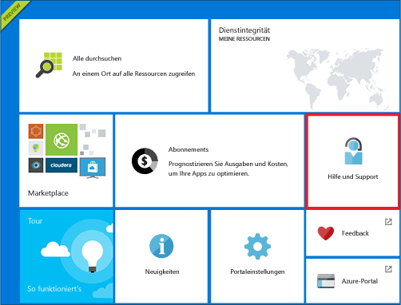
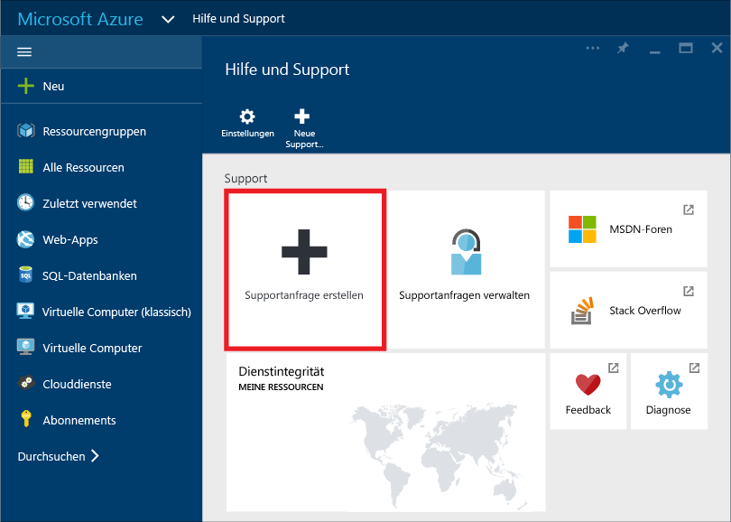
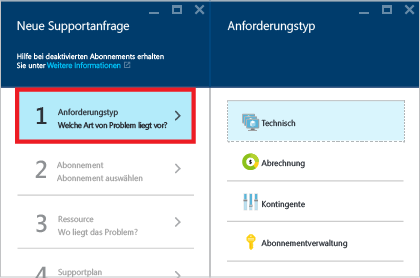
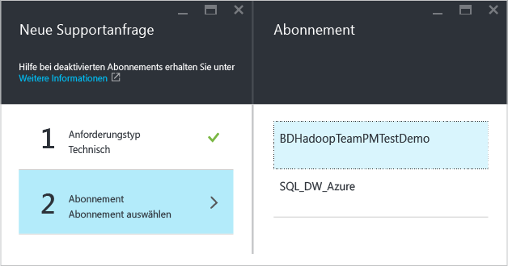
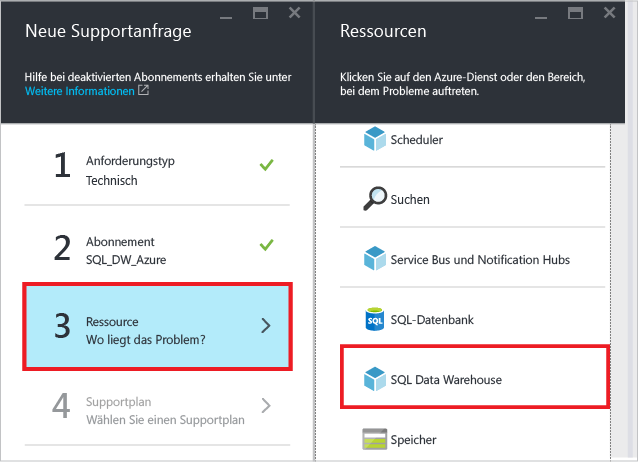
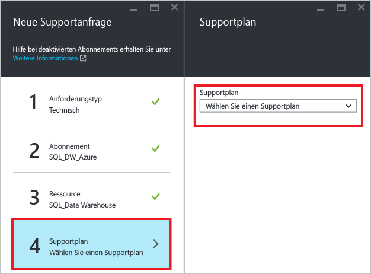
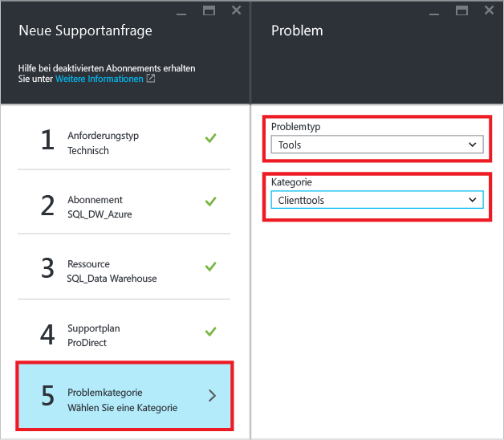
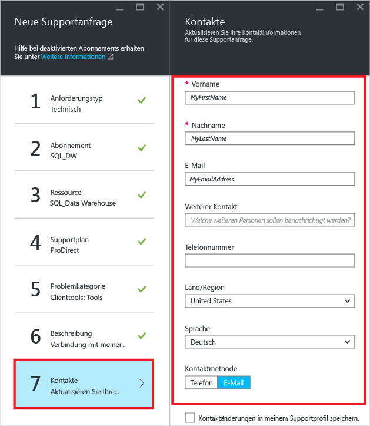
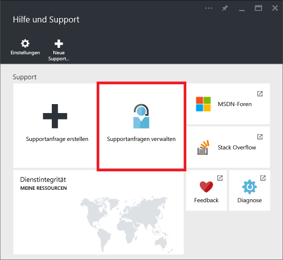

<properties
   pageTitle="Gewusst wie: Erstellen eines Supporttickets für SQL Data Warehouse | Microsoft Azure"
   description="Sie erfahren, wie Sie in Azure SQL Data Warehouse ein Supportticket erstellen."
   services="sql-data-warehouse"
   documentationCenter="NA"
   authors="sonyam"
   manager="barbkess"
   editor=""/>

<tags
   ms.service="sql-data-warehouse"
   ms.devlang="NA"
   ms.topic="get-started-article"
   ms.tgt_pltfrm="NA"
   ms.workload="data-services"
   ms.date="09/01/2016"
   ms.author="sonyama;barbkess"/>

# Gewusst wie: Erstellen eines Supporttickets für SQL Data Warehouse
 
Bei Problemen mit Ihrer Instanz von SQL Data Warehouse ist es ratsam, ein Supportticket zu erstellen, damit Sie Hilfe von unserem Entwicklungsteam erhalten können.

## Erstellen ein Supporttickets

1. Öffnen Sie das [Azure-Portal][].

2. Klicken Sie auf der Startseite auf die Kachel **Hilfe und Support**.

    

3. Klicken Sie auf dem Blatt „Hilfe und Support“ auf **Supportanfrage erstellen**.

    
    
    

4. Wählen Sie den **Typ der Anfrage** aus.

    
    
    >[AZURE.NOTE]  Standardmäßig verfügt jeder SQL-Server (z.B. myserver.database.windows.net) über ein **DTU-Kontingent** in Höhe von 45.000. Bei diesem Kontingentwert handelt es sich einfach um ein Sicherheitslimit. Sie können Ihr Kontingent erhöhen, indem Sie ein Supportticket erstellen und als Anfragetyp *Kontingent* wählen. Multiplizieren Sie zum Berechnen Ihrer DTU-Anforderungen die Anzahl der insgesamt benötigten [DWUs][] mit 7,5. Wenn Sie beispielsweise zwei DW6000-Einheiten auf einer SQL Server-Instanz hosten möchten, sollten Sie ein DTU-Kontingent in Höhe von 90.000 anfordern. Sie können den aktuellen DTU-Verbrauch im Portal auf dem Blatt „SQL-Server“ anzeigen. Sowohl angehaltene als auch nicht angehaltene Datenbanken werden in das DTU-Kontingent eingerechnet.

5. Wählen Sie das **Abonnement** aus, unter dem die Datenbank mit dem gemeldeten Problem gehostet wird.

    

6. Wählen Sie **SQL Data Warehouse** als Ressource aus.

    

7. Wählen Sie Ihren [Azure-Supportplan][].

    - Support für Fragen in Bezug auf **Verwaltung von Abrechnung, Kontingenten und Abonnements** ist in allen Supportstufen verfügbar.
    - **Problemlösungssupport** wird in den Supportstufen [Entwickler][], [Standard][], [Professional Direct][] oder [Premier][] bereitgestellt. Problemlösungssupport betrifft Probleme, die bei der Verwendung von Azure auftreten und bei denen Grund zu der Annahme besteht, dass das Problem durch Microsoft verursacht wurde.
    - **Anleitung für Entwickler** und **beratende Dienstleistungen** sind für die Supportstufen [Professional Direct][] und [Premier][] verfügbar.
    
    Wenn Sie über den Supportplan „Premier“ verfügen, können Sie mit SQL Data Warehouse verbundene Probleme auch im [Microsoft Premier-Onlineportal][] melden. Weitere Informationen zu den unterschiedlichen Supportplänen, z.B. zu Umfang, Reaktionszeiten, Preisen usw., finden Sie auf der Seite mit den [Azure-Supportplänen][Azure support plan]. Häufig gestellte Fragen zum Azure-Support finden Sie unter [Häufig gestellte Fragen zum Azure-Support][].

    

8. Wählen Sie **Problemtyp** und **Kategorie** aus.

    

9. Beschreiben Sie das Problem, und wählen Sie den Grad der geschäftlichen Auswirkungen aus.

    

10. Ihre **Kontaktinformationen** sind für dieses Supportticket bereits vorhanden. Aktualisieren Sie diese bei Bedarf.

    

11. Klicken Sie auf **Erstellen**, um die Supportanfrage zu übermitteln.

## Überwachen eines Supporttickets

Nachdem Sie die Supportanfrage übermittelt haben, nimmt das Azure-Supportteam Kontakt mit Ihnen auf. Klicken Sie zum Überprüfen des Anfragenstatus und der Details auf dem Dashboard auf **Supportanfragen verwalten**.

## Weitere Ressourcen

Außerdem können Sie sich auch an der SQL Data Warehouse-Community unter [Stack Overflow][] oder im [Azure SQL Data Warehouse-MSDN-Forum][] beteiligen.

<!--Image references--> 

<!--Article references--> 
[DWUs]: ./sql-data-warehouse-overview-what-is.md#data-warehouse-units

<!--MSDN references--> 

<!--Other web references--> 
[Azure-Portal]: https://portal.azure.com/
[Azure support plan]: https://azure.microsoft.com/support/plans/?WT.mc_id=Support_Plan_510979/
[Azure-Supportplan]: https://azure.microsoft.com/support/plans/?WT.mc_id=Support_Plan_510979/
[Entwickler]: https://azure.microsoft.com/support/plans/developer/
[Standard]: https://azure.microsoft.com/support/plans/standard/
[Professional Direct]: https://azure.microsoft.com/support/plans/prodirect/
[Premier]: https://azure.microsoft.com/support/plans/premier/
[Häufig gestellte Fragen zum Azure-Support]: https://azure.microsoft.com/support/faq/
[Microsoft Premier-Onlineportal]: https://premier.microsoft.com/
[Stack Overflow]: https://stackoverflow.com/questions/tagged/azure-sqldw/
[Azure SQL Data Warehouse-MSDN-Forum]: https://social.msdn.microsoft.com/Forums/home?forum=AzureSQLDataWarehouse/

<!----HONumber=AcomDC_0907_2016--->