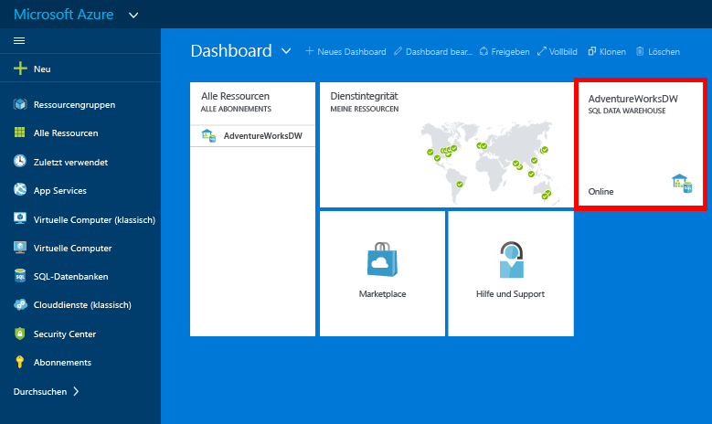

# Erstellen einer Azure SQL Data Warehouse-Instanz
> [!div class="op_single_selector"]
> * [Azure-Portal](sql-data-warehouse-get-started-provision.md)
> * [TSQL](sql-data-warehouse-get-started-create-database-tsql.md)
> * [PowerShell](sql-data-warehouse-get-started-provision-powershell.md)
>
>

In diesem Tutorial verwenden Sie das Azure-Portal zum Erstellen einer SQL Data Warehouse-Instanz, die eine AdventureWorksDW-Beispieldatenbank enthält.

## Voraussetzungen
Zunächst benötigen Sie Folgendes:

* **Azure-Konto:** Lesen Sie zum Erstellen eines Kontos die Informationen unter [Kostenlose Azure-Testversion][Azure Free Trial] oder [MSDN-Azure-Gutschriften][MSDN Azure Credits].
* **Azure SQL Server:** Weitere Einzelheiten finden Sie unter [Erstellen eines logischen Servers für Azure SQL-Datenbank mit dem Azure-Portal][Create an Azure SQL Database logical server with the Azure portal].

> [!NOTE]
> Wenn Sie eine SQL Data Warehouse-Instanz erstellen, wird dadurch unter Umständen auch ein neuer abrechenbarer Dienst erstellt.  Unter [SQL Data Warehouse – Preise][SQL Data Warehouse pricing] finden Sie weitere Informationen.
>
>

## Erstellen eines SQL Data Warehouse
1. Melden Sie sich beim [Azure-Portal](https://portal.azure.com)an.
2. Klicken Sie auf **Neu** > **Datenbanken** > **SQL Data Warehouse**.

    
3. Geben Sie die erforderlichen Informationen auf dem Blatt **SQL Data Warehouse** ein, und klicken Sie auf „Erstellen“.

    

   * **Server**: Es wird empfohlen, zuerst den Server auszuwählen.  
   * **Datenbankname**: Der Name, mit dem auf das SQL Data Warehouse verwiesen wird.  Dieser Name muss für den Server eindeutig sein.
   * **Leistung**: Es wird empfohlen, mit 400 [DWUs][DWU] zu beginnen. Bewegen Sie den Schieberegler nach links oder rechts, um die Leistung Ihres Data Warehouse anzupassen oder nach dem Erstellen hoch- oder herunterzuskalieren.  Weitere Informationen zu DWUs finden Sie in der Dokumentation zur [Skalierung](sql-data-warehouse-manage-compute-overview.md) oder auf der Seite mit unseren [Preisen][SQL Data Warehouse pricing].
   * **Abonnement**: Wählen Sie das [Abonnement] aus, für das diese SQL Data Warehouse-Instanz in Rechnung gestellt wird.
   * **Ressourcengruppe**: [Ressourcengruppen][Resource group] sind Container, die zum Verwalten einer Azure-Ressourcensammlung entwickelt wurden. Weitere Informationen zu [Ressourcengruppen](../azure-resource-manager/resource-group-overview.md).
   * **Auswählen der Quelle:** Klicken Sie auf **Quelle auswählen** > **Beispiel**. Azure füllt die Option **Beispiel auswählen** automatisch mit AdventureWorksDW auf.

   > [!NOTE]
   > Die Standardsortierung für eine SQL Data Warehouse-Instanz ist „SQL_Latin1_General_CP1_CI_AS“. Sollten Sie eine andere Sortierung benötigen, können Sie die Datenbank mithilfe von [T-SQL][T-SQL] mit einer anderen Sortierung erstellen.
   >
   >

1. Klicken Sie auf **Erstellen** , um Ihre SQL Data Warehouse-Instanz zu erstellen.
2. Warten Sie einige Minuten. Wenn Ihre Data Warehouse-Instanz bereit ist, wird wieder das [Azure-Portal](https://portal.azure.com)angezeigt. Sie finden Ihr SQL Data Warehouse in Ihrem Dashboard unter den SQL-Datenbanken oder in der Ressourcengruppe, mit der Sie es erstellt haben.

    

[!INCLUDE [SQL Database create server](../../includes/sql-database-create-new-server-firewall-portal.md)]

## Nächste Schritte
Nachdem Sie eine SQL Data Warehouse-Instanz erstellt haben, können Sie eine [Verbindung herstellen](sql-data-warehouse-connect-overview.md) und Abfragen durchführen.

Um Daten in SQL Data Warehouse zu laden, lesen Sie [Laden von Daten in SQL Data Warehouse](sql-data-warehouse-overview-load.md).

Wenn Sie versuchen, eine vorhandene Datenbank zu SQL Data Warehouse zu migrieren, lesen Sie die [Übersicht über die Migration](sql-data-warehouse-overview-migrate.md), oder verwenden Sie das [Hilfsprogramm für die Migration](sql-data-warehouse-migrate-migration-utility.md).

Firewall-Regeln können auch mithilfe von Transact-SQL konfiguriert werden. Weitere Informationen finden Sie unter [sp_set_firewall_rule][sp_set_firewall_rule] sowie unter [sp_set_database_firewall_rule][sp_set_database_firewall_rule].

Außerdem sollten Sie sich mit den [bewährten Methoden][Best practices] vertraut machen.

<!--Article references-->
[Create an Azure SQL Database logical server with the Azure portal]: ../sql-database/sql-database-get-started.md#create-logical-server-bk
[Create an Azure SQL Database logical server with PowerShell]: ../sql-database/sql-database-get-started-powershell.md#database-setup-create-a-resource-group-server-and-firewall-rule
[resource groups]: ../azure-resource-manager/resource-group-template-deploy-portal.md
[Best practices]: sql-data-warehouse-best-practices.md
[DWU]: sql-data-warehouse-overview-what-is.md#data-warehouse-units
[Abonnement]: ../azure-glossary-cloud-terminology.md#subscription
[resource group]: ../azure-glossary-cloud-terminology.md#resource-group
[T-SQL]: ./sql-data-warehouse-get-started-create-database-tsql.md

<!--MSDN references-->
[sp_set_firewall_rule]: https://msdn.microsoft.com/library/dn270017.aspx
[sp_set_database_firewall_rule]: https://msdn.microsoft.com/library/dn270010.aspx

<!--Other Web references-->
[SQL Data Warehouse pricing]: https://azure.microsoft.com/pricing/details/sql-data-warehouse/
[Azure Free Trial]: https://azure.microsoft.com/pricing/free-trial/?WT.mc_id=A261C142F
[MSDN Azure Credits]: https://azure.microsoft.com/pricing/member-offers/msdn-benefits-details/?WT.mc_id=A261C142F

<!--HONumber=Feb17_HO2-->

