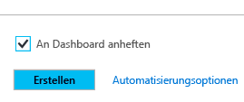
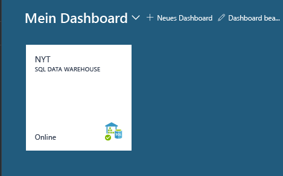
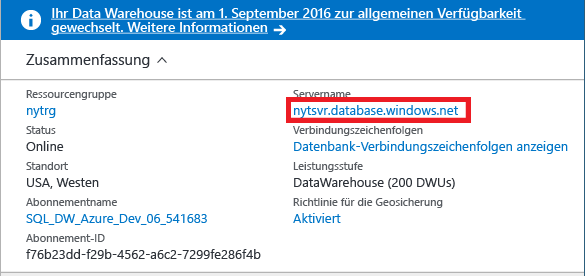
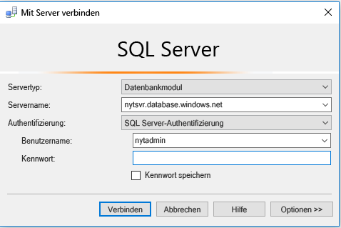
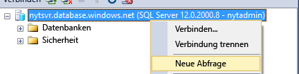
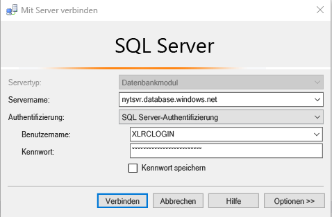
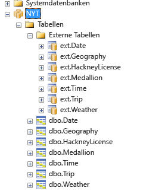
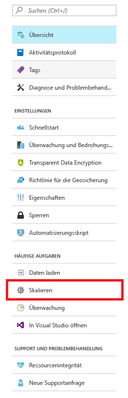
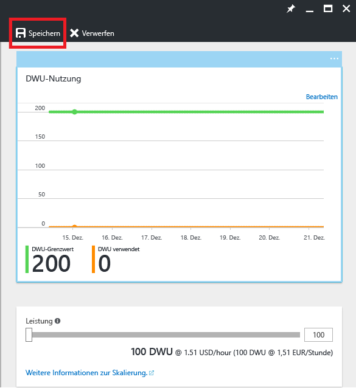

# <a name="get-started-with-sql-data-warehouse"></a>Erste Schritte mit SQL Data Warehouse

Enthält ein Tutorial zu den ersten Schritten für Azure SQL Data Warehouse. In diesem Tutorial werden die Grundlagen des Bereitstellens und Ladens von Daten in eine SQL Data Warehouse-Instanz sowie Grundlagen zu Skalierung, Pausierung und Optimierung vermittelt. 

**Geschätzter Zeitaufwand:** 75 Minuten

## <a name="prerequisites"></a>Voraussetzungen


### <a name="sign-up-for-microsoft-azure"></a>Für Microsoft Azure registrieren
Falls Sie noch nicht über ein Microsoft Azure-Konto verfügen, müssen Sie sich für ein Konto registrieren, um diesen Dienst nutzen zu können. Sie können diesen Schritt überspringen, wenn Sie schon im Besitz eines Kontos sind. 

1. Navigieren Sie zu den Kontoseiten unter [https://azure.microsoft.com/account/](https://azure.microsoft.com/account/).
2. Erstellen Sie ein kostenloses Azure-Konto, oder erwerben Sie ein kostenpflichtiges Konto.
3. Befolgen Sie die Anweisungen.

### <a name="install-appropriate-sql-client-driver-and-tools"></a>Installieren des richtigen SQL-Clienttreibers und der Tools

Mit den meisten SQL-Clienttools kann per JDBC, ODBC oder ADO.NET eine Verbindung mit Azure SQL Data Warehouse hergestellt werden. Aufgrund der Produktkomplexität und großen Zahl von T-SQL-Features, die von SQL Data Warehouse unterstützt werden, ist unter Umständen nicht jede Clientanwendung vollständig mit SQL Data Warehouse kompatibel.

Bei Ausführung eines Windows-Betriebssystems empfehlen wir die Verwendung von [Visual Studio] oder [SQL Server Management Studio].


[!INCLUDE [Create a new logical server](../../includes/sql-data-warehouse-create-logical-server.md)] 

[!INCLUDE [SQL Database create server](../../includes/sql-database-create-new-server-firewall-portal.md)]

## <a name="create-an-azure-sql-data-warehouse"></a>Erstellen einer Azure SQL Data Warehouse-Instanz

> [!NOTE]
> Wenn Sie eine SQL Data Warehouse-Instanz erstellen, wird dadurch unter Umständen auch ein neuer abrechenbarer Dienst erstellt.  Weitere Informationen finden Sie unter [SQL Data Warehouse – Preise](https://azure.microsoft.com/pricing/details/sql-data-warehouse/).
>


### <a name="create-a-sql-data-warehouse"></a>Erstellen eines SQL Data Warehouse
1. Melden Sie sich beim [Azure-Portal](https://portal.azure.com)an.
2. Klicken Sie auf **Neu** > **Datenbanken** > **SQL Data Warehouse**.

    
    

3. Angeben der Bereitstellungsdetails

    **Datenbankname**: Wählen Sie einen beliebigen Namen. Wenn Sie über mehrere SQL DW-Instanzen verfügen, ist es ratsam, dass der Name Angaben wie Region, Umgebung usw. enthält, z.B. *mydw-westus-1-test*.

    **Abonnement**: Ihr Azure-Abonnement

    **Ressourcengruppe**: Erstellen Sie eine neue Gruppe (oder verwenden Sie eine vorhandene Gruppe, wenn Sie die Azure SQL Data Warehouse-Instanz zusammen mit anderen Diensten nutzen möchten).
    > [!NOTE]
    > Dienste innerhalb einer Ressourcengruppe sollten über den gleichen Lebenszyklus verfügen. Ressourcengruppen sind für die Ressourcenverwaltung nützlich, z.B. das Einrichten der Zugriffssteuerung und die Bereitstellung über Vorlagen. Weitere Informationen zu Azure-Ressourcengruppen und den bewährten Methoden finden Sie [hier](https://docs.microsoft.com/azure/azure-resource-manager/resource-group-overview#resource-groups).
    >

    **Quelle**: Leere Datenbank

    **Server**: Wählen Sie den Server, den Sie unter [Voraussetzungen] erstellt haben.

    **Sortierung**: Behalten Sie die Standardsortierung „SQL_Latin1_General_CP1_CI_AS“ bei.

    **Leistung auswählen**: Wir empfehlen Ihnen, die Standardleistung von 400 DWUs beizubehalten.

4. Wählen Sie **An Dashboard anheften**
    

5. Lehnen Sie sich zurück, und warten Sie auf die Bereitstellung Ihrer Azure SQL Data Warehouse-Instanz! Dieser Prozess dauert normalerweise mehrere Minuten. Sie werden vom Portal benachrichtigt, wenn die Bereitstellung der Instanz abgeschlossen ist. 

## <a name="connect-to-azure-sql-data-warehouse-through-sql-server-logical-server"></a>Herstellen einer Verbindung mit Azure SQL Data Warehouse per SQL Server (logischer Server)

In diesem Tutorial wird SQL Server Management Studio verwendet, um eine Verbindung mit unserer SQL Data Warehouse-Instanz herzustellen. Andere Tools können zum Herstellen der Verbindung mit SQL Data Warehouse über unsere unterstützten Connectors verwendet werden: ADO.NET, JDBC, ODBC und PHP. Beachten Sie, dass die Funktionalität für Tools, die nicht von Microsoft unterstützt werden, eingeschränkt sein kann.


### <a name="get-connection-information"></a>Abrufen von Verbindungsinformationen

Zum Herstellen einer Verbindung mit Ihrer SQL Data Warehouse-Instanz müssen Sie die SQL Server-Instanz (logischer Server) verwenden, die Sie unter [Voraussetzungen] erstellt haben.

1. Wählen Sie Ihre SQL Data Warehouse-Instanz im Dashboard aus, oder suchen Sie in Ihren Ressourcen danach.

    

2. Suchen Sie nach dem vollständigen Namen für den logischen Server.

    

3. Öffnen Sie SSMS, und verwenden Sie den Objekt-Explorer, um eine Verbindung mit diesem Server herzustellen, indem Sie die unter [Voraussetzungen] erstellten Anmeldeinformationen verwenden.

    

Wenn keine Probleme auftreten, sollte die Verbindung mit Ihrer SQL Server-Instanz (logischer Server) jetzt hergestellt werden. Sie können Serveranmeldeinformationen verwenden, um sich für jede Datenbank auf dem Server als Datenbankbesitzer zu authentifizieren. Die bewährte Methode besteht aber darin, für jede Datenbank separate Anmeldungen und Benutzer zu erstellen. Auf die Benutzererstellung wird unter [Erstellen eines Benutzers für SQL Data Warehouse](./sql-data-warehouse-get-started-tutorial.md#create-a-user-for-sql-data-warehouse) näher eingegangen. 

## <a name="create-a-user-for-sql-data-warehouse"></a>Erstellen eines Benutzers für SQL Data Warehouse

### <a name="why-create-a-separate-user"></a>Warum soll ein separater Benutzer erstellt werden?

Wir verwenden die Verbindung mit der SQL Server-Instanz (logischer Server) – mit den Serveranmeldeinformationen aus dem vorherigen Schritt –, um für unsere SQL Data Warehouse-Instanz einen neuen Benutzer zu erstellen. Es gibt zwei Hauptgründe, warum es hilfreich sein kann, einen separaten Benutzer bzw. eine separate Anmeldung für Ihre SQL DW-Instanz zu erstellen.

1.  Die Benutzer in Ihrer Organisation sollen ein anderes Konto für die Authentifizierung verwenden. Auf diese Weise können Sie die Anzahl von Berechtigungen, die der Anwendung gewährt werden, beschränken und das Risiko böswilliger Aktivitäten reduzieren.

2. Für die Serveradministratoranmeldung, die Sie derzeit verwenden, wird standardmäßig eine kleinere Ressourcenklasse verwendet. Mithilfe von Ressourcenklassen steuern Sie die Speicherzuweisung und die zugewiesenen CPU-Zyklen einer Abfrage. Benutzer in **smallrc** erhalten eine geringere Menge an Arbeitsspeicher und können von höherer Parallelität profitieren. Im Gegensatz dazu wird Benutzern, die **xlargerc** zugewiesen sind, eine große Menge an Arbeitsspeicher gewährt. Dies bedeutet, dass ein geringerer Anteil ihrer Abfragen gleichzeitig ausgeführt werden kann. Wenn beim Laden von Daten eine möglichst optimale Komprimierung wichtig ist, sollten Sie sicherstellen, dass der Benutzer, von dem die Daten geladen werden, einer größeren Ressourcenklasse angehört. Weitere Informationen zu Ressourcenklassen finden Sie [hier](./sql-data-warehouse-develop-concurrency.md#resource-classes):

### <a name="creating-a-user-of-a-larger-resource-class"></a>Erstellen eines Benutzers einer größeren Ressourcenklasse

1. Erstellen Sie eine neue Abfrage für die Datenbank **master** auf Ihrem Server.

    

    

2. Erstellen Sie eine Serveranmeldung und einen Benutzer.

    ```sql
    CREATE LOGIN XLRCLOGIN WITH PASSWORD = 'a123reallySTRONGpassword!';
    CREATE USER LoadingUser FOR LOGIN XLRCLOGIN;
    ```

3. Erstellen Sie einen neuen Datenbankbenutzer basierend auf der Serveranmeldung.
    ```sql
    CREATE USER LoadingUser FOR LOGIN XLRCLOGIN;
    ```

4. Gewähren Sie dem Benutzer die Kontrolle über die Benutzerdatenbank.
    ```sql
    GRANT CONTROL ON DATABASE::[NYT] to LoadingUser;
    ```
    > [!NOTE]
    > Falls der Datenbankname Bindestriche enthält, müssen Sie ihn in Klammern setzen. 
    >

5. Fügen Sie den Datenbankbenutzer der Ressourcenklassenrolle **xlargerc** hinzu.
    ```sql
    EXEC sp_addrolememeber 'xlargerc', 'LoadingUser';
    ```

6. Melden Sie sich an der Datenbank mit Ihren neuen Anmeldeinformationen an.

    


## <a name="loading-data"></a>Laden von Daten

### <a name="defining-external-data"></a>Definieren von externen Daten
1. Definieren Sie eine externe Datenquelle.

    ```sql
    CREATE EXTERNAL DATA SOURCE NYTPublic
    WITH
    (
    TYPE = Hadoop
    , LOCATION = 'wasbs://2013@nytpublic.blob.core.windows.net/'
    );
    ```


2. Definieren Sie die externen Dateiformate.

    Der Befehl ```CREATE EXTERNAL FILE FORMAT``` wird verwendet, um das Format der externen Daten anzugeben, die als Quelle für den Ladevorgang dienen. Für die Taxidaten für New York haben wir zwei Formate zum Speichern der Daten in Azure Blob Storage verwendet.

    ```sql
    CREATE EXTERNAL FILE FORMAT uncompressedcsv
    WITH
    ( FORMAT_TYPE = DELIMITEDTEXT
    , FORMAT_OPTIONS ( FIELD_TERMINATOR = ','
    , STRING_DELIMITER = ''
    , DATE_FORMAT = ''
    , USE_TYPE_DEFAULT = False
    )
    );

    CREATE EXTERNAL FILE FORMAT compressedcsv
    WITH
    ( FORMAT_TYPE = DELIMITEDTEXT
    , FORMAT_OPTIONS ( FIELD_TERMINATOR = '|'
    , STRING_DELIMITER = ''
    , DATE_FORMAT = ''
    , USE_TYPE_DEFAULT = False
    )
    , DATA_COMPRESSION = 'org.apache.hadoop.io.compress.GzipCodec'
    );
    ```

3.  Erstellen Sie ein Schema für das Format externer Dateien.

    ```sql
    CREATE SCHEMA ext;
    GO
    ```

4. Erstellen Sie die externen Tabellen. In diesen Tabellen wird auf Daten verwiesen, die in HDFS oder Azure Blob Storage gespeichert sind. 

    ```sql
    CREATE EXTERNAL TABLE [ext].[Date] 
    (
    [DateID] int NOT NULL,
    [Date] datetime NULL,
    [DateBKey] char(10) COLLATE SQL_Latin1_General_CP1_CI_AS NULL,
    [DayOfMonth] varchar(2) COLLATE SQL_Latin1_General_CP1_CI_AS NULL,
    [DaySuffix] varchar(4) COLLATE SQL_Latin1_General_CP1_CI_AS NULL,
    [DayName] varchar(9) COLLATE SQL_Latin1_General_CP1_CI_AS NULL,
    [DayOfWeek] char(1) COLLATE SQL_Latin1_General_CP1_CI_AS NULL,
    [DayOfWeekInMonth] varchar(2) COLLATE SQL_Latin1_General_CP1_CI_AS NULL,
    [DayOfWeekInYear] varchar(2) COLLATE SQL_Latin1_General_CP1_CI_AS NULL,
    [DayOfQuarter] varchar(3) COLLATE SQL_Latin1_General_CP1_CI_AS NULL,
    [DayOfYear] varchar(3) COLLATE SQL_Latin1_General_CP1_CI_AS NULL,
    [WeekOfMonth] varchar(1) COLLATE SQL_Latin1_General_CP1_CI_AS NULL,
    [WeekOfQuarter] varchar(2) COLLATE SQL_Latin1_General_CP1_CI_AS NULL,
    [WeekOfYear] varchar(2) COLLATE SQL_Latin1_General_CP1_CI_AS NULL,
    [Month] varchar(2) COLLATE SQL_Latin1_General_CP1_CI_AS NULL,
    [MonthName] varchar(9) COLLATE SQL_Latin1_General_CP1_CI_AS NULL,
    [MonthOfQuarter] varchar(2) COLLATE SQL_Latin1_General_CP1_CI_AS NULL,
    [Quarter] char(1) COLLATE SQL_Latin1_General_CP1_CI_AS NULL,
    [QuarterName] varchar(9) COLLATE SQL_Latin1_General_CP1_CI_AS NULL,
    [Year] char(4) COLLATE SQL_Latin1_General_CP1_CI_AS NULL,
    [YearName] char(7) COLLATE SQL_Latin1_General_CP1_CI_AS NULL,
    [MonthYear] char(10) COLLATE SQL_Latin1_General_CP1_CI_AS NULL,
    [MMYYYY] char(6) COLLATE SQL_Latin1_General_CP1_CI_AS NULL,
    [FirstDayOfMonth] date NULL,
    [LastDayOfMonth] date NULL,
    [FirstDayOfQuarter] date NULL,
    [LastDayOfQuarter] date NULL,
    [FirstDayOfYear] date NULL,
    [LastDayOfYear] date NULL,
    [IsHolidayUSA] bit NULL,
    [IsWeekday] bit NULL,
    [HolidayUSA] varchar(50) COLLATE SQL_Latin1_General_CP1_CI_AS NULL
    )
    WITH
    (
    LOCATION = 'Date'
    , DATA_SOURCE = NYTPublic
    , FILE_FORMAT = uncompressedcsv
    , REJECT_TYPE = value
    , REJECT_VALUE = 0
    )
    CREATE EXTERNAL TABLE [ext].[Geography]
    (
    [GeographyID] int NOT NULL,
    [ZipCodeBKey] varchar(10) COLLATE SQL_Latin1_General_CP1_CI_AS NOT NULL,
    [County] varchar(50) COLLATE SQL_Latin1_General_CP1_CI_AS NULL,
    [City] varchar(50) COLLATE SQL_Latin1_General_CP1_CI_AS NULL,
    [State] varchar(50) COLLATE SQL_Latin1_General_CP1_CI_AS NULL,
    [Country] varchar(50) COLLATE SQL_Latin1_General_CP1_CI_AS NULL,
    [ZipCode] varchar(50) COLLATE SQL_Latin1_General_CP1_CI_AS NULL
    )
    WITH
    (
    LOCATION = 'Geography'
    , DATA_SOURCE = NYTPublic
    , FILE_FORMAT = uncompressedcsv
    , REJECT_TYPE = value
    , REJECT_VALUE = 0 
    )
    ;
    CREATE EXTERNAL TABLE [ext].[HackneyLicense]
    (
    [HackneyLicenseID] int NOT NULL,
    [HackneyLicenseBKey] varchar(50) COLLATE SQL_Latin1_General_CP1_CI_AS NOT NULL,
    [HackneyLicenseCode] varchar(50) COLLATE SQL_Latin1_General_CP1_CI_AS NULL
    )
    WITH
    (
    LOCATION = 'HackneyLicense'
    , DATA_SOURCE = NYTPublic
    , FILE_FORMAT = uncompressedcsv
    , REJECT_TYPE = value
    , REJECT_VALUE = 0
    )
    ;
    CREATE EXTERNAL TABLE [ext].[Medallion]
    (
    [MedallionID] int NOT NULL,
    [MedallionBKey] varchar(50) COLLATE SQL_Latin1_General_CP1_CI_AS NOT NULL,
    [MedallionCode] varchar(50) COLLATE SQL_Latin1_General_CP1_CI_AS NULL
    )
    WITH
    (
    LOCATION = 'Medallion'
    , DATA_SOURCE = NYTPublic
    , FILE_FORMAT = uncompressedcsv
    , REJECT_TYPE = value
    , REJECT_VALUE = 0
    )
    ;
    CREATE EXTERNAL TABLE [ext].[Time]
    (
    [TimeID] int NOT NULL,
    [TimeBKey] varchar(8) COLLATE SQL_Latin1_General_CP1_CI_AS NOT NULL,
    [HourNumber] tinyint NOT NULL,
    [MinuteNumber] tinyint NOT NULL,
    [SecondNumber] tinyint NOT NULL,
    [TimeInSecond] int NOT NULL,
    [HourlyBucket] varchar(15) COLLATE SQL_Latin1_General_CP1_CI_AS NOT NULL,
    [DayTimeBucketGroupKey] int NOT NULL,
    [DayTimeBucket] varchar(100) COLLATE SQL_Latin1_General_CP1_CI_AS NOT NULL
    )
    WITH
    (
    LOCATION = 'Time'
    , DATA_SOURCE = NYTPublic
    , FILE_FORMAT = uncompressedcsv
    , REJECT_TYPE = value
    , REJECT_VALUE = 0
    )
    ;
    CREATE EXTERNAL TABLE [ext].[Trip]
    (
    [DateID] int NOT NULL,
    [MedallionID] int NOT NULL,
    [HackneyLicenseID] int NOT NULL,
    [PickupTimeID] int NOT NULL,
    [DropoffTimeID] int NOT NULL,
    [PickupGeographyID] int NULL,
    [DropoffGeographyID] int NULL,
    [PickupLatitude] float NULL,
    [PickupLongitude] float NULL,
    [PickupLatLong] varchar(50) COLLATE SQL_Latin1_General_CP1_CI_AS NULL,
    [DropoffLatitude] float NULL,
    [DropoffLongitude] float NULL,
    [DropoffLatLong] varchar(50) COLLATE SQL_Latin1_General_CP1_CI_AS NULL,
    [PassengerCount] int NULL,
    [TripDurationSeconds] int NULL,
    [TripDistanceMiles] float NULL,
    [PaymentType] varchar(50) COLLATE SQL_Latin1_General_CP1_CI_AS NULL,
    [FareAmount] money NULL,
    [SurchargeAmount] money NULL,
    [TaxAmount] money NULL,
    [TipAmount] money NULL,
    [TollsAmount] money NULL,
    [TotalAmount] money NULL
    )
    WITH
    (
    LOCATION = 'Trip2013'
    , DATA_SOURCE = NYTPublic
    , FILE_FORMAT = compressedcsv
    , REJECT_TYPE = value
    , REJECT_VALUE = 0
    )
    ;
    CREATE EXTERNAL TABLE [ext].[Weather]
    (
    [DateID] int NOT NULL,
    [GeographyID] int NOT NULL,
    [PrecipitationInches] float NOT NULL,
    [AvgTemperatureFahrenheit] float NOT NULL
    )
    WITH
    (
    LOCATION = 'Weather2013'
    , DATA_SOURCE = NYTPublic
    , FILE_FORMAT = uncompressedcsv
    , REJECT_TYPE = value
    , REJECT_VALUE = 0
    )
    ;
    ```

### <a name="create-table-as-select-ctas"></a>Create Table as Select (CTAS)

5. Laden Sie Ihre Daten aus externen Tabellen in Ihre SQL Data Warehouse-Instanz. 
    ```sql
    CREATE TABLE [dbo].[Date]
    WITH
    ( DISTRIBUTION = ROUND_ROBIN
    , CLUSTERED COLUMNSTORE INDEX
    )
    AS
    SELECT *
    FROM [ext].[Date]
    OPTION (LABEL = 'CTAS : Load [dbo].[Date]')
    ;
    CREATE TABLE [dbo].[Geography]
    WITH
    ( DISTRIBUTION = ROUND_ROBIN
    , CLUSTERED COLUMNSTORE INDEX
    )
    AS
    SELECT *
    FROM [ext].[Geography]
    OPTION (LABEL = 'CTAS : Load [dbo].[Geography]')
    ;
    CREATE TABLE [dbo].[HackneyLicense]
    WITH
    ( DISTRIBUTION = ROUND_ROBIN
    , CLUSTERED COLUMNSTORE INDEX
    )
    AS
    SELECT *
    FROM [ext].[HackneyLicense]
    OPTION (LABEL = 'CTAS : Load [dbo].[HackneyLicense]')
    ;
    CREATE TABLE [dbo].[Medallion]
    WITH
    ( DISTRIBUTION = ROUND_ROBIN
    , CLUSTERED COLUMNSTORE INDEX
    )
    AS
    SELECT *
    FROM [ext].[Medallion]
    OPTION (LABEL = 'CTAS : Load [dbo].[Medallion]')
    ;
    CREATE TABLE [dbo].[Time]
    WITH
    ( DISTRIBUTION = ROUND_ROBIN
    , CLUSTERED COLUMNSTORE INDEX
    )
    AS
    SELECT *
    FROM [ext].[Time]
    OPTION (LABEL = 'CTAS : Load [dbo].[Time]')
    ;
    CREATE TABLE [dbo].[Weather]
    WITH
    ( DISTRIBUTION = ROUND_ROBIN
    , CLUSTERED COLUMNSTORE INDEX
    )
    AS
    SELECT *
    FROM [ext].[Weather]
    OPTION (LABEL = 'CTAS : Load [dbo].[Weather]')
    ;
    CREATE TABLE [dbo].[Trip]
    WITH
    ( DISTRIBUTION = ROUND_ROBIN
    , CLUSTERED COLUMNSTORE INDEX
    )
    AS
    SELECT *
    FROM [ext].[Trip]
    OPTION (LABEL = 'CTAS : Load [dbo].[Trip]')
    ;
    ```

    > [!NOTE]
    > Sie laden mehrere GB an Daten und komprimieren diese in hoch performante gruppierte Columnstore-Indizes. Führen Sie folgende DMV-Abfrage aus. Dann haben Sie Zeit für einen Kaffee oder einen Snack, während Azure SQL Data Warehouse diesen etwas aufwändigeren Vorgang für Sie durchführt.
    >

6. Erstellen Sie eine neue Abfrage, und verfolgen Sie, wie Ihre Daten für diese dynamische Verwaltungssicht (Dynamic Management View, DMV) erscheinen.

    ```sql
    SELECT
    r.command,
    s.request_id,
    r.status,
    count(distinct input_name) as nbr_files,
    sum(s.bytes_processed)/1024/1024 as gb_processed
    FROM
    sys.dm_pdw_exec_requests r
    inner join sys.dm_pdw_dms_external_work s
    on r.request_id = s.request_id
    WHERE
    r.[label] = 'CTAS : Load [dbo].[Date]' OR
    r.[label] = 'CTAS : Load [dbo].[Geography]' OR
    r.[label] = 'CTAS : Load [dbo].[HackneyLicense]' OR
    r.[label] = 'CTAS : Load [dbo].[Medallion]' OR
    r.[label] = 'CTAS : Load [dbo].[Time]' OR
    r.[label] = 'CTAS : Load [dbo].[Weather]' OR
    r.[label] = 'CTAS : Load [dbo].[Trip]'
    GROUP BY
    r.command,
    s.request_id,
    r.status
    ORDER BY
    nbr_files desc, gb_processed desc;
    ```

7. Zeigen Sie alle Systemabfragen an.

    ```sql
    SELECT * FROM sys.dm_pdw_exec_requests;
    ```

8. Freuen Sie sich darüber, dass Ihre Daten sauber in die Azure SQL Data Warehouse-Instanz geladen werden.

    


## <a name="querying-data"></a>Abfragen von Daten 

### <a name="scan-query-with-scaling"></a>Scannen der Abfrage mit Skalierung

Hier wird veranschaulicht, wie sich die Skalierung auf die Geschwindigkeit Ihrer Abfragen auswirkt.

Bevor wir beginnen, skalieren wir unseren Vorgang zentral auf 100 DWUs herunter, damit wir einschätzen können, über welche Leistung ein Computeknoten allein verfügt.

1. Navigieren Sie zum Portal, und wählen Sie Ihre SQL Data Warehouse-Instanz aus.

2. Wählen Sie auf dem Blatt „SQL Data Warehouse“ die Option „Skalieren“. 

    

3. Skalieren Sie die Leistung zentral auf 100 DWUs herunter, und klicken Sie auf „Speichern“.

    

4. Warten Sie, bis der Skalierungsvorgang abgeschlossen ist.

    > [!NOTE]
    > Beachten Sie hierbei, dass Skalierungsvorgänge derzeit ausgeführte Abfragen **beenden** und die Ausführung neuer Abfragen verhindern.
    >
    
5. Führen Sie einen Scanvorgang für die Taxi-Verkehrsdaten durch, indem Sie die erste Million der Einträge für alle Spalten auswählen. Falls Sie sich nicht so lange aufhalten möchten, können Sie auch weniger Zeilen wählen.

    ```sql
    SELECT TOP(1000000) * FROM dbo.[Trip]
    ```

Notieren Sie sich, wie lange dieser Vorgang gedauert hat.

6. Skalieren Sie Ihre Instanz zentral auf 400 DWUs hoch. Beachten Sie, dass für 100 DWUs Ihrer Azure SQL Data Warehouse-Instanz jeweils ein weiterer Computeknoten hinzugefügt wird.

7. Führen Sie die Abfrage erneut aus! Es sollte ein deutlicher Unterschied zu sehen sein. 

> [!NOTE]
> Azure SQL Data Warehouse ist eine MPP-Plattform (Massively Parallel Processing). Für Abfragen und Vorgänge, bei denen Arbeit auf verschiedenen Knoten parallel ausgeführt werden kann, kommt die wahre Leistungsstärke von Azure SQL Data Warehouse zum Tragen.
>

### <a name="join-query-with-statistics"></a>Verknüpfen von Abfragen mit Statistiken

1. Führen Sie eine Abfrage aus, bei der die Datumstabelle mit der Fahrttabelle verknüpft wird.

    ```sql
    SELECT TOP (1000000) dt.[DayOfWeek]
    ,tr.[MedallionID]
    ,tr.[HackneyLicenseID]
    ,tr.[PickupTimeID]
    ,tr.[DropoffTimeID]
    ,tr.[PickupGeographyID]
    ,tr.[DropoffGeographyID]
    ,tr.[PickupLatitude]
    ,tr.[PickupLongitude]
    ,tr.[PickupLatLong]
    ,tr.[DropoffLatitude]
    ,tr.[DropoffLongitude]
    ,tr.[DropoffLatLong]
    ,tr.[PassengerCount]
    ,tr.[TripDurationSeconds]
    ,tr.[TripDistanceMiles]
    ,tr.[PaymentType]
    ,tr.[FareAmount]
    ,tr.[SurchargeAmount]
    ,tr.[TaxAmount]
    ,tr.[TipAmount]
    ,tr.[TollsAmount]
    ,tr.[TotalAmount]
    FROM [dbo].[Trip] as tr
    join
    dbo.[Date] as dt
    on tr.DateID = dt.DateID
    ```

    Die Abfrage dauert erwartungsgemäß deutlich länger, wenn Sie Daten zwischen den Knoten verschieben. Dies gilt vor allem für ein Verknüpfungsszenario wie in diesem Fall.

2. Wir sehen uns an, was für eine Auswirkung es hat, wenn wir für die zu verknüpfende Spalte Statistiken erstellen, indem wir Folgendes ausführen:

    ```sql
    CREATE STATISTICS [dbo.Date DateID stats] ON dbo.Date (DateID);
    CREATE STATISTICS [dbo.Trip DateID stats] ON dbo.Trip (DateID);
    ```

    > [!NOTE]
    > In SQL DW wird normalerweise keine automatische Verwaltung von Statistiken für Sie durchgeführt. Statistiken sind wichtig für die Abfrageleistung, und es wird dringend empfohlen, Statistiken zu erstellen und zu aktualisieren.
    > 
    > **Die größten Vorteile ergeben sich, wenn Sie Statistiken für Spalten in Verknüpfungen, in der WHERE-Klausel verwendete Spalten und Spalten in GROUP BY nutzen.**
    >

3. Führen Sie die Abfrage aus „Voraussetzungen“ erneut aus, und achten Sie auf Leistungsunterschiede. Die Unterschiede der Abfrageleistung sind nicht so drastisch wie beim zentralen Hochskalieren, aber es sollte eine Beschleunigung zu beobachten sein. 

## <a name="next-steps"></a>Nächste Schritte

Sie haben jetzt alles vorbereitet, um Abfragen und Untersuchungen durchzuführen. Sehen Sie sich unsere bewährten Methoden und Tipps an.

Denken Sie daran, Ihre Instanz zu pausieren, wenn Sie mit der Arbeit eines Tages fertig sind! In der Produktion können Sie enorme Einsparungen erzielen, wenn Sie pausieren und die Skalierung jeweils an Ihre Geschäftsanforderungen anpassen.


## <a name="useful-readings"></a>Nützliche Messdaten

[Parallelitäts- und Workloadverwaltung]

[Bewährte Methoden für Azure SQL Data Warehouse]

[Abfrageüberwachung]

[Die besten zehn bewährten Methoden zum Erstellen eines großen relationalen Data Warehouse]

[Migrieren von Daten zu Azure SQL Data Warehouse]


[Parallelitäts- und Workloadverwaltung]: sql-data-warehouse-develop-concurrency.md#change-a-user-resource-class-example
[Bewährte Methoden für Azure SQL Data Warehouse]: sql-data-warehouse-best-practices.md#hash-distribute-large-tables
[Abfrageüberwachung]: sql-data-warehouse-manage-monitor.md
[Die besten zehn bewährten Methoden zum Erstellen eines großen relationalen Data Warehouse]: https://blogs.msdn.microsoft.com/sqlcat/2013/09/16/top-10-best-practices-for-building-a-large-scale-relational-data-warehouse/
[Migrieren von Daten zu Azure SQL Data Warehouse]: https://blogs.msdn.microsoft.com/sqlcat/2016/08/18/migrating-data-to-azure-sql-data-warehouse-in-practice/


[!INCLUDE [Additional Resources](../../includes/sql-data-warehouse-article-footer.md)]

<!-- Internal Links -->
[Voraussetzungen]: sql-data-warehouse-get-started-tutorial.md#prerequisites

<!--Other Web references-->
[Visual Studio]: https://www.visualstudio.com/
[SQL Server Management Studio]: https://msdn.microsoft.com/en-us/library/mt238290.aspx


<!--HONumber=Jan17_HO2-->


