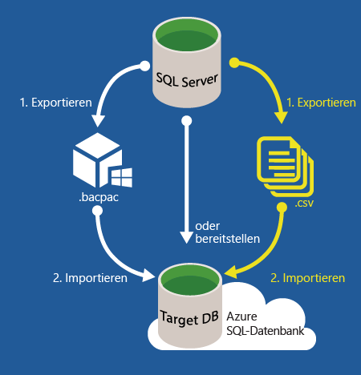

# Migrieren einer SQL Server-Datenbank zu Azure SQL-Datenbank in der Cloud
In diesem Artikel erfahren Sie, wie Sie eine lokale SQL Server-Datenbank (ab SQL Server 2005) zu einer Azure SQL-Datenbank migrieren. Im Zuge des Datenbankmigrationsprozesses werden sowohl Ihr Schema als auch Ihre Daten aus der SQL Server-Datenbank in Ihrer aktuellen Umgebung in die SQL-Datenbank migriert. Damit dies gelingt, muss die vorhandene Datenbank zuerst den Kompatibilitätstest bestehen. Mit SQL-Datenbank V12 nähern wir uns der [Featureübereinstimmung](sql-database-features.md), die nicht Vorgänge auf Serverebene und datenbankübergreifende Vorgänge betrifft. Datenbanken und Anwendungen, die auf [teilweise oder nicht unterstützten Funktionen](sql-database-transact-sql-information.md) basieren, müssen zum Beheben dieser Kompatibilitätsprobleme vor der Migration der SQL Server-Datenbank etwas umstrukturiert werden.

Die Migration erfolgt in folgenden Schritten:

* **Testen auf Kompatibilität**: Überprüfen Sie die Datenbankkompatibilität mit SQL-Datenbank. 
* **Beheben von ggf. vorhandenen Kompatibilitätsproblemen**: Wenn die Überprüfung fehlschlägt, müssen Sie die Überprüfungsfehler beheben.  
* **Durchführen der Migration** : Sobald die Datenbank kompatibel ist, können Sie mit verschiedenen Methoden die Migration durchführen. 

SQL Server bietet mehrere Methoden für jede dieser Aufgaben. Dieser Artikel bietet eine Übersicht über die verfügbaren Methoden für jede Aufgabe. Das folgende Diagramm veranschaulicht die Schritte und die Methoden.

  

> [!NOTE]
> Informationen zum Migrieren einer SQL Server-fremden Datenbank (einschließlich Microsoft Access, Sybase, MySQL Oracle und DB2) zu einer Azure SQL-Datenbank finden Sie unter [SQL Server-Migrations-Assistent](http://blogs.msdn.com/b/ssma/).
> 
> 

## Datenbankmigrationstools zum Testen der SQL Server-Datenbankkompatibilität mit SQL-Datenbank
Um vor dem Start des Datenbankmigrationsprozesses auf Kompatibilitätsprobleme mit SQL-Datenbank zu prüfen, verwenden Sie eine der folgenden Methoden:

> [!div class="op_single_selector"]
> * [SSDT](sql-database-cloud-migrate-fix-compatibility-issues-ssdt.md)
> * [SqlPackage](sql-database-cloud-migrate-determine-compatibility-sqlpackage.md)
> * [SSMS](sql-database-cloud-migrate-determine-compatibility-ssms.md)
> * [SAMW](sql-database-cloud-migrate-fix-compatibility-issues.md)
> 
> 

* [SQL Server Data Tools für Visual Studio (SSDT)](sql-database-cloud-migrate-fix-compatibility-issues-ssdt.md): SSDT verwendet die neuesten Kompatibilitätsregeln, um Inkompatibilitäten mit SQL-Datenbank V12 zu erkennen. Wenn Inkompatibilitäten erkannt werden, können Sie erkannte Probleme direkt in diesem Tool beheben. Diese Methode wird zum Testen und Beheben von Kompatibilitätsproblemen mit SQL-Datenbank V12 empfohlen. 
* [SqlPackage](sql-database-cloud-migrate-determine-compatibility-sqlpackage.md): SqlPackage ist ein Befehlszeilen-Hilfsprogramm, das Kompatibilitätsprobleme erkennt und ggf. einen entsprechenden Bericht generiert. Verwenden Sie immer die neueste Version dieses Tools, um über die neuesten Kompatibilitätsregeln zu verfügen. Wenn Fehler gefunden werden, müssen Sie ein anderes Tool verwenden, um alle erkannten Kompatibilitätsprobleme zu beheben. Dazu wird SSDT empfohlen.  
* [Der Assistent „Datenebenenanwendung exportieren“ in SQL Server Management Studio](sql-database-cloud-migrate-determine-compatibility-ssms.md): Dieser Assistent erkennt Fehler und zeigt sie auf dem Bildschirm an. Wenn keine Fehler gefunden werden, können Sie fortfahren und die Migration zu SQL-Datenbank abschließen. Wenn Fehler gefunden werden, müssen Sie ein anderes Tool verwenden, um alle erkannten Kompatibilitätsprobleme zu beheben. Dazu wird SSDT empfohlen.
* [SQL Azure-Migrations-Assistent (SAMW)](sql-database-cloud-migrate-fix-compatibility-issues.md): SAMW ist ein CodePlex-Tool, das die Kompatibilitätsregeln von Azure SQL-Datenbank V11 nutzt, um Inkompatibilitäten mit Azure SQL-Datenbank V12 zu erkennen. Wenn Inkompatibilitäten erkannt werden, können Sie einige Probleme direkt in diesem Tool beheben. Dieses kann Inkompatibilitäten finden, die nicht korrigiert werden müssen. Es war das erste verfügbare Migrationsunterstützungstool für Azure SQL-Datenbank und wird von der SQL Server-Community aktiv unterstützt. Dieses Tool kann darüber hinaus die Migration über das Tool selbst abschließen. 

## Beheben von Kompatibilitätsproblemen in Bezug auf die Datenbankmigration
Gefundene Kompatibilitätsprobleme müssen behoben werden, bevor Sie mit der SQL Server-Datenbankmigration fortfahren. Es können verschiedenste Kompatibilitätsprobleme auftreten. Dies hängt von der SQL Server-Version in der Quelldatenbank und der Komplexität der Datenbank ab, die Sie migrieren. Ältere Versionen von SQL Server weisen mehr Kompatibilitätsprobleme auf. Verwenden Sie die folgenden Ressourcen und eine gezielte Internetsuche mithilfe Ihrer bevorzugten Suchmaschine:

* [In Azure SQL-Datenbank nicht unterstützte SQL Server-Datenbankfunktionen](sql-database-transact-sql-information.md)
* [Nicht mehr unterstützte Datenbankmodul-Funktionalität in SQL Server 2016](https://msdn.microsoft.com/library/ms144262%28v=sql.130%29)
* [Nicht mehr unterstützte Datenbankmodul-Funktionalität in SQL Server 2014](https://msdn.microsoft.com/library/ms144262%28v=sql.120%29)
* [Nicht mehr unterstützte Datenbankmodul-Funktionalität in SQL Server 2012](https://msdn.microsoft.com/library/ms144262%28v=sql.110%29)
* [Nicht mehr unterstützte Datenbankmodul-Funktionalität in SQL Server 2008 R2](https://msdn.microsoft.com/library/ms144262%28v=sql.105%29)
* [Nicht mehr unterstützte Datenbankmodul-Funktionalität in SQL Server 2005](https://msdn.microsoft.com/library/ms144262%28v=sql.90%29)

Zusätzlich zur Suche im Internet und zur Verwendung dieser Ressourcen sollten Sie die [MSDN SQL Server-Community-Foren](https://social.msdn.microsoft.com/Forums/sqlserver/home?category=sqlserver) oder [StackOverflow](http://stackoverflow.com/) verwenden.

Verwenden Sie eines der folgenden Datenbank-Migrationstools, um erkannte Probleme zu beheben:

> [!div class="op_single_selector"]
> * [SSDT](sql-database-cloud-migrate-fix-compatibility-issues-ssdt.md)
> * [SSMS](sql-database-cloud-migrate-fix-compatibility-issues-ssms.md)
> * [SAMW](sql-database-cloud-migrate-fix-compatibility-issues.md)
> 
> 

* Verwenden Sie [SQL Server Data Tools für Visual Studio (SSDT)](sql-database-cloud-migrate-fix-compatibility-issues-ssdt.md): Importieren Sie Ihr Datenbankschema zur Verwendung von SSDT in SQL Server Data Tools für Visual Studio (SSDT) und erstellen Sie das Projekt für eine SQL-Datenbank V12-Bereitstellung. Beheben Sie anschließend alle erkannten Kompatibilitätsprobleme in SSDT. Synchronisieren Sie nach Abschluss des Vorgangs die Änderungen in der Quelldatenbank (oder einer Kopie der Quelldatenbank). SSDT ist derzeit die empfohlene Methode zum Testen und Beheben von Kompatibilitätsproblemen mit SQL-Datenbank V12. Folgen Sie dem Link, um sich eine [exemplarische Vorgehensweise mit SSDT](sql-database-cloud-migrate-fix-compatibility-issues-ssdt.md)anzusehen.
* Verwenden Sie [SQL Server Management Studio (SSMS)](sql-database-cloud-migrate-fix-compatibility-issues-ssms.md): Zur Verwendung von SSMS führen Sie Transact-SQL-Befehle aus, um die Fehler zu beheben, die mit einem anderen Tool erkannt wurden. Diese Methode eignet sich hauptsächlich für erfahrene Benutzer und erfordert eine direkte Änderung des Datenbankschemas in der Quelldatenbank. 
* Verwenden Sie [SQL Azure Migration Wizard (SAMW)](sql-database-cloud-migrate-fix-compatibility-issues.md): Um SAMW zu verwenden, generieren Sie ein Transact-SQL-Skript aus der Quelldatenbank. Der Assistent transformiert das Skript, wann immer möglich, um das Schema mit SQL-Datenbank V12 kompatibel zu machen. Anschließend kann SAMW eine Verbindung mit SQL-Datenbank V12 herstellen, um das Skript auszuführen. Dieses Tool analysiert auch Ablaufverfolgungsdateien, um Kompatibilitätsprobleme zu ermitteln. Das Skript kann mit der Option "Nur Schema" generiert werden oder Daten im BCP-Format enthalten.

## Migrieren einer kompatiblen SQL Server-Datenbank zur SQL-Datenbank
Für die Migration einer kompatiblen SQL Server-Datenbank bietet Microsoft mehrere Migrationsmethoden für verschiedene Szenarien. Für welche Methode Sie sich entscheiden, hängt von Ihrer Toleranz für Ausfallzeiten, von der Größe und Komplexität Ihrer SQL Server-Datenbank sowie von der Konnektivität mit der Microsoft Azure-Cloud ab.  

> [!div class="op_single_selector"]
> * [SSMS-Migrations-Assistent](sql-database-cloud-migrate-compatible-using-ssms-migration-wizard.md)
> * [Exportieren in eine BACPAC-Datei](sql-database-cloud-migrate-compatible-export-bacpac-ssms.md)
> * [Importieren aus einer BACPAC-Datei](sql-database-cloud-migrate-compatible-import-bacpac-ssms.md)
> * [Transaktionsreplikation](sql-database-cloud-migrate-compatible-using-transactional-replication.md)
> 
> 

Fragen Sie sich bei der Wahl der passenden Migrationsmethode zunächst, ob Sie die Datenbank während der Migration aus der Produktion nehmen können. Wenn eine Datenbank während der Abwicklung aktiver Transaktionen migriert wird, kann dies zu Inkonsistenzen führen und die Datenbank unter Umständen beschädigen. Eine Datenbank kann auf unterschiedliche Weise stillgelegt werden – vom Deaktivieren der Clientkonnektivität bis hin zum Erstellen einer [Datenbankmomentaufnahme](https://msdn.microsoft.com/library/ms175876.aspx).

Mit der [SQL Server-Transaktionsreplikation](sql-database-cloud-migrate-compatible-using-transactional-replication.md) können Sie die Ausfallzeit bei der Migration möglichst gering halten, sofern die Datenbank die entsprechenden Anforderungen erfüllt. Sehen Sie sich die drei folgenden Methoden an, falls eine gewisse Ausfallzeit akzeptabel ist oder Sie eine Testmigration für eine später zu migrierende Produktionsdatenbank durchführen möchten:

* [SSMS-Migrations-Assistent](sql-database-cloud-migrate-compatible-using-ssms-migration-wizard.md): Für kleine und mittelgroße Datenbanken muss zum Migrieren einer kompatiblen SQL Server 2005-Datenbank (oder höher) lediglich der [Assistent zum Bereitstellen einer Datenbank unter Microsoft Azure](sql-database-cloud-migrate-compatible-using-ssms-migration-wizard.md) in SQL Server Management Studio ausgeführt werden.
* [Exportieren in eine BACPAC-Datei](sql-database-cloud-migrate-compatible-export-bacpac-ssms.md) und [Importieren aus der BACPAC-Datei](sql-database-cloud-migrate-compatible-import-bacpac-ssms.md): Bei Konnektivitätsproblemen (keine Verbindung, geringe Bandbreite oder Zeitüberschreitungen) sowie bei mittelgroßen bis großen Datenbanken können Sie eine [BACPAC-Datei](https://msdn.microsoft.com/library/ee210546.aspx#Anchor_4) verwenden. Mit dieser Methode exportieren Sie das SQL Server-Schema und die Daten in eine BACPAC-Datei. Dann importieren Sie die BACPAC-Datei mithilfe des Assistenten „Datenebenenanwendung exportieren“ (in SQL Server Management Studio) oder mithilfe des Befehlszeilen-Hilfsprogramms [SqlPackage](https://msdn.microsoft.com/library/hh550080.aspx) in die SQL-Datenbank.
* Gemeinsames Verwenden von BACPAC und BCP: Verwenden Sie für besonders große Datenbanken sowohl eine [BACPAC-Datei](https://msdn.microsoft.com/library/ee210546.aspx#Anchor_4) als auch [BCP](https://msdn.microsoft.com/library/ms162802.aspx), um durch eine bessere Parallelisierung eine höhere Leistung (aber auch eine höhere Komplexität) zu erreichen. Bei dieser Methode werden Schema und Daten jeweils separat migriert.
  
  * [Exportieren Sie nur das Schema in eine BACPAC-Datei](sql-database-cloud-migrate-compatible-export-bacpac-ssms.md).
  * [Importieren Sie nur das Schema aus der BACPAC-Datei](sql-database-cloud-migrate-compatible-import-bacpac-ssms.md) in die SQL-Datenbank.
  * Extrahieren Sie die Daten mithilfe von [BCP](https://msdn.microsoft.com/library/ms162802.aspx) in Flatfiles, und laden Sie die Dateien anschließend [parallel](https://technet.microsoft.com/library/dd425070.aspx) in Azure SQL-Datenbank.
    
     

## Nächste Schritte
* [Neueste Version von SSDT](https://msdn.microsoft.com/library/mt204009.aspx)
* [Neueste Version von SQL Server Management Studio](https://msdn.microsoft.com/library/mt238290.aspx)

## Zusätzliche Ressourcen
* [SQL-Datenbank-Funktionen](sql-database-features.md)
  [Teilweise oder nicht unterstützte Transact-SQL-Funktionen](sql-database-transact-sql-information.md)
* [Migrate non-SQL Server databases using SQL Server Migration Assistant (Migrieren von Nicht-SQL Server-Datenbanken mithilfe des SQL Server-Migrations-Assistenten)](http://blogs.msdn.com/b/ssma/)

<!--HONumber=Jan17_HO1-->

