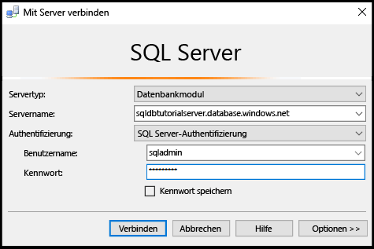
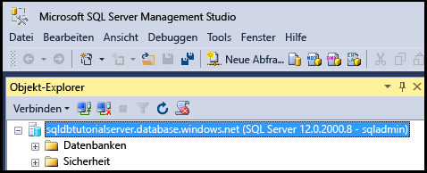
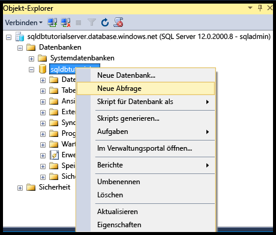

# <a name="connect-to-sql-database-with-sql-server-management-studio-and-execute-a-sample-t-sql-query"></a>Herstellen einer Verbindung mit einer SQL-Datenbank mit SQL Server Management Studio und Ausführen einer T-SQL-Beispielabfrage

In diesem Artikel wird beschrieben, wie Sie über SQL Server Management Studio (SSMS) eine Verbindung mit einer Azure SQL-Datenbank herstellen. Nach der erfolgreichen Verbindungsherstellung führen wir eine einfache Transact-SQL-Abfrage (T-SQL) aus, um die Kommunikation mit der Datenbank zu überprüfen.

[!INCLUDE [SSMS Install](../../includes/sql-server-management-studio-install.md)]

1. Laden Sie die aktuelle Version von SSMS unter [Herunterladen von SQL Server Management Studio (SSMS)](https://msdn.microsoft.com/library/mt238290.aspx) herunter, und installieren Sie die Anwendung, falls noch nicht geschehen. Damit Sie immer auf dem neuesten Stand bleiben, werden Sie von der aktuellen Version von SSMS informiert, wenn eine neue Version als Download verfügbar ist.

2. Geben Sie nach der Installation im Windows-Suchfeld den Text **Microsoft SQL Server Management Studio** ein, und drücken Sie die **EINGABETASTE**, um SSMS zu öffnen:

    
3. Geben Sie im Dialogfeld „Mit Server verbinden“ die erforderlichen Informationen ein, um eine Verbindung Ihrer SQL Server-Instanz per SQL Server-Authentifizierung herzustellen.

    
4. Klicken Sie auf **Verbinden**.

    
5. Erweitern Sie im Objekt-Explorer die Option **Datenbanken**, und erweitern Sie die entsprechenden Datenbanken, um die Objekte in ihnen anzuzeigen.

    
6. Klicken Sie mit der rechten Maustaste auf diese Datenbank, und klicken Sie dann auf **Neue Abfrage**.

    
7. Geben Sie im Abfragefenster die folgende Abfrage ein:

   ```select * from sys.objects```
   
8.  Klicken Sie auf der Symbolleiste auf **Ausführen**, um eine Liste mit allen Systemobjekten in der Beispieldatenbank zurückzugeben.

    

> [!Tip]
> Ein Tutorial finden Sie unter [Tutorial: Bereitstellen und Verwenden einer Azure SQL-Datenbank mit dem Azure-Portal und SQL Server Management Studio](sql-database-get-started.md).    
>

## <a name="next-steps"></a>Nächste Schritte

- Mit T-SQL-Anweisungen können Sie Datenbanken in Azure auf gleiche Weise wie mit SQL Server erstellen und verwalten. Wenn Sie mit der Verwendung von T-SQL mit SQL Server vertraut sind, finden Sie unter [Azure SQL-Datenbank – Transact-SQL-Informationen](sql-database-transact-sql-information.md) eine Zusammenfassung der Unterschiede.
- Wenn Sie mit T-SQL nicht vertraut sind, siehe [Tutorial: Schreiben von Transact-SQL-Anweisungen](https://msdn.microsoft.com/library/ms365303.aspx) und [Transact-SQL-Referenz (Datenbankmodul)](https://msdn.microsoft.com/library/bb510741.aspx).
- Informationen zu den ersten Schritten im SQL Server-Authentifizierungstutorial finden Sie unter [SQL-Authentifizierung und -Autorisierung](sql-database-control-access-sql-authentication-get-started.md).
- Informationen zu den ersten Schritten im Azure Active Directory-Authentifizierungstutorial finden Sie unter [Azure AD-Authentifizierung und Autorisierung](sql-database-control-access-aad-authentication-get-started.md).
- Weitere Informationen zu SSMS finden Sie unter [Verwenden Sie SQL Server Management Studio](https://msdn.microsoft.com/library/ms174173.aspx).


