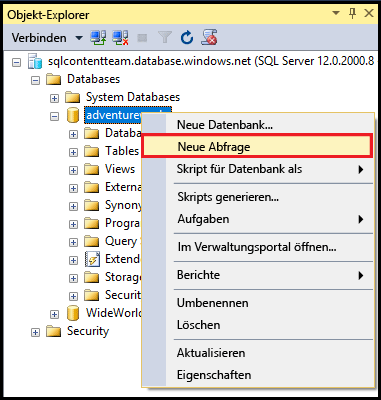
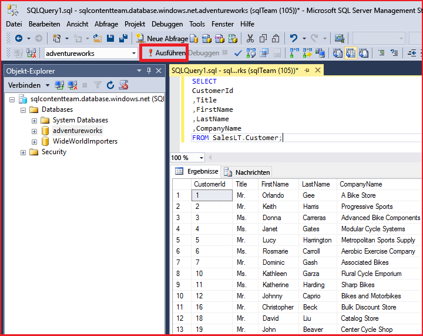

<properties
	pageTitle="Herstellen einer Verbindung mit SQL-Datenbank mithilfe einer C#-Abfrage | Microsoft Azure"
	description="Schreiben Sie ein Programm in C# zum Abfragen und Herstellen einer Verbindung mit einer SQL-Datenbank. Informationen zu IP-Adressen, Verbindungszeichenfolgen, sicherer Anmeldung und kostenlosem Visual Studio."
	services="sql-database"
	keywords="C#-Datenbankabfrage, C#-Abfrage, mit Datenbank verbinden, SQL C#"
	documentationCenter=""
	authors="MightyPen"
	manager="jhubbard"
	editor=""/>

<tags
	ms.service="sql-database"
	ms.workload="data-management"
	ms.tgt_pltfrm="na"
	ms.devlang="dotnet"
	ms.topic="get-started-article"
	ms.date="04/25/2016"
	ms.author="annemill"/>

# Herstellen der Verbindung mit einer SQL-Datenbank mit Visual Studio

> [AZURE.SELECTOR]
- [Visual Studio](sql-database-connect-query.md)
- [SSMS](sql-database-connect-query-ssms.md)
- [Excel](sql-database-connect-excel.md)

Erfahren Sie, wie Sie in Visual Studio eine Verbindung mit einer Azure SQL-Datenbank herstellen.

## Voraussetzungen

Zum Herstellen einer Verbindung mit SQL-Datenbank per Visual Studio benötigen Sie Folgendes:

- Ein Azure-Konto und ein Azure-Abonnement. Sie können sich für eine [kostenlose Testversion](https://azure.microsoft.com/pricing/free-trial/) registrieren.

- Eine **AdventureWorksLT**-Demodatenbank im Azure SQL-Datenbankdienst.
 - [Erstellen Sie die Demodatenbank](sql-database-get-started.md) in Minuten.

- Visual Studio 2013, Update 4 (oder höher). Microsoft bietet Visual Studio Community jetzt *kostenlos* an.
 - [Download von Visual Studio Community](http://www.visualstudio.com/products/visual-studio-community-vs)
 - [Weitere Optionen für kostenlose Visual Studio-Versionen](http://www.visualstudio.com/products/free-developer-offers-vs.aspx)
 - Oder lesen Sie in einem [Schritt](#InstallVSForFree) weiter unten in diesem Thema, wie das [Azure-Portal](https://portal.azure.com/) Ihnen bei der Installation von Visual Studio hilft.

&nbsp;

## Schritt 1: Kostenloses Installieren von Visual Studio Community

Zur Installation von Visual Studio haben Sie folgende Möglichkeiten:

- Installieren Sie Visual Studio Community kostenlos, indem Sie in Ihrem Browser die Visual Studio-Produktwebseiten aufrufen, auf denen kostenlose Downloads und andere Optionen angeboten werden.
- Lassen Sie sich vom [Azure-Portal](https://portal.azure.com/) zur Downloadwebseite führen, die als Nächstes beschrieben wird.

### Visual Studio über das Azure-Portal

1. Melden Sie sich über das [Azure-Portal](https://portal.azure.com/) unter http://portal.azure.com/ an.

2. Klicken Sie auf **ALLE DURCHSUCHEN*** > **SQL-Datenbanken**. Ein Blatt für die Suche nach Datenbanken wird geöffnet.

3. Beginnen Sie im Filtertextfeld im oberen Bereich mit der Eingabe des Namens Ihrer **AdventureWorksLT**-Datenbank.

4. Wenn die Zeile für die Datenbank auf dem Server angezeigt wird, klicken Sie auf die Zeile. Ein Blatt für die Datenbank wird geöffnet.

5. Der Einfachheit halber klicken Sie für alle vorherigen Blätter auf das Steuerelement zum Minimieren.

6. Klicken Sie im oberen Bereich des Blatts "Datenbank" auf die Schaltfläche **In Visual Studio öffnen**. Ein neues Blatt zu Visual Studio wird geöffnet. Es enthält Links zu den Speicherorten für die Visual Studio-Installation.

	![Schaltfläche "In Visual Studio öffnen"][20-OpenInVisualStudioButton]

7. Klicken Sie auf den Link **Community (kostenlos)** oder einen ähnlichen Link. Eine neue Webseite wird hinzugefügt.

8. Verwenden Sie die Links auf der Webseite für die Installation von Visual Studio.

9. Sobald Visual Studio installiert ist, klicken Sie auf dem Blatt **In Visual Studio öffnen** auf die Schaltfläche **In Visual Studio öffnen**. Visual Studio wird geöffnet.

10. Für den Bereich **SQL Server-Objekt-Explorer** werden Sie aufgefordert, Felder zur Verbindungszeichenfolge in einem Dialogfeld ausfüllen.
 - Wählen Sie statt der **Windows-Authentifizierung** die **SQL Server-Authentifizierung**.
 - Denken Sie daran, Ihre **AdventureWorksLT**-Datenbank anzugeben (im Dialogfeld unter **Optionen** > **Verbindungseigenschaften**).

11. Erweitern Sie im **SQL Server-Objekt-Explorer** den Knoten für Ihre Datenbank.

## Schritt 2: Durchführen von Beispielabfragen

Nachdem Sie eine Verbindung mit Ihrem logischen Server hergestellt haben, können Sie eine Verbindung mit einer Datenbank herstellen und eine Beispielabfrage ausführen.

1. Navigieren Sie im **Objekt-Explorer** zu einer Datenbank auf dem Server, für die Sie Berechtigungen besitzen, z.B. die Beispieldatenbank **AdventureWorks**.
2. Klicken Sie mit der rechten Maustaste auf die Datenbank, und wählen Sie dann **Neue Abfrage** aus.

	

3. Kopieren Sie den folgenden Code, und fügen Sie ihn im Abfragefenster ein.

		SELECT
		CustomerId
		,Title
		,FirstName
		,LastName
		,CompanyName
		FROM SalesLT.Customer;

4. Klicken Sie auf die Schaltfläche **Ausführen**. Der folgende Screenshot zeigt eine erfolgreiche Abfrage.

	

## Nächste Schritte

[Herstellen von Verbindungen mit SQL-Datenbanken mithilfe von .NET (C#)](sql-database-develop-dotnet-simple.md)

<!-- Image references. -->

[20-OpenInVisualStudioButton]: ./media/sql-database-connect-query/connqry-free-vs-e.png

<!---HONumber=AcomDC_0615_2016-->