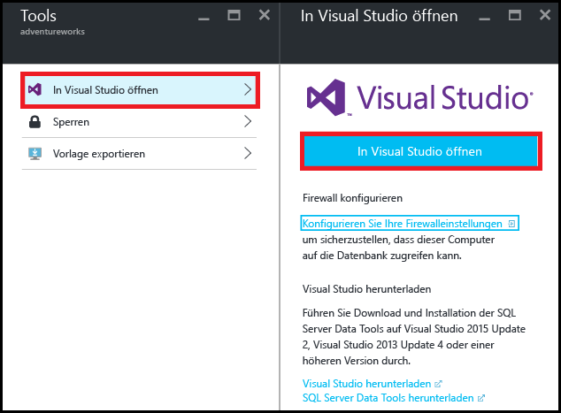
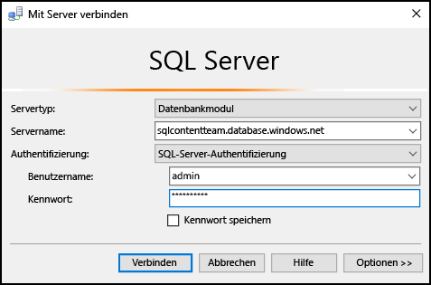
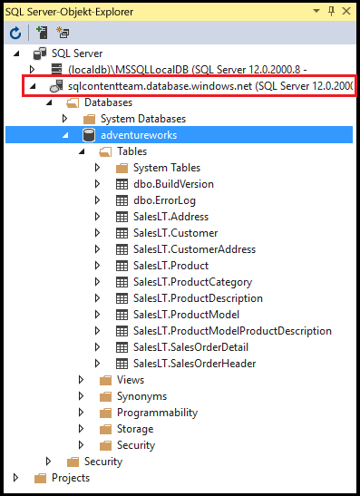
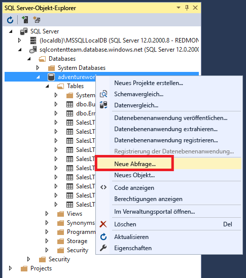
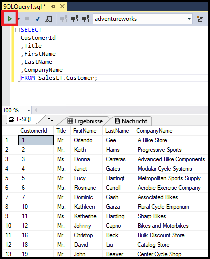

<properties
	pageTitle="Herstellen einer Verbindung mit SQL-Datenbank mithilfe einer C#-Abfrage | Microsoft Azure"
	description="Schreiben Sie ein Programm in C# zum Abfragen und Herstellen einer Verbindung mit einer SQL-Datenbank. Informationen zu IP-Adressen, Verbindungszeichenfolgen, sicherer Anmeldung und kostenlosem Visual Studio."
	services="sql-database"
	keywords="C#-Datenbankabfrage, C#-Abfrage, mit Datenbank verbinden, SQL C#"
	documentationCenter=""
	authors="stevestein"
	manager="jhubbard"
	editor=""/>

<tags
	ms.service="sql-database"
	ms.workload="data-management"
	ms.tgt_pltfrm="na"
	ms.devlang="dotnet"
	ms.topic="get-started-article"
	ms.date="08/17/2016"
	ms.author="stevestein"/>

# Herstellen der Verbindung mit einer SQL-Datenbank mit Visual Studio

> [AZURE.SELECTOR]
- [Visual Studio](sql-database-connect-query.md)
- [SSMS](sql-database-connect-query-ssms.md)
- [Excel](sql-database-connect-excel.md)

Erfahren Sie, wie Sie in Visual Studio eine Verbindung mit einer Azure SQL-Datenbank herstellen.

## Voraussetzungen

Zum Herstellen einer Verbindung mit einer SQL-Datenbank mit Visual Studio benötigen Sie Folgendes:

- Eine SQL-Datenbank, mit der eine Verbindung hergestellt werden kann. In diesem Artikel wird die **AdventureWorks**-Beispieldatenbank verwendet. Die AdventureWorks-Beispieldatenbank finden Sie unter [Erstellen Sie die Demodatenbank](sql-database-get-started.md).

- Visual Studio 2013, Update 4 (oder höher). Microsoft bietet Visual Studio Community jetzt *kostenlos* an.
 - [Download von Visual Studio Community](http://www.visualstudio.com/products/visual-studio-community-vs)
 - [Weitere Optionen für kostenlose Visual Studio-Versionen](http://www.visualstudio.com/products/free-developer-offers-vs.aspx)

## Öffnen von Visual Studio über das Azure-Portal

1. Melden Sie sich beim [Azure-Portal](https://portal.azure.com/) an.

2. Klicken Sie auf **Weitere Dienste** > **SQL-Datenbanken**.
3. Öffnen Sie das Blatt der **AdventureWorks**-Datenbank, indem Sie nach der *AdventureWorks*-Datenbank suchen und darauf klicken.

6. Klicken Sie oben auf dem Datenbankblatt auf die Schaltfläche **Tools**:

	

7. Klicken Sie auf **In Visual Studio öffnen** (klicken Sie auf den Downloadlink, wenn Sie Visual Studio benötigen):

	

8. Visual Studio wird geöffnet, und im Fenster **Mit Server verbinden** sind bereits die Angaben für die Verbindung mit dem Server und der Datenbank gemäß Ihrer Auswahl im Portal vorhanden. (Klicken Sie auf **Optionen**, um sicherzustellen, dass die Verbindung auf die richtige Datenbank festgelegt ist.) Geben Sie Ihr Serveradministratorkennwort ein, und klicken Sie auf **Verbinden**.

	

8. Wenn Sie für die IP-Adresse Ihres Computers keine Firewallregel eingerichtet haben, erhalten Sie hier eine Meldung der Art *Keine Verbindung möglich*. Informationen zur Erstellung einer Firewall finden Sie unter [Konfigurieren einer Firewallregel auf Serverebene für Azure SQL-Datenbank mithilfe des Azure-Portals](sql-database-configure-firewall-settings.md).

9. Nachdem die Verbindung hergestellt wurde, wird das Fenster **SQL Server-Objekt-Explorer** mit einer Verbindung mit Ihrer Datenbank geöffnet.

	

## Ausführen einer Beispielabfrage

Nachdem wir die Verbindung mit der Datenbank hergestellt haben, wird anhand der folgenden Schritte veranschaulicht, wie Sie eine einfache Abfrage ausführen:

2. Klicken Sie mit der rechten Maustaste auf die Datenbank, und wählen Sie dann **Neue Abfrage** aus.

	

3. Kopieren Sie den folgenden Code, und fügen Sie ihn im Abfragefenster ein.

		SELECT
		CustomerId
		,Title
		,FirstName
		,LastName
		,CompanyName
		FROM SalesLT.Customer;

4. Klicken Sie auf die Schaltfläche **Ausführen**, um die Abfrage auszuführen:

	

## Nächste Schritte

- Beim Öffnen von SQL-Datenbanken in Visual Studio werden SQL Server Data Tools verwendet. Weitere Informationen finden Sie unter [SQL Server Data Tools](https://msdn.microsoft.com/library/hh272686.aspx).
- Informationen zum Herstellen einer Verbindung mit einer SQL-Datenbank finden Sie unter [Herstellen von Verbindungen mit SQL-Datenbanken mithilfe von .NET (C#)](sql-database-develop-dotnet-simple.md).

<!----HONumber=AcomDC_0824_2016--->