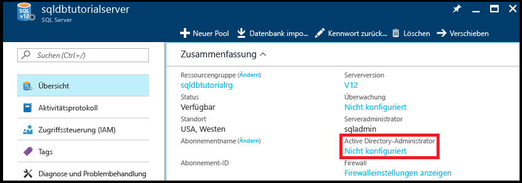
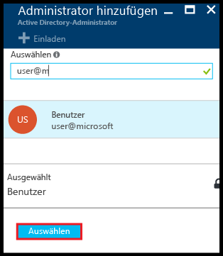
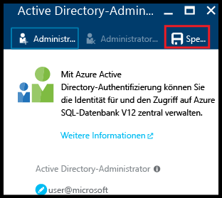
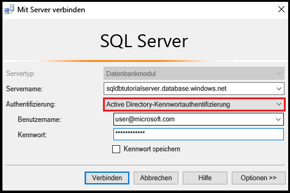
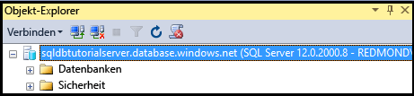
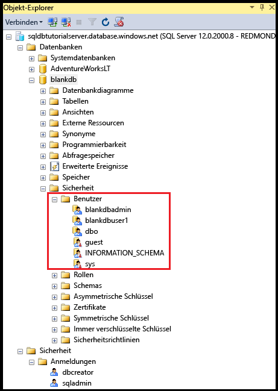
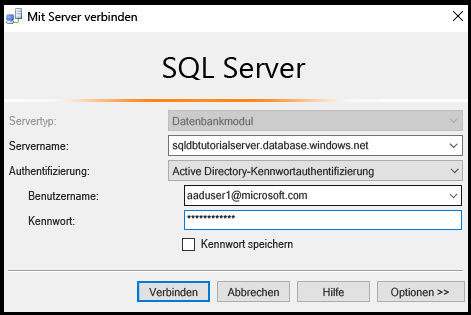
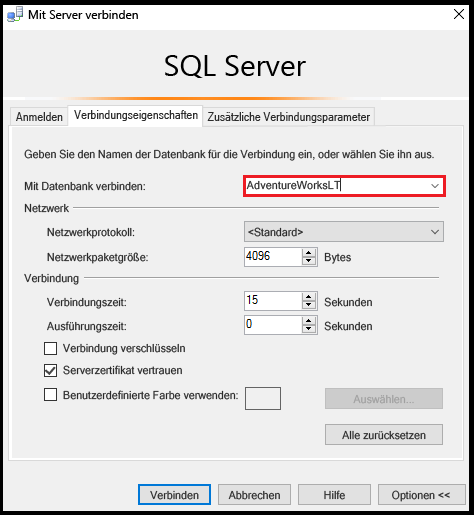
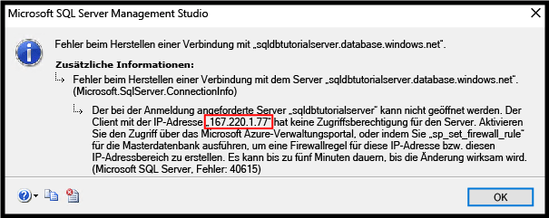

# <a name="azure-ad-authentication-access-and-database-level-firewall-rules"></a>Azure AD-Authentifizierung, Zugriff und Firewallregeln auf Datenbankebene
In diesem Leitfaden erfahren Sie, wie Sie mithilfe von SQL Server Management Studio Azure Active Directory-Authentifizierung, -Anmeldenamen, -Benutzern und -Datenbankrollen verwenden, die Zugriff auf und Berechtigungen für Server und Datenbanken von Azure SQL-Datenbank gewähren. Folgendes wird beschrieben:

- Anzeigen von Benutzerberechtigungen in der Masterdatenbank und in Benutzerdatenbanken
- Erstellen von Anmeldungen und Benutzern basierend auf der Azure Active Directory-Authentifizierung
- Gewähren von serverweiten und datenbankspezifischen Berechtigungen für Benutzer
- Anmelden an einer Benutzerdatenbank als Benutzer (nicht als Administrator)
- Erstellen von Firewallregeln auf Datenbankebene für Datenbankbenutzer
- Erstellen von Firewallregeln auf Serverebene für Serveradministratoren

**Geschätzte Zeit**: Dieser Leitfaden ist in ca. 45 Minuten abgeschlossen (sofern die Voraussetzungen bereits erfüllt sind).

## <a name="prerequisites"></a>Voraussetzungen

* **Ein Azure-Konto.** Sie benötigen ein Azure-Konto. Sie können entweder ein [kostenloses Azure-Konto erstellen](https://azure.microsoft.com/free/) oder [Visual Studio-Abonnementvorteile aktivieren](https://azure.microsoft.com/pricing/member-offers/msdn-benefits/). 

* **Azure-Erstellungsberechtigungen.** Sie müssen mit einem Konto, das über die Rolle „Besitzer“ oder „Mitwirkender“ für das Abonnement verfügt, eine Verbindung mit dem Azure-Portal herstellen können. Weitere Informationen zur rollenbasierten Zugriffssteuerung finden Sie unter [Erste Schritte mit der Zugriffsverwaltung im Azure-Portal](../active-directory/role-based-access-control-what-is.md).

* **SQL Server Management Studio**: Die neueste Version von SQL Server Management Studio (SSMS) können Sie über [Herunterladen von SQL Server Management Studio (SSMS)](https://msdn.microsoft.com/library/mt238290.aspx) herunterladen und installieren. Verwenden Sie immer die neueste Version von SSMS, wenn Sie eine Verbindung mit Azure SQL-Datenbank herstellen, da immer wieder neue Funktionen veröffentlicht werden.

* **Basisserver und -datenbanken** Zum Installieren und Konfigurieren eines Servers und der beiden Datenbanken, die in diesem Leitfaden verwendet werden, klicken Sie auf die Schaltfläche **Bereitstellen in Azure**. Durch Klicken auf die Schaltfläche wird das Blatt **Deploy from a template** (Bereitstellen aus einer Vorlage) geöffnet. Erstellen Sie eine neue Ressourcengruppe, und geben Sie das **Administrator-Anmeldekennwort** für den neuen Server an, der erstellt wird:

   [](https://portal.azure.com/#create/Microsoft.Template/uri/https%3A%2F%2Fsqldbtutorial.blob.core.windows.net%2Ftemplates%2Fsqldbgetstarted.json)

   > [!NOTE]
   > Das Durcharbeiten des verwandten Leitfadens für die SQL Server-Authentifizierung ([SQL-Authentifizierung, Anmeldungen und Benutzerkonten, Datenbankrollen, Berechtigungen, Firewallregeln auf Serverebene und Firewallregeln auf Datenbankebene](sql-database-control-access-sql-authentication-get-started.md)) ist optional. In diesem Leitfaden werden aber Konzepte behandelt, die hier nicht wiederholt werden. Die Verfahren in diesem Leitfaden zu Firewalls auf Server- und Datenbankebene sind nicht erforderlich, wenn Sie diesen zugehörigen Leitfaden auf denselben Computern (mit der gleichen IP-Adresse) durchgeführt haben. Aus diesem Grund sind sie als optional gekennzeichnet. Bei den Screenshots in diesem Leitfaden wird außerdem davon ausgegangen, dass Sie diesen zugehörigen Leitfaden abgeschlossen haben. 
   >

* Sie haben eine Azure Active Directory-Instanz erstellt und mit Daten gefüllt. Weitere Informationen finden Sie unter [Integrieren Ihrer lokalen Identitäten in Azure Active Directory](../active-directory/active-directory-aadconnect.md), [Hinzufügen eines benutzerdefinierten Domänennamens zu Azure AD](../active-directory/active-directory-add-domain.md), [Microsoft Azure unterstützt jetzt den Verbund mit Windows Server Active Directory](https://azure.microsoft.com/blog/2012/11/28/windows-azure-now-supports-federation-with-windows-server-active-directory/), [Verwalten Ihres Azure AD-Verzeichnisses](https://msdn.microsoft.com/library/azure/hh967611.aspx)[ sowie unter Verwalten von Azure AD mit Windows PowerShell](https://msdn.microsoft.com/library/azure/jj151815.aspx) und [erforderliche Ports und Protokolle für die Hybrid-Identität](../active-directory/active-directory-aadconnect-ports.md).

> [!NOTE]
> Dieser Leitfaden dient Ihnen als Hilfe beim Erlernen des Inhalts dieser Lernthemen: [Azure SQL Database access control (SQL-Datenbank – Zugriffssteuerung)](sql-database-control-access.md), [Anmeldungen, Benutzer und Datenbankrollen](sql-database-manage-logins.md), [Prinzipale](https://msdn.microsoft.com/library/ms181127.aspx), [Datenbankrollen](https://msdn.microsoft.com/library/ms189121.aspx), [Firewallregeln für SQL-Datenbank](sql-database-firewall-configure.md)und [Azure Active Directory-Authentifizierung](sql-database-aad-authentication.md). 
>  

## <a name="sign-in-to-the-azure-portal-using-your-azure-account"></a>Anmelden am Azure-Portal mit dem Azure-Konto
Führen Sie die folgenden Schritte aus, um unter Verwendung Ihres [bereits vorhandenen Abonnements](https://account.windowsazure.com/Home/Index)eine Verbindung mit dem Azure-Portal herzustellen.

1. Öffnen Sie einen Browser Ihrer Wahl, und stellen Sie eine Verbindung mit dem [Azure-Portal](https://portal.azure.com/)her.
2. Melden Sie sich auf dem [Azure-Portal](https://portal.azure.com/)an.
3. Geben Sie auf der **Anmeldeseite** die Anmeldeinformationen für Ihr Abonnement ein.
   
## <a name="provision-an-azure-active-directory-admin-for-your-sql-logical-server"></a>Bereitstellen eines Azure Active Directory-Administrators für Ihre logische SQL Server-Instanz

In diesem Abschnitt des Leitfaden zeigen Sie Informationen zur Sicherheitskonfiguration für Ihren logischen Server im Azure-Portal an.

1. Öffnen Sie das Blatt **SQL Server** für Ihren logischen Server, und zeigen Sie die Informationen auf der Seite **Übersicht** an. Beachten Sie, dass kein Azure Active Directory-Administrator konfiguriert wurde.

   

2. Klicken Sie im Bereich **Zusammenfassung** auf **Nicht konfiguriert**, um das Blatt **Active Directory-Administrator** zu öffnen.

   

3. Klicken Sie auf **Administrator festlegen**, um das Blatt **Administrator hinzufügen** zu öffnen, und wählen Sie dann ein Active Directory-Benutzer- oder -Gruppenkonto als Active Directory-Administrator für Ihren Server aus.

   

4. Klicken Sie auf **Auswählen**, und klicken Sie dann auf **Speichern**.

   

> [!NOTE]
> Wenn Sie die Verbindungsinformationen für diesen Server überprüfen möchten, wechseln Sie zu [Verbinden mit SSMS](sql-database-connect-query-ssms.md). Für diese Leitfadenreihe lautet der vollqualifizierte Servername „sqldbtutorialserver.database.windows.net“.
>

## <a name="connect-to-sql-server-using-sql-server-management-studio-ssms"></a>Herstellen einer Verbindung mit der SQL Server-Instanz mit SQL Server Management Studio (SSMS)

1. Laden Sie die aktuelle Version von SSMS unter [Herunterladen von SQL Server Management Studio (SSMS)](https://msdn.microsoft.com/library/mt238290.aspx) herunter, und installieren Sie die Anwendung, falls noch nicht geschehen. Damit Sie immer auf dem neuesten Stand bleiben, werden Sie von der aktuellen Version von SSMS informiert, wenn eine neue Version als Download verfügbar ist.

2. Geben Sie nach der Installation im Windows-Suchfeld den Text **Microsoft SQL Server Management Studio** ein, und drücken Sie die **EINGABETASTE**, um SSMS zu öffnen.

   

3. Wählen Sie im Dialogfeld **Mit Server verbinden** eine der Active Directory-Authentifizierungsmethoden aus, und geben Sie dann die entsprechenden Authentifizierungsinformationen an. Informationen zum Auswählen einer Methode finden Sie unter [Azure Active Directory-Authentifizierung](sql-database-aad-authentication.md) und [SSMS-Unterstützung für Azure AD MFA](sql-database-ssms-mfa-authentication.md).

   

4. Geben Sie die erforderlichen Informationen für die Herstellung der Verbindung mit Ihrer SQL Server-Instanz per SQL Server-Authentifizierung und Serveradministratorkonto ein.

5. Klicken Sie auf **Verbinden**.

   

## <a name="view-the-server-admin-account-and-its-permissions"></a>Anzeigen des Serveradministratorkontos und der dazugehörigen Berechtigungen 
In diesem Abschnitt des Leitfadens zeigen Sie Informationen zum Serveradministratorkonto und die dazugehörigen Berechtigungen in der Masterdatenbank und in den Benutzerdatenbanken an.

1. Erweitern Sie im Objekt-Explorer nacheinander die Optionen **Datenbanken**, **Systemdatenbanken**, **master**, **Sicherheit** und **Benutzer**. Beachten Sie, dass in der Masterdatenbank für den Active Directory-Administrator ein Benutzerkonto erstellt wurde. Beachten Sie auch, dass für das Active Directory-Administratorbenutzerkonto keine Anmeldung erstellt wurde.

   

   > [!NOTE]
   > Informationen zu den anderen angezeigten Benutzerkonten finden Sie unter [Prinzipale](https://msdn.microsoft.com/library/ms181127.aspx).
   >

2. Klicken Sie im Objekt-Explorer mit der rechten Maustaste auf **master**, und klicken Sie dann auf **Neue Abfrage**, um ein Abfragefenster mit Verbindung zur Masterdatenbank zu öffnen.
3. Führen Sie im Abfragefenster die folgende Abfrage aus, um Informationen zum Benutzer zurückzugeben, der die Abfrage ausführt. Beachten Sie, dass user@microsoft.com für das Benutzerkonto zurückgegeben wird, mit dem diese Abfrage ausgeführt wird. (Es wird ein anderes Ergebnis angezeigt, wenn wir später bei diesem Verfahren eine Benutzerdatenbank abfragen.)

   ```
   SELECT USER;
   ```

   

4. Führen Sie im Abfragefenster die folgende Abfrage aus, um Informationen zu den Berechtigungen des Active Directory-Administratorbenutzers zurückzugeben. Beachten Sie, dass der Active Directory-Administratorbenutzer über Berechtigungen zum Herstellen einer Verbindung mit der Masterdatenbank, Erstellen von Anmeldungen und Benutzern, Auswählen von Informationen aus der Tabelle „sys.sql_logins“ und Hinzufügen von Benutzern zu den Datenbankrollen „dbmanager“ und „dbcreator“ verfügt. Diese Berechtigungen gelten zusätzlich zu den Berechtigungen, die für die öffentliche Rolle gewährt werden, von der alle Benutzer Berechtigungen erben (z.B. Berechtigungen zum Auswählen von Informationen aus bestimmten Tabellen). Weitere Informationen finden Sie unter [Berechtigungen](https://msdn.microsoft.com/library/ms191291.aspx).

   ```
   SELECT prm.permission_name
      , prm.class_desc
      , prm.state_desc
      , p2.name as 'Database role'
      , p3.name as 'Additional database role' 
   FROM sys.database_principals p
   JOIN sys.database_permissions prm
      ON p.principal_id = prm.grantee_principal_id
      LEFT JOIN sys.database_principals p2
      ON prm.major_id = p2.principal_id
      LEFT JOIN sys.database_role_members r
      ON p.principal_id = r.member_principal_id
      LEFT JOIN sys.database_principals p3
      ON r.role_principal_id = p3.principal_id
   WHERE p.name = 'user@microsoft.com';
   ```

   

6. Erweitern Sie im Objekt-Explorer nacheinander **blankdb**, **Sicherheit** und **Benutzer**. Beachten Sie, dass diese Datenbank kein Benutzerkonto mit dem Namen user@microsoft.com enthält.

   

7. Klicken Sie im Objekt-Explorer mit der rechten Maustaste auf **blankdb**, und klicken Sie dann auf **Neue Abfrage**.

8. Führen Sie im Abfragefenster die folgende Abfrage aus, um Informationen zum Benutzer zurückzugeben, der die Abfrage ausführt. Beachten Sie, dass „dbo“ für das Benutzerkonto zurückgegeben wird, von dem diese Abfrage ausgeführt wird. (Die Serveradministratoranmeldung wird in jeder Benutzerdatenbank standardmäßig dem Benutzerkonto „dbo“ zugeordnet.)

   ```
   SELECT USER;
   ```

   

9. Führen Sie im Abfragefenster die folgende Abfrage aus, um Informationen zu den Berechtigungen des Benutzers „dbo“ zurückzugeben. Beachten Sie, dass „dbo“ ein Mitglied der öffentlichen Rolle und außerdem der festen Datenbankrolle „db_owner“ ist. Weitere Informationen finden Sie unter [Rollen auf Datenbankebene](https://msdn.microsoft.com/library/ms189121.aspx).

   ```
   SELECT prm.permission_name
      , prm.class_desc
      , prm.state_desc
      , p2.name as 'Database role'
      , p3.name as 'Additional database role' 
   FROM sys.database_principals AS p
   JOIN sys.database_permissions AS prm
      ON p.principal_id = prm.grantee_principal_id
      LEFT JOIN sys.database_principals AS p2
      ON prm.major_id = p2.principal_id
      LEFT JOIN sys.database_role_members r
      ON p.principal_id = r.member_principal_id
      LEFT JOIN sys.database_principals AS p3
      ON r.role_principal_id = p3.principal_id
   WHERE p.name = 'dbo';
   ```

   

10. Sie können bei Bedarf die obigen drei Schritte für die AdventureWorksLT-Benutzerdatenbank wiederholen.

## <a name="create-a-new-user-in-the-adventureworkslt-database-with-select-permissions"></a>Erstellen eines neuen Benutzers in der AdventureWorksLT-Datenbank mit SELECT-Berechtigungen

In diesem Abschnitt des Leitfadens erstellen Sie ein Benutzerkonto in der AdventureWorksLT-Datenbank basierend auf dem Benutzerprinzipalnamen eines Azure AD-Benutzers oder dem Anzeigenamen für eine Azure AD-Gruppe, testen die Berechtigungen des Benutzers als Mitglied der öffentlichen Rolle, gewähren dem Benutzer SELECT-Berechtigungen und testen die Berechtigungen des Benutzers dann erneut.

> [!NOTE]
> Mit Benutzern auf Datenbankebene ([eigenständige Benutzer](https://msdn.microsoft.com/library/ff929188.aspx)) erhöhen Sie die Portabilität Ihrer Datenbank. Hierauf wird in späteren Leitfäden näher eingegangen.
>

1. Klicken Sie im Objekt-Explorer mit der rechten Maustaste auf **AdventureWorksLT**, und klicken Sie dann auf **Neue Abfrage**, um ein Abfragefenster zu öffnen, das mit der AdventureWorksLT-Datenbank verbunden ist.
2. Führen Sie die folgende Anweisung aus, um in der AdventureWorksLT-Datenbank für einen Benutzer in der Microsoft-Domäne „aaduser1“ ein Benutzerkonto zu erstellen.

   ```
   CREATE USER [aaduser1@microsoft.com]
   FROM EXTERNAL PROVIDER;
   ```
   

3. Führen Sie im Abfragefenster die folgende Abfrage aus, um Informationen zu den Berechtigungen des Benutzers „user1“ zurückzugeben. Beachten Sie, dass „user1“ nur über die Berechtigungen verfügt, die er von der öffentlichen Rolle geerbt hat.

   ```
   SELECT prm.permission_name
      , prm.class_desc
      , prm.state_desc
      , p2.name as 'Database role'
      , p3.name as 'Additional database role' 
   FROM sys.database_principals AS p
   JOIN sys.database_permissions AS prm
      ON p.principal_id = prm.grantee_principal_id
      LEFT JOIN sys.database_principals AS p2
      ON prm.major_id = p2.principal_id
      LEFT JOIN sys.database_role_members r
      ON p.principal_id = r.member_principal_id
      LEFT JOIN sys.database_principals AS p3
      ON r.role_principal_id = p3.principal_id
   WHERE p.name = 'aaduser1@microsoft.com';
   ```

   

4. Führen Sie die folgenden Abfragen aus, um zu versuchen, eine Tabelle in der AdventureWorksLT-Datenbank als „user1“ abzufragen.

   ```
   EXECUTE AS USER = 'aaduser1@microsoft.com';  
   SELECT * FROM [SalesLT].[ProductCategory];
   REVERT;
   ```

   

5. Führen Sie die folgende Anweisung aus, um „user1“ SELECT-Berechtigungen in der Tabelle „ProductCategory“ im SalesLT-Schema zu gewähren.

   ```
   GRANT SELECT ON OBJECT::[SalesLT].[ProductCategory] to [aaduser1@microsoft.com];
   ```

   

6. Führen Sie die folgenden Abfragen aus, um zu versuchen, eine Tabelle in der AdventureWorksLT-Datenbank als „user1“ abzufragen.

   ```
   EXECUTE AS USER = 'aaduser1@microsoft.com';  
   SELECT * FROM [SalesLT].[ProductCategory];
   REVERT;
   ```

   

## <a name="create-a-database-level-firewall-rule-for-adventureworkslt-database-users"></a>Erstellen einer Firewallregel auf Datenbankebene für AdventureWorksLT-Datenbankbenutzer

> [!NOTE]
> Sie müssen dieses Verfahren nicht durcharbeiten, wenn Sie das entsprechende Verfahren im verwandten Leitfaden für die SQL Server-Authentifizierung ([SQL-Authentifizierung und -Autorisierung](sql-database-control-access-sql-authentication-get-started.md)) durchgeführt haben und zum Lernen immer denselben Computer mit derselben IP-Adresse verwenden.
>

In diesem Abschnitt des Leitfadens versuchen Sie, sich mit dem neuen Benutzerkonto von einem Computer mit einer anderen IP-Adresse anzumelden, als Serveradministrator eine Firewallregel auf Datenbankebene zu erstellen und sich dann mit dieser neuen Firewallregel auf Datenbankebene anzumelden. 

> [!NOTE]
> Mit [Firewallregeln auf Datenbankebene](sql-database-firewall-configure.md) erhöhen Sie die Portabilität Ihrer Datenbank. Hierauf wird in späteren Leitfäden näher eingegangen.
>

1. Öffnen Sie auf einem anderen Computer, für den Sie nicht bereits eine Firewallregel auf Serverebene erstellt haben, SQL Server Management Studio.

   > [!IMPORTANT]
   > Verwenden Sie immer die aktuelle Version von SSMS unter [Herunterladen von SQL Server Management Studio (SSMS)](https://msdn.microsoft.com/library/mt238290.aspx). 
   >

2. Geben Sie im Fenster **Mit Server verbinden** den Servernamen und Authentifizierungsinformationen ein, um die Verbindung per SQL Server-Authentifizierung mit dem Konto aaduser1@microsoft.com herzustellen. 
    
   

3. Klicken Sie im Dialogfeld **Verbindung mit dem Server herstellen** auf **Optionen**, um die Datenbank anzugeben, mit der die Verbindung hergestellt werden soll, und geben Sie auf der Registerkarte **Verbindungseigenschaften** im Dropdownfeld **Verbindung mit Datenbank herstellen** den Text **AdventureWorksLT** ein.
   
   

4. Klicken Sie auf **Verbinden**. Es wird ein Dialogfeld mit dem Hinweis angezeigt, dass der Computer, von dem aus Sie die Verbindung mit SQL-Datenbank herstellen möchten, nicht über eine Firewallregel zum Ermöglichen des Zugriffs auf die Datenbank verfügt. Vom angezeigten Dialogfeld gibt es zwei Versionen, und die Anzeige richtet sich nach den Schritten, die Sie für Firewalls bis zu diesem Punkt ausgeführt haben. Normalerweise wird aber die erste Version des Dialogfelds angezeigt.

   

   

   > [!NOTE]
   > Die neuesten Versionen von SSMS enthalten eine Funktion, mit der sich Abonnementbesitzer und -mitwirkende an Microsoft Azure anmelden und eine Firewallregel auf Serverebene erstellen können.
   > 

4. Kopieren Sie die Client-IP-Adresse aus diesem Dialogfeld, um sie in Schritt 7 zu verwenden.
5. Klicken Sie auf **Abbrechen**, aber lassen Sie das Dialogfeld **Mit Server verbinden** geöffnet.
6. Wechseln Sie zurück zu einem Computer, für den Sie bereits eine Firewallregel auf Serverebene erstellt haben, und stellen Sie mit dem Serveradministratorkonto eine Verbindung mit Ihrem Server her.
7. Führen Sie in einem neuen Abfragefenster, für das eine Verbindung mit der AdventureWorksLT-Datenbank als Serveradministrator besteht, die folgende Anweisung aus, um eine Firewallregel auf Datenbankebene zu erstellen. Führen Sie hierzu [sp_set_database_firewall_rule](https://msdn.microsoft.com/library/dn270010.aspx) mit der IP-Adresse aus Schritt 4 aus:

   ```
   EXEC sp_set_database_firewall_rule @name = N'AdventureWorksLTFirewallRule', 
     @start_ip_address = 'x.x.x.x', @end_ip_address = 'x.x.x.x';
   ```

   

8. Wechseln Sie erneut den Computer, und klicken Sie im Dialogfeld **Mit Server verbinden** auf **Verbinden**, um als „aaduser1“ eine Verbindung mit AdventureWorksLT herzustellen. 

9. Erweitern Sie im Objekt-Explorer nacheinander die Optionen **Datenbanken**, **AdventureWorksLT** und **Tabellen**. Beachten Sie, dass „user1“ nur über die Berechtigung zum Anzeigen einer einzelnen Tabelle (**SalesLT.ProductCategory**) verfügt. 

10. Klicken Sie im Objekt-Explorer mit der rechten Maustaste auf **SalesLT.ProductCategory**, und klicken Sie dann auf **Select Top 1000 Rows** (Die ersten 1.000 Zeilen auswählen).   

## <a name="next-steps"></a>Nächste Schritte
- Eine Übersicht über den Zugriff und die Steuerung in SQL-Datenbank finden Sie unter [Azure SQL Database access control](sql-database-control-access.md) (SQL-Datenbank – Zugriffssteuerung).
- Eine Übersicht über Anmeldungen, Benutzer und Datenbankrollen in SQL-Datenbank finden Sie unter [SQL-Datenbank-Authentifizierung und -Autorisierung: Gewähren von Zugriff](sql-database-manage-logins.md).
- Weitere Informationen zu Datenbankprinzipalen finden Sie unter [Prinzipale](https://msdn.microsoft.com/library/ms181127.aspx).
- Weitere Informationen zu Datenbankrollen finden Sie unter [Datenbankrollen](https://msdn.microsoft.com/library/ms189121.aspx).
- Weitere Informationen zu Firewallregeln in SQL-Datenbank finden Sie unter [Übersicht über Firewallregeln für Azure SQL-Datenbank](sql-database-firewall-configure.md).


