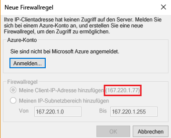
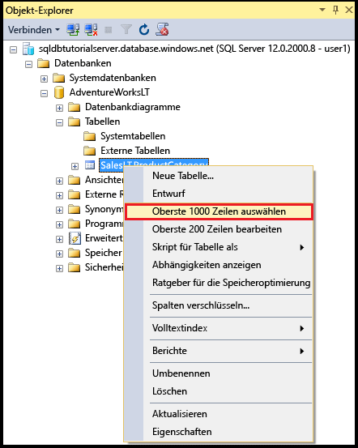
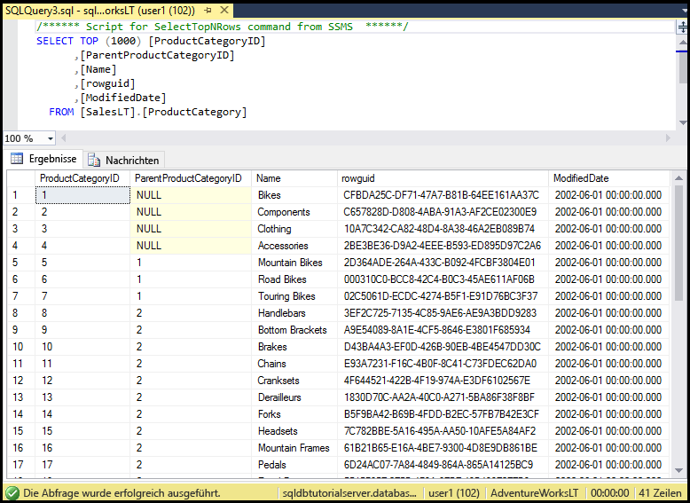

# <a name="sql-database-tutorial-sql-server-authentication-access-and-database-level-firewall-rules"></a>SQL-Datenbank-Tutorial: SQL Server-Authentifizierung, Zugriff und Firewallregeln auf Datenbankebene
In diesem Tutorial zu den ersten Schritten erfahren Sie, wie Sie mithilfe von SQL Server Management Studio SQL Server-Authentifizierung, -Anmeldenamen, -Benutzer und -Datenbankrollen verwenden, die Zugriff auf und Berechtigungen für Server und Datenbanken von Azure SQL-Datenbank gewähren. Folgendes wird beschrieben:

- Anzeigen von Benutzerberechtigungen in der Masterdatenbank und in Benutzerdatenbanken
- Erstellen von Anmeldungen und Benutzern basierend auf der SQL Server-Authentifizierung
- Gewähren von serverweiten und datenbankspezifischen Berechtigungen für Benutzer
- Anmelden an einer Benutzerdatenbank als Benutzer (nicht als Administrator)
- Erstellen von Firewallregeln auf Datenbankebene für Datenbankbenutzer
- Erstellen von Firewallregeln auf Serverebene für Serveradministratoren

**Geschätzte Zeit**: Dieses Tutorial ist in ca. 45 Minuten abgeschlossen (sofern die Voraussetzungen bereits erfüllt sind).

## <a name="prerequisites"></a>Voraussetzungen

* Sie benötigen ein Azure-Konto. Sie können entweder ein [kostenloses Azure-Konto erstellen](/pricing/free-trial/?WT.mc_id=A261C142F) oder [Visual Studio-Abonnementvorteile aktivieren](/pricing/member-offers/msdn-benefits-details/?WT.mc_id=A261C142F). 

* Sie müssen mit einem Konto, das über die Rolle „Besitzer“ oder „Mitwirkender“ für das Abonnement verfügt, eine Verbindung mit dem Azure-Portal herstellen können. Weitere Informationen zur rollenbasierten Zugriffssteuerung finden Sie unter [Erste Schritte mit der Zugriffsverwaltung im Azure-Portal](../active-directory/role-based-access-control-what-is.md).

* Sie haben das Tutorial [Erste Schritte mit Azure SQL-Datenbankservern, -Servern, -Datenbanken und -Firewallregeln mit dem Azure-Portal und SQL Server Management Studio](sql-database-get-started.md) oder die entsprechende [PowerShell-Version](sql-database-get-started-powershell.md) des Tutorials abgeschlossen. Arbeiten Sie andernfalls entweder dieses vorbereitende Tutorial durch, oder führen Sie das PowerShell-Skript am Ende der [PowerShell-Version](sql-database-get-started-powershell.md) des Tutorials aus, bevor Sie fortfahren.

> [!NOTE]
> Dieses Tutorial dient Ihnen als Hilfe beim Erlernen des Inhalts dieser Lernthemen: [Azure SQL Database access control](sql-database-control-access.md) (SQL-Datenbank – Zugriffssteuerung), [Anmeldungen, Benutzer und Datenbankrollen](sql-database-manage-logins.md), [Prinzipale](https://msdn.microsoft.com/library/ms181127.aspx), [Datenbankrollen](https://msdn.microsoft.com/library/ms189121.aspx) und [Firewallregeln für SQL-Datenbank](sql-database-firewall-configure.md).
>  

## <a name="sign-in-to-the-azure-portal-using-your-azure-account"></a>Anmelden am Azure-Portal mit dem Azure-Konto
Führen Sie die folgenden Schritte aus, um unter Verwendung Ihres [bereits vorhandenen Abonnements](https://account.windowsazure.com/Home/Index)eine Verbindung mit dem Azure-Portal herzustellen.

1. Öffnen Sie einen Browser Ihrer Wahl, und stellen Sie eine Verbindung mit dem [Azure-Portal](https://portal.azure.com/)her.
2. Melden Sie sich auf dem [Azure-Portal](https://portal.azure.com/)an.
3. Geben Sie auf der Anmeldeseite **** die Anmeldeinformationen für Ihr Abonnement ein.
   
   


<a name="create-logical-server-bk"></a>

## <a name="view-information-about-the-security-configuration-for-your-logical-server"></a>Anzeigen von Informationen zur Sicherheitskonfiguration für Ihren logischen Server

In diesem Abschnitt des Tutorials zeigen Sie Informationen zur Sicherheitskonfiguration für Ihren logischen Server im Azure-Portal an.

1. Öffnen Sie das Blatt **SQL Server** für Ihren logischen Server, und zeigen Sie die Informationen auf der Seite **Übersicht** an.

   

2. Notieren Sie sich den Namen des Serveradministratorkontos für den logischen Server. Klicken Sie auf **Kennwort zurücksetzen**, um ein neues Kennwort festzulegen, falls Sie das Kennwort vergessen haben.

> [!NOTE]
> Navigieren Sie zu [Anzeigen oder Aktualisieren von Servereinstellungen](sql-database-view-update-server-settings.md), um Verbindungsinformationen für diesen Server zu erhalten. Für diese Tutorialreihe lautet der vollqualifizierte Servername „sqldbtutorialserver.database.windows.net“.
>

## <a name="connect-to-sql-server-using-sql-server-management-studio-ssms"></a>Herstellen einer Verbindung mit der SQL Server-Instanz mit SQL Server Management Studio (SSMS)

1. Laden Sie die aktuelle Version von SSMS unter [Herunterladen von SQL Server Management Studio (SSMS)](https://msdn.microsoft.com/library/mt238290.aspx) herunter, und installieren Sie die Anwendung, falls noch nicht geschehen. Damit Sie immer auf dem neuesten Stand bleiben, werden Sie von der aktuellen Version von SSMS informiert, wenn eine neue Version als Download verfügbar ist.

2. Geben Sie nach der Installation im Windows-Suchfeld den Text **Microsoft SQL Server Management Studio** ein, und drücken Sie die **EINGABETASTE**, um SSMS zu öffnen.

   

3. Geben Sie im Dialogfeld **Mit Server verbinden** die erforderlichen Informationen ein, um eine Verbindung Ihrer SQL Server-Instanz per SQL Server-Authentifizierung und Serveradministratorkonto herzustellen.

   

4. Klicken Sie auf **Verbinden**.

   

## <a name="view-the-server-admin-account-and-its-permissions"></a>Anzeigen des Serveradministratorkontos und der dazugehörigen Berechtigungen 
In diesem Abschnitt des Tutorials zeigen Sie Informationen zum Serveradministratorkonto und die dazugehörigen Berechtigungen in der Masterdatenbank und in den Benutzerdatenbanken an.

1. Erweitern Sie im Objekt-Explorer die Optionen **Sicherheit** und dann **Anmeldungen**, um die vorhandenen Anmeldungen für Ihren Azure SQL-Datenbankserver anzuzeigen. Beachten Sie, dass für das Serveradministratorkonto, das während der Bereitstellung angegeben wurde („sqladmin“ für diese Tutorialreihe), eine Anmeldung angezeigt wird.

   

2. Erweitern Sie im Objekt-Explorer nacheinander die Optionen **Datenbanken**, **Systemdatenbanken**, **master**, **Sicherheit** und **Benutzer**. Beachten Sie, dass in der Masterdatenbank ein Benutzerkonto für die Serveradministratoranmeldung erstellt wurde, bei dem der Name des Benutzerkontos und der Anmeldung gleich sind (die Namen müssen nicht übereinstimmen, aber es ist eine bewährte Methode, um Verwirrung zu vermeiden).

   

   > [!NOTE]
   > Informationen zu den anderen angezeigten Benutzerkonten finden Sie unter [Prinzipale](https://msdn.microsoft.com/library/ms181127.aspx).
   >

3. Klicken Sie im Objekt-Explorer mit der rechten Maustaste auf **master**, und klicken Sie dann auf **Neue Abfrage**, um ein Abfragefenster mit Verbindung zur Masterdatenbank zu öffnen.
4. Führen Sie im Abfragefenster die folgende Abfrage aus, um Informationen zum Benutzer zurückzugeben, der die Abfrage ausführt. Beachten Sie, dass „sqladmin“ für das Benutzerkonto zurückgegeben wird, mit dem diese Abfrage ausgeführt wird. (Es wird ein anderes Ergebnis angezeigt, wenn wir später bei diesem Verfahren eine Benutzerdatenbank abfragen.)

   ```
   SELECT USER;
   ```

   

5. Führen Sie im Abfragefenster die folgende Abfrage aus, um Informationen zu den Berechtigungen des Benutzers „sqladmin“ zurückzugeben. Beachten Sie, dass „sqladmin“ über Berechtigungen zum Herstellen einer Verbindung mit der Masterdatenbank, Erstellen von Anmeldungen und Benutzern, Auswählen von Informationen aus der Tabelle „sys.sql_logins“ und Hinzufügen von Benutzern zu den Datenbankrollen „dbmanager“ und „dbcreator“ verfügt. Diese Berechtigungen gelten zusätzlich zu den Berechtigungen, die für die öffentliche Rolle gewährt werden, von der alle Benutzer Berechtigungen erben (z.B. Berechtigungen zum Auswählen von Informationen aus bestimmten Tabellen). Weitere Informationen finden Sie unter [Berechtigungen](https://msdn.microsoft.com/library/ms191291.aspx).

   ```
   SELECT prm.permission_name
      , prm.class_desc
      , prm.state_desc
      , p2.name as 'Database role'
      , p3.name as 'Additional database role' 
   FROM sys.database_principals p
   JOIN sys.database_permissions prm
      ON p.principal_id = prm.grantee_principal_id
      LEFT JOIN sys.database_principals p2
      ON prm.major_id = p2.principal_id
      LEFT JOIN sys.database_role_members r
      ON p.principal_id = r.member_principal_id
      LEFT JOIN sys.database_principals p3
      ON r.role_principal_id = p3.principal_id
   WHERE p.name = 'sqladmin';
   ```

   

6. Erweitern Sie im **Objekt-Explorer** nacheinander **blankdb**, **Sicherheit** und **Benutzer**. Beachten Sie, dass diese Datenbank kein Benutzerkonto mit dem Namen „sqladmin“ enthält.

   

7. Klicken Sie im Objekt-Explorer mit der rechten Maustaste auf **blankdb**, und klicken Sie dann auf **Neue Abfrage**.

8. Führen Sie im Abfragefenster die folgende Abfrage aus, um Informationen zum Benutzer zurückzugeben, der die Abfrage ausführt. Beachten Sie, dass „dbo“ für das Benutzerkonto zurückgegeben wird, von dem diese Abfrage ausgeführt wird. (Die Serveradministratoranmeldung wird in jeder Benutzerdatenbank standardmäßig dem Benutzerkonto „dbo“ zugeordnet.)

   ```
   SELECT USER;
   ```

   

9. Führen Sie im Abfragefenster die folgende Abfrage aus, um Informationen zu den Berechtigungen des Benutzers „dbo“ zurückzugeben. Beachten Sie, dass „dbo“ ein Mitglied der öffentlichen Rolle und außerdem der festen Datenbankrolle „db_owner“ ist. Weitere Informationen finden Sie unter [Rollen auf Datenbankebene](https://msdn.microsoft.com/library/ms189121.aspx).

   ```
   SELECT prm.permission_name
      , prm.class_desc
      , prm.state_desc
      , p2.name as 'Database role'
      , p3.name as 'Additional database role' 
   FROM sys.database_principals AS p
   JOIN sys.database_permissions AS prm
      ON p.principal_id = prm.grantee_principal_id
      LEFT JOIN sys.database_principals AS p2
      ON prm.major_id = p2.principal_id
      LEFT JOIN sys.database_role_members r
      ON p.principal_id = r.member_principal_id
      LEFT JOIN sys.database_principals AS p3
      ON r.role_principal_id = p3.principal_id
   WHERE p.name = 'dbo';
   ```

   

10. Sie können bei Bedarf die obigen drei Schritte für die AdventureWorksLT-Benutzerdatenbank wiederholen.

## <a name="create-a-new-user-in-the-adventureworkslt-database-with-select-permissions"></a>Erstellen eines neuen Benutzers in der AdventureWorksLT-Datenbank mit SELECT-Berechtigungen

In diesem Abschnitt des Tutorials erstellen Sie ein Benutzerkonto in der AdventureWorksLT-Datenbank, testen die Berechtigungen des Benutzers als Mitglied der öffentlichen Rolle, gewähren diesem Benutzer SELECT-Berechtigungen und testen die Berechtigungen des Benutzers dann erneut.

> [!NOTE]
> Mit Benutzern auf Datenbankebene ([eigenständige Benutzer](https://msdn.microsoft.com/library/ff929188.aspx)) erhöhen Sie die Portabilität Ihrer Datenbank. Hierauf wird in späteren Tutorials näher eingegangen.
>

1. Klicken Sie im Objekt-Explorer mit der rechten Maustaste auf **AdventureWorksLT**, und klicken Sie dann auf **Neue Abfrage**, um ein Abfragefenster zu öffnen, das mit der AdventureWorksLT-Datenbank verbunden ist.
2. Führen Sie die folgende Anweisung aus, um einen Benutzer mit dem Namen „user1“ in der AdventureWorksLT-Datenbank zu erstellen.

   ```
   CREATE USER user1
   WITH PASSWORD = 'p@ssw0rd';
   ```
   

3. Führen Sie im Abfragefenster die folgende Abfrage aus, um Informationen zu den Berechtigungen des Benutzers „user1“ zurückzugeben. Beachten Sie, dass „user1“ nur über die Berechtigungen verfügt, die er von der öffentlichen Rolle geerbt hat.

   ```
   SELECT prm.permission_name
      , prm.class_desc
      , prm.state_desc
      , p2.name as 'Database role'
      , p3.name as 'Additional database role' 
   FROM sys.database_principals AS p
   JOIN sys.database_permissions AS prm
      ON p.principal_id = prm.grantee_principal_id
      LEFT JOIN sys.database_principals AS p2
      ON prm.major_id = p2.principal_id
      LEFT JOIN sys.database_role_members r
      ON p.principal_id = r.member_principal_id
      LEFT JOIN sys.database_principals AS p3
      ON r.role_principal_id = p3.principal_id
   WHERE p.name = 'user1';
   ```

   

4. Führen Sie die folgenden Abfragen aus, um zu versuchen, eine Tabelle in der AdventureWorksLT-Datenbank als „user1“ abzufragen.

   ```
   EXECUTE AS USER = 'user1';  
   SELECT * FROM [SalesLT].[ProductCategory];
   REVERT;
   ```

   

5. Führen Sie die folgende Anweisung aus, um „user1“ SELECT-Berechtigungen in der Tabelle „ProductCategory“ im SalesLT-Schema zu gewähren.

   ```
   GRANT SELECT ON OBJECT::[SalesLT].[ProductCategory] to user1;
   ```

   

6. Führen Sie die folgenden Abfragen aus, um zu versuchen, eine Tabelle in der AdventureWorksLT-Datenbank als „user1“ abzufragen.

   ```
   EXECUTE AS USER = 'user1';  
   SELECT * FROM [SalesLT].[ProductCategory];
   REVERT;
   ```

   

## <a name="create-a-database-level-firewall-rule-for-an-adventureworkslt-database-user"></a>Erstellen einer Firewallregel auf Datenbankebene für einen AdventureWorksLT-Datenbankbenutzer

In diesem Abschnitt des Tutorials versuchen Sie, sich von einem Computer mit einer anderen IP-Adresse anzumelden, als Serveradministrator eine Firewallregel auf Datenbankebene zu erstellen und sich dann mit dieser neuen Firewallregel auf Datenbankebene anzumelden. 

> [!NOTE]
> Mit [Firewallregeln auf Datenbankebene](sql-database-firewall-configure.md) erhöhen Sie die Portabilität Ihrer Datenbank. Hierauf wird in späteren Tutorials näher eingegangen.
>

1. Öffnen Sie auf einem anderen Computer, für den Sie nicht bereits eine Firewallregel auf Serverebene erstellt haben, SQL Server Management Studio.

   > [!IMPORTANT]
   > Verwenden Sie immer die aktuelle Version von SSMS unter [Herunterladen von SQL Server Management Studio (SSMS)](https://msdn.microsoft.com/library/mt238290.aspx). 
   >

2. Geben Sie im Fenster **Mit Server verbinden** den Servernamen und Authentifizierungsinformationen ein, um die Verbindung per SQL Server-Authentifizierung mit dem Konto „user1“ herzustellen. 
    
   

3. Klicken Sie auf **Optionen**, um die Datenbank anzugeben, mit der die Verbindung hergestellt werden soll, und geben Sie auf der Registerkarte **Verbindungseigenschaften** im Dropdownfeld **Verbindung mit Datenbank herstellen** den Text **AdventureWorksLT** ein.
   
   

4. Klicken Sie auf **Verbinden**. Es wird ein Dialogfeld mit dem Hinweis angezeigt, dass der Computer, von dem aus Sie die Verbindung mit SQL-Datenbank herstellen möchten, nicht über eine Firewallregel zum Ermöglichen des Zugriffs auf die Datenbank verfügt. Vom angezeigten Dialogfeld gibt es zwei Versionen, und die Anzeige richtet sich nach den Schritten, die Sie für Firewalls bis zu diesem Punkt ausgeführt haben. Normalerweise wird aber die erste Version des Dialogfelds angezeigt.

   

   

   > [!NOTE]
   > Die neuesten Versionen von SSMS enthalten eine Funktion, mit der sich Abonnementbesitzer und -mitwirkende an Microsoft Azure anmelden und eine Firewallregel auf Serverebene erstellen können.
   > 

4. Kopieren Sie die Client-IP-Adresse aus diesem Dialogfeld, um sie in Schritt 7 zu verwenden.
5. Klicken Sie auf **Abbrechen**, aber lassen Sie das Dialogfeld **Mit Server verbinden** geöffnet.
6. Wechseln Sie zurück zu einem Computer, für den Sie bereits eine Firewallregel auf Serverebene erstellt haben, und stellen Sie mit dem Serveradministratorkonto eine Verbindung mit Ihrem Server her.
7. Führen Sie in einem neuen Abfragefenster, für das eine Verbindung mit der AdventureWorksLT-Datenbank als Serveradministrator besteht, die folgende Anweisung aus, um eine Firewallregel auf Datenbankebene zu erstellen. Führen Sie hierzu [sp_set_database_firewall_rule](https://msdn.microsoft.com/library/dn270010.aspx) mit der IP-Adresse aus Schritt 4 aus:

   ```
   EXEC sp_set_database_firewall_rule @name = N'AdventureWorksLTFirewallRule', 
     @start_ip_address = 'x.x.x.x', @end_ip_address = 'x.x.x.x';
   ```

   

8. Wechseln Sie erneut den Computer, und klicken Sie im Dialogfeld **Mit Server verbinden** auf **Verbinden**, um als „user1“ eine Verbindung mit AdventureWorksLT herzustellen. 

   

9. Erweitern Sie im Objekt-Explorer nacheinander die Optionen **Datenbanken**, **AdventureWorksLT** und **Tabellen**. Beachten Sie, dass „user1“ nur über die Berechtigung zum Anzeigen einer einzelnen Tabelle (**SalesLT.ProductCategory**) verfügt. 

   

10. Klicken Sie im Objekt-Explorer mit der rechten Maustaste auf **SalesLT.ProductCategory**, und klicken Sie dann auf **Select Top 1000 Rows** (Die ersten 1.000 Zeilen auswählen).   

   

   

## <a name="create-a-new-user-in-the-blankdb-database-with-dbowner-database-role-permissions-and-a-database-level-firewall-rule"></a>Erstellen eines neuen Benutzers in der Datenbank „blankdb“ mit Berechtigungen der Datenbankrolle „db_owner“ und einer Firewallregel auf Datenbankebene

In diesem Abschnitt des Tutorials erstellen Sie einen Benutzer in der Datenbank „blankdb“ mit den Berechtigungen der Datenbankrolle „db_owner“ und für diese Datenbank dann eine Firewall auf Datenbankebene, indem Sie das Serveradministratorkonto verwenden. 

1. Wechseln Sie zu Ihrem Computer mit einer Verbindung zur SQL-Datenbank per Serveradministratorkonto.
2. Öffnen Sie ein Abfragefenster, das über eine Verbindung mit der Datenbank „blankdb“ verfügt, und führen Sie die folgende Anweisung aus, um den Benutzer „blankdbadmin“ in der Datenbank „blankdb“ zu erstellen.

   ```
   CREATE USER blankdbadmin
   WITH PASSWORD = 'p@ssw0rd';
   ```

3. Führen Sie in demselben Abfragefenster die folgende Anweisung aus, um den Benutzer „blankdbadmin“ der Datenbankrolle „db_owner“ hinzuzufügen. Dieser Benutzer kann jetzt alle Aktionen durchführen, die zum Verwalten der Datenbank „blankdb“ erforderlich sind.

   ```
   ALTER ROLE db_owner ADD MEMBER blankdbadmin; 
   ```

4. Führen Sie in demselben Abfragefenster die folgende Anweisung aus, um eine Firewall auf Datenbankebene zu erstellen. Führen Sie hierzu [sp_set_database_firewall_rule](https://msdn.microsoft.com/library/dn270010.aspx) aus, indem Sie die IP-Adresse aus Schritt 4 im vorherigen Verfahren verwenden (bzw. einen Bereich mit IP-Adressen für Benutzer dieser Datenbank):

   ```
   EXEC sp_set_database_firewall_rule @name = N'blankdbFirewallRule', 
     @start_ip_address = 'x.x.x.x', @end_ip_address = 'x.x.x.x';
   ```

5. Wechseln Sie den Computer (zu einem Computer, für den Sie eine Firewallregel auf Datenbankebene erstellt haben), und stellen Sie eine Verbindung mit der Datenbank „blankdb“ her, indem Sie das Benutzerkonto „blankdbadmin“ verwenden.
6. Öffnen Sie ein Abfragefenster für die Datenbank „blankdb“, und führen Sie die folgende Anweisung aus, um den Benutzer „blankdbuser1“ in der Datenbank „blankdb“ zu erstellen.

   ```
   CREATE USER blankdbuser1
   WITH PASSWORD = 'p@ssw0rd';
   ```
 
7. Erstellen Sie für diesen Benutzer je nach Bedarf für Ihre Lernumgebung eine weitere Firewallregel auf Datenbankebene. 

## <a name="create-a-new-login-and-user-in-the-master-database-with-dbmanager-permissions-and-create-a-server-level-firewall-rule"></a>Erstellen einer neuen Anmeldung und eines neuen Benutzers mit Berechtigungen vom Typ „dbmanager“ in der Masterdatenbank und Erstellen einer Firewallregel auf Serverebene

In diesem Abschnitt des Tutorials erstellen Sie eine Anmeldung und einen Benutzer in der Masterdatenbank mit Berechtigungen zum Erstellen und Verwalten neuer Benutzerdatenbanken. Außerdem erstellen Sie eine weitere Firewallregel auf Serverebene per Transact-SQL mit [sp_set_firewall_rule](https://msdn.microsoft.com/library/dn270017.aspx).

> [!NOTE]
> Das Erstellen von Anmeldungen in der Masterdatenbank und Erstellen eines Benutzerkontos aus einer Anmeldung ist für den Besitzer des Serveradministratorkontos erforderlich, um Datenbankberechtigungen für einen anderen Benutzer zu delegieren. Das Erstellen von Anmeldungen und Benutzern aus Anmeldungen verringert aber die Portabilität Ihrer Umgebung. Die damit verbundenen Auswirkungen – und das Antizipieren und Behandeln dieser Auswirkungen im Rahmen der Planung für die Notfallwiederherstellung – werden in späteren Tutorials näher beschrieben.
>

1. Wechseln Sie zu Ihrem Computer mit einer Verbindung zur SQL-Datenbank per Serveradministratorkonto.
2. Öffnen Sie ein Abfragefenster mit Verbindung zur Masterdatenbank, und führen Sie die folgende Anweisung aus, um in der Masterdatenbank eine Anmeldung mit dem Namen „dbcreator“ zu erstellen.

   ```
   CREATE LOGIN dbcreator
   WITH PASSWORD = 'p@ssw0rd';
   ```

3. In demselben Abfragefenster: 

   ```
   CREATE USER dbcreator
   FROM LOGIN dbcreator;
   ```

3. Führen Sie in demselben Abfragefenster die folgende Abfrage aus, um den Benutzer „dbcreator“ der Datenbankrolle „dbmanager“ hinzuzufügen. Dieser Benutzer kann jetzt vom Benutzer erstellte Datenbanken erstellen und verwalten.

   ```
   ALTER ROLE dbmanager ADD MEMBER dbcreator; 
   ```

4. Führen Sie in demselben Abfragefenster die folgende Abfrage aus, um eine Firewall auf Serverebene zu erstellen. Führen Sie hierzu [sp_set_database_firewall_rule](https://msdn.microsoft.com/library/dn270010.aspx) aus, indem Sie eine geeignete IP-Adresse für Ihre Umgebung verwenden:

   ```
   EXEC sp_set_firewall_rule @name = N'dbcreatorFirewallRule', 
     @start_ip_address = 'x.x.x.x', @end_ip_address = 'x.x.x.x';
   ```

5. Wechseln Sie den Computer (zu einem Computer, für den Sie eine Firewallregel auf Serverebene erstellt haben), und stellen Sie eine Verbindung mit der Masterdatenbank her, indem Sie das Benutzerkonto „dbcreator“ verwenden.
6. Öffnen Sie ein Abfragefenster für die Masterdatenbank, und führen Sie die folgende Abfrage aus, um eine Datenbank mit dem Namen „foo“ zu erstellen.

   ```
   CREATE DATABASE FOO (EDITION = 'basic');
   ```
 7. Sie können diese Datenbank mit der folgenden Anweisung auch löschen, um Kosten zu sparen:

   ```
   DROP DATABASE FOO;
   ```

## <a name="complete-script"></a>Vollständiges Skript

Führen Sie die folgenden Anweisungen in den entsprechenden Datenbanken auf Ihrem Server aus, um die Anmeldungen und Benutzer zu erstellen, diese Benutzer Rollen hinzuzufügen, Berechtigungen zu gewähren, Firewallregeln auf Datenbankebene zu erstellen und Firewallregeln auf Serverebene zu erstellen.

### <a name="master-database"></a>Masterdatenbank
Führen Sie diese Anweisungen in der Masterdatenbank mit dem Serveradministratorkonto aus, indem Sie die passende IP-Adresse bzw. einen Bereich mit IP-Adressen hinzufügen.

```
CREATE LOGIN dbcreator WITH PASSWORD = 'p@ssw0rd';
CREATE USER dbcreator FROM LOGIN dbcreator;
ALTER ROLE dbmanager ADD MEMBER dbcreator;
EXEC sp_set_firewall_rule @name = N'dbcreatorFirewallRule', 
     @start_ip_address = 'x.x.x.x', @end_ip_address = 'x.x.x.x';
```

### <a name="adventureworkslt-database"></a>AdventureWorksLT-Datenbank
Führen Sie diese Anweisungen in der AdventureWorksLT-Datenbank mit dem Serveradministratorkonto aus, indem Sie die passende IP-Adresse bzw. einen Bereich mit IP-Adressen hinzufügen.

```
CREATE USER user1 WITH PASSWORD = 'p@ssw0rd';
GRANT SELECT ON OBJECT::[SalesLT].[ProductCategory] to user1;
EXEC sp_set_database_firewall_rule @name = N'AdventureWorksLTFirewallRule', 
     @start_ip_address = 'x.x.x.x', @end_ip_address = 'x.x.x.x';
```

### <a name="blankdb-database"></a>Datenbank „blankdb“
Führen Sie diese Anweisungen in der Datenbank „blankdb“ mit dem Serveradministratorkonto aus, indem Sie die passende IP-Adresse bzw. einen Bereich mit IP-Adressen hinzufügen.

```
CREATE USER blankdbadmin
   WITH PASSWORD = 'p@ssw0rd';
ALTER ROLE db_owner ADD MEMBER blankdbadmin;
EXEC sp_set_database_firewall_rule @name = N'blankdbFirewallRule', 
     @start_ip_address = 'x.x.x.x', @end_ip_address = 'x.x.x.x';
CREATE USER blankdbuser1
   WITH PASSWORD = 'p@ssw0rd';
```

## <a name="next-steps"></a>Nächste Schritte
- Eine Übersicht über den Zugriff und die Steuerung in SQL-Datenbank finden Sie unter [Azure SQL Database access control](sql-database-control-access.md) (SQL-Datenbank – Zugriffssteuerung).
- Eine Übersicht über Anmeldungen, Benutzer und Datenbankrollen in SQL-Datenbank finden Sie unter [SQL-Datenbank-Authentifizierung und -Autorisierung: Gewähren von Zugriff](sql-database-manage-logins.md).
- Weitere Informationen zu Datenbankprinzipalen finden Sie unter [Prinzipale](https://msdn.microsoft.com/library/ms181127.aspx).
- Weitere Informationen zu Datenbankrollen finden Sie unter [Datenbankrollen](https://msdn.microsoft.com/library/ms189121.aspx).
- Weitere Informationen zu Firewallregeln in SQL-Datenbank finden Sie unter [Übersicht über Firewallregeln für Azure SQL-Datenbank](sql-database-firewall-configure.md).
- Ein Tutorial mit Verwendung der Azure Active Directory-Authentifizierung finden Sie unter [Tutorial zu SQL-Datenbank: AAD-Authentifizierung, Anmeldungen und Benutzerkonten, Datenbankrollen, Berechtigungen, Firewallregeln auf Serverebene und Firewallregeln auf Datenbankebene](sql-database-control-access-sql-authentication-get-started.md).


<!--HONumber=Feb17_HO1-->


