# <a name="sql-server-authentication-access-and-database-level-firewall-rules"></a>SQL Server-Authentifizierung, Zugriff und Firewallregeln auf Datenbankebene

In diesem Tutorial erfahren Sie, wie Sie mithilfe von SQL Server Management Studio SQL Server-Authentifizierung, -Anmeldenamen, -Benutzer und -Datenbankrollen verwenden, die Zugriff auf und Berechtigungen für Server und Datenbanken von Azure SQL-Datenbank gewähren. In diesem Tutorial lernen Sie Folgendes:

- Erstellen von Anmeldungen und Benutzern basierend auf der SQL Server-Authentifizierung
- Hinzufügen von Benutzern zu Rollen und Gewähren von Berechtigungen für Rollen
- Verwenden von T-SQL zum Erstellen einer Firewallregel auf Datenbankebene und einer Firewallregel auf Serverebene 
- Herstellen einer Benutzerverbindung mit einer bestimmten Datenbank unter Verwendung von SSMS
- Anzeigen von Benutzerberechtigungen in der Masterdatenbank und in Benutzerdatenbanken

**Geschätzte Zeit**: Dieses Tutorial ist in ca. 45 Minuten abgeschlossen (sofern die Voraussetzungen bereits erfüllt sind).

> [!NOTE]
> In diesem Tutorial werden die Inhalte folgender Themen vermittelt: [Zugriffssteuerung bei Azure SQL-Datenbank](sql-database-control-access.md), [Steuern und Gewähren von Datenbankzugriff](sql-database-manage-logins.md), [Prinzipale](https://msdn.microsoft.com/library/ms181127.aspx), [Rollen auf Datenbankebene](https://msdn.microsoft.com/library/ms189121.aspx) und [Übersicht über Firewallregeln für Azure SQL-Datenbank](sql-database-firewall-configure.md). Ein Tutorial zur Azure Active Directory-Authentifizierung finden Sie unter [SQL-Datenbank-Tutorial: Azure AD-Authentifizierung, Zugriff und Firewallregeln auf Datenbankebene](sql-database-control-access-aad-authentication-get-started.md).
>  

## <a name="prerequisites"></a>Voraussetzungen

* **Ein Azure-Konto.** Sie benötigen ein Azure-Konto. Sie können entweder ein [kostenloses Azure-Konto erstellen](https://azure.microsoft.com/free/) oder [Visual Studio-Abonnementvorteile aktivieren](https://azure.microsoft.com/pricing/member-offers/msdn-benefits/). 

* **Azure-Erstellungsberechtigungen.** Sie müssen mit einem Konto, das über die Rolle „Besitzer“ oder „Mitwirkender“ für das Abonnement verfügt, eine Verbindung mit dem Azure-Portal herstellen können. Weitere Informationen zur rollenbasierten Zugriffssteuerung finden Sie unter [Erste Schritte mit der Zugriffsverwaltung im Azure-Portal](../active-directory/role-based-access-control-what-is.md).

* **SQL Server Management Studio**: Die neueste Version von SQL Server Management Studio (SSMS) können Sie über [Herunterladen von SQL Server Management Studio (SSMS)](https://msdn.microsoft.com/library/mt238290.aspx) herunterladen und installieren. Verwenden Sie immer die neueste Version von SSMS, wenn Sie eine Verbindung mit Azure SQL-Datenbank herstellen, da immer wieder neue Funktionen veröffentlicht werden.

* **Basisserver und -datenbanken** Zum Installieren und Konfigurieren eines Servers und der beiden Datenbanken, die in diesem Tutorial verwendet werden, klicken Sie auf die Schaltfläche **Bereitstellen in Azure**. Durch Klicken auf die Schaltfläche wird das Blatt **Deploy from a template** (Bereitstellen aus einer Vorlage) geöffnet. Erstellen Sie eine neue Ressourcengruppe, und geben Sie das **Administrator-Anmeldekennwort** für den neuen Server an, der erstellt wird:

   [](https://portal.azure.com/#create/Microsoft.Template/uri/https%3A%2F%2Fsqldbtutorial.blob.core.windows.net%2Ftemplates%2Fsqldbgetstarted.json)


## <a name="sign-in-to-the-azure-portal-using-your-azure-account"></a>Anmelden am Azure-Portal mit dem Azure-Konto
Die Schritte in dieser Prozedur veranschaulichen, wie Sie unter Verwendung Ihres Azure-Kontos](https://account.windowsazure.com/Home/Index) eine Verbindung mit dem Azure-Portal herstellen.

1. Öffnen Sie einen Browser Ihrer Wahl, und stellen Sie eine Verbindung mit dem [Azure-Portal](https://portal.azure.com/)her.
2. Melden Sie sich auf dem [Azure-Portal](https://portal.azure.com/)an.
3. Geben Sie auf der Anmeldeseite **** die Anmeldeinformationen für Ihr Abonnement ein.
   
   


<a name="create-logical-server-bk"></a>

## <a name="view-logical-server-security-information-in-the-azure-portal"></a>Anzeigen der Sicherheitsinformationen für den logischen Server im Azure-Portal

Die Schritte in dieser Prozedur veranschaulichen, wie Sie Informationen zur Sicherheitskonfiguration für Ihren logischen Server im Azure-Portal anzeigen.

1. Öffnen Sie das Blatt **SQL Server** für Ihren Server, und sehen Sie sich die Informationen auf der Seite **Übersicht** an.

   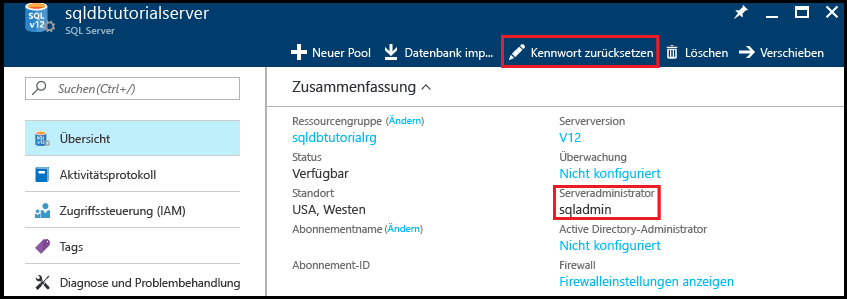

2. Notieren Sie den Namen für den Serveradministrator Ihres logischen Servers. 

3. Klicken Sie auf **Kennwort zurücksetzen**, um ein neues Kennwort festzulegen, falls Sie das Kennwort vergessen haben.

4. Die Verbindungsinformationen für diesen Server können Sie durch Klicken auf **Eigenschaften** ermitteln.

## <a name="view-server-admin-permissions-using-ssms"></a>Anzeigen von Serveradministratorberechtigungen mithilfe von SSMS

Die Schritte in dieser Prozedur veranschaulichen, wie Sie Informationen zum Serveradministratorkonto sowie die dazugehörigen Berechtigungen in der Masterdatenbank und in den Benutzerdatenbanken anzeigen.

1. Öffnen Sie SQL Server Management Studio, und stellen Sie als Serveradministrator eine Verbindung mit Ihrem Server her. Verwenden Sie dabei die SQL Server-Authentifizierung und das Serveradministratorkonto.

   

2. Klicken Sie auf **Verbinden**.

   

3. Erweitern Sie im Objekt-Explorer die Option **Sicherheit**, und erweitern Sie anschließend **Anmeldungen**, um die vorhandenen Anmeldungen für Ihren Server anzuzeigen. Auf einem neuen Server ist nur die Anmeldung für das Serveradministratorkonto vorhanden.

   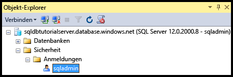

4. Erweitern Sie im Objekt-Explorer nacheinander die Optionen **Datenbanken**, **Systemdatenbanken**, **Master**, **Sicherheit** und anschließend **Benutzer**, um das Benutzerkonto anzuzeigen, das für die Serveradministratoranmeldung in dieser Datenbank erstellt wurde.

   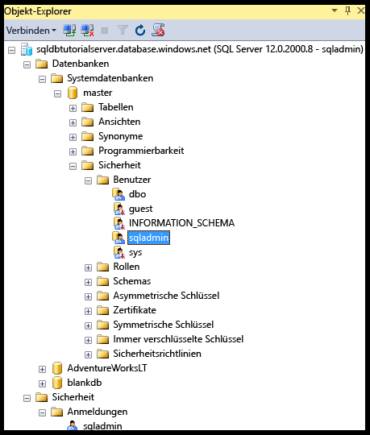

   > [!NOTE]
   > Informationen zu den anderen Benutzerkonten, die unter dem Knoten „Benutzer“ angezeigt werden, finden Sie unter [Prinzipale](https://msdn.microsoft.com/library/ms181127.aspx).
   >

5. Klicken Sie im Objekt-Explorer mit der rechten Maustaste auf **master**, und klicken Sie dann auf **Neue Abfrage**, um ein Abfragefenster mit Verbindung zur Masterdatenbank zu öffnen.
6. Führen Sie im Abfragefenster die folgende Abfrage aus, um Informationen zum Benutzer zurückzugeben, der die Abfrage ausführt. 

   ```
   SELECT USER;
   ```

   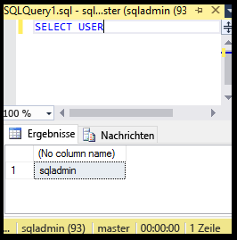

7. Führen Sie im Abfragefenster die folgende Abfrage aus, um Informationen zu den Berechtigungen des Benutzers „sqladmin“ in der **Masterdatenbank** zurückzugeben. 

   ```
   SELECT prm.permission_name
      , prm.class_desc
      , prm.state_desc
      , p2.name as 'Database role'
      , p3.name as 'Additional database role' 
   FROM sys.database_principals p
   JOIN sys.database_permissions prm
      ON p.principal_id = prm.grantee_principal_id
      LEFT JOIN sys.database_principals p2
      ON prm.major_id = p2.principal_id
      LEFT JOIN sys.database_role_members r
      ON p.principal_id = r.member_principal_id
      LEFT JOIN sys.database_principals p3
      ON r.role_principal_id = p3.principal_id
   WHERE p.name = 'sqladmin';
   ```

   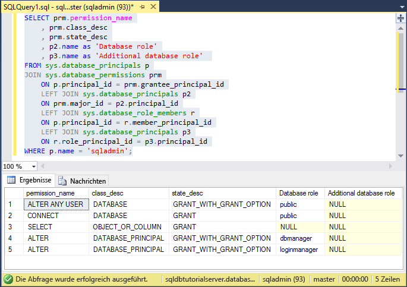

   >[!NOTE]
   > Der Serveradministrator verfügt über Berechtigungen zum Herstellen einer Verbindung mit der Masterdatenbank, zum Erstellen von Anmeldungen und Benutzern, zum Auswählen von Informationen aus der Tabelle „sys.sql_logins“ und zum Hinzufügen von Benutzern zu den Datenbankrollen „dbmanager“ und „dbcreator“. Diese Berechtigungen gelten zusätzlich zu den Berechtigungen, die für die öffentliche Rolle gewährt werden, von der alle Benutzer Berechtigungen erben (z.B. Berechtigungen zum Auswählen von Informationen aus bestimmten Tabellen). Weitere Informationen finden Sie unter [Berechtigungen](https://msdn.microsoft.com/library/ms191291.aspx).
   >

8. Erweitern Sie im Objekt-Explorer nacheinander die Optionen **blankdb**, **Sicherheit** und anschließend **Benutzer**, um das Benutzerkonto anzuzeigen, das für die Serveradministratoranmeldung in dieser Datenbank (und in den einzelnen Benutzerdatenbanken) erstellt wurde.

   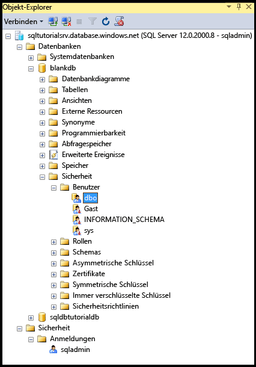

9. Klicken Sie im Objekt-Explorer mit der rechten Maustaste auf **blankdb**, und klicken Sie dann auf **Neue Abfrage**.

10. Führen Sie im Abfragefenster die folgende Abfrage aus, um Informationen zum Benutzer zurückzugeben, der die Abfrage ausführt.

   ```
   SELECT USER;
   ```

   

11. Führen Sie im Abfragefenster die folgende Abfrage aus, um Informationen zu den Berechtigungen des Benutzers „dbo“ zurückzugeben. 

   ```
   SELECT prm.permission_name
      , prm.class_desc
      , prm.state_desc
      , p2.name as 'Database role'
      , p3.name as 'Additional database role' 
   FROM sys.database_principals AS p
   JOIN sys.database_permissions AS prm
      ON p.principal_id = prm.grantee_principal_id
      LEFT JOIN sys.database_principals AS p2
      ON prm.major_id = p2.principal_id
      LEFT JOIN sys.database_role_members r
      ON p.principal_id = r.member_principal_id
      LEFT JOIN sys.database_principals AS p3
      ON r.role_principal_id = p3.principal_id
   WHERE p.name = 'dbo';
   ```

   

   > [!NOTE]
   > Der Benutzer „dbo“ gehört der öffentlichen Rolle und außerdem der festen Datenbankrolle „db_owner“ an. Weitere Informationen finden Sie unter [Rollen auf Datenbankebene](https://msdn.microsoft.com/library/ms189121.aspx).
   >

## <a name="create-a-new-user-with-select-permissions"></a>Erstellen eines neuen Benutzers mit SELECT-Berechtigungen

Die Schritte in dieser Prozedur veranschaulichen, wie Sie einen Benutzer auf Datenbankebene erstellen, die Standardberechtigungen eines neuen Benutzers (über die öffentliche Rolle) testen, einem Benutzer **SELECT**-Berechtigungen gewähren und die geänderten Berechtigungen anzeigen.

> [!NOTE]
> Benutzer auf Datenbankebene werden auch als [eigenständige Benutzer](https://msdn.microsoft.com/library/ff929188.aspx) bezeichnet und erhöhen die Portabilität Ihrer Datenbank. Informationen zu den Vorteilen der Portabilität finden Sie unter [Konfigurieren und Verwalten der Sicherheit von Azure SQL-Datenbank für Geowiederherstellung oder Failover](sql-database-geo-replication-security-config.md).
>

1. Klicken Sie im Objekt-Explorer mit der rechten Maustaste auf **sqldbtutorialdb**, und klicken Sie dann auf **Neue Abfrage**.
2. Führen Sie in diesem Abfragefenster die folgende Anweisung aus, um einen Benutzer namens **user1** in der Datenbank „sqldbtutorialdb“ zu erstellen.

   ```
   CREATE USER user1
   WITH PASSWORD = 'p@ssw0rd';
   ```
   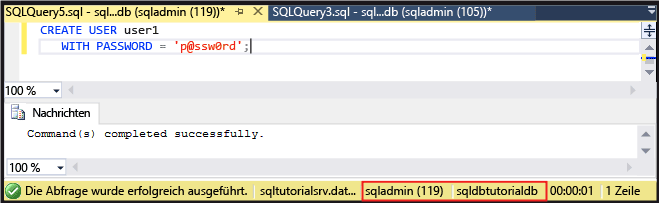

3. Führen Sie im Abfragefenster die folgende Abfrage aus, um Informationen zu den Berechtigungen des Benutzers „user1“ zurückzugeben.

   ```
   SELECT prm.permission_name
      , prm.class_desc
      , prm.state_desc
      , p2.name as 'Database role'
      , p3.name as 'Additional database role' 
   FROM sys.database_principals AS p
   JOIN sys.database_permissions AS prm
      ON p.principal_id = prm.grantee_principal_id
      LEFT JOIN sys.database_principals AS p2
      ON prm.major_id = p2.principal_id
      LEFT JOIN sys.database_role_members r
      ON p.principal_id = r.member_principal_id
      LEFT JOIN sys.database_principals AS p3
      ON r.role_principal_id = p3.principal_id
   WHERE p.name = 'user1';
   ```

   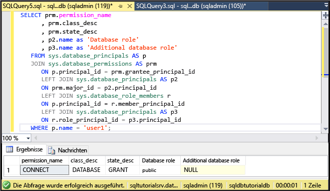

   > [!NOTE]
   > Ein neuer Benutzer in einer Datenbank verfügt nur über die Berechtigungen, die er von der öffentlichen Rolle geerbt hat.
   >

4. Führen Sie die folgenden Abfragen unter Verwendung der Anweisung **EXECUTE AS USER** aus, um die Tabelle „SalesLT.ProductCategory“ der Datenbank „sqldbtutorialdb“ als **user1** mit nur den Berechtigungen abzufragen, die Sie von der öffentlichen Rolle geerbt haben.

   ```
   EXECUTE AS USER = 'user1';  
   SELECT * FROM [SalesLT].[ProductCategory];
   REVERT;
   ```

   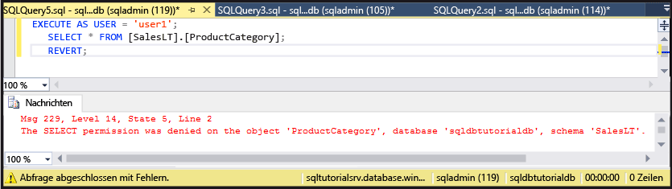

   > [!NOTE]
   > Die öffentliche Rolle gewährt standardmäßig keine **SELECT**-Berechtigungen für Benutzerobjekte.
   >

5. Führen Sie die folgende Anweisung aus, um **user1** für die Tabelle „SalesLT.ProductCategory“ **SELECT**-Berechtigungen zu gewähren.

   ```
   GRANT SELECT ON OBJECT::[SalesLT].[ProductCategory] to user1;
   ```

   

6. Führen Sie die folgenden Abfragen aus, um die Tabelle „SalesLT.ProductCategory“ in der Datenbank „sqldbtutorialdb“ erfolgreich als **user1** abzufragen.

   ```
   EXECUTE AS USER = 'user1';  
   SELECT * FROM [SalesLT].[ProductCategory];
   REVERT;
   ```

   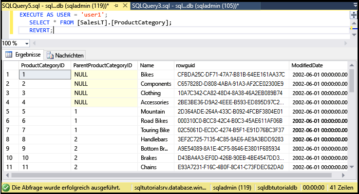

## <a name="create-a-database-level-firewall-rule-using-t-sql"></a>Erstellen einer Firewallregel auf Datenbankebene mithilfe von T-SQL

Die Schritte in dieser Prozedur veranschaulichen, wie Sie mithilfe der gespeicherten Systemprozedur [sp_set_database_firewall_rule](https://msdn.microsoft.com/library/dn270010.aspx) eine Firewallregel auf Datenbankebene erstellen. Mit einer Firewallregel auf Datenbankebene kann ein Serveradministrator den Benutzerzugriff über die Azure SQL-Datenbank-Firewall auf bestimmte Datenbanken beschränken.

> [!NOTE]
> [Firewallregeln auf Datenbankebene](sql-database-firewall-configure.md) erhöhen die Portabilität Ihrer Datenbank. Informationen zu den Vorteilen der Portabilität finden Sie unter [Konfigurieren und Verwalten der Sicherheit von Azure SQL-Datenbank für Geowiederherstellung oder Failover](sql-database-geo-replication-security-config.md).
>

> [!IMPORTANT]
> Stellen Sie zum Testen einer Firewallregel auf Datenbankebene eine Verbindung über einen anderen Computer her (oder löschen Sie die Firewallregel auf Serverebene im Azure-Portal).
>

1. Öffnen Sie SQL Server Management Studio auf einem Computer, für den Sie nicht über eine Firewallregel auf Serverebene verfügen.

2. Geben Sie im Fenster **Mit Server verbinden** den Servernamen und Authentifizierungsinformationen ein, um die Verbindung mit dem Konto **user1** unter Verwendung der SQL Server-Authentifizierung herzustellen. 
    
   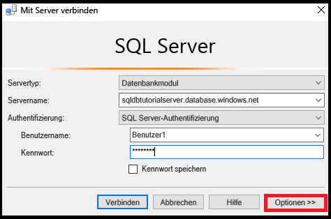

3. Klicken Sie auf **Optionen**, um die Datenbank anzugeben, mit der die Verbindung hergestellt werden soll, und geben Sie auf der Registerkarte **Verbindungseigenschaften** im Dropdownfeld **Verbindung mit Datenbank herstellen** den Text **sqldbtutorialdb** ein.
   
   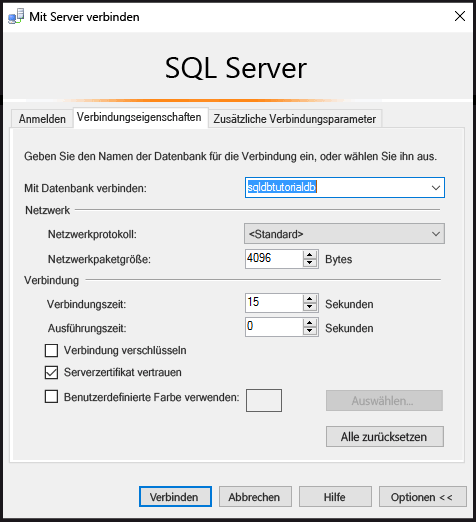

4. Klicken Sie auf **Verbinden**. 

   Es wird ein Dialogfeld mit dem Hinweis angezeigt, dass der Computer, von dem aus Sie die Verbindung mit SQL-Datenbank herstellen möchten, nicht über eine Firewallregel zum Ermöglichen des Zugriffs auf die Datenbank verfügt. 

   


5. Kopieren Sie die Client-IP-Adresse aus diesem Dialogfeld, um sie in Schritt 8 zu verwenden.
6. Klicken Sie auf **OK**, um das Fehlerdialogfeld zu schließen, lassen Sie das Dialogfeld **Mit Server verbinden** aber geöffnet.
7. Wechseln Sie wieder zu einem Computer, für den Sie bereits eine Firewallregel auf Serverebene erstellt haben. 
8. Stellen Sie in SSMS als Serveradministrator eine Verbindung mit der Datenbank „sqldbtutorialdb“ her, und führen Sie die folgende Anweisung aus, um eine Firewallregel auf Datenbankebene mit der IP-Adresse (oder dem Adressbereich) aus Schritt 5 zu erstellen.  

   ```
   EXEC sp_set_database_firewall_rule @name = N'sqldbtutorialdbFirewallRule', 
     @start_ip_address = 'x.x.x.x', @end_ip_address = 'x.x.x.x';
   ```

   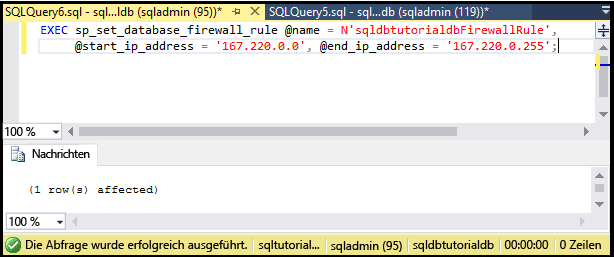

9. Wechseln Sie erneut den Computer, und klicken Sie im Dialogfeld **Mit Server verbinden** auf **Verbinden**, um als „user1“ eine Verbindung mit „sqldbtutorialdb“ herzustellen. 

   > [!NOTE]
   > Nach der Erstellung der Firewallregel auf Datenbankebene kann es bis zu fünf Minuten dauern, bis sie aktiv ist.
   >

10. Erweitern Sie nach erfolgreicher Verbindungsherstellung im Objekt-Explorer die Option **Datenbanken**. Beachten Sie, dass **user1** nur die Datenbank **sqldbtutorialdb** anzeigen kann.

   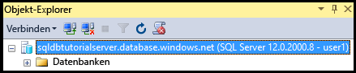

11. Erweitern Sie **sqldbtutorialdb** und anschließend **Tabellen**. Beachten Sie, dass „user1“ nur über die Berechtigung zum Anzeigen einer einzelnen Tabelle (**SalesLT.ProductCategory**) verfügt. 

   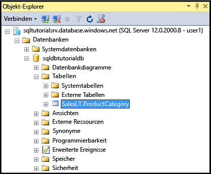

## <a name="create-a-new-user-as-dbowner-and-a-database-level-firewall-rule"></a>Erstellen eines neuen Benutzers als „db_owner“ und einer Firewallregel auf Datenbankebene

Die Schritte in dieser Prozedur veranschaulichen, wie Sie in einer anderen Datenbank einen Benutzer mit Berechtigungen der Datenbankrolle „db_owner“ und für diese andere Datenbank eine Firewallregel auf Datenbankebene erstellen. Der neue Benutzer, der der Rolle **db_owner** angehört, kann nur eine Verbindung mit dieser Einzeldatenbank herstellen und nur diese Datenbank verwalten.

1. Wechseln Sie zu Ihrem Computer mit einer SQL-Datenbank-Verbindung. Verwenden Sie dabei das Serveradministratorkonto.
2. Öffnen Sie ein Abfragefenster, während eine Verbindung mit der Datenbank **blankdb** besteht, und führen Sie die folgende Anweisung aus, um in der Datenbank „blankdb“ den Benutzer „blankdbadmin“ zu erstellen.

   ```
   CREATE USER blankdbadmin
   WITH PASSWORD = 'p@ssw0rd';
   ```

3. Führen Sie in demselben Abfragefenster die folgende Anweisung aus, um den Benutzer „blankdbadmin“ der Datenbankrolle „db_owner“ hinzuzufügen. Dieser Benutzer kann jetzt alle Aktionen durchführen, die zum Verwalten der Datenbank „blankdb“ erforderlich sind.

   ```
   ALTER ROLE db_owner ADD MEMBER blankdbadmin; 
   ```

4. Führen Sie in demselben Abfragefenster die folgende Anweisung aus, um eine Firewall auf Datenbankebene zu erstellen. Führen Sie hierzu [sp_set_database_firewall_rule](https://msdn.microsoft.com/library/dn270010.aspx) aus, indem Sie die IP-Adresse aus Schritt 4 im vorherigen Verfahren verwenden (bzw. einen Bereich mit IP-Adressen für Benutzer dieser Datenbank):

   ```
   EXEC sp_set_database_firewall_rule @name = N'blankdbFirewallRule', 
     @start_ip_address = 'x.x.x.x', @end_ip_address = 'x.x.x.x';
   ```

5. Wechseln Sie den Computer (zu einem Computer, für den Sie eine Firewallregel auf Datenbankebene erstellt haben), und stellen Sie eine Verbindung mit der Datenbank „blankdb“ her, indem Sie das Benutzerkonto „blankdbadmin“ verwenden.
6. Öffnen Sie ein Abfragefenster für die Datenbank „blankdb“, und führen Sie die folgende Anweisung aus, um den Benutzer „blankdbuser1“ in der Datenbank „blankdb“ zu erstellen.

   ```
   CREATE USER blankdbuser1
   WITH PASSWORD = 'p@ssw0rd';
   ```
 
7. Erstellen Sie für diesen Benutzer je nach Bedarf für Ihre Lernumgebung eine weitere Firewallregel auf Datenbankebene. Falls Sie die Firewallregel auf Datenbankebene mit einem IP-Adressbereich erstellt haben, ist dies unter Umständen nicht erforderlich.

## <a name="grant-dbmanager-permissions-and-create-a-server-level-firewall-rule"></a>Gewähren von Berechtigungen vom Typ „dbmanager“ und Erstellen einer Firewallregel auf Serverebene

Die Schritte in dieser Prozedur veranschaulichen, wie Sie eine Anmeldung und einen Benutzer in der Masterdatenbank mit Berechtigungen zum Erstellen und Verwalten neuer Benutzerdatenbanken erstellen. Außerdem erfahren Sie, wie Sie mithilfe von Transact-SQL unter Verwendung von [sp_set_firewall_rule](https://msdn.microsoft.com/library/dn270017.aspx) eine weitere Firewallregel auf Serverebene erstellen. 

> [!IMPORTANT]
>Die erste Firewallregel auf Serverebene muss immer in Azure (über das Azure-Portal, mithilfe von PowerShell oder über die REST-API) erstellt werden.
>

> [!IMPORTANT]
> Die Erstellung von Anmeldungen in der Masterdatenbank und die Erstellung eines Benutzerkontos auf der Grundlage einer Anmeldung sind für den Serveradministrator erforderlich, um Datenbankerstellungsberechtigungen für einen anderen Benutzer delegieren zu können. Die Erstellung von Anmeldungen mit anschließender Erstellung von Benutzern auf der Grundlage von Anmeldungen beeinträchtigt jedoch die Portabilität Ihrer Umgebung.
>

1. Wechseln Sie zu Ihrem Computer mit einer SQL-Datenbank-Verbindung. Verwenden Sie dabei das Serveradministratorkonto.
2. Öffnen Sie ein Abfragefenster mit Verbindung zur Masterdatenbank, und führen Sie die folgende Anweisung aus, um in der Masterdatenbank eine Anmeldung mit dem Namen „dbcreator“ zu erstellen.

   ```
   CREATE LOGIN dbcreator
   WITH PASSWORD = 'p@ssw0rd';
   ```

3. In demselben Abfragefenster: 

   ```
   CREATE USER dbcreator
   FROM LOGIN dbcreator;
   ```

3. Führen Sie in demselben Abfragefenster die folgende Abfrage aus, um den Benutzer „dbcreator“ der Datenbankrolle „dbmanager“ hinzuzufügen. Dieser Benutzer kann jetzt vom Benutzer erstellte Datenbanken erstellen und verwalten.

   ```
   ALTER ROLE dbmanager ADD MEMBER dbcreator; 
   ```

4. Führen Sie im gleichen Abfragefenster die folgende Abfrage aus, um eine Firewallregel auf Serverebene zu erstellen. Führen Sie hierzu [sp_set_firewall_rule](https://msdn.microsoft.com/library/dn270017.aspx) mit einer geeigneten IP-Adresse für Ihre Umgebung aus:

   ```
   EXEC sp_set_firewall_rule @name = N'dbcreatorFirewallRule', 
     @start_ip_address = 'x.x.x.x', @end_ip_address = 'x.x.x.x';
   ```

5. Wechseln Sie den Computer (zu einem Computer, für den Sie eine Firewallregel auf Serverebene erstellt haben), und stellen Sie eine Verbindung mit der Masterdatenbank her, indem Sie das Benutzerkonto „dbcreator“ verwenden.
6. Öffnen Sie ein Abfragefenster für die Masterdatenbank, und führen Sie die folgende Abfrage aus, um eine Datenbank mit dem Namen „foo“ zu erstellen.

   ```
   CREATE DATABASE FOO (EDITION = 'basic');
   ```
 7. Sie können diese Datenbank mit der folgenden Anweisung auch löschen, um Kosten zu sparen:

   ```
   DROP DATABASE FOO;
   ```

## <a name="complete-script"></a>Vollständiges Skript

Führen Sie die folgenden Anweisungen in den entsprechenden Datenbanken auf Ihrem Server aus, um die Anmeldungen und Benutzer zu erstellen, diese Benutzer Rollen hinzuzufügen, Berechtigungen zu gewähren, Firewallregeln auf Datenbankebene zu erstellen und Firewallregeln auf Serverebene zu erstellen.

### <a name="master-database"></a>Masterdatenbank
Führen Sie diese Anweisungen in der Masterdatenbank mit dem Serveradministratorkonto aus, indem Sie die passende IP-Adresse bzw. einen Bereich mit IP-Adressen hinzufügen.

```
CREATE LOGIN dbcreator WITH PASSWORD = 'p@ssw0rd';
CREATE USER dbcreator FROM LOGIN dbcreator;
ALTER ROLE dbmanager ADD MEMBER dbcreator;
EXEC sp_set_firewall_rule @name = N'dbcreatorFirewallRule', 
     @start_ip_address = 'x.x.x.x', @end_ip_address = 'x.x.x.x';
```

### <a name="sqldbtutorialdb-database"></a>Datenbank „sqldbtutorialdb“
Führen Sie die folgenden Anweisungen in der Datenbank „sqldbtutorialdb“ mit dem Serveradministratorkonto aus, und fügen Sie dabei die passenden IP-Adressen bzw. den passenden IP-Adressbereich hinzu.

```
CREATE USER user1 WITH PASSWORD = 'p@ssw0rd';
GRANT SELECT ON OBJECT::[SalesLT].[ProductCategory] to user1;
EXEC sp_set_database_firewall_rule @name = N'sqldbtutorialdbFirewallRule', 
     @start_ip_address = 'x.x.x.x', @end_ip_address = 'x.x.x.x';
```

### <a name="blankdb-database"></a>Datenbank „blankdb“
Führen Sie diese Anweisungen in der Datenbank „blankdb“ mit dem Serveradministratorkonto aus, indem Sie die passende IP-Adresse bzw. einen Bereich mit IP-Adressen hinzufügen.

```
CREATE USER blankdbadmin
   WITH PASSWORD = 'p@ssw0rd';
ALTER ROLE db_owner ADD MEMBER blankdbadmin;
EXEC sp_set_database_firewall_rule @name = N'blankdbFirewallRule', 
     @start_ip_address = 'x.x.x.x', @end_ip_address = 'x.x.x.x';
CREATE USER blankdbuser1
   WITH PASSWORD = 'p@ssw0rd';
```

## <a name="next-steps"></a>Nächste Schritte
- Eine Übersicht über den Zugriff und die Steuerung in SQL-Datenbank finden Sie unter [Azure SQL Database access control](sql-database-control-access.md) (SQL-Datenbank – Zugriffssteuerung).
- Eine Übersicht über Anmeldungen, Benutzer und Datenbankrollen in SQL-Datenbank finden Sie unter [SQL-Datenbank-Authentifizierung und -Autorisierung: Gewähren von Zugriff](sql-database-manage-logins.md).
- Weitere Informationen zu Datenbankprinzipalen finden Sie unter [Prinzipale](https://msdn.microsoft.com/library/ms181127.aspx).
- Weitere Informationen zu Datenbankrollen finden Sie unter [Datenbankrollen](https://msdn.microsoft.com/library/ms189121.aspx).
- Weitere Informationen zu Firewallregeln in SQL-Datenbank finden Sie unter [Übersicht über Firewallregeln für Azure SQL-Datenbank](sql-database-firewall-configure.md).
- Ein Tutorial mit Azure Active Directory-Authentifizierung finden Sie unter [Azure AD-Authentifizierung und Autorisierung](sql-database-control-access-aad-authentication-get-started.md).


