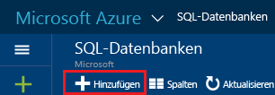

# <a name="create-an-azure-sql-database"></a>Erstellen einer Azure SQL-Datenbank

Sie können eine Azure SQL-Datenbank mit dem [Azure-Portal](https://portal.azure.com/), PowerShell, Transact-SQL, der REST-API oder C# erstellen. 

## <a name="create-an-azure-sql-database-using-the-azure-portal"></a>Erstellen einer Azure SQL-Datenbank mithilfe des Azure-Portals

1. Öffnen Sie im [Azure-Portal](https://portal.azure.com/) das Blatt **SQL-Datenbanken**. 

    
2. Klicken Sie auf dem Blatt „SQL-Datenbanken“ auf **Hinzufügen**.

    

> [!TIP]
> Ein Einführungstutorial für das Azure-Portal und SQL Server Management Studio finden Sie unter [Erste Schritte mit Azure SQL-Datenbankservern, -Servern, -Datenbanken und -Firewallregeln mit dem Azure-Portal und SQL Server Management Studio](sql-database-get-started.md).
>

## <a name="create-an-azure-sql-database-using-powershell"></a>Erstellen einer Azure SQL-Datenbank mithilfe von PowerShell

Um eine SQL-Datenbank zu erstellen, verwenden Sie das Cmdlet [New-AzureRmSqlDatabase](https://docs.microsoft.com/powershell/resourcemanager/azurerm.sql/v2.3.0/new-azurermsqldatabase). Die Ressourcengruppe und der Server müssen bereits in Ihrem Abonnement vorhanden sein. 

```
$resourceGroupName = "resourcegroup1"
$sqlServerName = "server1"

$databaseName = "database1"
$databaseEdition = "Standard"
$databaseServiceLevel = "S0"

$currentDatabase = New-AzureRmSqlDatabase -ResourceGroupName $resourceGroupName `
 -ServerName $sqlServerName -DatabaseName $databaseName `
 -Edition $databaseEdition -RequestedServiceObjectiveName $databaseServiceLevel
```
> [!TIP]
> Ein Beispielskript finden Sie unter [Erstellen eines SQL-Datenbank-PowerShell-Skripts](sql-database-get-started-powershell.md).
>

## <a name="create-an-azure-sql-database-using-transact-sql-in-sql-server-management-studio"></a>Erstellen einer Azure SQL-Datenbank mit Transact-SQL in SQL Server Management Studio

So erstellen Sie eine SQL-Datenbank mit Transact-SQL in SQL Server Management Studio:

1. Stellen Sie mithilfe von SQL Server Management Studio eine Verbindung mit dem Azure-Datenbankserver her. Verwenden Sie dabei die Prinzipalanmeldung auf Serverebene oder eine Anmeldung, die Mitglied der **Dbmanager**-Rolle ist. Weitere Informationen zu Anmeldungen finden Sie unter [Verwalten von Anmeldungen](sql-database-manage-logins.md).
2. Öffnen Sie im Objekt-Explorer den Knoten „Datenbanken“, erweitern Sie den Ordner **Systemdatenbanken**, klicken Sie mit der rechten Maustaste auf **master**, und klicken Sie anschließend auf **Neue Abfrage**.
3. Verwenden Sie die Anweisung **CREATE DATABASE** , um eine Datenbank zu erstellen. Weitere Informationen finden Sie unter [CREATE DATABASE (SQL-Datenbank)](https://msdn.microsoft.com/library/dn268335.aspx). Die folgende Anweisung erstellt eine Datenbank mit dem Namen **myTestDB** und gibt an, dass es sich um eine Datenbank der Standard S0-Edition mit einer maximalen Standardgröße von 250 GB handelt.
  
      CREATE DATABASE myTestDB    (EDITION='Standard',     SERVICE_OBJECTIVE='S0');

4. Klicken Sie auf **Ausführen** , um die Abfrage durchzuführen.
5. Klicken Sie im Objekt-Explorer mit der rechten Maustaste auf den Knoten „Datenbanken“, und klicken Sie auf **Aktualisieren**, um die neue Datenbank im Objekt-Explorer anzuzeigen. 

> [!TIP]
> Ein Einführungstutorial für das Azure-Portal und SQL Server Management Studio finden Sie unter [Erste Schritte mit Azure SQL-Datenbankservern, -Servern, -Datenbanken und -Firewallregeln mit dem Azure-Portal und SQL Server Management Studio](sql-database-get-started.md).
>

## <a name="additional-resources"></a>Zusätzliche Ressourcen
* Eine Übersicht über Verwaltungstools finden Sie unter [Übersicht: Verwaltungstools für SQL-Datenbank](sql-database-manage-overview.md).
* Informationen zum Ausführen von Verwaltungsaufgaben mit dem Azure-Portal finden Sie unter [Verwalten von Azure SQL-Datenbanken über das Azure-Portal](sql-database-manage-portal.md).
* Informationen zum Ausführen von Verwaltungsaufgaben mithilfe von PowerShell finden Sie unter [Verwalten von Azure SQL-Datenbank mithilfe von PowerShell](sql-database-manage-powershell.md).
* Informationen zum Ausführen von Verwaltungsaufgaben mithilfe von SQL Server Management Studio finden Sie unter [Verwalten einer Azure SQL-Datenbank mit SQL Server Management Studio](sql-database-manage-azure-ssms.md).
* Informationen zum SQL-Datenbank-Dienst finden Sie unter [Was ist SQL Database? Einführung in SQL-Datenbank](sql-database-technical-overview.md). 
* Informationen zu Azure-Datenbankservern und Datenbankfeatures finden Sie unter [Funktionen von Azure SQL-Datenbank](sql-database-features.md).


<!--HONumber=Dec16_HO3-->


