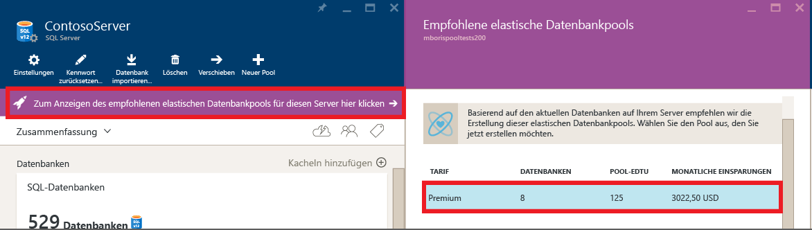
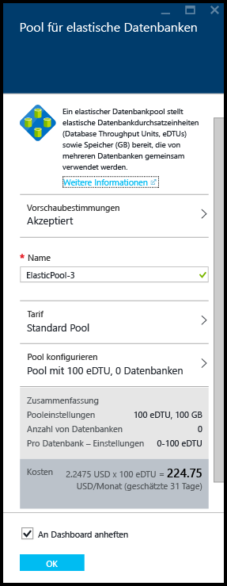
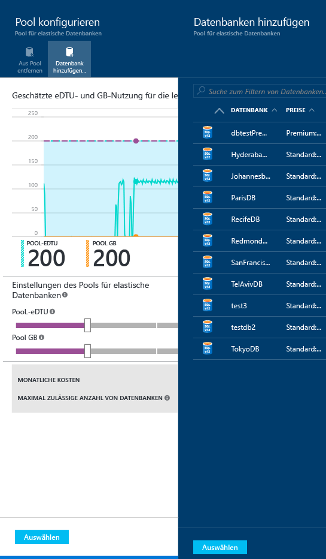
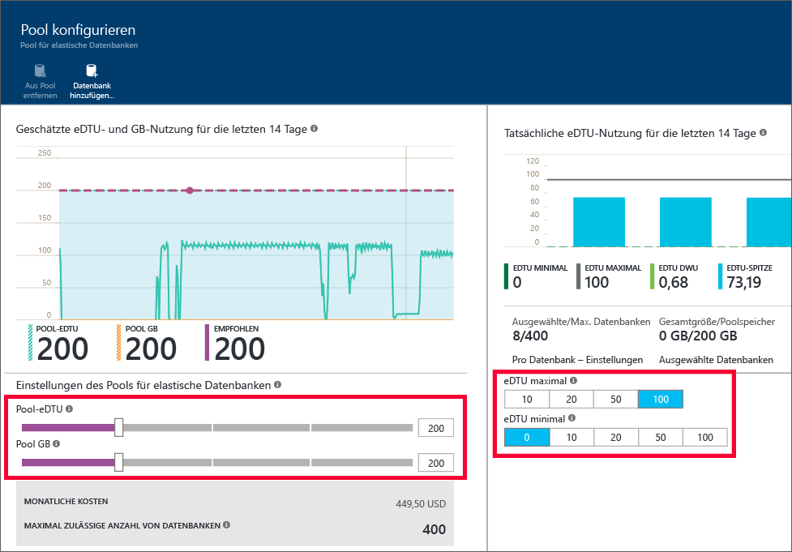

<properties
	pageTitle="Erstellen eines neuen elastischen Pools mit dem Azure-Portal | Microsoft Azure"
	description="Enthält Informationen zum Hinzufügen eines skalierbaren Pools für elastische Datenbanken zu Ihrer SQL-Datenbankkonfiguration, um eine einfachere Verwaltung und Ressourcenfreigabe zwischen zahlreichen Datenbanken zu ermöglichen."
	keywords="Skalierbare Datenbank, Datenbankkonfiguration"
	services="sql-database"
	documentationCenter=""
	authors="ninarn"
	manager="jhubbard"
	editor=""/>

<tags
	ms.service="sql-database"
	ms.devlang="NA"
	ms.date="07/20/2016"
	ms.author="ninarn"
	ms.workload="data-management"
	ms.topic="get-started-article"
	ms.tgt_pltfrm="NA"/>

# Erstellen eines neuen Pools für elastische Datenbanken mit dem Azure-Portal

> [AZURE.SELECTOR]
- [Azure-Portal](sql-database-elastic-pool-create-portal.md)
- [PowerShell](sql-database-elastic-pool-create-powershell.md)
- [C#](sql-database-elastic-pool-create-csharp.md)

In diesem Artikel wird beschrieben, wie Sie im [Azure-Portal](https://portal.azure.com/) einen skalierbaren [Pool für elastische Datenbanken](sql-database-elastic-pool.md) erstellen. Es gibt zwei Möglichkeiten, wie Sie einen Pool erstellen können. Sie können einen Pool von Grund auf neu erstellen, wenn Sie genau wissen, wie der Pool aussehen soll. Sie können aber auch mit einer Empfehlung des Diensts beginnen. Die SQL-Datenbank verfügt über ein integriertes Intelligence-Modul . Ein Pool-Setup wird empfohlen, wenn es für Sie anhand der Telemetriedaten zur bisherigen Datenbanknutzung kostengünstiger ist.

Sie können einem Server mehrere Pools hinzufügen, aber es ist nicht möglich, Datenbanken von verschiedenen Servern in demselben Pool zusammenzufassen. Zum Erstellen eines Pools benötigen Sie mindestens eine Datenbank auf einem V12-Server. Falls Sie keinen Server dieser Art besitzen, helfen Ihnen die Informationen unter [Erstellen einer ersten Azure SQL-Datenbank](sql-database-get-started.md) weiter. Sie können einen Pool mit nur einer Datenbank erstellen, aber Pools sind erst mit mehreren Datenbanken kosteneffizient. Weitere Informationen finden Sie unter [Überlegungen zum Preis und zur Leistung eines Pools für elastische Datenbanken](sql-database-elastic-pool-guidance.md).

> [AZURE.NOTE] Elastische Pools sind in allen Azure-Regionen allgemein verfügbar, mit Ausnahme von „Indien, Westen“. Dort befinden sie sich derzeit in der Vorschauphase. Die allgemeine Verfügbarkeit von elastischen Pools in dieser Region wird so bald wie möglich bereitgestellt.

## Schritt 1: Erstellen eines neuen Pools

In diesem Artikel wird gezeigt, wie Sie aus einem im Portal vorhandenen Serverblatt einen neuen Pool erstellen. Dies ist die einfachste Möglichkeit, um vorhandene Datenbanken in einen Pool zu verschieben.

> [AZURE.NOTE] Es spielt keine Rolle, ob Sie bereits über einen Server verfügen: Sie können einen neuen Pool auch über das Blatt **Elastische SQL-Pools** erstellen. (Klicken Sie links im Portal unterhalb der Liste auf **Durchsuchen** **>** **Elastische SQL-Pools**.) Wenn Sie auf dem Blatt **Elastische SQL-Pools** auf **+ Hinzufügen** klicken, werden die Schritte zum Erstellen eines neuen Servers während des Workflows zur Poolbereitstellung angezeigt.

1. Klicken Sie im [Azure-Portal](http://portal.azure.com/) unterhalb der Liste auf der linken Seite auf **Durchsuchen** **>** **Computer mit SQL Server** und dann auf den Server mit den Datenbanken, die Sie einem Pool hinzufügen möchten.
2. Klicken Sie auf **Neuer Pool**.

    

    **ODER**

    Unter Umständen wird eine Meldung angezeigt, die darauf hinweist, dass empfohlene Pools für elastische Datenbanken für den Server vorhanden sind (nur V12). Klicken Sie auf die Meldung, um die Pools anzuzeigen, die basierend auf den Telemetriedaten zur bisherigen Datenbanknutzung empfohlen werden. Klicken Sie anschließend auf die Ebene, um weitere Details anzuzeigen und den Pool anzupassen. Informationen zur Bereitstellung der Empfehlung finden Sie weiter unten in diesem Thema unter [Grundlagen von Poolempfehlungen](#understand-pool-recommendations).

    

    Das Blatt **Pool für elastische Datenbanken**, auf dem Sie den Pool einrichten, wird angezeigt. Wenn Sie im vorherigen Schritt auf **Neuer Pool** geklickt haben, werden vom Portal unter **Tarif** ein **Standard-Pool**, ein eindeutiger **Name** für den Pool und eine Standardkonfiguration für den Pool ausgewählt. Wenn Sie einen empfohlenen Pool ausgewählt haben, sind die empfohlene Ebene und die Konfiguration des Pools bereits ausgewählt, aber Sie können diese Angaben immer noch ändern.

    

3. Geben Sie einen Namen für den elastischen Pool an, oder behalten Sie den Standardnamen bei.

## Schritt 2: Auswählen eines Tarifs

Der Tarif für den Pool legt die Features für die elastischen Datenbanken im Pool, die maximale Anzahl von eDTUs (eDTU MAX) und den für jede Datenbank verfügbaren Speicher (GB) fest. Weitere Informationen finden Sie unter den Dienstebenen.

Um den Tarif für den Pool zu ändern, klicken Sie auf die Option **Tarif**, auf den gewünschten Tarif und dann auf **Auswählen**.

> [AZURE.IMPORTANT] Nachdem Sie den Tarif ausgewählt und Ihre Änderungen übernommen haben, indem Sie im letzten Schritt auf **OK** geklickt haben, können Sie den Tarif des Pools nicht mehr ändern. Um den Tarif für einen vorhandenen elastischen Pool zu ändern, erstellen Sie einen neuen elastischen Pool im gewünschten Tarif, und migrieren Sie dann die elastischen Datenbanken zu diesem neuen Pool.

## Schritt 3: Konfigurieren des Pools

Klicken Sie nach dem Festlegen des Tarifs auf „Pool konfigurieren“. Hier fügen Sie Datenbanken hinzu, legen Pool-eDTUs und den Speicher (GB für Pool) fest und geben die eDTU-Minimalwerte und -Maximalwerte für die elastischen Datenbanken im Pool an.

1. Klicken auf **Pool konfigurieren**.
2. Wählen Sie die Datenbanken aus, die Sie dem Pool hinzufügen möchten. Beim Erstellen des Pools ist dies ein optionaler Schritt. Nachdem der Pool erstellt wurde, können Datenbanken hinzugefügt werden. Klicken Sie zum Hinzufügen von Datenbanken auf **Datenbank hinzufügen**, wählen Sie die Datenbanken aus, die Sie hinzufügen möchten, und klicken Sie anschließend auf die Schaltfläche **Auswählen**.

    

    Wenn die von Ihnen verwendeten Datenbanken über ausreichend Telemetriedaten zur bisherigen Nutzung verfügen, werden der Graph **Estimated eDTU and GB usage** (Geschätzte eDTU- und GB-Nutzung) und das Balkendiagramm **Actual eDTU usage** (Tatsächliche eDTU-Nutzung) aktualisiert. Diese helfen Ihnen dabei, Konfigurationsentscheidungen zu treffen. Außerdem erhalten Sie vom Dienst unter Umständen eine Empfehlungsnachricht zur richtigen Dimensionierung des Pools. Siehe [Dynamische Empfehlungen](#dynamic-recommendations).

3. Verwenden Sie die Steuerelemente auf der Seite **Pool konfigurieren**, um die Einstellungen zu untersuchen und den Pool zu konfigurieren. Weitere Details zu den Grenzwerten für die einzelnen Dienstebenen finden Sie unter [Beschränkungen für elastische Pools](sql-database-elastic-pool.md#edtu-and-storage-limits-for-elastic-pools-and-elastic-databases), und eine ausführliche Anleitung zur Größenanpassung eines Pools finden Sie unter [Wo sollte ein Pool für elastische Datenbanken verwendet werden?](sql-database-elastic-pool-guidance.md). Weitere Informationen zu Einstellungen für Pools finden Sie unter [Eigenschaften von Pools für elastische Datenbanken](sql-database-elastic-pool.md#elastic-database-pool-properties).

	

4. Wenn Sie die Einstellungen geändert haben, klicken Sie auf dem Blatt **Pool konfigurieren** auf **Auswählen**.
5. Klicken Sie auf **OK**, um den Pool zu erstellen.

## Grundlagen von Poolempfehlungen

Der SQL-Datenbankdienst bewertet den Nutzungsverlauf und empfiehlt einen oder mehrere Pools, wenn dies kostengünstiger als die Verwendung von Einzeldatenbanken ist. Jede Empfehlung ist mit einer eindeutigen Teilmenge der Datenbanken des Servers konfiguriert, die optimal zum Pool passen.

Die Poolempfehlung umfasst Folgendes:

- Tarif für den Pool (Basic, Standard oder Premium)
- Passende **POOL-eDTUs** (auch als maximale eDTUs pro Pool bezeichnet)
- **eDTU maximal** und **eDTU minimal** pro Datenbank
- Liste der empfohlenen Datenbanken für den Pool

Der Dienst berücksichtigt bei der Empfehlung von Pools die Telemetrie der letzten 30 Tage. Damit eine Datenbank als Kandidat für einen elastischen Datenbankpool berücksichtigt wird, muss sie seit mindestens 7 Tagen existieren. Datenbanken, die sich bereits in einem elastischen Datenbankpool befinden, werden nicht als Empfehlungskandidaten für elastische Datenbankpools angesehen.

Der Dienst bewertet den Ressourcenbedarf und die Kosteneffizienz beim Verschieben der Einzeldatenbanken auf jeder Dienstebene in Pools auf der gleichen Ebene. Beispielsweise werden alle Datenbanken der Standard-Edition auf einem Server entsprechend ihrer Eignung für einen elastischen Pool der Standard-Edition bewertet. Dies bedeutet, dass der Dienst keine tarifübergreifenden Empfehlungen trifft, also etwa eine Standard-Datenbank nicht in einen Premium-Pool verschiebt.

### Dynamische Empfehlungen

Nach dem Hinzufügen von Datenbanken zum Pool werden Empfehlungen basierend auf dem Nutzungsverlauf der von Ihnen ausgewählten Datenbanken dynamisch generiert. Diese Empfehlungen werden im Diagramm zur eDTU- und GB-Nutzung sowie im Empfehlungsbanner oben auf dem Blatt **Pool konfigurieren** angezeigt. Diese Empfehlungen sollen Ihnen als Hilfe beim Erstellen eines Pools dienen, der für Ihre speziellen Datenbanken optimiert ist.

## Zusätzliche Ressourcen

- [Verwalten eines elastischen SQL-Datenbankpools mit dem Portal](sql-database-elastic-pool-manage-portal.md)
- [Verwalten eines elastischen SQL-Datenbankpools mit PowerShell](sql-database-elastic-pool-manage-powershell.md)
- [Verwalten eines elastischen SQL-Datenbankpools mit C#](sql-database-elastic-pool-manage-csharp.md)
- [Übersicht über Features für elastische Datenbanken](sql-database-elastic-scale-introduction.md)

<!---HONumber=AcomDC_0928_2016-->