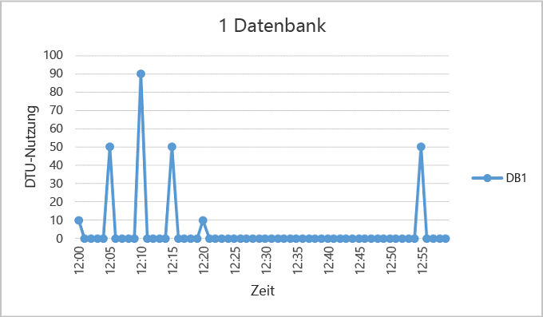
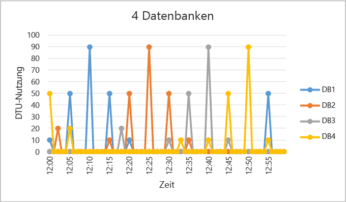
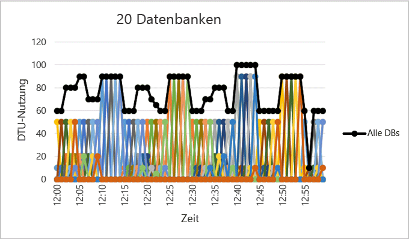

# Wann sollte ein elastischer Pool verwendet werden?
Bewerten Sie auf Grundlage der Datenbankverwendungsmuster und der Preisunterschiede zwischen einem elastischen Pool und Einzeldatenbanken, ob die Verwendung eines elastischen Pools kosteneffizient ist. Darüber hinaus sind weitere Anleitungen enthalten, die Sie bei der Ermittlung der aktuellen Poolgröße für eine vorhandene Reihe von SQL-Datenbanken unterstützen.  

* Eine Übersicht zu Pools für SQL-Datenbanken finden Sie unter [Was ist ein elastischer Azure-Pool?](sql-database-elastic-pool.md).

> [!NOTE]
> Elastische Pools sind in allen Azure-Regionen allgemein verfügbar, mit Ausnahme von „Indien, Westen“. Dort befinden sie sich derzeit in der Vorschauphase. Die allgemeine Verfügbarkeit von elastischen Pools in dieser Region wird so bald wie möglich bereitgestellt.
>
>

## Elastische Pools
SaaS-Entwickler erstellen Anwendungen, die auf der obersten von umfangreichen Datenebenen aufsetzen, die wiederum aus zahlreichen Datenbanken bestehen können. In einem üblichen Anwendungsmuster wird jedem Kunden eine eigene Datenbank zur Verfügung gestellt. Verschiedene Kunden weisen jedoch oft unterschiedliche und unvorhersehbare Verwendungsmuster auf, und es ist schwierig, den Ressourcenbedarf jedes einzelnen Datenbankbenutzers vorherzusagen. Daher stellt der Entwickler möglicherweise zu viele Ressourcen bereit, um den bestmöglichen Datendurchsatz und die optimale Antwortzeit für alle Datenbanken zu gewährleisten. Das ist jedoch mit erheblichen Kosten verbunden. Alternativ stellt der Entwickler weniger Ressourcen bereit und riskiert eine schlechtere Leistung für seine Kunden. Weitere Informationen zu Entwurfsmustern für SaaS-Anwendungen, für die elastische Pools verwendet werden, finden Sie unter [Entwurfsmuster für SaaS-Anwendungen mit mehreren Mandanten und Azure SQL-Datenbank](sql-database-design-patterns-multi-tenancy-saas-applications.md).

Mit Pools für elastische Datenbanken in Azure SQL-Datenbanken sind SaaS-Entwickler in der Lage, das Preis-Leistungs-Verhältnis einer Gruppe von Datenbanken im Rahmen eines vorgegebenen Budgets zu optimieren und gleichzeitig eine flexible Leistung für jede Datenbank sicherzustellen. Mit Pools können Entwickler elastische Datenbanktransaktionseinheiten (Elastic Database Transaction Units, eDTUs) für einen Pool erwerben, der von mehreren Datenbanken genutzt wird, um unvorhersehbare Auslastungszeiten von einzelnen Datenbanken abzufedern. Die eDTU-Anforderungen eines Pools werden anhand der zusammengefassten Auslastung der hierin befindlichen Datenbanken ermittelt. Die Anzahl der für den Pool verfügbaren eDTUs wird vom Budget des Entwicklers gesteuert. Pools vereinfachen es dem Entwickler, die Auswirkungen des Budgets auf die Leistung des Pools und umgekehrt abzuwägen. Der Entwickler fügt dem Pool einfach Datenbanken hinzu, legt die minimale und maximale Anzahl der eDTUs für die Datenbanken fest und bestimmt dann basierend auf dem vorhandenen Budget die eDTUs des Pools. Mithilfe von Pools können Entwickler ihre Dienste problemlos und kontinuierlich ausbauen, von schlanken Startups bis hin zu etablierten Unternehmen.  

## Wann sollten Sie einen Pool in Betracht ziehen?
Pools eignen sich hervorragend für eine große Anzahl an Datenbanken mit spezifischen Nutzungsmustern. Im Hinblick auf eine einzelne Datenbank wird dieses Muster durch eine geringe durchschnittliche Auslastung mit relativ wenigen Nutzungslastspitzen gekennzeichnet.

Je mehr Datenbanken Sie einem Pool hinzufügen können, desto größer werden Ihre Ersparnisse. Abhängig vom Auslastungsmuster Ihrer Anwendung können Sie bereits mit nur zwei S3-Datenbanken Ersparnisse erzielen.  

Die folgenden Abschnitte helfen Ihnen einzuschätzen, ob Ihre Datenbanksammlung von einem Pool profitieren kann. In den Beispielen wird von Standardpools ausgegangen. Die Grundlagen gelten jedoch auch für Basic- und Premiumpools.

### Bewerten der Datenbankauslastungsmuster
In der folgenden Abbildung finden Sie ein Beispiel für eine Datenbank, die sich in der Regel im Leerlauf befindet, bei der es allerdings auch regelmäßig zu Auslastungsspitzen kommt. Dieses Auslastungsmuster eignet sich für einen Pool:

   

Im dargestellten Zeitraum von fünf Minuten schnellt DB1 auf bis zu 90 DTUs. Die mittlere Auslastung liegt jedoch bei unter 5 DTUs. Zum Ausführen dieser Workload in einer einzelnen Datenbank ist eine S3-Leistungsstufe erforderlich. Allerdings bewirkt dies, dass die meisten Ressourcen in Zeiten geringer Aktivität nicht verwendet werden.

Mit einem Pool können diese ungenutzten DTUs auf mehrere Datenbanken verteilt werden, wodurch sich die erforderlichen DTUs und damit auch die Gesamtkosten verringern.

Ausgehend vom vorherigen Beispiel nehmen wir einmal an, dass es weitere Datenbanken mit ähnlichen Auslastungsmustern wie DB1 gibt. In den beiden folgenden Abbildungen wird die Auslastung von einmal vier, und von weiteren 20 Datenbanken in jeweils einem Graphen dargestellt. Dies soll veranschaulichen, dass sich die Auslastung der Datenbanken zeitlich nicht überlappt:

   

  

Die zusammengefasste DTU-Auslastung aller 20 Datenbanken wird in der vorstehenden Abbildung durch die schwarze Linie dargestellt. Diese zeigt, dass die zusammengefasste DTU-Auslastung niemals 100 DTUs übersteigt, und gibt an, dass die 20 Datenbanken in diesem Zeitraum 100 eDTUs gemeinsam nutzen können. Dies führt zu einer 20-fachen Verringerung im Hinblick auf die DTUs und einer 13-fachen Preisreduzierung im Vergleich zur Positionierung jeder Datenbank in S3-Leistungsstufen für Einzeldatenbanken.

Dieses Beispiel ist aus den folgenden Gründen ideal:

* Es gibt große Unterschiede zwischen der Spitzenauslastung und der mittleren Auslastung pro Datenbank.  
* Die Spitzenauslastung jeder Datenbank ergibt sich zu jeweils unterschiedlichen Zeitpunkten.
* eDTUs werden von mehreren Datenbanken gemeinsam genutzt.

Der Preis eines Pools ergibt sich aus den eDTUs des Pools. Während der Preis pro eDTU für einen Pool 1,5 Mal höher als der Preis pro DTU für eine Einzeldatenbank ist, können hierbei **Pool-eDTUs von vielen Datenbanken gemeinsam genutzt werden, daher liegt der Preis unter der Gesamtanzahl der benötigten eDTUs**. Die Unterschiede bei der Preisgestaltung und die gemeinsame Nutzung von eDTUs sind die Basis des Einsparungspotenzials, das von Pools geboten wird.  

Die folgenden Faustregeln hinsichtlich der Anzahl der Datenbanken und ihrer Auslastung sollen Ihnen helfen, sicherzustellen, dass Pools kosteneffizienter als Leistungsebenen für einzelne Datenbanken sind.

### Minimale Anzahl Datenbanken
Wenn die Summe der DTUs für Leistungsstufen für einzelne Datenbanken mehr als das 1,5-fache der für den Pool benötigten eDTUs entspricht, ist ein elastischer Pool kostengünstiger. Informationen zu den verfügbaren Größen finden Sie unter [eDTUs und Speicherbeschränkungen für elastische Pools und elastische Datenbanken](sql-database-elastic-pool.md#edtu-and-storage-limits-for-elastic-pools).

***Beispiel*** 
Es werden mindestens zwei S3-Datenbanken oder mindestens 15 S0-Datenbanken benötigt, damit ein Pool mit 100 eDTUs kosteneffizienter als die Verwendung von Leistungsebenen für einzelne Datenbanken ist.

### Maximale Anzahl von gleichzeitig unter Spitzenlast laufenden Datenbanken
Bei der gemeinsamen Nutzung von eDTUs können nicht alle Datenbanken in einem Pool gleichzeitig eDTUs bis zum verfügbaren Grenzwert verwenden, wenn Leistungsstufen für einzelne Datenbanken verwendet werden. Je weniger Datenbanken gleichzeitig auf Spitzenlast genutzt werden, desto niedriger kann die Pool-eDTU festgelegt werden und desto kosteneffizienter wird der Pool. Im Allgemeinen sollten nicht mehr als zwei Drittel der Datenbanken (67 %) im Pool gleichzeitig den eDTU-Grenzwert erreichen.

***Beispiel*** 
Um die Kosten für drei S3-Datenbanken in einem Pool mit 200 eDTUs zu senken, können höchstens zwei dieser Datenbanken gleichzeitig mit Spitzenauslastung ausgeführt werden. Andernfalls müsste der Pool auf mehr als 200 eDTUs ausgelegt werden, wenn mehr als zwei dieser vier S3-Datenbanken gleichzeitig mit Spitzenauslastung ausgeführt werden. Wenn die Größe des Pools auf mehr als 200 eDTUs geändert wird, müssten weitere S3-Datenbanken zum Pool hinzugefügt werden, damit die Kosten unterhalb der Leistungsstufe für einzelne Datenbanken bleiben.

Beachten Sie, dass in diesem Beispiel die Auslastung anderer Datenbanken im Pool nicht berücksichtigt wird. Wenn alle Datenbanken zu einem gegebenen Zeitpunkt eine Spitzenauslastung aufweisen, können weniger als zwei Drittel (67 %) der Datenbanken gleichzeitig eine Spitzenauslastung aufweisen.

### DTU-Auslastung pro Datenbank
Ein großer Unterschied zwischen der mittleren und der Spitzenauslastung einer Datenbank weist darauf hin, dass es längere Zeiträume mit geringer Auslastung und kurze Zeiträume mit hoher Auslastung gibt. Dieses Auslastungsmuster eignet sich ideal für die gemeinsame, datenbankübergreifende Nutzung von Ressourcen. Eine Datenbank eignet sich für die Aufnahme in einen Pool, wenn die Spitzenauslastung etwa um das 1,5-fache höher als die mittlere Auslastung ist.

***Beispiel*** 
Eine S3-Datenbank, die zu Spitzenzeiten 100 DTUs und im Durchschnitt 67 DTUs oder weniger benötigt, ist ein guter Kandidat für die gemeinsame Nutzung von eDTUs in einem Pool. Alternativ ist auch eine S1-Datenbank, die zu Spitzenzeiten 20 DTUs und im Durchschnitt 13 DTUs oder weniger benötigt, ein guter Kandidat für einen Pool.

## Größenanpassung eines elastischen Pools
Die optimale Größe eines Pools hängt von den zusammengefassten eDTUs und den Speicherressourcen ab, die für alle Datenbanken im Pool benötigt werden. Dies setzt voraus, dass Sie die größere der beiden folgenden Mengen ermitteln:

* Maximale Anzahl DTUs, die von allen Datenbanken im Pool verwendet werden.
* Maximale Speicherbytes, die von allen Datenbanken im Pool verwendet werden.

Informationen zu den verfügbaren Größen finden Sie unter [eDTUs und Speicherbeschränkungen für elastische Pools und elastische Datenbanken](sql-database-elastic-pool.md#edtu-and-storage-limits-for-elastic-pools).

Die SQL-Datenbank ermittelt automatisch den Verlauf der Ressourcennutzung von Datenbanken auf einem vorhandenen SQL-Datenbankserver und empfiehlt eine geeignete Poolkonfiguration im Azure-Portal. Zusätzlich zu den Empfehlungen enthält die Datenbank eine integrierte Funktion, mit der die eDTU-Nutzung einer benutzerdefinierten Gruppe von Datenbanken auf dem Server geschätzt wird. Dadurch können Sie eine Was-wäre-wenn-Analyse durchführen, indem Sie interaktiv Datenbanken zum Pool hinzufügen und entfernen. So können Sie die Ressourcennutzung ermitteln und eine Orientierungshilfe für die Größenanpassung erhalten, bevor Sie Ihre Veränderungen committen. Eine Anleitung finden Sie unter [Überwachen, Verwalten und Skalieren eines Pools für elastische Datenbanken](sql-database-elastic-pool-manage-portal.md).

Wenn Sie keine Tools verwenden können, kann Ihnen die folgende Anleitung dabei helfen, einzuschätzen, ob ein Pool kostengünstiger als eine einzelne Datenbank ist:

1. Schätzen Sie die für den Pool benötigten eDTUs nach der folgenden Methode:

   MAX(<*Gesamtanzahl Datenbanken* x *durchschnittliche DTU-Nutzung pro Datenbank*>, 
   <*Anzahl gleichzeitiger Datenbanken mit Spitzenauslastung* x *DTU-Spitzenauslastung pro Datenbank*)
2. Schätzen Sie den für den Pool benötigten Speicherplatz, indem Sie die Menge der für alle Datenbanken im Pool benötigten Bytes addieren. Ermitteln Sie dann die eDTU-Poolgröße, die diese Menge an Speicher bietet. Informationen zu den durch die eDTU-Poolgröße bedingten Speicherbegrenzungen des Pools finden Sie unter [eDTUs und Speicherbeschränkungen für elastische Pools und elastische Datenbanken](sql-database-elastic-pool.md#edtu-and-storage-limits-for-elastic-pools).
3. Nehmen Sie die größere der eDTU-Schätzungen aus Schritt 1 und Schritt 2.
4. Auf der [SQL-Datenbank Preisseite](https://azure.microsoft.com/pricing/details/sql-database/) finden Sie die kleinste eDTU-Poolgröße, die größer ist als die Schätzung aus Schritt 3.
5. Vergleichen Sie den Poolpreis aus Schritt 5 mit dem Preis der geeigneten Leistungsstufen für einzelne Datenbanken.

## Zusammenfassung
Nicht alle einzelnen Datenbanken sind gute Kandidaten für Pools. Datenbanken mit Auslastungsmustern, die sich durch geringe durchschnittliche Auslastung und relativ seltene Auslastungsspitzen auszeichnen, sind herausragende Kandidaten. Die Auslastungsmuster von Anwendungen sind dynamisch. Nutzen Sie also die Informationen und Tools aus diesem Artikel, um grob einzuschätzen, ob ein Pool für einige oder alle Ihre Datenbanken die richtige Wahl ist. Dieser Artikel ist lediglich ein erster Schritt, um Sie bei der Entscheidung, inwiefern ein elastischer Pool eine geeignete Lösung ist, zu unterstützen. Denken Sie daran, den Verlauf der Ressourcennutzung kontinuierlich zu überwachen, und dass auch die Leistungsebenen aller Ihrer Datenbanken stetig neu bewertet werden müssen. Vergessen Sie nicht, dass Sie Datenbanken ganz einfach in oder aus elastischen Pools verschieben können, und wenn Sie über eine große Anzahl von Datenbanken verfügen, können Sie auch unterschiedliche Pools mit unterschiedlichen Größen erstellen, auf die Sie Ihre Datenbanken verteilen.

## Nächste Schritte
* [Erstellen eines elastischen Pools](sql-database-elastic-pool-manage-portal.md)
* [Überwachen und Verwalten eines elastischen Pools](sql-database-elastic-pool-manage-portal.md)
* [SQL-Datenbankoptionen und -leistung: Grundlegendes zum Angebot in den einzelnen Tarifen](sql-database-service-tiers.md)

<!--HONumber=Feb17_HO3-->

