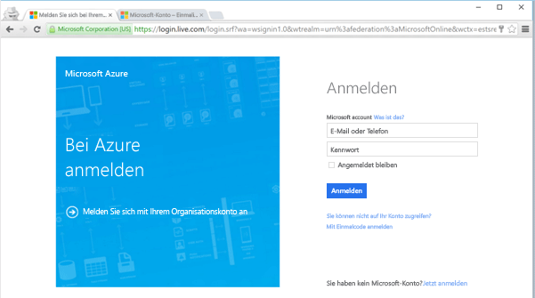
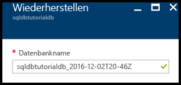
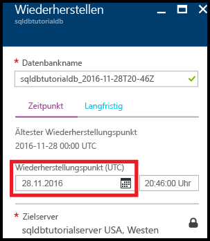
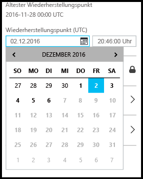
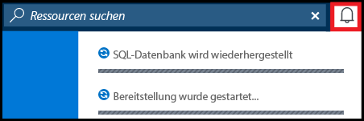
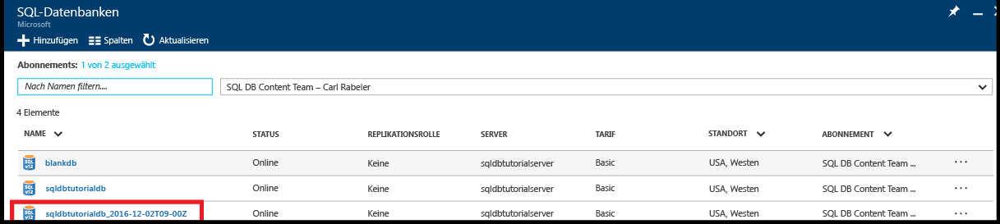

<!------------------
This topic is annotated with TEMPLATE guidelines for TUTORIAL TOPICS.

Metadata guidelines

title
    60 characters or less. Tells users clearly what they will do (deploy an ASP.NET web app to App Service). Not the same as H1. It's 60 characters or fewer including all characters between the quotes and the Microsoft Docs site identifier.

description
    115-145 characters. Duplicate of the first sentence in the introduction. This is the abstract of the article that displays under the title when searching in Bing or Google. 

    Example: "This tutorial shows how to deploy an ASP.NET web application to a web app in Azure App Service by using Visual Studio 2015."
------------------>

<!----------------

TEMPLATE GUIDELINES for tutorial topics

The tutorial topic shows users how to solve a problem using a product or service. It includes the prerequisites and steps users need to be successful.  

It is a "solve a problem" topic, not a "learn concepts" topic.

DO include this:
    • What users will do
    • What they will create or accomplish by the end of the tutorial
    • Time estimate
    • Optional but useful: Include a diagram or video. Diagrams help users see the big picture of what they are doing. A video of the steps can be used by customers as an alternative to following the steps in the topic.
    • Prerequisites: Technical expertise and software requirements
    • End-to-end steps. At the end, include next steps to deeper or related tutorials so users can learn more about the service

DON'T include this:
    • Conceptual info about the service. This info is in overview topics that you can link to in the prerequisites section if necessary

------------------->

<!------------------
GUIDELINES for the H1 
    
    The H1 should answer the question "What will I do in this topic?" Write the H1 heading in conversational language and use search keywords as much as possible. Since this is a "solve a problem" topic, make sure the title indicates that. Use a strong, specific verb like "Deploy."  
        
    Heading must use an industry standard term. If your feature is a proprietary name like "elastic pools", use a synonym. For example: "Learn about elastic pools for multi-tenant databases." In this case multi-tenant database is the industry-standard term that will be an anchor for finding the topic.

-------------------->

# Erste Schritte mit der Sicherung und Wiederherstellung für Datenschutz und Wiederherstellung

<!------------------
    GUIDELINES for introduction
    
    The introduction is 1-2 sentences.  It is optimized for search and sets proper expectations about what to expect in the article. It should contain the top keywords that you are using throughout the article.The introduction should be brief and to the point of what users will do and what they will accomplish. 

    In this example:
     

Sentence #1 Explains what the user will do. This is also the metadata description. 
    This tutorial shows how to deploy an ASP.NET web application to a web app in Azure App Service by using Visual Studio 2015. 

Sentence #2 Explains what users will learn and the benefit.  
    When you’re finished, you’ll have a simple web application up and running in the cloud.

-------------------->

In diesem Tutorial zu den ersten Schritten erfahren Sie, wie Sie das Azure-Portal für Folgendes verwenden:

- Anzeigen vorhandener Sicherungen einer Datenbank
- Wiederherstellen eines früheren Zustands einer Datenbank
- Konfigurieren der langfristigen Beibehaltung einer Datenbanksicherungsdatei im Azure Recovery Services-Tresor
- Wiederherstellen einer Datenbank aus dem Azure Recovery Services-Tresor

**Geschätzte Zeit**: Dieses Tutorial ist in ca. 30 Minuten abgeschlossen (sofern die Voraussetzungen bereits erfüllt sind).

## Voraussetzungen

* Sie benötigen ein Azure-Konto. Sie können entweder ein [kostenloses Azure-Konto erstellen](/pricing/free-trial/?WT.mc_id=A261C142F) oder [Visual Studio-Abonnementvorteile aktivieren](/pricing/member-offers/msdn-benefits-details/?WT.mc_id=A261C142F). 

* Sie müssen mit einem Konto, das über die Rolle „Besitzer“ oder „Mitwirkender“ für das Abonnement verfügt, eine Verbindung mit dem Azure-Portal herstellen können. Weitere Informationen zur rollenbasierten Zugriffssteuerung finden Sie unter [Erste Schritte mit der Zugriffsverwaltung im Azure-Portal](../active-directory/role-based-access-control-what-is.md).

* Sie haben das Tutorial [Erste Schritte mit Azure SQL-Datenbankservern, -Servern, -Datenbanken und -Firewallregeln mit dem Azure-Portal und SQL Server Management Studio](sql-database-get-started.md) oder die entsprechende [PowerShell-Version](sql-database-get-started-powershell.md) des Tutorials abgeschlossen. Arbeiten Sie andernfalls entweder dieses erforderliche Tutorial durch, oder führen Sie das PowerShell-Skript am Ende der [PowerShell-Version](sql-database-get-started-powershell.md) des Tutorials aus, bevor Sie fortfahren.

> [!TIP]
> Sie können diese Aufgaben auch in einem Tutorial zu den ersten Schritten durchführen, indem Sie [PowerShell](sql-database-get-started-backup-recovery-powershell.md) verwenden.

## Anmelden mit einem vorhandenen Konto
Führen Sie die folgenden Schritte aus, um unter Verwendung Ihres [bereits vorhandenen Abonnements](https://account.windowsazure.com/Home/Index)eine Verbindung mit dem Azure-Portal herzustellen.

1. Öffnen Sie einen Browser Ihrer Wahl, und stellen Sie eine Verbindung mit dem [Azure-Portal](https://portal.azure.com/)her.
2. Melden Sie sich auf dem [Azure-Portal](https://portal.azure.com/)an.
3. Geben Sie auf der Anmeldeseite **** die Anmeldeinformationen für Ihr Abonnement ein.
   
   

## Anzeigen des ältesten Wiederherstellungspunkts aus den vom Dienst generierten Sicherungen einer Datenbank

In diesem Abschnitt des Tutorials zeigen Sie Informationen zum ältesten Wiederherstellungspunkt aus den [vom Dienst generierten automatisierten Sicherungen](sql-database-automated-backups.md) Ihrer Datenbank an. 

1. Öffnen Sie das Blatt **SQL-Datenbank** für Ihre Datenbank **sqldbtutorialdb**.

    

2. Klicken Sie auf der Symbolleiste auf **Wiederherstellen**.

    

3. Überprüfen Sie auf dem Blatt „Wiederherstellen“ den ältesten Wiederherstellungspunkt.

    

## Wiederherstellen eines früheren Zustands einer Datenbank

In diesem Abschnitt des Tutorials stellen Sie einen bestimmten Zustand Ihrer Datenbank in einer neuen Datenbank wieder her.

1. Überprüfen Sie auf dem Blatt **Wiederherstellen** den Standardnamen für die neue Datenbank, in der Sie Ihre Datenbank in einem früheren Zustand wiederherstellen (bei dem Namen handelt es sich um den vorhandenen Datenbanknamen mit einem angefügten Zeitstempel). Dieser Name ändert sich entsprechend der Zeit, die Sie in den nächsten Schritten angeben.

    

2. Klicken Sie im Eingabefeld **Wiederherstellungspunkt (UTC)** auf das Symbol **Kalender**.

    

2. Wählen Sie im Kalender ein Datum innerhalb der Beibehaltungsdauer aus.

    

3. Geben Sie im Eingabefeld **Wiederherstellungspunkt (UTC)** die Uhrzeit am ausgewählten Datum an, um den Zeitpunkt auszuwählen, in dessen Zustand Sie die Daten in der Datenbank aus den automatisierten Datenbanksicherungen wiederherstellen möchten.

    

    >[!NOTE]
    >Beachten Sie, dass sich der Datenbankname entsprechend dem ausgewählten Datum und der Uhrzeit geändert hat. Bedenken Sie auch, dass Sie den Server nicht ändern können, auf dem Sie einen bestimmten Zustand wiederherstellen. Verwenden Sie [Geowiederherstellung](sql-database-disaster-recovery.md#recover-using-geo-restore), wenn Sie die Datenbank auf einem anderen Server wiederherstellen möchten. Sie können die Datenbank in einem [elastischen Pool](sql-database-elastic-jobs-overview.md) oder mit einem anderen Tarif wiederherstellen. 
    >

4. Klicken Sie auf **OK**, um Ihre Datenbank in einem früheren Zustand in der neuen Datenbank wiederherzustellen.

5. Klicken Sie auf der Symbolleiste auf das Benachrichtigungssymbol, um den Status des Wiederherstellungsauftrags anzuzeigen.

    

6. Öffnen Sie nach Abschluss des Wiederherstellungsauftrags das Blatt **SQL-Datenbanken**, um die neu wiederhergestellte Datenbank anzuzeigen.

    

   > [!NOTE]
   > Auf diesem Blatt können Sie mithilfe von SQL Server Management Studio eine Verbindung mit der wiederhergestellten Datenbank herstellen, um erforderliche Aufgaben durchzuführen. Sie können beispielsweise [einen Teil der Daten aus der wiederhergestellten Datenbank extrahieren und in die vorhandene Datenbank kopieren oder die vorhandene Datenbank löschen und die wiederhergestellte Datenbank in den vorhandenen Datenbanknamen umbenennen](sql-database-recovery-using-backups.md#point-in-time-restore).
   >

## Konfigurieren der langfristigen Beibehaltung von automatisierten Sicherungen in einem Azure Recovery Services-Tresor 

In diesem Abschnitt des Tutorials [konfigurieren Sie einen Azure Recovery Services-Tresor zur Beibehaltung von automatisierten Sicherungen](sql-database-long-term-retention.md) für einen längeren Zeitraum als gemäß der Beibehaltungsdauer für Ihre Dienstebene vorgesehen ist. 

> [!TIP]
> Informationen zum Löschen von Sicherungen finden Sie unter [Delete long-term retention backups](sql-database-long-term-retention-delete.md) (Löschen der langfristigen Aufbewahrung von Sicherungen).

1. Öffnen Sie das Blatt **SQL Server** für Ihren Server **sqldbtutorialserver**.

    

2. Klicken Sie auf **Long-term backup retention** (Langfristige Beibehaltung der Sicherung).

   

3. Lesen und akzeptieren Sie auf dem Blatt **sqldbtutorial - Long-term backup retention** (sqldbtutorial - Langfristige Beibehaltung der Sicherung) die Preview-Bedingungen (es sei denn, Sie haben sie bereits akzeptiert, oder die Funktion befindet sich nicht mehr in der Vorschauphase).

   

4. Um die langfristige Sicherungsaufbewahrung für die Datenbank „sqldbtutorialdb“ zu konfigurieren, wählen Sie die Datenbank im Raster aus, und klicken Sie dann auf der Symbolleiste auf **Konfigurieren**.

   

5. Klicken Sie auf dem Blatt **Konfigurieren** unter **Recovery service vault** (Recovery Services-Tresor) auf **Erforderliche Einstellungen konfigurieren**.

   

6. Wählen Sie auf dem Blatt **Recovery Services-Tresor** einen vorhandenen Tresor aus. Falls kein Recovery Services-Tresor für Ihr Abonnement vorhanden ist, klicken Sie auf den entsprechenden Link, um den Vorgang zu beenden, und erstellen Sie einen Recovery Services-Tresor.

   

7. Klicken Sie auf dem Blatt **Recovery Services-Tresore** auf **Hinzufügen**.

   
   
8. Geben Sie auf dem Blatt **Recovery Services-Tresor** einen gültigen Namen für den neuen Recovery Services-Tresor ein.

   

9. Wählen Sie Ihr Abonnement und die Ressourcengruppe und dann den Standort für den Tresor aus. Klicken Sie anschließend auf **Erstellen**.

   

   > [!IMPORTANT]
   > Der Tresor muss sich in der gleichen Region wie der logische SQL Azure-Server befinden und die gleiche Ressourcengruppe wie der logische Server verwenden.
   >

10. Führen Sie nach der Erstellung des neuen Tresors die notwendigen Schritte durch, um zum Blatt **Recovery Services-Tresor** zurückzukehren.

11. Klicken Sie auf dem Blatt **Recovery Services-Tresor** auf den Tresor und dann auf **Auswählen**.

   

12. Geben Sie auf dem Blatt **Konfigurieren** einen gültigen Namen für die neue Aufbewahrungsrichtlinie ein, ändern Sie die Standardaufbewahrungsrichtlinie wie erforderlich, und klicken Sie dann auf **OK**.

   

13. Klicken Sie auf dem Blatt **sqldbtutorial - Long-term backup retention** (sqldbtutorial - Langfristige Sicherungsaufbewahrung) auf **Speichern** und dann auf **OK**, um die Richtlinie für langfristige Beibehaltung der Sicherung auf alle ausgewählten Datenbanken anzuwenden.

   

14. Klicken Sie auf **Speichern**, um die langfristige Sicherungsaufbewahrung anhand der neuen Richtlinie für den von Ihnen konfigurierten Azure Recovery Services-Tresor zu aktivieren.

   

15. Öffnen Sie nach dem Aktivieren der langfristigen Sicherungsaufbewahrung das Blatt **sqldbtutorialvault** (wechseln Sie zu **Alle Ressourcen**, und wählen Sie den Tresor in der Liste der Ressourcen für Ihr Abonnement aus).

   

   > [!IMPORTANT]
   > Nach der Konfiguration werden innerhalb der nächsten sieben Tage Sicherungen im Tresor angezeigt. Setzen Sie dieses Tutorial erst fort, wenn Sicherungen im Tresor angezeigt werden.
   >

## Anzeigen von Sicherungen mit langfristiger Beibehaltung

In diesem Abschnitt des Tutorials zeigen Sie Informationen zu Ihren Datenbanksicherungen mit [langfristiger Beibehaltung der Sicherung](sql-database-long-term-retention.md) an. 

1. Öffnen Sie das Blatt **sqldbtutorialvault** (wechseln Sie zu **Alle Ressourcen**, und wählen Sie den Tresor in der Liste der Ressourcen für Ihr Abonnement aus), um den Speicherplatz anzuzeigen, den Ihre Datenbanksicherungen im Tresor belegen.

   

2. Öffnen Sie das Blatt **SQL-Datenbank** für Ihre Datenbank **sqldbtutorialdb**.

    

3. Klicken Sie auf der Symbolleiste auf **Wiederherstellen**.

    

4. Klicken Sie auf dem Blatt „Wiederherstellen“ auf **Langfristig**.

5. Klicken Sie unter „Azure vault backups“ (Sicherungen im Azure-Tresor) auf **Sicherung auswählen**, um die verfügbaren Datenbanksicherungen mit langfristiger Beibehaltung anzuzeigen.

    

## Wiederherstellen einer Datenbank aus einer Sicherung mit langfristiger Beibehaltung

In diesem Abschnitt des Tutorials stellen Sie die Datenbank aus einer Sicherung im Azure Recovery Services-Tresor in einer neuen Datenbank wieder her.

1. Klicken Sie auf dem Blatt **Azure vault backups** (Sicherungen im Azure-Tresor) auf die Sicherung, die Sie wiederherstellen möchten, und dann auf **Auswählen**.

    

2. Geben Sie im Textfeld **Datenbankname** den Namen für die wiederhergestellte Datenbank an.

    

3. Klicken Sie auf **OK**, um die Datenbank aus der Sicherung im Tresor in der neuen Datenbank wiederherzustellen.

4. Klicken Sie auf der Symbolleiste auf das Benachrichtigungssymbol, um den Status des Wiederherstellungsauftrags anzuzeigen.

    

5. Öffnen Sie nach Abschluss des Wiederherstellungsauftrags das Blatt **SQL-Datenbanken**, um die neu wiederhergestellte Datenbank anzuzeigen.

    

   > [!NOTE]
   > Auf diesem Blatt können Sie mithilfe von SQL Server Management Studio eine Verbindung mit der wiederhergestellten Datenbank herstellen, um erforderliche Aufgaben durchzuführen. Sie können beispielsweise [einen Teil der Daten aus der wiederhergestellten Datenbank extrahieren und in die vorhandene Datenbank kopieren oder die vorhandene Datenbank löschen und die wiederhergestellte Datenbank in den vorhandenen Datenbanknamen umbenennen](sql-database-recovery-using-backups.md#point-in-time-restore).
   >

<!--**Next steps**: *Reiterate what users have done, and give them interesting and useful next steps so they want to go on.*-->

## Nächste Schritte

- Weitere Informationen zu vom Dienst generierten automatischen Sicherungen finden Sie im Artikel zu [automatischen Sicherungen](sql-database-automated-backups.md).
- Weitere Informationen zur langfristigen Beibehaltung von Sicherungen finden Sie im Artikel zur [langfristigen Beibehaltung von Sicherungen](sql-database-long-term-retention.md).
- Weitere Informationen zum Wiederherstellen von Daten aus Sicherungen finden Sie im Artikel zur [Wiederherstellung aus einer Sicherung](sql-database-recovery-using-backups.md).

<!--HONumber=Dec16_HO4-->

