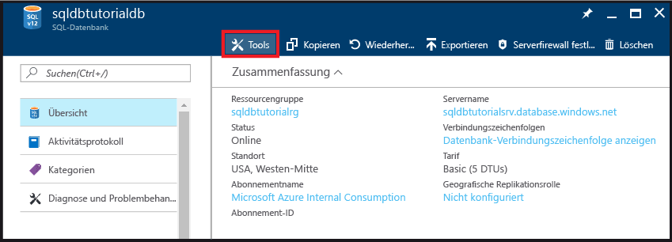
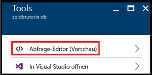
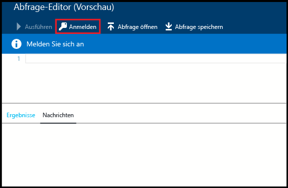
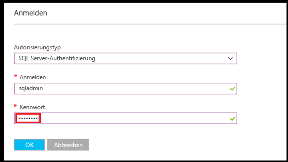
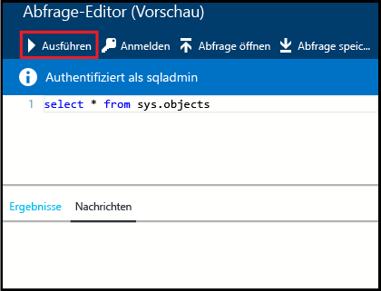
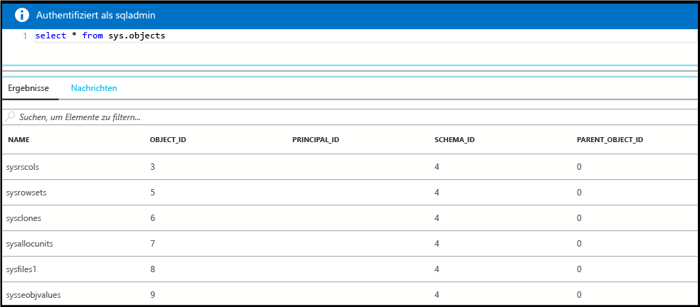
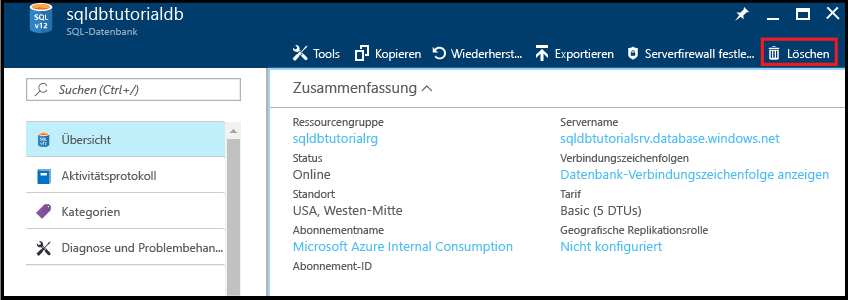
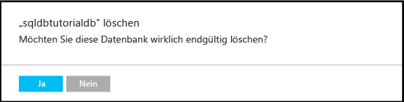

# <a name="create-connect-to-and-query-your-first-azure-sql-databases-in-the-azure-portal-and-using-ssms"></a>Erstellen, Herstellen der Verbindung und Abfragen Ihrer ersten Azure SQL-Datenbanken im Azure-Portal und Verwendung von SSMS

In diesem Tutorial wird beschrieben, wie Sie Azure SQL-Datenbanken im Azure-Portal erstellen, die Verbindung dafür herstellen und abfragen und SQL Server Management Studio verwenden. Sie führen im Rahmen dieses Tutorials Folgendes durch:

* Erstellung einer Ressourcengruppe mit einem logischen Server, einer Firewallregel auf Serverebene und zwei Datenbanken
* Anzeige von Server- und Datenbankeigenschaften im Azure-Portal und mit SQL Server Management Studio
* Abfrage einer Datenbank im Azure-Portal und mit SQL Server Management Studio

**Geschätzte Zeit**: Dieses Tutorial ist in ca. 30 Minuten abgeschlossen (sofern die Voraussetzungen bereits erfüllt sind).

> [!TIP]
> Sie können sich auch darüber informieren, wie Sie eine Azure SQL-Datenbank mit [PowerShell](sql-database-get-started-powershell.md) oder [C#](sql-database-get-started-csharp.md) erstellen, die Verbindung damit herstellen und Abfragen dafür durchführen.
>

> [!NOTE]
> Dieses Tutorial dient Ihnen als Hilfe beim Erlernen des Inhalts dieser Lernthemen: [Logische Azure SQL-Datenbankserver](sql-database-server-overview.md), [Übersicht zu Azure SQL-Datenbank](sql-database-overview.md) und [Übersicht über Firewallregeln für Azure SQL-Datenbank](sql-database-firewall-configure.md). Eine Übersicht über den SQL-Datenbank-Dienst finden Sie unter [Was ist SQL Database? Einführung in SQL-Datenbank](sql-database-technical-overview.md).
>  

## <a name="prerequisites"></a>Voraussetzungen

* **Ein Azure-Konto**: Sie können entweder ein [kostenloses Azure-Konto erstellen](https://azure.microsoft.com/free/) oder [Visual Studio-Abonnementvorteile aktivieren](https://azure.microsoft.com/pricing/member-offers/msdn-benefits/). 

* **Azure-Erstellungsberechtigungen**: Es muss möglich sein, dass Sie mit einem Konto, das über die Rolle „Besitzer“ oder „Mitwirkender“ für das Abonnement verfügt, eine Verbindung mit dem Azure-Portal herstellen. Weitere Informationen zur rollenbasierten Zugriffssteuerung finden Sie unter [Erste Schritte mit der Zugriffsverwaltung im Azure-Portal](../active-directory/role-based-access-control-what-is.md).

* **SQL Server Management Studio**: Die neueste Version von SQL Server Management Studio (SSMS) können Sie über [Herunterladen von SQL Server Management Studio (SSMS)](https://msdn.microsoft.com/library/mt238290.aspx) herunterladen und installieren. Verwenden Sie immer die neueste Version von SSMS, wenn Sie eine Verbindung mit Azure SQL-Datenbank herstellen, da immer wieder neue Funktionen veröffentlicht werden.

### <a name="sign-in-to-the-azure-portal"></a>Melden Sie sich auf dem Azure-Portal an.

Mit den Schritten dieses Verfahrens wird veranschaulicht, wie Sie mit dem [Azure-Konto](https://account.windowsazure.com/Home/Index) eine Verbindung mit dem Azure-Portal herstellen.

1. Öffnen Sie einen Browser Ihrer Wahl, und stellen Sie eine Verbindung mit dem [Azure-Portal](https://portal.azure.com/)her.
2. Melden Sie sich auf dem [Azure-Portal](https://portal.azure.com/)an.
3. Geben Sie auf der Anmeldeseite **** die Anmeldeinformationen für Ihr Abonnement ein.
   
   


<a name="create-logical-server-bk"></a>

## <a name="create-a-new-logical-sql-server"></a>Erstellen eines neuen logischen SQL-Servers

Mit den Schritten dieses Verfahrens wird veranschaulicht, wie Sie mit dem Azure-Portal in der Region Ihrer Wahl einen logischen Server erstellen. Ein logischer Server ist das Objekt, in dem Sie Ihre SQL-Datenbanken erstellen, sowie das Objekt, in dem Sie Firewallregeln erstellen, damit Benutzer durch die Azure SQL-Datenbankfirewall eine Verbindung herstellen können. 

1. Klicken Sie auf **Neu**, geben Sie **sql server** ein, und drücken Sie dann die **EINGABETASTE**.

    
2. Klicken Sie auf **SQL Server (logischer Server)**.
   
    
3. Klicken Sie auf **Erstellen**, um das neue Blatt „SQL Server (nur logischer Server)“ zu öffnen.

    
3. Geben Sie im Textfeld **Servername** einen gültigen Namen für den neuen logischen Server ein. Wenn der angegebene Name gültig ist, wird ein grünes Häkchen angezeigt.
    
    

    > [!IMPORTANT]
    > Der vollqualifizierte Name für den neuen Server muss global eindeutig sein und hat das Format **<Ihr_Servername>.database.windows.net**. Sie verwenden diesen vollqualifizierten Servernamen später in diesem Tutorial, um eine Verbindung mit Ihrem Server und Ihren Datenbanken herzustellen.
    >
    
4. Geben Sie im Textfeld **Serveradministratoranmeldung** einen Benutzernamen für die SQL-Authentifizierungsanmeldung für diesen Server ein. Diese Anmeldung wird als Serverprinzipalanmeldung bezeichnet. Wenn der angegebene Name gültig ist, wird ein grünes Häkchen angezeigt.
    
    
5. Geben Sie in den Textfeldern **Kennwort** und **Kennwort bestätigen** ein Kennwort für das Konto für die Serverprinzipalanmeldung an. Wenn das angegebene Kennwort gültig ist, wird ein grünes Häkchen angezeigt.
    
    
6. Wählen Sie im Dropdownfeld **Abonnement** ein Abonnement aus, für das Sie über die Berechtigung zum Erstellen von Objekten verfügen.

    
7. Wählen Sie unter **Ressourcengruppe** die Option **Neu erstellen**, und geben Sie dann einen gültigen Namen für die neue Ressourcengruppe an. Wenn der angegebene Name gültig ist, wird ein grünes Häkchen angezeigt.

    

8. Wählen Sie im Textfeld **Standort** ein Rechenzentrum aus, in dem Ihr logischer Server erstellt werden soll.
    
    
    
    > [!TIP]
    > Das Kontrollkästchen **Azure-Diensten Zugriff auf den Server erlauben** kann auf diesem Blatt nicht geändert werden. Sie können diese Einstellung auf dem Blatt für die Serverfirewall ändern. Weitere Informationen finden Sie unter [Erste Schritte mit der Sicherheit](sql-database-control-access-sql-authentication-get-started.md).
    >
    
9. Aktivieren Sie das Kontrollkästchen **An Dashboard anheften**.

10. Klicken Sie auf **Erstellen**, um dieses Skript zum Erstellen des logischen Servers in Azure bereitzustellen.

    

11. Sehen Sie sich nach der Erstellung Ihres Servers die Eigenschaften an, die standardmäßig angezeigt werden. 

    
12. Klicken Sie auf **Eigenschaften**, um weitere Eigenschaften für den logischen SQL-Server anzuzeigen.

    
13. Kopieren Sie den vollqualifizierten Servernamen in die Zwischenablage, damit Sie ihn später in diesem Tutorial verwenden können.

    

## <a name="create-a-server-level-firewall-rule"></a>Erstellen einer Firewallregel auf Serverebene

Mit den Schritten dieses Verfahrens wird veranschaulicht, wie Sie im Azure-Portal eine Firewallregel auf Serverebene erstellen. Standardmäßig wird mit einer Azure SQL-Datenbankfirewall verhindert, dass eine externe Verbindung mit Ihrem logischen Server und den dazugehörigen Datenbanken hergestellt wird. Damit Sie eine Verbindung mit Ihrem Server herstellen können, müssen Sie eine Firewallregel für die IP-Adresse des Computers erstellen, von dem aus Sie im nächsten Verfahren eine Verbindung herstellen möchten. Weitere Informationen finden Sie unter [Übersicht über Firewallregeln für Azure SQL-Datenbank](sql-database-firewall-configure.md).

1. Klicken Sie auf dem Blatt „SQL Server“ auf **Firewall**, um das Blatt „Firewall“ für Ihren Server zu öffnen. Beachten Sie, dass die IP-Adresse für Ihren Clientcomputer angezeigt wird.

    

2. Klicken Sie in der Symbolleiste auf **Client-IP-Adresse hinzufügen**, um eine Firewallregel für Ihre aktuelle IP-Adresse zu erstellen.

    

    > [!NOTE]
    > Sie können eine Firewallregel für eine einzelne IP-Adresse oder einen gesamten Bereich von Adressen erstellen. Mit dem Öffnen der Firewall wird es SQL-Administratoren und Benutzern ermöglicht, sich auf dem Server an allen Datenbanken anzumelden, für die sie über gültige Anmeldeinformationen verfügen.
    >

4. Klicken Sie in der Symbolleiste auf **Speichern**, um diese Firewallregel auf Serverebene zu speichern, und klicken Sie dann auf **OK**, um das Dialogfeld „Erfolg“ zu schließen.

    

## <a name="connect-to-the-server-with-ssms"></a>Herstellen einer Verbindung mit dem Server mit SSMS

Mit den Schritten des Verfahrens wird veranschaulicht, wie Sie mit SQL Server Management Studio eine Verbindung mit Ihrem logischen SQL-Server herstellen. SSMS ist das primäre Tool, das von DBAs zum Verwalten von SQL-Servern und -Datenbanken verwendet wird.

1. Öffnen Sie SQL Server Management Studio. (Geben Sie im Windows-Suchfeld den Text **Microsoft SQL Server Management Studio** ein, und drücken Sie die **EINGABETASTE**, um SSMS zu öffnen.)

    
3. Geben Sie im Dialogfeld **Mit Server verbinden** den vollqualifizierten Servernamen aus dem vorherigen Verfahren ein, wählen Sie „SQL Server-Authentifizierung“, und geben Sie dann den Benutzernamen und das Kennwort ein, den bzw. das Sie bei der Bereitstellung Ihres Servers angegeben haben.

    
4. Klicken Sie auf **Verbinden**, um die Verbindung zu initiieren und den Objekt-Explorer in SSMS zu öffnen.

    
5. Erweitern Sie im Objekt-Explorer die Optionen **Datenbanken**, **Systemdatenbanken** und **Master**, um die Objekte in der Masterdatenbank anzuzeigen.

    
6. Klicken Sie mit der rechten Maustaste auf **Master** und dann auf **Neue Abfrage**.

    

8. Geben Sie im Abfragefenster die folgende Abfrage ein:

   ```select * from sys.objects```

9.  Klicken Sie auf der Symbolleiste auf **Ausführen**, um eine Liste mit allen Systemobjekten in der Masterdatenbank zurückzugeben.

    

    > [!NOTE]
    > Informationen zu den ersten Schritten mit der SQL-Sicherheit finden Sie unter [SQL Server-Authentifizierung, Zugriff und Firewallregeln auf Datenbankebene](sql-database-control-access-sql-authentication-get-started.md).
    >

## <a name="create-a-database-with-sample-data"></a>Erstellen einer Datenbank mit Beispieldaten

Mit den Schritten in diesem Verfahren wird veranschaulicht, wie Sie eine Datenbank mit Beispieldaten im Azure-Portal erstellen, die dem zuvor erstellten logischen Server zugeordnet ist. 

1. Klicken Sie im Azure-Portal auf dem Standardblatt auf **SQL-Datenbanken**.

    
2. Klicken Sie auf dem Blatt „SQL-Datenbanken“ auf **Hinzufügen**. 

    

    
3. Geben Sie im Textfeld **Datenbankname** einen gültigen Datenbanknamen ein.

    
4. Wählen Sie unter **Quelle auswählen** die Option **Beispiel (AdventureWorksLT)**.
   
    
5. Vergewissern Sie sich, dass Ihr Server unter **Server** ausgewählt ist. Beachten Sie auch, dass eine Datenbank beim Hinzufügen zu einem Server als Einzeldatenbank (Standardeinstellung) oder einem Pool für elastische Datenbanken hinzugefügt werden kann. Weitere Informationen zu elastischen Pools finden Sie unter [Elastische Pools](sql-database-elastic-pool.md).

6. Ändern Sie unter **Tarif** den Tarif in **Basic**, und klicken Sie auf **Auswählen**. Sie können den Tarif später bei Bedarf erhöhen, aber zu Lernzwecken empfehlen wir Ihnen die Nutzung des Tarifs mit den geringsten Kosten.

    
7. Aktivieren Sie das Kontrollkästchen **An Dashboard anheften**, und klicken Sie dann auf **Erstellen**.

    

8. Nachdem Ihre Datenbank erstellt wurde, können Sie ihre Eigenschaften im Azure-Portal anzeigen. In den nachfolgenden Tutorials werden die Optionen beschrieben, die auf diesem Blatt verfügbar sind. 

    

## <a name="query-the-database-in-the-azure-portal"></a>Abfragen der Datenbank im Azure-Portal

Mit den Schritten in diesem Verfahren wird veranschaulicht, wie Sie die Datenbank direkt im Azure-Portal abfragen. 

1. Klicken Sie auf dem Blatt „SQL-Datenbanken“ auf **Tools**.

    
2. Klicken Sie auf dem Blatt „Tools“ auf **Abfrage-Editor (Vorschau)**.

    
3. Aktivieren Sie das Kontrollkästchen, um zu bestätigen, dass der Abfrage-Editor eine Vorschaufunktion ist, und klicken Sie anschließend auf **OK**.
4. Klicken Sie auf dem Blatt **Abfrage-Editor** auf **Anmelden**.

    
5. Prüfen Sie den Autorisierungstyp und die Anmeldung, und geben Sie anschließend das Kennwort für die Anmeldung ein. 

    
6. Klicken Sie auf **OK**, um sich anzumelden.
7. Geben Sie nach der Authentifizierung im Abfragefenster die folgende Abfrage ein, und klicken Sie auf **Ausführen**.

   ```select * from sys.objects```

    

8. Die Abfrageergebnisse werden im Bereich **Ergebnisse** angezeigt.

    

## <a name="query-the-database-with-ssms"></a>Abfragen der Datenbank mit SSMS

Mit den Schritten in diesem Verfahren wird veranschaulicht, wie Sie mit SQL Server Management Studio eine Verbindung mit der Datenbank herstellen und anschließend die Beispieldaten abfragen, um die Objekte in der Datenbank anzuzeigen.

1. Wechseln Sie zu SQL Server Management Studio, und klicken Sie im Objekt-Explorer auf **Datenbanken** und dann in der Symbolleiste auf **Aktualisieren**, um die Beispieldatenbank anzuzeigen.

    
2. Erweitern Sie im Objekt-Explorer die neue Datenbank, um die dazugehörigen Objekte anzuzeigen.

    
3. Klicken Sie mit der rechten Maustaste auf die Beispieldatenbank, und klicken Sie dann auf **Neue Abfrage**.

    
4. Geben Sie im Abfragefenster die folgende Abfrage ein:

   ```select * from sys.objects```
   
9.  Klicken Sie auf der Symbolleiste auf **Ausführen**, um eine Liste mit allen Systemobjekten in der Beispieldatenbank zurückzugeben.

    

## <a name="create-a-blank-database-with-ssms"></a>Erstellen einer neuen, leeren Datenbank mit SSMS

Mit den Schritten in diesem Verfahren wird veranschaulicht, wie Sie mit SQL Server Management Studio eine neue Datenbank erstellen.

1. Klicken Sie im Objekt-Explorer mit der rechten Maustaste auf **Datenbanken**, und klicken Sie dann auf **Neue Datenbank**.

    

2. Geben Sie im Dialogfeld **Neue Datenbank** einen Datenbanknamen in das Textfeld „Datenbankname“ ein. 

    

3. Klicken Sie im Dialogfeld „Neue Datenbank“ auf **Optionen**, und ändern Sie dann die Edition in **Basic**.

    

    > [!TIP]
    > Sehen Sie sich die anderen Optionen des Dialogfelds an, die Sie für eine Azure SQL-Datenbank ändern können. Weitere Informationen zu diesen Optionen finden Sie unter [Erstellen einer Datenbank](https://msdn.microsoft.com/library/dn268335.aspx).
    >

4. Klicken Sie auf **OK**, um die leere Datenbank zu erstellen.
5. Aktualisieren Sie nach Abschluss des Vorgangs den Datenbankknoten im Objekt-Explorer, um die neu erstellte leere Datenbank anzuzeigen. 

    

## <a name="troubleshoot-connectivity"></a>Behandeln von Konnektivitätsproblemen

Wenn keine Verbindung mit Azure SQL-Datenbank hergestellt werden kann, erhalten Sie Fehlermeldungen. Die Verbindungsprobleme können durch eine Neukonfiguration der SQL Azure-Datenbank, Firewalleinstellungen, ein Verbindungstimeout oder fehlerhafte Anmeldeinformationen verursacht werden. Informationen zu einem Tool für die Behandlung von Verbindungsproblemen finden Sie unter [Problembehandlung bei Verbindungen mit Microsoft Azure SQL-Datenbank](https://support.microsoft.com/help/10085/troubleshooting-connectivity-issues-with-microsoft-azure-sql-database).

## <a name="delete-a-single-database-in-the-azure-portal"></a>Löschen einer Einzeldatenbank im Azure-Portal

Mit den Schritten in diesem Verfahren wird veranschaulicht, wie Sie eine Einzeldatenbank im Azure-Portal löschen.

1. Klicken Sie im Azure-Portal auf dem Blatt „SQL-Datenbanken“ auf die Datenbank, die Sie löschen möchten. 
2.  Klicken Sie für Ihre SQL-Datenbank auf **Löschen**.

    
2. Klicken Sie auf **Ja**, um zu bestätigen, dass Sie diese Datenbank dauerhaft löschen möchten.

    

> [!TIP]
> Während der Beibehaltungsdauer für Ihre Datenbank können Sie diese aus den automatischen Sicherungen, die vom Dienst initiiert werden, wiederherstellen (sofern Sie nicht den Server selbst löschen). Sie haben die Möglichkeit, Datenbanken der Basic Edition innerhalb von sieben Tagen wiederherzustellen. Für alle anderen Editionen können Sie sie innerhalb von 35 Tagen wiederherstellen. Wenn Sie den Server selbst löschen, ist es nicht möglich, den Server oder die gelöschten Datenbanken wiederherzustellen. Weitere Informationen zu Datenbanksicherungen finden Sie unter [Weitere Informationen zu Sicherungen für SQL-Datenbank](sql-database-automated-backups.md). Informationen zum Wiederherstellen einer Datenbank aus den Sicherungen finden Sie unter [Wiederherstellen einer Datenbank](sql-database-recovery-using-backups.md). Unter [Wiederherstellen einer gelöschten Azure SQL-Datenbank im Azure-Portal](sql-database-restore-deleted-database-portal.md) finden Sie Anleitungen zum Wiederherstellen einer gelöschten Datenbank.
>


## <a name="next-steps"></a>Nächste Schritte
Nachdem Sie dieses Tutorial nun abgeschlossen haben, können Sie weitere Tutorials durcharbeiten, die auf den hier erworbenen Kenntnissen aufbauen. 

- Informationen zu den ersten Schritten im SQL Server-Authentifizierungstutorial finden Sie unter [SQL-Authentifizierung und -Autorisierung](sql-database-control-access-sql-authentication-get-started.md).
- Informationen zu den ersten Schritten im Azure Active Directory-Authentifizierungstutorial finden Sie unter [Azure AD-Authentifizierung und Autorisierung](sql-database-control-access-aad-authentication-get-started.md).
* Informationen zum Abfragen der Beispieldatenbank über das Azure-Portal finden Sie unter [Public preview: Interactive query experience for SQL databases](https://azure.microsoft.com/updates/azure-sql-database-public-preview-t-sql-editor/) (Öffentliche Vorschau: Interaktives Abfragen von SQL-Datenbanken).
* Wenn Sie mit Excel vertraut sind, informieren Sie sich über das [Herstellen von Verbindungen mit SQL-Datenbank in Azure mit Excel](sql-database-connect-excel.md).
* Wenn Sie mit dem Programmieren beginnen möchten, wählen Sie unter [Verbindungsbibliotheken für SQL-Datenbank und SQL Server](sql-database-libraries.md)Ihre Programmiersprache aus.
* Wenn Sie lokale SQL Server-Datenbanken in Azure verschieben möchten, helfen Ihnen die Informationen unter [Migrieren von Datenbanken zu SQL-Datenbank](sql-database-cloud-migrate.md) weiter.
* Wenn Sie Daten aus einer CSV-Datei mit dem BCP-Befehlszeilentool in eine neue Tabelle laden möchten, finden Sie unter [Laden von Daten aus einer CSV-Datei in SQL-Datenbank mit BPC](sql-database-load-from-csv-with-bcp.md) weitere Informationen.
* Wenn Sie mit dem Erstellen von Tabellen und anderen Objekten beginnen möchten, helfen Ihnen die Informationen unter „Erstellen einer Tabelle“ im Thema [Erstellen einer Tabelle](https://msdn.microsoft.com/library/ms365315.aspx) weiter.

## <a name="additional-resources"></a>Zusätzliche Ressourcen

- Eine technische Übersicht finden Sie unter [Was ist SQL Database? Einführung in SQL-Datenbank](sql-database-technical-overview.md).
- Preisinformationen finden Sie unter [Preise für Azure SQL-Datenbank](https://azure.microsoft.com/pricing/details/sql-database/).


