# SQL-Datenbank-Tutorial: Erstellen einer SQL-Datenbank in Minuten mit dem Azure-Portal
> [!div class="op_single_selector"]
> * [Azure-Portal](sql-database-get-started.md)
> * [C#](sql-database-get-started-csharp.md)
> * [PowerShell](sql-database-get-started-powershell.md)
> 
> 

In diesem Tutorial erfahren Sie, wie Sie das Azure-Portal für Folgendes verwenden:

* Erstellen einer Azure SQL-Datenbank mit Beispieldaten
* Erstellen einer Firewallregel auf Serverebene für eine einzelne IP-Adresse oder für einen IP-Adressbereich

Die gleichen Aufgaben können Sie mit [C#](sql-database-get-started-csharp.md) oder [PowerShell](sql-database-get-started-powershell.md) durchführen.

[!INCLUDE [Anmeldung](../../includes/azure-getting-started-portal-login.md)]

## Erstellen einer ersten Azure SQL-Datenbank
1. Stellen Sie eine Verbindung mit dem [Azure-Portal](http://portal.azure.com) her (sofern noch keine Verbindung besteht).
2. Klicken Sie auf **Neu**, anschließend auf **Daten und Speicher**, und suchen Sie dann nach **SQL-Datenbank**.
   
    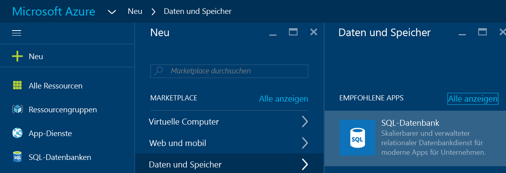
3. Klicken Sie auf **SQL-Datenbank**, um das Blatt „SQL-Datenbank“ zu öffnen. Der Inhalt dieses Blatt variiert abhängig von Ihrer Anzahl von Abonnements und Ihren vorhandenen Objekten (z.B. vorhandene Server).
   
    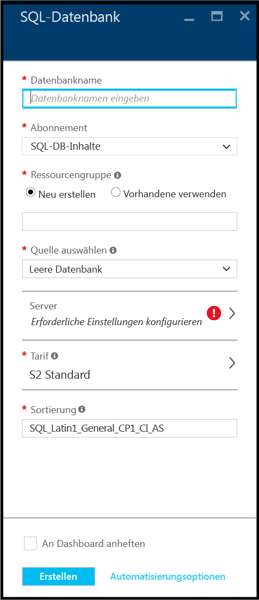
4. Geben Sie im Textfeld **Datenbankname** einen Namen für Ihre erste Datenbank ein, beispielsweise „Meine-Datenbank“. Wenn der angegebene Name gültig ist, wird ein grünes Häkchen angezeigt.
   
    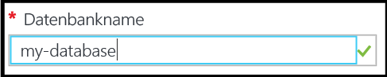
5. Wählen Sie ein Abonnement aus, falls Sie über mehrere Abonnements verfügen.
6. Klicken Sie unter **Ressourcengruppe** auf **Neu erstellen**, und geben Sie einen Namen für Ihre erste Ressourcengruppe ein, beispielsweise „Meine-Ressourcengruppe“. Wenn der angegebene Name gültig ist, wird ein grünes Häkchen angezeigt.
   
    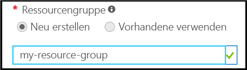
7. Klicken Sie unter **Quelle auswählen** auf **Beispiel** und dann unter **Beispiel auswählen** auf **AdventureWorksLT [V12]**.
   
    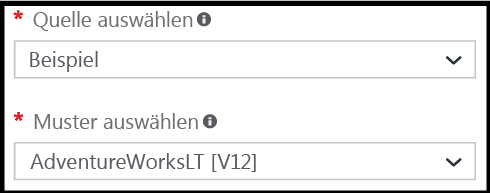
8. Klicken Sie unter **Server** auf **Erforderliche Einstellungen konfigurieren**.
   
    
9. Klicken Sie auf dem Blatt „Server“ auf **Neuen Server erstellen**. Eine Azure SQL-Datenbank wird in einem Serverobjekt erstellt, bei dem es sich um einen neuen oder einen vorhandenen Server handeln kann.
   
    
10. Sehen Sie sich auf dem Blatt **Neuer Server** die Informationen an, die Sie für den neuen Server angeben müssen.
    
    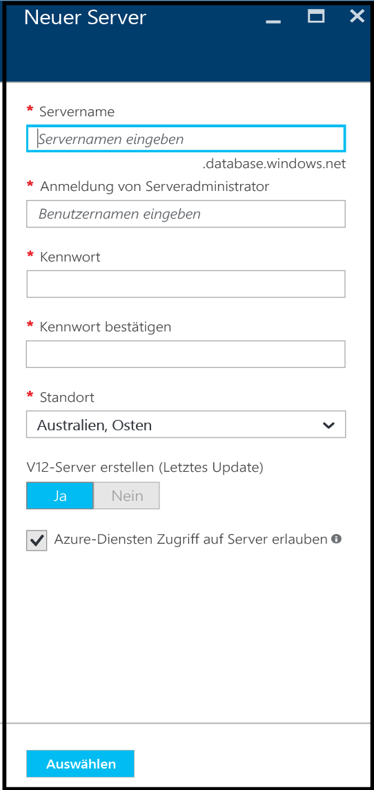
11. Geben Sie im Textfeld **Servername** einen Namen für Ihren ersten Server an, beispielsweise „Mein-neues-Serverobjekt“. Wenn der angegebene Name gültig ist, wird ein grünes Häkchen angezeigt.
    
    
12. Geben Sie unter **Serveradministratoranmeldung** einen Benutzernamen für die Administratoranmeldung für den Server an, beispielsweise „Mein-Administratorkonto“. Diese Anmeldung wird als Serverprinzipalanmeldung bezeichnet. Wenn der angegebene Name gültig ist, wird ein grünes Häkchen angezeigt.
    
    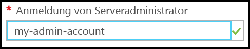
13. Geben Sie unter **Kennwort** und **Kennwort bestätigen** ein Kennwort für das Konto für die Serverprinzipalanmeldung an, beispielsweise „p@ssw0rd1“. Wenn das angegebene Kennwort gültig ist, wird ein grünes Häkchen angezeigt.
    
    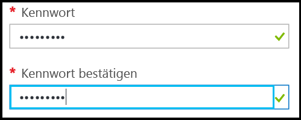
14. Wählen Sie unter **Standort** ein geeignetes Rechenzentrum für Ihren Standort aus, beispielsweise „Australien, Osten“.
    
    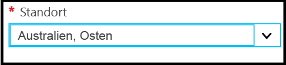
15. Beachten Sie, dass Sie unter „**V12-Server erstellen (aktuelles Update)“ nur eine aktuelle Version von Azure SQL-Server erstellen können.
    
    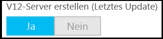
16. Das Kontrollkästchen **Azure-Diensten Zugriff auf den Server erlauben** ist standardmäßig aktiviert und kann hier nicht geändert werden. Dies ist eine erweiterte Option. Sie können diese Einstellung in den Firewalleinstellungen für das Serverobjekt ändern, in den meisten Szenarien ist dies jedoch nicht erforderlich.
    
    
17. Überprüfen Sie auf dem Blatt „Neuer Server“ die von Ihnen festgelegten Einstellungen, und klicken Sie anschließend auf **Auswählen**, um den neuen Server für Ihre neue Datenbank auszuwählen.
    
    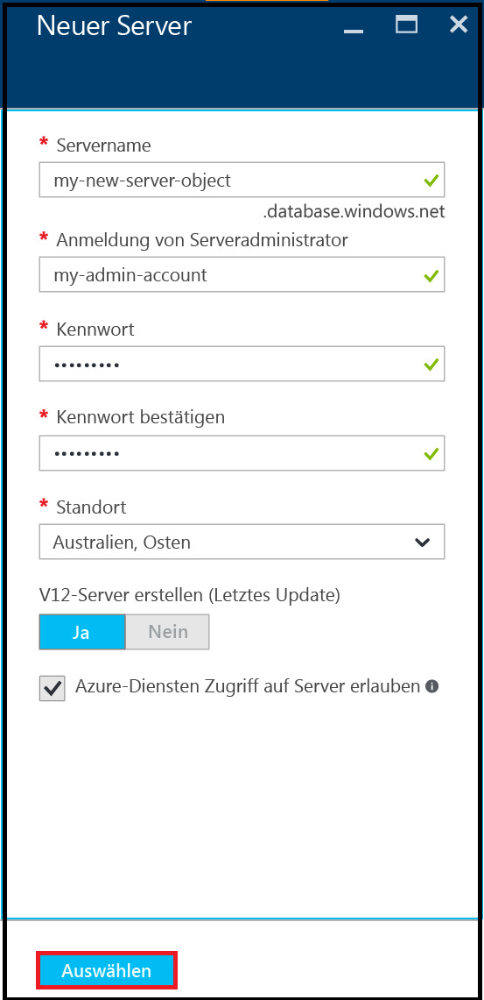
18. Klicken Sie auf dem Blatt „SQL-Datenbank“ unter **Tarif** auf **S2 Standard** und dann auf **Basic**, um den günstigsten Tarif für Ihre erste Datenbank auszuwählen. Sie können den Tarif später jederzeit ändern.
    
    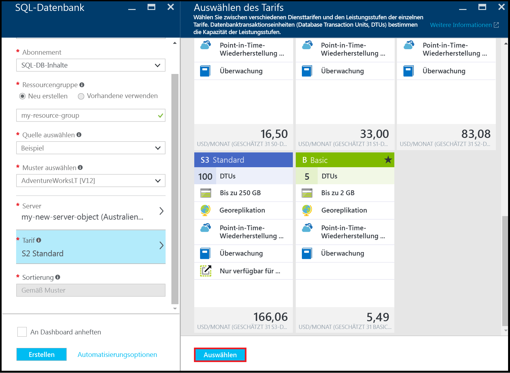
19. Überprüfen Sie auf dem Blatt „SQL-Datenbank“ die von Ihnen festgelegten Einstellungen, und klicken Sie anschließend auf **Erstellen**, um Ihren ersten Server und Ihre erste Datenbank zu erstellen. Die von Ihnen angegebenen Werte werden überprüft, und die Bereitstellung wird gestartet.
    
    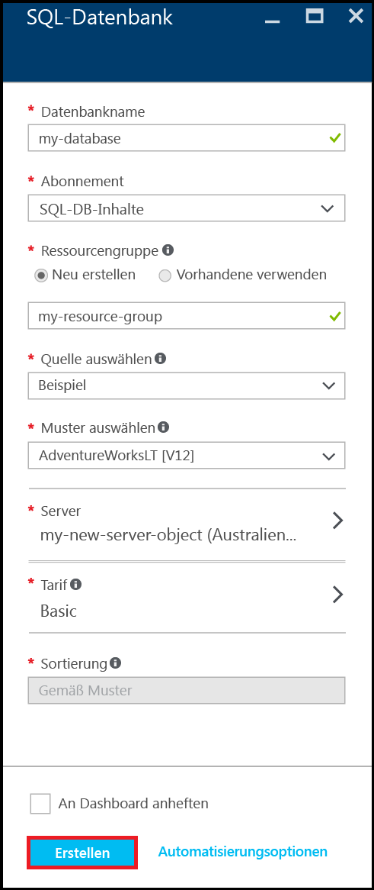
20. Klicken Sie auf der Symbolleiste des Portals auf das Benachrichtigungssymbol, um den Status der Bereitstellung zu überprüfen.
    
    

> [!IMPORTANT]
> Wenn die Bereitstellung abgeschlossen ist, werden der neue Azure SQL-Server und die neue Datenbank in Azure erstellt. Sie können erst dann mit SQL Server-Tools eine Verbindung mit dem neuen Server oder der neuen Datenbank herstellen, nachdem Sie eine Serverfirewallregel zum Öffnen der SQL-Datenbankfirewall für Verbindungen von außerhalb von Azure erstellt haben.
> 
> 

[!INCLUDE [Erstellen einer Serverfirewallregel](../../includes/sql-database-create-new-server-firewall-portal.md)]

## Nächste Schritte
Nachdem Sie dieses Tutorial zu SQL-Datenbank ausgeführt und eine Datenbank mit Beispieldaten erstellt haben, können Sie nun das Experimentieren mit Ihren Lieblingstools beginnen.

* Wenn Sie mit Transact-SQL und SQL Server Management Studio (SSMS) vertraut sind, informieren Sie sich über das [Herstellen von Verbindungen mit einer SQL-Datenbank und das Abfragen dieser mit SSMS](sql-database-connect-query-ssms.md).
* Wenn Sie mit Excel vertraut sind, informieren Sie sich über das [Herstellen von Verbindungen mit SQL-Datenbank in Azure mit Excel](sql-database-connect-excel.md).
* Wenn Sie mit dem Programmieren beginnen möchten, wählen Sie unter [Verbindungsbibliotheken für SQL-Datenbank und SQL Server](sql-database-libraries.md) Ihre Programmiersprache aus.
* Wenn Sie lokale SQL Server-Datenbanken in Azure verschieben möchten, finden Sie unter [Migrieren von Datenbanken zu SQL-Datenbank](sql-database-cloud-migrate.md) weitere Informationen.
* Wenn Sie einige Daten aus einer CSV-Datei mit dem BCP-Befehlszeilentool in eine neue Tabelle laden möchten, machen Sie sich mit den Informationen unter [Laden von Daten aus einer CSV-Datei in SQL-Datenbank mit BPC](sql-database-load-from-csv-with-bcp.md) vertraut.
* Wenn Sie sich mit der Sicherheit von Azure SQL-Datenbank befassen möchten, finden Sie im Thema zu den [ersten Schritten bei der Sicherheit](sql-database-get-started-security.md) weitere Informationen.

## Zusätzliche Ressourcen
[Was ist SQL Database?](sql-database-technical-overview.md)

<!---HONumber=AcomDC_0914_2016-->