# <a name="get-started-with-azure-sql-database-servers-databases-and-firewall-rules-by-using-the-azure-portal-and-sql-server-management-studio"></a>Enthält Informationen zu den ersten Schritten mit Azure SQL-Datenbankservern, -Datenbanken und -Firewallregel mit dem Azure-Portal und SQL Server Management Studio.

In diesem Tutorial zu den ersten Schritten erfahren Sie, wie Sie das Azure-Portal für Folgendes verwenden:

* Erstellen einer neuen Azure-Ressourcengruppe
* Erstellen eines logischen Azure SQL-Servers
* Anzeigen der Eigenschaften eines logischen Azure SQL-Servers
* Erstellen einer Firewallregel auf Serverebene
* Erstellen der Beispieldatenbank Adventure Works LT
* Anzeigen von Eigenschaften der Adventure Works LT-Beispieldatenbank in Azure

In diesem Tutorial verwenden Sie auch die aktuelle Version von SQL Server Management Studio für folgende Aufgaben:

* Herstellen einer Verbindung mit dem logischen Server und der dazugehörigen Masterdatenbank
* Anzeigen von Eigenschaften der Masterdatenbank
* Herstellen einer Verbindung mit der Beispieldatenbank
* Anzeigen von Eigenschaften der Benutzerdatenbank

Nach Abschluss dieses Tutorials verfügen Sie über eine Beispieldatenbank und eine leere Datenbank, die in einer Azure-Ressourcengruppe ausgeführt wird und einem logischen Server zugeordnet ist. Außerdem verfügen Sie über eine Firewallregel auf Serverebene, die so konfiguriert ist, dass sich der Prinzipal auf Serverebene am Server über eine angegebene IP-Adresse (oder einen IP-Adressbereich) anmelden kann. 

**Geschätzte Zeit**: Dieses Tutorial ist in ca. 30 Minuten abgeschlossen (sofern die Voraussetzungen bereits erfüllt sind).

## <a name="prerequisites"></a>Voraussetzungen

* Sie benötigen ein Azure-Konto. Sie können entweder ein [kostenloses Azure-Konto erstellen](/pricing/free-trial/?WT.mc_id=A261C142F) oder [Visual Studio-Abonnementvorteile aktivieren](/pricing/member-offers/msdn-benefits-details/?WT.mc_id=A261C142F). 

* Sie müssen mit einem Konto, das über die Rolle „Besitzer“ oder „Mitwirkender“ für das Abonnement verfügt, eine Verbindung mit dem Azure-Portal herstellen können. Weitere Informationen zur rollenbasierten Zugriffssteuerung finden Sie unter [Erste Schritte mit der Zugriffsverwaltung im Azure-Portal](../active-directory/role-based-access-control-what-is.md).

> [!TIP]
> Sie können diese Aufgaben auch in einem Tutorial zu den ersten Schritten durchführen, indem Sie entweder [C#](sql-database-get-started-csharp.md) oder [PowerShell](sql-database-get-started-powershell.md) verwenden.
>

### <a name="sign-in-by-using-your-existing-account"></a>Anmelden mit einem vorhandenen Konto
Führen Sie die folgenden Schritte aus, um unter Verwendung Ihres [bereits vorhandenen Abonnements](https://account.windowsazure.com/Home/Index)eine Verbindung mit dem Azure-Portal herzustellen.

1. Öffnen Sie einen Browser Ihrer Wahl, und stellen Sie eine Verbindung mit dem [Azure-Portal](https://portal.azure.com/)her.
2. Melden Sie sich auf dem [Azure-Portal](https://portal.azure.com/)an.
3. Geben Sie auf der Anmeldeseite **** die Anmeldeinformationen für Ihr Abonnement ein.
   
   


<a name="create-logical-server-bk"></a>

## <a name="create-a-new-logical-sql-server-in-the-azure-portal"></a>Erstellen eines neuen logischen SQL-Servers im Azure-Portal

1. Klicken Sie auf **Neu**, geben Sie **sql server** ein, und drücken Sie dann die **EINGABETASTE**.

    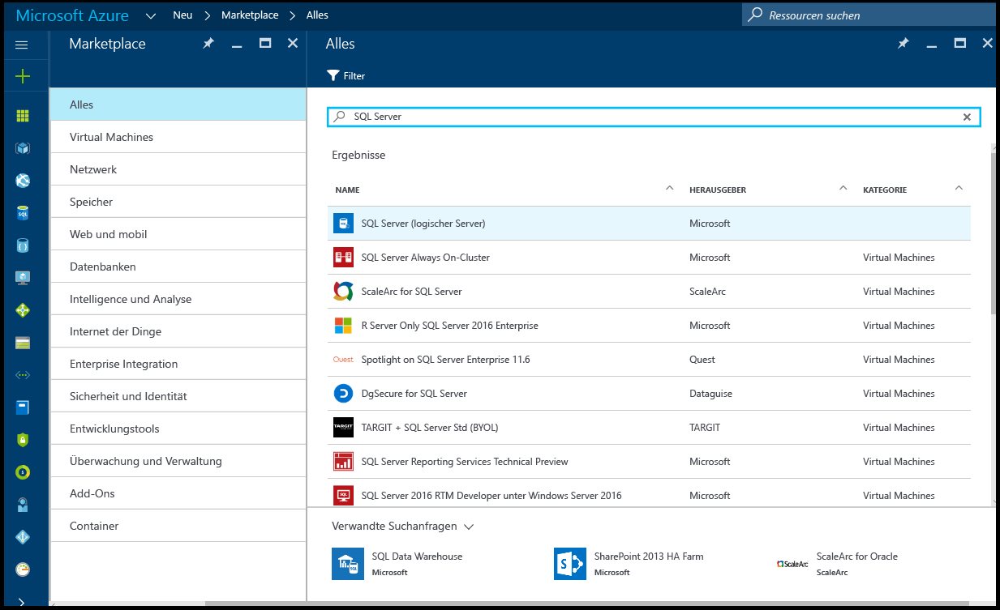
2. Klicken Sie auf **SQL Server (logischer Server)**.
   
    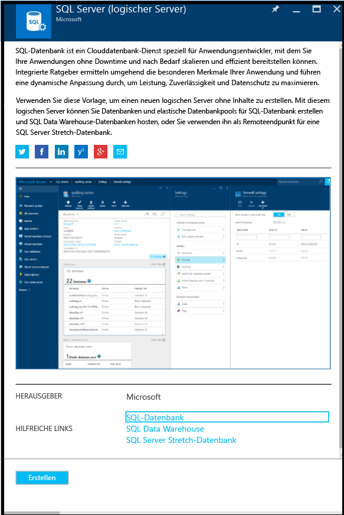
3. Klicken Sie auf **Erstellen**, um das neue Blatt „SQL Server (logischer Server) zu öffnen.

    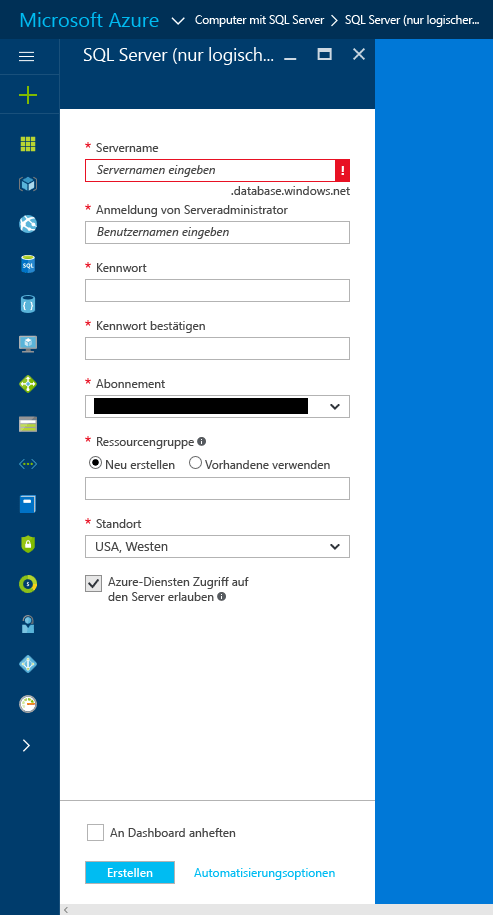
3. Geben Sie im Textfeld „Servername“ einen gültigen Namen für den neuen logischen Server ein. Wenn der angegebene Name gültig ist, wird ein grünes Häkchen angezeigt.
    
    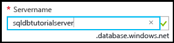

    > [!IMPORTANT]
    > Der vollqualifizierte Name für den neuen Server lautet „<Ihr_Servername>.database.windows.net“.
    >
    
4. Geben Sie im Textfeld „Serveradministratoranmeldung“ einen Benutzernamen für die SQL-Authentifizierungsanmeldung für diesen Server ein. Diese Anmeldung wird als Serverprinzipalanmeldung bezeichnet. Wenn der angegebene Name gültig ist, wird ein grünes Häkchen angezeigt.
    
    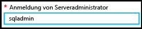
5. Geben Sie in den Textfeldern **Kennwort** und **Kennwort bestätigen** ein Kennwort für das Konto für die Serverprinzipalanmeldung an. Wenn das angegebene Kennwort gültig ist, wird ein grünes Häkchen angezeigt.
    
    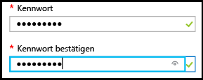
6. Wählen Sie ein Abonnement aus, für das Sie über die Berechtigung zum Erstellen von Objekten verfügen.

    
7. Wählen Sie im Textfeld „Ressourcengruppe“ die Option **Neu erstellen**, und geben Sie dann im Textfeld „Ressourcengruppe“ einen gültigen Namen für die neue Ressourcengruppe ein. (Sie können auch eine vorhandene Ressourcengruppe verwenden, wenn Sie bereits eine erstellt haben.) Wenn der angegebene Name gültig ist, wird ein grünes Häkchen angezeigt.

    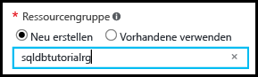

8. Wählen Sie im Textfeld **Standort** ein geeignetes Rechenzentrum für Ihren Standort aus, z.B. „Australien, Osten“.
    
    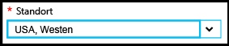
    
    > [!TIP]
    > Das Kontrollkästchen **Azure-Diensten Zugriff auf den Server erlauben** kann auf diesem Blatt nicht geändert werden. Sie können diese Einstellung auf dem Blatt für die Serverfirewall ändern. Weitere Informationen finden Sie unter [Erste Schritte mit der Sicherheit](sql-database-get-started-security.md).
    >
    
9. Klicken Sie auf **Erstellen**.

    

## <a name="view-the-logical-sql-server-properties-in-the-azure-portal"></a>Anzeigen der Eigenschaften der logischen SQL Server-Instanz im Azure-Portal

1. Klicken Sie im Azure-Portal auf **Weitere Dienste**.

    
2. Geben Sie im Textfeld „Filter“ den Text **SQL** ein, und klicken Sie auf das Sternchen für die SQL-Server, um SQL-Server als Favoriten in Azure anzugeben. 

    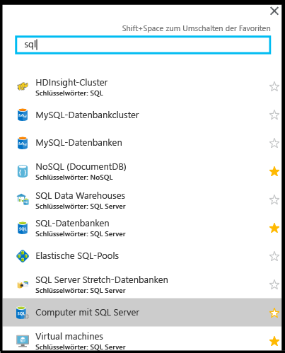
3. Klicken Sie auf dem Standardblatt auf **Computer mit SQL Server**, um die Liste mit den SQL-Servern in Ihrem Azure-Abonnement zu öffnen. 

    

4. Klicken Sie auf den neuen SQL-Server, um die Eigenschaften im Azure-Portal anzuzeigen. In den nachfolgenden Tutorials werden die Optionen beschrieben, die auf diesem Blatt verfügbar sind.

    
5. Klicken Sie unter „Einstellungen“ auf **Eigenschaften**, um verschiedene Eigenschaften für den logischen SQL-Server anzuzeigen.

    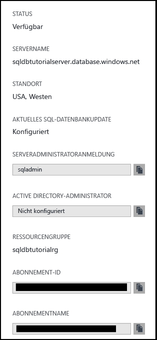
6. Kopieren Sie den vollqualifizierten Servernamen in die Zwischenablage, damit Sie ihn später in diesem Tutorial verwenden können.

    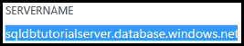

## <a name="create-a-server-level-firewall-rule-in-the-azure-portal"></a>Erstellen einer Firewallregel auf Serverebene im Azure-Portal

1. Klicken Sie auf dem Blatt „SQL Server“ unter „Einstellungen“ auf **Firewall**, um das Blatt „Firewall“ für den SQL-Server zu öffnen.

    

2. Überprüfen Sie die angezeigte Client-IP-Adresse, und vergewissern Sie sich, dass dies Ihre IP-Adresse für das Internet ist, indem Sie einen Browser Ihrer Wahl verwenden (Frage: „Wie lautet meine IP-Adresse“). Es kann vorkommen, dass diese Adressen aus unterschiedlichen Gründen nicht übereinstimmen.

    

3. Wenn die IP-Adressen übereinstimmen, können Sie in der Symbolleiste auf **Client-IP-Adresse hinzufügen** klicken.

    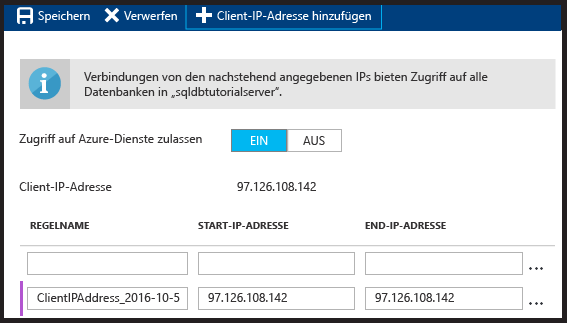

    > [!NOTE]
    > Sie können die SQL-Datenbank-Firewall auf dem Server für eine einzelne IP-Adresse oder einen gesamten Adressbereich öffnen. Mit dem Öffnen der Firewall wird es SQL-Administratoren und Benutzern ermöglicht, sich auf dem Server an allen Datenbanken anzumelden, für die sie über gültige Anmeldeinformationen verfügen.
    >

4. Klicken Sie in der Symbolleiste auf **Speichern**, um diese Firewallregel auf Serverebene zu speichern, und klicken Sie dann auf **OK**.

    

## <a name="connect-to-sql-server-using-sql-server-management-studio-ssms"></a>Herstellen einer Verbindung mit der SQL Server-Instanz mit SQL Server Management Studio (SSMS)

1. Laden Sie die aktuelle Version von SSMS unter [Herunterladen von SQL Server Management Studio (SSMS)](https://msdn.microsoft.com/library/mt238290.aspx) herunter, und installieren Sie die Anwendung, falls noch nicht geschehen. Damit Sie immer auf dem neuesten Stand bleiben, werden Sie von der aktuellen Version von SSMS informiert, wenn eine neue Version als Download verfügbar ist.

2. Geben Sie nach der Installation im Windows-Suchfeld den Text **Microsoft SQL Server Management Studio** ein, und drücken Sie die **EINGABETASTE**, um SSMS zu öffnen:

    
3. Geben Sie im Dialogfeld „Mit Server verbinden“ die erforderlichen Informationen ein, um eine Verbindung Ihrer SQL Server-Instanz per SQL Server-Authentifizierung herzustellen.

    
4. Klicken Sie auf **Verbinden**.

    
5. Erweitern Sie im Objekt-Explorer die Optionen **Datenbanken**, **Systemdatenbanken** und **Master**, um die Objekte in der Masterdatenbank anzuzeigen.

    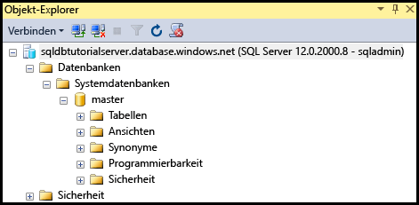
6. Klicken Sie mit der rechten Maustaste auf **Master** und dann auf **Neue Abfrage**.

    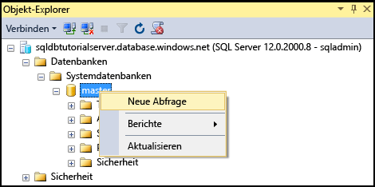

8. Geben Sie im Abfragefenster die folgende Abfrage ein:

   ```select * from sys.objects```

9.  Klicken Sie auf der Symbolleiste auf **Ausführen**, um eine Liste mit allen Systemobjekten in der Masterdatenbank zurückzugeben.

    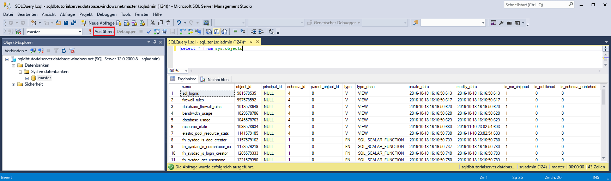

    > [!NOTE]
    > Informationen zur SQL-Sicherheit finden Sie unter [Erste Schritte mit SQL-Sicherheit](sql-database-get-started-security.md).
    >

## <a name="create-new-database-in-the-azure-portal-using-adventure-works-lt-sample"></a>Erstellen der neuen Datenbank im Azure-Portal mit dem Adventure Works LT-Beispiel

1. Klicken Sie im Azure-Portal auf dem Standardblatt auf **SQL-Datenbanken**.

    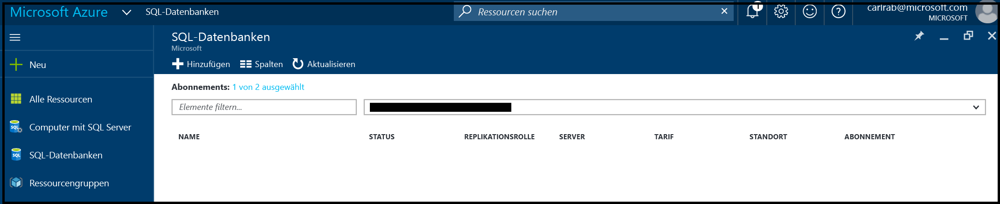
2. Klicken Sie auf dem Blatt „SQL-Datenbanken“ auf **Hinzufügen**.

    
3. Überprüfen Sie auf dem Blatt „SQL-Datenbank“ die Daten, die für Sie eingefügt wurden.

    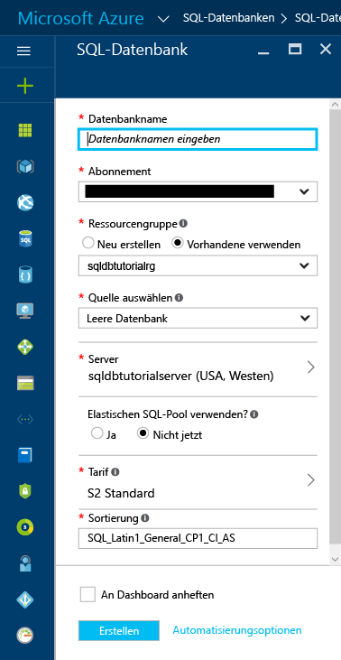
4. Geben Sie einen gültigen Datenbanknamen an.

    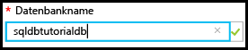
5. Klicken Sie unter „Quelle auswählen“ auf **Beispiel** und dann unter „Beispiel auswählen“ auf **AdventureWorksLT [V12]**.
   
    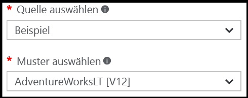
6. Geben Sie unter „Server“ den Benutzernamen und das Kennwort für die Administratoranmeldung ein.

    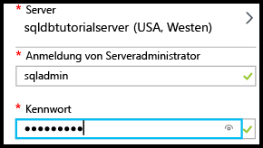

    > [!NOTE]
    > Beim Hinzufügen einer Datenbank zu einem Server kann die Datenbank als Einzeldatenbank (Standardeinstellung) oder einem elastischen SQL-Pool hinzugefügt werden. Weitere Informationen zu elastischen Pools finden Sie unter [Elastische Pools](sql-database-elastic-pool.md).
    >

7. Ändern Sie unter „Tarif“ den Tarif in **Basic**. (Sie können die Tarifstufe später wieder erhöhen, aber zu Lernzwecken ist es ratsam, hier den einfachsten Tarif zu wählen.)

    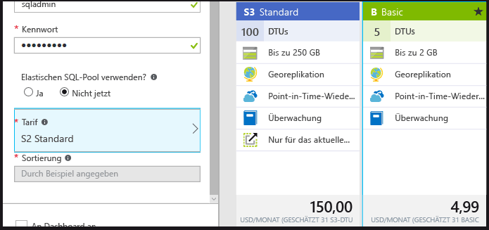
8. Klicken Sie auf **Erstellen**.

    

## <a name="view-database-properties-in-the-azure-portal"></a>Anzeigen von Datenbankeigenschaften im Azure-Portal

1. Klicken Sie auf dem Blatt „SQL-Datenbanken“ auf Ihre neue Datenbank, um die dazugehörigen Eigenschaften im Azure-Portal anzuzeigen. In den nachfolgenden Tutorials werden die Optionen beschrieben, die auf diesem Blatt verfügbar sind. 

    
2. Klicken Sie auf **Eigenschaften**, um weitere Informationen zur Datenbank anzuzeigen.

    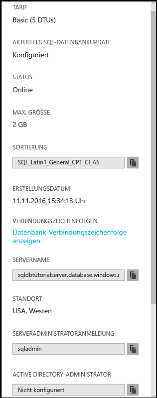

3. Klicken Sie auf **Datenbankverbindungszeichenfolgen anzeigen**.

    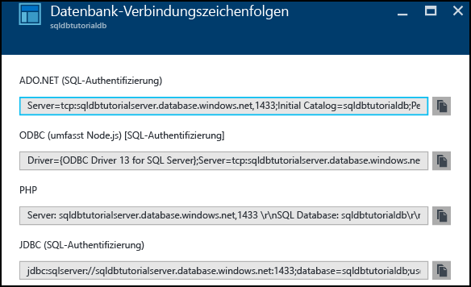
4. Klicken Sie auf **Übersicht** und dann im Bereich „Zusammenfassung“ auf Ihren Servernamen.
    
    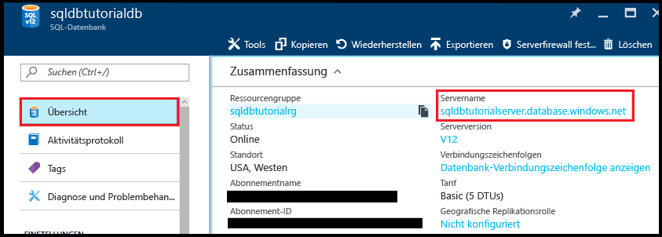
5. Im Bereich „Zusammenfassung“ Ihres Servers wird die neu hinzugefügte Datenbank angezeigt.

    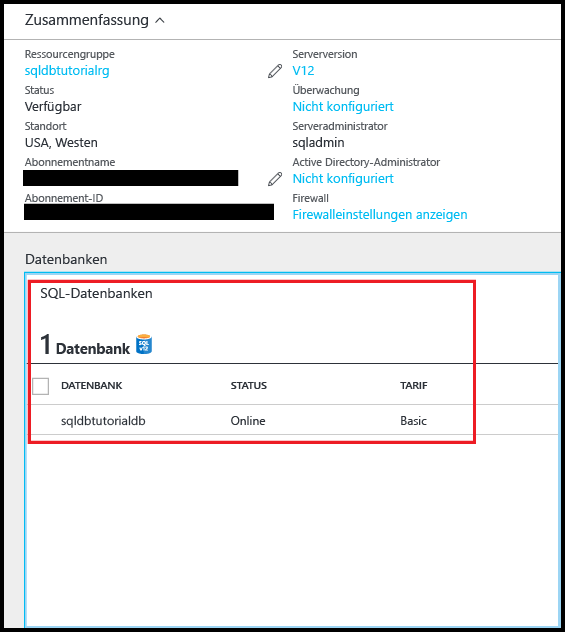

## <a name="connect-and-query-sample-database-using-sql-server-management-studio"></a>Herstellen einer Verbindung mit der Beispieldatenbank und Durchführen von Abfragen mit SQL Server Management Studio

1. Wechseln Sie zu SQL Server Management Studio, und klicken Sie im Objekt-Explorer auf **Datenbanken** und dann in der Symbolleiste auf **Aktualisieren**, um die Beispieldatenbank anzuzeigen.

    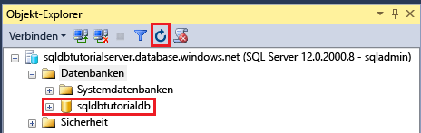
2. Erweitern Sie im Objekt-Explorer die neue Datenbank, um die dazugehörigen Objekte anzuzeigen.

    
3. Klicken Sie mit der rechten Maustaste auf die Beispieldatenbank, und klicken Sie dann auf **Neue Abfrage**.

    
4. Geben Sie im Abfragefenster die folgende Abfrage ein:

   ```select * from sys.objects```
   
9.  Klicken Sie auf der Symbolleiste auf **Ausführen**, um eine Liste mit allen Systemobjekten in der Beispieldatenbank zurückzugeben.

    

## <a name="create-a-new-blank-database-using-sql-server-management-studio"></a>Erstellen einer neuen leeren Datenbank mit SQL Server Management Studio

1. Klicken Sie im Objekt-Explorer mit der rechten Maustaste auf **Datenbanken**, und klicken Sie dann auf **Neue Datenbank**.

    

    > [!NOTE]
    > Sie können auch von SSMS ein Datenbankskript für Sie erstellen lassen, um eine neue Datenbank mit Transact-SQL zu erstellen.
    >

2. Geben Sie im Dialogfeld „Neue Datenbank“ einen Datenbanknamen in das Textfeld „Datenbankname“ ein. 

    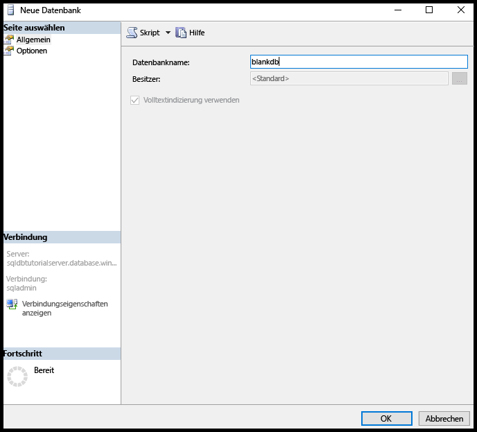

3. Klicken Sie im Dialogfeld „Neue Datenbank“ auf **Optionen**, und ändern Sie dann die Edition in **Basic**.

    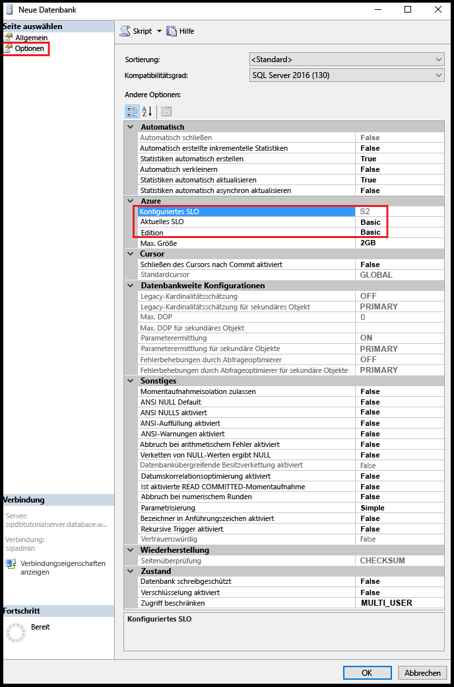

    > [!TIP]
    > Sehen Sie sich die anderen Optionen des Dialogfelds an, die Sie für eine Azure SQL-Datenbank ändern können. Weitere Informationen zu diesen Optionen finden Sie unter [Erstellen einer Datenbank](https://msdn.microsoft.com/library/dn268335.aspx).
    >

4. Klicken Sie auf **OK**, um die leere Datenbank zu erstellen.
5. Aktualisieren Sie nach Abschluss des Vorgangs den Datenbankknoten im Objekt-Explorer, um die neu erstellte leere Datenbank anzuzeigen. 

    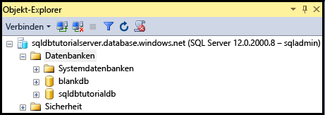

> [!TIP]
> Sie können Kosten sparen, während Sie lernen, indem Sie nicht verwendete Datenbanken löschen. Sie haben die Möglichkeit, Datenbanken der Basic Edition innerhalb von sieben Tagen wiederherzustellen. Vermeiden Sie es aber, einen Server zu löschen. Wenn Sie dies tun, ist es nicht möglich, den Server oder die gelöschten Datenbanken wiederherzustellen.
>


## <a name="next-steps"></a>Nächste Schritte
Nachdem Sie dieses Tutorial nun abgeschlossen haben, können Sie weitere Tutorials durcharbeiten, die auf den hier erworbenen Kenntnissen aufbauen. 

* Wenn Sie sich mit der Sicherheit von Azure SQL-Datenbank befassen möchten, finden Sie entsprechende Informationen im Thema zu den [ersten Schritten bei der Sicherheit](sql-database-get-started-security.md).
* Wenn Sie mit Excel vertraut sind, informieren Sie sich über das [Herstellen von Verbindungen mit SQL-Datenbank in Azure mit Excel](sql-database-connect-excel.md).
* Wenn Sie mit dem Programmieren beginnen möchten, wählen Sie unter [Verbindungsbibliotheken für SQL-Datenbank und SQL Server](sql-database-libraries.md)Ihre Programmiersprache aus.
* Wenn Sie lokale SQL Server-Datenbanken in Azure verschieben möchten, helfen Ihnen die Informationen unter [Migrieren von Datenbanken zu SQL-Datenbank](sql-database-cloud-migrate.md) weiter.
* Wenn Sie einige Daten aus einer CSV-Datei mit dem BCP-Befehlszeilentool in eine neue Tabelle laden möchten, machen Sie sich mit den Informationen unter [Laden von Daten aus einer CSV-Datei in SQL-Datenbank mit BPC](sql-database-load-from-csv-with-bcp.md)vertraut.
* Wenn Sie mit dem Erstellen von Tabellen und anderen Objekten beginnen möchten, helfen Ihnen die Informationen unter „Erstellen einer Tabelle“ im Thema [Erstellen einer Tabelle](https://msdn.microsoft.com/library/ms365315.aspx) weiter.

## <a name="additional-resources"></a>Zusätzliche Ressourcen
[Was ist SQL Database?](sql-database-technical-overview.md)


<!--HONumber=Dec16_HO1-->


