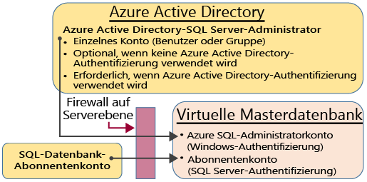
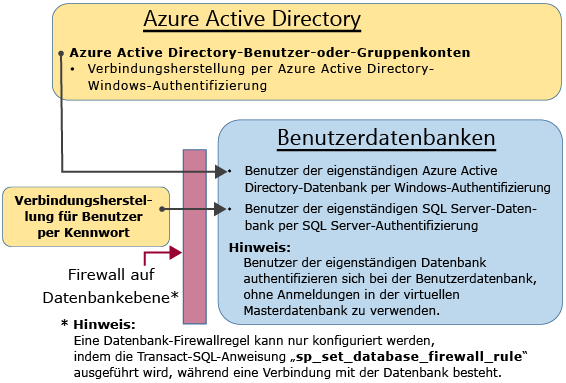

<properties
   pageTitle="SQL-Datenbank-Authentifizierung und -Autorisierung: Gewähren von Zugriff | Microsoft Azure"
   description="Erfahren Sie mehr über die Sicherheitsverwaltung für SQL-Datenbank und insbesondere dazu, wie der Datenbankzugriff und die Anmeldesicherheit über das Prinzipalkonto auf Serverebene verwaltet wird."
   keywords="Sicherheit für SQL-Datenbank,Datenbanksicherheitsverwaltung,Anmeldesicherheit,Datenbanksicherheit,Datenbankzugriff"
   services="sql-database"
   documentationCenter=""
   authors="BYHAM"
   manager="jhubbard"
   editor=""
   tags=""/>

<tags
   ms.service="sql-database"
   ms.devlang="na"
   ms.topic="article"
   ms.tgt_pltfrm="na"
   ms.workload="data-management"
   ms.date="06/06/2016"
   ms.author="rickbyh"/>

# SQL-Datenbank-Authentifizierung und -Autorisierung: Gewähren von Zugriff 


> [AZURE.SELECTOR]
- [Lernprogramm zu den ersten Schritten](sql-database-get-started-security.md)
- [Gewähren von Zugriff](sql-database-manage-logins.md)


Beginnen Sie hier, um eine Übersicht über Zugriffskonzepte von SQL-Datenbank für Administratoren, Nicht-Administratoren und Rollen zu erhalten.

## Uneingeschränkte Administratorkonten

Es gibt zwei Möglichkeiten für Administratorkonten mit uneingeschränkten Berechtigungen für den Zugriff auf die virtuelle Masterdatenbank und alle Benutzerdatenbanken. Diese Konten werden als Prinzipalkonten auf Serverebene bezeichnet.

### Azure SQL-Datenbank-Abonnentenkonto 

Bei der Erstellung einer logischen SQL-Instanz wird ein einzelnes Anmeldekonto erstellt, das als Azure SQL-Datenbank-Abonnentenkonto bezeichnet wird. Dieses Konto stellt die Verbindung per SQL Server-Authentifizierung (Benutzername und Kennwort) her. Dieses Konto ist ein Administrator auf der logischen Serverinstanz und in allen Benutzerdatenbanken, die an diese Instanz angefügt sind. Die Berechtigungen des Abonnentenkontos können nicht eingeschränkt werden. Nur eines dieser Konten kann vorhanden sein.

### Azure Active Directory-Administrator
Ein Azure Active Directory-Konto kann auch als Administrator konfiguriert werden. Bei diesem Konto kann es sich um einen individuellen Azure AD-Benutzer oder eine Azure AD-Gruppe mit mehreren Azure AD-Benutzern handeln. Die Konfiguration eines Azure AD-Administrators ist optional. Ein Azure AD-Administrator muss aber konfiguriert werden, wenn Sie die Windows-Authentifizierung für Azure AD-Konten zum Herstellen der Verbindung mit SQL-Datenbank verwenden möchten. Weitere Informationen zur Konfiguration des Azure Active Directory-Zugriffs finden Sie unter [Herstellen einer Verbindung mit SQL-Datenbank oder SQL Data Warehouse unter Verwendung der Azure Active Directory-Authentifizierung](sql-database-aad-authentication.md).

### Konfigurieren der Firewall
Wenn eine Firewall auf Serverebene konfiguriert wird, können für das Azure SQL-Datenbank-Abonnentenkonto und das Azure Active Directory-Konto Verbindungen mit der virtuellen Masterdatenbank und allen Benutzerdatenbanken hergestellt werden. Die Firewall auf Serverebene kann über das Portal konfiguriert werden. Nachdem eine Verbindung hergestellt wurde, können auch weitere Firewallregeln für die Serverebene konfiguriert werden, indem die Transact-SQL-Anweisung [sp\_set\_firewall\_rule](https://msdn.microsoft.com/library/dn270017.aspx) verwendet wird. Weitere Informationen zur Konfiguration der Firewall finden Sie unter [Konfigurieren einer Firewall für die Azure SQL-Datenbank mit dem Azure-Portal](sql-database-configure-firewall-settings.md).

### Administrator-Zugriffspfad

Wenn die Firewall auf Serverebene richtig konfiguriert ist, können das SQL-Datenbank-Abonnentenkonto und die Azure Active Directory SQL Server-Administratoren Verbindungen mit Tools wie SQL Server Management Studio oder SQL Server Data Tools herstellen. Nur die neuesten Tools verfügen über alle Features und Funktionen. Das folgende Diagramm zeigt eine typische Konfiguration für die beiden Administratorkonten. 

Bei der Verwendung eines offenen Ports in der Firewall auf Serverebene können Administratoren eine Verbindung mit jeder beliebigen SQL-Datenbank herstellen.

### Herstellen einer Verbindung mit der Datenbank über SQL Server Management Studio
Eine exemplarische Vorgehensweise zur Verbindungsherstellung mit SQL Server Management Studio finden Sie unter [Herstellen einer Verbindung mit einer SQL-Datenbank mit SQL Server Management Studio und Ausführen einer T-SQL-Beispielabfrage](sql-database-connect-query-ssms.md).


> [AZURE.IMPORTANT] Es wird empfohlen, immer die neueste Version von Management Studio zu verwenden, damit Sie mit Updates von Microsoft Azure und SQL-Datenbank synchron sind. [Aktualisieren Sie SQL Server Management Studio](https://msdn.microsoft.com/library/mt238290.aspx).


## Zusätzliche spezielle Konten
Mit SQL-Datenbank werden zwei eingeschränkte Administratorrollen in der virtuellen Masterdatenbank bereitgestellt, der Benutzerkonten hinzugefügt werden können.

### Datenbankersteller
Über die Administratorkonten können neue Datenbanken erstellt werden. Um ein zusätzliches Konto zu eröffnen, mit dem Datenbanken erstellt werden können, müssen Sie im Master einen Benutzer erstellen und den Benutzer der speziellen Datenbankrolle **dbmanager** hinzufügen. Beim Benutzer kann es sich um einen eigenständigen Datenbankbenutzer oder einen Benutzer basierend auf einer SQL Server-Anmeldung in der virtuellen Masterdatenbank handeln.

1.	Stellen Sie mit einem Administratorkonto eine Verbindung mit der virtuellen Masterdatenbank her.
2.	Optionaler Schritt: Erstellen Sie eine SQL Server-Authentifizierungsanmeldung mit der [CREATE LOGIN](https://msdn.microsoft.com/library/ms189751.aspx)-Anweisung. Beispielanweisung:

     ```
     CREATE LOGIN Mary WITH PASSWORD = '<strong_password>';
     ```

     > [AZURE.NOTE] Sie müssen ein sicheres Kennwort verwenden, wenn Sie eine Anmeldung oder einen Benutzer für eine eigenständige Datenbank erstellen. Weitere Informationen finden Sie unter [Sichere Kennwörter](https://msdn.microsoft.com/library/ms161962.aspx).

3.	Erstellen Sie in der virtuellen Masterdatenbank einen Benutzer, indem Sie die [CREATE USER](https://msdn.microsoft.com/library/ms173463.aspx)-Anweisung verwenden. Der Benutzer kann ein eigenständiger Datenbankbenutzer mit Azure Active Directory-Authentifizierung (bei Konfiguration Ihrer Umgebung für die Azure AD-Authentifizierung), ein eigenständiger Datenbankbenutzer mit SQL Server-Authentifizierung oder ein Benutzer mit SQL Server-Authentifizierung basierend auf einer SQL Server-Authentifizierungsanmeldung (im vorherigen Schritt erstellt) sein. Beispielanweisungen:

     ```
     CREATE USER [mike@contoso.com] FROM EXTERNAL PROVIDER;
     CREATE USER Tran WITH PASSWORD = '<strong_password>';
     CREATE USER Mary FROM LOGIN Mary; 
     ```

4.	Fügen Sie den neuen Benutzer der Datenbankrolle **dbmanager** hinzu, indem Sie die [ALTER ROLE](https://msdn.microsoft.com/library/ms189775.aspx)-Anweisung verwenden. Beispielanweisungen:

     ```
     ALTER ROLE dbmanager ADD MEMBER Mary; 
     ALTER ROLE dbmanager ADD MEMBER [mike@contoso.com];
     ```

     > [AZURE.NOTE] „dbmanager“ ist eine Datenbankrolle in der virtuellen Masterdatenbank, sodass Sie einen Benutzer nur der Rolle „dbmanager“ hinzufügen können. Es ist nicht möglich, eine Anmeldung auf Serverebene einer Rolle für die Datenbankebene hinzufügen.

5.	Konfigurieren Sie bei Bedarf die Firewall der Serverebene, um dem neuen Benutzer das Herstellen der Verbindung zu ermöglichen.

Nun kann der Benutzer eine Verbindung mit der virtuellen Masterdatenbank herstellen und neue Datenbanken erstellen. Das Konto, mit dem die Datenbank erstellt wird, wird zum Besitzer der Datenbank.

### Anmeldungs-Manager

Bei Bedarf können Sie die gleichen Schritte ausführen (Erstellen einer Anmeldung und eines Benutzers und Hinzufügen eines Benutzers zur Rolle **loginmanager**), um es einem Benutzer zu ermöglichen, im virtuellen Master neue Anmeldungen zu erstellen. In den meisten Fällen ist dies nicht erforderlich, da Microsoft die Verwendung von eigenständigen Datenbankbenutzern empfiehlt, die auf Datenbankebene authentifiziert werden, und keine auf Anmeldungen basierenden Benutzer. Weitere Informationen finden Sie unter [Eigenständige Datenbankbenutzer – machen Sie Ihre Datenbank portabel](https://msdn.microsoft.com/library/ff929188.aspx).

## Benutzer ohne Administratorrechte

Im Allgemeinen benötigen Konten ohne Administratorrechte keinen Zugriff auf die virtuelle Masterdatenbank. Erstellen Sie eigenständige Datenbankbenutzer auf Datenbankebene, indem Sie die [CREATE USER (Transact-SQL)](https://msdn.microsoft.com/library/ms173463.aspx)-Anweisung verwenden. Der Benutzer kann ein eigenständiger Datenbankbenutzer mit Azure Active Directory-Authentifizierung (bei Konfiguration Ihrer Umgebung für die Azure AD-Authentifizierung), ein eigenständiger Datenbankbenutzer mit SQL Server-Authentifizierung oder ein Benutzer mit SQL Server-Authentifizierung basierend auf einer SQL Server-Authentifizierungsanmeldung (im vorherigen Schritt erstellt) sein. Weitere Informationen finden Sie unter [Eigenständige Datenbankbenutzer – machen Sie Ihre Datenbank portabel](https://msdn.microsoft.com/library/ff929188.aspx).

Stellen Sie zum Erstellen von Benutzern eine Verbindung mit der Datenbank her, und führen Sie Anweisungen der folgenden Art aus:

```
CREATE USER Mary FROM LOGIN Mary; 
CREATE USER [mike@contoso.com] FROM EXTERNAL PROVIDER;
```

Zu Beginn kann nur einer der Administratoren oder der Besitzer der Datenbank Benutzer erstellen. Um für weitere Benutzer die Erstellung neuer Benutzer zu genehmigen, gewähren Sie einem ausgewählten Benutzer die Berechtigung `ALTER ANY USER`, indem Sie eine Anweisung wie diese verwenden:

```
GRANT ALTER ANY USER TO Mary;
```

Um weiteren Benutzern die vollständige Steuerung der Datenbank zu ermöglichen, machen Sie sie mit der `ALTER ROLE`-Anweisung zu einem Mitglied der festen Datenbankrolle **db\_owner**.

> [AZURE.NOTE] Der Hauptgrund für die Erstellung von Datenbankbenutzern basierend auf Anmeldungen ist, dass Sie ggf. über Benutzer mit SQL Server-Authentifizierung verfügen, die Zugriff auf mehrere Datenbanken benötigen. Auf Anmeldungen basierende Benutzer sind an die Anmeldung und an ein einzelnes Kennwort gebunden, das für diese Anmeldung verwaltet wird. Eigenständige Datenbankbenutzer in einzelnen Datenbanken sind jeweils individuelle Entitäten, für die jeweils ein eigenes Kennwort vorgehalten wird. Dies kann bei eigenständigen Datenbankbenutzern zu Verwirrung führen, wenn sie ihre Kennwörter nicht als identische Kennwörter verwalten.

### Konfigurieren der Firewall auf Datenbankebene

Es ist eine bewährte Methode, dass Benutzer ohne Administratorrechte nur über die Firewall Zugriff auf die von ihnen verwendeten Datenbanken haben sollten. Verwenden Sie die [sp\_set\_database\_firewall\_rule](https://msdn.microsoft.com/library/dn270010.aspx)-Anweisung, um die Firewall auf Datenbankebene zu konfigurieren, anstatt ihre IP-Adressen über die Firewall auf Serverebene zu autorisieren und ihnen Zugriff auf alle Datenbanken zu gewähren. Die Firewall auf Datenbankebene kann nicht über das Portal konfiguriert werden.

### Zugriffspfad für Benutzer ohne Administratorrechte

Wenn die Firewall auf Datenbankebene richtig konfiguriert ist, können Datenbankbenutzer eine Verbindung mit Clienttools wie SQL Server Management Studio oder SQL Server Data Tools herstellen. Nur die neuesten Tools verfügen über alle Features und Funktionen. Das folgende Diagramm zeigt einen typischen Zugriffspfad für Benutzer ohne Administratorrechte. 
 
## Gruppen und Rollen
Bei der effizienten Zugriffsverwaltung werden Berechtigungen verwendet, die Gruppen und Rollen zugewiesen sind, anstatt einzelnen Benutzern. Dies kann beispielsweise bei der Azure Active Directory-Authentifizierung der Fall sein:

- Fügen Sie Azure Active Directory-Benutzer in eine Azure Active Directory-Gruppe ein. Erstellen Sie einen eigenständigen Datenbankbenutzer für die Gruppe. Ordnen Sie einen oder mehrere Datenbankbenutzer in einer Datenbankrolle an. Weisen Sie der Datenbankrolle anschließend Berechtigungen zu.

Bei Verwendung der SQL Server-Authentifizierung:

- Erstellen Sie eigenständige Datenbankbenutzer in der Datenbank. Ordnen Sie einen oder mehrere Datenbankbenutzer in einer Datenbankrolle an. Weisen Sie der Datenbankrolle anschließend Berechtigungen zu.

Bei den Datenbankrollen kann es sich um integrierte Rollen handeln, z.B. **db\_owner**, **db\_ddladmin**, **db\_datawriter**, **db\_datareader**, **db\_denydatawriter** und **db\_denydatareader**. **db\_owner** wird normalerweise verwendet, um nur einigen Benutzern eine vollständige Berechtigung zu gewähren. Die anderen festen Datenbankrollen sind hilfreich, um bei der Entwicklung schnell eine einfache Datenbank zu erhalten, aber sie sind auch für die meisten Produktionsdatenbanken zu empfehlen. Die feste Datenbankrolle **db\_datareader** gewährt beispielsweise Lesezugriff auf jede Tabelle der Datenbank. Dies ist im Normalfall nicht unbedingt erforderlich. Es ist viel besser, die [CREATE ROLE](https://msdn.microsoft.com/library/ms187936.aspx)-Anweisung zum Erstellen Ihrer eigenen benutzerdefinierten Datenbankrollen zu verwenden und jeder Rolle sorgfältig nur die Berechtigungen zu gewähren, die für die jeweilige Aufgabe benötigt werden. Wenn ein Benutzer Mitglied mehrerer Rollen ist, verfügt er über die zusammengefassten Berechtigungen all dieser Rollen.

## Berechtigungen

Es gibt mehr als 100 Berechtigungen, die in SQL-Datenbank individuell gewährt oder verweigert werden können. Viele dieser Berechtigungen sind geschachtelt. Die `UPDATE`-Berechtigung für ein Schema enthält beispielsweise für jede Tabelle des Schemas die `UPDATE`-Berechtigung. Wie bei den meisten Berechtigungssystemen wird eine Gewährung durch die Verweigerung einer Berechtigung außer Kraft gesetzt. Aufgrund der Schachtelung und der Anzahl von Berechtigungen muss ein geeignetes Berechtigungssystem sorgfältig entworfen werden, um für Ihre Datenbank den richtigen Schutz sicherzustellen. Beginnen Sie mit der Liste der Berechtigungen unter [Berechtigungen (Datenbankmodul)](https://msdn.microsoft.com/library/ms191291.aspx), und sehen Sie sich die [Grafik in Postergröße](http://go.microsoft.com/fwlink/?LinkId=229142) mit den Berechtigungen an.


## Nächste Schritte

[Sichern der SQL-Datenbank](sql-database-security.md)

[Erstellen einer Tabelle (Lernprogramm)](https://msdn.microsoft.com/library/ms365315.aspx)

[Einfügen und Aktualisieren von Daten in einer Tabelle (Lernprogramm)](https://msdn.microsoft.com/library/ms365309.aspx)

[Lesen der Daten in einer Tabelle (Lernprogramm)](https://msdn.microsoft.com/library/ms365310.aspx)

[Erstellen von Sichten und gespeicherten Prozeduren](https://msdn.microsoft.com/library/ms365311.aspx)

[Erteilen des Zugriffs auf ein Datenbankobjekt](https://msdn.microsoft.com/library/ms365327.aspx)


## Weitere Ressourcen

[Sichern der SQL-Datenbank](sql-database-security.md)

[Sicherheitscenter für SQL Server-Datenbankmodul und Azure SQL-Datenbank](https://msdn.microsoft.com/library/bb510589.aspx)

<!---HONumber=AcomDC_0706_2016-->