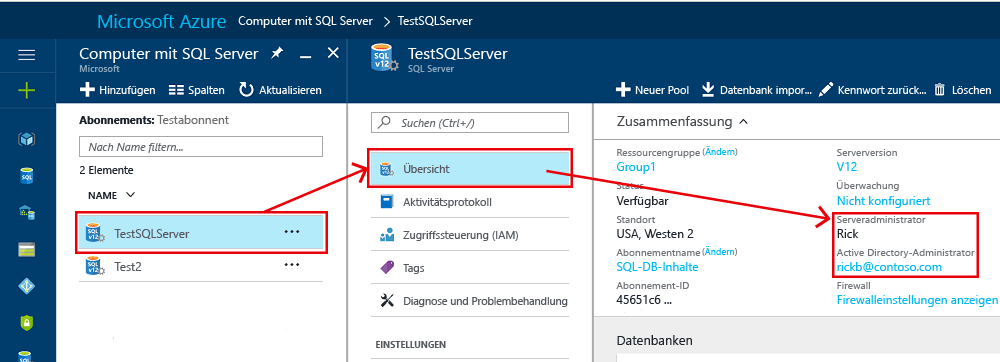

# <a name="controlling-and-granting-database-access"></a>Steuern und Gewähren von Datenbankzugriff

Wenn Firewallregeln konfiguriert wurden, können Benutzer über ein Administratorkonto, als Datenbankbesitzer oder als Datenbankbenutzer in der Datenbank eine Verbindung mit SQL-Datenbank herstellen.  

>  [!NOTE]  
>  Dieses Thema gilt für Azure SQL-Server sowie für Datenbanken von SQL-Datenbank und SQL Data Warehouse, die auf dem Azure SQL-Server erstellt werden. Der Einfachheit halber wird nur SQL-Datenbank verwendet, wenn sowohl SQL-Datenbank als auch SQL Data Warehouse gemeint sind. 
>

> [!TIP]
> Unter [Schützen der Azure SQL-Datenbank](sql-database-security-tutorial.md) finden Sie ein Tutorial.
>


## <a name="unrestricted-administrative-accounts"></a>Uneingeschränkte Administratorkonten
Es gibt zwei Administratorkonten (**Serveradministrator** und **Active Directory-Administrator**), die als Administratoren fungieren. Öffnen Sie das Azure-Portal, und navigieren Sie zu den Eigenschaften Ihres SQL-Servers, um diese Administratorkonten für Ihren SQL-Server zu identifizieren.



- **Serveradministrator**   
Wenn Sie einen Azure SQL-Server erstellen, müssen Sie eine **Serveradministratoranmeldung** angeben. Vom SQL-Server wird dieses Konto als Anmeldung für die Masterdatenbank erstellt. Dieses Konto stellt die Verbindung per SQL Server-Authentifizierung (Benutzername und Kennwort) her. Nur eines dieser Konten kann vorhanden sein.   
- **Azure Active Directory-Administrator**   
Ein Azure Active Directory-Konto – entweder für eine Einzelperson oder eine Sicherheitsgruppe – kann auch als Administrator konfiguriert werden. Die Konfiguration eines Azure AD-Administrators ist optional. Ein Azure AD-Administrator muss aber konfiguriert werden, wenn Sie Azure AD-Konten zum Herstellen der Verbindung mit SQL-Datenbank verwenden möchten. Weitere Informationen zur Konfiguration des Azure Active Directory-Zugriffs finden Sie unter [Herstellen einer Verbindung mit SQL-Datenbank oder SQL Data Warehouse unter Verwendung der Azure Active Directory-Authentifizierung](sql-database-aad-authentication.md) und [SSMS-Unterstützung für Azure AD MFA mit SQL-Datenbank und SQL Data Warehouse](sql-database-ssms-mfa-authentication.md).
 

Die Konten **Serveradministrator** und **Azure AD-Administrator** weisen die folgenden Merkmale auf:
- Dies sind die einzigen Konten, mit denen automatisch eine Verbindung mit einer beliebigen SQL-Datenbank auf dem Server hergestellt werden kann. (Zum Herstellen einer Verbindung mit einer Benutzerdatenbank müssen andere Konten entweder der Besitzer der Datenbank sein oder in der Benutzerdatenbank über ein Benutzerkonto verfügen.)
- Für diese Konten wird auf Benutzerdatenbanken mit dem Benutzer `dbo` zugegriffen, und alle Berechtigungen sind in den Benutzerdatenbanken enthalten. (Der Besitzer einer Benutzerdatenbank greift auf die Datenbank ebenfalls als Benutzer `dbo` zu.) 
- Diese Konten greifen auf die Datenbank `master` nicht als Benutzer `dbo` zu und verfügen für „master“ über eingeschränkte Berechtigungen. 
- Diese Konten sind keine Mitglieder der festen Standardserverrolle `sysadmin` von SQL Server, die in SQL-Datenbank nicht verfügbar ist.  
- Mit diesen Konten können Datenbanken, Anmeldungen, Benutzer in „master“ und Firewallregeln auf Serverebene erstellt, geändert und verworfen werden.
- Mit diesen Konten können Mitglieder für die Rollen `dbmanager` und `loginmanager` hinzugefügt und entfernt werden.
- Mit diesen Konten kann die Systemtabelle `sys.sql_logins` angezeigt werden.

### <a name="configuring-the-firewall"></a>Konfigurieren der Firewall
Wenn eine Firewall auf Serverebene für eine einzelne IP-Adresse oder einen Bereich konfiguriert wird, kann über **SQL Server-Administrator** und **Azure Active Directory-Administrator** eine Verbindung mit der Masterdatenbank und allen Benutzerdatenbanken hergestellt werden. Die erste Firewall auf Serverebene kann über das [Azure-Portal](sql-database-get-started-portal.md) konfiguriert werden, indem die [PowerShell](sql-database-get-started-powershell.md) oder die [REST-API](https://msdn.microsoft.com/library/azure/dn505712.aspx) verwendet wird. Nachdem eine Verbindung hergestellt wurde, können Sie per [Transact-SQL](sql-database-configure-firewall-settings.md) auch weitere Firewallregeln auf Serverebene konfigurieren.

### <a name="administrator-access-path"></a>Administrator-Zugriffspfad
Wenn die Firewall auf Serverebene richtig konfiguriert ist, können mit **SQL Server-Administrator** und **Azure Active Directory-Administrator** Verbindungen mit Tools wie SQL Server Management Studio oder SQL Server Data Tools hergestellt werden. Nur die neuesten Tools verfügen über alle Features und Funktionen. Das folgende Diagramm zeigt eine typische Konfiguration für die beiden Administratorkonten.


Bei der Verwendung eines offenen Ports in der Firewall auf Serverebene können Administratoren eine Verbindung mit jeder beliebigen SQL-Datenbank herstellen.

### <a name="connecting-to-a-database-by-using-sql-server-management-studio"></a>Herstellen einer Verbindung mit der Datenbank über SQL Server Management Studio
Eine exemplarische Vorgehensweise zur Erstellung eines Servers, einer Datenbank, von Firewallregeln auf Serverebene und zur Verwendung von SQL Server Management Studio zum Abfragen einer Datenbank finden Sie unter [Erste Schritte mit Azure SQL-Datenbankservern, -Datenbanken und -Firewallregeln mit dem Azure-Portal und SQL Server Management Studio](sql-database-get-started-portal.md).

> [!IMPORTANT]
> Es wird empfohlen, immer die neueste Version von Management Studio zu verwenden, damit Sie mit Updates von Microsoft Azure und SQL-Datenbank synchron sind. [Aktualisieren Sie SQL Server Management Studio](https://msdn.microsoft.com/library/mt238290.aspx).


## <a name="additional-server-level-administrative-roles"></a>Zusätzliche Administratorrollen auf Serverebene
Zusätzlich zu den bisher beschriebenen Administratorrollen auf Serverebene werden von SQL-Datenbank zwei eingeschränkte Administratorrollen in der Masterdatenbank bereitgestellt, denen Benutzerkonten hinzugefügt werden können, um Berechtigungen zum Erstellen von Datenbanken oder Verwalten von Anmeldungen zu gewähren.

### <a name="database-creators"></a>Datenbankersteller
Eine dieser Administratorrollen ist die Rolle **dbmanager**. Mitglieder dieser Rolle können neue Datenbanken erstellen. Zum Verwenden dieser Rolle erstellen Sie einen Benutzer in der Datenbank `master` und fügen den Benutzer dann der Datenbankrolle **dbmanager** hinzu. Für die Erstellung einer Datenbank muss es sich um einen Benutzer handeln, der auf einer SQL Server-Anmeldung in der Masterdatenbank basiert, oder um einen Benutzer einer eigenständigen Datenbank, der auf einem Azure Active Directory-Benutzer basiert.

1. Stellen Sie mit einem Administratorkonto eine Verbindung mit der Masterdatenbank her.
2. Optionaler Schritt: Erstellen Sie eine SQL Server-Authentifizierungsanmeldung mit der [CREATE LOGIN](https://msdn.microsoft.com/library/ms189751.aspx) -Anweisung. Beispielanweisung:
   
   ```
   CREATE LOGIN Mary WITH PASSWORD = '<strong_password>';
   ```
   
   > [!NOTE]
   > Verwenden Sie ein sicheres Kennwort, wenn Sie eine Anmeldung oder einen Benutzer für eine eigenständige Datenbank erstellen. Weitere Informationen finden Sie unter [Sichere Kennwörter](https://msdn.microsoft.com/library/ms161962.aspx).
    
   Um die Leistung zu verbessern, werden Anmeldungen (Prinzipale auf Serverebene) vorübergehend auf Datenbankebene zwischengespeichert. Informationen zum Aktualisieren des Caches für die Authentifizierung finden Sie unter [DBCC FLUSHAUTHCACHE](https://msdn.microsoft.com/library/mt627793.aspx).

3. Erstellen Sie in der Masterdatenbank einen Benutzer, indem Sie die [CREATE USER](https://msdn.microsoft.com/library/ms173463.aspx)-Anweisung verwenden. Der Benutzer kann ein eigenständiger Datenbankbenutzer mit Azure Active Directory-Authentifizierung (bei Konfiguration Ihrer Umgebung für die Azure AD-Authentifizierung), ein eigenständiger Datenbankbenutzer mit SQL Server-Authentifizierung oder ein Benutzer mit SQL Server-Authentifizierung basierend auf einer SQL Server-Authentifizierungsanmeldung (im vorherigen Schritt erstellt) sein. Beispielanweisungen:
   
   ```
   CREATE USER [mike@contoso.com] FROM EXTERNAL PROVIDER;
   CREATE USER Tran WITH PASSWORD = '<strong_password>';
   CREATE USER Mary FROM LOGIN Mary; 
   ```

4. Fügen Sie den neuen Benutzer der Datenbankrolle **dbmanager** hinzu, indem Sie die [ALTER ROLE](https://msdn.microsoft.com/library/ms189775.aspx) -Anweisung verwenden. Beispielanweisungen:
   
   ```
   ALTER ROLE dbmanager ADD MEMBER Mary; 
   ALTER ROLE dbmanager ADD MEMBER [mike@contoso.com];
   ```
   
   > [!NOTE]
   > „dbmanager“ ist eine Datenbankrolle in der Masterdatenbank. Dies bedeutet, dass Sie einen Datenbankbenutzer nur der Rolle „dbmanager“ hinzufügen können. Es ist nicht möglich, eine Anmeldung auf Serverebene einer Rolle für die Datenbankebene hinzufügen.
    
5. Konfigurieren Sie bei Bedarf eine Firewallregel, um für den neuen Benutzer das Herstellen der Verbindung zuzulassen. (Der neue Benutzer ist ggf. durch eine vorhandene Firewallregel abgedeckt.)

Nun kann der Benutzer eine Verbindung mit der Masterdatenbank herstellen und neue Datenbanken erstellen. Das Konto, mit dem die Datenbank erstellt wird, wird zum Besitzer der Datenbank.

### <a name="login-managers"></a>Anmeldungs-Manager
Die andere Administratorrolle ist die Rolle „loginmanager“ (Anmeldungs-Manager). Mitglieder dieser Rolle können in der Masterdatenbank neue Anmeldungen erstellen. Bei Bedarf können Sie die gleichen Schritte ausführen (Erstellen einer Anmeldung und eines Benutzers und Hinzufügen eines Benutzers zur Rolle **loginmanager**), um es einem Benutzer zu ermöglichen, im Master neue Anmeldungen zu erstellen. In der Regel sind keine Anmeldungen erforderlich, da Microsoft anstelle von auf Anmeldungen basierenden Benutzern die Verwendung von eigenständigen Datenbankbenutzern empfiehlt, die auf Datenbankebene authentifiziert werden. Weitere Informationen finden Sie unter [Eigenständige Datenbankbenutzer – machen Sie Ihre Datenbank portabel](https://msdn.microsoft.com/library/ff929188.aspx).

## <a name="non-administrator-users"></a>Benutzer ohne Administratorrechte
Im Allgemeinen benötigen Konten ohne Administratorrechte keinen Zugriff auf die Masterdatenbank. Erstellen Sie eigenständige Datenbankbenutzer auf Datenbankebene, indem Sie die [CREATE USER](https://msdn.microsoft.com/library/ms173463.aspx) -Anweisung (Transact-SQL) verwenden. Der Benutzer kann ein eigenständiger Datenbankbenutzer mit Azure Active Directory-Authentifizierung (bei Konfiguration Ihrer Umgebung für die Azure AD-Authentifizierung), ein eigenständiger Datenbankbenutzer mit SQL Server-Authentifizierung oder ein Benutzer mit SQL Server-Authentifizierung basierend auf einer SQL Server-Authentifizierungsanmeldung (im vorherigen Schritt erstellt) sein. Weitere Informationen finden Sie unter [Eigenständige Datenbankbenutzer – machen Sie Ihre Datenbank portabel](https://msdn.microsoft.com/library/ff929188.aspx). 

Stellen Sie zum Erstellen von Benutzern eine Verbindung mit der Datenbank her, und führen Sie ähnliche Anweisungen wie die folgenden aus:

```
CREATE USER Mary FROM LOGIN Mary; 
CREATE USER [mike@contoso.com] FROM EXTERNAL PROVIDER;
```

Zu Beginn kann nur einer der Administratoren oder der Besitzer der Datenbank Benutzer erstellen. Um für weitere Benutzer die Erstellung neuer Benutzer zu genehmigen, gewähren Sie einem ausgewählten Benutzer die Berechtigung `ALTER ANY USER` , indem Sie eine Anweisung wie diese verwenden:

```
GRANT ALTER ANY USER TO Mary;
```

Um weiteren Benutzern die vollständige Steuerung der Datenbank zu ermöglichen, machen Sie sie mit der `ALTER ROLE`-Anweisung zu einem Mitglied der festen Datenbankrolle **db_owner**.

> [!NOTE]
> Der häufigste Grund für die Erstellung von Datenbankbenutzern basierend auf Anmeldungen ist, dass Sie ggf. über Benutzer mit SQL Server-Authentifizierung verfügen, die Zugriff auf mehrere Datenbanken benötigen. Auf Anmeldungen basierende Benutzer sind an die Anmeldung und an ein einzelnes Kennwort gebunden, das für diese Anmeldung verwaltet wird. Eigenständige Datenbankbenutzer in einzelnen Datenbanken sind jeweils individuelle Entitäten, für die jeweils ein eigenes Kennwort vorgehalten wird. Dies kann bei eigenständigen Datenbankbenutzern zu Verwirrung führen, wenn sie ihre Kennwörter nicht als identische Kennwörter verwalten.

### <a name="configuring-the-database-level-firewall"></a>Konfigurieren der Firewall auf Datenbankebene
Es ist eine bewährte Methode, dass Benutzer ohne Administratorrechte nur über die Firewall Zugriff auf die von ihnen verwendeten Datenbanken haben sollten. Verwenden Sie die Anweisung [sp_set_database_firewall_rule](https://msdn.microsoft.com/library/dn270010.aspx), um die Firewall auf Datenbankebene zu konfigurieren, anstatt ihre IP-Adressen über die Firewall auf Serverebene zu autorisieren und ihnen Zugriff auf alle Datenbanken zu gewähren. Die Firewall auf Datenbankebene kann nicht über das Portal konfiguriert werden.

### <a name="non-administrator-access-path"></a>Zugriffspfad für Benutzer ohne Administratorrechte
Wenn die Firewall auf Datenbankebene richtig konfiguriert ist, können Datenbankbenutzer eine Verbindung mit Clienttools wie SQL Server Management Studio oder SQL Server Data Tools herstellen. Nur die neuesten Tools verfügen über alle Features und Funktionen. Das folgende Diagramm zeigt einen typischen Zugriffspfad für Benutzer ohne Administratorrechte.


## <a name="groups-and-roles"></a>Gruppen und Rollen
Bei der effizienten Zugriffsverwaltung werden Berechtigungen verwendet, die Gruppen und Rollen zugewiesen sind, anstatt einzelnen Benutzern. 

- Ordnen Sie Azure Active Directory-Benutzer bei Verwendung der Azure Active Directory-Authentifizierung in einer Azure Active Directory-Gruppe an. Erstellen Sie einen eigenständigen Datenbankbenutzer für die Gruppe. Ordnen Sie einen oder mehrere Datenbankbenutzer in einer [Datenbankrolle](https://msdn.microsoft.com/library/ms189121) an, und weisen Sie der Datenbankrolle dann [Berechtigungen](https://msdn.microsoft.com/library/ms191291.aspx) zu.

- Erstellen Sie bei Verwendung der SQL Server-Authentifizierung in der Datenbank eigenständige Datenbankbenutzer. Ordnen Sie einen oder mehrere Datenbankbenutzer in einer [Datenbankrolle](https://msdn.microsoft.com/library/ms189121) an, und weisen Sie der Datenbankrolle dann [Berechtigungen](https://msdn.microsoft.com/library/ms191291.aspx) zu.

Bei den Datenbankrollen kann es sich um integrierte Rollen handeln, z.B. **db_owner**, **db_ddladmin**, **db_datawriter**, **db_datareader**, **db_denydatawriter** und **db_denydatareader**. **db_owner** wird häufig verwendet, um nur einigen Benutzern uneingeschränkte Berechtigungen zu erteilen. Die anderen festen Datenbankrollen sind hilfreich, um bei der Entwicklung schnell eine einfache Datenbank zu erhalten, aber sie sind auch für die meisten Produktionsdatenbanken zu empfehlen. Die feste Datenbankrolle **db_datareader** gewährt beispielsweise Lesezugriff auf jede Tabelle der Datenbank. Dies ist im Normalfall nicht unbedingt erforderlich. Es ist viel besser, die Anweisung [CREATE ROLE](https://msdn.microsoft.com/library/ms187936.aspx) zum Erstellen Ihrer eigenen benutzerdefinierten Datenbankrollen zu verwenden und jeder Rolle sorgfältig nur die Berechtigungen zu gewähren, die für die jeweilige Aufgabe benötigt werden. Wenn ein Benutzer Mitglied mehrerer Rollen ist, verfügt er über die zusammengefassten Berechtigungen all dieser Rollen.

## <a name="permissions"></a>Berechtigungen
Es gibt mehr als 100 Berechtigungen, die in SQL-Datenbank individuell gewährt oder verweigert werden können. Viele dieser Berechtigungen sind geschachtelt. Die `UPDATE`-Berechtigung für ein Schema enthält beispielsweise für jede Tabelle des Schemas die `UPDATE`-Berechtigung. Wie bei den meisten Berechtigungssystemen wird eine Gewährung durch die Verweigerung einer Berechtigung außer Kraft gesetzt. Aufgrund der Schachtelung und der Anzahl von Berechtigungen muss ein geeignetes Berechtigungssystem sorgfältig entworfen werden, um für Ihre Datenbank den richtigen Schutz sicherzustellen. Beginnen Sie mit der Liste der Berechtigungen unter [Berechtigungen (Datenbankmodul)](https://msdn.microsoft.com/library/ms191291.aspx), und sehen Sie sich die [Grafik in Postergröße](http://go.microsoft.com/fwlink/?LinkId=229142) mit den Berechtigungen an.


### <a name="considerations-and-restrictions"></a>Wichtige Aspekte und Einschränkungen
Beachten Sie beim Verwalten von Anmeldungen und Benutzern in SQL-Datenbank Folgendes:

* Sie müssen über eine Verbindung mit der Datenbank **master** verfügen, wenn Sie die `CREATE/ALTER/DROP DATABASE`-Anweisungen ausführen.   
* Der Datenbankbenutzer, der der Anmeldung **Serveradministrator** entspricht, kann nicht geändert oder verworfen werden. 
* „Englisch (USA)“ ist die Standardsprache des Anmeldungstyps **Serveradministrator**.
* Nur die Administratoren (Anmeldung **Serveradministrator** oder Azure AD-Administrator) und die Mitglieder der Datenbankrolle **dbmanager** in der Datenbank **master** verfügen über die Berechtigung zum Ausführen der Anweisungen `CREATE DATABASE` und `DROP DATABASE`.
* Sie müssen über eine Verbindung mit der Datenbank „master“ verfügen, wenn Sie die `CREATE/ALTER/DROP LOGIN` -Anweisungen ausführen. Von der Verwendung von Anmeldungen wird jedoch abgeraten. Verwenden Sie stattdessen Benutzer von eigenständigen Datenbanken.
* Sie müssen den Namen der Datenbank in der Verbindungszeichenfolge angeben, um eine Verbindung mit einer Benutzerdatenbank herzustellen.
* Nur die Serverebenenprinzipal-Anmeldung und die Mitglieder der Datenbankrolle **loginmanager** in der Datenbank **master** verfügen über die Berechtigung zum Ausführen der Anweisungen `CREATE LOGIN`, `ALTER LOGIN` und `DROP LOGIN`.
* Beim Ausführen der Anweisungen `CREATE/ALTER/DROP LOGIN` und `CREATE/ALTER/DROP DATABASE` in einer ADO.NET-Anwendung ist die Verwendung von parametrisierten Befehlen nicht zulässig. Weitere Informationen finden Sie unter [Befehle und Parameter](https://msdn.microsoft.com/library/ms254953.aspx).
* Beim Ausführen der Anweisungen `CREATE/ALTER/DROP DATABASE` und `CREATE/ALTER/DROP LOGIN` muss es sich jeweils um die einzige Anweisung in einem Transact-SQL-Batch handeln. Andernfalls tritt ein Fehler auf. Beispielsweise wird mit dem folgenden Transact-SQL-Code überprüft, ob die Datenbank vorhanden ist. Wenn ja, wird die Anweisung `DROP DATABASE` aufgerufen, um die Datenbank zu entfernen. Da die Anweisung `DROP DATABASE` nicht die einzige Anweisung im Batch ist, führt das Ausführen der folgenden Transact-SQL-Anweisung zu einem Fehler.

  ```
  IF EXISTS (SELECT [name]
           FROM   [sys].[databases]
           WHERE  [name] = N'database_name')
  DROP DATABASE [database_name];
  GO
  ```

* Beim Ausführen der Anweisung `CREATE USER` mit der Option `FOR/FROM LOGIN` muss sie die einzige Anweisung in einem Transact-SQL-Batch sein.
* Beim Ausführen der Anweisung `ALTER USER` mit der Option `WITH LOGIN` muss sie die einzige Anweisung in einem Transact-SQL-Batch sein.
* Für `CREATE/ALTER/DROP` benötigt ein Benutzer die Berechtigung `ALTER ANY USER` für die Datenbank.
* Wenn der Besitzer einer Datenbankrolle versucht, einen anderen Datenbankbenutzer dieser Datenbankrolle hinzuzufügen oder ihn daraus zu entfernen, tritt ggf. ein Fehler der folgenden Art auf: **Benutzer oder Rolle „Name“ ist in dieser Datenbank nicht vorhanden.** Dieser Fehler tritt auf, da der Benutzer für den Besitzer nicht sichtbar ist. Gewähren Sie dem Rollenbesitzer die Berechtigung `VIEW DEFINITION` für den Benutzer, um dieses Problem zu beheben. 


## <a name="next-steps"></a>Nächste Schritte

- Weitere Informationen zu Firewallregeln finden Sie unter [Firewall für die Azure SQL-Datenbank](sql-database-firewall-configure.md).
- Eine Übersicht über alle Sicherheitsfunktionen von SQL-Datenbank finden Sie unter [Securing your SQL Database](sql-database-security-overview.md) (Schützen Ihrer SQL-Datenbank).
- Unter [Schützen der Azure SQL-Datenbank](sql-database-security-tutorial.md) finden Sie ein Tutorial.
- Informationen zu Sichten und gespeicherten Prozeduren finden Sie unter [Erstellen von Sichten und gespeicherten Prozeduren](https://msdn.microsoft.com/library/ms365311.aspx).
- Informationen zum Gewähren des Zugriffs auf ein Datenbankobjekt finden Sie unter [Erteilen des Zugriffs auf ein Datenbankobjekt](https://msdn.microsoft.com/library/ms365327.aspx).

