# Konfigurieren, Verwalten und Wiederherstellen der langfristigen Aufbewahrung von Datenbanksicherungen in einem Azure Recovery Services-Tresor über das Azure-Portal

In diesem Thema wird beschrieben, wie Sie die langfristige Aufbewahrung von automatisierten Sicherungen in einem Azure Recovery Services-Tresor über das Azure-Portal konfigurieren, verwalten und wiederherstellen. Diese Aufgabe können Sie auch mithilfe von [PowerShell](sql-database-manage-long-term-backup-retention-powershell.md) ausführen.

Weitere Informationen zur langfristigen Aufbewahrung von Sicherungen finden Sie unter [Langfristiges Aufbewahren von Sicherungen](sql-database-long-term-retention.md).

> [!TIP]
> Ein Tutorial finden Sie unter [Erste Schritte mit der Sicherung und Wiederherstellung für Datenschutz und Wiederherstellung über das Azure-Portal](sql-database-get-started-backup-recovery-portal.md).
>

## Konfigurieren der langfristigen Beibehaltung mit dem Azure-Portal

1. Öffnen Sie das Blatt **SQL Server** für Ihren Server.

    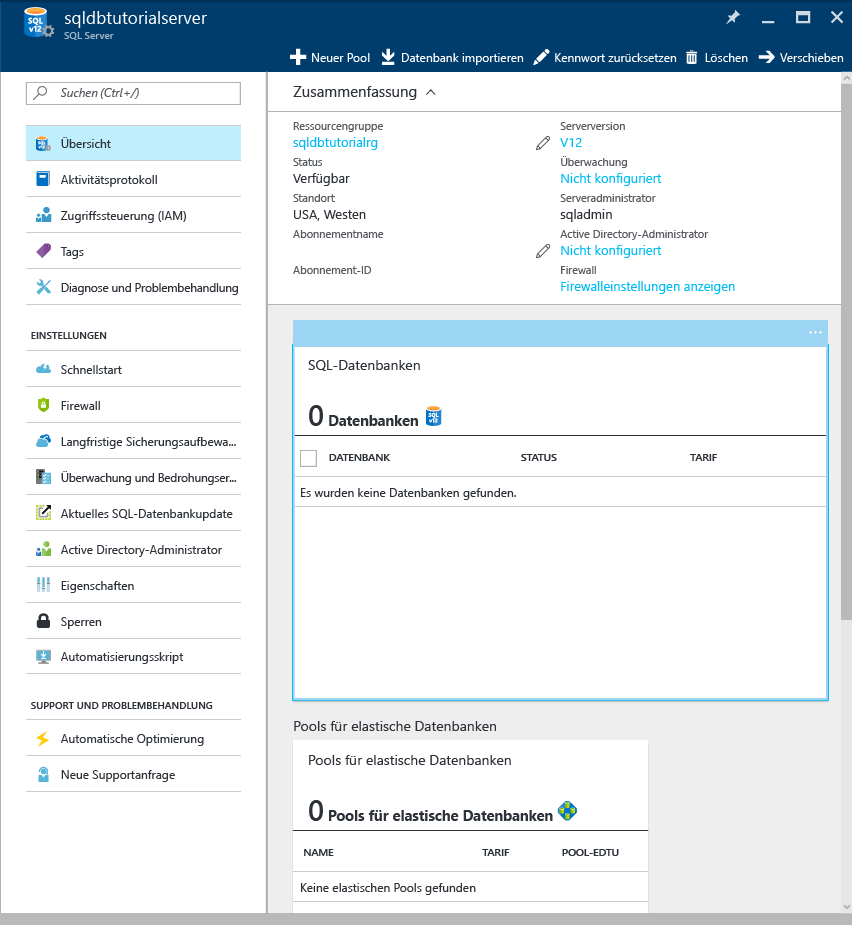

2. Klicken Sie auf **Long-term backup retention** (Langfristige Beibehaltung der Sicherung).

   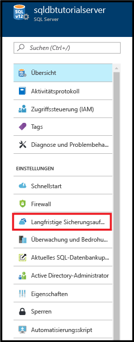

3. Lesen und akzeptieren Sie auf dem Blatt **Long-term backup retention** (Langfristige Beibehaltung der Sicherung) die Preview-Bedingungen. Dies ist nicht erforderlich, wenn Sie diesen Schritt bereits ausgeführt haben oder sich das Feature nicht mehr in der Vorschauphase befindet.

   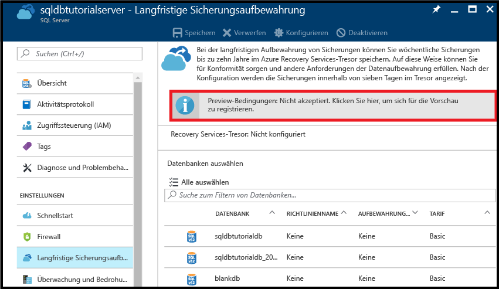

4. Um die langfristige Sicherungsaufbewahrung für eine Datenbank zu konfigurieren, wählen Sie die Datenbank im Raster aus und klicken dann auf der Symbolleiste auf **Konfigurieren**.

   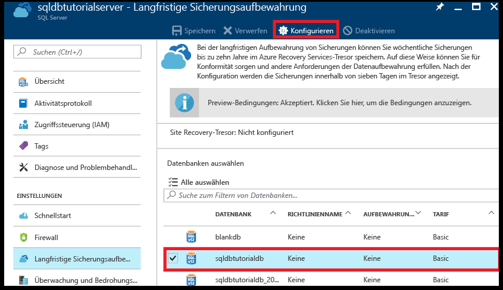

5. Klicken Sie auf dem Blatt **Konfigurieren** unter **Recovery service vault** (Recovery Services-Tresor) auf **Erforderliche Einstellungen konfigurieren**.

   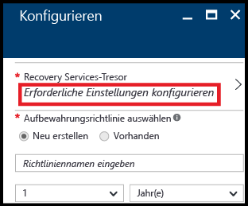

6. Wählen Sie auf dem Blatt **Recovery Services-Tresor** einen vorhandenen Tresor aus. Falls kein Recovery Services-Tresor für Ihr Abonnement vorhanden ist, klicken Sie auf den entsprechenden Link, um den Vorgang zu beenden, und erstellen Sie einen Recovery Services-Tresor.

   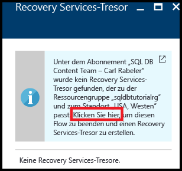

7. Klicken Sie auf dem Blatt **Recovery Services-Tresore** auf **Hinzufügen**.

   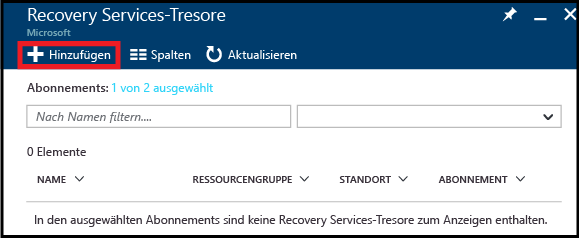
   
8. Geben Sie auf dem Blatt **Recovery Services-Tresor** einen gültigen Namen für den neuen Recovery Services-Tresor ein.

   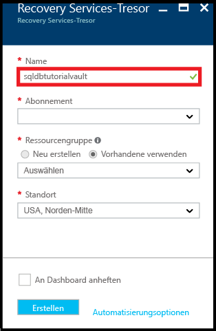

9. Wählen Sie Ihr Abonnement und die Ressourcengruppe und dann den Standort für den Tresor aus. Klicken Sie anschließend auf **Erstellen**.

   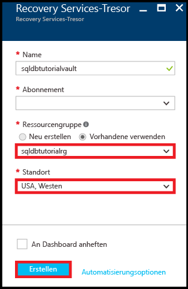

   > [!IMPORTANT]
   > Der Tresor muss sich in der gleichen Region wie der logische SQL Azure-Server befinden und die gleiche Ressourcengruppe wie der logische Server verwenden.
   >

10. Führen Sie nach der Erstellung des neuen Tresors die notwendigen Schritte durch, um zum Blatt **Recovery Services-Tresor** zurückzukehren.

11. Klicken Sie auf dem Blatt **Recovery Services-Tresor** auf den Tresor und dann auf **Auswählen**.

   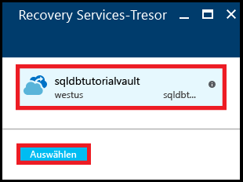

12. Geben Sie auf dem Blatt **Konfigurieren** einen gültigen Namen für die neue Aufbewahrungsrichtlinie ein, ändern Sie die Standardaufbewahrungsrichtlinie wie erforderlich, und klicken Sie dann auf **OK**.

   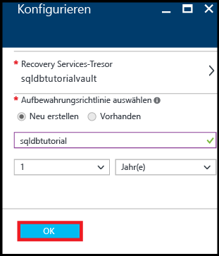

13. Klicken Sie auf dem Blatt **Long-term backup retention** (Langfristige Beibehaltung der Sicherung) auf **Speichern** und dann auf **OK**, um die Richtlinie für langfristige Beibehaltung der Sicherung auf alle ausgewählten Datenbanken anzuwenden.

   

14. Klicken Sie auf **Speichern**, um die langfristige Sicherungsaufbewahrung anhand der neuen Richtlinie für den von Ihnen konfigurierten Azure Recovery Services-Tresor zu aktivieren.

   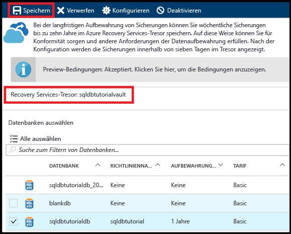

14. Öffnen Sie nach dem Aktivieren der langfristigen Sicherungsaufbewahrung das Blatt **Recovery Services-Tresor** (wechseln Sie zu **Alle Ressourcen**, und wählen Sie den Tresor in der Liste der Ressourcen für Ihr Abonnement aus).

   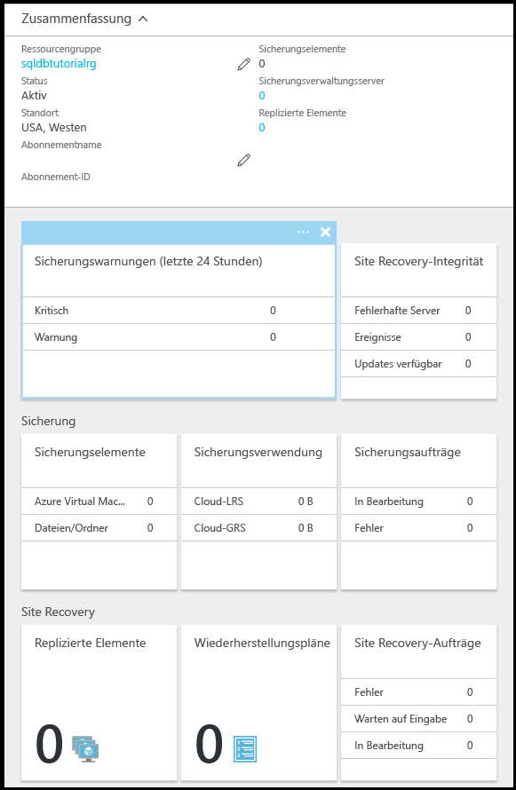

## Wiederherstellen langfristig aufbewahrter Sicherungen über das Azure-Portal

1. Klicken Sie auf dem Blatt **Azure vault backups** (Sicherungen im Azure-Tresor) auf die Sicherung, die Sie wiederherstellen möchten, und dann auf **Auswählen**.

    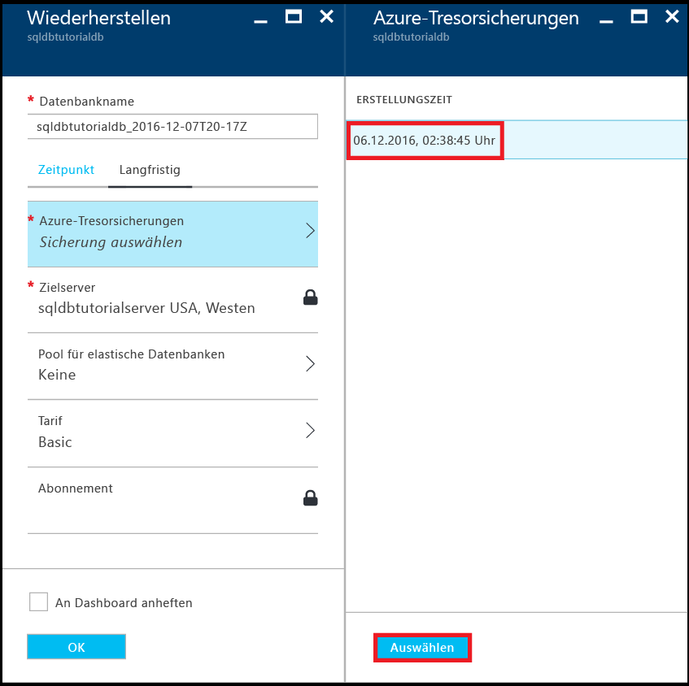

2. Geben Sie im Textfeld **Datenbankname** den Namen für die wiederhergestellte Datenbank an.

    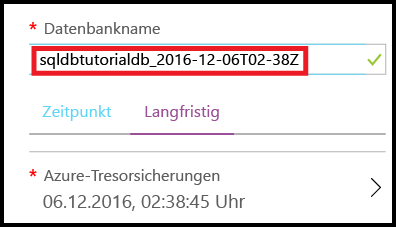

3. Klicken Sie auf **OK**, um die Datenbank aus der Sicherung im Tresor in der neuen Datenbank wiederherzustellen.

4. Klicken Sie auf der Symbolleiste auf das Benachrichtigungssymbol, um den Status des Wiederherstellungsauftrags anzuzeigen.

    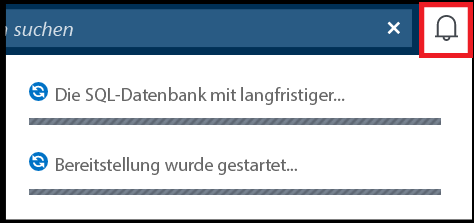

5. Öffnen Sie nach Abschluss des Wiederherstellungsauftrags das Blatt **SQL-Datenbanken**, um die neu wiederhergestellte Datenbank anzuzeigen.

    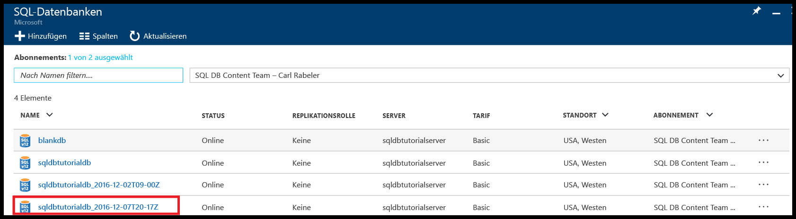

## Anzeigen von Informationen zur langfristigen Beibehaltung der Sicherung über das Azure-Portal 

1. Öffnen Sie das Blatt für den Azure Recovery Services-Tresor (wechseln Sie zu **Alle Ressourcen**, und wählen Sie den Tresor in der Liste der Ressourcen für Ihr Abonnement aus), um den Speicherplatz anzuzeigen, den Ihre Datenbanksicherungen im Tresor belegen.

   

2. Öffnen Sie das Blatt **SQL-Datenbank** für Ihre Datenbank.

    

3. Klicken Sie auf der Symbolleiste auf **Wiederherstellen**.

    

4. Klicken Sie auf dem Blatt „Wiederherstellen“ auf **Langfristig**.

5. Klicken Sie unter „Azure vault backups“ (Sicherungen im Azure-Tresor) auf **Sicherung auswählen**, um die verfügbaren Datenbanksicherungen mit langfristiger Beibehaltung anzuzeigen.

    

> [!TIP]
> Ein Tutorial finden Sie unter [Erste Schritte mit der Sicherung und Wiederherstellung für Datenschutz und Wiederherstellung](sql-database-get-started-backup-recovery-portal.md).

## Nächste Schritte

- Informationen zum Verwalten von Sicherungen in der langfristigen Sicherungsaufbewahrung mithilfe von PowerShell finden Sie unter [Verwalten der langfristigen Aufbewahrung von Datenbanksicherungen mithilfe von PowerShell](sql-database-manage-long-term-backup-retention-powershell.md).
- Weitere Informationen zu vom Dienst generierten automatischen Sicherungen finden Sie im Artikel zu [automatischen Sicherungen](sql-database-automated-backups.md).
- Weitere Informationen zur langfristigen Beibehaltung von Sicherungen finden Sie im Artikel zur [langfristigen Beibehaltung von Sicherungen](sql-database-long-term-retention.md).
- Weitere Informationen zum Wiederherstellen von Daten aus Sicherungen finden Sie im Artikel zur [Wiederherstellung aus einer Sicherung](sql-database-recovery-using-backups.md).
