<properties
	pageTitle="Verwalten von Azure SQL-Datenbanken mithilfe des Azure-Portals | Microsoft Azure"
	description="Erfahren Sie, wie Sie das Azure-Portal verwenden, um eine relationale Datenbank mithilfe des Azure-Portals in der Cloud zu verwalten."
	services="sql-database"
	documentationCenter=""
	authors="stevestein"
	manager="jhubbard"
	editor=""/>

<tags
	ms.service="sql-database"
	ms.devlang="NA"
	ms.workload="data-management"
	ms.topic="article"
	ms.tgt_pltfrm="NA"
	ms.date="09/19/2016"
	ms.author="sstein"/>

# Verwalten von Azure SQL-Datenbanken über das Azure-Portal

> [AZURE.SELECTOR]
- [Azure-Portal](sql-database-manage-portal.md)
- [SSMS](sql-database-manage-azure-ssms.md)
- [PowerShell](sql-database-command-line-tools.md)

Das [Azure-Portal](https://portal.azure.com/) ermöglicht das Erstellen, Überwachen und Verwalten von Azure SQL-Datenbanken und -Servern. Dieser Artikel enthält eine kurze Beschreibung und Links zu den Details der gängigen Aufgaben.

## Anzeigen Ihrer Azure SQL-Datenbanken, -Server und -Pools

Zum Anzeigen der verfügbaren Dienste für die SQL-Datenbank klicken Sie auf **Weitere Dienste** und geben im Suchfeld **SQL** ein:

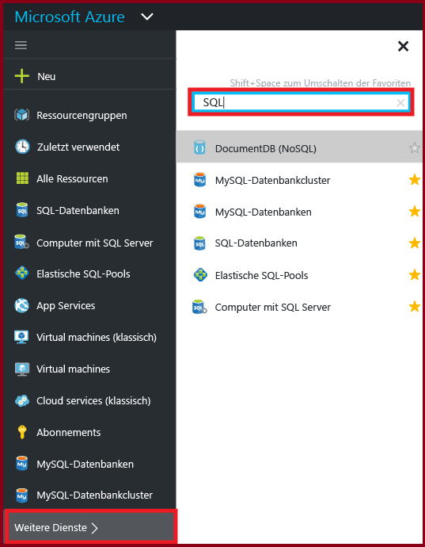

## Wie kann ich Azure SQL-Datenbanken erstellen oder anzeigen?

Zum Öffnen des Blatts **SQL-Datenbanken** klicken Sie auf **SQL-Datenbanken** und klicken dann auf die Datenbank, mit der Sie arbeiten möchten, oder klicken Sie auf **+ Hinzufügen**, um eine SQL-­Datenbank zu erstellen. Details finden Sie unter [Erstellen einer SQL-Datenbank in Minuten mit dem Azure-Portal](sql-database-get-started.md)

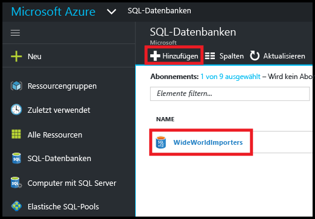

## Wie kann ich Azure SQL-Server erstellen oder anzeigen?

Zum Öffnen des Blatts **SQL-Server** klicken Sie auf **SQL-Server** und klicken dann auf den Server, mit dem Sie arbeiten möchten, oder klicken Sie auf **+ Hinzufügen**, um einen SQL-Server zu erstellen. Details finden Sie unter [Erstellen einer SQL-Datenbank in Minuten mit dem Azure-Portal](sql-database-get-started.md).

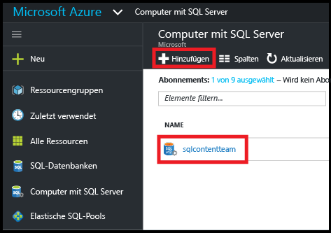

## Wie kann ich elastische SQL-Pools erstellen oder anzeigen?

Zum Öffnen des Blatts **Elastische SQL-Pools** klicken Sie auf **Elastische SQL-Pools** und klicken dann auf den Pool, mit dem Sie arbeiten möchten, oder klicken Sie auf **+ Hinzufügen**, um einen Pool zu erstellen. Details finden Sie unter [Erstellen eines Pools für elastische Datenbanken mit dem Azure-Portal](sql-database-elastic-pool-create-portal.md).

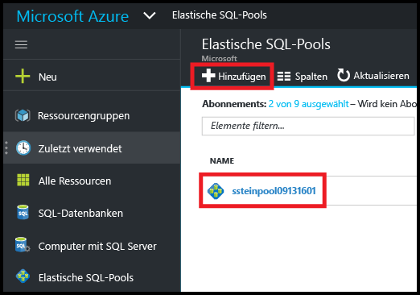

## Wie kann ich SQL-Datenbankeinstellungen aktualisieren oder anzeigen?

Zum Anzeigen oder Aktualisieren Ihrer Datenbankeinstellungen klicken Sie auf dem Blatt „SQL-Datenbank“ auf die gewünschte Einstellung:

## Wie finde ich den vollqualifizierten Servernamen einer SQL-Datenbank?

Zum Anzeigen des Servernamens Ihrer Datenbank klicken Sie auf dem Blatt **SQL-Datenbank** auf **Übersicht** und notieren den Servernamen:

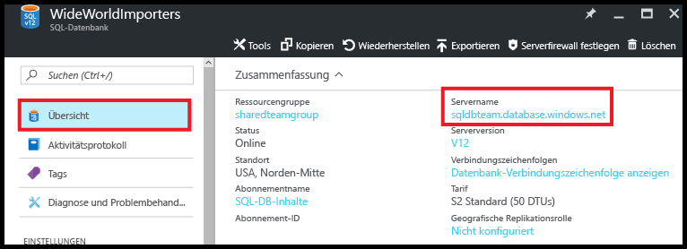

## Wie verwalte ich Firewallregeln zum Steuern des Zugriffs auf meinen SQL-Server und die Datenbank?

Zum Anzeigen, Erstellen oder Aktualisieren von Firewallregeln klicken Sie auf dem Blatt **SQL-Datenbank** auf **Set server firewall** (Serverfirewall festlegen) . Details finden Sie unter [Konfigurieren einer Firewallregel auf Serverebene für Azure SQL-Datenbank mithilfe des Azure-Portals](sql-database-configure-firewall-settings.md).

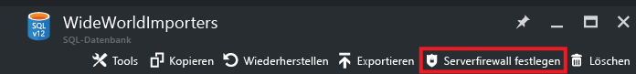

## Wie ändere ich die Dienstebene oder Leistungsstufe meiner SQL-Datenbank?

Zum Aktualisieren der Dienstebene oder Leistungsstufe einer SQL-Datenbank klicken Sie auf dem Blatt**SQL-Datenbank** auf **Tarif (DTUs skalieren)**. Details finden Sie unter [Ändern der Dienstebene und Leistungsstufe (Tarif) einer SQL-Datenbank](sql-database-scale-up.md).

## Wie konfiguriere ich die Überwachung und Bedrohungserkennung für eine SQL-Datenbank?

Zum Konfigurieren der Überwachung und Bedrohungserkennung für eine SQL-Datenbank klicken Sie auf dem Blatt **SQL-Datenbank** auf **Überwachung und Bedrohungserkennung**. Details finden Sie unter [Erste Schritte bei der Überwachung von SQL-Datenbank](sql-database-auditing-get-started.md) und [Erste Schritte mit der Bedrohungserkennung von SQL-Datenbank](sql-database-threat-detection-get-started.md).

## Wie konfiguriere ich die dynamische Datenmaskierung für eine SQL-Datenbank?

Zum Konfigurieren der dynamischen Datenmaskierung für eine SQL-Datenbank klicken Sie auf dem Blatt**SQL-Datenbank** auf **Dynamische Datenmaskierung**. Details finden Sie unter [Erste Schritte mit der dynamischen Datenmaskierung für SQL-Datenbanken](sql-database-dynamic-data-masking-get-started.md).

## Wie konfiguriere ich Transparent Data Encryption (TDE) für eine SQL­Datenbank?

Zum Konfigurieren der transparenten Datenverschlüsselung für eine SQL­Datenbank klicken Sie auf dem Blatt **SQL-Datenbank** auf **Transparent Data Encryption**. Details finden Sie unter [Aktivieren von TDE in einer Datenbank mithilfe des Portals](https://msdn.microsoft.com/library/dn948096#Anchor_1).

## Wie kann ich die maximale Größe einer SQL-Datenbank anzeigen oder ändern?

Zum Anzeigen oder Ändern der Größe einer SQL-Datenbank klicken Sie auf dem Blatt **SQL-Datenbank** auf **Datenbankgröße**. Aktualisieren Sie die maximale Größe einer Datenbank durch Ändern der Dienstebene oder Leistungsstufe. Details finden Sie unter [Ändern der Dienstebene und Leistungsstufe (Tarif) einer SQL-Datenbank](sql-database-scale-up.md).

## Wie kann ich die Leistung einer SQL-Datenbank überwachen und verbessern?

Zum Überwachen und Verbessern der Leistungsmerkmale einer SQL-Datenbank, klicken Sie auf dem Blatt **SQL-Datenbank** auf **Leistungsübersicht**. Details finden Sie unter [Einblicke in die SQL-Datenbankleistung](sql-database-performance.md).

## Wie konfiguriere ich die Georeplikation?

Zum Einrichten der Georeplikation für eine SQL-Datenbank klicken Sie auf dem Blatt **SQL-Datenbank** auf **Georeplikation**. Details finden Sie unter [Konfigurieren der Georeplikation für Azure SQL-Datenbank mit dem Azure-Portal](sql-database-geo-replication-portal.md).

## Wie führe ich ein Failover auf eine georeplizierte sekundäre Datenbank durch?

Für ein Failover auf eine georeplizierte sekundäre Datenbank klicken Sie auf dem Blatt **SQL-Datenbank** auf **Georeplikation** und dann auf **Failover**. Details finden Sie unter [Initiieren eines geplanten oder ungeplanten Failovers für die Azure SQL-Datenbank mit dem Azure-Portal](sql-database-geo-replication-failover-portal.md).

## Wie kopiere ich eine SQL-Datenbank?

Zum Kopieren einer SQL-Datenbank klicken Sie auf dem Blatt **SQL-Datenbank** auf **Kopieren**. Details finden Sie unter [Kopieren einer Azure SQL-Datenbank mithilfe des Azure-Portals](sql-database-copy-portal.md).

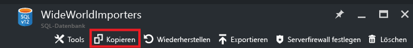

## Wie archiviere ich eine Azure SQL-Datenbank in eine BACPAC-Datei?

Zum Erstellen einer BACPAC-Datei einer SQL-Datenbank klicken Sie auf dem Blatt **SQL-Datenbank** auf **Exportieren**. Details finden Sie unter [Archivieren einer Azure SQL-Datenbank in eine BACPAC-Datei mithilfe des Azure-Portals](sql-database-export.md).

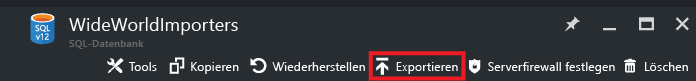

## Wie stelle ich einen früheren Zustand einer SQL-Datenbank wieder her?

Zum Wiederherstellen einer SQL-Datenbank klicken Sie auf dem Blatt **SQL-Datenbank** auf **Wiederherstellen**. Details finden Sie unter [Wiederherstellen des Zustands einer Azure SQL-Datenbank zu einem früheren Zeitpunkt über das Azure-Portal](sql-database-point-in-time-restore-portal.md).

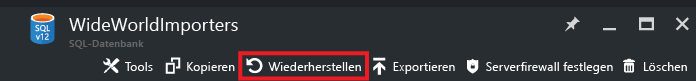

## Wie erstelle ich eine Azure SQL-Datenbank aus einer BACPAC-Datei?

Zum Erstellen einer SQL-Datenbank aus einer BACPAC-Datei klicken Sie auf dem Blatt **SQL-Server** auf **Datenbank importieren**. Details finden Sie unter [Importieren einer BACPAC-Datei zum Erstellen einer Azure SQL-Datenbank](sql-database-import.md).

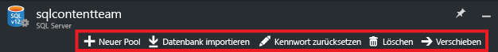

## Wie stelle ich eine gelöschte SQL-Datenbank wieder her?

Zum Wiederherstellen einer gelöschten SQL­Datenbank klicken Sie auf dem Blatt **SQL-Server** (SQL-Server, der die gelöschte Datenbank enthalten hat) auf **Gelöschte Datenbanken**. Details finden Sie unter [Wiederherstellen einer gelöschten Azure SQL-Datenbank im Azure-Portal](sql-database-restore-deleted-database-portal.md).

## Wie lösche ich eine SQL-Datenbank?

Zum Löschen einer SQL-Datenbank klicken Sie auf dem Blatt **SQL-Datenbank** auf **Löschen**.

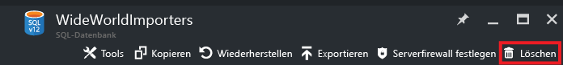

## Zusätzliche Ressourcen

- [SQL-Datenbank](sql-database-technical-overview.md)
- [Überwachen und Verwalten eines Pools für elastische Datenbanken über das Azure-Portal](sql-database-elastic-pool-manage-portal.md)

<!---HONumber=AcomDC_0921_2016-->