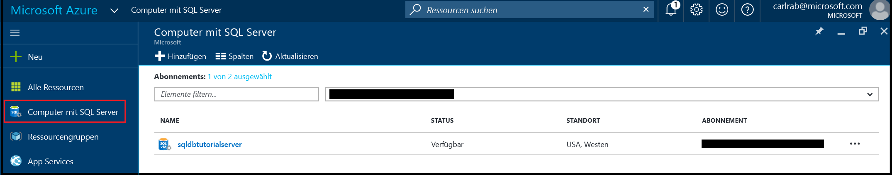

 
# Erstellen und Verwalten von Azure SQL-Datenbankservern mit dem Azure-Portal

Sie können einen Azure SQL-Datenbankserver mit dem [Azure-Portal](https://portal.azure.com/), mit PowerShell, der REST-API oder C# erstellen und verwalten. In diesem Thema wird die Verwendung des Azure-Portals erläutert. Informationen zur Verwendung von PowerShell finden Sie unter [Create and manage Azure SQL Database servers with PowerShell](sql-database-manage-servers-powershell.md) (Erstellen und Verwalten von Azure SQL-Datenbankservern mit PowerShell).

## Erstellen eines Azure SQL-Datenbankservers mithilfe des Azure-Portals

1. Öffnen Sie im [Azure-Portal](https://portal.azure.com/) das Blatt **SQL-Server**. 

    

2. Klicken Sie auf **hinzufügen**, um einen SQL-Server zu erstellen.

    

> [!TIP]
> Ein Einführungstutorial für das Azure-Portal und SQL Server Management Studio finden Sie unter [Erste Schritte mit Azure SQL-Datenbankservern, -Servern, -Datenbanken und -Firewallregeln mit dem Azure-Portal und SQL Server Management Studio](sql-database-get-started.md).
>

## Anzeigen und Aktualisieren der Einstellungen eines Azure SQL-Servers über das Azure-Portal
1. Öffnen Sie im [Azure-Portal](https://portal.azure.com/) das Blatt **SQL-Server**. 

    

2. Klicken Sie auf den gewünschten Server und anschließend auf dem Blatt des SQL-Servers auf die gewünschte Einstellung. 

    

> [!TIP]
> Ein Tutorial mit ersten Schritten, in dem ein Server mit dem Azure-Portal erstellt wird, finden Sie unter [SQL-Datenbank-Tutorial: Enthält Informationen zu den ersten Schritten mit Azure SQL-Datenbankservern, -Datenbanken und -Firewallregeln mit dem Azure-Portal und SQL Server Management Studio](sql-database-get-started.md).
>

## Nächste Schritte
* Eine Übersicht über Verwaltungstools finden Sie unter [Übersicht: Verwaltungstools für SQL-Datenbank](sql-database-manage-overview.md).
* Informationen zum Ausführen von Verwaltungsaufgaben mit dem Azure-Portal finden Sie unter [Verwalten von Azure SQL-Datenbanken über das Azure-Portal](sql-database-manage-portal.md).
* Informationen zum Ausführen von Verwaltungsaufgaben mithilfe von PowerShell finden Sie unter [Verwalten von Azure SQL-Datenbank mithilfe von PowerShell](sql-database-manage-powershell.md).
* Informationen zum Ausführen zusätzlicher Aufgaben mithilfe von SQL Server Management Studio finden Sie unter [Verwalten einer Azure SQL-Datenbank mit SQL Server Management Studio](sql-database-manage-azure-ssms.md).
* Informationen zum SQL-Datenbank-Dienst finden Sie unter [Was ist SQL Database? Einführung in SQL-Datenbank](sql-database-technical-overview.md). 
* Informationen zu Azure-Datenbankservern und Datenbankfeatures finden Sie unter [Funktionen von Azure SQL-Datenbank](sql-database-features.md).

<!--HONumber=Feb17_HO3-->

