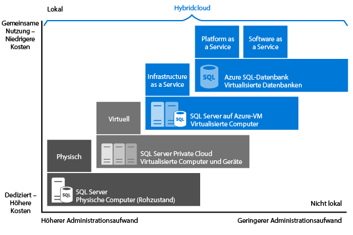

# Wählen Sie eine SQL Server-Cloudoption: Azure SQL-Datenbank (PaaS) oder SQL Server auf Azure-VMs (IaaS)
Azure bietet zwei Optionen zum Hosten von SQL Server-Workloads in Microsoft Azure:

* [Azure SQL-Datenbank](https://azure.microsoft.com/services/sql-database/): Eine vollkommen auf die Cloud abgestimmte SQL-Datenbank, auch als PaaS-Datenbank (Platform-as-a-Service) oder DBaaS (Database-as-a-Service) bezeichnet, die für die SaaS-App-Entwicklung (Software-as-a-Service) optimiert ist. Sie ist mit den meisten Features von SQL Server kompatibel. Weitere Informationen zu PaaS finden Sie unter [Was ist PaaS?](https://azure.microsoft.com/overview/what-is-paas/).
* [SQL Server auf Azure Virtual Machines](https://azure.microsoft.com/services/virtual-machines/sql-server/): SQL Server, installiert und in der Cloud gehostet auf in Azure ausgeführten virtuellen Windows Server-Computern (Windows Server-VMs), auch als Infrastructure-as-a-Service (IaaS) bezeichnet.
  SQL Server auf virtuellen Azure-Computern ist für die Migration vorhandener SQL Server-Anwendungen optimiert. Alle Versionen und Editionen von SQL Server stehen zur Verfügung. Die Option ist vollständig mit SQL Server kompatibel, sodass Sie beliebig viele Datenbanken hosten und datenbankübergreifende Transaktionen ausführen können. Und sie bietet uneingeschränkte Kontrolle über SQL Server und Windows.

Erfahren Sie, welchen Platz diese beiden Optionen in der Microsoft-Datenplattform einnehmen und für welche geschäftlichen Anforderungen sie sich am besten eignen. Ob bei Ihnen Kosteneinsparungen oder minimaler Verwaltungsaufwand Priorität haben – dieser Artikel kann Ihnen dabei helfen, zu entscheiden, welcher Ansatz der richtige ist, um Ihre wichtigsten geschäftlichen Anforderungen zu erfüllen.

## Microsoft-Datenplattform
Eines der ersten Dinge, die in jeder Diskussion von Azure im Vergleich zu lokalen SQL Server-Datenbanken verstanden werden müssen, ist, dass Sie alles verwenden können. Die Microsoft-Datenplattform nutzt SQL Server-Technologie und stellt sie auf unterschiedlichen lokalen physischen Computern, in privaten Cloudumgebungen, in von Drittanbietern gehosteten privaten Cloudumgebungen und in öffentlichen Clouds zur Verfügung. Mit SQL Server auf virtuellen Azure-Computern können Sie dank einer Kombination aus lokalen und cloudbasierten Bereitstellungen verschiedene individuelle Geschäftsanforderungen erfüllen und dabei umgebungsübergreifend auf die gleichen Serverprodukte, Entwicklungstools und Kenntnisse zurückgreifen.

   

Wie Sie im Diagramm sehen können, kann jedes dieser Angebote durch die Administrationsebene in Bezug auf die Infrastruktur (auf der x-Achse) und den Grad der erreichten Kosteneffizienz durch Datenbankkonsolidierung und Automatisierung (auf der y-Achse) beschrieben werden.

Beim Entwurf einer Anwendung stehen vier grundlegende Optionen für das Hosten des SQL Server-Teils der Anwendung zur Verfügung:

* SQL Server auf nicht virtualisierten physischen Computern
* SQL Server auf lokalen virtualisierten Computern (private Cloud)
* SQL Server in Azure Virtual Machine (öffentliche Cloud von Microsoft)
* Azure SQL-Datenbank (öffentliche Cloud von Microsoft)

In den folgenden Abschnitten erfahren Sie mehr über SQL Server in der öffentlichen Cloud von Microsoft: Azure SQL-Datenbank und SQL Server auf virtuellen Azure-Computern. Darüber hinaus finden Sie hier Informationen zu allgemeinen betriebswirtschaftlichen Faktoren, die bestimmen, welche Option für Ihre Anwendung am besten geeignet ist.

## Genauere Betrachtung von Azure SQL-Datenbank und SQL Server auf Azure Virtual Machines
**Azure SQL-Datenbank** ist eine relationale DBaaS-Datenbank (Database-as-a-Service), die in der Azure-Cloud gehostet wird und die in die Branchenkategorien *Software-as-a-Service (SaaS)* und *Platform-as-a-Service (PaaS)* fällt. [SQL-Datenbank](sql-database-technical-overview.md) basiert auf standardisierter Hardware und Software, die Microsoft gehört und von Microsoft gehostet und verwaltet wird. Mit SQL-Datenbank können Sie direkt im Dienst mithilfe der integrierten Features und Funktionen entwickeln. Wenn Sie mit SQL-Datenbank arbeiten, bezahlen Sie für das, was Sie nutzen, und haben die Möglichkeit, horizontal oder zentral hochzuskalieren oder ohne Unterbrechung mehr Leistung hinzuzufügen.

**SQL Server auf Azure Virtual Machines (VMs)** fällt in die Branchenkategorie *Infrastructure-as-a-Service (IaaS)* und ermöglicht es Ihnen, SQL Server auf einem virtuellen Computer in der Cloud auszuführen. Ähnlich wie SQL-Datenbank basiert dieses Angebot auf standardisierter Hardware und Software, die Microsoft gehört und von Microsoft gehostet und verwaltet wird. Bei Verwendung von SQL Server auf einem virtuellen Computer können Sie entweder ein nutzungsbasiertes Zahlungsmodell für eine bereits in einem SQL Server-Image enthaltene SQL Server-Lizenz oder einfach eine vorhandene Lizenz verwenden. Der virtuelle Computer kann zudem problemlos nach Bedarf skaliert und angehalten/fortgesetzt werden.

Im Allgemeinen sind diese beiden SQL-Optionen für unterschiedliche Zwecke optimiert:

* **SQL-Datenbank** wurde zur Minimierung der Gesamtkosten für die Bereitstellung und Verwaltung vieler Datenbanken optimiert. Die laufenden Administrationskosten werden reduziert, weil Sie keine virtuellen Computer, Betriebssysteme oder Datenbanksoftware verwalten müssen. Sie müssen sich nicht um Upgrades, hohe Verfügbarkeit oder [Sicherungen](sql-database-automated-backups.md)kümmern. Im Allgemeinen lässt sich mit Azure SQL-Datenbank sich die Anzahl der Datenbanken, die von einer einzelnen IT- oder Entwicklungsressource verwaltet werden können, drastisch steigern.
* **SQL Server auf virtuellen Azure-Computern** ist für die Migration vorhandener Anwendungen zu Azure bzw. für die Erweiterung vorhandener lokaler Anwendungen auf die Cloud (in Hybridbereitstellungen) optimiert. Darüber hinaus können Sie SQL Server auf einem virtuellen Computer zum Entwickeln und Testen herkömmlicher SQL Server-Anwendungen verwenden. Mit SQL Server auf Azure Virtual Machines verfügen Sie über eine dedizierte Instanz von SQL Server und einen cloudbasierten virtuellen Computer (VM, Virtual Machine) mit vollständigen Administratorrechten. Dies ist die perfekte Lösung, wenn ein Unternehmen bereits IT-Ressourcen verfügbar hat, um die virtuellen Computer zu verwalten. Mithilfe dieser Funktionen können Sie ein maßgeschneidertes System einrichten, das die spezifischen Leistungs- und Verfügbarkeitsanforderungen Ihrer Anwendung erfüllt.

In der folgenden Tabelle sind die wesentlichen Merkmale von SQL-Datenbank und SQL Server auf Azure Virtual Machines zusammengefasst:

| **Am besten geeignet für:** | **Azure SQL-Datenbank** | **SQL Server auf einem virtuellen Azure-Computer** |
| --- | --- | --- |
|  |Neue Cloud-entwickelte Anwendungen, die zeitlichen Einschränkungen bei Entwicklung und Marketing unterliegen. |Vorhandene Anwendungen, die schnelle Migration zur Cloud mit minimalen Änderungen erfordern. Schnelle Entwicklungs- und Testszenarien, wenn Sie keine lokale SQL Server-Hardware für andere Zwecke als für den Produktivbetrieb erwerben möchten. |
|  | Teams, die integrierte hohe Verfügbarkeit, Notfallwiederherstellung und Upgrades für die Datenbank benötigen. |Teams, die hohe Verfügbarkeit, Notfallwiederherstellung und Patches für SQL Server konfigurieren und verwalten können. Dies wird durch einige bereitgestellte Automatisierungsfeatures erheblich vereinfacht. | |
|  | Teams, die das zugrunde liegende Betriebssystem und Konfigurationseinstellungen nicht selbst verwalten möchten. |Szenarien, in denen Sie eine angepasste Umgebung mit uneingeschränkten Administratorrechten benötigen. | |
|  | Datenbanken mit einer Größe von bis zu 1 TB oder größere Datenbanken, die mittels horizontaler Hochskalierung [horizontal oder vertikal partitioniert](sql-database-elastic-scale-introduction.md#horizontal-and-vertical-scaling) werden können. |SQL Server-Instanzen mit bis zu 64 TB Speicherplatz. Die Instanz unterstützt beliebig viele Datenbanken. | |
|  | [Erstellung von SaaS-Anwendungen (Software-as-a-Service)](sql-database-design-patterns-multi-tenancy-saas-applications.md). |Migration und Erstellung von Unternehmens- und Hybridanwendungen. | |
|  | | |
| **Ressourcen:** |Sie möchten keine IT-Ressourcen für die Konfiguration und Verwaltung der zugrunde liegenden Infrastruktur beschäftigen, sondern sich auf die Anwendungsebene konzentrieren. |Sie verfügen über einige IT-Ressourcen für die Konfiguration und Verwaltung. Dies wird durch einige bereitgestellte Automatisierungsfeatures erheblich vereinfacht. |
| **Gesamtbetriebskosten:** |Beseitigt Hardwarekosten und reduziert die Verwaltungskosten. |Eliminiert Hardwarekosten. |
| **Geschäftskontinuität:** |Zusätzlich zu den integrierten Fehlertoleranz-Infrastrukturfunktionen stellt Azure SQL-Datenbank zur Steigerung der Geschäftskontinuität Features wie [automatische Sicherungen](sql-database-automated-backups.md), [Zeitpunktwiederherstellung](sql-database-recovery-using-backups.md#point-in-time-restore), [geografische Wiederherstellung](sql-database-recovery-using-backups.md#geo-restore) und [aktive Georeplikation](sql-database-geo-replication-overview.md) bereit. Weitere Informationen finden Sie unter [Übersicht über die Geschäftskontinuität in SQL-Datenbank](sql-database-business-continuity.md). |Mit SQL Server auf virtuellen Azure-Computern können Sie eine Hochverfügbarkeits- und Notfallwiederherstellungslösung für die spezifischen Anforderungen Ihrer Datenbank einrichten. Aus diesem Grund haben Sie ein System, das genau für Ihre Anwendung optimiert ist. Sie können bei Bedarf Failovers selbst testen und ausführen. Weitere Informationen finden Sie unter [Hochverfügbarkeit und Notfallwiederherstellung für SQL Server auf virtuellen Azure-Computern](../virtual-machines/windows/sql/virtual-machines-windows-sql-high-availability-dr.md). |
| **Hybrid Cloud:** |Die lokale Anwendung kann auf Daten in der Azure SQL-Datenbank zugreifen. |Mit SQL Server auf Azure Virtual Machines können Sie Anwendungen betreiben, die teilweise in der Cloud und teilweise lokal ausgeführt werden. Beispielsweise können Sie Ihr lokales Netzwerk und Ihre Active Directory-Domäne mit [Azure Virtual Network](../virtual-network/virtual-networks-overview.md)in die Cloud ausdehnen. Darüber hinaus können Sie lokale Datendateien in Azure Storage mit [SQL Server-Datendateien in Azure](http://msdn.microsoft.com/library/dn385720.aspx)speichern. Weitere Informationen finden Sie unter [Einführung in SQL Server 2014 Hybrid Cloud](http://msdn.microsoft.com/library/dn606154.aspx). |
|  | Unterstützt die [SQL Server-Transaktionsreplikation](https://msdn.microsoft.com/library/mt589530.aspx) als Abonnent für die Datenreplikation. |Unterstützt uneingeschränkt [SQL Server-Transaktionsreplikation](https://msdn.microsoft.com/library/mt589530.aspx), [AlwaysOn-Verfügbarkeitsgruppen](../virtual-machines/windows/sql/virtual-machines-windows-sql-high-availability-dr.md), Integrationsdienste und Protokollversand für die Datenreplikation. Auch herkömmliche SQL Server-Sicherungen werden uneingeschränkt unterstützt. | |
|  | | |

## Entscheidungskriterien für die Wahl zwischen Azure SQL-Datenbank und SQL Server auf Azure Virtual Machines
### Kosten
Ob Sie ein Startup-Unternehmen mit wenig liquiden Mitteln oder ein Team in einem etablierten Unternehmen sind, das unter engen Budgetbeschränkungen arbeitet: häufig sind begrenzte Mittel die primäre Motivation bei der Entscheidung, wie Sie Ihre Datenbanken hosten. Dieser Abschnitt enthält grundlegende Informationen zur Abrechnung und Lizenzierung in Azure in Verbindung mit den folgenden Optionen für relationale Datenbanken: SQL-Datenbank und SQL Server auf virtuellen Azure-Computern. Außerdem erfahren Sie hier, wie Sie die Gesamtkosten der Anwendung berechnen.

#### Abrechnungs- und Lizenzierungsgrundlagen
**SQL-Datenbank** wird Kunden nicht mit einer Lizenz, sondern als Dienst verkauft.  [SQL Server auf virtuellen Azure-Computern](../virtual-machines/windows/sql/virtual-machines-windows-sql-server-iaas-overview.md) wird mit einer minutengenau abgerechneten Lizenz verkauft. Sie können aber auch eine ggf. bereits vorhandene Lizenz verwenden.  

Derzeit stehen für **SQL-Datenbank** verschiedene Tarife zur Verfügung, bei denen ein fester Stundensatz je nach ausgewähltem Tarif und ausgewählter Leistungsstufe abgerechnet wird. Außerdem wird Ihnen der ausgehende Internetdatenverkehr basierend auf den üblichen [Datenübertragungsraten](https://azure.microsoft.com/pricing/details/data-transfers/)berechnet. Die Tarife Basic, Standard und Premium liefern vorhersagbare Leistung mit mehreren Leistungsstufen entsprechend den Spitzenanforderungen der Anwendung. Sie können zwischen Tarifen und Leistungsstufen entsprechend den unterschiedlichen Durchsatzanforderungen Ihrer Anwendung wechseln. Wenn Ihre Datenbank ein hohes Transaktionsvolumen aufweist und viele gleichzeitige Benutzer unterstützen muss, empfehlen wir, den Tarif „Premium“ zu verwenden. Die neuesten Informationen zu den derzeit unterstützten Tarifen finden Sie unter [Tarife für Azure SQL-Datenbank](sql-database-service-tiers.md). Sie können auch [elastische Pools](sql-database-elastic-pool.md) erstellen, um Leistungsressourcen zwischen Datenbankinstanzen freizugeben.

Bei **SQL-Datenbank** wird die Datenbanksoftware automatisch von Microsoft konfiguriert, gepatcht und aktualisiert. Dadurch sinken Ihre Verwaltungskosten. Darüber hinaus helfen Ihnen die [integrierten Datensicherungsfunktionen](sql-database-automated-backups.md) dabei, erhebliche Kosteneinsparungen zu erzielen, vor allem bei einer großen Anzahl von Datenbanken.

Mit **SQL Server auf virtuellen Azure-Computern** können Sie entweder eines der über die Plattform bereitgestellten SQL Server-Images (mit enthaltener Lizenz) oder aber Ihre eigene SQL Server-Lizenz verwenden. Alle unterstützten SQL Server-Versionen (2008R2, 2012, 2014, 2016) und Editionen (Developer, Express, Web, Standard, Enterprise) stehen zur Verfügung. Darüber hinaus sind BYOL-Versionen (Bring Your Own License) der Images verfügbar. Bei Verwendung der von Azure bereitgestellten Images hängen die Betriebskosten von der Größe des virtuellen Computers und von der gewählten SQL Server-Edition ab. Unabhängig von der Größe des virtuellen Computers und der SQL Server-Edition bezahlen Sie einen minutenbezogenen Lizenzpreis für SQL Server und Windows Server. Hinzu kommt noch der Azure Storage-Preis für die VM-Datenträger. Mit der minutenbezogenen Abrechnungsoption können Sie SQL Server solange wie nötig verwenden, ohne zusätzliche SQL Server-Lizenzen zu erwerben. Wenn Sie eine eigene SQL Server-Lizenz in Azure einbringen, werden Ihnen nur Windows Server- und Speicherkosten in Rechnung gestellt. Weitere Informationen über das Einbringen eigener Lizenzen finden Sie unter [Lizenzmobilität durch Software Assurance für Azure](https://azure.microsoft.com/pricing/license-mobility/).

#### Berechnen der gesamten Anwendungskosten
Wenn Sie erstmals eine Cloud-Plattform verwenden, enthalten die Kosten der Anwendungsausführung die Kosten für Entwicklung und Verwaltung sowie die Dienstkosten für die öffentliche Cloud-Plattform.

Hier ist eine ausführliche Kostenberechnung für die Ausführung Ihrer Anwendung in SQL-Datenbank und SQL Server auf Azure Virtual Machines:

**Bei Verwendung von Azure SQL-Datenbank:**

*Gesamtkosten der Anwendung = stark minimierte Verwaltungskosten + Softwareentwicklungskosten + Servicekosten für SQL-Datenbank*

**Bei Verwendung von SQL Server auf Azure Virtual Machines:**

*Gesamtkosten der Anwendung = stark minimierte Kosten für Softwareentwicklung + Verwaltungskosten + SQL Server- und Windows Server-Lizenzkosten + Kosten für Azure Storage*

Weitere Informationen zur Preisberechnung finden Sie in den folgenden Ressourcen:

* [SQL-Datenbank – Preisübersicht](https://azure.microsoft.com/pricing/details/sql-database/)
* [Virtual Machines – Preisübersicht](https://azure.microsoft.com/pricing/details/virtual-machines/) für [SQL](https://azure.microsoft.com/pricing/details/virtual-machines/#sql) und für [Windows](https://azure.microsoft.com/pricing/details/virtual-machines/#windows)
* [Azure-Preisrechner](https://azure.microsoft.com/pricing/calculator/)

> [!NOTE]
> Es gibt eine kleine Teilmenge von Features in SQL Server, die bei SQL-Datenbank nicht nutzbar oder nicht verfügbar ist. Weitere Informationen finden Sie unter [Azure SQL-Datenbank – Features](sql-database-features.md) und in den Informationen [Informationen zu SQL-Datenbank Transact-SQL](sql-database-transact-sql-information.md). Wenn Sie eine vorhandene SQL Server-Lösung in die Cloud überführen, beachten Sie die Hinweise unter [Migrieren einer SQL Server-Datenbank zu Azure SQL-Datenbank](sql-database-cloud-migrate.md). Falls Sie eine vorhandene lokale SQL Server-Anwendung zu SQL-Datenbank migrieren, lohnt es sich unter Umständen, die Anwendung so zu aktualisieren, dass Sie von unseren Clouddiensten profitieren können. Ziehen z.B. in Betracht, den [Azure Web-Apps-Dienst](https://azure.microsoft.com/services/app-service/web/) oder [Azure Cloud Services](https://azure.microsoft.com/services/cloud-services/) zum Hosten Ihrer Anwendungsschicht zu nutzen, um die Kostenvorteile zu vergrößern.
> 
> 

### Verwaltung
Bei vielen Unternehmen wird die Entscheidung zum Wechsel auf einen Clouddienst genauso stark vom Bestreben um eine Vereinfachung der Verwaltung wie von den erhofften Kostenvorteilen getrieben. Bei **SQL-Datenbank** verwaltet Microsoft die zugrunde liegende Hardware. Microsoft repliziert automatisch alle Daten zur Gewährleistung einer hohen Verfügbarkeit, konfiguriert und aktualisiert die Datenbanksoftware, verwaltet den Lastenausgleich und führt bei einem Serverausfall ein transparentes Failover durch. Sie können sich weiterhin um die Verwaltung Ihrer Datenbank kümmern, müssen aber das Datenbankmodul, das Serverbetriebssystem und die Hardware nicht mehr verwalten.  Weiterhin verwalten können Sie z. B. die Datenbanken und Anmeldungen, die Index- und Abfrageoptimierung, die Überwachung und die Sicherheit.

Bei **SQL Server auf virtuellen Azure-Computern**haben Sie die uneingeschränkte Kontrolle über das Betriebssystem und die Konfiguration der SQL Server-Instanzen. Bei einem virtuellen Computer können Sie entscheiden, wann das Betriebssystem und die Datenbanksoftware aktualisiert und wann zusätzliche Programme wie etwa Antivirentools installiert werden sollen. Durch einige bereitgestellte Automatisierungsfeatures lassen sich Patching, Sicherungen und hohe Verfügbarkeit erheblich vereinfachen. Darüber hinaus können Sie die Größe des virtuellen Computers, die Anzahl der Laufwerke und deren Speicherkonfigurationen steuern. Mit Azure lässt sich die Größe eines virtuellen Computers nach Bedarf anpassen. Weitere Informationen finden Sie unter [Größen von virtuellen Computern und Clouddiensten für Azure](../virtual-machines/virtual-machines-windows-sizes.md). 

### Vereinbarung zum Servicelevel (SLA)
Für viele IT-Abteilungen hat die Einhaltung vereinbarter Betriebszeiten und Servicelevels höchste Priorität. In diesem Abschnitt wird erläutert, welche Vereinbarung zum Servicelevel (SLA) für die jeweilige Datenbank-Hostingoption gilt.

Für **SQL-Datenbank** bietet Microsoft für die Tarife Basic, Standard und Premium eine Verfügbarkeits-SLA von 99,99 %. Aktuelle Informationen finden Sie unter [Vereinbarung zum Servicelevel](https://azure.microsoft.com/support/legal/sla/sql-database/). Aktuelle Informationen zu den Tarifen für SQL-Datenbank und zu den unterstützten Geschäftskontinuitätsplänen finden Sie unter [Tarife](sql-database-service-tiers.md).

Für **SQL Server auf Azure Virtual Machines** bietet Microsoft eine Verfügbarkeits-SLA von 99,95%, die nur den virtuellen Computer abdeckt. Diese SLA deckt nicht die Prozesse ab, die auf dem virtuellen Computer ausgeführt werden (z. B. SQL Server). Außerdem erfordert sie, dass mindestens zwei VM-Instanzen in einer Verfügbarkeitsgruppe gehostet werden. Aktuelle Informationen finden Sie unter [SLA für Virtual Machines](https://azure.microsoft.com/support/legal/sla/virtual-machines/). Für eine besonders hohe Datenbankverfügbarkeit auf den virtuellen Computern sollten Sie eine der unterstützten Hochverfügbarkeitsoptionen in SQL Server konfigurieren, wie z.B. [AlwaysOn-Verfügbarkeitsgruppen](http://blogs.technet.com/b/dataplatforminsider/archive/2014/08/25/sql-server-alwayson-offering-in-microsoft-azure-portal-gallery.aspx). Durch die Verwendung einer Hochverfügbarkeitsoption erhalten Sie zwar keine zusätzliche SLA, können aber eine Datenbankverfügbarkeit von >99,99 Prozent erreichen.

### Zeit bis zur Marktreife
**SQL-Datenbank** ist die richtige Lösung für Anwendungen für die Cloud, wenn Entwicklerproduktivität und eine schnelle Markteinführung entscheidend sind. Durch programmgesteuerte DBA-ähnliche Funktionen ist sie perfekt für Cloud-Architekten und Entwickler, da sie den Verwaltungsaufwand für das zugrunde liegende Betriebssystem und die Datenbank verringert. Sie können z.B. die [REST-API](http://msdn.microsoft.com/library/azure/dn505719.aspx) und [PowerShell-Cmdlets](http://msdn.microsoft.com/library/mt740629.aspx) verwenden, um administrative Vorgänge für Tausende von Datenbanken zu automatisieren und zu verwalten. Dank Features wie [elastischen Pools](sql-database-elastic-pool.md) können Sie sich ganz auf die Anwendungsschicht konzentrieren und Ihre Lösung schneller auf den Markt bringen.

**SQL Server auf virtuellen Azure-Computern** eignet sich hervorragend, wenn Ihre bereits vorhandenen oder neuen Anwendungen große Datenbanken, zusammenhängende Datenbanken oder Zugriff auf sämtliche Features in SQL Server oder Windows benötigen. Diese Option ist auch eine gute Wahl, wenn Sie vorhandene lokale Anwendungen und Datenbanken unverändert zu Azure migrieren möchten. Da Sie keine Änderungen an der Präsentations-, Anwendungs- und Datenschicht vornehmen müssen, sparen Sie sich die Zeit und das Geld, die sonst für den Neuentwurf der vorhandenen Lösung nötig wären. Sie können in diesem Fall alle Lösungen sofort zu Azure migrieren und müssen lediglich einige Leistungsoptimierungen durchführen, die möglicherweise von der Azure-Plattform verlangt werden. Weitere Informationen finden Sie unter [Optimale Verfahren für die Leistung für SQL Server auf virtuellen Computern in Azure](../virtual-machines/windows/sql/virtual-machines-windows-sql-performance.md).

## Zusammenfassung
In diesem Artikel wurden SQL-Datenbank und SQL Server auf Azure Virtual Machines vorgestellt und einige geschäftliche Kriterien diskutiert, die Ihre Entscheidung für eine der beiden Optionen beeinflussen können. Nachfolgend finden Sie eine Zusammenfassung der dieser Kriterien:

Entscheiden Sie sich für **Azure SQL-Datenbank** , wenn für Sie Folgendes zutrifft:

* Sie erstellen neue cloudbasierte Anwendungen, um von den Kostenvorteilen und Leistungsoptimierungen eines Clouddiensts zu profitieren. Die Vorteile bei diesem Ansatz: Sie nutzen einen vollständig verwalteten Clouddienst, können die Zeit bis zur Marktreife verkürzen und langfristig Kosten sparen.
* Sie möchten, dass Microsoft allgemeine Verwaltungsvorgänge für Ihre Datenbanken ausführt, und Sie benötigen striktere Verfügbarkeits-SLAs für Datenbanken.

Entscheiden Sie sich für **SQL Server auf Azure Virtual Machines** , wenn für Sie Folgendes zutrifft:

* Sie verfügen über bereits vorhandene lokale Anwendungen, die Sie migrieren oder auf die Cloud erweitern möchten, oder Sie möchten Unternehmensanwendungen mit einer Größe von über 1 TB erstellen. Die Vorteile bei diesem Ansatz: vollständige SQL-Kompatibilität, hohe Datenbankkapazität, uneingeschränkte Kontrolle über SQL Server und Windows sowie sicherer Tunnel zur lokalen Instanz. Dieser Ansatz minimiert die Entwicklungs- und Änderungskosten für vorhandene Anwendungen.
* Sie verfügen bereits über IT-Ressourcen und können sich letztendlich selbst um Patching, Sicherungen und hohe Datenbankverfügbarkeit kümmern. Beachten Sie, dass diese Aspekte durch einige automatisierte Features erheblich vereinfacht werden. 

## Nächste Schritte
* Informationen zu den ersten Schritten für SQL-Datenbank finden Sie unter [Erstellen einer ersten Azure SQL-Datenbank](sql-database-get-started.md).
* Informationen finden Sie unter [Preise für SQL-Datenbank](https://azure.microsoft.com/pricing/details/sql-database/).
* Informationen zu den ersten Schritten mit SQL Server auf virtuellen Azure-Computern finden Sie unter [Bereitstellen eines virtuellen Computers mit SQL Server in Azure](../virtual-machines/windows/sql/virtual-machines-windows-portal-sql-server-provision.md) .

