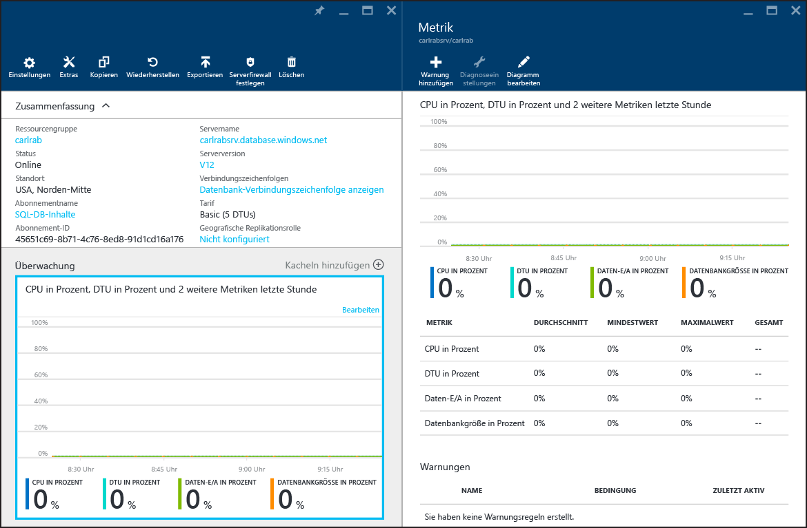

# Überwachen der Datenbankleistung mithilfe von Azure SQL-Datenbank
Die Überwachung der Leistung einer SQL-Datenbank in Azure beginnt mit der Überwachung der Ressourcennutzung relativ zur gewählten Datenbankleistung. Dank der Überwachung können Sie ermitteln, ob Ihre Datenbank über Zusatzkapazität verfügt, oder ob Probleme infolge ausgeschöpfter Kapazität auftreten. Anschließend können Sie entscheiden, ob die Leistungsstufe und [Dienstebene](sql-database-service-tiers.md) Ihrer Datenbank angepasst werden müssen. Sie können die Datenbank mithilfe grafischer Tools im [Azure-Portal](https://portal.azure.com) oder mithilfe [dynamischer Verwaltungssichten](https://msdn.microsoft.com/library/ms188754.aspx) in SQL überwachen.

## Überwachen von Datenbanken über das Azure-Portal
Im [Azure-Portal](https://portal.azure.com/)können Sie die Nutzung einer Einzeldatenbank überwachen, indem Sie die Datenbank auswählen und auf das Diagramm **Überwachung** klicken. Dadurch wird das Fenster **Metrik** geöffnet, in dem Sie durch Klicken auf die Schaltfläche **Diagramm bearbeiten** Änderungen vornehmen können. Fügen Sie die folgenden Metriken hinzu:

* CPU-Prozentsatz
* DTU-Prozentsatz
* E/A-Prozentsatz für Daten
* Datenbankgröße als Prozentsatz

Nachdem Sie diese Metriken hinzugefügt haben, können Sie sie im Diagramm **Überwachung** mit weiteren Details im Fenster **Metrik** anzeigen. Alle vier Metriken geben die durchschnittliche prozentuale Nutzung relativ zur **DTU** der Datenbank an. Ausführliche Informationen zu DTUs finden Sie im Artikel [Dienstebenen](sql-database-service-tiers.md) .

Sie können zudem Benachrichtigungen für die Leistungsmetriken konfigurieren. Klicken Sie im Fenster **Metrik** auf die Schaltfläche **Warnung hinzufügen**. Befolgen Sie die Anweisungen des Assistenten, um die Benachrichtigung zu konfigurieren. Sie haben die Möglichkeit, Benachrichtigungen für den Fall zu konfigurieren, dass Metriken einen Schwellenwert überschreiten oder unterschreiten.

Wenn Sie beispielsweise einen Anstieg der Workload Ihrer Datenbank erwarten, können Sie eine E-Mail-Benachrichtigung konfigurieren, die immer dann gesendet wird, wenn eine der Leistungsmetriken der Datenbank 80 % erreicht. Sie können dies als Frühwarnung verwenden, um zu ermitteln, wann Sie eventuell zur nächsthöheren Leistungsstufe wechseln müssen.

Anhand der Leistungsmetriken können Sie auch ermitteln, ob Sie möglicherweise eine Herabstufung auf eine niedrigere Leistungsstufe vornehmen können. Angenommen, Sie verwenden eine Datenbank der Dienstebene "Standard S2", und alle Leistungsmetriken zeigen, dass die Datenbank zu jedem Zeitpunkt durchschnittlich nicht mehr als 10 % nutzt. Hier ist es wahrscheinlich, dass sich die Datenbank auch mit der Dienstebene "Standard S1" verwenden lässt. Bevor Sie sich für einen Wechsel zu einer niedrigeren Leistungsstufe entscheiden, müssen Sie aber auch Workloads berücksichtigen, die Spitzen oder Schwankungen aufweisen können.

## Überwachen von Datenbanken mithilfe von DMVs
Dieselben Metriken, die im Portal bereitgestellt werden, sind auch über Systemsichten verfügbar: [sys.resource_stats](https://msdn.microsoft.com/library/dn269979.aspx) in der logischen **master**-Datenbank Ihres Servers und [sys.dm_db_resource_stats](https://msdn.microsoft.com/library/dn800981.aspx) in der Benutzerdatenbank. Verwenden Sie **sys.resource_stats**, wenn Sie weniger differenzierte Daten über einen längeren Zeitraum überwachen möchten. Verwenden Sie **sys.dm_db_resource_stats**, wenn Sie differenzierte Daten in einem kürzeren Zeitraum überwachen möchten. Weitere Informationen finden Sie unter [Leitfaden zur Leistung für Azure SQL-Datenbanken](sql-database-single-database-monitor.md#monitor-resource-use).

> [!NOTE]
> **sys.dm_db_resource_stats** gibt bei Verwendung der eingestellten Web- und Business Edition-Datenbanken ein leeres Resultset zurück.
>
>

### Überwachen der Ressourcennutzung

Sie können die Ressourcennutzung mithilfe von [Query Performance Insight für SQL-Datenbank](sql-database-query-performance.md) und [Abfragespeicher](https://msdn.microsoft.com/library/dn817826.aspx) überwachen.

Außerdem lässt sich die Nutzung über diese beiden Ansichten überwachen:

* [sys.dm_db_resource_stats](https://msdn.microsoft.com/library/dn800981.aspx)
* [sys.resource_stats](https://msdn.microsoft.com/library/dn269979.aspx)

#### sys.dm_db_resource_stats
Sie können die Sicht [sys.dm_db_resource_stats](https://msdn.microsoft.com/library/dn800981.aspx) in jeder SQL-Datenbank verwenden. Die Sicht **sys.dm_db_resource_stats** enthält Daten zur Ressourcennutzung in der letzten Zeit relativ zur Dienstebene. Durchschnittliche Prozentsätze für CPU, Dateneingang/-ausgang, Protokollschreibvorgänge und Arbeitsspeicher werden alle 15 Sekunden aufgezeichnet und eine Stunde lang aufbewahrt.

Da diese Ansicht eine detailliertere Darstellung der Ressourcennutzung ist, sollten Sie für alle Analysen des aktuellen Zustands oder für die Problembehandlung zuerst **sys.dm_db_resource_stats** verwenden. Mit dieser Abfrage wird beispielsweise die durchschnittliche und maximale Ressourcennutzung für die aktuelle Datenbank in der letzten Stunde angezeigt:

    SELECT  
        AVG(avg_cpu_percent) AS 'Average CPU use in percent',
        MAX(avg_cpu_percent) AS 'Maximum CPU use in percent',
        AVG(avg_data_io_percent) AS 'Average data I/O in percent',
        MAX(avg_data_io_percent) AS 'Maximum data I/O in percent',
        AVG(avg_log_write_percent) AS 'Average log write use in percent',
        MAX(avg_log_write_percent) AS 'Maximum log write use in percent',
        AVG(avg_memory_usage_percent) AS 'Average memory use in percent',
        MAX(avg_memory_usage_percent) AS 'Maximum memory use in percent'
    FROM sys.dm_db_resource_stats;  

Beispiele für andere Abfragen finden Sie unter [sys.dm_db_resource_stats](https://msdn.microsoft.com/library/dn800981.aspx).

#### sys.resource_stats
Die Sicht [sys.resource_stats](https://msdn.microsoft.com/library/dn269979.aspx) in der **master**-Datenbank enthält zusätzliche Informationen, die zur Überwachung der Leistung Ihrer SQL-Datenbank innerhalb der jeweiligen Dienst- und Leistungsebene hilfreich sind. Die Daten werden alle fünf Minuten gesammelt und ca. 35 Tage lang aufbewahrt. Diese Sicht ist für eine längere Verlaufsanalyse der Ressourcennutzung Ihrer SQL-Datenbank hilfreich.

Der folgende Graph zeigt die CPU-Ressourcennutzung für eine Premium-Datenbank mit der Leistungsebene P2 für jede Stunde einer Woche. Dieser Graph beginnt mit einem Montag und zeigt fünf Arbeitstage und dann das Wochenende, an dem die Anwendung deutlich weniger gefragt ist.

Die Daten verdeutlichen, dass diese Datenbank derzeit über eine CPU-Spitzenlast von etwas mehr als 50 Prozent CPU-Auslastung relativ zur Leistungsebene P2 verfügt (Dienstagmittag). Falls die CPU der entscheidende Faktor im Ressourcenprofil der Anwendung ist, entscheiden Sie sich ggf. für die Leistungsebene P2, um die Bewältigung der Workload stets sicherstellen zu können. Wenn eine Anwendung im Laufe der Zeit voraussichtlich größer wird, ist die Verwendung eines zusätzlichen Ressourcenpuffers ratsam, damit für die Anwendung nie der Grenzwert für die Leistungsebene erreicht wird. Wenn Sie die Leistungsebene erhöhen, können Sie für den Kunden sichtbare Fehler vermeiden. Diese können ggf. auftreten, wenn eine Datenbank nicht über genügend Leistung zum effektiven Verarbeiten von Anforderungen verfügt, vor allem in latenzanfälligen Umgebungen. Ein Beispiel ist eine Datenbank für eine Anwendung, mit der Webseiten basierend auf den Ergebnissen von Datenbankaufrufen farbig gestaltet werden.

Andere Anwendungstypen können denselben Graphen unter Umständen anders interpretieren. Wenn eine Anwendung beispielsweise jeden Tag versucht, Gehaltsabrechnungsdaten zu verarbeiten, und dasselbe Diagramm gilt, wird diese Art von „Batchauftrag“-Modell bei Leistungsebene P1 ggf. zufriedenstellend ausgeführt. Die Leistungsebene P1 verfügt über 100 DTUs, während Leistungsebene P2 über 200 DTUs verfügt. Die Leistungsebene P1 bietet also die Hälfte der Leistung von Leistungsebene P2. Eine Nutzung von 50 Prozent CPU-Auslastung bei P2 entspricht also 100 Prozent CPU-Auslastung bei P1. Wenn die Anwendung nicht über Timeouts verfügt, spielt es unter Umständen keine Rolle, ob ein Auftrag 2 oder 2,5 Stunden dauert, solange er noch am selben Tag abgeschlossen wird. Für eine Anwendung in dieser Kategorie reicht wahrscheinlich die Leistungsebene P1 aus. Sie können die Tatsache nutzen, dass es am Tag Zeiten gibt, in denen die Ressourcennutzung niedriger ist. Dies bedeutet, dass „Spitzen“ ggf. in einen der Zeiträume später am Tag verlagert werden können. Die Leistungsebene P1 ist für diese Art von Anwendung ggf. gut geeignet (und spart Kosten), solange die Aufträge am selben Tag abgeschlossen werden können.

Azure SQL-Datenbank macht die verbrauchten Ressourceninformationen für jede aktive Datenbank in der Sicht **sys.resource_stats** der **master**-Datenbank jedes Servers verfügbar. Die Daten in der Tabelle werden zu Intervallen von fünf Minuten zusammengefasst. Bei den Dienstebenen Basic, Standard und Premium kann es länger als fünf Minuten dauern, bis sie in der Tabelle angezeigt werden. Diese Daten sind also besser für Verlaufsanalysen als für Analysen nahezu in Echtzeit geeignet. Fragen Sie die Sicht **sys.resource_stats** ab, um den kürzlichen Verlauf einer Datenbank anzuzeigen und zu überprüfen, ob die gewählte Reservierung zur gewünschten Leistung zur richtigen Zeit geführt hat.

> [!NOTE]
> Sie müssen mit der **master**-Datenbank Ihres logischen SQL-Datenbankservers verbunden sein, um **sys.resource_stats** in den folgenden Beispielen abzufragen.
> 
> 

Dieses Beispiel veranschaulicht, wie die Daten in dieser Sicht verfügbar gemacht werden:

    SELECT TOP 10 *
    FROM sys.resource_stats
    WHERE database_name = 'resource1'
    ORDER BY start_time DESC

Das nächste Beispiel enthält unterschiedliche Möglichkeiten zum Einsatz der **sys.resource_stats**-Katalogsicht, um Informationen zur Nutzung von Ressourcen durch Ihre SQL-Datenbank zu erhalten:

1. Sie können diese Abfrage ausführen, um die Ressourcennutzung der letzten Woche für die Datenbank „userdb1“ anzuzeigen:
   
        SELECT *
        FROM sys.resource_stats
        WHERE database_name = 'userdb1' AND
              start_time > DATEADD(day, -7, GETDATE())
        ORDER BY start_time DESC;
2. Um auszuwerten, wie gut Ihre Workload zur Leistungsebene passt, müssen Sie die einzelnen Aspekte der Ressourcenmetriken untersuchen: CPU, Lesevorgänge, Schreibvorgänge, Anzahl von Workern und Anzahl von Sitzungen. Hier wird von einer überarbeiteten Abfrage **sys.resource_stats** verwendet, um den Durchschnitt und die Höchstwerte dieser Ressourcenmetriken zu melden:
   
        SELECT
            avg(avg_cpu_percent) AS 'Average CPU use in percent',
            max(avg_cpu_percent) AS 'Maximum CPU use in percent',
            avg(avg_data_io_percent) AS 'Average physical data I/O use in percent',
            max(avg_data_io_percent) AS 'Maximum physical data I/O use in percent',
            avg(avg_log_write_percent) AS 'Average log write use in percent',
            max(avg_log_write_percent) AS 'Maximum log write use in percent',
            avg(max_session_percent) AS 'Average % of sessions',
            max(max_session_percent) AS 'Maximum % of sessions',
            avg(max_worker_percent) AS 'Average % of workers',
            max(max_worker_percent) AS 'Maximum % of workers'
        FROM sys.resource_stats
        WHERE database_name = 'userdb1' AND start_time > DATEADD(day, -7, GETDATE());
3. Mit diesen Informationen zu den Durchschnitts- und Höchstwerten der Ressourcenmetriken können Sie bewerten, wie gut Ihre Workload zur gewählten Leistungsebene passt. Normalerweise erhalten Sie mit den Durchschnittswerten aus **sys.resource_stats** eine gute Grundlage gegenüber der Zielgröße. Dies sollte Ihre primäre Messlatte sein. Beispielsweise können Sie die Standard-Dienstebene mit der Leistungsebene S2 verwenden. Die durchschnittlichen Nutzungsprozentsätze für CPU- und I/O-Lese- und -Schreibvorgänge liegen unter 40 Prozent, die durchschnittliche Anzahl von Workern unter 50 und die durchschnittliche Anzahl von Sitzungen unter 200. Für diese Workload ist unter Umständen die Leistungsebene S1 geeignet. Es ist leicht zu erkennen, ob Ihre Datenbank die Grenzen für Worker und Sitzungen einhält. Um zu ermitteln, ob eine Datenbank in Bezug auf CPU, Lesevorgänge und Schreibvorgänge zu einer niedrigeren Leistungsebene passt, dividieren Sie die DTU-Anzahl der niedrigeren Leistungsebene durch die DTU-Anzahl Ihrer aktuellen Leistungsebene und multiplizieren das Ergebnis dann mit 100:
   
    **S1 DTU / S2 DTU * 100 = 20 / 50 * 100 = 40**
   
    Das Ergebnis ist der relative Leistungsunterschied zwischen den beiden Leistungsebenen als Prozentsatz. Wenn die Ressourcennutzung diese Menge nicht überschreitet, kann für Ihre Workload ggf. die niedrigere Leistungsstufe geeignet sein. Sie sollten sich aber alle Bereiche der Ressourcennutzung ansehen und den Prozentsatz dafür ermitteln, wie oft Ihre Datenbankworkload in die niedrigere Leistungsebene passt. Mit der folgenden Abfrage wird der Prozentsatz für die Eignung pro Ressourcendimension basierend auf dem in diesem Beispiel berechneten Schwellenwert von 40% ausgegeben:
   
        SELECT
            (COUNT(database_name) - SUM(CASE WHEN avg_cpu_percent >= 40 THEN 1 ELSE 0 END) * 1.0) / COUNT(database_name) AS 'CPU Fit Percent'
            ,(COUNT(database_name) - SUM(CASE WHEN avg_log_write_percent >= 40 THEN 1 ELSE 0 END) * 1.0) / COUNT(database_name) AS 'Log Write Fit Percent'
            ,(COUNT(database_name) - SUM(CASE WHEN avg_data_io_percent >= 40 THEN 1 ELSE 0 END) * 1.0) / COUNT(database_name) AS 'Physical Data IO Fit Percent'
        FROM sys.resource_stats
        WHERE database_name = 'userdb1' AND start_time > DATEADD(day, -7, GETDATE());
   
    In Abhängigkeit Ihres Servicelevelziels (Service Level Objective, SLO) für die Datenbank können Sie entscheiden, ob Ihre Workload in die niedrigere Leistungsebene passt. Wenn der SLO-Wert für die Datenbankworkload 99,9 Prozent beträgt und die obige Abfrage höhere Werte als 99,9 Prozent für alle drei Ressourcendimensionen zurückgibt, ist die Wahrscheinlichkeit hoch, dass Ihre Workload für die niedrigere Leistungsebene geeignet ist.
   
    Wenn Sie sich den Prozentsatz für die Eignung ansehen, erhalten Sie auch Informationen dazu, ob Sie zur nächsthöheren Leistungsebene wechseln müssen, um das Servicelevelziel zu erreichen. „userdb1“ weist beispielsweise die folgende CPU-Auslastung für die letzte Woche auf:
   
   | Durchschnittlicher CPU-Prozentwert | Maximaler CPU-Prozentwert |
   | --- | --- |
   | 24,5 |100,00 |
   
    Der durchschnittliche CPU-Wert beträgt ca. ein Viertel der Obergrenze der Leistungsebene. Dies würde also gut zur Leistungsebene der Datenbank passen. Der Höchstwert zeigt aber, dass die Datenbank die Obergrenze der Leistungsebene erreicht. Müssen Sie also zur nächsthöheren Leistungsebene wechseln? Prüfen Sie, wie häufig Ihre Workload 100 Prozent erreicht, und vergleichen Sie dies dann mit Ihrem Servicelevelziel für die Datenbankworkload.
   
        SELECT
        (COUNT(database_name) - SUM(CASE WHEN avg_cpu_percent >= 100 THEN 1 ELSE 0 END) * 1.0) / COUNT(database_name) AS 'CPU fit percent'
        ,(COUNT(database_name) - SUM(CASE WHEN avg_log_write_percent >= 100 THEN 1 ELSE 0 END) * 1.0) / COUNT(database_name) AS 'Log write fit percent'
        ,(COUNT(database_name) - SUM(CASE WHEN avg_data_io_percent >= 100 THEN 1 ELSE 0 END) * 1.0) / COUNT(database_name) AS 'Physical data I/O fit percent'
        FROM sys.resource_stats
        WHERE database_name = 'userdb1' AND start_time > DATEADD(day, -7, GETDATE());
   
    Wenn diese Abfrage für eine der drei Ressourcendimensionen einen Wert unterhalb von 99,9 Prozent zurückgibt, können Sie entweder die Umstellung auf die nächsthöhere Leistungsebene erwägen oder Verfahren zur Anwendungsoptimierung nutzen, um die Last für die SQL-Datenbank zu reduzieren.
4. Bei dieser Übung wird auch die projizierte zukünftige Zunahme der Workload berücksichtigt.

In elastischen Pools können Sie einzelne Datenbanken mit den in diesem Abschnitt beschriebenen Methoden überwachen. Sie können den Pool jedoch auch als Ganzes überwachen. Informationen dazu finden Sie unter [Überwachen und Verwalten elastischer Pools](sql-database-elastic-pool-manage-portal.md).

### Maximale Anzahl von gleichzeitigen Anforderungen
Um die Anzahl gleichzeitiger Anforderungen anzuzeigen, führen Sie in der SQL-Datenbank diese Transact-SQL-Abfrage aus:

    SELECT COUNT(*) AS [Concurrent_Requests]
    FROM sys.dm_exec_requests R

Ändern Sie diese Abfrage zum Analysieren der Workload einer lokalen SQL Server-Datenbank, um nach der entsprechenden Datenbank zu filtern, die analysiert werden soll. Wenn Sie beispielsweise über eine lokale Datenbank mit dem Namen „MyDatabase“ verfügen, wird mit dieser Transact-SQL-Abfrage die Anzahl von gleichzeitigen Abfragen in dieser Datenbank zurückgegeben:

    SELECT COUNT(*) AS [Concurrent_Requests]
    FROM sys.dm_exec_requests R
    INNER JOIN sys.databases D ON D.database_id = R.database_id
    AND D.name = 'MyDatabase'

Dies ist nur eine Momentaufnahme zu einem bestimmten Zeitpunkt. Um ein besseres Verständnis Ihrer Workload und der Anforderungen an gleichzeitige Anforderungen zu entwickeln, müssten Sie im Laufe der Zeit viele Beispiele sammeln.

### Maximale Anzahl von gleichzeitigen Anmeldungen
Sie können Ihre Benutzer- und Anmeldungsmuster analysieren, um Informationen zur Häufigkeit der Anmeldungen zu erhalten. Sie können auch reale Auslastungen in einer Testumgebung ausführen, um sicherzustellen, dass diese oder andere in diesem Artikel beschriebene Grenzwerte nicht erreicht oder überschritten werden. Es gibt keine einzelne Abfrage oder dynamische Verwaltungssicht (DMV), mit der Sie die Anzahl von gleichzeitigen Anmeldungen oder den Verlauf anzeigen können.

Der Dienst authentifiziert jede Anmeldung, wenn mehrere Clients die gleiche Verbindungszeichenfolge verwenden. Wenn zehn Benutzer gleichzeitig mit dem gleichen Benutzernamen und Kennwort mit einer Datenbank verbunden sind, wären dies also zehn gleichzeitige Anmeldungen. Diese Obergrenze gilt nur für die Dauer der Anmeldung und Authentifizierung. Wenn sich die gleichen zehn Benutzer nacheinander an der Datenbank anmelden, wäre die Anzahl von gleichzeitigen Anmeldungen niemals höher als 1.

> [!NOTE]
> Diese Beschränkung gilt derzeit nicht für Datenbanken in elastischen Pools.
> 
> 

### Maximale Anzahl von Sitzungen
Um die Anzahl aktueller aktiver Sitzungen anzuzeigen, führen Sie in der SQL-Datenbank diese Transact-SQL-Abfrage aus:

    SELECT COUNT(*) AS [Sessions]
    FROM sys.dm_exec_connections

Ändern Sie die Abfrage beim Analysieren einer lokalen SQL Server-Workload, um sie auf eine bestimmte Datenbank auszurichten. Diese Abfrage ist zum Ermitteln der möglichen Sitzungsanforderungen für die Datenbank hilfreich, wenn Sie eine Verschiebung zur Azure SQL-Datenbank erwägen.

    SELECT COUNT(*)  AS [Sessions]
    FROM sys.dm_exec_connections C
    INNER JOIN sys.dm_exec_sessions S ON (S.session_id = C.session_id)
    INNER JOIN sys.databases D ON (D.database_id = S.database_id)
    WHERE D.name = 'MyDatabase'

Diese Abfragen geben wieder eine Anzahl zu einem bestimmten Zeitpunkt zurück. Wenn Sie im Laufe der Zeit mehrere Beispielwerte sammeln, können Sie sich am besten über Ihre Sitzungsnutzung informieren.

Für die SQL-Datenbankanalyse können Sie Verlaufsstatistiken für Sitzungen abrufen, indem Sie [sys.resource_stats](https://msdn.microsoft.com/library/dn269979.aspx) abfragen und die Spalte **active_session_count** überprüfen. 

