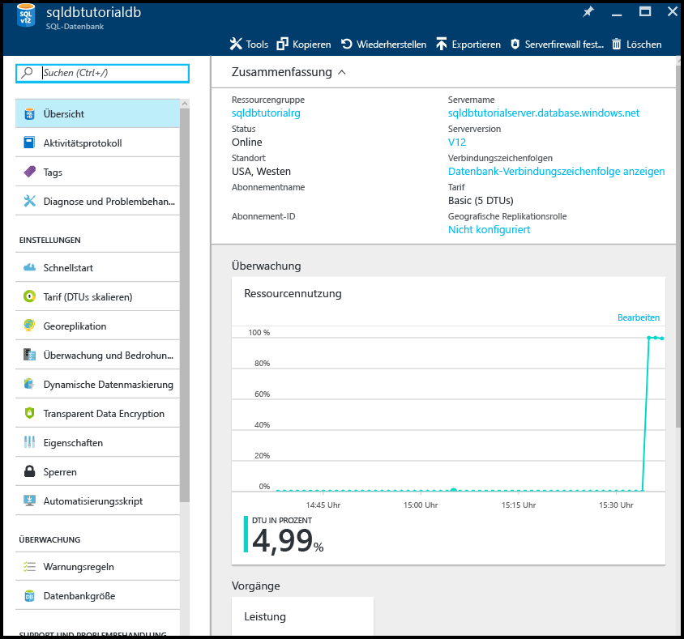
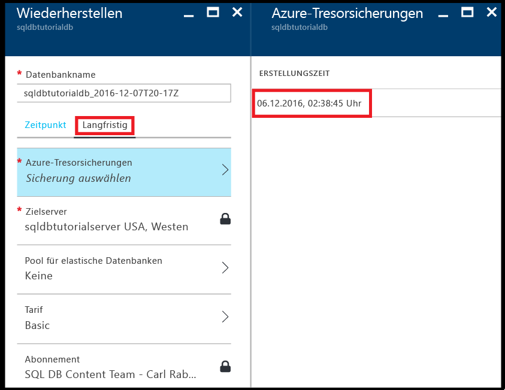

# Zeigen Sie Informationen zu Ihren Datenbanksicherungen mit langfristiger Beibehaltung der Sicherung an.

In diesem Thema erfahren Sie, wie Sie Informationen zu Ihren Datenbanksicherungen mit langfristiger Beibehaltung der Sicherung anzeigen.

## Anzeigen von Informationen zur langfristigen Beibehaltung der Sicherung über das Azure-Portal 

1. Öffnen Sie das Blatt für den Azure Recovery Services-Tresor (wechseln Sie zu **Alle Ressourcen**, und wählen Sie den Tresor in der Liste der Ressourcen für Ihr Abonnement aus), um den Speicherplatz anzuzeigen, den Ihre Datenbanksicherungen im Tresor belegen.

   

2. Öffnen Sie das Blatt **SQL-Datenbank** für Ihre Datenbank.

    

3. Klicken Sie auf der Symbolleiste auf **Wiederherstellen**.

    

4. Klicken Sie auf dem Blatt „Wiederherstellen“ auf **Langfristig**.

5. Klicken Sie unter „Azure vault backups“ (Sicherungen im Azure-Tresor) auf **Sicherung auswählen**, um die verfügbaren Datenbanksicherungen mit langfristiger Beibehaltung anzuzeigen.

    

> [!TIP]
> Ein Tutorial finden Sie unter [Erste Schritte mit der Sicherung und Wiederherstellung für Datenschutz und Wiederherstellung](sql-database-get-started-backup-recovery.md).
>

## Nächste Schritte

- Informationen zum Konfigurieren der langfristigen Beibehaltung von automatisierten Sicherungen in einem Azure Recovery Services-Tresor finden Sie unter .
- Informationen zum Wiederherstellen einer Datenbank aus einer Sicherung mit langfristiger Beibehaltung finden Sie unter [Restore a database from a backup in long-term backup retention](sql-database-restore-from-long-term-retention.md) (Wiederherstellen einer Datenbank aus einer Sicherung mit langfristiger Beibehaltung der Sicherung).
- Weitere Informationen zu vom Dienst generierten automatischen Sicherungen finden Sie im Artikel zu [automatischen Sicherungen](sql-database-automated-backups.md).
- Weitere Informationen zur langfristigen Beibehaltung von Sicherungen finden Sie im Artikel zur [langfristigen Beibehaltung von Sicherungen](sql-database-long-term-retention.md).
- Weitere Informationen zum Wiederherstellen von Daten aus Sicherungen finden Sie im Artikel zur [Wiederherstellung aus einer Sicherung](sql-database-recovery-using-backups.md).

<!--HONumber=Dec16_HO2-->

