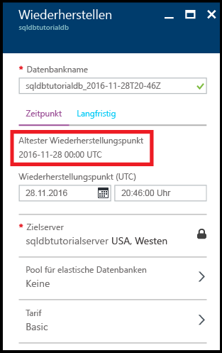

# Anzeigen des ältesten Wiederherstellungspunkts aus den vom Dienst generierten Sicherungen einer Azure SQL-Datenbank

In diesem Thema erfahren Sie, wie Sie den ältesten Wiederherstellungspunkt aus den vom Dienst generierten Sicherungen einer Azure SQL-Datenbank anzeigen.

## Anzeigen des ältesten Wiederherstellungspunkts über das Azure-Portal

1. Öffnen Sie das Blatt **SQL-Datenbank** für Ihre Datenbank.

    

2. Klicken Sie auf der Symbolleiste auf **Wiederherstellen**.

    

3. Überprüfen Sie auf dem Blatt „Wiederherstellen“ den ältesten Wiederherstellungspunkt.

    

> [!TIP]
> Ein Tutorial finden Sie unter [Erste Schritte mit der Sicherung und Wiederherstellung für Datenschutz und Wiederherstellung](sql-database-get-started-backup-recovery.md).
>

## Nächste Schritte

- Weitere Informationen zu vom Dienst generierten automatischen Sicherungen finden Sie im Artikel zu [automatischen Sicherungen](: https://azure.microsoft.com/en-us/documentation/articles/)sql-database-automated-backups.MD.
- Weitere Informationen zur langfristigen Beibehaltung von Sicherungen finden Sie im Artikel zur [langfristigen Beibehaltung von Sicherungen](sql-database-long-term-retention.md).
- Weitere Informationen zum Wiederherstellen von Daten aus Sicherungen finden Sie im Artikel zur [Wiederherstellung aus einer Sicherung](sql-database-recovery-using-backups.md).

<!--HONumber=Dec16_HO2-->

