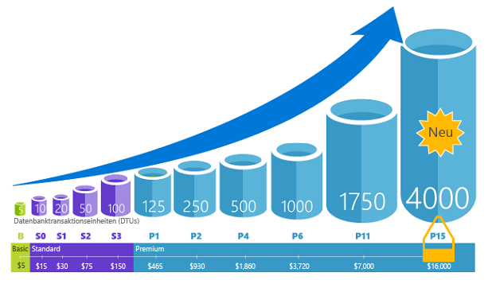
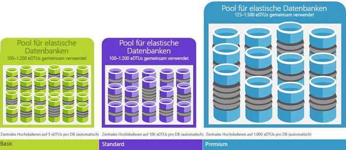

# Datenbanktransaktionseinheiten (DTUs) und elastische Datenbanktransaktionseinheiten (eDTUs)
In diesem Artikel werden Datenbanktransaktionseinheiten (DTUs) und elastische Datenbanktransaktionseinheiten (eDTUs) beschrieben. Außerdem wird erläutert, was passiert, wenn die Obergrenze für DTUs oder eDTUs erreicht ist.  

## Was sind Datenbanktransaktionseinheiten (DTUs)?
Eine DTU ist eine Maßeinheit für die Ressourcen, die für eine Azure SQL-Einzeldatenbank auf einer bestimmten Leistungsebene der [Dienstebene einer Einzeldatenbank](sql-database-service-tiers.md#single-database-service-tiers-and-performance-levels) garantiert verfügbar sind. Eine DTU ist eine gemischte Kennzahl aus CPU, Arbeitsspeicher und Daten-E/A sowie Transaktionsprotokoll-E/A. Das Verhältnis wird anhand einer OLTP-Benchmark-Workload ermittelt, die für echte OLTP-Workloads typisch ist. Eine Verdoppelung der DTUs durch das Erhöhen der Leistungsebene einer Datenbank ist gleichbedeutend mit der Verdoppelung des Ressourcensatzes, der für die Datenbank verfügbar ist. Beispiel: Eine Premium-P11-Datenbank mit 1.750 DTUs bietet eine 350 mal höhere DTU-Computeleistung als eine Basic-Datenbank mit fünf DTUs. Informationen zur Methodik hinter der OLTP-Benchmark-Workload, die zum Ermitteln der DTU-Mischung verwendet wird, finden Sie unter [Übersicht über das Durchführen von Vergleichstests für Azure SQL-Datenbank](sql-database-benchmark-overview.md).

Sie können jederzeit [Dienstebenen ändern](sql-database-scale-up.md) und die Ausfallzeiten für Ihre Anwendung dabei gering halten (im Durchschnitt meist unter vier Sekunden). Für viele Unternehmen und Apps genügt es, wenn Datenbanken erstellt werden können und sich die Leistung nach oben oder unten anpassen lässt – insbesondere, wenn die Nutzungsmuster relativ gut vorhersagbar sind. Bei unvorhersagbaren Nutzungsmustern kann es jedoch schwer sein, die Kosten und Ihr Geschäftsmodell zu verwalten. Für dieses Szenario verwenden Sie einen elastischen Pool mit einer bestimmten Anzahl von eDTUs.

## Was sind elastische Datenbanktransaktionseinheiten (eDTUs)?
Eine eDTU ist eine Maßeinheit für den Satz mit den Ressourcen (DTUs), die in einer Gruppe mit Datenbanken auf einem Azure SQL-Server gemeinsam genutzt werden können. Dies wird als [elastischer Pool](sql-database-elastic-pool.md) bezeichnet. Elastische Pools stellen eine einfache und kostengünstige Lösung zum Verwalten der Leistungsziele für mehrere Datenbanken mit unterschiedlichsten und unvorhersehbaren Nutzungsmustern dar. Weitere Informationen finden Sie im Abschnitt [Dienstebenen und Leistung für elastische Pools in eDTUs](sql-database-service-tiers.md#elastic-pool-service-tiers-and-performance-in-edtus).

Ein Pool erhält eine festgelegte Anzahl von eDTUs zu einem festen Preis. Im elastischen Pool können einzelne Datenbanken die automatische Skalierung innerhalb der konfigurierten Grenzen flexibel ausführen. Dadurch kann eine Datenbank mit hoher Auslastung mehr eDTUs nutzen, um die Anforderungen zu erfüllen, während Datenbanken mit geringer Auslastung weniger eDTUs nutzen. Das geht so weit, dass Datenbanken ohne Auslastung gar keine eDTUs nutzen. Durch die Bereitstellung von Ressourcen für den gesamten Pool statt pro Datenbank werden Verwaltungsaufgaben vereinfacht, und Sie verfügen über ein vorhersagbares Budget für den Pool.

Einem vorhandenen Pool können zusätzliche eDTUs hinzugefügt werden, ohne dass es zu Datenbankausfällen und Auswirkungen auf die Datenbanken im Pool kommt. Ebenso können zusätzliche eDTUs, die nicht mehr benötigt werden, zu jedem beliebigen Zeitpunkt aus einem vorhandenen Pool entfernt werden. Sie können Datenbanken zum Pool hinzufügen oder daraus entfernen oder die Anzahl von eDTUs beschränken, die eine Datenbank mit hoher Auslastung verwenden kann, um eDTUs für andere Datenbanken zu reservieren. Wenn die Ressourcen für eine Datenbank voraussichtlich nicht ausgeschöpft werden, können Sie sie aus dem Pool entfernen und als Einzeldatenbank mit der voraussichtlich erforderlichen Menge an Ressourcen konfigurieren.

## Wie kann ich die Anzahl von DTUs bestimmen, die für meine Workload erforderlich sind?
Wenn Sie die vorhandene Workload eines lokalen oder virtuellen SQL Server-Computers zu Azure SQL-Datenbank migrieren möchten, können Sie den [DTU Calculator](http://dtucalculator.azurewebsites.net/) (DTU-Rechner) nutzen, um die ungefähre Anzahl von benötigten DTUs zu berechnen. Für eine vorhandene Azure SQL-Datenbank-Workload können Sie [Query Performance Insight für Azure SQL-Datenbank](sql-database-query-performance.md) verwenden, um den Ressourcenverbrauch der Datenbank (DTUs) zu verstehen und Erkenntnisse zur Optimierung der Workload zu gewinnen. Sie können auch die DMV [sys.dm_db_ resource_stats](https://msdn.microsoft.com/library/dn800981.aspx) verwenden, um die Informationen zum Ressourcenverbrauch der letzten Stunde zu erhalten. Alternativ dazu ist es möglich, die Katalogansicht [sys.resource_stats](http://msdn.microsoft.com/library/dn269979.aspx) abzufragen, um die gleichen Daten für die letzten 14 Tage abzufragen. Da hierfür Durchschnittswerte für jeweils fünf Minuten genutzt werden, ist die Genauigkeit aber geringer.

## Wie kann ermittelt werden, ob sich durch einen elastischen Pool mit Ressourcen Vorteile für mich ergeben?
Pools eignen sich gut für eine große Anzahl von Datenbanken mit spezifischen Nutzungsmustern. Im Hinblick auf eine einzelne Datenbank wird dieses Muster durch eine geringe durchschnittliche Auslastung mit relativ wenigen Nutzungslastspitzen gekennzeichnet. Die SQL-Datenbank ermittelt automatisch den Verlauf der Ressourcennutzung von Datenbanken auf einem vorhandenen SQL-Datenbankserver und empfiehlt eine geeignete Poolkonfiguration im Azure-Portal. Weitere Informationen finden Sie unter [Wo sollte ein Pool für elastische Datenbanken verwendet werden?](sql-database-elastic-pool-guidance.md).

## Was passiert, wenn die Obergrenze der DTUs erreicht ist?
Leistungsstufen werden kalibriert und gesteuert, um die erforderlichen Ressourcen zum Ausführen der Workload Ihrer Datenbank bis zu den maximalen Grenzwerten bereitzustellen, die für die ausgewählte Dienstebene/Leistungsstufe zulässig sind. Wenn die Workload die Grenzwerte für CPU, Daten-E/A bzw. Protokoll-E/A erreicht, erhalten Sie die Ressourcen auch weiterhin auf der maximal zulässigen Ebene. Es treten aber wahrscheinlich erhöhte Wartezeiten für Ihre Abfragen auf. Diese Höchstgrenzen führen nicht zu Fehlern, sondern nur zu einer Verlangsamung Ihrer Workload. Wenn die Verlangsamung aber zu schwerwiegend ist, tritt ein Timeout für die Abfragen auf. Wenn Sie den Grenzwert für die maximal zulässigen gleichzeitigen Benutzersitzungen/-anforderungen (Arbeitsthreads) erreichen, erhalten Sie explizite Fehler. Informationen zu den Grenzwerten für andere Ressourcen als CPU, Arbeitsspeicher, Daten-E/A und Transaktionsprotokoll-E/A finden Sie unter [Ressourceneinschränkungen für Azure SQL-Datenbanken](sql-database-resource-limits.md) .

## Nächste Schritte
* Unter [Dienstebene](sql-database-service-tiers.md) finden Sie Informationen zu den DTUs und eDTUs, die für Einzeldatenbank und elastische Pools verfügbar sind.
* Informationen zu den Grenzwerten für andere Ressourcen als CPU, Arbeitsspeicher, Daten-E/A und Transaktionsprotokoll-E/A finden Sie unter [Ressourceneinschränkungen für Azure SQL-Datenbanken](sql-database-resource-limits.md) .
* Informationen zum Verbrauch (DTUs) finden Sie unter [Query Performance Insight für Azure SQL-Datenbank](sql-database-query-performance.md) .
* Informationen zur Methodik hinter der OLTP-Benchmark-Workload, die zum Ermitteln der DTU-Mischung verwendet wird, finden Sie unter [Übersicht über das Durchführen von Vergleichstests für Azure SQL-Datenbank](sql-database-benchmark-overview.md) .

<!--HONumber=Jan17_HO1-->

