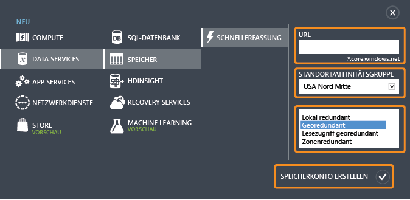
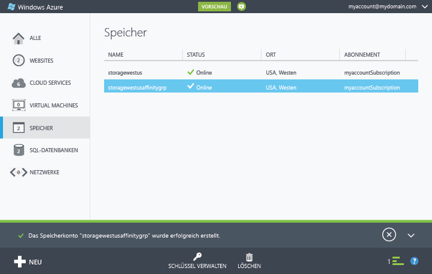
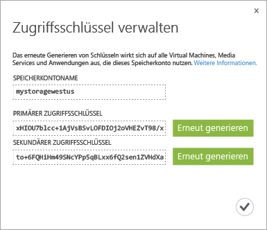

# Informationen zu Azure-Speicherkonten
[!INCLUDE [storage-selector-portal-create-storage-account](../../includes/storage-selector-portal-create-storage-account.md)]

[!INCLUDE [storage-try-azure-tools](../../includes/storage-try-azure-tools.md)]

## Übersicht
Ein Azure-Speicherkonto bietet Ihnen Zugriff auf die Azure Blob-, Warteschlangen-, Tabellen- und Dateidienste in Azure Storage. Ihr Speicherkonto stellt den eindeutigen Namespace für Ihre Azure Storage-Datenobjekte bereit. Standardmäßig sind die Daten in Ihrem Konto nur für Sie als Kontobesitzer verfügbar.

Zwei Typen von Speicherkonten stehen zur Verfügung:

* Ein Standardspeicherkonto umfasst Blob-, Tabellen- und Warteschlangenspeicher.
* Ein Storage Premium-Konto unterstützt aktuell ausschließlich Festplatten virtueller Azure-Computer. Eine ausführliche Übersicht über Azure Premium Storage finden Sie unter [Storage Premium: Hochleistungsspeicher für Workloads auf virtuellen Azure-Computern](storage-premium-storage.md) .

## Speicherkontoabrechnung
Die Rechnungsstellung für Azure-Speicher basiert auf Ihrem Speicherkonto. Speicherkosten basieren auf vier Faktoren: Speicherkapazität, Replikationsschema, Speichertransaktionen und Datenausgang.

* Speicherkapazität bezieht sich darauf, wie viel von Ihrer Speicherkontozuweisung zum Speichern von Daten verwendet wird. Die Kosten des einfachen Speicherns von Daten wird dadurch bestimmt, wie viele Daten Sie speichern und wie diese Daten repliziert werden.
* Die Replikation bestimmt, wie viele Kopien Ihrer Daten gleichzeitig unterhalten werden und an welchen Standorten.
* Transaktionen beziehen sich auf alle Lese- und Schreibvorgänge im Azure-Speicher.
* Datenausgang bezieht sich auf Daten, die aus einer Azure-Region übertragen werden. Wenn eine Anwendung, die nicht in der gleichen Region ausgeführt wird und entweder ein Clouddienst oder ein anderer Anwendungstyp ist, auf die Daten in Ihrem Speicherkonto zugreift, fallen Gebühren für den Datenausgang an. (Für Azure-Dienste können Sie Maßnahmen durchführen, um Daten und Dienste in den gleichen Rechenzentren zu gruppieren und so Datenausgangsgebühren zu reduzieren oder zu eliminieren.)  

Die Seite [Preise für Azure Storage](https://azure.microsoft.com/pricing/details/storage) bietet detaillierte Preisinformationen für Speicherkapazität, Replikation und Transaktionen. Auf der Seite [Datenübertragungen – Preisübersicht](https://azure.microsoft.com/pricing/details/data-transfers/) finden Sie detaillierte Preisinformationen für den Datenausgang.

Weitere Informationen zu Kapazität und Leistungszielen von Speicherkonten finden Sie unter [Ziele für Skalierbarkeit und Leistung des Azure-Speichers](storage-scalability-targets.md).

> [!NOTE]
> Wenn Sie einen virtuellen Azure-Computer erstellen, wird für Sie automatisch ein Speicherkonto in der Bereitstellungsregion erstellt, falls Sie noch kein Speicherkonto in der entsprechenden Region haben. Es ist nicht erforderlich, den unten aufgeführten Schritten zum Anlegen eines Speicherkontos für die Festplatten Ihres virtuelles Computers zu folgen. Der Name des Speicherkontos basiert auf dem Namen des virtuellen Computers. In der [Dokumentation zu Virtual Machines](https://azure.microsoft.com/documentation/services/virtual-machines/) finden Sie weitere Einzelheiten.
> 
> 

## Erstellen Sie ein Speicherkonto.
1. Melden Sie sich am [klassischen Azure-Portal](https://manage.windowsazure.com)an.
2. Klicken Sie auf der Taskleiste unten auf der Seite auf **Neu** . Klicken Sie auf **Data Services** | **Speicher** und anschließend auf **Schnellerfassung**.
   
    
3. Geben Sie unter **URL**einen Namen für Ihr Speicherkonto ein.
   
   > [!NOTE]
   > Speicherkontonamen müssen zwischen 3 und 24 Zeichen lang sein und dürfen nur Zahlen und Kleinbuchstaben enthalten.
   > 
   > Der Name Ihres Speicherkontos muss innerhalb von Azure eindeutig sein. Im klassischen Azure-Portal wird angezeigt, ob der von Ihnen ausgewählte Speicherkontoname bereits vergeben ist.
   > 
   > 
   
    Unter [Speicherkontoendpunkte](#storage-account-endpoints) (siehe unten) finden Sie Details dazu, wie der Name des Speicherkontos zum Adressieren Ihrer Objekte in Azure Storage verwendet wird.
4. Wählen Sie unter **Standort/Affinitätsgruppe** einen Standort für Ihr Speicherkonto aus, der in Ihrer Nähe oder der Nähe Ihrer Kunden ist. Wird von einem anderen Azure-Dienst aus auf die Daten zugegriffen, wie etwa einem virtuellen Azure-Computer oder Clouddienst, empfiehlt es sich, eine Affinitätsgruppe aus der Liste auszuwählen. Damit gruppieren Sie das Speicherkonto im selben Rechenzentrum wie andere von Ihnen verwendete Azure-Dienste und senken die Kosten.
   
    Beachten Sie, dass Sie bei der Erstellung Ihres Speicherkontos eine solche Affinitätsgruppe auswählen müssen. Sie können kein vorhandenes Konto in eine Affinitätsgruppe verschieben. Weitere Informationen zu Affinitätsgruppen finden Sie unter [Dienst am selben Standort wie Affinitätsgruppe](#service-co-location-with-an-affinity-group) (siehe unten).
   
   > [!IMPORTANT]
   > Um zu ermitteln, welche Standorte für Ihr Abonnement verfügbar sind, können Sie den Vorgang [Alle Ressourcenanbieter auflisten](https://msdn.microsoft.com/library/azure/dn790524.aspx) aufrufen. Um Anbieter aus PowerShell aufzulisten, rufen Sie [Get-AzureLocation](https://msdn.microsoft.com/library/azure/dn757693.aspx)auf. Verwenden Sie in .NET die [List](https://msdn.microsoft.com/library/azure/microsoft.azure.management.resources.provideroperationsextensions.list.aspx) -Methode der ProviderOperationsExtensions-Klasse.
   > 
   > Darüber hinaus finden Sie unter [Azure-Regionen](https://azure.microsoft.com/regions/#services) weitere Informationen dazu, welche Dienste in welcher Region verfügbar sind.
   > 
   > 
5. Wenn Sie mehr als ein Azure-Abonnement besitzen, wird das Feld **Abonnement** angezeigt. Geben Sie unter **Abonnement**das Azure-Abonnement ein, das Sie mit dem Speicherkonto verwenden möchten.
6. Wählen Sie unter **Replikation** die gewünschte Replikationsstufe für das Speicherkonto aus. Die empfohlene Replikationsoption ist die georedundante Replikation. Sie sorgt für maximalen Bestand Ihrer Daten. Weitere Details zu den Replikationsoptionen für Azure Storage finden Sie unter [Azure Storage-Replikation](storage-redundancy.md).
7. Klicken Sie auf **Speicherkonto erstellen**.
   
    Die Erstellung Ihres Speicherkontos kann einige Minuten in Anspruch nehmen. Sie können die Benachrichtigungen unten im klassischen Azure-Portal überwachen, um den Status zu überprüfen. Nachdem das Speicherkonto erstellt wurde, hat Ihr neues Speicherkonto den Status **Online** und kann verwendet werden.

### Speicherkontoendpunkte
Jedes Objekt, das Sie in Azure Storage speichern, verfügt über eine eindeutige URL-Adresse. Der Name des Speicherkontos bildet die Unterdomäne dieser Adresse. Die Kombination aus Unterdomäne und Domänenname, die für jeden Dienst spezifisch ist, bildet einen *Endpunkt* für Ihr Speicherkonto.

Wenn Ihr Speicherkonto beispielsweise *meinspeicherkonto*heißt, dann sind die Standardendpunkte für Ihr Speicherkonto wie folgt:

* Blob-Dienst: http://*meinspeicherkonto*.blob.core.windows.net
* Tabellenspeicherdienst: http://*meinspeicherkonto*.table.core.windows.net
* Warteschlangendienst: http://*meinspeicherkonto*.queue.core.windows.net
* Dateidienst: http://*meinspeicherkonto*.file.core.windows.net

Sie sehen die Endpunkte für Ihr Speicherkonto im Dashboard des Speichers, sobald das Konto im [klassischen Azure-Portal](https://manage.windowsazure.com) erstellt wurde.

Die URL für den Zugriff auf ein Objekt in einem Speicherkonto wird durch Anhängen des Objektstandorts im Speicherkonto an den Endpunkt generiert. Eine Blob-Adresse kann beispielsweise das folgende Format haben: http://*meinspeicherkonto*.blob.core.windows.net/*meincontainer*/*meinblob*.

Sie können auch einen benutzerdefinierten Domänennamen konfigurieren, den Sie mit Ihrem Speicherkonto verwenden. Details finden Sie unter [Konfigurieren eines benutzerdefinierten Domänennamens für Ihren Blob Storage-Endpunkt](storage-custom-domain-name.md) .

### Dienst am selben Standort wie Affinitätsgruppe
Eine *Affinitätsgruppe* ist eine geografische Gruppierung Ihrer Azure-Dienste und VMs mit Ihrem Azure-Konto. Eine Affinitätsgruppe kann die Dienstleistung verbessern, indem Computerarbeitslasten im gleichen Rechenzentrum oder in der Nähe der Zielbenutzer platziert werden. Außerdem fallen keine Gebühren für den Datenausgang an, wenn ein Dienst, der zur gleichen Affinitätsgruppe gehört, auf Daten im Speicherkonto zugreift.

> [!NOTE]
> Um eine Affinitätsgruppe zu erstellen, öffnen Sie im [klassischen Azure-Portal](https://manage.windowsazure.com) den Bereich <b>Einstellungen</b>, klicken auf <b>Affinitätsgruppen</b> und anschließend entweder auf <b>Affinitätsgruppe hinzufügen</b> oder auf die Schaltfläche <b>Hinzufügen</b>. Sie können Affinitätsgruppen auch mithilfe der Azure Service Management-API erstellen und verwalten. Weitere Informationen finden Sie unter <a href="http://msdn.microsoft.com/library/azure/ee460798.aspx">Vorgänge für Affinitätsgruppen</a>.
> 
> 

## Informationen zu Azure-Speicherkonten
Wenn Sie ein Speicherkonto erstellen, generiert Azure zwei 512-Bit-Speicherzugriffsschlüssel, die für die Authentifizierung verwendet werden, wenn der Zugriff auf das Speicherkonto erfolgt. Durch Bereitstellen von zwei Speicherzugriffsschlüsseln ermöglicht Azure Ihnen das erneute Generieren der Schlüssel ohne Unterbrechung des Speicherdiensts oder Zugriff auf diesen Dienst.

> [!NOTE]
> Sie sollten das Weitergeben von Speicherzugriffsschlüsseln an andere vermeiden. Um den Zugriff auf Speicherressourcen zu gewähren, ohne den Zugriffsschlüssel weiterzugeben, verwenden Sie eine *Shared Access Signature*. Eine Shared Access Signature (SAS) bietet Zugriff auf eine Ressource in Ihrem Konto für ein von Ihnen definiertes Zeitintervall und mit den von Ihnen festgelegten Berechtigungen. Weitere Informationen finden Sie unter [Shared Access Signatures, Teil 1: Grundlagen zum SAS-Modell](storage-dotnet-shared-access-signature-part-1.md) .
> 
> 

Verwenden Sie im [klassischen Azure-Portal](https://manage.windowsazure.com) die Option **Schlüssel verwalten** auf dem Dashboard oder die Seite **Storage**, um die Speicherzugriffsschlüssel, die für den Zugriff auf Blob-, Tabellenspeicher- und Warteschlangendienste verwendet werden, anzuzeigen, zu kopieren und erneut zu generieren.

### Kopieren eines Speicherzugriffsschlüssels
Sie können **Schlüssel verwalten** verwenden, um einen Speicherzugriffsschlüssel für die Verwendung in einer Verbindungszeichenfolge zu kopieren. Die Verbindungszeichenfolge benötigt für die Authentifizierung den Namen des Speicherkontos und einen Schlüssel. Informationen zum Konfigurieren von Verbindungszeichenfolgen für den Zugriff auf Azure-Speicherdienste finden Sie unter [Konfigurieren von Azure Storage-Verbindungszeichenfolgen](storage-configure-connection-string.md).

1. Klicken Sie im [klassischen Azure-Portal](https://manage.windowsazure.com)auf **Storage**und dann auf den Namen des Speicherkontos, um das Dashboard zu öffnen.
2. Klicken Sie auf **Schüssel verwalten**.
   
     **Zugriffsschlüssel verwalten** wird geöffnet.
   
    
3. Markieren Sie den Schlüsseltext, um einen Speicherzugriffsschlüssel zu kopieren. Klicken Sie dann mit der rechten Maustaste und klicken Sie auf **Kopieren**.

### Erneutes Generieren von Speicherzugriffsschlüsseln
Sie sollten die Zugriffsschlüssel für Ihr Speicherkonto regelmäßig ändern, um dafür zu sorgen, dass Ihre Speicherverbindungen sicher sind. Zwei Zugriffsschlüssel werden zugewiesen, um es Ihnen zu ermöglichen, Verbindungen zum Speicherkonto mit einem Zugriffsschlüssel aufrecht zu erhalten, während Sie den anderen Zugriffsschlüssel neu generieren.

> [!WARNING]
> Das erneute Generieren der Zugriffsschlüssel wirkt sich auf die Dienste in Azure sowie auf Ihre eigenen Anwendungen aus, die vom Speicherkonto abhängen. Alle Clients, die den Zugriffsschlüssel verwenden, um auf das Speicherkonto zuzugreifen, müssen aktualisiert werden, um den neuen Schlüssel zu verwenden.
> 
> 

**Mediendienste** : Falls Sie Mediendienste haben, die auf Ihr Speicherkonto angewiesen sind, müssen Sie die Zugriffsschlüssel nach dem erneuten Generieren der Schlüssel mit Ihrem Mediendienst erneut synchronisieren.

**Anwendungen** : Falls Sie Webanwendungen oder Clouddienste haben, die das Speicherkonto verwenden, verlieren Sie die Verbindungen beim erneuten Generieren von Schlüsseln – es sei denn, Sie führen einen Rollup für die Schlüssel aus. 

**Speicher-Explorer** : Wenn Sie beliebige [Speicher-Explorer-Anwendungen](storage-explorers.md)verwenden, müssen Sie möglicherweise den von diesen Anwendungen verwendeten Speicherschlüssel aktualisieren.

Mit dem folgenden Prozess wechseln Sie Ihre Speicherzugriffsschlüssel:

1. Aktualisieren Sie die Verbindungszeichenfolgen im Anwendungscode, damit sie auf den sekundären Zugriffsschlüssel des Speicherkontos verweisen.
2. Generieren Sie den primären Zugriffsschlüssel für das Speicherkonto neu. Klicken Sie im [klassischen Azure-Portal](https://manage.windowsazure.com) im Dashboard oder auf der Seite **Konfigurieren** auf **Schlüssel verwalten**. Klicken Sie unter dem primären Zugriffsschlüssel auf **Neu generieren** und dann auf **Ja**, um das Generieren eines neuen Schlüssels zu bestätigen.
3. Aktualisieren Sie die Verbindungszeichenfolgen in Ihrem Code, um auf den neuen primären Zugriffsschlüssel zu verweisen.
4. Generieren Sie den sekundären Zugriffsschlüssel neu.

## Löschen von Speicherkonten
Um ein nicht mehr verwendetes Speicherkonto zu entfernen, verwenden Sie **Löschen** im Dashboard oder auf der Seite **Konfigurieren**. **Löschen** wird das gesamte Speicherkonto gelöscht, einschließlich aller Blobs, Tabellen und Warteschlangen im Konto.

> [!WARNING]
> Es ist nicht möglich, ein gelöschtes Speicherkonto wiederherzustellen oder Inhalte abzurufen, die das Konto vor dem Löschen enthielt. Sichern Sie alle Inhalte, die Sie speichern möchten, bevor Sie das Konto löschen. Dies gilt auch für alle Ressourcen im Konto – gelöschte Blobs, Tabellen, Warteschlangen oder Dateien können nicht wiederhergestellt werden.
> 
> Enthält Ihr Speicherkonto VHD-Dateien für einen virtuellen Azure-Computer, müssen Sie alle Images und Festplatten löschen, die diese VHD-Dateien verwenden, bevor Sie das Speicherkonto löschen können. Halten Sie zunächst den virtuellen Computer an, falls er ausgeführt wird, und löschen Sie ihn dann. Um Datenträger zu löschen, navigieren Sie zur Registerkarte **Datenträger**, und löschen Sie dort alle Datenträger. Um Images zu löschen, navigieren Sie zur Registerkarte **Images**, und löschen Sie dort alle im Konto gespeicherten Images.
> 
> 

1. Klicken Sie im [klassischen Azure-Portal](https://manage.windowsazure.com)auf **Storage**.
2. Klicken Sie im Speicherkonto auf eine beliebige Stelle (nicht auf den Namen). Klicken Sie dann auf **Löschen**.
   
     -Oder-
   
    Klicken Sie auf den Namen des Speicherkontos, um das Dashboard zu öffnen. Klicken Sie dann auf **Löschen**.
3. Klicken Sie auf **Ja** , um zu bestätigen, dass Sie das Speicherkonto löschen möchten.

## Nächste Schritte
* Weitere Informationen zu Azure Storage finden Sie in der [Azure Storage-Dokumentation](https://azure.microsoft.com/documentation/services/storage/).
* Besuchen Sie den [Blog des Azure-Speicherteams](http://blogs.msdn.com/b/windowsazurestorage/).
* [Übertragen von Daten mit dem Befehlszeilenprogramm AzCopy](storage-use-azcopy.md)

<!--HONumber=Dec16_HO2-->

