<properties
	pageTitle="Erste Schritte mit Azure Stream Analytics zum Verarbeiten der Daten von IoT-Geräten | Stream Analytics"
	description="IoT-Sensortags und -Datenströme mit Stream Analytics und Echtzeit-Datenverarbeitung"
    keywords="IoT-Lösung, erste Schritte mit IoT"
	services="stream-analytics"
	documentationCenter=""
	authors="jeffstokes72"
	manager="jhubbard"
	editor="cgronlun"
/>

<tags 
	ms.service="stream-analytics" 
	ms.devlang="na" 
	ms.topic="hero-article" 
	ms.tgt_pltfrm="na" 
	ms.workload="data-services" 
	ms.date="09/26/2016"
	ms.author="jeffstok"
/>

# Erste Schritte mit Azure Stream Analytics zum Verarbeiten der Daten von IoT-Geräten

In diesem Tutorial erfahren Sie, wie Sie Datenstrom-Verarbeitungslogik erstellen, um Daten von IoT-Geräten (Internet of Things) zu erfassen. Wir verwenden einen echten IoT-Anwendungsfall aus der Praxis, um zu zeigen, wie Sie Ihre Lösung schnell und wirtschaftlich erstellen.

## Voraussetzungen

-   [Azure-Abonnement](https://azure.microsoft.com/pricing/free-trial/)
-   Beispielabfrage und Datendateien (bei [GitHub](https://aka.ms/azure-stream-analytics-get-started-iot) als Download erhältlich)

## Szenario

Contoso ist ein Unternehmen im Bereich der industriellen Automation, das seinen Fertigungsprozess vollständig automatisiert hat. Die Maschinen im Werk verfügen über Sensoren, die Datenströme in Echtzeit ausgeben können. In diesem Szenario möchte ein Production Floor Manager in Echtzeit Einblick in die Sensordaten erhalten, um darin nach Mustern zu suchen und entsprechend darauf zu reagieren. Wir verwenden die Stream Analytics Query Language (SAQL) für die Sensordaten, um für den eingehenden Datenstrom interessante Muster zu ermitteln.

In diesem Fall werden die Daten von einem Texas Instruments SensorTag-Gerät generiert.

Die Nutzlast der Daten liegt im JSON-Format vor und sieht wie folgt aus:

    
	{
    	"time": "2016-01-26T20:47:53.0000000",  
	    "dspl": "sensorE",  
    	"temp": 123,  
	    "hmdt": 34  
	}  
    
In der Praxis können Hunderte dieser Sensoren einen Datenstrom mit Ereignissen generieren. Idealerweise ist dann ein Gatewaygerät vorhanden, auf dem Code ausgeführt wird, um diese Ereignisse mittels Push an [Azure Event Hubs](https://azure.microsoft.com/services/event-hubs/) oder [Azure IoT Hubs](https://azure.microsoft.com/services/iot-hub/) zu übertragen. Ihr Stream Analytics-Auftrag erfasst diese Ereignisse über Event Hubs und führt in Echtzeit Analyseabfragen für die Datenströme aus. Die Ergebnisse können dann an eine der [unterstützten Ausgaben](stream-analytics-define-outputs.md) gesendet werden.

In dieser Einstiegsanleitung wird der Einfachheit halber eine Beispieldatendatei mit Daten von echten SensorTag-Geräten bereitgestellt, für die Sie verschiedene Abfragen ausführen und Ergebnisse anzeigen können. In den nachfolgenden Tutorials erfahren Sie, wie Sie Ihren Auftrag mit Eingaben und Ausgaben verbinden und für den Azure-Dienst bereitstellen.

## Erstellen eines Stream Analytics-Auftrags

Wählen Sie im [Azure-Portal](http://manage.windowsazure.com) die Option „Stream Analytics“ aus, und klicken Sie links unten auf der Seite auf **Neu**, um einen neuen Analytics-Auftrag zu erstellen.

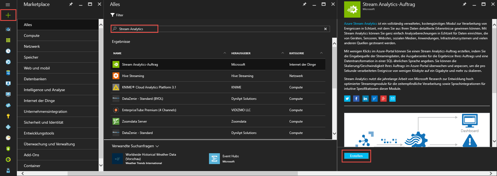

Klicken Sie auf **Schnellerfassung**.

Wählen Sie für die Einstellung **Speicherkonto für regionale Überwachung** die Option **Neues Speicherkonto erstellen** aus, und versehen Sie das Konto mit einem eindeutigen Namen. Azure Stream Analytics verwendet dieses Konto, um Überwachungsinformationen für alle Ihre zukünftigen Aufträge zu speichern.

> [AZURE.NOTE] Sie sollten dieses Speicherkonto nur einmal pro Region erstellen. Dieser Speicher wird dann für alle Stream Analytics-Aufträge freigegeben, die in dieser Region erstellt werden.

Klicken Sie am Ende der Seite auf **Stream Analytics-Auftrag erstellen**.

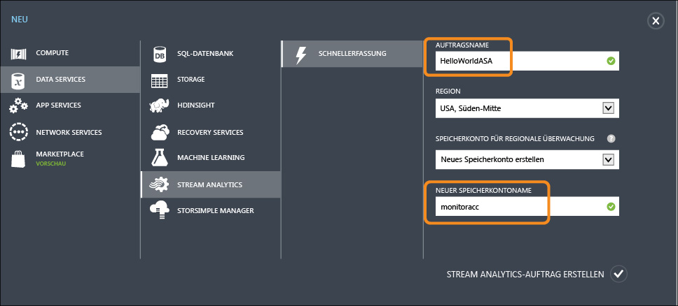

## Azure Stream Analytics-Abfrage

Klicken Sie auf die Registerkarte „Abfrage“, um zum Abfrage-Editor zu wechseln. Die Registerkarte „Abfrage“ enthält eine T-SQL-Abfrage, die die Transformation der eingehenden Ereignisdaten ausführt.

## Archivieren von Rohdaten

Die einfachste Form einer Abfrage ist ein Passthrough-Vorgang, bei dem alle Eingabedaten unter dem angegebenen Ausgabeort archiviert werden.

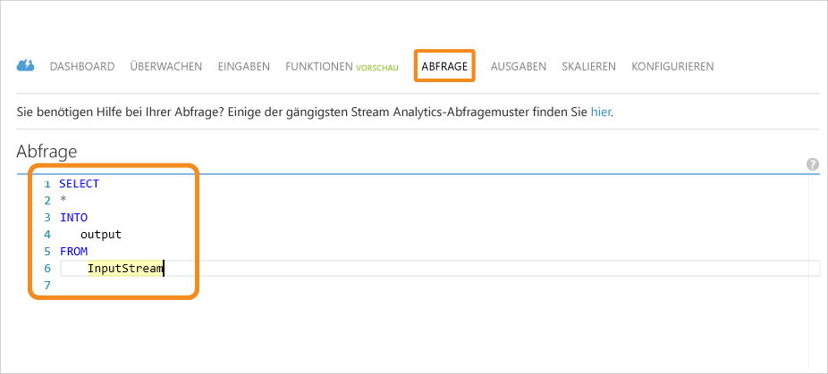

Laden Sie nun die Beispieldatendatei von [GitHub](https://aka.ms/azure-stream-analytics-get-started-iot) an einen Speicherort auf Ihrem Computer herunter. Kopieren Sie die Abfrage aus der Datei **PassThrough.txt**, und fügen Sie sie ein. Klicken Sie weiter unten auf die Schaltfläche „Test“, und wählen Sie an Ihrem Downloadspeicherort die Datendatei mit dem Namen **HelloWorldASA-InputStream.json** aus.

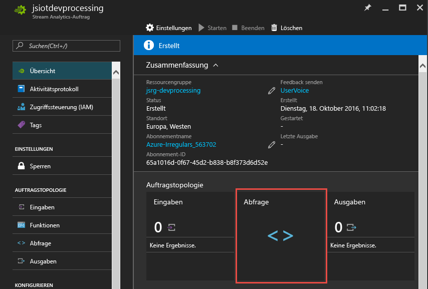

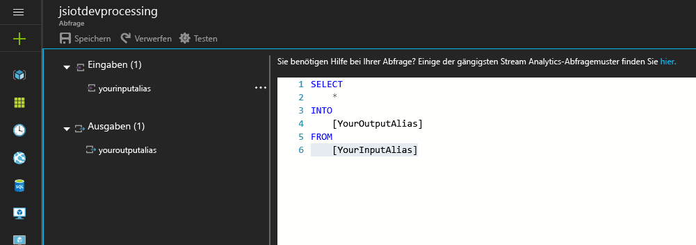

Die Ergebnisse der Abfrage werden im Browser angezeigt:

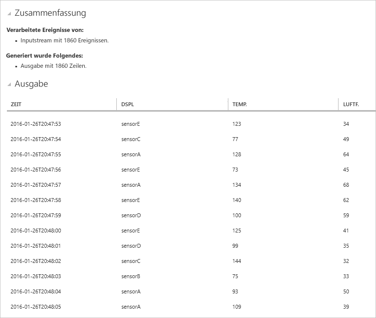

## Filtern der Daten auf der Grundlage einer Bedingung

Wir versuchen nun, die Ergebnisse anhand einer Bedingung zu filtern. Wir möchten nur Ergebnisse für die Ereignisse anzeigen, die von „SensorA“ stammen. Die Abfrage befindet sich in der Datei **Filtering.txt**.

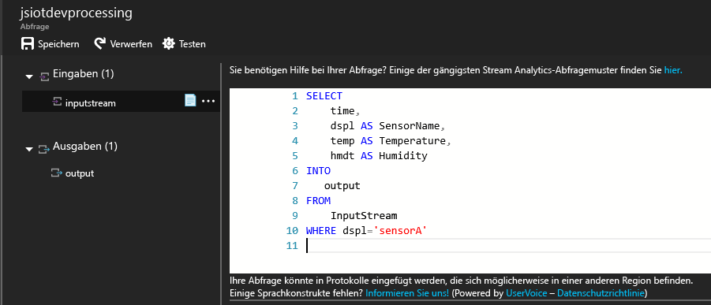

Beachten Sie Folgendes: Wir vergleichen hier einen Zeichenfolgenwert, und die Groß-/Kleinschreibung wird berücksichtigt. Klicken Sie auf die Schaltfläche **Erneut ausführen**, um die Abfrage auszuführen. Mit der Abfrage sollten nur 389 Zeilen für 1.860 Ereignisse zurückgegeben werden.

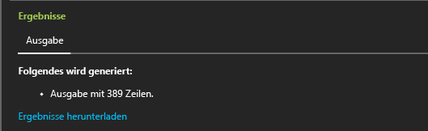

## Anzeigen von Warnungen zum Auslösen des Geschäftsworkflows

Im nächsten Schritt fügen wir unserer Abfrage weitere Details hinzu. Wenn wir für jede Art von Sensor die Durchschnittstemperatur für ein Zeitfenster von 30 Sekunden überwachen und Ergebnisse nur anzeigen möchten, wenn die Durchschnittstemperatur mehr als 100 Grad beträgt, schreiben wir die unten angegebene Abfrage und klicken dann auf **Erneut ausführen**, um die Ergebnisse anzuzeigen. Die Abfrage befindet sich in der Datei **ThresholdAlerting.txt**.

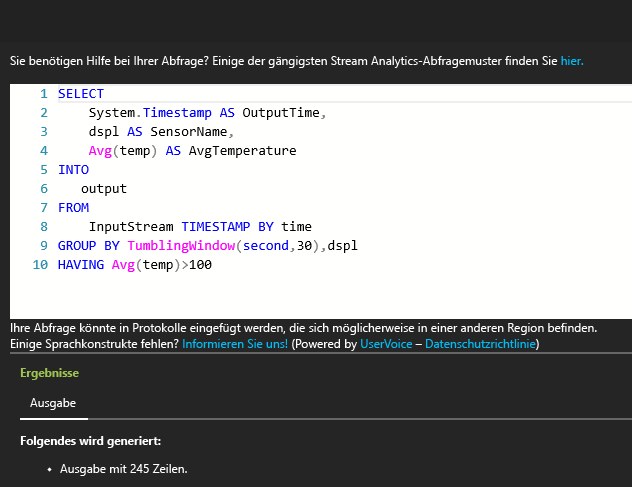

Die Ergebnisse umfassen nun nur noch 245 Zeilen, und es werden die Sensoren aufgeführt, bei denen die Durchschnittstemperatur höher als 100 ist. In dieser Abfrage haben wir den Datenstrom mit den Ereignissen nach **dspl** (Sensorname) gruppiert, und es wird ein **rollierendes Fenster** von 30 Sekunden verwendet. Bei Zeitabfragen dieser Art muss unbedingt der gewünschte zeitliche Ablauf angegeben werden. Mit der **TIMESTAMP BY**-Klausel haben wir die Spalte „time“ als Grundlage für den zeitlichen Ablauf aller Zeitberechnungen angegeben. Ausführliche Informationen finden Sie in den MSDN-Themen zu den Funktionen [Time Management](https://msdn.microsoft.com/library/azure/mt582045.aspx) (Zeitverwaltung) und [Windowing](https://msdn.microsoft.com/library/azure/dn835019.aspx).

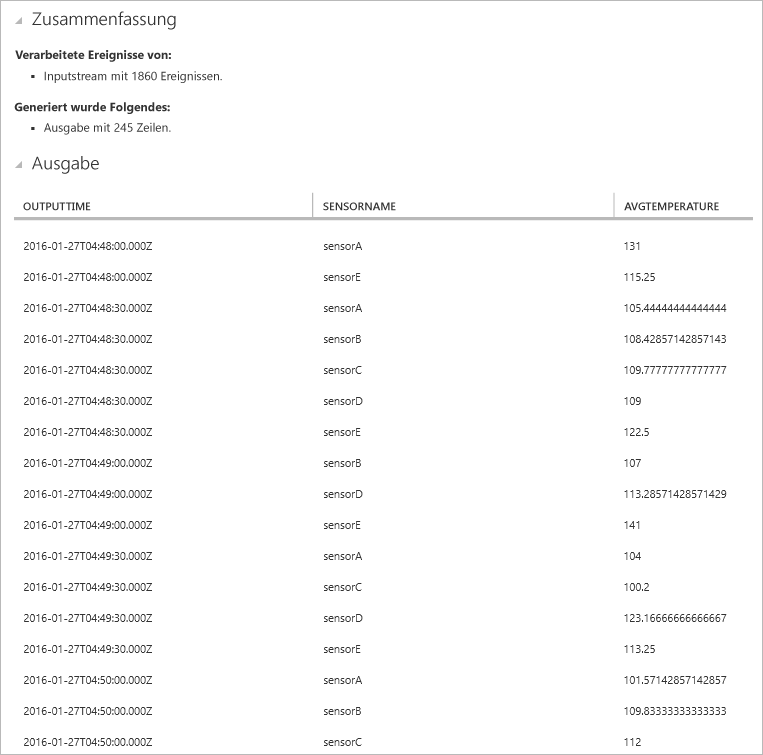

## Erkennen der Abwesenheit von Ereignissen

Wie können wir eine Abfrage schreiben, die einen Mangel an Eingabeereignissen findet? Das ist eigentlich ganz einfach. Ermitteln wir doch einmal, wann ein Sensor zum letzten Mal Daten gesendet und danach eine Minute lang keine weiteren Ereignisse gesendet hat. Die Abfrage befindet sich in der Datei **AbsenseOfEvent.txt**.

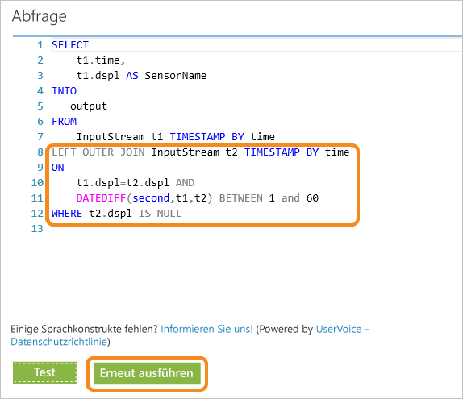

Hier verwenden wir **LEFT OUTER JOIN** für den gleichen Datenstrom (Selbstverknüpfung). Für eine innere Verknüpfung wird nur dann ein Ergebnis zurückgegeben, wenn eine Übereinstimmung gefunden wird. Wenn jedoch ein Ereignis von der linken Seite der Verknüpfung keine Übereinstimmung besitzt, wird bei **LEFT OUTER JOIN** für alle Spalten der rechten Zeile eine Zeile mit NULL zurückgegeben. Dieses Verfahren ist äußerst hilfreich, um die Abwesenheit von Ereignissen zu ermitteln. Weitere Informationen zu [JOIN](https://msdn.microsoft.com/library/azure/dn835026.aspx) finden Sie in der MSDN-Dokumentation.

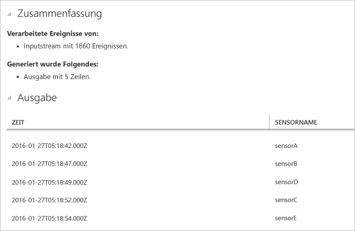

## Zusammenfassung

In diesem Tutorial erfahren Sie, wie Sie verschiedene Abfragen in der Stream Analytics-Abfragesprache schreiben und die Ergebnisse im Browser anzeigen. Dies ist aber erst der Anfang. Sie haben mit Stream Analytics noch viele weitere Möglichkeiten. Stream Analytics unterstützt verschiedenste Ein- und Ausgaben und kann sogar Funktionen in Azure Machine Learning nutzen. Das macht Stream Analytics zu einem zuverlässigen Tool für die Datenstromanalyse. Über den [Lernpfad](https://azure.microsoft.com/documentation/learning-paths/stream-analytics/) können Sie sich ausführlicher mit Stream Analytics vertraut machen. Weitere Informationen zum Schreiben von Abfragen finden Sie im Artikel [Gängige Abfragemuster](./stream-analytics-stream-analytics-query-patterns.md).

<!---HONumber=AcomDC_0928_2016-->