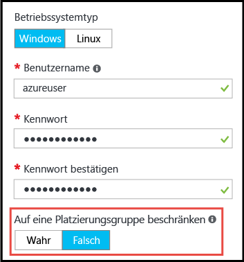

# <a name="working-with-large-virtual-machine-scale-sets"></a>Verwenden umfangreicher VM-Skalierungsgruppen
Sie können nun [Azure-VM-Skalierungsgruppen](/azure/virtual-machine-scale-sets/) mit einer Kapazität von bis zu 1.000 virtuellen Computern erstellen. Eine _umfangreiche VM-Skalierungsgruppe_ ist in diesem Dokument als Skalierungsgruppe mit mehr als 100 virtuellen Computern definiert. Diese Funktion wird über eine Skalierungsgruppeneigenschaft (_singlePlacementGroup=False_) festgelegt. 

Bestimmte Aspekte umfangreicher Skalierungsgruppen (wie etwa Lastenausgleich und Fehlerdomänen) verhalten sich anders als bei Standardskalierungsgruppen. In diesem Dokument werden die Merkmale umfangreicher Skalierungsgruppen erläutert, und Sie erfahren, wie Sie sie erfolgreich in Ihren Anwendungen verwenden. 

Eine gängige Methode für die Bereitstellung umfangreicher Cloudinfrastrukturen ist die Erstellung eines Satzes von _Skalierungseinheiten_ – beispielsweise durch Erstellen mehrerer VM-Skalierungsgruppen in mehreren VNets und Speicherkonten. Verglichen mit einzelnen virtuellen Computern ermöglicht dieser Ansatz eine einfachere Verwaltung. Mehrere Skalierungseinheiten sind zudem bei zahlreichen Anwendungen hilfreich. Dies gilt insbesondere für Anwendungen, die andere stapelbare Komponenten (etwa mehrere virtuelle Netzwerke und Endpunkte) erfordern. Falls Ihre Anwendung allerdings einen einzelnen großen Cluster erfordert, ist es unter Umständen einfacher, eine einzelne Skalierungsgruppe mit bis zu 1.000 virtuellen Computern bereitzustellen. Beispielszenarien wären etwa zentrale Big Data-Bereitstellungen oder Computenetze, die eine einfache Verwaltung eines umfangreichen Pools von Workerknoten erfordern. In Kombination mit [angefügten Datenträgern](virtual-machine-scale-sets-attached-disks.md) für VM-Skalierungsgruppen können Sie dank umfangreicher Skalierungsgruppen in einem einzelnen Vorgang eine skalierbare Infrastruktur mit Tausenden von Kernen und einem Speicherplatz von mehreren Petabytes bereitstellen.

## <a name="placement-groups"></a>Platzierungsgruppen 
Die Besonderheit einer _umfangreichen_ Skalierungsgruppe ist nicht die Anzahl virtueller Computer, sondern die Anzahl enthaltener _Platzierungsgruppen_. Eine Platzierungsgruppe ist ein ähnliches Konstrukt wie eine Azure-Verfügbarkeitsgruppe und verfügt über eigene Fehler- und Upgradedomänen. Standardmäßig besteht eine Skalierungsgruppe aus einer einzelnen Platzierungsgruppe mit einer maximalen Größe von 100 virtuellen Computern. Wenn die Skalierungsgruppeneigenschaft _singlePlacementGroup_ auf _false_ festgelegt ist, kann die Skalierungsgruppe mehrere Platzierungsgruppen und bis zu 1.000 virtuelle Computer umfassen. Bei Verwendung des Standardwerts _true_ besteht eine Skalierungsgruppe aus einer einzelnen Platzierungsgruppe und umfasst maximal 100 virtuelle Computer.

## <a name="checklist-for-using-large-scale-sets"></a>Prüfliste für die Verwendung umfangreicher Skalierungsgruppen
Die effektive Nutzung umfangreicher Skalierungsgruppen durch eine Anwendung hängt von folgenden Aspekten ab:

- Umfangreiche Skalierungsgruppen erfordern Azure Managed Disks. Für Skalierungsgruppen, die nicht mit Managed Disks erstellt wurden, sind mehrere Speicherkonten (jeweils eins pro 20 virtuelle Computer) erforderlich. Umfangreiche Skalierungsgruppen wurden exklusiv für die Verwendung mit Managed Disks konzipiert, um die Speicherverwaltung zu vereinfachen und um zu verhindern, dass Abonnementgrenzwerte für Speicherkonten erreicht werden. Ohne Managed Disks ist Ihre Skalierungsgruppe auf 100 virtuelle Computer beschränkt.
- Skalierungsgruppen, die auf der Grundlage von Azure Marketplace-Images erstellt wurden, können auf bis zu 1.000 virtuelle Computer skaliert werden.
- Skalierungsgruppen, die auf der Grundlage benutzerdefinierter Images (selbst erstellte und hochgeladene VM-Images) erstellt wurden, können derzeit auf bis zu 100 virtuelle Computer skaliert werden.
- Für Skalierungsgruppen mit mehreren Platzierungsgruppen wird noch kein Layer-4-Lastenausgleich mit Azure Load Balancer unterstützt. Falls Sie Azure Load Balancer verwenden müssen, achten Sie darauf, dass die Skalierungsgruppe für die Verwendung einer einzelnen Platzierungsgruppe konfiguriert ist. (Dies ist die Standardeinstellung.)
- Layer-7-Lastenausgleich mit Azure Application Gateway wird für alle Skalierungsgruppen unterstützt.
- Eine Skalierungsgruppe ist mit einem einzelnen Subnetz definiert. Vergewissern Sie sich daher, dass Ihr Subnetz über einen ausreichend großen Adressbereich für alle benötigten virtuellen Computer verfügt. Zur Verbesserung der Zuverlässigkeit und der Leistung der Bereitstellung findet bei Skalierungsgruppen standardmäßig eine Überbereitstellung statt. (Zur Bereitstellungszeit oder beim horizontalen Hochskalieren werden also zusätzliche virtuelle Computer erstellt.) Die Größe des Adressraums sollte daher die geplante Anzahl von virtuellen Computern, auf die Sie skalieren möchten, um etwa 20 Prozent übersteigen.
- Wenn Sie viele virtuelle Computer bereitstellen möchten, ist unter Umständen eine Erhöhung der Compute-Kernkontingentgrenzwerte erforderlich.
- Fehler- und Upgradedomänen sind nur innerhalb einer Platzierungsgruppe konsistent. Diese Architektur ändert nichts an der allgemeinen Verfügbarkeit einer Skalierungsgruppe, da virtuelle Computer gleichmäßig auf unterschiedliche physische Hardware verteilt werden. Wenn Sie jedoch sicherstellen müssen, dass sich zwei virtuelle Computer auf unterschiedlicher Hardware befinden, müssen Sie sich vergewissern, dass sie sich in unterschiedlichen Fehlerdomänen in der gleichen Platzierungsgruppe befinden. Fehlerdomäne und Platzierungsgruppen-ID werden in der _Instanzansicht_ eines virtuellen Skalierungsgruppencomputers angezeigt. Die Instanzansicht eines virtuellen Skalierungsgruppencomputers können Sie im [Azure-Ressourcen-Explorer](https://resources.azure.com/) anzeigen.


## <a name="creating-a-large-scale-set"></a>Erstellen einer umfangreichen Skalierungsgruppe
Wenn Sie eine umfangreiche Skalierungsgruppe über das Azure-Portal erstellen, können Sie auf dem Blatt _Grundlagen_ die Einstellung _Limit to a single placement group_ (Auf einzelne Platzierungsgruppe beschränken) auf _False_ festlegen, um die Skalierung auf mehreren Platzierungsgruppen zu ermöglichen. Ist die Option auf _False_ festgelegt, können Sie für _Instanzanzahl_ einen Wert von bis zu 1.000 angeben.



Über die [Azure-Befehlszeilenschnittstelle](https://github.com/Azure/azure-cli) kann eine umfangreiche VM-Skalierungsgruppe mithilfe des Befehls _az vmss create_ erstellt werden. Dieser Befehl legt auf der Grundlage des Arguments _instance-count_ intelligente Standardwerte wie etwa die Subnetzgröße fest:

```bash
az group create -l southcentralus -n biginfra
az vmss create -g biginfra -n bigvmss --image ubuntults --instance-count 1000
```
Bitte beachten Sie, dass der Befehl _vmss create_ bestimmte Konfigurationswerte standardmäßig verwendet, wenn Sie diese nicht angeben. Mit dem folgenden Befehl können Sie die überschreibbaren Optionen anzeigen:
```bash
az vmss create --help
```

Wenn Sie eine umfangreiche Skalierungsgruppe mithilfe einer Azure Resource Manager-Vorlage erstellen, achten Sie darauf, dass die Vorlage eine auf Azure Managed Disks basierende Skalierungsgruppe erstellt. Die Eigenschaft _singlePlacementGroup_ kann im Abschnitt _properties_ der Ressource _Microsoft.Compute/virtualMAchineScaleSets_ auf _false_ festgelegt werden. Das folgende JSON-Fragment zeigt den Anfang einer Skalierungsgruppenvorlage mit einer Kapazität von 1.000 virtuellen Computern und der Einstellung _"singlePlacementGroup" : false_:
```json
{
  "type": "Microsoft.Compute/virtualMachineScaleSets",
  "location": "australiaeast",
  "name": "bigvmss",
  "sku": {
    "name": "Standard_DS1_v2",
    "tier": "Standard",
    "capacity": 1000
  },
  "properties": {
    "singlePlacementGroup": false,
    "upgradePolicy": {
      "mode": "Automatic"
    }
```
Ein vollständiges Beispiel für eine umfangreiche Skalierungsgruppenvorlage finden Sie unter [https://github.com/gbowerman/azure-myriad/blob/master/bigtest/bigbottle.json](https://github.com/gbowerman/azure-myriad/blob/master/bigtest/bigbottle.json).

## <a name="converting-an-existing-scale-set-to-span-multiple-placement-groups"></a>Konvertieren einer vorhandenen Skalierungsgruppe in eine Skalierungsgruppe, die mehrere Platzierungsgruppen umfasst
Wenn eine vorhandene VM-Skalierungsgruppe auf über 100 virtuelle Computer skalierbar sein soll, muss die Eigenschaft _singlePlacementGroup_ im Skalierungsgruppenmodell auf _false_ festgelegt werden. Sie können das Ändern dieser Eigenschaft mit dem [Azure-Ressourcen-Explorer](https://resources.azure.com/) testen. Navigieren Sie zu einer vorhandenen Skalierungsgruppe, wählen Sie _Bearbeiten_ aus, und ändern Sie die Eigenschaft _singlePlacementGroup_. Sollte die Eigenschaft nicht angezeigt werden, betrachten Sie die Skalierungsgruppe möglicherweise mit einer älteren Version der Microsoft.Compute-API.

>[!NOTE] 
Eine Skalierungsgruppe, die nur eine einzelne Platzierungsgruppe unterstützt (Standardverhalten), kann in eine Skalierungsgruppe konvertiert werden, die mehrere Skalierungsgruppen unterstützt, aber nicht umgekehrt. Machen Sie sich daher vor der Konvertierung sorgfältig mit den Eigenschaften umfangreicher Skalierungsgruppen vertraut. Vergewissern Sie sich insbesondere, dass Sie keinen Layer-4-Lastenausgleich mit Azure Load Balancer benötigen.

## <a name="additional-notes"></a>Zusätzliche Hinweise
Die Unterstützung von umfangreichen Skalierungsgruppen, Skalierungsgruppen mit angefügten Datenträgern und Azure Managed Disks wurde der Version [_2016-04-30-preview_](https://github.com/Azure/azure-rest-api-specs/blob/master/arm-compute/2016-04-30-preview/swagger/compute.json) der Microsoft.Compute-API hinzugefügt. Sie können jedes SDK oder Befehlszeilentool verwenden, das mit dieser oder einen neueren Version der API erstellt wurde.


<!--HONumber=Feb17_HO2-->


