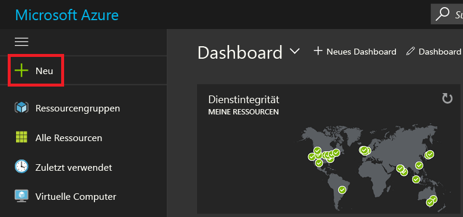
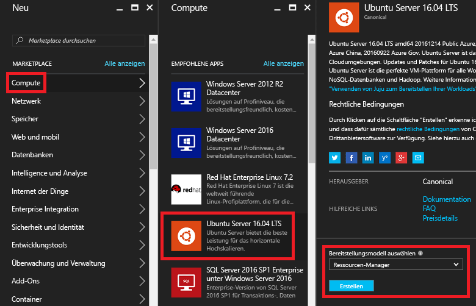
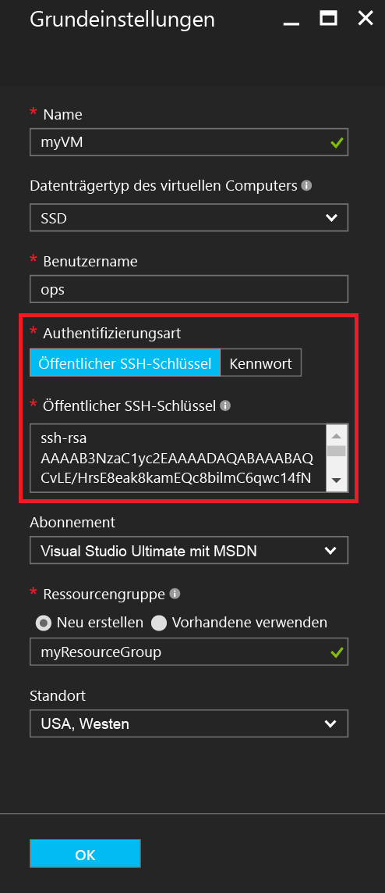
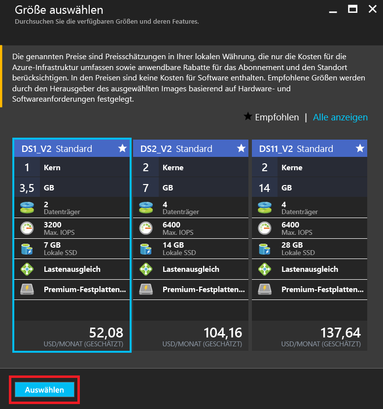
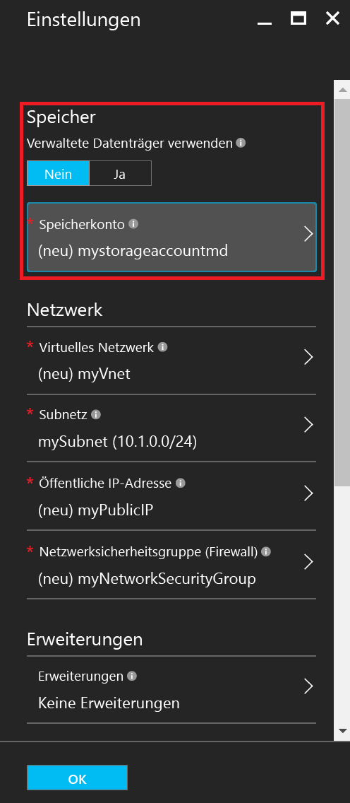
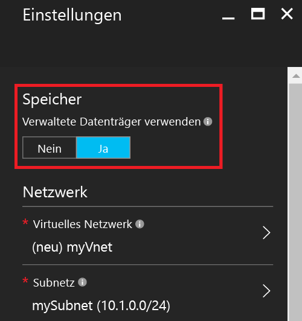
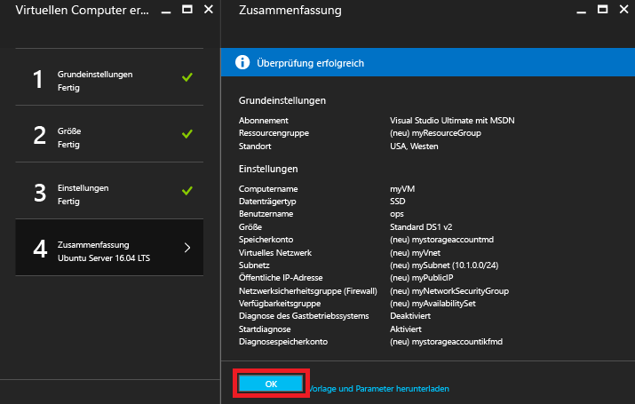
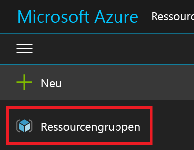
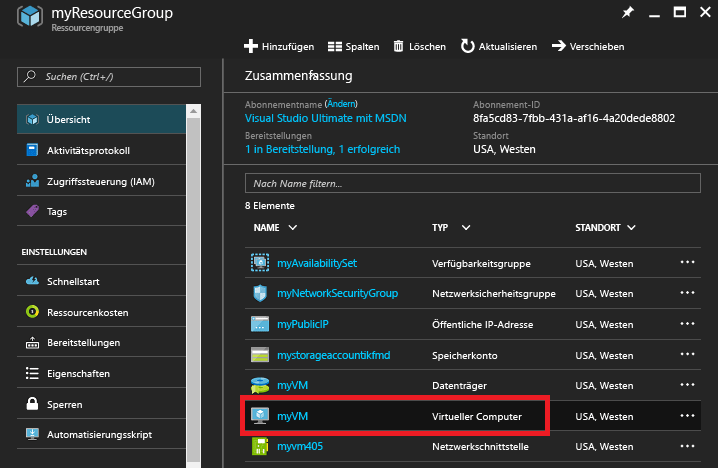
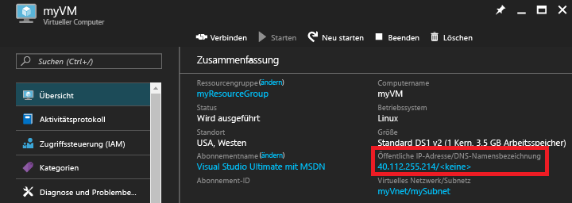

# <a name="create-a-linux-vm-on-azure-using-the-portal"></a>Erstellen eines virtuellen Linux-Computers in Azure mithilfe des Portals
In diesem Artikel erfahren Sie, wie Sie mithilfe des [Azure-Portals](https://portal.azure.com/) einen virtuellen Linux-Computer erstellen.

Folgende Anforderungen müssen erfüllt sein:

* [ein Azure-Konto](https://azure.microsoft.com/pricing/free-trial/)
* [Dateien mit den öffentlichen und privaten SSH-Schlüsseln](virtual-machines-linux-mac-create-ssh-keys.md?toc=%2fazure%2fvirtual-machines%2flinux%2ftoc.json)

## <a name="sign-in"></a>Anmelden
Melden Sie sich mit Ihrer Azure-Kontoidentität beim Azure-Portal an. Klicken Sie links oben auf **+ Neu**:



## <a name="choose-vm"></a>Virtuellen Computer auswählen
Klicken Sie im **Marketplace** auf **Compute**, und wählen Sie anschließend in der Imageliste **Ausgewählte Apps** auf **Ubuntu Server 16.04 LTS**.  Vergewissern Sie sich im unteren Bereich, dass das Bereitstellungsmodell auf `Resource Manager` festgelegt ist, und klicken Sie dann auf **Erstellen**.



## <a name="enter-vm-options"></a>VM-Optionen eingeben
Gehen Sie auf der Seite **Grundlagen** wie folgt vor:

* Geben Sie einen Namen für den virtuellen Computer ein.
* Geben Sie die Art des VM-Datenträgers ein (entweder die Standardeinstellung „SSD“ oder „HDD“).
* Geben Sie einen Benutzernamen für den Administratorbenutzer ein.
* Legen Sie den **Authentifizierungstyp** auf **Öffentlicher SSH-Schlüssel** fest.
* Geben Sie Ihren öffentlichen SSH-Schlüssel als Zeichenfolge (aus dem Verzeichnis `~/.ssh/`) ein.
* Geben Sie einen Ressourcengruppennamen ein, oder wählen Sie eine vorhandene Ressourcengruppe aus.

Klicken Sie auf **OK**, um den Vorgang fortzusetzen. Das Blatt sollte in etwa wie folgt aussehen:



## <a name="choose-vm-size"></a>VM-Größe auswählen
Wählen Sie eine VM-Größe aus. In den folgenden Beispielen wird **DS1_V2 Standard** verwendet. Bei dieser Option wird Ubuntu auf einem SSD-Premiumdatenträger installiert. Das **S** in der VM-Größe steht für die SSD-Unterstützung. Klicken Sie auf **Auswählen**, um die Einstellungen zu konfigurieren.



## <a name="storage-and-network"></a>Speicher und Netzwerk
Auf dem Blatt **Einstellungen** können Sie angeben, ob Sie für Ihren virtuellen Computer Azure Managed Disks verwenden möchten. Standardmäßig werden aktuell nicht verwaltete Datenträger verwendet. Verwaltete Datenträger (Azure Managed Disks) werden von der Azure-Plattform behandelt und erfordern keinerlei Vorbereitung und keinen Speicherort. Weitere Informationen zu Azure Managed Disks finden Sie in der [Übersicht über Managed Disks](../storage/storage-managed-disks-overview.md). Bei Verwendung nicht verwalteter Datenträger müssen Sie ein Speicherkonto für Ihre virtuellen Festplatten erstellen oder auswählen:



Wenn Sie sich für die Verwendung von Azure Managed Disks entscheiden, müssen keine weiteren Speicheroptionen konfiguriert werden, wie im folgenden Beispiel zu sehen:



Behalten Sie bei den restlichen Netzwerkeinstellungen die Standardwerte bei.

## <a name="confirm-vm-settings-and-launch"></a>VM-Einstellungen bestätigen und starten
Überprüfen Sie die Einstellungen für den neuen virtuellen Ubuntu-Computer, und klicken Sie auf **OK**.



## <a name="select-the-vm-resource"></a>Auswählen der VM-Ressource
Öffnen Sie die Startseite des Portals, und wählen Sie links oben über das Menü die Option **Ressourcengruppen** aus. Klicken Sie ggf. oben im Menü auf die drei Balken, um die Liste wie folgt zu erweitern:



Wählen Sie Ihre Ressourcengruppe aus, und klicken Sie anschließend auf Ihren neuen virtuellen Computer:



## <a name="find-the-public-ip"></a>Öffentliche IP-Adresse suchen
Zeigen Sie die öffentliche IP-Adresse** **an, die Ihrem virtuellen Computer zugewiesen ist:



## <a name="ssh-to-the-vm"></a>SSH-Verbindung mit der VM
Stellen Sie mithilfe Ihres öffentlichen SSH-Schlüssels eine SSH-Verbindung mit der öffentlichen IP-Adresse her.  Auf einer Mac- oder Linux-Arbeitsstation können Sie vom Terminal eine direkte SSH-Verbindung herstellen. Auf einer Windows-Arbeitsstation müssen Sie PuTTY, MobaXTerm oder Cygwin zum Herstellen einer Verbindung mit Linux über SSH verwenden.  Wenn Sie Ihre Windows-Arbeitsstation noch nicht zum Herstellen von SSH-Verbindungen mit Linux vorbereitet haben, finden Sie hier ein Dokument mit entsprechenden Erläuterungen:

[Verwenden von SSH-Schlüsseln mit Windows in Azure](virtual-machines-linux-ssh-from-windows.md?toc=%2fazure%2fvirtual-machines%2flinux%2ftoc.json)

```
ssh -i ~/.ssh/azure_id_rsa ops@40.112.255.214
```

## <a name="next-steps"></a>Nächste Schritte
Sie haben nun schnell eine Linux-VM zum Testen und für Demonstrationszwecke erstellt. Lesen Sie zum Erstellen eines virtuellen Linux-Computers, der an Ihre Infrastruktur angepasst ist, einen der folgenden Artikel:

* [Bereitstellen und Verwalten von virtuellen Computern mit Azure-Ressourcen-Manager-Vorlagen und der Azure-CLI](virtual-machines-linux-cli-deploy-templates.md?toc=%2fazure%2fvirtual-machines%2flinux%2ftoc.json)
* [Erstellen einer geschützten Linux-VM mit einer Azure-Vorlage](virtual-machines-linux-create-ssh-secured-vm-from-template.md?toc=%2fazure%2fvirtual-machines%2flinux%2ftoc.json)
* [Erstellen einer Linux-VM von Grund auf mit der Azure-Befehlszeilenschnittstelle](virtual-machines-linux-create-cli-complete.md?toc=%2fazure%2fvirtual-machines%2flinux%2ftoc.json)


