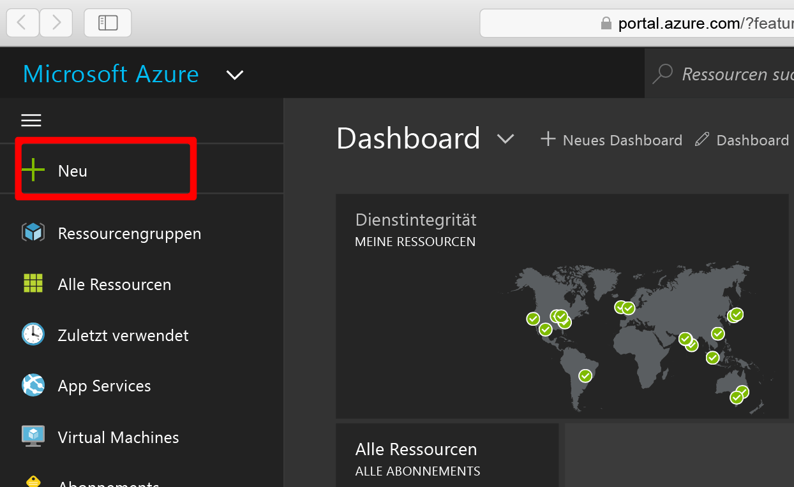
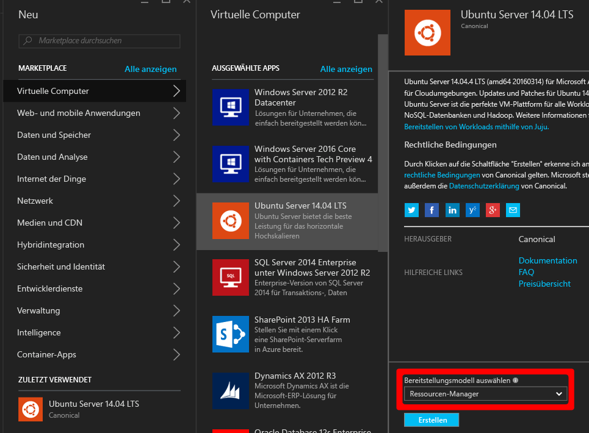
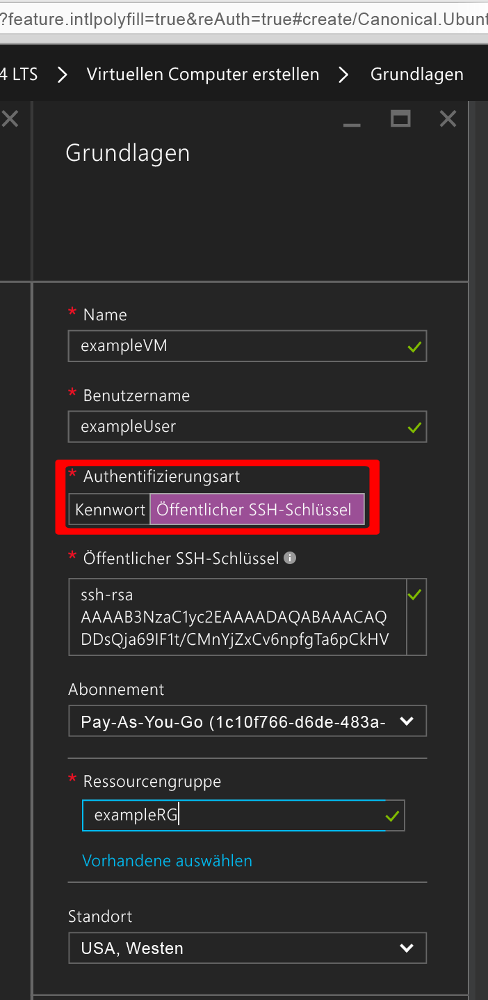
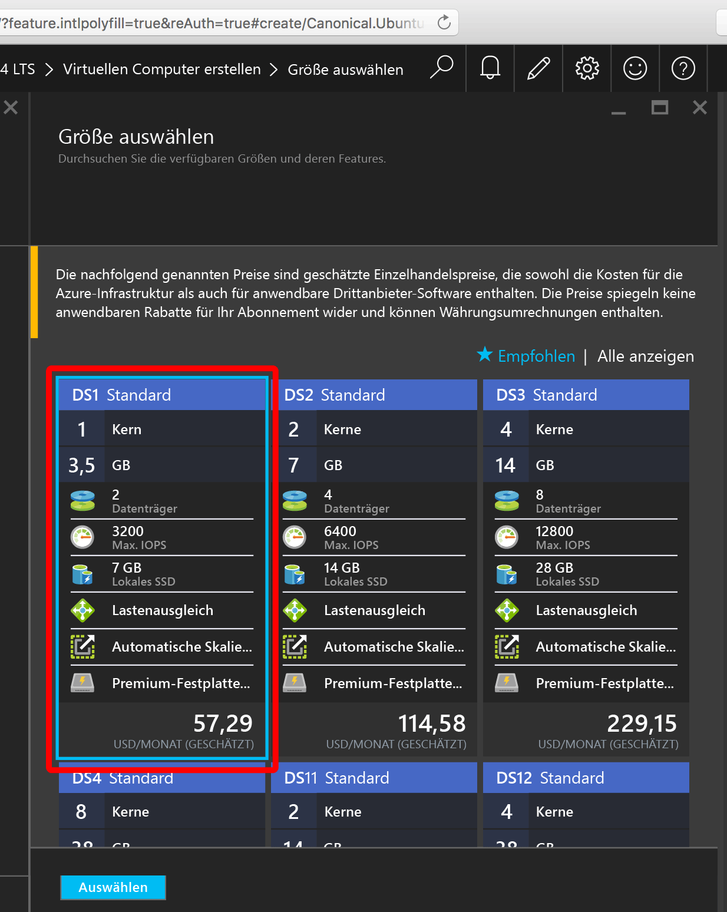
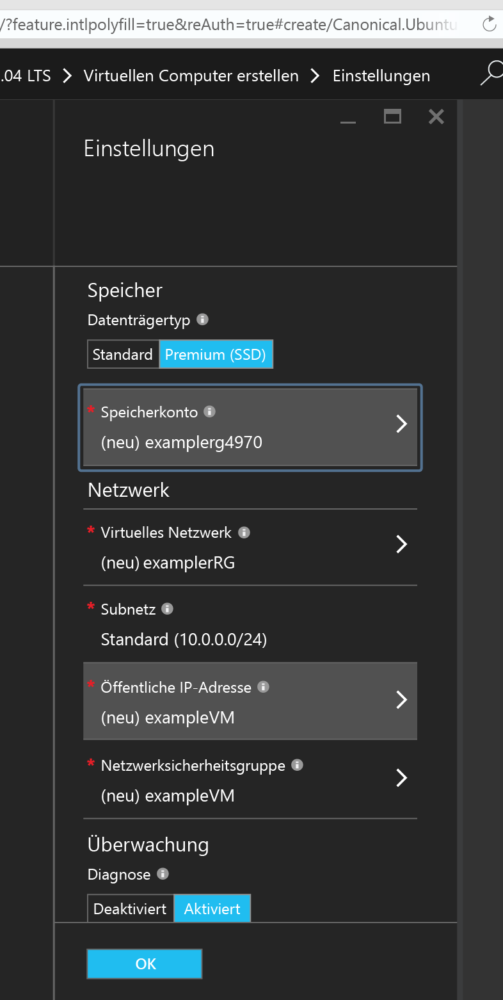
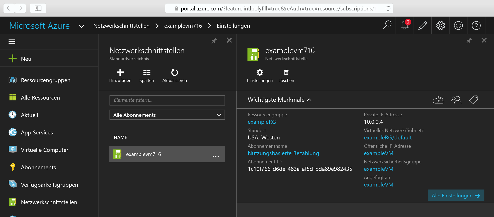
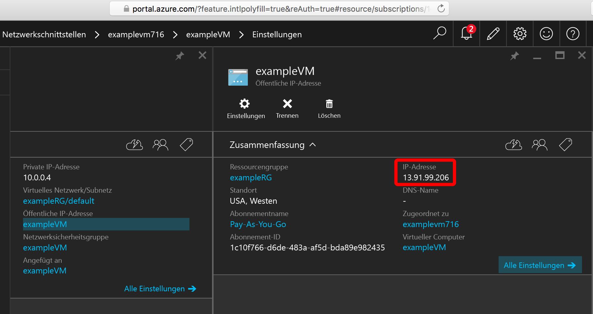

<properties
    pageTitle="Erstellen einer Linux-VM mit dem Azure-Portal | Microsoft Azure"
    description="Erstellen Sie eine Linux-VM mit dem Azure-Portal."
    services="virtual-machines-linux"
    documentationCenter=""
    authors="vlivech"
    manager="timlt"
    editor=""
    tags="azure-resource-manager"
/>

<tags
    ms.service="virtual-machines-linux"
    ms.workload="infrastructure-services"
    ms.tgt_pltfrm="vm-linux"
    ms.devlang="na"
    ms.topic="hero-article"
    ms.date="04/12/2016"
    ms.author="v-livech"
/>

# Erstellen eines virtuellen Linux-Computers in Azure mithilfe des Portals

In diesem Artikel wird beschrieben, wie Sie das [Azure-Portal](https://portal.azure.com/) zum schnellen Erstellen eines virtuellen Linux-Computers verwenden. Die einzigen Voraussetzungen sind [ein Azure-Konto](https://azure.microsoft.com/pricing/free-trial/) und [Dateien mit öffentlichen und privaten Schlüsseln](virtual-machines-linux-mac-create-ssh-keys.md).


1. Melden Sie sich mit Ihrer Azure-Kontoidentität am Azure-Portal an, und klicken Sie oben links auf **+ Neu**:

    

2. Klicken Sie im **Marketplace** auf **Virtual Machines** und dann in der Imageliste **Ausgewählte Apps** auf **Ubuntu Server 14.04 LTS**. Prüfen Sie im unteren Bereich, ob als Bereitstellungsmodelltyp `Resource Manager` verwendet wird, und klicken Sie dann auf **Erstellen**.

    

3. Gehen Sie auf der Seite **Grundlagen** wie folgt vor:
    - Geben Sie einen Namen für den virtuellen Computer ein.
    - Geben Sie einen Benutzernamen für den Administratorbenutzer ein.
    - Legen Sie den Authentifizierungstyp auf **Öffentlicher SSH-Schlüssel** fest.
    - Verwenden Sie Ihren öffentlichen SSH-Schlüssel als Zeichenfolge (standardmäßig aus dem Verzeichnis `~/.ssh/`).
    - Geben Sie einen Ressourcengruppennamen ein (um eine neue Bereitstellungsgruppe zu erstellen), oder wählen Sie eine vorhandene Gruppe aus.

    Klicken Sie auf **OK**, um fortzufahren und die VM-Größe auszuwählen. Etwa Folgendes sollte angezeigt werden:

    

4. Wählen Sie die Größe **DS1** aus, bei der Ubuntu auf einem Premium-SSD installiert wird, und klicken Sie auf **Auswählen**, um die Einstellungen zu konfigurieren.

    

5. Behalten Sie unter **Einstellungen** die Standardwerte für Speicher und Netzwerk bei, und klicken Sie auf **OK**, um die Zusammenfassung anzuzeigen. Durch die Auswahl „DS1“ wurde der Datenträgertyp auf „Premium-SSD“ festgelegt. Das **S** steht hierbei für SSD.

    

6. Bestätigen Sie die Einstellungen für den neuen virtuellen Ubuntu-Computer, und klicken Sie auf **OK**.

    

7. Öffnen Sie das Portal-Dashboard, und wählen Sie unter **Netzwerkschnittstellen** Ihre Netzwerkschnittstelle aus.

    

8. Öffnen Sie in den NIC-Einstellungen das Menü „Öffentliche IP-Adresse“.

    

9. SSH-Verbindung über die öffentliche IP-Adresse mit Ihrem öffentlichen SSH-Schlüssel

```
ahmetL@fedora$ ssh -i ~/.ssh/azure_id_rsa ubuntu@13.91.99.206
```

## Nächste Schritte

Sie haben nun schnell eine Linux-VM zum Testen und für Demonstrationszwecke erstellt. Lesen Sie zum Erstellen eines virtuellen Linux-Computers, der an Ihre Infrastruktur angepasst ist, einen der folgenden Artikel:

- [Bereitstellen und Verwalten von virtuellen Computern mit Azure-Ressourcen-Manager-Vorlagen und der Azure-CLI](virtual-machines-linux-cli-deploy-templates.md)
- [Erstellen einer geschützten Linux-VM mit einer Azure-Vorlage](virtual-machines-linux-create-ssh-secured-vm-from-template.md)
- [Erstellen einer Linux-VM von Grund auf mit der Azure-Befehlszeilenschnittstelle](virtual-machines-linux-create-cli-complete.md)

Diese Artikel beschreiben die ersten Schritte beim Erstellen einer Azure-Infrastruktur sowie einer beliebigen Anzahl von proprietären und Open Source-Tools zur Infrastrukturbereitstellung, -konfiguration und -orchestrierung.

<!---HONumber=AcomDC_0420_2016-->