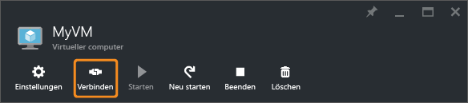

<properties
	pageTitle="Herstellen einer Verbindung mit einem virtuellen Windows Server-Computer | Microsoft Azure"
	description="Hier erfahren Sie, wie Sie unter Verwendung des Azure-Portals und des Resource Manager-Bereitstellungsmodells eine Verbindung mit einem virtuellen Windows-Computer herstellen und sich bei diesem Computer anmelden."
	services="virtual-machines-windows"
	documentationCenter=""
	authors="cynthn"
	manager="timlt"
	editor="tysonn"
	tags="azure-resource-manager"/>

<tags
	ms.service="virtual-machines-windows"
	ms.workload="infrastructure-services"
	ms.tgt_pltfrm="vm-windows"
	ms.devlang="na"
	ms.topic="get-started-article"
	ms.date="05/05/2016"
	ms.author="cynthn"/>

# Gewusst wie: Herstellen einer Verbindung mit einem virtuellen Azure-Computer unter Windows und Anmelden auf diesem Computer 

Verwenden Sie die Schaltfläche **Verbinden** im Azure-Portal, um eine Remotedesktopsitzung (RDP) zu starten. Zuerst stellen Sie eine Verbindung mit dem virtuellen Computer her, und dann melden Sie sich an.

## Herstellen einer Verbindung mit dem virtuellen Computer

1. Melden Sie sich am [Azure-Portal](https://portal.azure.com/) an, falls Sie dies noch nicht getan haben.

2.	Klicken Sie im Hub-Menü auf **Virtuelle Computer**.

3.	Wählen Sie den gewünschten virtuellen Computer aus der Liste aus.

4. Klicken Sie auf dem Blatt für den virtuellen Computer auf **Verbinden**.

	
	
 > [AZURE.TIP] Wenn die Schaltfläche „Verbinden“ im Portal ausgeblendet ist und keine [Express Route](../expressroute/expressroute-introduction.md)- oder [Site-to-Site-VPN](../vpn-gateway/vpn-gateway-howto-site-to-site-resource-manager-portal.md)-Verbindung mit Azure besteht, müssen Sie eine öffentliche IP-Adresse erstellen und dem virtuellen Computer zuweisen, damit Sie RDP nutzen können. Lesen Sie mehr über [öffentliche IP-Adressen in Azure](../virtual-network/virtual-network-ip-addresses-overview-arm.md).

## Anmelden beim virtuellen Computer

[AZURE.INCLUDE [virtual-machines-log-on-win-server](../../includes/virtual-machines-log-on-win-server.md)]

## Nächste Schritte

Informationen zum Behandeln von Verbindungsproblemen finden Sie unter [Problembehandlung bei Remotedesktopverbindungen mit einem Windows-basierten virtuellen Azure-Computer](virtual-machines-windows-troubleshoot-rdp-connection.md). Dieser Artikel führt Sie durch die Diagnose und Behebung von häufigen Problemen.

<!---HONumber=AcomDC_0518_2016-->