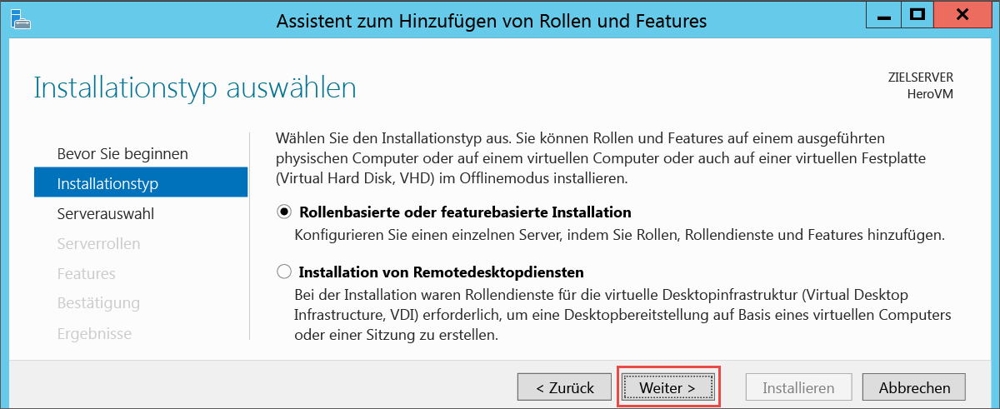
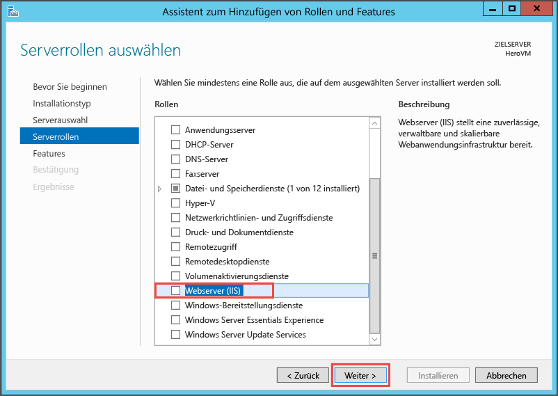
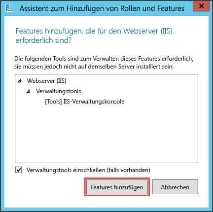
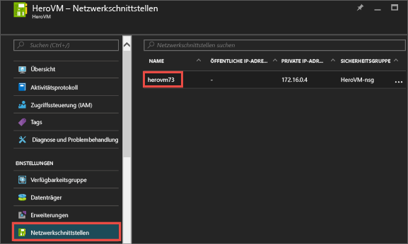
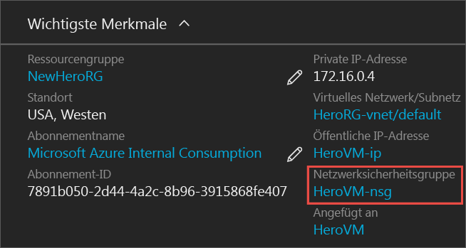
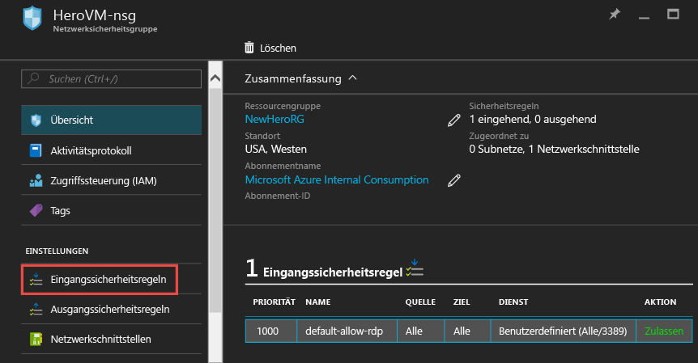
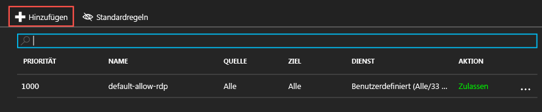
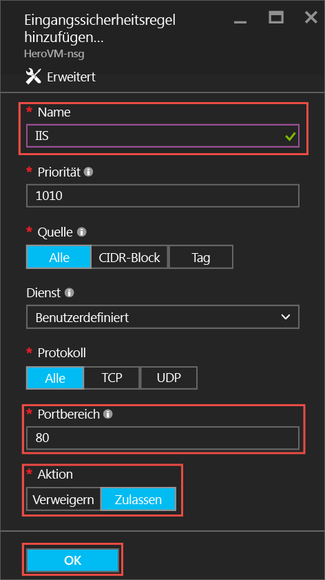
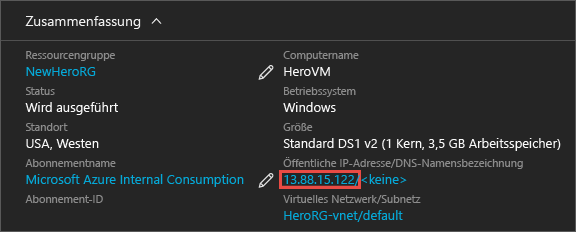
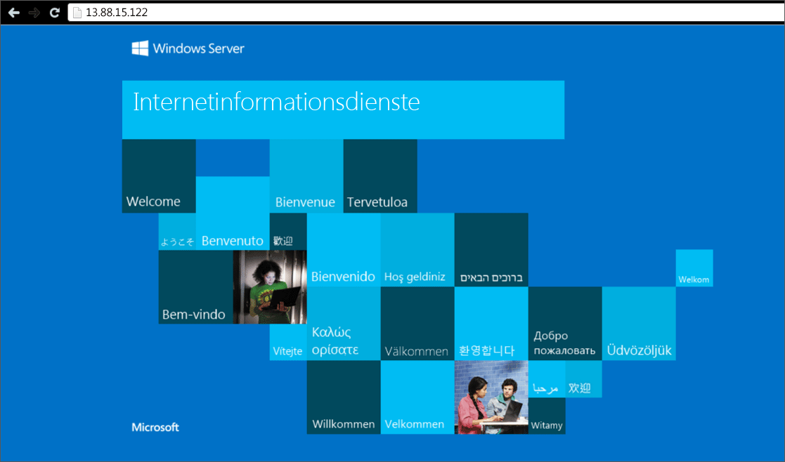

<properties
	pageTitle="Installieren von IIS auf Ihrer ersten Windows-VM | Microsoft Azure"
	description="Experimentieren Sie mit dem ersten virtuellen Windows-Computer, indem Sie mit dem Azure-Portal IIS installieren und Port 80 öffnen."
	keywords=""
	services="virtual-machines-windows"
	documentationCenter=""
	authors="cynthn"
	manager="timlt"
	editor=""
	tags="azure-resource-manager"/>
<tags
	ms.service="virtual-machines-windows"
	ms.workload="infrastructure-services"
	ms.tgt_pltfrm="vm-windows"
	ms.devlang="na"
	ms.topic="article"
	ms.date="09/06/2016"
	ms.author="cynthn"/>

# Experimentieren mit der Installation einer Rolle auf der Windows-VM
	
Sobald Ihr erster virtueller Computer (VM) ausgeführt wird, können Sie mit dem Installieren von Software und Diensten beginnen. In diesem Tutorial verwenden wir den Server-Manager auf der Windows Server-VM, um IIS zu installieren. Anschließend erstellen wir mit dem Azure-Portal eine Netzwerksicherheitsgruppe (NSG), um Port 80 für den IIS-Datenverkehr zu öffnen.

Wenn Sie Ihre erste VM noch nicht erstellt haben, sollten Sie [Erstellen Ihres ersten virtuellen Windows-Computers im Azure-Portal](virtual-machines-windows-hero-tutorial.md) durchgehen, bevor Sie mit diesem Tutorial fortfahren.

## Stellen Sie sicher, dass die VM ausgeführt wird

1. Öffnen Sie das [Azure-Portal](https://portal.azure.com).
2. Klicken Sie im Hubmenü auf **Virtuelle Computer**. Wählen Sie den gewünschten virtuellen Computer aus der Liste aus.
3. Wenn der Status **Beendet (Zuordnung aufgehoben)** ist, klicken Sie auf dem Blatt **Zusammenfassung** des virtuellen Computers auf die Schaltfläche **Starten**. Wenn der Status **Wird ausgeführt** ist, können Sie mit dem nächsten Schritt fortfahren.

## Herstellen einer Verbindung mit dem virtuellen Computer und Anmelden

1.	Klicken Sie im Hubmenü auf **Virtuelle Computer**. Wählen Sie den gewünschten virtuellen Computer aus der Liste aus.

3. Klicken Sie auf dem Blatt für den virtuellen Computer auf **Verbinden**. Dadurch wird eine Remotedesktopprotokoll-Datei (RDP-Datei) erstellt und heruntergeladen, mit der Sie wie bei einer Verknüpfung eine Verbindung mit Ihrem Computer herstellen können. Aus Komfortgründen empfiehlt es sich, die Datei auf dem Desktop abzulegen. Öffnen Sie die Datei, um eine Verbindung mit Ihrer VM herzustellen.

	

4. Es erscheint eine Warnung mit dem Hinweis, dass die RDP-Datei von einem unbekannten Herausgeber stammt. Dies ist normal. Klicken Sie im Fenster "Remotedesktop" auf **Verbinden**, um den Vorgang fortzusetzen.

	

5. Geben Sie im Fenster „Windows-Sicherheit“ den Benutzernamen und das Kennwort für das lokale Konto ein, das Sie beim Erstellen des virtuellen Computers erstellt haben. Der Benutzername muss im Format *VMName*&#92;*Benutzername* eingegeben werden. Klicken Sie anschließend auf **OK**.

	
 	
6.	Eine Warnung mit dem Hinweis, dass das Zertifikat nicht überprüft werden kann, wird angezeigt. Dies ist normal. Klicken Sie auf **Ja**, um die Identität des virtuellen Computers zu bestätigen und das Anmelden zu beenden.

	

Informationen zum Behandeln von Verbindungsproblemen finden Sie unter [Problembehandlung bei Remotedesktopverbindungen mit einem Windows-basierten virtuellen Azure-Computer](virtual-machines-windows-troubleshoot-rdp-connection.md).

## Installieren von IIS auf der VM

Nachdem Sie sich bei der VM angemeldet haben, installieren Sie eine Serverrolle, damit Sie noch etwas mehr experimentieren können.

1. Öffnen Sie den **Server-Manager**, sofern er noch nicht geöffnet ist. Klicken Sie im Menü **Start** auf **Server-Manager**.
2. Wählen Sie im **Server-Manager** im linken Bereich **Lokaler Server** aus.
3. Klicken Sie im Menü auf **Verwalten** > **Rollen und Features hinzufügen**.
4. Wählen Sie im Assistenten zum Hinzufügen von Rollen und Features auf der Seite **Installationstyp** die Option **Rollenbasierte oder featurebasierte Installation** aus, und klicken Sie dann auf **Weiter**.

	

5. Wählen Sie die VM aus dem Serverpool aus, und klicken Sie auf **Weiter**.
6. Wählen Sie auf der Seite **Serverrollen** die Option **Webserver (IIS)** aus.

	

7. Stellen Sie im Popupfenster zum Hinzufügen der erforderlichen Features für IIS sicher, dass **Verwaltungstools einschließen** ausgewählt ist, und klicken Sie dann auf **Features hinzufügen**. Nachdem das Popupfenster geschlossen wurde, klicken Sie im Assistenten auf **Weiter**.

	

8. Klicken Sie auf der Seite „Features“ auf **Weiter**.
9. Klicken Sie auf der Seite **Rolle „Webserver“ (IIS)** auf **Weiter**.
10. Klicken Sie auf der Seite **Rollendienste** auf **Weiter**.
11. Klicken Sie auf der Bestätigungsseite auf **Installieren**.
12. Klicken Sie nach Abschluss der Installation im Assistenten auf **Schließen**.

## Öffnen von Port 80 

Damit Ihre VM eingehenden Datenverkehr über Port 80 akzeptiert, müssen Sie der Netzwerksicherheitsgruppe eine Eingangsregel hinzufügen.

1. Öffnen Sie das [Azure-Portal](https://portal.azure.com).
2. Wählen Sie in **Virtuelle Computer** die VM aus, die Sie erstellt haben.
3. Wählen Sie in den Einstellungen für virtuelle Computer **Netzwerkschnittstellen** und dann die vorhandene Netzwerkschnittstelle aus.

	

4. Klicken Sie in der **Zusammenfassung** für die Netzwerkschnittstelle auf die **Netzwerksicherheitsgruppe**.

	

5. Auf dem Blatt **Zusammenfassung** für die Netzwerksicherheitsgruppe sollte eine Standardeingangsregel für **default-allow-rdp** vorhanden sein, die Ihnen die Anmeldung bei der VM ermöglicht. Sie fügen eine weitere Eingangsregel zum Zulassen von IIS-Datenverkehr hinzu. Klicken Sie auf **Eingangssicherheitsregel**.

	

6. Klicken Sie im Abschnitt **Eingangssicherheitsregeln** auf **Hinzufügen**.

	

7. Klicken Sie im Abschnitt **Eingangssicherheitsregeln** auf **Hinzufügen**. Geben Sie **80** für den Portbereich ein, und stellen Sie sicher, dass **Zulassen** ausgewählt ist. Klicken Sie anschließend auf **OK**.

	
 
Weitere Informationen zu Netzwerksicherheitsgruppen sowie Ein- und Ausgangsregeln finden Sie unter [Ermöglichen des externen Zugriffs auf einen virtuellen Computer über das Azure-Portal](virtual-machines-windows-nsg-quickstart-portal.md).
 
## Herstellen einer Verbindung mit der IIS-Standardwebsite

1. Klicken Sie im Azure-Portal auf **Virtuelle Computer**, und wählen Sie anschließend Ihre VM aus.
2. Kopieren Sie auf dem Blatt **Zusammenfassung** Ihre **Öffentliche IP-Adresse**.

	

2. Öffnen Sie einen Browser, und geben Sie Ihre öffentliche IP-Adresse wie folgt in die Adressleiste ein: http://<öffentlicheIPAdresse&gt. Drücken Sie anschließend die EINGABETASTE, um zu dieser Adresse zu wechseln.
3. Ihr Browser sollte die standardmäßige IIS-Webseite öffnen. Sie sieht etwa wie folgt aus:

	

    

## Nächste Schritte

- Sie können auch mit dem [Anfügen eines Datenträgers](virtual-machines-windows-attach-disk-portal.md) an Ihren virtuellen Computer experimentieren. Datenträger bieten mehr Speicherplatz für den virtuellen Computer.

<!---HONumber=AcomDC_0914_2016-->