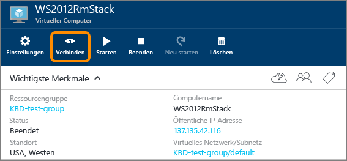

<properties
	pageTitle="Erstellen eines virtuellen Windows-Computers im Azure-Portal | Microsoft Azure"
	description="Lernen Sie, wie Sie einen virtuellen Windows-Computer mithilfe des Azure-Portals erstellen."
	keywords="virtuelle Windows-Maschine, Erstellen einer virtuellen Maschine, virtueller Computer, Einrichten einer virtuellen Maschine"
	services="virtual-machines-windows"
	documentationCenter=""
	authors="cynthn"
	manager="timlt"
	editor=""
	tags="azure-resource-manager"/>
<tags
	ms.service="virtual-machines-windows"
	ms.workload="infrastructure-services"
	ms.tgt_pltfrm="vm-windows"
	ms.devlang="na"
	ms.topic="hero-article"
	ms.date="04/14/2016"
	ms.author="cynthn"/>

# Erstellen einer virtuellen Windows-Maschine im Azure-Portal

In diesem Tutorial erfahren Sie, wie einfach es ist, in wenigen Minuten einen virtuellen Windows-Computer mithilfe des Azure-Portals zu erstellen. Als Beispiel wird ein Windows Server 2012 R2 Datacenter-Image verwendet. Dies ist jedoch nur eines von vielen Images, die Azure bietet. Ihre Imageauswahl hängt von Ihrem Abonnement ab. Beispielsweise können Desktop-Images für [MSDN-Abonnenten](https://azure.microsoft.com/pricing/member-offers/msdn-benefits-details/?WT.mc_id=A261C142F) verfügbar sein.

Wenn Sie über kein Azure-Abonnement verfügen, können Sie in wenigen Minuten ein [kostenloses Konto](https://azure.microsoft.com/free/) erstellen.

## Exemplarische Vorgehensweise per Video

Hier finden Sie ein [Video zur exemplarischen Vorgehensweise](https://channel9.msdn.com/Blogs/Azure-Documentation-Shorts/Create-A-Virtual-Machine-Running-Windows-In-The-Azure-Preview-Portal) für dieses Tutorial.

## Wählen Sie im Marketplace das virtuelle Windows 2012 R2-Computer-Image aus.

1. Melden Sie sich beim [Azure-Portal](https://portal.azure.com) an.

2. Klicken Sie im Menü „Hub“ auf **Neu** > **Compute** > **Windows Server 2012 R2 Datacenter**.

	

3. Wählen Sie auf der Seite **Windows Server 2012 R2 Datacenter** unter **Bereitstellungsmodell auswählen** die Option **Ressourcen-Manager** aus. Klicken Sie auf **Erstellen**.

	

## Erstellen des virtuellen Windows-Computers

Nachdem Sie das Image ausgewählt haben, können Sie für den Großteil der Konfiguration die Azure-Standardeinstellungen verwenden und den virtuellen Computer rasch erstellen.

1. Klicken Sie auf dem Blatt **Virtuellen Computer erstellen** auf **Grundlagen**.

2. Geben Sie den gewünschten **Namen** für den virtuellen Computer ein. Der Name darf keine Sonderzeichen enthalten.

3. Geben Sie einen **Benutzernamen** für die Verwaltung und ein sicheres **Kennwort** ein. Das Kennwort muss 8 bis 123 Zeichen lang sein und mindestens drei der folgenden Elemente enthalten: einen Kleinbuchstaben, einen Großbuchstaben, eine Zahl und ein Sonderzeichen. **Sie benötigen den Benutzernamen und das Kennwort, um sich mit dem virtuellen Computer zu verbinden**.

4. Wenn Sie über mehrere Abonnements verfügen, geben Sie das Abonnement für den neuen virtuellen Computer an. Wählen Sie eine neue oder vorhandene [Ressourcengruppe](../resource-group-overview/#resource-groups) und den **Standort** des Azure-Rechenzentrums aus, wie z.B. **USA, Westen**.

	

	
2. Klicken Sie auf **Größe**, und wählen Sie eine für Ihre Anforderungen geeignete Größe für den virtuellen Computer aus. Für jede Größe ist die Anzahl von Prozessorkernen, der Arbeitsspeicher und andere Features angegeben, wie z.B. Unterstützung für Storage Premium, die sich auf den Preis auswirken. Azure empfiehlt anhand des gewählten Images automatisch bestimmte Größen.

	

	>[AZURE.NOTE] Storage Premium steht für virtuelle Computer der DS-Reihe in bestimmten Regionen zur Verfügung. Storage Premium ist die beste Speicheroption für datenintensive Workloads wie Datenbanken. Nähere Informationen finden Sie unter [Premium-Speicher: Hochleistungsspeicher für Arbeitslasten auf virtuellen Azure-Computern](../storage/storage-premium-storage.md).

3. Klicken Sie auf **Einstellungen**, um die Speicher- und Netzwerkeinstellungen des neuen virtuellen Computers anzuzeigen. Für einen ersten virtuellen Computer können Sie im Allgemeinen die Standardeinstellungen übernehmen. Wenn Sie eine geeignete Größe für den virtuellen Computer ausgewählt haben, können Sie durch Auswahl von **Premium (SSD)** unter **Datenträgertyp** Storage Premium testen.

	

6. Klicken Sie auf **Zusammenfassung**, um Ihre Konfigurationsoptionen zu überprüfen. Wenn Sie die Einstellungen überprüft oder aktualisiert haben, klicken Sie auf **Erstellen**.

	

8. Während Azure den virtuellen Computer erstellt, können Sie den Status im Menü „Hub“ unter **Virtuelle Computer** nachverfolgen.

## Stellen Sie eine Verbindung mit dem virtuellen Computer her, und melden Sie sich an.

1. Melden Sie sich am [Azure-Portal](https://portal.azure.com/) an, falls Sie dies noch nicht getan haben.

2.	Klicken Sie im Hub-Menü auf **Virtuelle Computer**.

3.	Wählen Sie den gewünschten virtuellen Computer aus der Liste aus.

4. Klicken Sie auf dem Blatt für den virtuellen Computer auf **Verbinden**.

	

[AZURE.INCLUDE [virtual-machines-log-on-win-server](../../includes/virtual-machines-log-on-win-server.md)]

Wenn beim Verbindungsversuch Probleme auftreten, finden Sie unter [Problembehandlung bei Remotedesktopverbindungen mit einem Windows-basierten virtuellen Azure-Computer](virtual-machines-windows-troubleshoot-rdp-connection.md) Informationen dazu.

Sie können jetzt mit dem virtuellen Computer wie mit jedem anderen Server arbeiten.

## Nächste Schritte

* Sie können auch [mithilfe von Powershell einen virtuellen Windows-Computer](virtual-machines-windows-ps-create.md) oder [einen virtuellen Linux-Computer](virtual-machines-linux-quick-create-cli.md) mithilfe der Azure-Befehlszeilenschnittstelle erstellen.

<!---HONumber=AcomDC_0427_2016-->