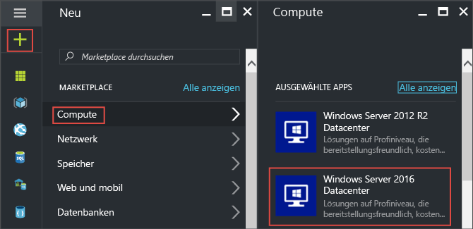
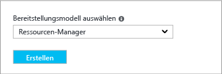
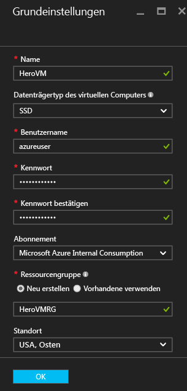
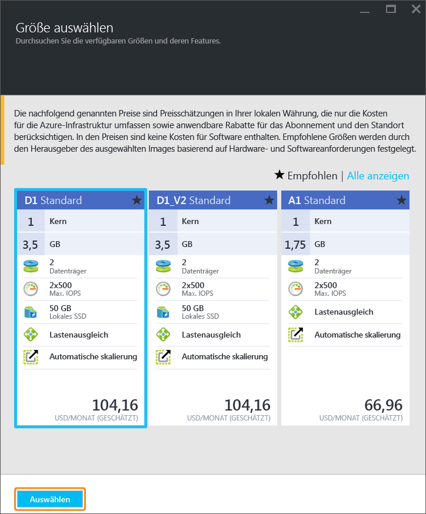
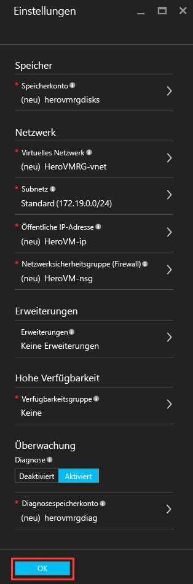
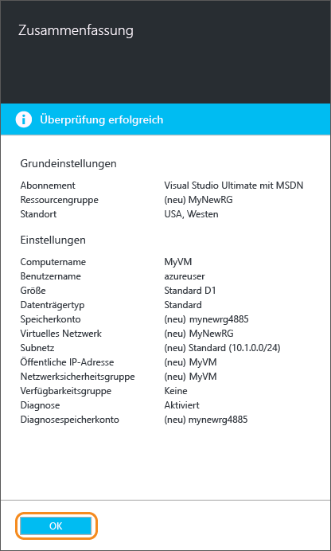
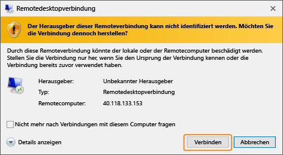
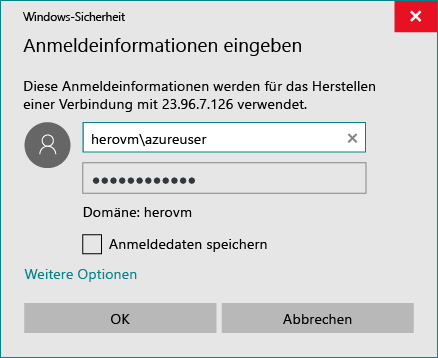
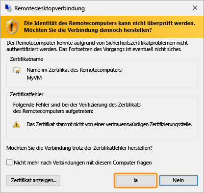
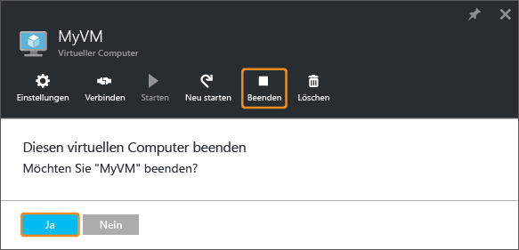

<properties
	pageTitle="Erstellen Ihres ersten virtuellen Windows-Computers | Microsoft Azure"
	description="Hier erfahren Sie, wie Sie mithilfe des Azure-Portals Ihren ersten virtuellen Windows-Computer erstellen."
	keywords="virtuelle Windows-Maschine, Erstellen einer virtuellen Maschine, virtueller Computer, Einrichten einer virtuellen Maschine"
	services="virtual-machines-windows"
	documentationCenter=""
	authors="cynthn"
	manager="timlt"
	editor=""
	tags="azure-resource-manager"/>
<tags
	ms.service="virtual-machines-windows"
	ms.workload="infrastructure-services"
	ms.tgt_pltfrm="vm-windows"
	ms.devlang="na"
	ms.topic="hero-article"
	ms.date="09/06/2016"
	ms.author="cynthn"/>

# Erstellen Ihres ersten virtuellen Windows-Computers im Azure-Portal

In diesem Tutorial erfahren Sie, wie einfach es ist, in wenigen Minuten einen virtuellen Windows-Computer (Virtual Machine, VM) im Azure-Portal zu erstellen.

Wenn Sie kein Azure-Abonnement besitzen, können Sie ein [kostenloses Konto](https://azure.microsoft.com/free/) erstellen, bevor Sie beginnen.

## Auswählen des VM-Image aus dem Marketplace

Als Beispiel wird ein Windows Server 2012 R2 Datacenter-Image verwendet. Dies ist jedoch nur eines von vielen Images, die Azure bietet. Ihre Imageauswahl hängt von Ihrem Abonnement ab. Für [MSDN-Abonnenten](https://azure.microsoft.com/pricing/member-offers/msdn-benefits-details/?WT.mc_id=A261C142F) sind beispielsweise einige Desktop-Images verfügbar.

1. Melden Sie sich auf dem [Azure-Portal](https://portal.azure.com) an.

2. Klicken Sie im Hubmenü auf **Neu** > **Virtuelle Computer** > **Windows Server 2012 R2 Datacenter**.

	

3. Vergewissern Sie sich, dass auf dem Blatt **Windows Server 2012 R2 Datacenter** unter **Bereitstellungsmodell auswählen** die Option **Resource Manager** ausgewählt ist. Klicken Sie auf **Erstellen**.

	

## Erstellen des virtuellen Windows-Computers

Nachdem Sie das Image ausgewählt haben, können Sie die Standardeinstellungen verwenden und den virtuellen Computer rasch erstellen.

1. Geben Sie auf dem Blatt **Grundlagen** einen Namen für den virtuellen Computer ein. Der Name kann bis zu 15 Zeichen lang sein und darf keine Sonderzeichen enthalten.

2. Geben Sie einen Benutzernamen und ein sicheres Kennwort für die Erstellung eines lokalen Kontos auf dem virtuellen Computer ein. Das lokale Konto wird für die Anmeldung bei dem virtuellen Computer sowie für dessen Verwaltung verwendet.

	Das Kennwort muss 8 bis 123 Zeichen lang sein und drei der folgenden vier Komplexitätsanforderungen erfüllen: ein Kleinbuchstabe, ein Großbuchstabe, eine Zahl und ein Sonderzeichen. Weitere Informationen finden Sie unter den [Anforderungen für Benutzernamen und Kennwörter](virtual-machines-windows-faq.md#what-are-the-username-requirements-when-creating-a-vm).

3. Wählen Sie eine vorhandene Ressourcengruppe aus, oder geben Sie den Namen für eine neue Ressourcengruppe ein. Geben Sie den Standort eines Azure-Datencenters ein (beispielsweise **USA, Westen**).

4. Klicken Sie anschließend auf **OK**, um zum nächsten Abschnitt zu gelangen.

	

	
5. Wählen Sie eine VM-Größe aus, und klicken Sie anschließend auf **Auswählen**, um den Vorgang fortzusetzen.

	

6. Auf dem Blatt **Einstellungen** können Sie die Speicher- und Netzwerkoptionen ändern. Übernehmen Sie für dieses Tutorial die Standardwerte. Wenn Sie eine geeignete Größe für den virtuellen Computer ausgewählt haben, können Sie durch Auswahl von **Premium (SSD)** unter **Datenträgertyp** Azure Storage Premium testen. Klicken Sie auf **OK**, nachdem Sie alle gewünschten Änderungen vorgenommen haben.

	

7. Klicken Sie auf **Zusammenfassung**, um Ihre Auswahl zu überprüfen. Wenn die Meldung **Überprüfung erfolgreich** angezeigt wird, klicken Sie auf **OK**.

	

8. Im Hubmenü können Sie unter **Virtuelle Computer** den Erstellungsstatus des virtuellen Computers nachverfolgen.

## Herstellen einer Verbindung mit dem virtuellen Computer und Anmelden

1.	Klicken Sie im Hubmenü auf **Virtuelle Computer**.

2.	Wählen Sie den gewünschten virtuellen Computer aus der Liste aus.

3. Klicken Sie auf dem Blatt für den virtuellen Computer auf **Verbinden**. Dadurch wird eine Remotedesktopprotokoll-Datei (RDP-Datei) erstellt und heruntergeladen, mit der Sie wie bei einer Verknüpfung eine Verbindung mit Ihrem Computer herstellen können. Aus Komfortgründen empfiehlt es sich, die Datei auf dem Desktop abzulegen. Öffnen Sie die Datei, um eine Verbindung mit Ihrer VM herzustellen.

	

4. Es erscheint eine Warnung mit dem Hinweis, dass die RDP-Datei von einem unbekannten Herausgeber stammt. Dies ist normal. Klicken Sie im Fenster "Remotedesktop" auf **Verbinden**, um den Vorgang fortzusetzen.

	

5. Geben Sie im Fenster „Windows-Sicherheit“ den Benutzernamen und das Kennwort für das lokale Konto ein, das Sie beim Erstellen des virtuellen Computers erstellt haben. Der Benutzername muss im Format *VMName*&#92;*Benutzername* eingegeben werden. Klicken Sie anschließend auf **OK**.

	
 	
6.	Eine Warnung mit dem Hinweis, dass das Zertifikat nicht überprüft werden kann, wird angezeigt. Dies ist normal. Klicken Sie auf **Ja**, um die Identität des virtuellen Computers zu bestätigen und das Anmelden zu beenden.

	

Informationen zum Behandeln von Verbindungsproblemen finden Sie unter [Problembehandlung bei Remotedesktopverbindungen mit einem Windows-basierten virtuellen Azure-Computer](virtual-machines-windows-troubleshoot-rdp-connection.md).

Sie können jetzt mit dem virtuellen Computer wie mit jedem anderen Server arbeiten.

## Optional: Beenden des virtuellen Computers

Es empfiehlt sich, den virtuellen Computer wieder zu beenden, damit keine Kosten anfallen, obwohl Sie ihn gar nicht verwenden. Klicken Sie einfach auf **Beenden** und anschließend auf **Ja**.

	
Wenn Sie den virtuellen Computer wieder verwenden möchten, klicken Sie auf die Schaltfläche **Starten**, um ihn neu zu starten.

## Nächste Schritte

- Durch die [Installation von IIS](virtual-machines-windows-hero-role.md) können Sie mit dem neuen virtuellen Computer experimentieren. Dieses Tutorial veranschaulicht auch, wie Sie mithilfe einer Netzwerksicherheitsgruppe (NSG) Port 80 für eingehenden Webdatenverkehr öffnen.

- Darüber hinaus haben Sie die Möglichkeit zum [Erstellen einer Windows-VM mit PowerShell](virtual-machines-windows-ps-create.md) sowie zum [Erstellen eines virtuellen Linux-Computers](virtual-machines-linux-quick-create-cli.md) mithilfe der Befehlszeilenschnittstelle.

- Falls Sie Bereitstellungen automatisieren möchten, lesen Sie die Informationen unter [Erstellen Sie einen virtuellen Windows-Computer mit einer Resource Manager-Vorlage](virtual-machines-windows-ps-template.md).

<!-----HONumber=AcomDC_0912_2016--->