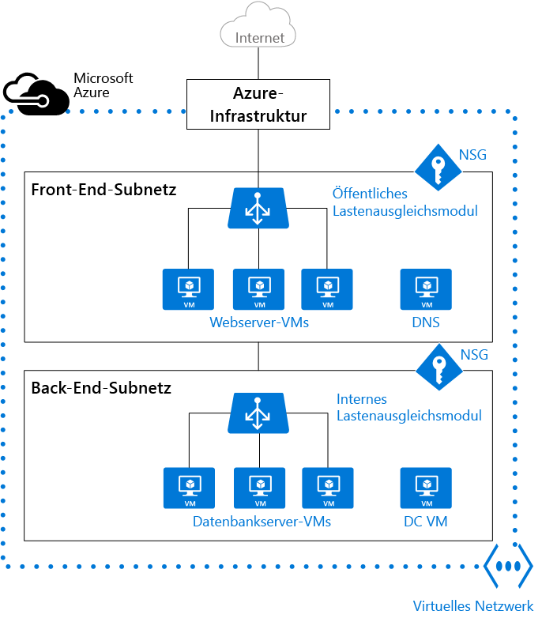

# Virtuelle Netzwerke und virtuelle Windows-Computer in Azure 

Beim Erstellen eines virtuellen Azure-Computers (VM) müssen Sie ein [virtuelles Netzwerk](../virtual-network/virtual-networks-overview.md) (VNet) erstellen oder ein vorhandenes VNet verwenden. Außerdem müssen Sie entscheiden, wie auf Ihre VMs im VNet zugegriffen werden soll. Es ist wichtig, [vor dem Erstellen von Ressourcen einen Plan aufzustellen](../virtual-network/virtual-network-vnet-plan-design-arm.md) und sicherzustellen, dass Sie die [Einschränkungen von Netzwerkressourcen](../azure-subscription-service-limits.md#networking-limits) verstehen.

In der folgenden Abbildung werden VMs als Webserver und Datenbankserver dargestellt. Alle Gruppen mit VMs werden im VNet separaten Subnetzen zugewiesen.

Sie können ein VNet entweder vor der Erstellung einer VM erstellen oder dies beim Erstellen einer VM durchführen. Sie müssen das VNet entweder selbst erstellen, oder der Vorgang wird für Sie beim Erstellen einer VM durchgeführt.

Sie erstellen diese Ressourcen, um die Kommunikation mit einer VM zu unterstützen:

- Netzwerkschnittstellen
- IP-Adressen
- Virtuelles Netzwerk und Subnetze

Zusätzlich zu diesen grundlegenden Ressourcen sollten Sie auch die folgenden optionalen Ressourcen berücksichtigen:

- Netzwerksicherheitsgruppen
- Load Balancer 

## Netzwerkschnittstellen

Eine [Netzwerkschnittstelle (NIC)](../virtual-network/virtual-network-network-interface.md) ist die Verbindung zwischen einer VM und einem virtuellen Netzwerk (VNet). Eine VM muss mindestens eine NIC haben. Es können je nach der Größe Ihrer erstellten VM aber auch mehr sein. Informationen dazu, wie viele NICs für die einzelnen VM-Größen unterstützt werden, finden Sie unter [Größen für virtuelle Computer in Azure](virtual-machines-windows-sizes.md). 

Falls Sie eine VM mit mehr als einer NIC erstellen möchten, müssen Sie für die VM logischerweise mindestens zwei NICs erstellen.  Nach der Erstellung können Sie weitere NICs bis zur für die VM-Größe unterstützten Anzahl hinzufügen, aber Sie können einer VM, die nur mit einer NIC erstellt wurde, keine weiteren NICs hinzufügen. Hierbei spielt es keine Rolle, wie viele NICs für die VM-Größe unterstützt werden. 

Wenn die VM einer Verfügbarkeitsgruppe hinzugefügt wird, müssen alle VMs in der Verfügbarkeitsgruppe über mindestens eine NIC verfügen. VMs mit mehr als einer NIC müssen nicht die gleiche Anzahl von NICs aufweisen, aber sie müssen alle mindestens über zwei NICs verfügen.

Jede NIC, die an eine VM angefügt ist, muss sich an demselben Standort und unter demselben Abonnement wie die VM befinden. Jede NIC muss mit einem VNET verbunden werden, das in derselben Azure-Region und unter demselben Abonnement wie die NIC vorhanden ist. Nachdem eine NIC erstellt wurde, können Sie zwar noch das Subnetz ändern, mit dem sie verbunden ist, jedoch nicht mehr das VNET, mit dem sie verbunden ist.  Jeder NIC, die an eine VM angefügt ist, wird eine MAC-Adresse zugewiesen, die sich nicht ändert, bis die VM gelöscht wird.

In dieser Tabelle sind die Methoden aufgeführt, die Sie zum Erstellen einer Netzwerkschnittstelle verwenden können.

| Methode | Beschreibung |
| ------ | ----------- |
| Azure-Portal | Beim Erstellen einer VM im Azure-Portal wird automatisch eine Netzwerkschnittstelle für Sie erstellt (die Verwendung einer separat erstellten NIC ist nicht möglich). Das Portal erstellt eine VM mit nur einer NIC. Falls Sie eine VM mit mehr als einer NIC erstellen möchten, müssen Sie eine andere Methode verwenden. |
| [Azure PowerShell](../virtual-network/virtual-network-deploy-multinic-arm-ps.md) | Verwenden Sie [New-AzureRmNetworkInterface](https://docs.microsoft.com/powershell/resourcemanager/AzureRM.Network/v1.0.13/New-AzureRmNetworkInterface) mit dem Parameter **-PublicIpAddressId**, um den Bezeichner der zuvor erstellten öffentlichen IP-Adresse anzugeben. |
| [Azure-Befehlszeilenschnittstelle](../virtual-network/virtual-network-deploy-multinic-arm-cli.md) | Verwenden Sie zum Angeben des Bezeichners der zuvor erstellten öffentlichen IP-Adresse [az network nic create](https://docs.microsoft.com/cli/azure/network/nic#create) mit dem Parameter **--public-ip-address**. |
| [Vorlage](../virtual-network/virtual-network-deploy-multinic-arm-template.md) | Verwenden Sie [Network Interface in a Virtual Network with Public IP Address](https://github.com/Azure/azure-quickstart-templates/tree/master/101-nic-publicip-dns-vnet) (Netzwerkschnittstelle in einem virtuellen Netzwerk mit öffentlicher IP-Adresse) als Anleitung zum Bereitstellen einer Netzwerkschnittstelle mit einer Vorlage. |

## IP-Adressen 

Sie können diese Arten von [IP-Adressen](../virtual-network/virtual-network-ip-addresses-overview-arm.md) einer NIC in Azure zuweisen:

- **Öffentliche IP-Adressen**: Werden für die eingehende und ausgehende Kommunikation (ohne Netzwerkadressübersetzung (NAT)) mit dem Internet und anderen Azure-Ressourcen verwendet, die nicht mit einem VNet verbunden sind. Das Zuweisen einer öffentlichen IP-Adresse zu einer NIC ist optional. Für öffentliche IP-Adressen wird eine geringe Gebühr berechnet, und es kann nur eine bestimmte Anzahl dieser IP-Adressen pro Abonnement verwendet werden.
- **Private IP-Adressen**: Werden für die Kommunikation in einem VNet, in Ihrem lokalen Netzwerk und mit dem Internet (mit NAT) verwendet. Sie müssen einer VM mindestens eine private IP-Adresse zuweisen. Weitere Informationen zu NAT in Azure finden Sie unter [Grundlegendes zu ausgehenden Verbindungen in Azure](../load-balancer/load-balancer-outbound-connections.md).

Sie können öffentliche IP-Adressen VMs oder Lastenausgleichsmodulen mit Internetzugriff zuweisen. Sie können private IP-Adressen VMs und internen Lastenausgleichsmodulen zuweisen. Die Zuweisung von IP-Adressen zu einer VM erfolgt über eine Netzwerkschnittstelle.

Es gibt zwei Methoden zum Zuordnen einer IP-Adresse zu einer Ressource: dynamisch oder statisch. Die Standardmethode für die Zuordnung ist dynamisch. Bei diesem Verfahren wird eine IP-Adresse nicht zum Zeitpunkt ihrer Erstellung zugewiesen. Stattdessen wird die IP-Adresse zugeordnet, wenn Sie eine VM erstellen oder eine beendete VM starten. Die IP-Adresse wird freigegeben, wenn Sie die VM beenden oder löschen. 

Damit die IP-Adresse für die VM unverändert bleibt, können Sie die Zuordnungsmethode explizit auf „Statisch“ festlegen. In diesem Fall wird sofort eine IP-Adresse zugewiesen. Sie wird nur freigegeben, wenn Sie die VM löschen oder deren Zuordnungsmethode in „Dynamisch“ ändern.
    
In dieser Tabelle sind die Methoden aufgeführt, die Sie zum Erstellen einer IP-Adresse verwenden können.

| Methode | Beschreibung |
| ------ | ----------- |
| [Azure-Portal](../virtual-network/virtual-network-deploy-static-pip-arm-portal.md) | Öffentliche IP-Adressen sind standardmäßig dynamisch. Die ihnen zugewiesene Adresse kann sich daher ändern, wenn die VM beendet oder gelöscht wird. Erstellen Sie eine statische öffentliche IP-Adresse, um sicherzustellen, dass für die VM immer die gleiche öffentliche IP-Adresse verwendet wird. Standardmäßig wird einer NIC beim Erstellen einer VM vom Portal eine dynamische private IP-Adresse zugewiesen. Sie können dies in „Statisch“ ändern, nachdem die VM erstellt wurde.|
| [Azure PowerShell](../virtual-network/virtual-network-deploy-static-pip-arm-ps.md) | Sie verwenden [New-AzureRmPublicIpAddress](https://docs.microsoft.com/powershell/resourcemanager/AzureRM.Network/v1.0.13/New-AzureRmPublicIpAddress) mit dem Parameter **-AllocationMethod** und dem Wert „Dynamic“ oder „Static“. |
| [Azure-Befehlszeilenschnittstelle](../virtual-network/virtual-network-deploy-static-pip-arm-cli.md) | Sie verwenden [az network public-ip create](https://docs.microsoft.com/cli/azure/network/public-ip#create) mit dem Parameter **--allocation-method** und dem Wert „Dynamic“ oder „Static“. |
| [Vorlage](../virtual-network/virtual-network-deploy-static-pip-arm-template.md) | Verwenden Sie [Network Interface in a Virtual Network with Public IP Address](https://github.com/Azure/azure-quickstart-templates/tree/master/101-nic-publicip-dns-vnet) (Netzwerkschnittstelle in einem virtuellen Netzwerk mit öffentlicher IP-Adresse) als Anleitung zum Bereitstellen einer öffentlichen IP-Adresse mit einer Vorlage. |

Nach dem Erstellen einer öffentlichen IP-Adresse können Sie diese einer VM zuordnen, indem Sie sie einer NIC zuweisen.

## Virtuelles Netzwerk und Subnetze

Ein Subnetz ist ein Bereich von IP-Adressen im VNet. Sie können ein VNet aus Organisations- und Sicherheitsgründen in mehrere Subnetze unterteilen. Jede NIC einer VM ist mit einem Subnetz im VNet verbunden. NICs, die mit (gleichen oder anderen) Subnetzen in einem VNet verbunden sind, können ohne zusätzliche Konfiguration miteinander kommunizieren.

Beim Einrichten eines VNet geben Sie die Topologie an, einschließlich der verfügbaren Adressräume und Subnetze. Wenn das VNet mit anderen VNets oder lokalen Netzwerken verbunden werden soll, müssen Sie Adressbereiche auswählen, die sich nicht überlappen. Die IP-Adressen sind privat und nicht über das Internet zugänglich. Dies galt bisher nur für die nicht routingfähigen IP-Adressen, z.B. 10.0.0.0/8, 172.16.0.0/12 oder 192.168.0.0/16. Jetzt werden alle Adressbereiche von Azure als Teil des privaten VNet-IP-Adressraums behandelt, der nur innerhalb des VNets, innerhalb von miteinander verbundenen VNets und von Ihrem lokalen Standort aus erreichbar ist. 

Wenn Sie in einer Organisation arbeiten, in der eine andere Person als Sie für die internen Netzwerke zuständig ist, sollten Sie sich mit dieser Person in Verbindung setzen, bevor Sie den Adressraum auswählen. Stellen Sie sicher, dass es nicht zu Überlappungen kommt, und informieren Sie die Person über den gewünschten Adressraum, damit dieser Bereich von IP-Adressen nur einmal verwendet wird. 

Standardmäßig besteht keine Sicherheitsgrenze zwischen Subnetzen, sodass VMs in diesen Subnetzen miteinander kommunizieren können. Sie können aber Netzwerksicherheitsgruppen (NSGs) einrichten, mit denen Sie den Datenverkehrsfluss für Subnetze und VMs in eingehender und ausgehender Richtung steuern können. 

In dieser Tabelle sind die Methoden aufgeführt, die Sie zum Erstellen eines VNet und von Subnetzen verwenden können.    

| Methode | Beschreibung |
| ------ | ----------- |
| [Azure-Portal](../virtual-network/virtual-networks-create-vnet-arm-pportal.md) | Wenn Sie bei der Erstellung einer VM zulassen, dass von Azure ein VNet erstellt wird, ist der Name eine Kombination aus dem Namen der Ressourcengruppe, die das VNet enthält, und dem Zusatz **-vnet**. Der Adressraum ist 10.0.0.0/24, der erforderliche Subnetzname lautet **default**, und der Adressbereich des Subnetzes ist 10.0.0.0/24. |
| [Azure PowerShell](../virtual-network/virtual-networks-create-vnet-arm-ps.md) | Sie verwenden [New-AzureRmVirtualNetworkSubnetConfig](https://docs.microsoft.com/powershell/resourcemanager/AzureRM.Network/v1.0.13/New-AzureRmVirtualNetworkSubnetConfig) und [New-AzureRmVirtualNetwork](https://docs.microsoft.com/powershell/resourcemanager/AzureRM.Network/v1.0.13/New-AzureRmVirtualNetwork), um ein Subnetz und ein VNet zu erstellen. Sie können auch [Add-AzureRmVirtualNetworkSubnetConfig](https://docs.microsoft.com/powershell/resourcemanager/AzureRM.Network/v1.0.13/Add-AzureRmVirtualNetworkSubnetConfig) verwenden, um ein Subnetz einem vorhandenen VNet hinzuzufügen. |
| [Azure-Befehlszeilenschnittstelle](../virtual-network/virtual-networks-create-vnet-arm-cli.md) | Das Subnetz und das VNet werden gleichzeitig erstellt. Geben Sie für [az network vnet create](https://docs.microsoft.com/cli/azure/network/vnet#create) den Parameter **--subnet-name** mit dem Subnetznamen an. |
| [Vorlage](../virtual-network/virtual-networks-create-vnet-arm-template-click.md) | Die einfachste Möglichkeit zum Erstellen eines VNet und von Subnetzen ist das Herunterladen einer vorhandenen Vorlage, z.B. [Virtual Network with two Subnets](https://github.com/Azure/azure-quickstart-templates/tree/master/101-vnet-two-subnets) (Virtuelles Netzwerk mit zwei Subnetzen), und die anschließende Anpassung gemäß Ihren Anforderungen. |

## Netzwerksicherheitsgruppen

Eine [Netzwerksicherheitsgruppe (NSG)](../virtual-network/virtual-networks-nsg.md) enthält eine Liste mit ACL-Regeln (Access Control List, Zugriffssteuerungsliste) zum Zulassen oder Verweigern von Netzwerkdatenverkehr an Subnetze, NICs oder beides. NSGs können entweder Subnetzen oder einzelnen NICs zugeordnet werden, die mit einem Subnetz verbunden sind. Wenn eine NSG einem Subnetz zugeordnet ist, gelten die ACL-Regeln für alle VMs in diesem Subnetz. Darüber hinaus kann Datenverkehr zu einer einzelnen NIC beschränkt werden, indem eine NSG direkt einer NIC zugewiesen wird.

NGSs enthalten zwei Regelsätze: eingehende und ausgehende Regeln. Die Priorität für eine Regel muss innerhalb jedes Satzes eindeutig sein. Jede Regel verfügt über Eigenschaften für Protokoll, Quell- und Zielportbereiche, Adresspräfixe, Richtung des Datenverkehrs, Priorität und Zugriffstyp. 

Alle NSGs enthalten eine Gruppe von Standardregeln. Die Standardregeln können zwar nicht gelöscht werden, haben aber niedrigste Priorität und können somit durch selbst erstellte Regeln außer Kraft gesetzt werden. 

Wenn Sie eine NSG zu einer Netzwerkkarte zuordnen, werden die Netzwerkzugriffsregeln in der NSG nur auf diese Netzwerkkarte angewendet. Wenn eine NSG auf eine einzelne NIC auf einer VM mit mehreren NICs angewendet wird, hat dies keine Auswirkung auf den Datenverkehr zu den anderen NICs. Sie können verschiedene NSGs einer NIC (oder einer VM, je nach Bereitstellungsmodell) und dem Subnetz zuordnen, an das eine Netzwerkkarte oder ein virtueller Computer gebunden ist. Die Priorität richtet sich nach der Richtung des Datenverkehrs.

[Planen](../virtual-network/virtual-networks-nsg.md#planning) Sie beim Planen von VMs und des VNet auch die NSGs.

In dieser Tabelle sind die Methoden aufgeführt, die Sie zum Erstellen einer Netzwerksicherheitsgruppe verwenden können.

| Methode | Beschreibung |
| ------ | ----------- |
| [Azure-Portal](../virtual-network/virtual-networks-create-nsg-arm-pportal.md) | Wenn Sie im Azure-Portal eine VM erstellen, wird automatisch eine NSG erstellt und der vom Portal erstellten NIC zugeordnet. Der Name der NSG ist eine Kombination aus dem Namen der VM und dem Zusatz **-nsg**. Diese NSG enthält eine Regel für eingehenden Datenverkehr mit einer Priorität von 1000, RDP als Dienst, TCP als Protokoll, 3389 als Port und der Einstellung „Allow“ als Aktion. Wenn Sie anderen eingehenden Datenverkehr für die VM zulassen möchten, müssen Sie der NSG zusätzliche Regeln hinzufügen. |
| [Azure PowerShell](../virtual-network/virtual-networks-create-nsg-arm-ps.md) | Verwenden Sie [New-AzureRmNetworkSecurityRuleConfig](https://docs.microsoft.com/powershell/resourcemanager/AzureRM.Network/v1.0.13/New-AzureRmNetworkSecurityRuleConfig), und geben Sie die erforderlichen Informationen für die Regel an. Verwenden Sie [New-AzureRmNetworkSecurityGroup](https://docs.microsoft.com/powershell/resourcemanager/AzureRM.Network/v1.0.13/New-AzureRmNetworkSecurityGroup), um die NSG zu erstellen. Verwenden Sie [Set-AzureRmVirtualNetworkSubnetConfig](https://docs.microsoft.com/powershell/resourcemanager/AzureRM.Network/v1.0.13/Set-AzureRmVirtualNetworkSubnetConfig), um die NSG für das Subnetz zu konfigurieren. Verwenden Sie [Set-AzureRmVirtualNetwork](https://docs.microsoft.com/powershell/resourcemanager/AzureRM.Network/v1.0.13/Set-AzureRmVirtualNetwork?redirectedfrom=msdn), um die NSG dem VNet hinzuzufügen. |
| [Azure-Befehlszeilenschnittstelle](../virtual-network/virtual-networks-create-nsg-arm-cli.md) | Verwenden Sie [az network nsg create](https://docs.microsoft.com/cli/azure/network/nsg#create) für die erste Erstellung der NSG. Verwenden Sie [az network nsg rule create](https://docs.microsoft.com/cli/azure/network/nsg/rule#create), um der NSG Regeln hinzuzufügen. Verwenden Sie [az network vnet subnet update](https://docs.microsoft.com/en-us/cli/azure/network/vnet/subnet#update), um die NSG dem Subnetz hinzuzufügen. |
| [Vorlage](../virtual-network/virtual-networks-create-nsg-arm-template.md) | Verwenden Sie [Create a Network Security Group](https://github.com/Azure/azure-quickstart-templates/tree/master/101-security-group-create) (Erstellen einer Netzwerksicherheitsgruppe) als Anleitung zum Bereitstellen einer Netzwerksicherheitsgruppe mit einer Vorlage. |

## Load Balancer

Der [Azure Load Balancer](../load-balancer/load-balancer-overview.md) bietet hohe Verfügbarkeit und Netzwerkleistung für Ihre Anwendungen. Ein Load Balancer (Lastenausgleich) kann konfiguriert werden, um [eingehenden Internet-Datenverkehr für VMs auszugleichen](../load-balancer/load-balancer-internet-overview.md) oder [Datenverkehr zwischen VMs in einem VNet auszugleichen](../load-balancer/load-balancer-internal-overview.md). Ein Lastenausgleich kann außerdem den Datenverkehr zwischen lokalen Computern und VMs in einem standortübergreifenden Netzwerk ausgleichen oder externen Datenverkehr an eine bestimmte VM weiterleiten.

Der Lastenausgleich ordnet eingehenden und ausgehenden Datenverkehr zwischen der öffentlichen IP-Adresse und dem Port auf dem Lastenausgleichsmodul und der privaten IP-Adresse und dem Port der VM zu.

Beim Erstellen eines Lastenausgleichs müssen Sie auch die folgenden Konfigurationselemente berücksichtigen:

- **Front-End-IP-Konfiguration** – Ein Lastenausgleichsmodul kann eine oder mehrere Front-End-IP-Adressen umfassen, die auch als virtuelle IPs (VIPs) bezeichnet werden. Diese IP-Adressen dienen als Eingang für den Datenverkehr.
- **Back-End-Adresspool**: IP-Adressen, die der NIC zugeordnet sind, auf die die Last verteilt wird.
- **NAT-Regeln**: Definieren, wie eingehender Datenverkehr über die Front-End-IP verläuft und an die Back-End-IP verteilt wird.
- **Lastenausgleichsregeln**: Dienen zum Zuordnen einer bestimmten Front-End-IP-/Port-Kombination zu einer Back-End-IP-Adressen-/Port-Kombination. Ein einzelnes Lastenausgleichsmodul kann mehrere Lastenausgleichsregeln umfassen. Jede Regel ist eine Kombination aus der Front-End-IP und dem Front-End-Port sowie der Back-End-IP und dem Back-End-Port von virtuellen Computern.
- **[Tests](../load-balancer/load-balancer-custom-probe-overview.md)**: Dienen zum Überwachen der Integrität von VMs. Wenn ein Test nicht reagiert, beendet der Lastenausgleich das Senden neuer Verbindungen an die fehlerhafte VM. Die vorhandenen Verbindungen sind nicht betroffen, und neue Verbindungen werden an fehlerfreie VMs gesendet.

In dieser Tabelle sind die Methoden aufgeführt, die Sie zum Erstellen eines Lastenausgleichs für den Internetzugriff verwenden können.

| Methode | Beschreibung |
| ------ | ----------- |
| Azure-Portal | Es ist derzeit nicht möglich, mit dem Azure-Portal einen Lastenausgleich für den Internetzugriff zu erstellen. |
| [Azure PowerShell](../load-balancer/load-balancer-get-started-internet-arm-ps.md) | Verwenden Sie zum Angeben des Bezeichners der zuvor erstellten öffentlichen IP-Adresse [New-AzureRmLoadBalancerFrontendIpConfig](https://docs.microsoft.com/powershell/resourcemanager/AzureRM.Network/v1.0.13/New-AzureRmLoadBalancerFrontendIpConfig) mit dem Parameter **-PublicIpAddress**. Verwenden Sie [New-AzureRmLoadBalancerBackendAddressPoolConfig](https://docs.microsoft.com/powershell/resourcemanager/AzureRM.Network/v1.0.13/New-AzureRmLoadBalancerBackendAddressPoolConfig), um die Konfiguration des Back-End-Adresspools zu erstellen. Verwenden Sie [New-AzureRmLoadBalancerInboundNatRuleConfig](https://docs.microsoft.com/powershell/resourcemanager/AzureRM.Network/v1.0.13/New-AzureRmLoadBalancerInboundNatRuleConfig), um NAT-Regeln für den eingehenden Datenverkehr zu erstellen, die der von Ihnen erstellten Front-End-IP-Konfiguration zugeordnet sind. Verwenden Sie [New-AzureRmLoadBalancerProbeConfig](https://docs.microsoft.com/powershell/resourcemanager/AzureRM.Network/v1.0.13/New-AzureRmLoadBalancerProbeConfig), um die erforderlichen Tests zu erstellen. Verwenden Sie [New-AzureRmLoadBalancerRuleConfig](https://docs.microsoft.com/powershell/resourcemanager/AzureRM.Network/v1.0.13/New-AzureRmLoadBalancerRuleConfig), um die Konfiguration für den Lastenausgleich zu erstellen. Verwenden Sie [New-AzureRmLoadBalancer](https://docs.microsoft.com/powershell/resourcemanager/AzureRM.Network/v1.0.13/New-AzureRmLoadBalancer), um den Lastenausgleich zu erstellen.|
| [Azure-Befehlszeilenschnittstelle](../load-balancer/load-balancer-get-started-internet-arm-cli.md) | Verwenden Sie [az network lb create](https://docs.microsoft.com/cli/azure/network/lb#create), um die erste Konfiguration für den Lastenausgleich zu erstellen. Verwenden Sie [az network lb frontend-ip create](https://docs.microsoft.com/cli/azure/network/lb/frontend-ip#create), um die zuvor erstellte öffentliche IP-Adresse hinzuzufügen. Verwenden Sie [az network lb address-pool create](https://docs.microsoft.com/cli/azure/network/lb/address-pool#create), um die Konfiguration des Back-End-Adresspools hinzuzufügen. Verwenden Sie [az network lb inbound-nat-rule create](https://docs.microsoft.com/cli/azure/network/lb/inbound-nat-rule#create), um NAT-Regeln hinzuzufügen. Verwenden Sie [az network lb rule create](https://docs.microsoft.com/cli/azure/network/lb/rule#create), um die Lastenausgleichsregeln hinzuzufügen. Verwenden Sie [az network lb probe create](https://docs.microsoft.com/cli/azure/network/lb/probe#create), um die Tests hinzuzufügen. |
| [Vorlage](../load-balancer/load-balancer-get-started-internet-arm-template.md) | Verwenden Sie [2 VMs in a Load Balancer and configure NAT rules on the LB](https://github.com/Azure/azure-quickstart-templates/tree/master/201-2-vms-loadbalancer-natrules) (Zwei VMs in einem Load Balancer und Konfiguration von NAT-Regeln für den LB) als Anleitung zum Bereitstellen eines Lastenausgleichs mit einer Vorlage. |
    
In dieser Tabelle sind die Methoden aufgeführt, die Sie zum Erstellen eines internen Lastenausgleichs verwenden können.

| Methode | Beschreibung |
| ------ | ----------- |
| Azure-Portal | Es ist derzeit nicht möglich, mit dem Azure-Portal einen internen Lastenausgleich zu erstellen. |
| [Azure PowerShell](../load-balancer/load-balancer-get-started-ilb-arm-ps.md) | Verwenden Sie zum Angeben einer privaten IP-Adresse im Netzwerksubnetz [New-AzureRmLoadBalancerFrontendIpConfig](https://docs.microsoft.com/powershell/resourcemanager/AzureRM.Network/v1.0.13/New-AzureRmLoadBalancerFrontendIpConfig) mit dem Parameter **-PrivateIpAddress**. Verwenden Sie [New-AzureRmLoadBalancerBackendAddressPoolConfig](https://docs.microsoft.com/powershell/resourcemanager/AzureRM.Network/v1.0.13/New-AzureRmLoadBalancerBackendAddressPoolConfig), um die Konfiguration des Back-End-Adresspools zu erstellen. Verwenden Sie [New-AzureRmLoadBalancerInboundNatRuleConfig](https://docs.microsoft.com/powershell/resourcemanager/AzureRM.Network/v1.0.13/New-AzureRmLoadBalancerInboundNatRuleConfig), um NAT-Regeln für den eingehenden Datenverkehr zu erstellen, die der von Ihnen erstellten Front-End-IP-Konfiguration zugeordnet sind. Verwenden Sie [New-AzureRmLoadBalancerProbeConfig](https://docs.microsoft.com/powershell/resourcemanager/AzureRM.Network/v1.0.13/New-AzureRmLoadBalancerProbeConfig), um die erforderlichen Tests zu erstellen. Verwenden Sie [New-AzureRmLoadBalancerRuleConfig](https://docs.microsoft.com/powershell/resourcemanager/AzureRM.Network/v1.0.13/New-AzureRmLoadBalancerRuleConfig), um die Konfiguration für den Lastenausgleich zu erstellen. Verwenden Sie [New-AzureRmLoadBalancer](https://docs.microsoft.com/powershell/resourcemanager/AzureRM.Network/v1.0.13/New-AzureRmLoadBalancer), um den Lastenausgleich zu erstellen.|
| [Azure-Befehlszeilenschnittstelle](../load-balancer/load-balancer-get-started-ilb-arm-cli.md) | Verwenden Sie den Befehl [az network lb create](https://docs.microsoft.com/cli/azure/network/lb#create), um die erste Konfiguration für den Lastenausgleich zu erstellen. Verwenden Sie zum Definieren der privaten IP-Adresse [az network lb frontend-ip create](https://docs.microsoft.com/cli/azure/network/lb/frontend-ip#create) mit dem Parameter **--private-ip-address**. Verwenden Sie [az network lb address-pool create](https://docs.microsoft.com/cli/azure/network/lb/address-pool#create), um die Konfiguration des Back-End-Adresspools hinzuzufügen. Verwenden Sie [az network lb inbound-nat-rule create](https://docs.microsoft.com/cli/azure/network/lb/inbound-nat-rule#create), um NAT-Regeln hinzuzufügen. Verwenden Sie [az network lb rule create](https://docs.microsoft.com/cli/azure/network/lb/rule#create), um die Lastenausgleichsregeln hinzuzufügen. Verwenden Sie [az network lb probe create](https://docs.microsoft.com/cli/azure/network/lb/probe#create), um die Tests hinzuzufügen.|
| [Vorlage](../load-balancer/load-balancer-get-started-ilb-arm-template.md) | Verwenden Sie [2 VMs in a Load Balancer and configure NAT rules on the LB](https://github.com/Azure/azure-quickstart-templates/tree/master/201-2-vms-internal-load-balancer) (Zwei VMs in einem Load Balancer und Konfiguration von NAT-Regeln für den LB) als Anleitung zum Bereitstellen eines Lastenausgleichs mit einer Vorlage. |

## VMs

VMs können in demselben VNet erstellt werden, und die Verbindung dazwischen kann über private IP-Adressen hergestellt werden. Das Herstellen der Verbindung ist auch dann möglich, wenn sie sich in unterschiedlichen Subnetzen befinden, ohne dass Gateways konfiguriert oder öffentliche IP-Adressen verwendet werden müssen. Zum Einfügen von VMs in ein VNet erstellen Sie das VNet und weisen es dann beim Erstellen der einzelnen VMs dem VNet und dem Subnetz zu. VMs beschaffen sich ihre Netzwerkeinstellungen während der Bereitstellung oder des Startvorgangs.  

VMs wird eine IP-Adresse zugewiesen, wenn sie bereitgestellt werden. Falls Sie mehrere VMs in einem VNet oder Subnetz bereitstellen, werden dafür beim Starten IP-Adressen zugewiesen. Eine dynamische IP-Adresse (DIP) ist die interne IP-Adresse, die einer VM zugeordnet ist. Sie können eine statische DIP einer VM zuordnen. Beim Zuordnen einer statischen DIP sollten Sie die Verwendung eines spezifischen Subnetzes erwägen, um zu verhindern, dass versehentlich eine statische DIP für eine andere VM wiederverwendet wird.  

Wenn Sie eine VM erstellen und diese später in ein VNet migrieren möchten, ist dies keine einfache Änderung der Konfiguration. Sie müssen die VM im VNet neu bereitstellen. Die einfachste Möglichkeit zur erneuten Bereitstellung ist das Löschen der VM, ohne dass aber die daran angefügten Datenträger gelöscht werden. Anschließend wird die VM mit den Originaldatenträgern im VNet neu erstellt. 

In dieser Tabelle sind die Methoden aufgeführt, die Sie zum Erstellen einer VM in einem VNet verwenden können.

| Methode | Beschreibung |
| ------ | ----------- |
| [Azure-Portal](virtual-machines-windows-hero-tutorial.md) | Es werden die bereits erwähnten Standard-Netzwerkeinstellungen verwendet, um eine VM mit einer einzelnen NIC zu erstellen. Zum Erstellen einer VM mit mehreren NICs müssen Sie eine andere Methode verwenden. |
| [Azure PowerShell](virtual-machines-windows-ps-create.md) | Umfasst die Verwendung von [Add-AzureRmVMNetworkInterface](https://docs.microsoft.com/powershell/resourcemanager/azurerm.compute/v1.3.4/Add-AzureRmVMNetworkInterface) zum Hinzufügen der zuvor erstellten NIC zur VM-Konfiguration. |
| [Vorlage](virtual-machines-windows-ps-template.md) | Verwenden Sie [Very simple deployment of a Windows VM](https://github.com/Azure/azure-quickstart-templates/tree/master/101-vm-simple-windows) (Sehr einfache Bereitstellung einer Windows-VM) als Anleitung zum Bereitstellen einer VM mit einer Vorlage. |

## Nächste Schritte

- Informieren Sie sich, wie Sie [benutzerdefinierte Routen und die IP-Weiterleitung](../virtual-network/virtual-networks-udr-overview.md) konfigurieren. 
- Informieren Sie sich, wie Sie [VNet-zu-VNet-Verbindungen](../vpn-gateway/vpn-gateway-vnet-vnet-rm-ps.md) konfigurieren.
- Lesen Sie die Informationen zur [Problembehandlung bei Routen](../virtual-network/virtual-network-routes-troubleshoot-portal.md).

