<properties
	pageTitle="Bereitstellen eines virtuellen SQL Server-Computers | Microsoft Azure"
	description="Verwenden Sie das Portal, um in Azure einen virtuellen SQL Server-Computer zu erstellen und eine Verbindung damit herzustellen. In diesem Tutorial wird der Resource Manager-Modus verwendet."
	services="virtual-machines-windows"
	documentationCenter="na"
	authors="rothja"
	editor=""
	manager="jhubbard"
	tags="azure-resource-manager" />
<tags
	ms.service="virtual-machines-windows"
	ms.devlang="na"
	ms.topic="hero-article"
	ms.tgt_pltfrm="vm-windows-sql-server"
	ms.workload="infrastructure-services"
	ms.date="05/06/2016"
	ms.author="jroth" />

# Bereitstellen eines virtuellen Computers mit SQL Server im Azure-Portal

> [AZURE.SELECTOR]
- [Portal](virtual-machines-windows-portal-sql-server-provision.md)
- [PowerShell](virtual-machines-windows-ps-sql-create.md)

In diesem umfassenden Tutorial wird veranschaulicht, wie Sie das Azure-Portal zum Bereitstellen eines virtuellen Computers mit SQL Server verwenden.

[AZURE.INCLUDE [learn-about-deployment-models](../../includes/learn-about-deployment-models-rm-include.md)]Klassisches Bereitstellungsmodell.

Der Azure Virtual Machine-Katalog enthält mehrere Images mit Microsoft SQL Server. Mit wenigen Klicks können Sie eines der SQL-VM-Images im Katalog auswählen und in Ihrer Azure-Umgebung bereitstellen.

In diesem Lernprogramm lernen Sie Folgendes:

- [Auswählen eines SQL-VM-Image aus dem Katalog](#select-a-sql-vm-image-from-the-gallery)
- [Konfigurieren und Erstellen der VM](#configure-the-vm)
- [Öffnen der VM mit Remotedesktop](#open-the-vm-with-remote-desktop)
- [Herstellen einer Remoteverbindung mit SQL Server](#connect-to-sql-server-remotely)

## Auswählen eines SQL-VM-Image aus dem Katalog

1. Melden Sie sich mit Ihrem Konto beim [Azure-Portal](https://portal.azure.com) an.

	>[AZURE.NOTE] Wenn Sie kein Azure-Konto haben, sollten Sie die Seite [Kostenlose einmonatige Testversion](https://azure.microsoft.com/pricing/free-trial/) besuchen.

1. Klicken Sie im Azure-Portal auf **Neu**. Im Portal wird das Blatt **Neu** geöffnet. Die SQL Server-VM-Ressourcen befinden sich im Marketplace in der Gruppe **Virtuelle Computer**.

1. Klicken Sie im Blatt **Neu** auf **Virtuelle Computer**.
1. Klicken Sie zum Anzeigen aller verfügbaren Images auf dem Blatt **Virtuelle Computer** auf **Alle anzeigen**.

	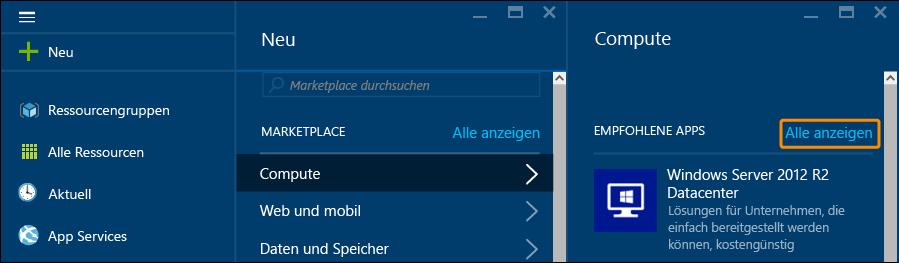

1. Klicken Sie unter **Datenbankserver** auf **SQL Server**, um alle Vorlagen anzuzeigen, die für SQL Server verfügbar sind. Unter Umständen müssen Sie nach unten zu **Datenbankserver** scrollen.

	

1. 	Für jede Vorlage sind eine SQL Server-Version und ein Betriebssystem angegeben. Wählen Sie in der Liste ein Image aus, um ein Blatt mit den dazugehörigen Details anzuzeigen.
1.	Das Blatt mit den Details enthält eine Beschreibung des VM-Images, und Sie können ein Bereitstellungsmodell auswählen. Stellen Sie unter **Bereitstellungsmodell auswählen** sicher, dass **Resource Manager** ausgewählt ist, und klicken Sie auf **Erstellen**.

	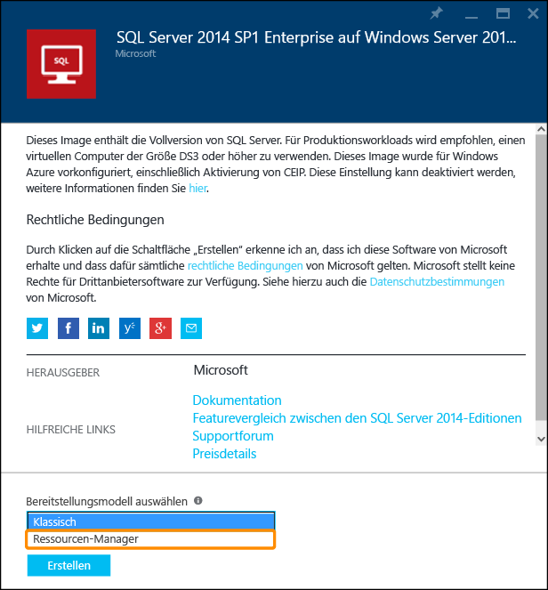

## Konfigurieren der VM
Das Azure-Portal enthält fünf Blätter zum Konfigurieren einer virtuellen SQL Server-Maschine.

| Schritt | Beschreibung |
|---------------------|-------------------------------|
| **Grundlagen** | [Grundeinstellungen konfigurieren](#1-configure-basic-settings) |
| **Größe** | [VM-Größe auswählen](#2-choose-virtual-machine-size) |
| **Einstellungen** | [Optionale Features konfigurieren](#3-configure-optional-features) |
| **SQL Server-Einstellungen** | [SQL Server-Einstellungen konfigurieren](#4-configure-sql-server-settings) |
| **Zusammenfassung** | [Zusammenfassung prüfen](#5-review-the-summary) |

## 1\. Grundeinstellungen konfigurieren
Geben Sie auf dem Blatt **Grundeinstellungen** die folgenden Informationen an:

* Geben Sie einen eindeutigen **Namen** für den virtuellen Computer ein.
* Geben Sie einen **Benutzernamen** für das lokale Administratorkonto des Computers ein. Dieses Konto wird auch zu einem Mitglied der festen SQL Server-Serverrolle „sysadmin“.
* Geben Sie ein sicheres **Kennwort** an.
* Wenn Sie über mehrere Abonnements verfügen, müssen Sie überprüfen, ob das Abonnement für die zu erstellende VM korrekt ist.
* Geben Sie im Feld **Ressourcengruppe** einen Namen für eine neue Ressourcengruppe ein. Klicken Sie auf **Vorhandene auswählen**, um alternativ dazu eine vorhandene Ressourcengruppe zu verwenden. Bei einer Ressourcengruppe handelt es sich um eine Sammlung verwandter Ressourcen in Azure (virtuelle Computer, Speicherkonten, virtuelle Netzwerke usw.).
>[AZURE.NOTE] Die Verwendung einer neuen Ressourcengruppe ist hilfreich, wenn Sie SQL Server-Bereitstellungen in Azure testen oder sich gerade damit vertraut machen. Nachdem Sie den Test abgeschlossen haben, können Sie die gesamte Ressourcengruppe löschen. Es werden alle Ressourcen gelöscht, die der Ressourcengruppe zugeordnet sind, einschließlich der SQL-VM. Weitere Informationen zu Ressourcengruppen finden Sie unter [Übersicht über den Azure Resource Manager](../resource-group-overview.md).
* Wählen Sie einen **Standort** für die Bereitstellung aus.
* Klicken Sie auf **OK**, um die Einstellungen zu speichern.

	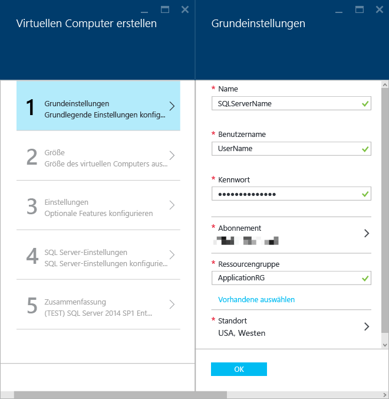

## 2\. VM-Größe auswählen
Wählen Sie unter dem Schritt **Größe** im Blatt **Größe auswählen** die Größe für einen virtuellen Computer aus. Es werden empfohlene Computergrößen angezeigt. Die Größen basieren auf der Vorlage, die Sie ausgewählt haben. Außerdem werden die monatlichen Kosten für die Ausführung der VM geschätzt.

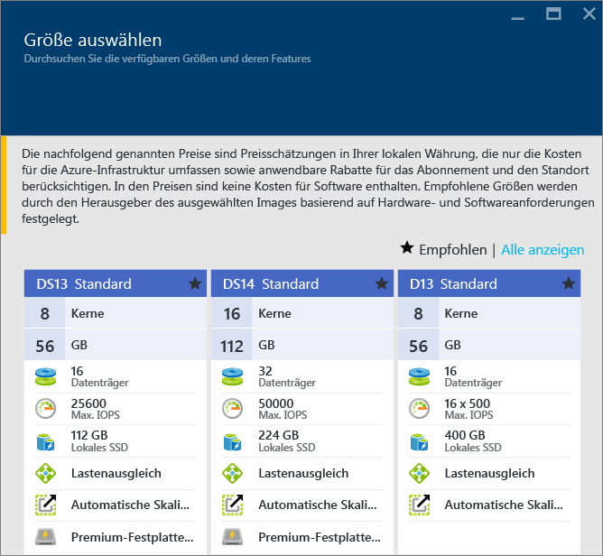

Für Produktionsworkloads empfehlen wir die Auswahl der Größe für einen virtuellen Computer, für die [Storage Premium](../storage/storage-premium-storage.md) unterstützt wird. Falls diese Leistungsebene für Sie nicht erforderlich ist, können Sie die Schaltfläche **Alle anzeigen** verwenden, um alle Optionen für die Computergröße anzuzeigen. Beispielsweise können Sie eine kleinere Computergröße für eine Entwicklungs- oder Testumgebung verwenden.

>[AZURE.NOTE] Weitere Informationen zu den Größen von virtuellen Computern finden Sie unter [Größen für virtuelle Computer](virtual-machines-windows-sizes.md). Informationen zu SQL Server-VM-Größen finden Sie unter [Optimale Verfahren für die Leistung für SQL Server auf virtuellen Computern in Azure](virtual-machines-windows-sql-performance.md).

Wählen Sie Ihre Computergröße aus, und klicken Sie dann auf **Auswählen**.

## 3\. Optionale Features konfigurieren
Konfigurieren Sie im Blatt **Einstellungen** die Bereiche Azure-Speicher, Netzwerk und Überwachung für den virtuellen Computer.

- Geben Sie unter **Speicher** als **Datenträgertyp** entweder „Standard“ oder „Premium (SSD)“ an. Für Produktionsworkloads wird Storage Premium empfohlen.

>[AZURE.NOTE] Wenn Sie „Premium (SSD)“ für eine Computergröße auswählen, die Storage Premium nicht unterstützt, wird die Computergröße auf eine Größe reduziert, für die Storage Premium unterstützt wird.

- Unter **Speicherkonto** können Sie entweder den automatisch bereitgestellten Speicherkontonamen übernehmen oder auf **Speicherkonto** klicken, um ein vorhandenes Konto auszuwählen und den Speicherkontotyp zu konfigurieren. Standardmäßig erstellt Azure ein neues Speicherkonto mit lokal redundantem Speicher. Weitere Informationen zu Speicheroptionen finden Sie unter [Azure Storage-Replikation](../storage/storage-redundancy.md).

- Unter **Netzwerk** können Sie die automatisch eingefügten Werte für Features übernehmen oder auf die einzelnen Features klicken, um die Optionen **Virtuelles Netzwerk**, **Subnetz**, **Öffentliche IP-Adresse** und **Netzwerksicherheitsgruppe** zu konfigurieren. Behalten Sie die Standardwerte für dieses Tutorial bei.

- In Azure ist die **Überwachung** mit demselben Speicherkonto, das für den virtuellen Computer angegeben wurde, standardmäßig aktiviert. Sie können diese Einstellungen hier ändern.

- Geben Sie unter **Verfügbarkeitsgruppe** eine Verfügbarkeitsgruppe an. In diesem Tutorial können Sie hier **Keine** wählen. Falls Sie die Einrichtung von SQL AlwaysOn-Verfügbarkeitsgruppen planen, können Sie die Verfügbarkeit konfigurieren, um die Neuerstellung der virtuellen Maschine zu vermeiden. Weitere Informationen finden Sie unter [Verwalten der Verfügbarkeit virtueller Computer](virtual-machines-windows-manage-availability.md).

Klicken Sie auf **OK**, wenn Sie mit dem Konfigurieren der Einstellungen fertig sind.

## 4\. SQL Server-Einstellungen konfigurieren
Konfigurieren Sie im Blatt **SQL Server-Einstellungen** die speziellen Einstellungen und Optimierungen für SQL Server. Die Einstellungen, die Sie für SQL Server konfigurieren können, lauten wie folgt:

| Einstellung |
|---------------------|
| [Konnektivität](#connectivity) |
| [Authentifizierung](#authentication) |
| [Speicherkonfiguration](#storage-configuration) |
| [Automatisiertes Patchen](#automated-patching) |
| [Automatisierte Sicherung](#automated-backup) |
| [Azure-Schlüsseltresor-Integration](#azure-key-vault-integration) |

### Konnektivität
Geben Sie unter **SQL-Konnektivität** den Zugriffstyp an, den Sie für die SQL Server-Instanz auf dieser VM verwenden möchten. Wählen Sie für dieses Tutorial die Option **Öffentlich (Internet)**, um für Computer oder Dienste im Internet Verbindungen mit SQL Server zuzulassen. Wenn diese Option aktiviert ist, konfiguriert Azure die Firewall und die Netzwerksicherheitsgruppe automatisch, um Datenverkehr über Port 1433 zuzulassen.

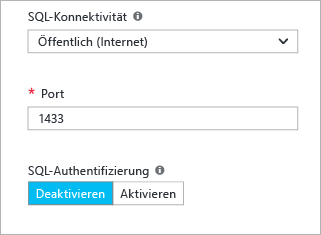

Um über das Internet eine Verbindung mit SQL Server herzustellen, müssen Sie auch die SQL Server-Authentifizierung aktivieren. Dies ist im nächsten Abschnitt beschrieben.

>[AZURE.NOTE] Wenn Ihre Clients die Verbindung mit SQL Server über einen bestimmten Port herstellen, können Sie die Konnektivität auf diesen Quellport beschränken. Hierzu können Sie die Netzwerksicherheitsgruppe bearbeiten, nachdem die VM erstellt wurde. Weitere Informationen finden Sie unter [Was ist eine Netzwerksicherheitsgruppe (NSG)?](../virtual-network/virtual-networks-nsg.md).

Falls Sie die Verbindungen mit dem Datenbankmodul über das Internet nicht aktivieren möchten, wählen Sie eine der folgenden Optionen:

- **Lokal (nur innerhalb der VM)**, um Verbindungen zu SQL Server nur von innerhalb des virtuellen Computers zuzulassen.
- **Privat (innerhalb des Virtual Network)**, um Verbindungen zu SQL Server von Computern oder Diensten im gleichen virtuellen Netzwerk zuzulassen.

Generell sollten Sie die Sicherheit erhöhen, indem Sie die restriktivste Konnektivität wählen, die für Ihr Szenario zulässig ist. Bei allen Optionen können Sie aber Netzwerksicherheitsgruppen-Regeln und die SQL-/Windows-Authentifizierung verwenden, um für Sicherheit zu sorgen.

Als **Port** wird standardmäßig 1433 verwendet. Sie können eine andere Portnummer angeben. Weitere Informationen finden Sie unter [Verbinden mit einem virtuellen SQL Server-Computer (Resource Manager) | Microsoft Azure](virtual-machines-windows-sql-connect.md).

### Authentifizierung
Wenn Sie die SQL Server-Authentifizierung benötigen, klicken Sie unter **SQL-Authentifizierung** auf **Aktivieren**.

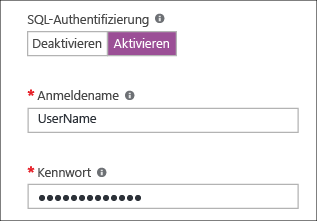

>[AZURE.NOTE] Wenn Sie auf SQL Server über das Internet zugreifen möchten (Konnektivitätsoption „Öffentlich“), müssen Sie die SQL-Authentifizierung hier aktivieren. Für den öffentlichen Zugriff auf SQL Server muss die SQL-Authentifizierung verwendet werden.

Geben Sie beim Aktivieren der SQL Server-Authentifizierung **Anmeldename** und **Kennwort** an. Dieser Benutzername wird als Anmeldung für die SQL Server-Authentifizierung verwendet und ist Mitglied der festen Serverrolle „sysadmin“. Weitere Informationen zu Authentifizierungsmodi finden Sie unter [Auswählen eines Authentifizierungsmodus](http://msdn.microsoft.com/library/ms144284.aspx).

Wenn Sie die SQL Server-Authentifizierung nicht aktivieren, können Sie das lokale Administratorkonto auf der VM verwenden, um die Verbindung mit der SQL Server-Instanz herzustellen.

### Speicherkonfiguration
Klicken Sie auf **Speicherkonfiguration**, um die Speicheranforderungen anzugeben.

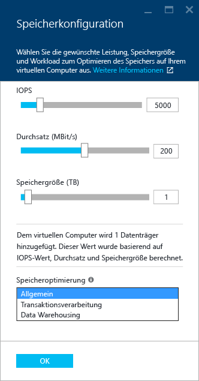

>[AZURE.NOTE] Wenn Sie den Standardspeicher wählen, ist diese Option nicht verfügbar. Die automatische Speicheroptimierung ist nur für Storage Premium verfügbar.

Sie können die Anforderungen als Eingabe-/Ausgabevorgänge pro Sekunde (IOPS), Durchsatz in MB/s und Gesamtspeichergröße angeben. Konfigurieren Sie diese mit den Schiebereglern. Das Portal berechnet basierend auf diesen Anforderungen automatisch die Anzahl der Datenträger.

Standardmäßig optimiert Azure den Speicher für 5.000 IOPS, 200 MB und 1 TB Speicherplatz. Sie können diese Speichereinstellungen basierend auf der Workload ändern. Wählen Sie unter **Speicher optimiert für** eine der folgenden Optionen:

- **Allgemein** ist die Standardeinstellung und bietet Unterstützung für die meisten Workloads.
- Beim Verarbeitungstyp **Transaktional** wird der Speicher für herkömmliche OLTP-Datenbankworkloads optimiert.
- Bei der Option **Data Warehousing** wird der Speicher für Analyse- und Berichterstellungsworkloads optimiert.

>[AZURE.NOTE] Die Obergrenzen der Schieberegler variieren je nach ausgewählter Größe des virtuellen Computers.

### Automatisiertes Patchen
**Automatisiertes Patchen** ist standardmäßig aktiviert. Beim automatisierten Patchen kann Azure automatisch Patches für SQL Server und das Betriebssystem anwenden. Geben Sie einen Wochentag, eine Uhrzeit und eine Dauer für das Wartungsfenster an. Azure führt das Patchen dann während des Wartungsfensters durch. Für die Zeitplanung des Wartungsfensters wird die Uhrzeit des VM-Gebietsschemas verwendet. Wenn Sie nicht möchten, dass SQL Server und das Betriebssystem automatisch gepatcht werden, klicken Sie auf **Deaktivieren**.

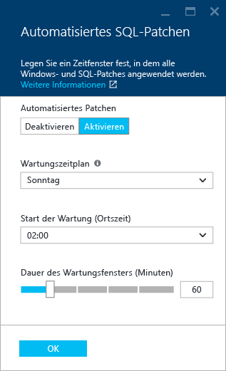

Weitere Informationen finden Sie unter [Automatisches Patchen für SQL Server auf virtuellen Azure-Computern](virtual-machines-windows-classic-sql-automated-patching.md).

### Automatisierte Sicherung
Aktivieren Sie automatische Datenbanksicherungen für alle Datenbanken unter **Automatisierte Sicherung**. Die automatisierte Sicherung ist standardmäßig deaktiviert.

Wenn Sie die automatisierte SQL-Sicherung aktivieren, können Sie Folgendes konfigurieren:

- Aufbewahrungszeitraum der Sicherung in Tagen
- Verwendetes Speicherkonto für Sicherungen
- Verschlüsselungsoption für die Sicherung

Klicken Sie auf **Aktivieren**, um die Sicherung zu verschlüsseln. Geben Sie dann das **Kennwort** an. Azure erstellt ein Zertifikat zum Verschlüsseln der Sicherungen und verwendet das angegebene Kennwort, um das Zertifikat zu schützen.

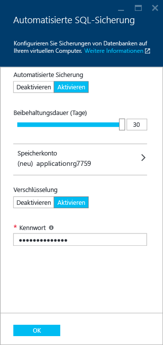

 Weitere Informationen finden Sie unter [Automatisierte Sicherung für SQL Server in Azure Virtual Machines](virtual-machines-windows-classic-sql-automated-backup.md).

### Azure-Schlüsseltresor-Integration
Klicken Sie zum Speichern von geheimen Sicherheitsschlüsseln für die Verschlüsselung in Azure auf **Azure-Schlüsseltresor-Integration** und dann auf **Aktivieren**.

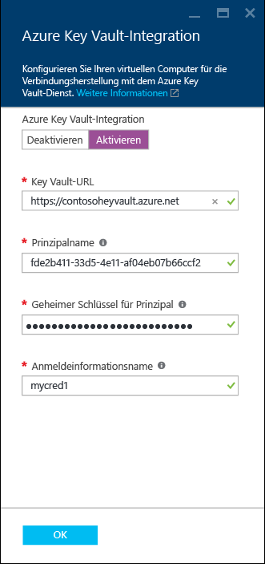

In der folgenden Tabelle sind die Parameter aufgeführt, die zum Konfigurieren der Azure-Schlüsseltresor-Integration erforderlich sind.

|PARAMETER|BESCHREIBUNG|BEISPIEL|
|----------|----------|-------|
|**Schlüsseltresor-URL** |Gibt den Speicherort des Schlüsseltresors an.|https://contosokeyvault.vault.azure.net/ |
|**Prinzipalname** |Gibt den Namen des Azure Active Directory-Dienstprinzipals an. Wird auch als Client-ID bezeichnet. |fde2b411-33d5-4e11-af04eb07b669ccf2|
| **Geheimer Schlüssel des Prinzipals**|Der geheime Schlüssel des Azure Active Directory-Dienstprinzipals. Wird auch als geheimer Clientschlüssel bezeichnet. | 9VTJSQwzlFepD8XODnzy8n2V01Jd8dAjwm/azF1XDKM=|
|**Name der Anmeldeinformationen**|**Anmeldeinformationsname**: Die Azure-Schlüsseltresor-Integration erstellt Anmeldeinformationen in SQL Server, damit der virtuelle Computer Zugriff auf den Schlüsseltresor hat. Wählen Sie einen Namen für diese Anmeldeinformation.| mycred1|

Weitere Informationen finden Sie unter [Konfigurieren der Azure-Schlüsseltresor-Integration für SQL Server auf virtuellen Azure-Computern](virtual-machines-windows-classic-ps-sql-keyvault.md).

Klicken Sie auf **OK**, wenn Sie mit dem Konfigurieren der SQL Server-Einstellungen fertig sind.

## 5\. Zusammenfassung prüfen
Überprüfen Sie im Blatt **Zusammenfassung** die Zusammenfassung, und klicken Sie auf **OK**, um SQL Server, die Ressourcengruppe und die für diesen virtuellen Computer angegebenen Ressourcen zu erstellen.

Sie können die Bereitstellung über das Azure-Portal überwachen. Auf der Schaltfläche **Benachrichtigungen** oben auf der Seite wird der grundlegende Status der Bereitstellung angezeigt.

>[AZURE.NOTE] Damit Sie sich einen Eindruck von Bereitstellungszeiten verschaffen können, habe ich eine SQL-VM für die Region „USA, Osten“ mit Standardeinstellungen bereitgestellt. Dieser Vorgang hat insgesamt 26 Minuten gedauert. Je nach Region und den gewählten Einstellungen kann es aber sein, dass die Bereitstellung bei Ihnen schneller oder langsamer geht.

## Öffnen der VM mit Remotedesktop

Führen Sie die folgenden Schritte aus, um mit Remotedesktop eine Verbindung mit dem virtuellen Computer herzustellen:

1. Nachdem die Azure-VM erstellt wurde, wird auf dem Azure-Dashboard das Symbol für die VM angezeigt. Sie können auch darauf zugreifen, indem Sie die Liste mit den vorhandenen virtuellen Computern durchsuchen. Klicken Sie auf den neuen virtuellen SQL-Computer, um die dazugehörigen Details anzuzeigen.
1. Klicken Sie oben im Blatt **Virtueller Computer** auf **Verbinden**.
1. Der Browser lädt eine RDP-Datei für die VM herunter. Öffnen Sie die RDP-Datei. 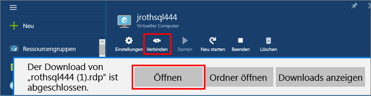
1. Sie werden von der Remotedesktopverbindung informiert, dass der Herausgeber dieser Remoteverbindung nicht identifiziert werden kann. Klicken Sie auf **Verbinden**, um den Vorgang fortzusetzen.
1. Klicken Sie im Dialogfeld **Windows-Sicherheit** auf **Anderes Konto verwenden**.
1. Geben Sie unter **Benutzername** den **<user name>** ein, wobei <user name> der Benutzername ist, den Sie beim Konfigurieren der VM angegeben haben. Beachten Sie, dass Sie am Anfang einen Schrägstrich hinzufügen müssen.
1. Geben Sie das **Kennwort** ein, das Sie für diese VM konfiguriert haben, und klicken Sie dann auf **OK**, um die Verbindung herzustellen.
1. Wenn in einem anderen Dialogfeld **Remotedesktopverbindung** gefragt wird, ob die Verbindung hergestellt werden kann, können Sie auf **Ja** klicken.

Nachdem Sie eine Verbindung mit dem virtuellen SQL Server-Computer hergestellt haben, können Sie SQL Server Management Studio starten und mit Ihren Anmeldeinformationen für den lokalen Administrator eine Verbindung mit der Windows-Authentifizierung herstellen. Wenn Sie die SQL Server-Authentifizierung aktiviert haben, können Sie die Verbindung auch per SQL-Authentifizierung herstellen, indem Sie den während der Bereitstellung konfigurierten SQL-Benutzernamen und das Kennwort verwenden.

Durch den Zugriff auf den Computer können Sie die Computer- und SQL Server-Einstellungen je nach Ihren Anforderungen direkt ändern. Beispielsweise können Sie die Firewalleinstellungen konfigurieren oder die SQL Server-Konfigurationseinstellungen ändern.

## Herstellen einer Remoteverbindung mit SQL Server

In diesem Tutorial haben wir den Zugriffstyp **Öffentlich** für den virtuellen Computer und die **SQL Server-Authentifizierung** ausgewählt. Mit diesen Einstellungen wurde der virtuelle Computer automatisch so konfiguriert, dass SQL Server-Verbindungen von jedem Client über das Internet zulässig sind (vorausgesetzt, diese verfügen über die richtige SQL-Anmeldung).

>[AZURE.NOTE] Wenn Sie bei der Bereitstellung nicht die Option „Öffentlich“ gewählt haben, müssen Sie weitere Schritte ausführen, um den Zugriff auf die SQL Server-Instanz über das Internet zu ermöglichen. Weitere Informationen finden Sie unter [Herstellen einer Verbindung mit einem virtuellen SQL Server-Computer](virtual-machines-windows-sql-connect.md).

In den folgenden Abschnitten wird gezeigt, wie Sie eine Verbindung mit Ihrer SQL Server-Instanz auf der VM von einem anderen Computer über das Internet herstellen.

> [AZURE.INCLUDE [Herstellen einer Verbindung mit SQL Server im VM-Ressourcen-Manager](../../includes/virtual-machines-sql-server-connection-steps-resource-manager.md)]

## Nächste Schritte
Weitere Informationen zur Verwendung von SQL Server in Azure finden Sie unter [SQL Server auf virtuellen Azure-Computern](virtual-machines-windows-sql-server-iaas-overview.md) und [Häufig gestellte Fragen](virtual-machines-windows-sql-server-iaas-faq.md).

Eine Übersicht über SQL Server auf virtuellen Azure-Computern als Video finden Sie unter [Azure VM is the best platform for SQL Server 2016](https://channel9.msdn.com/Events/DataDriven/SQLServer2016/Azure-VM-is-the-best-platform-for-SQL-Server-2016) (Azure-VM ist die beste Plattform für SQL Server 2016).

<!---HONumber=AcomDC_0511_2016-->