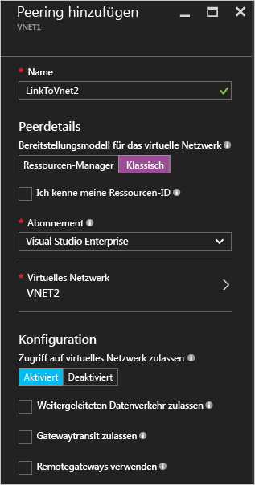
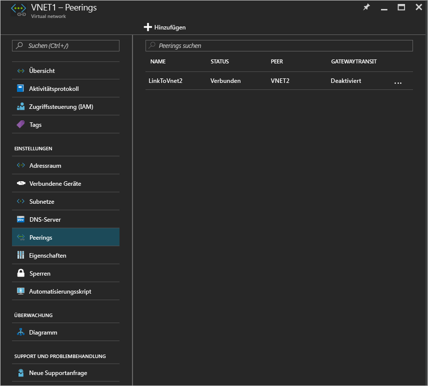

# Erstellen eines VNet-Peerings mit dem Azure-Portal
[!INCLUDE [virtual-networks-create-vnet-selectors-arm-include](../../includes/virtual-networks-create-vnetpeering-selectors-arm-include.md)]

[!INCLUDE [virtual-networks-create-vnet-intro](../../includes/virtual-networks-create-vnetpeering-intro-include.md)]

[!INCLUDE [virtual-networks-create-vnet-scenario-basic-include](../../includes/virtual-networks-create-vnetpeering-scenario-basic-include.md)]

Gehen Sie wie folgt vor, um mit dem Azure-Portal ein VNET-Peering basierend auf dem beschriebenen Szenario zu erstellen:

1. Navigieren Sie in einem Browser zu http://portal.azure.com, und melden Sie sich, falls erforderlich, mit Ihrem Azure-Konto an.
2. Zum Einrichten eines VNET-Peerings müssen Sie zwischen zwei VNETs zwei Links erstellen, also einen für jede Richtung. Sie können den VNET-Peeringlink zuerst für VNet1 zu VNet2 erstellen. Klicken Sie im Azure-Portal auf **Durchsuchen** > **Virtuelle Netzwerke**.

    
3. Wählen Sie auf dem Blatt **Virtuelle Netzwerke** *VNET1*, klicken Sie auf **Peerings**, und klicken Sie dann wie auf dem folgenden Bild gezeigt auf **Hinzufügen**:

    
4. Geben Sie auf dem Blatt **Add Peering** (Peering hinzufügen) unter **Name** den Namen *LinkToVnet2* ein, wählen Sie ein Abonnement und den Peer **Virtuelles Netzwerk** *VNET2*, und klicken Sie dann auf **OK**.

    
5. Nach der Erstellung des VNET-Peeringlinks wird der Linkzustand wie in der folgenden Abbildung angezeigt:

    
6. Erstellen Sie den VNET-Peeringlink für VNET2 zu VNET1. Wählen Sie auf dem Blatt **Virtuelle Netzwerke** *VNET2*, klicken Sie auf **Peerings**, und klicken Sie dann wie auf dem folgenden Bild gezeigt auf **Hinzufügen**:

    
7. Geben Sie auf dem Blatt **Add Peering** (Peering hinzufügen) unter **Name** den Namen *LinkToVnet1* ein, wählen Sie das Abonnement, wählen Sie *VNET1* als **Virtuelles Netzwerk** aus, und klicken Sie dann auf **OK**.

    
8. Nach der Erstellung des VNET-Peeringlinks wird der Linkzustand wie in der folgenden Abbildung angezeigt:

    
9. Überprüfen Sie den Status von **LinkToVnet2**, der sich jetzt auch in *Verbunden* ändert.  
    
    

    > [!NOTE]
    > Das VNet-Peering wird nur eingerichtet, wenn beide Links verbunden sind.
    > 
    > 

Für die einzelnen Links können jeweils einige Eigenschaften konfiguriert werden:

| Option | Beschreibung | Standard |
|:--- |:--- |:--- |
| AllowVirtualNetworkAccess |Gibt an, ob der Adressraum des per Peering verknüpften VNet als Teil des Virtual_network-Tags einbezogen wird. |Ja |
| AllowForwardedTraffic |Gibt an, ob Datenverkehr, der nicht aus dem mittels Peering verknüpften VNET stammt, angenommen oder verworfen wird. |Nein |
| AllowGatewayTransit |Ermöglicht dem per Peering verknüpften VNet die Verwendung des VNet-Gateways. |Nein |
| UseRemoteGateways |Gibt an, dass das VNet-Gateway des per Peering verknüpften VNet verwendet wird. Für das verknüpfte VNET muss ein Gateway konfiguriert und „AllowGatewayTransit“ ausgewählt sein. Diese Option kann nicht verwendet werden, wenn Sie ein Gateway konfiguriert haben. |Nein |

Jeder Link in einem VNET-Peering weist die vorherigen Eigenschaften auf. Sie können im Portal auf den **VNet-Peering**-Link klicken und die verfügbaren Optionen ändern. Klicken Sie auf **Speichern**, um die Änderungen zu übernehmen.

[!INCLUDE [virtual-networks-create-vnet-scenario-crosssub-include](../../includes/virtual-networks-create-vnetpeering-scenario-crosssub-include.md)]

1. Navigieren Sie in einem Browser zu http://portal.azure.com, und melden Sie sich, falls erforderlich, mit Ihrem Azure-Konto an.
2. In diesem Beispiel verfügt UserA über Administratorberechtigungen für SubscriptionA und UserB über Administratorberechtigungen für SubscriptionB. Beide Abonnements sind dem gleichen Azure Active Directory-Mandanten zugeordnet. Sie können kein Peering zwischen Abonnements erstellen, die verschiedenen Azure Active Directory-Mandanten zugeordnet sind.
3. Klicken Sie im Portal auf **Durchsuchen**, und wählen Sie **Virtuelle Netzwerke**. Klicken Sie auf das VNET, für das Sie das Peering einrichten möchten.
4. Klicken Sie auf dem Blatt für das ausgewählte VNET auf **Access Control**, und klicken Sie dann wie in der folgenden Abbildung gezeigt auf **Hinzufügen**:

    
4. Klicken Sie auf dem Blatt **Zugriff hinzufügen** auf eine Rolle und dann auf die Option **Netzwerkmitwirkender**. Klicken Sie auf **Benutzer hinzufügen**, geben Sie den Anmeldenamen „UserB“ ein, und klicken Sie auf „OK“.

    

5. Melden Sie sich am Azure-Portal als UserB an, also als privilegierter Benutzer für SubscriptionB. Führen Sie die vorherigen Schritte aus, um UserA wie in der folgenden Abbildung gezeigt der Rolle „Netzwerkmitwirkender“ hinzuzufügen:

    

    > [!NOTE]
    > Sie können sich abmelden und für beide Benutzersitzungen im Browser anmelden, um sich zu vergewissern, ob die Autorisierung erfolgreich aktiviert wurde.
    >
    >

    > [!IMPORTANT]
    > Wenn das Peering, das Sie gerade erstellen, zwischen zwei VNETs liegt, die über das Azure Resource Manager-Bereitstellungsmodell erstellt wurden, fahren Sie mit den übrigen Schritten in diesem Abschnitt fort. Wenn die zwei VNETs über verschiedene Bereitstellungsmodelle erstellt wurden, überspringen Sie die restlichen Schritte in diesem Abschnitt, und führen Sie die Schritte im Abschnitt [Peering virtual networks created through different deployment models](#x-model) (Peering virtueller Netzwerke, die über verschiedene Bereitstellungsmodelle erstellt wurden) dieses Artikels aus.

6. Melden Sie sich am Portal als UserA an, navigieren Sie zum Blatt „VNET3“, und klicken Sie auf **Peering**. Aktivieren Sie das Kontrollkästchen **Ich kenne meine Ressourcen-ID**, und geben Sie die Ressourcen-ID für VNET5 in dem im folgenden Beispiel angegebenen Format ein:
   
    /subscriptions/{SubscriptionID}/resourceGroups/{ResourceGroupName}/providers/Microsoft.Network/virtualNetworks/{VNETname}
   
    
7. Melden Sie sich am Portal als UserB an, und führen Sie die vorherigen Schritte aus, um den Peeringlink von VNET5 zu VNET3 zu erstellen.
   
    
8. Peering wird eingerichtet. Jeder mit VNet3 verbundene virtuelle Computer muss mit allen virtuellen Computern kommunizieren können, die mit VNet5 verbunden sind.

[!INCLUDE [virtual-networks-create-vnet-scenario-transit-include](../../includes/virtual-networks-create-vnetpeering-scenario-transit-include.md)]

1. Zunächst wird der VNet-Peeringlink von HubVnet zu VNet1 erstellt. Beachten Sie, dass die Option „Weitergeleiteten Datenverkehr zulassen“ für den Link nicht ausgewählt ist.
   
    
2. Im nächsten Schritt können Peeringlinks von VNet1 zu HubVnet erstellt werden. Beachten Sie, dass die Option „Weitergeleiteten Datenverkehr zulassen“ ausgewählt ist.
   
    
3. Nachdem das Peering eingerichtet wurde, können Sie [diesen Artikel](virtual-network-create-udr-arm-ps.md) lesen und eine benutzerdefinierte Route (User-Defined Route, UDR) festlegen, um VNet1-Datenverkehr über ein virtuelles Gerät zu leiten und dessen Funktionen zu nutzen. Wenn Sie die Adresse des nächsten Hops der Route angeben, können Sie diese auf die IP-Adresse des virtuellen Geräts im per Peering verknüpften VNet (HubVNet) festlegen.

[!INCLUDE [virtual-networks-create-vnet-scenario-asmtoarm-include](../../includes/virtual-networks-create-vnetpeering-scenario-asmtoarm-include.md)]

1. Navigieren Sie in einem Browser zu http://portal.azure.com, und melden Sie sich, falls erforderlich, mit Ihrem Azure-Konto an.
2. Wenn Sie ein Peering zwischen VNETs erstellen, die über verschiedene Bereitstellungsmodelle im *gleichen* Abonnement bereitgestellt werden, fahren Sie mit Schritt 3 fort. Die Funktion zum Erstellen eines VNET-Peerings zwischen VNETs, die über verschiedene Bereitstellungsmodelle in *unterschiedlichen* Abonnements bereitgestellt werden, ist als **Vorschau** verfügbar. Funktionen in der Vorschau bieten nicht dieselbe Zuverlässigkeit und Vereinbarung zum Servicelevel wie die in der finalen Version veröffentlichten Funktionen. Beim Erstellen eines Peerings zwischen VNETs, die über verschiedene Bereitstellungsmodelle in verschiedenen Abonnements bereitgestellt sind, müssen Sie zuerst die folgenden Aufgaben ausführen:
    - Registrieren Sie die Vorschaufunktion im Azure-Abonnement durch Eingabe der folgenden Befehle aus PowerShell: `Register-AzureRmProviderFeature -FeatureName AllowClassicCrossSubscriptionPeering -ProviderNamespace Microsoft.Network` und `Register-AzureRmResourceProvider -ProviderNamespace Microsoft.Network`. Dieser Schritt kann nicht im Portal ausgeführt werden.
    - Führen Sie die Schritte 1 bis 6 im Abschnitt [Abonnementübergreifendes Peering](#x-sub) dieses Artikels aus.
3. Zum Einrichten des VNET-Peerings in diesem Szenario müssen Sie nur einen Link erstellen, und zwar vom virtuellen Netzwerk im Azure Resource Manager zu einem virtuellen Netzwerk im klassischen Modus. Dies ist also eine Verbindung zwischen **VNET1** und **VNET2**. Klicken Sie im Portal auf **Durchsuchen**, und wählen Sie **Virtuelle Netzwerke** aus.
4. Wählen Sie auf dem Blatt „Virtuelle Netzwerke“ die Option **VNET1**. Klicken Sie auf **Peerings** und dann auf **Hinzufügen**.
5. Geben Sie dem Link auf dem Blatt **Peering hinzufügen** einen Namen. Hier lautet der Name **LinkToVNet2**. Wählen Sie unter „Peerdetails“ die Option **Klassisch**.
6. Wählen Sie das Abonnement und das virtuelle Peernetzwerk **VNET2** aus. Klicken Sie dann auf „OK“.

    
7. Nachdem dieser VNet-Peeringlink erstellt wurde, werden die beiden virtuellen Netzwerke verknüpft, und Folgendes wird angezeigt:

    

## Entfernen des VNet-Peerings
1. Navigieren Sie in einem Browser zu http://portal.azure.com, und melden Sie sich, falls erforderlich, mit Ihrem Azure-Konto an.
2. Wechseln Sie zum Blatt „Virtuelles Netzwerk“, klicken Sie auf „Peerings“ und den Link, den Sie entfernen möchten, und klicken Sie dann auf **Löschen**.

    
3. Wenn Sie einen Link im VNET-Peering entfernen, wird als Status für den Peeringlink „Verbindung getrennt“ angezeigt.

    
4. Bei diesem Status können Sie den Link erst dann wieder neu erstellen, wenn sich der Status des Peeringlinks in „Initiiert“ ändert. Es wird empfohlen, beide Links zu entfernen, bevor Sie das VNet-Peering neu erstellen.

