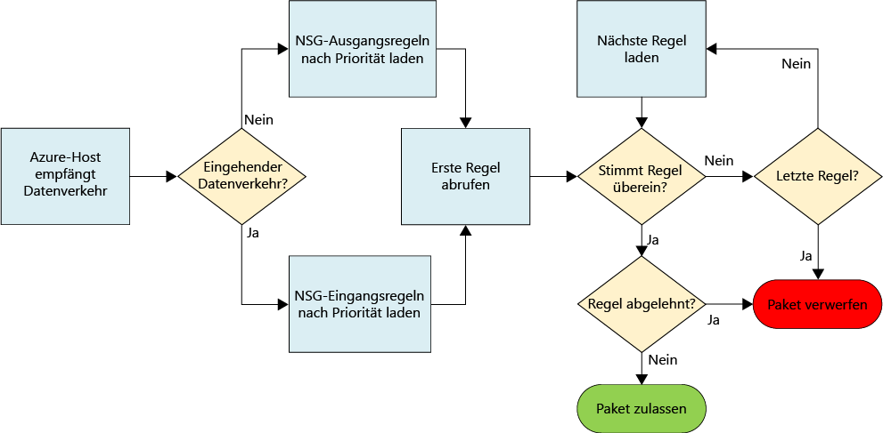
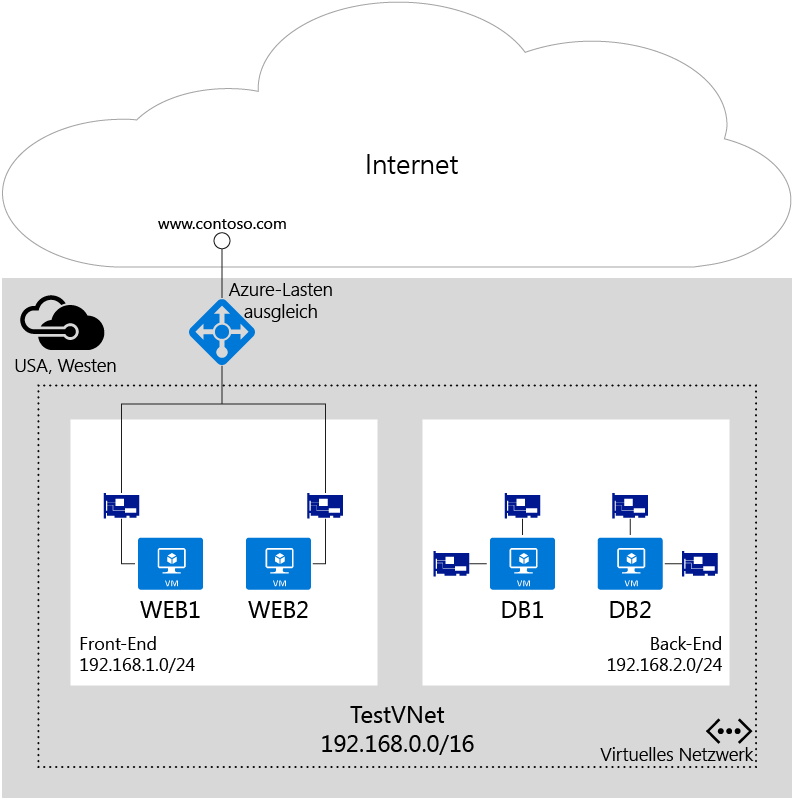

# Filtern des Netzwerkdatenverkehrs mit Netzwerksicherheitsgruppen

Eine Netzwerksicherheitsgruppe (NSG) enthält eine Liste mit Sicherheitsregeln, mit denen Netzwerkdatenverkehr für Ressourcen, die mit virtuellen Azure-Netzwerken (VNet) verbunden sind, zugelassen oder abgelehnt wird. NSGs können Subnetzen, einzelnen VMs (klassisch) oder einzelnen Netzwerkschnittstellen (NICs), die mit VMs (Resource Manager) verbunden sind, zugeordnet werden. Wenn eine NSG einem Subnetz zugeordnet ist, gelten die Regeln für alle Ressourcen, die mit dem Subnetz verbunden sind. Der Datenverkehr kann weiter eingeschränkt werden, indem eine NSG außerdem einer VM oder NIC zugeordnet wird.

> [!NOTE]
> Azure verfügt über zwei verschiedene Bereitstellungsmodelle für das Erstellen und Verwenden von Ressourcen: [Resource Manager-Bereitstellung und klassische Bereitstellung](../resource-manager-deployment-model.md). Dieser Artikel behandelt die Verwendung beider Modelle, Microsoft empfiehlt jedoch für die meisten neuen Bereitstellungen die Verwendung des Ressourcen-Manager-Modells.

## NSG-Ressource
NSGs haben die folgenden Eigenschaften:

| Eigenschaft | Beschreibung | Einschränkungen | Überlegungen |
| --- | --- | --- | --- |
| Name |Name der NSG |Muss innerhalb der Region eindeutig sein. Kann Buchstaben, Zahlen, Unterstriche, Punkte und Bindestriche enthalten. Sie muss mit einem Buchstaben oder einer Zahl beginnen. Sie muss mit einem Buchstaben, einer Zahl oder einem Unterstrich enden. Darf nicht länger als 80 Zeichen sein. |Da Sie u.U. eine ganze Reihe von NSGs erstellen müssen, sollten Sie durch Ihre Benennungskonvention sicherstellen, dass sich die Funktion der NSGs leicht am Namen erkennen lässt. |
| Region |Azure-[Region](https://azure.microsoft.com/regions), in der die NSG erstellt wird. |NSGs können nur Ressourcen zugeordnet werden, die sich in derselben Region wie die NSG befinden. |Informationen dazu, wie viele NSGs Sie pro Region verwenden können, finden Sie im Artikel [Einschränkungen bei Azure](../azure-subscription-service-limits.md#virtual-networking-limits-classic).|
| Ressourcengruppe |Dies ist die [Ressourcengruppe](../azure-resource-manager/resource-group-overview.md#resource-groups), in der die NSG enthalten ist. |Obwohl eine NSG in einer Ressourcengruppe enthalten ist, kann sie Ressourcen in beliebigen Ressourcengruppen zugeordnet werden, sofern die Ressource zu derselben Azure-Region wie die NSG gehört. |Ressourcengruppen werden verwendet, um mehrere Ressourcen gemeinsam als eine Bereitstellungseinheit zu verwalten. Unter Umständen ist es ratsam, NSGs mit den Ressourcen zu gruppieren, denen sie zugeordnet sind. |
| Regeln |Mit Regeln für eingehenden und ausgehenden Datenverkehr wird definiert, welcher Datenverkehr zugelassen oder abgelehnt wird. | |Informationen hierzu finden Sie im Abschnitt [NSG-Regeln](#Nsg-rules) dieses Artikels. |

> [!NOTE]
> Endpunktbasierte ACLs und Netzwerksicherheitsgruppen können nicht für die gleiche VM-Instanz verwendet werden. Wenn Sie eine NSG verwenden möchten und bereits eine Endpunkt-ACL eingerichtet ist, entfernen Sie zuerst die Endpunkt-ACL. Informationen zum Entfernen einer ACL finden Sie im Artikel [Verwalten von Zugriffssteuerungslisten (ACLs) für Endpunkte mithilfe von PowerShell](virtual-networks-acl-powershell.md).
> 

### NSG-Regeln
NSG-Regeln enthalten die folgenden Eigenschaften:

| Eigenschaft | Beschreibung | Einschränkungen | Überlegungen |
| --- | --- | --- | --- |
| **Name** |Name der Regel. |Muss innerhalb der Region eindeutig sein. Kann Buchstaben, Zahlen, Unterstriche, Punkte und Bindestriche enthalten. Sie muss mit einem Buchstaben oder einer Zahl beginnen. Sie muss mit einem Buchstaben, einer Zahl oder einem Unterstrich enden. Darf nicht länger als 80 Zeichen sein. |Da eine NSG mehrere Regeln enthalten kann, sollten Sie durch Ihre Benennungskonvention sicherstellen, dass sich die Funktion der Regel leicht am Namen erkennen lässt. |
| **Protokoll** |Protokoll entsprechend der Regel: |TCP, UDP oder *. |Wenn als Protokoll „*“ verwendet wird, sind ICMP (nur Ost-West-Datenverkehr), UDP und TCP eingeschlossen, wodurch sich die Anzahl der erforderlichen Regeln verringern kann. Die Verwendung von „*“ kann auch ein zu weit gefasster Ansatz sein, sodass Sie „*“ nur nutzen sollten, wenn dies wirklich erforderlich ist. |
| **Quellportbereich** |Quellportbereich entsprechend der Regel: |Eine einzelne Portnummer zwischen 1 und 65535, ein Portbereich (z.B. 1 - 65535) oder „*“ (für alle Ports). |Quellports können kurzlebig sein. Sofern Ihr Clientprogramm keinen bestimmten Port nutzt, sollten Sie in den meisten Fällen „*“ verwenden. Versuchen Sie, weitestgehend mit Portbereichen zu arbeiten, um die Anzahl von notwendigen Regeln zu reduzieren. Mehrere Ports oder Portbereiche können nicht mit Kommas gruppiert werden. |
| **Zielportbereich** |Zielportbereich entsprechend der Regel: |Eine einzelne Portnummer zwischen 1 und 65535, ein Portbereich (z.B. 1 - 65535) oder „\*“ (für alle Ports). |Versuchen Sie, weitestgehend mit Portbereichen zu arbeiten, um die Anzahl von notwendigen Regeln zu reduzieren. Mehrere Ports oder Portbereiche können nicht mit Kommas gruppiert werden. |
| **Quelladresspräfix** |Quelladresspräfix oder -tag entsprechend der Regel: |Eine IP-Adresse (z.B. 10.10.10.10), IP-Subnetz (z.B. 192.168.1.0/24), [Standardtag](#default-tags) oder „*“ (für alle Adressen). |Verwenden Sie nach Möglichkeit Bereiche, Standardtags und „*“, um die Anzahl von Regeln zu reduzieren. |
| **Zieladresspräfix** |Zieladresspräfix oder -tag entsprechend der Regel. | Eine IP-Adresse (z.B. 10.10.10.10), IP-Subnetz (z.B. 192.168.1.0/24), [Standardtag](#default-tags) oder „*“ (für alle Adressen). |Verwenden Sie nach Möglichkeit Bereiche, Standardtags und „*“, um die Anzahl von Regeln zu reduzieren. |
| **Richtung** |Richtung des Datenverkehrs entsprechend der Regel. |Eingehend oder ausgehend. |Die Regeln für eingehenden und ausgehenden Datenverkehr werden abhängig von der Richtung getrennt verarbeitet. |
| **Priority** |Regeln werden gemäß ihrer Priorität geprüft. Sobald eine Regel als gültig erkannt wird, werden keine weiteren Regeln mehr geprüft. | Eine Zahl zwischen 100 und 4.096. | Vergeben Sie beim Erstellen von Regeln die Prioritäten am besten jeweils in Hunderterschritten, damit noch Platz für ggf. später hinzukommende Regeln bleibt. |
| **Access** |Typ des Zugriffs bei Übereinstimmung mit der Regel. | Dies kann „Zulassen“ oder „Verweigern“ sein. | Beachten Sie, dass ein Paket verworfen wird, wenn keine Zulassungsregel dafür gefunden wird. |

NGSs enthalten zwei Regelsätze: für eingehenden und für ausgehenden Datenverkehr. Die Priorität für eine Regel muss innerhalb jedes Satzes eindeutig sein. 

 

In der obigen Abbildung ist dargestellt, wie NSG-Regeln verarbeitet werden.

### Standardtags
Standardtags sind vom System bereitgestellte Bezeichner für eine Kategorie von IP-Adressen. In den Eigenschaften **Quelladresspräfix** und **Zieladresspräfix** von Regeln können Standardtags verwendet werden. Es gibt drei Standardtags, die Sie verwenden können:

* **VirtualNetwork** (Resource Manager) (**VIRTUAL_NETWORK** für klassisch): Dieses Tag enthält den Adressraum des virtuellen Netzwerks (in Azure definierte CIDR-Bereiche), alle verbundenen lokalen Adressräume und verbundene Azure-VNets (lokale Netzwerke).
* **AzureLoadBalancer** (Resource Manager) (**AZURE_LOADBALANCER** für klassisch): Dieses Tag symbolisiert den Lastenausgleich der Azure-Infrastruktur. Das Tag wird in eine Azure-Datencenter-IP umgewandelt, die als Ausgangspunkt für die Integritätstests von Azure fungiert.
* **Internet** (Resource Manager) (**INTERNET** für klassisch): Dies ist das Tag für den IP-Adressraum, der außerhalb des virtuellen Netzwerks liegt und über das öffentliche Internet erreichbar ist. Der Bereich schließt den [Azure-eigenen öffentlichen IP-Adressraum](https://www.microsoft.com/download/details.aspx?id=41653) ein.

### Standardregeln
Alle NSGs enthalten eine Gruppe von Standardregeln. Die Standardregeln können zwar nicht gelöscht werden, haben aber niedrigste Priorität und können somit durch selbst erstellte Regeln außer Kraft gesetzt werden. 

Mit den Standardregeln wird Datenverkehr wie folgt zugelassen und verweigert:
- **Virtuelles Netzwerk:** Datenverkehr wird aus einem bzw. in ein virtuelles Netzwerk in ein- und ausgehender Richtung zugelassen.
- **Internet:** Ausgehender Datenverkehr wird zugelassen, aber eingehender Datenverkehr wird blockiert.
- **Lastenausgleich:** Lassen Sie für den Lastenausgleich (Load Balancer) von Azure die Überprüfung der Integrität der virtuellen Computer und der Rolleninstanzen zu. Sie können diese Regel außer Kraft setzen, wenn Sie keine Gruppe mit Lastenausgleich verwenden.

**Eingehende Standardregeln**

| Name | Priority | Quell-IP | Quellport | Ziel-IP | Zielport | Protokoll | Access |
| --- | --- | --- | --- | --- | --- | --- | --- |
| AllowVNetInBound |65000 | VirtualNetwork | * | VirtualNetwork | * | * | ZULASSEN |
| AllowAzureLoadBalancerInBound | 65001 | AzureLoadBalancer | * | * | * | * | ZULASSEN |
| DenyAllInBound |65500 | * | * | * | * | * | VERWEIGERN |

**Ausgehende Standardregeln**

| Name | Priority | Quell-IP | Quellport | Ziel-IP | Zielport | Protokoll | Access |
| --- | --- | --- | --- | --- | --- | --- | --- |
| AllowVnetOutBound | 65000 | VirtualNetwork | * | VirtualNetwork | * | * | ZULASSEN |
| AllowInternetOutBound | 65001 | * | * | Internet | * | * | ZULASSEN |
| DenyAllOutBound | 65500 | * | * | * | * | * | VERWEIGERN |

## Zuordnen von NSGs
Je nach verwendetem Bereitstellungsmodell können Sie eine NSG wie folgt einem virtuellen Computer, Netzwerkkarten (NICs) und Subnetzen zuordnen:

* **VM (nur klassisch):** Sicherheitsregeln werden auf den gesamten ein- und ausgehenden Datenverkehr der VM angewendet. 
* **NIC (nur Resource Manager):** Sicherheitsregeln werden auf den gesamten ein- und ausgehenden Datenverkehr der NIC angewendet, die der NSG zugeordnet ist. Bei einer VM mit mehreren NICs können Sie auf jede NIC unterschiedliche NSGs oder die gleiche NSG anwenden. 
* **Subnetz (Resource Manager und klassisch):** Sicherheitsregeln werden auf den gesamten ein- und ausgehenden Datenverkehr der Ressourcen angewendet, die mit dem VNet verbunden sind.

Sie können verschiedene NSGs einem virtuellen Computer (oder einer Netzwerkkarte, abhängig vom Bereitstellungsmodell) und dem Subnetz zuordnen, mit dem eine Netzwerkkarte oder ein virtueller Computer verbunden ist. Sicherheitsregeln werden für jede NSG nach Priorität in der folgenden Reihenfolge auf den Datenverkehr angewendet:

- **Eingehender Datenverkehr**

  1. **Auf das Subnetz angewendete NSG**: Wenn eine Subnetz-NSG über eine Abgleichsregel zum Ablehnen von Datenverkehr verfügt, wird das Paket verworfen.

  2. **Auf die Netzwerkkarte angewendete NSG** (Resource Manager) oder auf den virtuellen Computer angewendete NSG (klassisch): Wenn die VM/NIC-Netzwerksicherheitsgruppe über eine Abgleichsregel zum Verweigern von Datenverkehr verfügt, werden Pakete auf der VM/NIC verworfen. Dies gilt auch, wenn eine Subnetz-NSG über eine Abgleichsregel zum Zulassen von Datenverkehr verfügt.

- **Ausgehender Datenverkehr**

  1. **Auf die Netzwerkkarte angewendete NSG** (Resource Manager) oder auf den virtuellen Computer angewendete NSG (klassisch): Wenn eine VM/NIC-NSG über eine Abgleichsregel zum Ablehnen von Datenverkehr verfügt, werden die Pakete verworfen.

  2. **Auf das Subnetz angewendete NSG:** Wenn eine Subnetz-NSG über eine Abgleichsregel zum Ablehnen von Datenverkehr verfügt, werden die Pakete auch dann verworfen, wenn eine VM/NIC-NSG über eine Abgleichsregel zum Zulassen von Datenverkehr verfügt.

> [!NOTE]
> Sie können einem Subnetz, einem virtuellen Computer oder einer Netzwerkkarte zwar nur eine einzelne NSG zuordnen, Sie können eine solche NSG aber beliebig vielen Ressourcen zuordnen.
>

## Implementierung
Sie können NSGs für das Resource Manager- oder das klassische Bereitstellungsmodell mit den folgenden Tools implementieren:

| Bereitstellungstool | Klassisch | Ressourcen-Manager |
| --- | --- | --- |
| Azure-Portal   | Ja | [Ja](virtual-networks-create-nsg-arm-pportal.md) |
| PowerShell     | [Ja](virtual-networks-create-nsg-classic-ps.md) | [Ja](virtual-networks-create-nsg-arm-ps.md) |
| Azure-CLI **V1**   | [Ja](virtual-networks-create-nsg-classic-cli.md) | [Ja](virtual-networks-create-nsg-cli-nodejs.md) |
| Azure-CLI **V2**   | Nein | [Ja](virtual-networks-create-nsg-arm-cli.md) |
| Azure Resource Manager-Vorlage   | Nein  | [Ja](virtual-networks-create-nsg-arm-template.md) |

## Planung
Bevor Sie NSGs implementieren, müssen Sie folgende Fragen beantworten:

1. Für welche Arten von Ressourcen möchten Sie Datenverkehr in ein- oder ausgehender Richtung filtern? Sie können Verbindungen mit Ressourcen herstellen, z.B. NICs (Resource Manager), VMs (klassisch), Cloud Services, App Service-Umgebungen und VM-Skalierungsgruppen. 
2. Sind die Ressourcen, für die Sie ein- und ausgehenden Datenverkehr filtern möchten, mit Subnetzen in vorhandenen VNets verbunden?

Weitere Informationen zum Planen der Netzwerksicherheit in Azure finden Sie im Artikel [Microsoft Cloud Services und Netzwerksicherheit](../best-practices-network-security.md). 

## Überlegungen zum Entwurf
Nachdem Sie die Antworten auf die Fragen im Abschnitt [Planung](#Planning) kennen, können Sie sich mit den Informationen in den folgenden Abschnitten vertraut machen, bevor Sie Ihre NSGs definieren:

### Grenzen
Die Anzahl von NSGs, die Sie in einem Abonnement verwenden können, und die Anzahl von Regeln pro NSG sind beschränkt. Weitere Informationen über die Einschränkungen finden Sie im Artikel zu den [Azure-Einschränkungen](../azure-subscription-service-limits.md#networking-limits) .

### Entwurf von VNET und Subnetz
Da NSGs auf Subnetze angewendet werden können, können Sie die Anzahl der NSGs minimieren, indem Sie Ihre Ressourcen nach Subnetz gruppieren und die NSGs auf Subnetze anwenden.  Wenn Sie sich dafür entscheiden, NSGs auf Subnetze anzuwenden, werden Sie u. U. feststellen, dass beim Definieren der vorhandenen VNETs und Subnetze die NSGs nicht bedacht wurden. Unter Umständen müssen Sie neue VNets und Subnetze definieren, um Ihr NSG-Design zu unterstützen, und neue Ressourcen für Ihre Subnetze bereitstellen. Anschließend können Sie in einer Migrationsstrategie festlegen, wie die vorhandenen Ressourcen in die neuen Subnetze verlagert werden. 

### Spezielle Regeln
Wenn Sie Datenverkehr blockieren, der anhand der folgenden Regeln zugelassen ist, kann Ihre Infrastruktur nicht mit wichtigen Azure-Diensten kommunizieren:

* **Virtuelle IP des Hostknotens**: Grundlegende Infrastrukturdienste wie DHCP, DNS und die Systemüberwachung werden über die virtualisierte Host-IP-Adresse 168.63.129.16 bereitgestellt. Diese öffentliche IP-Adresse gehört Microsoft und ist die einzige virtuelle IP-Adresse, die in allen Regionen zu diesem Zweck verwendet wird. Die IP-Adresse wird der physischen IP-Adresse des Servercomputers (Hostknotens) zugeordnet, der die VM hostet. Der Hostknoten fungiert als DHCP-Relay, als rekursiver DNS-Resolver und als Integritätstestquelle für den Load Balancer und den Computer. Bei der Kommunikation mit dieser IP-Adresse handelt es sich nicht um einen Angriff.
* **Lizenzierung (Schlüsselverwaltungsdienst)**: Die auf den VMs verwendeten Windows-Images müssen lizenziert sein. Zum Sicherstellen der Lizenzierung wird eine entsprechende Anforderung an die Hostserver des Schlüsselverwaltungsdiensts gesendet, die solche Abfragen verarbeiten. Die Anforderung wird in ausgehender Richtung über Port 1688 gesendet.

### ICMP-Datenverkehr
In NSG-Regeln kann derzeit als Protokoll nur *TCP* oder *UDP* angegeben werden. Ein spezielles Tag für *ICMP*ist nicht verfügbar. Der ICMP-Datenverkehr wird in einem VNet über die AllowVNetInBound-Standardregel ermöglicht, mit der ein- und ausgehender Datenverkehr für alle Ports und Protokolle im VNet zugelassen wird.

### Subnetze
* Bedenken Sie die Anzahl der Ebenen, die für Ihre Workload erforderlich sind. Jede Ebene kann mithilfe eines Subnetzes isoliert werden, auf das eine NSG angewendet wird. 
* Wenn Sie ein Subnetz für ein VPN-Gateway oder eine ExpressRoute-Verbindung implementieren müssen, sollten Sie **keine** NSG auf dieses Subnetz anwenden. Es kann zu Fehlern bei der VNet- oder standortübergreifenden Konnektivität kommen, wenn Sie dies tun. 
* Falls Sie ein virtuelles Netzwerkgerät (Network Virtual Appliance, NVA) implementieren müssen, verbinden Sie das virtuelle Netzwerkgerät mit einem eigenen Subnetz und erstellen dafür benutzerdefinierte Routen in ein- und ausgehender Richtung. Sie können eine NSG auf Subnetzebene implementieren, um den bei diesem Subnetz eingehenden und ausgehenden Datenverkehr zu filtern. Weitere Informationen zu benutzerdefinierten Routen finden Sie im Artikel [Benutzerdefinierte Routen und IP-Weiterleitung](virtual-networks-udr-overview.md).

### Load Balancer
* Sehen Sie sich die Regeln für den Lastenausgleich und die Netzwerkadressübersetzung (Network Address Translation, NAT) für jeden Load Balancer an, der von Ihren Workloads verwendet wird. NAT-Regeln sind an einen Back-End-Pool gebunden, der NICs (Resource Manager) bzw. VMs/Cloud Services-Rolleninstanzen (klassisch) enthält. Ziehen Sie in Erwägung, eine NSG für jeden Back-End-Pool zu erstellen und dadurch nur den Datenverkehr zuzulassen, der den in den Load Balancern implementierten Regeln entspricht. Durch die Erstellung einer NSG für jeden Back-End-Pool wird sichergestellt, dass auch Datenverkehr, der direkt an den Back-End-Pool fließt (anstatt über den Load Balancer), gefiltert wird.
* In klassischen Bereitstellungen erstellen Sie Endpunkte, die die Ports auf einem Load Balancer zu Ports auf den virtuellen Computern oder Rolleninstanzen zuordnen. Sie können auch den Resource Manager verwenden, um Ihren eigenen öffentlich zugänglichen Load Balancer zu erstellen. Der Zielport für eingehenden Datenverkehr ist der tatsächliche Port der VM oder Rolleninstanz, und nicht der Port, der von einem Load Balancer verfügbar gemacht wird. Beim Quellport und der Quelladresse für die Verbindung mit dem virtuellen Computer handelt es sich um einen Port und eine Adresse auf dem Remotecomputer im Internet, und nicht um den Port und die Adresse, die vom Load Balancer verfügbar gemacht werden.
* Wenn Sie NSGs erstellen, um Datenverkehr zu filtern, der über einen internen Load Balancer (ILB) eingeht, stammen der angewendete Quellport und der Adressbereich vom Ausgangscomputer und nicht vom Load Balancer. Der Zielport und der Adressbereich stammen vom Zielcomputer, nicht vom Load Balancer.

### Sonstige
* Endpunktbasierte Zugriffssteuerungslisten (Access Control Lists, ACL) und NSGs werden auf derselben VM-Instanz nicht unterstützt. Wenn Sie eine NSG verwenden möchten und bereits eine Endpunkt-ACL eingerichtet ist, entfernen Sie zuerst die Endpunkt-ACL. Informationen zum Entfernen einer Endpunkt-ACL finden Sie im Artikel [Verwalten von Endpunkt-ACLs](virtual-networks-acl-powershell.md).
* Im Resource Manager können Sie eine NSG verwenden, die einer NIC für VMs mit mehreren NICs zugeordnet ist, um die Verwaltung (Remotezugriff) pro NIC zu ermöglichen. Die Zuordnung eindeutiger NSGs zu den einzelnen NICs ermöglicht die Trennung von Datenverkehrstypen für die NICs.
* Beim Filtern von Datenverkehr aus anderen VNETs müssen Sie ähnlich wie bei Load Balancern den Quelladressbereich des Remotecomputers verwenden und nicht das Gateway, das die VNETs verbindet.
* Für viele Azure-Dienste ist eine Verbindung mit VNets nicht möglich. Wenn eine Azure-Ressource nicht mit einem VNet verbunden ist, können Sie keine NSG verwenden, um Datenverkehr für die Ressource zu filtern.  Lesen Sie die Dokumentation zu den von Ihnen genutzten Diensten, um herauszufinden, ob sie mit einem VNET verbunden werden können.

## Beispielbereitstellung
Die Anwendung der Informationen dieses Artikels ist in der folgenden Abbildung anhand eines häufigen Szenarios mit einer Zwei-Ebenen-Anwendung dargestellt:

Wie im Diagramm dargestellt, sind die virtuellen Computer *Web1* und *Web2* mit dem Subnetz *FrontEnd* verbunden, und die virtuellen Computer *DB1* und *DB2* sind mit dem Subnetz *BackEnd* verbunden.  Beide Subnetze sind Teil des VNETs *TestVNet* . Die Anwendungskomponenten werden jeweils auf einer Azure-VM ausgeführt, die mit einem VNet verbunden ist. Für das Szenario gelten die folgenden Anforderungen:

1. Trennung des Datenverkehrs zwischen WEB- und DB-Servern.
2. Lastenausgleichsregeln leiten den am Load Balancer eingehenden Datenverkehr an alle Webserver an Port 80 weiter.
3. Die NAT-Regeln des Load Balancers leiten Datenverkehr, der über Port 50001 beim Load Balancer eingeht, an Port 3389 auf der VM „WEB1“ weiter.
4. Kein Zugriff auf die Front-End- oder Back-End-VMs aus dem Internet, mit Ausnahme der Anforderungen 2 und 3.
5. Kein ausgehender Internetzugriff von den WEB- und DB-Servern.
6. Der Zugriff aus dem FrontEnd-Subnetz ist über Port 3389 aller WEB-Server zulässig.
7. Der Zugriff aus dem FrontEnd-Subnetz ist über Port 3389 aller DB-Server zulässig.
8. Der Zugriff aus dem FrontEnd-Subnetz ist über Port 1433 aller DB-Server zulässig.
9. Trennung des Verwaltungsdatenverkehrs (Port 3389) und des Datenbank-Datenverkehrs (Port 1433) auf verschiedenen NICs von DB-Servern.

Die Anforderungen 1 bis 6 (mit Ausnahme der Anforderungen 3 und 4) sind auf Subnetz-Adressräume beschränkt. Die folgenden NSGs erfüllen die obigen Anforderungen, während gleichzeitig die Anzahl von erforderlichen NSGs verringert wird:

### FrontEnd
**Regeln für eingehenden Datenverkehr**

| Regel | Access | Priority | Quelladressbereich | Quellport | Zieladressbereich | Zielport | Protokoll |
| --- | --- | --- | --- | --- | --- | --- | --- |
| Allow-Inbound-HTTP-Internet | ZULASSEN | 100 | Internet | * | * | 80 | TCP |
| Allow-Inbound-RDP-Internet | ZULASSEN | 200 | Internet | * | * | 3389 | TCP |
| Deny-Inbound-All | VERWEIGERN | 300 | Internet | * | * | * | TCP |

**Regeln für ausgehenden Datenverkehr**

| Regel | Access | Priority | Quelladressbereich | Quellport | Zieladressbereich | Zielport | Protokoll |
| --- | --- | --- | --- | --- | --- | --- | --- |
| Deny-Internet-All |VERWEIGERN |100 | * | * | Internet | * | * |

### BackEnd
**Regeln für eingehenden Datenverkehr**

| Regel | Access | Priority | Quelladressbereich | Quellport | Zieladressbereich | Zielport | Protokoll |
| --- | --- | --- | --- | --- | --- | --- | --- |
| Deny-Internet-All | VERWEIGERN | 100 | Internet | * | * | * | * |

**Regeln für ausgehenden Datenverkehr**

| Regel | Access | Priority | Quelladressbereich | Quellport | Zieladressbereich | Zielport | Protokoll |
| --- | --- | --- | --- | --- | --- | --- | --- |
| Deny-Internet-All | VERWEIGERN | 100 | * | * | Internet | * | * |

Die folgenden NSGs werden erstellt und den NICs der folgenden VMs zugeordnet:

### WEB1
**Regeln für eingehenden Datenverkehr**

| Regel | Access | Priority | Quelladressbereich | Quellport | Zieladressbereich | Zielport | Protokoll |
| --- | --- | --- | --- | --- | --- | --- | --- |
| Allow-Inbound-RDP-Internet | ZULASSEN | 100 | Internet | * | * | 3389 | TCP |
| Allow-Inbound-HTTP-Internet | ZULASSEN | 200 | Internet | * | * | 80 | TCP |

> [!NOTE]
> Der Quelladressbereich für die obigen Regeln lautet **Internet** (nicht die virtuelle IP-Adresse des Load Balancers). Der Quellport ist „*“, nicht 500001. NAT-Regeln für Load Balancer sind nicht das Gleiche wie NSG-Sicherheitsregeln. NSG-Sicherheitsregeln beziehen sich immer auf die ursprüngliche Quelle und das endgültige Ziel des Datenverkehrs, und **nicht** auf den dazwischen angeordneten Load Balancer. 
> 
> 

### WEB2
**Regeln für eingehenden Datenverkehr**

| Regel | Access | Priority | Quelladressbereich | Quellport | Zieladressbereich | Zielport | Protokoll |
| --- | --- | --- | --- | --- | --- | --- | --- |
| Deny-Inbound-RDP-Internet | VERWEIGERN | 100 | Internet | * | * | 3389 | TCP |
| Allow-Inbound-HTTP-Internet | ZULASSEN | 200 | Internet | * | * | 80 | TCP |

### DB-Server (Verwaltungs-NIC)
**Regeln für eingehenden Datenverkehr**

| Regel | Access | Priority | Quelladressbereich | Quellport | Zieladressbereich | Zielport | Protokoll |
| --- | --- | --- | --- | --- | --- | --- | --- |
| Allow-Inbound-RDP-Front-end | ZULASSEN | 100 | 192.168.1.0/24 | * | * | 3389 | TCP |

### DB-Server (NIC für Datenbank-Datenverkehr)
**Regeln für eingehenden Datenverkehr**

| Regel | Access | Priority | Quelladressbereich | Quellport | Zieladressbereich | Zielport | Protokoll |
| --- | --- | --- | --- | --- | --- | --- | --- |
| Allow-Inbound-SQL-Front-end | ZULASSEN | 100 | 192.168.1.0/24 | * | * | 1433 | TCP |

Da einige NSGs einzelnen NICs zugeordnet sind, gelten die Regeln für Ressourcen, die über den Resource Manager bereitgestellt werden. Die Regeln werden für das Subnetz und die NIC basierend auf der jeweiligen Zuordnung kombiniert. 

## Nächste Schritte
* [Bereitstellen von NSGs (Resource Manager)](virtual-networks-create-nsg-arm-pportal.md)
* [Bereitstellen von NSGs (klassisch)](virtual-networks-create-nsg-classic-ps.md)
* [Verwalten von NSG-Protokollen](virtual-network-nsg-manage-log.md)
* [Problembehandlung bei Netzwerksicherheitsgruppen über das Azure-Portal] (virtual-network-nsg-troubleshoot-portal.md)

