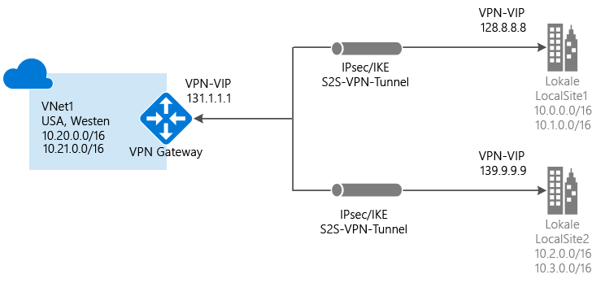
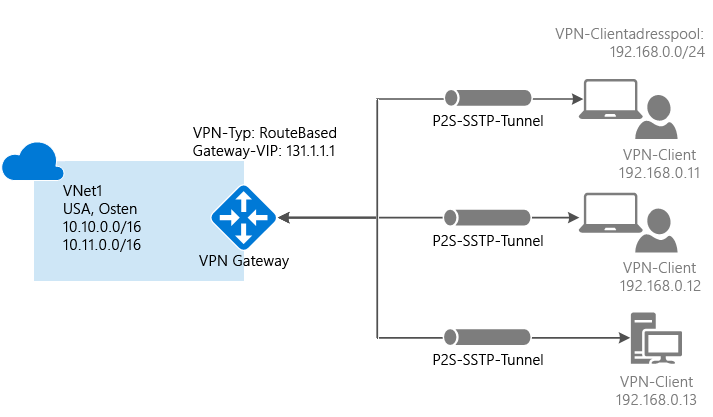
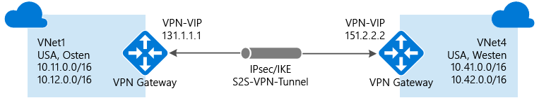
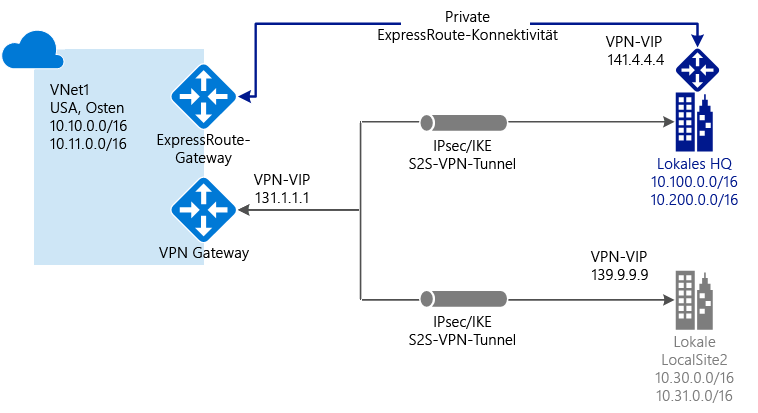

# Informationen zu VPN Gateway
Wenn Sie Netzwerkdatenverkehr zwischen Ihrem virtuellen Azure-Netzwerk und Ihrem lokalen Standort senden möchten, müssen Sie für Ihr virtuelles Netzwerk ein Gateway für virtuelle Netzwerke erstellen. Ein VPN Gateway ist eine Art von Gateway für virtuelle Netzwerke, mit dem verschlüsselter Datenverkehr über eine öffentliche Verbindung gesendet wird. Sie können VPN-Gateways auch verwenden, um Datenverkehr zwischen virtuellen Azure-Netzwerken über das Microsoft-Netzwerk zu senden.

Zur Auswahl stehen zwei Arten von Gateways für virtuelle Netzwerke: „ExpressRoute“ und „Vpn“. Der gewünschte Gatewaytyp wird beim Erstellen eines Gateways für virtuelle Netzwerke angegeben. Ein VPN-Gateway ist ein Gateway für virtuelle Netzwerke mit dem Gatewaytyp „Vpn“. 

Jedes virtuelle Netzwerk kann über zwei Gateways für virtuelle Netzwerke, aber nur über eins von jedem Typ verfügen. Abhängig von den gewählten Einstellungen können Sie ggf. mehrere Verbindungen mit einem einzelnen VPN-Gateway erstellen. Ein Beispiel hierfür ist eine Verbindungskonfiguration mit mehreren Standorten. Wenn Sie mehrere Verbindungen mit dem gleichen VPN-Gateway erstellen, teilen sich alle VPN-Tunnel (einschließlich Point-to-Site-VPNs) die für das Gateway zur Verfügung stehende Bandbreite.

## Konfigurieren von VPN Gateway
Eine VPN Gateway-Verbindung basiert auf mehreren, mit spezifischen Einstellungen konfigurierten Ressourcen. Die meisten der Ressourcen können separat konfiguriert werden. In manchen Fällen ist allerdings eine bestimmte Reihenfolge einzuhalten.

###Einstellungen
Die Einstellungen, die Sie für die einzelnen Ressourcen auswählen, sind für eine erfolgreiche Verbindungserstellung entscheidend. Informationen zu einzelnen Ressourcen und Einstellungen für VPN Gateway finden Sie unter [Informationen zu VPN Gateway-Einstellungen](vpn-gateway-about-vpn-gateway-settings.md). Dort können Sie sich ausführlicher mit Gatewaytypen, VPN-Typen, Verbindungstypen, Gatewaysubnetzen, lokalen Netzwerkgateways und verschiedenen anderen Ressourceneinstellungen beschäftigen, die Sie möglicherweise berücksichtigen sollten.

###Bereitstellungstools
Sie können zunächst mit einem Konfigurationstool wie dem Azure-Portal Ressourcen erstellen und konfigurieren. Später können Sie dann mit einem anderen Tool (beispielsweise PowerShell) zusätzliche Ressourcen konfigurieren oder ggf. vorhandene Ressourcen ändern. Derzeit können nicht alle Ressourcen und Ressourceneinstellungen über das Azure-Portal konfiguriert werden. Sollte ein bestimmtes Konfigurationstool benötigt werden, ist dies in den Anleitungen der Artikel zu den einzelnen Verbindungstopologien angegeben. 

###Bereitstellungsmodell
Die Konfigurationsschritte für ein VPN-Gateway hängen davon ab, mit welchem Bereitstellungsmodell Sie das virtuelle Netzwerk erstellt haben. Wenn Sie Ihr VNET beispielsweise mit dem klassischen Bereitstellungsmodell erstellt haben, verwenden Sie die Richtlinien und Anleitungen für das klassische Bereitstellungsmodell, um die Einstellungen für das VPN Gateway zu erstellen und zu konfigurieren. Weitere Informationen zu Bereitstellungsmodellen finden Sie unter [Azure Resource Manager-Bereitstellung im Vergleich zur klassischen Bereitstellung: Grundlegendes zu Bereitstellungsmodellen und zum Status von Ressourcen](../azure-resource-manager/resource-manager-deployment-model.md).

## Diagramme zur Verbindungstopologie
Wichtig: Für VPN-Gateway-Verbindungen sind verschiedene Konfigurationen verfügbar. Sie müssen ermitteln, welche Konfiguration am besten zu Ihren Anforderungen passt. Die folgenden Abschnitte enthalten Informationen und Topologiediagramme zu den folgenden VPN-Gatewayverbindungen: Die folgenden Abschnitte enthalten Tabellen mit Folgendem:

* Verfügbares Bereitstellungsmodell
* Verfügbare Konfigurationstools
* Direkte Links zu Artikeln, sofern verfügbar

Orientieren Sie sich bei der Wahl einer geeigneten Verbindungstopologie an den Diagrammen und Beschreibungen. Die Diagramme zeigen die grundlegenden Topologien, aber Sie können auch komplexere Topologien erstellen, indem Sie die Diagramme als Anhaltspunkte verwenden.

## Site-to-Site und Multi-Site (IPsec-/IKE-VPN-Tunnel)
### Site-to-Site
Eine VPN Gateway-S2S-Verbindung (Site-to-Site) ist eine Verbindung über einen VPN-Tunnel vom Typ „IPsec/IKE“ (IKEv1 oder IKEv2). Für diese Art von Verbindung wird ein lokales VPN-Gerät benötigt, dem eine öffentliche IP-Adresse zugewiesen ist und das nicht hinter einer NAT-Einheit angeordnet ist. S2S-Verbindungen können für standortübergreifende Konfigurationen und Hybridkonfigurationen verwendet werden.   

### Multi-Site
Bei dieser Art von Verbindung handelt es sich um eine Abwandlung der Site-to-Site-Verbindung. Sie erstellen mehrere VPN-Verbindung über Ihr Gateway für virtuelle Netzwerke, durch die in der Regel mehrere lokale Standorte verbunden werden. Bei Verwendung mehrerer Verbindungen müssen Sie den VPN-Typ „RouteBased“ verwenden (wird bei Verwendung klassischer VNets als dynamisches Gateway bezeichnet). Da jedes virtuelle Netzwerk nur über ein einzelnes VPN-Gateway verfügen kann, wird die verfügbare Bandbreite von allen über das Gateway laufenden Verbindungen gemeinsam genutzt. Dies wird häufig als Multi-Site-Verbindung bezeichnet.

### Bereitstellungsmodelle und -methoden für Site-to-Site und Multi-Site
[!INCLUDE [vpn-gateway-table-site-to-site](../../includes/vpn-gateway-table-site-to-site-include.md)]

## Point-to-Site (VPN über SSTP)
Mit einer VPN Gateway-P2S-Konfiguration (Point-to-Site) können Sie von einem einzelnen Clientcomputer aus eine sichere Verbindung mit Ihrem virtuellen Netzwerk herstellen. P2S ist eine VPN-Verbindung über SSTP (Secure Socket Tunneling-Protokoll). Damit P2S-Verbindungen funktionieren, ist kein VPN-Gerät und keine öffentliche IP-Adresse erforderlich. Sie stellen die VPN-Verbindung her, indem Sie sie vom Clientcomputer aus initiieren. Dies ist hilfreich, wenn Sie an einem Remotestandort (etwa zu Hause oder in einer Konferenz) eine Verbindung mit Ihrem VNet herstellen möchten oder nur über eine geringe Anzahl von Clients verfügen, die mit einem VNet verbunden werden sollen. P2S-Verbindungen können mit S2S-Verbindungen über das gleiche VPN-Gateway verwendet werden – vorausgesetzt, alle Konfigurationsanforderungen beider Verbindungen sind kompatibel.

### Bereitstellungsmodelle und -methoden für Point-to-Site
[!INCLUDE [vpn-gateway-table-point-to-site](../../includes/vpn-gateway-table-point-to-site-include.md)]

## VNet-zu-VNet-Verbindungen (IPsec-/IKE-VPN-Tunnel)
Das Verbinden eines virtuellen Netzwerks mit einem anderen virtuellen Netzwerk (VNet-zu-VNet) ähnelt dem Verbinden eines VNet mit einem lokalen Standort. Beide Verbindungstypen verwenden ein VPN-Gateway, um einen sicheren Tunnel mit IPsec/IKE bereitzustellen. Die VNet-zu-VNet-Kommunikation kann sogar mit Multi-Site-Verbindungskonfigurationen kombiniert werden. Auf diese Weise können Sie Netzwerktopologien einrichten, die standortübergreifende Konnektivität mit Konnektivität zwischen virtuellen Netzwerken kombinieren.

Die verbundenen VNets können wie folgt angeordnet sein:

* In derselben Region oder in verschiedenen Regionen
* In demselben Abonnement oder in verschiedenen Abonnements 
* In demselben Bereitstellungsmodell oder in verschiedenen Bereitstellungsmodellen

###Verbindungen zwischen Bereitstellungsmodellen
In Azure sind zurzeit zwei Bereitstellungsmodelle verfügbar: klassisches Modell und Resource Manager-Modell. Wenn Sie Azure seit einiger Zeit verwenden, verfügen Sie wahrscheinlich über Azure-VMs und Instanzrollen, die in einem klassischen VNet ausgeführt werden. Ihre neueren VMs und Rolleninstanzen werden möglicherweise in einem in Resource Manager erstellten VNet ausgeführt. Sie können eine Verbindung zwischen den VNets erstellen, damit die Ressourcen in einem VNet direkt mit Ressourcen im anderen VNet kommunizieren können.

###VNet-Peering
Sofern Ihr virtuelles Netzwerk bestimmte Anforderungen erfüllt, können Sie Ihre Verbindung ggf. mithilfe von VNet-Peering erstellen. Beim VNet-Peering wird kein Gateway für das virtuelle Netzwerk verwendet. Weitere Informationen finden Sie unter [VNet-Peering](../virtual-network/virtual-network-peering-overview.md).

###Bereitstellungsmodelle und -methoden für VNet-zu-VNet
[!INCLUDE [vpn-gateway-table-vnet-to-vnet](../../includes/vpn-gateway-table-vnet-to-vnet-include.md)]

## ExpressRoute (dedizierte private Verbindung)
Mit Microsoft Azure ExpressRoute können Sie Ihre lokalen Netzwerke über eine dedizierte private Verbindung, die von einem Konnektivitätsanbieter bereitgestellt wird, in die Microsoft Cloud erweitern. Mit ExpressRoute können Sie Verbindungen mit Microsoft-Clouddiensten herstellen, z. B. Microsoft Azure, Office 365 und CRM Online. Die Konnektivität kann über ein Any-to-Any-Netzwerk (IP VPN), ein Point-to-Point-Ethernet-Netzwerk oder eine virtuelle Querverbindung über einen Konnektivitätsanbieter in einer Co-Location-Einrichtung bereitgestellt werden.

ExpressRoute-Verbindungen verlaufen nicht über das öffentliche Internet. Auf diese Weise können ExpressRoute-Verbindungen eine höhere Sicherheit, größere Zuverlässigkeit und schnellere Geschwindigkeit bei geringerer Latenz als herkömmliche Verbindungen über das Internet bieten.

Bei ExpressRoute-Verbindungen kommt zwar kein VPN-Gateway zur Anwendung, als Teil der erforderlichen Konfiguration wird jedoch ein Gateway für virtuelle Netzwerke verwendet. Bei einer ExpressRoute-Verbindung wird das Gateway für virtuelle Netzwerke nicht mit dem Gatewaytyp „Vpn“, sondern mit „ExpressRoute“ konfiguriert. Weitere Informationen über ExpressRoute finden Sie unter [ExpressRoute – Technische Übersicht](../expressroute/expressroute-introduction.md).

## Parallel bestehende Site-to-Site- und ExpressRoute-Verbindungen
ExpressRoute ist eine direkte, dedizierte Verbindung aus Ihrem WAN mit Microsoft Services (einschließlich Azure), die nicht über das öffentliche Internet verläuft. Site-to-Site-VPN-Datenverkehr wird verschlüsselt über das öffentliche Internet gesendet. Die Möglichkeit, Site-to-Site-VPN- und ExpressRoute-Verbindungen für dasselbe virtuelle Netzwerk zu konfigurieren, hat mehrere Vorteile.

Sie können eine Site-to-Site-VPN-Verbindung als sicheren Failoverpfad für ExpressRoute konfigurieren oder für die Verbindung mit Websites nutzen, die nicht Teil Ihres Netzwerks, aber über ExpressRoute verbunden sind. Diese Konfiguration erfordert zwei Gateways für das gleiche virtuelle Netzwerk: eins mit dem Gatewaytyp „Vpn“ und eins mit dem Gatewaytyp „ExpressRoute“.

### Bereitstellungsmodelle und -methoden für S2S und ExpressRoute
[!INCLUDE [vpn-gateway-table-coexist](../../includes/vpn-gateway-table-coexist-include.md)]

## Preise
[!INCLUDE [vpn-gateway-about-pricing-include](../../includes/vpn-gateway-about-pricing-include.md)]

## Gateway-SKUs
[!INCLUDE [vpn-gateway-gwsku-include](../../includes/vpn-gateway-gwsku-include.md)]

Weitere Informationen zu Gateway-SKUs für VPN Gateway finden Sie unter [Gateway-SKUs](vpn-gateway-about-vpn-gateway-settings.md#gwsku).

### Voraussichtlicher aggregierter Durchsatz nach SKU
[!INCLUDE [vpn-gateway-table-gwtype-aggthroughput](../../includes/vpn-gateway-table-gwtype-aggtput-include.md)]

## Nächste Schritte
- Planen Sie Ihre VPN Gateway-Konfiguration. Siehe [Planung und Entwurf für VPN Gateway](vpn-gateway-plan-design.md).
- Weitere Informationen finden Sie unter [Häufig gestellte Fragen zum VPN-Gateway](vpn-gateway-vpn-faq.md).
- Sehen Sie sich die [Abonnements und Diensteinschränkungen](../azure-subscription-service-limits.md#networking-limits) an.

