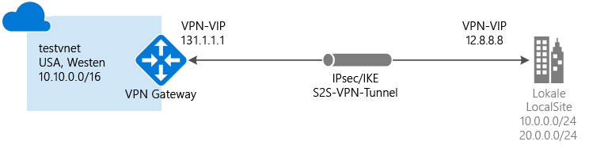

# Erstellen eines VNET mit einer Site-to-Site-VPN-Verbindung per PowerShell
> [!div class="op_single_selector"]
> * [Resource Manager – Azure-Portal](vpn-gateway-howto-site-to-site-resource-manager-portal.md)
> * [Resource Manager – PowerShell](vpn-gateway-create-site-to-site-rm-powershell.md)
> * [Klassisch – Klassisches Portal](vpn-gateway-site-to-site-create.md)
>
>

In diesem Artikel werden das Erstellen eines virtuellen Netzwerks und das Herstellen einer Site-to-Site-VPN-Gatewayverbindung mit Ihrem lokalen Netzwerk mithilfe des Azure Resource Manager-Bereitstellungsmodells beschrieben. Site-to-Site-Verbindungen können für standortübergreifende Konfigurationen und Hybridkonfigurationen verwendet werden.

### Bereitstellungsmodelle und -methoden für Site-to-Site-Verbindungen
[!INCLUDE [deployment models](../../includes/vpn-gateway-deployment-models-include.md)]

Die folgende Tabelle zeigt die derzeit verfügbaren Bereitstellungsmodelle und -methoden für Site-to-Site-Konfigurationen. Falls ein Artikel mit Konfigurationsschritten verfügbar ist, steht in der Tabelle ein direkter Link zur Verfügung.

[!INCLUDE [site-to-site table](../../includes/vpn-gateway-table-site-to-site-include.md)]

#### Zusätzliche Konfigurationen
Wenn Sie VNets miteinander verbinden möchten, aber keine Verbindung mit einem lokalen Standort erstellen, finden Sie unter [Konfigurieren einer VNet-zu-VNet-Verbindung](vpn-gateway-vnet-vnet-rm-ps.md)entsprechende Informationen. Wenn Sie eine Site-to-Site-Verbindung mit einem VNET hinzufügen möchten, das bereits über eine Verbindung verfügt, lesen Sie unter [Hinzufügen einer S2S-Verbindung mit einem VNET mit einer vorhandenen VPN-Gatewayverbindung](vpn-gateway-howto-multi-site-to-site-resource-manager-portal.md) nach.

## Voraussetzungen
Vergewissern Sie sich vor Beginn der Konfiguration, dass Sie über Folgendes verfügen:

* Ein kompatibles VPN-Gerät (und eine Person, die es konfigurieren kann). Weitere Informationen finden Sie unter [Informationen zu VPN-Geräten](vpn-gateway-about-vpn-devices.md). Wenn Sie sich mit dem Konfigurieren des VPN-Geräts oder mit den IP-Adressbereichen Ihrer lokalen Netzwerkkonfiguration nicht auskennen, müssen Sie sich an eine Person wenden, die Ihnen diese Details liefern kann.
* Eine externe öffentliche IP-Adresse für Ihr VPN-Gerät. Diese IP-Adresse darf sich nicht hinter einer NAT befinden.
* Ein Azure-Abonnement. Wenn Sie noch kein Azure-Abonnement besitzen, können Sie Ihre [MSDN-Abonnentenvorteile](https://azure.microsoft.com/pricing/member-offers/msdn-benefits-details) aktivieren oder sich für ein [kostenloses Konto](https://azure.microsoft.com/pricing/free-trial) registrieren.
* Die aktuelle Version der PowerShell-Cmdlets für Azure Resource Manager. Weitere Informationen zur Installation der PowerShell-Cmdlets finden Sie unter [Installieren und Konfigurieren von Azure PowerShell](/powershell/azureps-cmdlets-docs) .

## 1. Verbinden mit Ihrem Abonnement
Stellen Sie sicher, dass Sie in den PowerShell-Modus wechseln, um die Ressourcen-Manager-Cmdlets zu verwenden. Weitere Informationen finden Sie unter [Verwenden von Windows PowerShell mit Resource Manager](../powershell-azure-resource-manager.md).

Öffnen Sie die PowerShell-Konsole, und stellen Sie eine Verbindung mit Ihrem Konto her. Verwenden Sie das folgende Beispiel, um eine Verbindung herzustellen:

    Login-AzureRmAccount

Überprüfen Sie die Abonnements für das Konto.

    Get-AzureRmSubscription

Geben Sie das Abonnement an, das Sie verwenden möchten.

    Select-AzureRmSubscription -SubscriptionName "Replace_with_your_subscription_name"

## 2. Erstellen eines virtuelles Netzwerks und eines Gatewaysubnetzes
Für die Beispiele wird ein Gatewaysubnetz von /28 verwendet. Es ist zwar möglich, ein Gatewaysubnetz von /29 zu erstellen, es wird jedoch empfohlen, ein größeres Subnetz mit mehr Adressen zu erstellen und mindestens /28 oder /27 auszuwählen. Dadurch steht eine ausreichend hohe Anzahl von Adressen für mögliche zusätzliche Konfigurationen zur Verfügung, die Sie zukünftig vielleicht benötigen.

Wenn Sie bereits über ein virtuelles Netzwerk mit einem Gatewaysubnetz von /29 oder größer verfügen, können Sie direkt mit [Hinzufügen Ihres Gateways für das lokale Netzwerk](#localnet)fortfahren.

[!INCLUDE [vpn-gateway-no-nsg](../../includes/vpn-gateway-no-nsg-include.md)]

### So erstellen Sie ein virtuelles Netzwerk und ein Gatewaysubnetz
Nutzen Sie das folgende Beispiel, um ein virtuelles Netzwerk und ein Gatewaysubnetz zu erstellen. Ersetzen Sie die Werte durch Ihre eigenen.

Erstellen Sie zunächst eine Ressourcengruppe:

    New-AzureRmResourceGroup -Name testrg -Location 'West US'

Erstellen Sie als Nächstes das virtuelle Netzwerk. Stellen Sie sicher, dass sich die angegebenen Adressräume und die Adressräume im lokalen Netzwerk nicht überschneiden.

Im folgenden Beispiel werden ein virtuelles Netzwerk mit dem Namen *testvnet* und zwei Subnetze erstellt: eines mit der Bezeichnung *GatewaySubnet* und das andere mit der Bezeichnung *Subnet1*. Es ist wichtig, ein Subnetz speziell mit dem Namen *GatewaySubnet*zu erstellen. Wenn Sie einen anderen Namen wählen, schlägt die Verbindungskonfiguration fehl.

Legen Sie die Variablen fest.

    $subnet1 = New-AzureRmVirtualNetworkSubnetConfig -Name 'GatewaySubnet' -AddressPrefix 10.0.0.0/28
    $subnet2 = New-AzureRmVirtualNetworkSubnetConfig -Name 'Subnet1' -AddressPrefix '10.0.1.0/28'

Erstellen Sie das VNet.

    New-AzureRmVirtualNetwork -Name testvnet -ResourceGroupName testrg `
    -Location 'West US' -AddressPrefix 10.0.0.0/16 -Subnet $subnet1, $subnet2

### So fügen Sie einem virtuellen Netzwerk, das Sie bereits erstellt haben, ein Gatewaysubnetz hinzu
Dieser Schritt ist nur erforderlich, wenn Sie einem VNet ein Gatewaysubnetz hinzufügen müssen, das Sie zuvor erstellt haben.

Sie können das Gatewaysubnetz anhand des folgenden Beispiels erstellen. Achten Sie darauf, dass Sie das Gatewaysubnetz "GatewaySubnet" nennen. Wenn Sie einen anderen Namen verwenden, erstellen Sie zwar ein Subnetz, aber es wird von Azure nicht wie ein Gatewaysubnetz behandelt.

Legen Sie die Variablen fest.

    $vnet = Get-AzureRmVirtualNetwork -ResourceGroupName testrg -Name testvnet

Erstellen Sie das Gatewaysubnetz.

    Add-AzureRmVirtualNetworkSubnetConfig -Name 'GatewaySubnet' -AddressPrefix 10.0.3.0/28 -VirtualNetwork $vnet

Legen Sie die Konfiguration fest.

    Set-AzureRmVirtualNetwork -VirtualNetwork $vnet

## 3. Hinzufügen Ihres Gateways für das lokale Netzwerk
In einem virtuellen Netzwerk ist mit dem Gateway für das lokale Netzwerk in der Regel Ihr lokaler Standort gemeint. Sie geben dem Standort einen Namen, mit dem Azure darauf verweisen kann. Außerdem geben Sie das Adressraumpräfix für das Gateway für das lokale Netzwerk an.

Azure verwendet das IP-Adresspräfix, um zu ermitteln, welcher Datenverkehr an Ihren lokalen Standort gesendet werden soll. Dies bedeutet, dass Sie jedes Adresspräfix angeben müssen, das dem Gateway für das lokale Netzwerk zugeordnet werden soll. Sie können diese Präfixe einfach aktualisieren, wenn sich Ihr lokales Netzwerk ändert.

Beachten Sie beim Verwenden der PowerShell-Beispiele Folgendes:

* *GatewayIPAddress* ist die IP-Adresse Ihres lokalen VPN-Geräts. Das VPN-Gerät darf sich nicht hinter einer NAT befinden.
* *AddressPrefix* ist Ihr lokaler Adressraum.

So fügen Sie ein Gateway für das lokale Netzwerk mit einem Adresspräfix hinzu

    New-AzureRmLocalNetworkGateway -Name LocalSite -ResourceGroupName testrg `
    -Location 'West US' -GatewayIpAddress '23.99.221.164' -AddressPrefix '10.5.51.0/24'

So fügen Sie ein Gateway für das lokale Netzwerk mit mehreren Adresspräfixen hinzu

    New-AzureRmLocalNetworkGateway -Name LocalSite -ResourceGroupName testrg `
    -Location 'West US' -GatewayIpAddress '23.99.221.164' -AddressPrefix @('10.0.0.0/24','20.0.0.0/24')

### So ändern Sie die IP-Adresspräfixe für das Gateway für das lokale Netzwerk
Es kann vorkommen, dass sich die Präfixe für das Gateway für das lokale Netzwerk ändern. Die Schritte, die Sie zum Ändern der IP-Adresspräfixe ausführen, richten sich danach, ob Sie eine VPN Gateway-Verbindung erstellt haben. Weitere Informationen finden Sie in diesem Artikel im Abschnitt [So ändern Sie die IP-Adresspräfixe für ein lokales Netzwerkgateway](#modify) .

## 4. Anfordern einer öffentlichen IP-Adresse für das VPN Gateway
Fordern Sie als Nächstes eine öffentliche IP-Adresse an, die Ihrem Azure-VNet-VPN Gateway zugewiesen wird. Dies ist nicht die gleiche IP-Adresse, die dem VPN-Gerät zugewiesen wird. Sie wird stattdessen dem Azure VPN Gateway selbst zugewiesen. Es ist nicht möglich, die IP-Adresse selbst anzugeben. Sie wird Ihrem Gateway dynamisch zugewiesen. Sie verwenden diese IP-Adresse bei der Konfiguration des lokalen VPN-Geräts für die Verbindung mit dem Gateway.

Azure VPN Gateway für das Ressourcen-Manager-Bereitstellungsmodell unterstützt derzeit nur öffentliche IP-Adressen. Dabei wird die Methode der dynamischen Zuweisung verwendet. Das bedeutet jedoch nicht, dass sich die IP-Adresse ändert. Die IP-Adresse von Azure VPN Gateway ändert sich nur, wenn das Gateway gelöscht und neu erstellt wird. Die öffentliche IP-Adresse des Gateways ändert sich nicht bei Größenänderungen, beim Zurücksetzen oder bei anderen internen Wartungs-/Upgradeprozessen von Azure VPN Gateway.

Verwenden Sie das folgende PowerShell-Beispiel:

    $gwpip= New-AzureRmPublicIpAddress -Name gwpip -ResourceGroupName testrg -Location 'West US' -AllocationMethod Dynamic

## 5. Erstellen der Gateway-IP-Adressierung
Die Gatewaykonfiguration definiert das zu verwendende Subnetz und die zu verwendende öffentliche IP-Adresse. Verwenden Sie das folgende Beispiel, um Ihre Gatewaykonfiguration zu erstellen.

    $vnet = Get-AzureRmVirtualNetwork -Name testvnet -ResourceGroupName testrg
    $subnet = Get-AzureRmVirtualNetworkSubnetConfig -Name 'GatewaySubnet' -VirtualNetwork $vnet
    $gwipconfig = New-AzureRmVirtualNetworkGatewayIpConfig -Name gwipconfig1 -SubnetId $subnet.Id -PublicIpAddressId $gwpip.Id

## 6. Erstellen des Gateways für das lokale Netzwerk
In diesem Schritt erstellen Sie das Gateway des virtuellen Netzwerks. Die Erstellung eines Gateways kann relativ lange dauern. Häufig werden 45 Minuten oder mehr benötigt.

Verwenden Sie die folgenden Werte:

* *-GatewayType* für eine Site-to-Site-Konfiguration lautet *Vpn*. Der Gatewaytyp ist immer spezifisch für die Konfiguration, die Sie implementieren. Beispielsweise kann für andere Gatewaykonfigurationen für -GatewayType die Einstellung „ExpressRoute“ erforderlich sein.
* *-VpnType* kann *RouteBased* (in einigen Dokumentationen als dynamisches Gateway bezeichnet) oder *PolicyBased* lauten (in einigen Dokumentationen als statisches Gateway bezeichnet). Weitere Informationen zu VPN-Gatewaytypen finden Sie unter [Informationen zu VPN-Gateways](vpn-gateway-about-vpngateways.md).
* *-GatewaySku* kann auf *Basic*, *Standard* oder *HighPerformance* festgelegt werden.     

        New-AzureRmVirtualNetworkGateway -Name vnetgw1 -ResourceGroupName testrg `
        -Location 'West US' -IpConfigurations $gwipconfig -GatewayType Vpn `
        -VpnType RouteBased -GatewaySku Standard

## 7. Konfigurieren des VPN-Geräts
An diesem Punkt benötigen Sie die öffentliche IP-Adresse des Gateways des virtuellen Netzwerks für die Konfiguration Ihres lokalen VPN-Geräts. Halten Sie mit Ihrem Gerätehersteller für spezifische Informationen zur Konfiguration Rücksprache. Weitere Informationen finden Sie unter [VPN-Geräte](vpn-gateway-about-vpn-devices.md).

Um die öffentliche IP-Adresse des Gateways des virtuellen Netzwerks zu ermitteln, verwenden Sie das folgende Beispiel:

    Get-AzureRmPublicIpAddress -Name gwpip -ResourceGroupName testrg

## 8. Erstellen der VPN-Verbindung
Erstellen Sie als Nächstes die Site-to-Site-VPN-Verbindung zwischen dem Gateway Ihres virtuellen Netzwerks und Ihrem VPN-Gerät. Achten Sie darauf, dass Sie die Werte durch Ihre eigenen Werte ersetzen. Der gemeinsame Schlüssel muss dem Wert entsprechen, den Sie für Ihre VPN-Gerätekonfiguration verwendet haben. Beachten Sie, dass `-ConnectionType` für „Site-to-Site“ *IPsec*lautet.

Legen Sie die Variablen fest.

    $gateway1 = Get-AzureRmVirtualNetworkGateway -Name vnetgw1 -ResourceGroupName testrg
    $local = Get-AzureRmLocalNetworkGateway -Name LocalSite -ResourceGroupName testrg

Erstellen Sie die Verbindung.

    New-AzureRmVirtualNetworkGatewayConnection -Name localtovon -ResourceGroupName testrg `
    -Location 'West US' -VirtualNetworkGateway1 $gateway1 -LocalNetworkGateway2 $local `
    -ConnectionType IPsec -RoutingWeight 10 -SharedKey 'abc123'

Die Verbindung wird nach kurzer Zeit hergestellt.

## So überprüfen Sie eine VPN-Verbindung
Es gibt mehrere Möglichkeiten, wie Sie Ihre VPN-Verbindung überprüfen können.

[!INCLUDE [vpn-gateway-verify-connection-rm](../../includes/vpn-gateway-verify-connection-rm-include.md)]

## So ändern Sie die IP-Adresspräfixe für ein lokales Netzwerkgateway
Verwenden Sie die unten angegebene Anleitung, wenn Sie die Präfixe für Ihr Gateway für das lokale Netzwerk ändern müssen. Es sind zwei Anleitungen vorhanden. Welche Anleitung für Sie geeignet ist, hängt davon ab, ob Sie die Gatewayverbindung bereits erstellt haben.

[!INCLUDE [vpn-gateway-modify-ip-prefix-rm](../../includes/vpn-gateway-modify-ip-prefix-rm-include.md)]

## So ändern Sie die Gateway-IP-Adresse für ein lokales Netzwerkgateway
[!INCLUDE [vpn-gateway-modify-lng-gateway-ip-rm](../../includes/vpn-gateway-modify-lng-gateway-ip-rm-include.md)]

## Nächste Schritte
*  Sobald die Verbindung hergestellt ist, können Sie Ihren virtuellen Netzwerken virtuelle Computer hinzufügen. Weitere Informationen finden Sie unter [Virtuelle Computer](https://docs.microsoft.com/azure/#pivot=services&panel=Compute) .
* Informationen zu BGP finden Sie in der [Übersicht über BGP](vpn-gateway-bgp-overview.md) und unter [Konfigurieren von BGP](vpn-gateway-bgp-resource-manager-ps.md).

<!--HONumber=Feb17_HO3-->

