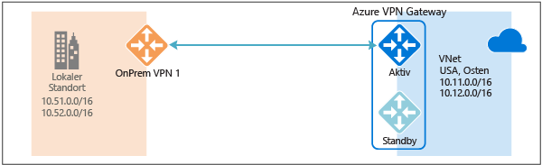
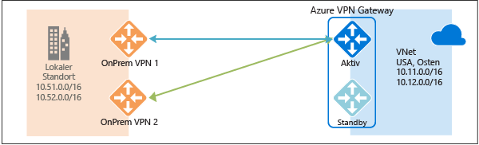
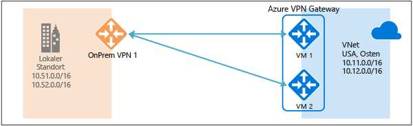
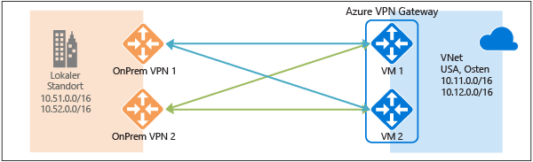
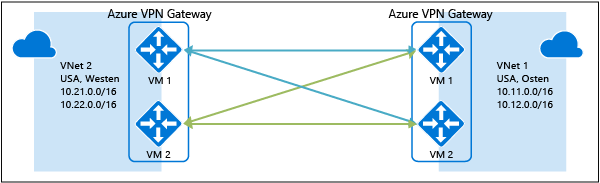

<properties
   pageTitle="Übersicht über Konfigurationen für hohe Verfügbarkeit mit Azure-VPN-Gateways | Microsoft Azure"
   description="Dieser Artikel enthält eine Übersicht über die Optionen zur Konfiguration für hohe Verfügbarkeit mit Azure-VPN-Gateways."
   services="vpn-gateway"
   documentationCenter="na"
   authors="yushwang"
   manager="rossort"
   editor=""
   tags=""/>

<tags
   ms.service="vpn-gateway"
   ms.devlang="na"
   ms.topic="get-started-article"
   ms.tgt_pltfrm="na"
   ms.workload="infrastructure-services"
   ms.date="09/24/2016"
   ms.author="yushwang"/>

# Standortübergreifende Verbindungen und VNet-zu-VNet-Verbindungen mit hoher Verfügbarkeit

In diesem Artikel erhalten Sie einen Überblick über Optionen zur Konfiguration der hohen Verfügbarkeit für standortübergreifende Verbindungen und VNet-zu-VNet-Verbindungen mit Azure-VPN-Gateways.

## Informationen zur Redundanz von Azure-VPN-Gateways

Jede Azure-VPN-Gateway-Instanz umfasst zwei VM-Instanzen in einer Konfiguration mit aktivem Standbymodus. Für alle geplanten Wartungsarbeiten oder ungeplanten Störungen, die für die aktive Instanz anfallen, wird automatisch zur Standbyinstanz gewechselt (Failover), und die S2S-VPN- oder VNet-zu-VNet-Verbindungen werden wiederhergestellt. Bei diesem Wechsel kommt es zu einer kurzen Unterbrechung. Bei der geplanten Wartung sollte die Verbindung innerhalb von 10 bis 15 Sekunden wiederhergestellt werden. Bei ungeplanten Problemen dauert die Wiederherstellung der Verbindung länger, und zwar schlimmstenfalls zwischen 1 und 1,5 Minuten. Für P2S-VPN-Clientverbindungen mit dem Gateway werden die P2S-Verbindungen getrennt, und die Benutzer müssen die Verbindungen von den Clientcomputern neu herstellen.

## Standortübergreifende Verbindungen mit hoher Verfügbarkeit

Es gibt zwei Optionen, mit denen Sie die Verfügbarkeit für standortübergreifende Verbindungen verbessern können:

- Mehrere lokale VPN-Geräte
- Azure-VPN-Gateway vom Typ „Aktiv/Aktiv“
- Kombination beider Optionen

### Mehrere lokale VPN-Geräte

Sie können mehrere VPN-Geräte in Ihrem lokalen Netzwerk verwenden, um eine Verbindung mit Ihrem Azure-VPN-Gateway herzustellen. Dies ist im folgenden Diagramm dargestellt:

Diese Konfiguration enthält mehrere aktive Tunnel von demselben Azure-VPN-Gateway zu Ihren lokalen Geräten an einem Standort. Es gelten einige Anforderungen und Einschränkungen:

1. Sie müssen mehrere S2S-VPN-Verbindungen von Ihren VPN-Geräten mit Azure herstellen. Wenn Sie für mehrere VPN-Geräte eine Verbindung aus demselben lokalen Netzwerk mit Azure herstellen, müssen Sie für jedes VPN-Gerät ein Gateway für das lokale Netzwerk und eine Verbindung von Ihrem Azure-VPN-Gateway zum Gateway des lokalen Netzwerks erstellen.

2. Die Gateways des lokalen Netzwerks, die Sie für die VPN-Geräte erstellen, müssen in der „GatewayIpAddress“-Eigenschaft über eindeutige öffentliche IP-Adressen verfügen.

3. Für diese Konfiguration wird BGP benötigt. Für jedes Gateway des lokalen Netzwerks, das für ein VPN-Gerät steht, muss in der „BgpPeerIpAddress“-Eigenschaft eine eindeutige BGP-Peer-IP-Adresse angegeben werden.

4. Die AddressPrefix-Eigenschaftenfelder dürfen sich in einem Gateway des lokalen Netzwerks jeweils nicht überlappen. Geben Sie „BgpPeerIpAddress“ im Feld „AddressPrefix“ im CIDR-Format „/32“ ein, z.B. 10.200.200.254/32.

5. Sie sollten BGP verwenden, um die Präfixe jeweils gegenüber denselben Präfixen des lokalen Netzwerks für das Azure-VPN-Gateway anzukündigen. Der Datenverkehr wird gleichzeitig durch diese Tunnel geleitet.

6. Jede Verbindung wird anhand der maximalen Anzahl von Tunneln für Ihr Azure-VPN-Gateway gezählt: 10 für Basic- und Standard-SKUs und 30 für die HighPerformance-SKU.

Bei dieser Konfiguration befindet sich das Azure-VPN-Gateway noch im aktiven Standbymodus. Es kommt also zu demselben Failover und zu der kurzen Unterbrechung wie [oben](#activestandby) beschrieben. Diese Einrichtung bietet aber Schutz vor Ausfällen oder Unterbrechungen in Ihrem lokalen Netzwerk und für Ihre VPN-Geräte.
 
### Azure-VPN-Gateway vom Typ „Aktiv/Aktiv“

Sie können jetzt ein Azure-VPN-Gateway in einer Aktiv/Aktiv-Konfiguration erstellen, bei der beide Instanzen der Gateway-VMs jeweils S2S-VPN-Tunnel zum lokalen VPN-Gerät erstellen. Dies ist im folgenden Diagramm dargestellt:

Bei dieser Konfiguration verfügt jedes Azure-Gateway über eine eindeutige öffentliche IP-Adresse, und es wird jeweils ein IPsec/IKE-S2S-VPN-Tunnel zu dem lokalen VPN-Gerät erstellt, das für das Gateway des lokalen Netzwerks und die Verbindung angegeben ist. Beachten Sie, dass beide VPN-Tunnel Teil derselben Verbindung sind. Trotzdem müssen Sie Ihr lokales VPN-Gerät so konfigurieren, dass zwei S2S-VPN-Tunnel zu diesen beiden öffentlichen IP-Adressen des Azure-VPN-Gateways akzeptiert bzw. eingerichtet werden.

Da die Azure-Gatewayinstanzen über eine Aktiv/Aktiv-Konfiguration verfügen, wird der Datenverkehr von Ihrem virtuellen Azure-Netzwerk zum lokalen Netzwerk gleichzeitig durch beide Tunnel geleitet. Dies gilt auch, wenn das lokale VPN-Gerät einen Tunnel bevorzugt behandelt. Beachten Sie hierbei aber, dass ein TCP- oder UDP-Fluss immer denselben Tunnel bzw. Pfad durchläuft, sofern für eine der Instanzen kein Wartungsereignis vorliegt.

Wenn für eine Gatewayinstanz ein geplantes Wartungsereignis oder ein ungeplantes Ereignis eintritt, wird die Verbindung des IPsec-Tunnels von dieser Instanz mit dem lokalen VPN-Gerät getrennt. Die entsprechenden Routen auf Ihren VPN-Geräten sollten automatisch entfernt oder zurückgezogen werden, damit für den Datenverkehr die Umschaltung auf den anderen aktiven IPsec-Tunnel durchgeführt wird. Auf Azure-Seite erfolgt automatisch die Umschaltung von der betroffenen Instanz zur aktiven Instanz.

### Duale Redundanz: Aktiv/Aktiv-VPN-Gateways für Azure-Netzwerke und lokale Netzwerke

Die zuverlässigste Option ist eine Kombination der Aktiv/Aktiv-Gateways in Ihrem Netzwerk und unter Azure. Dies ist im folgenden Diagramm dargestellt:

Hier führen Sie die Erstellung und Einrichtung des Azure-VPN-Gateways in einer Aktiv/Aktiv-Konfiguration durch und erstellen wie oben beschrieben zwei Gateways des lokalen Netzwerks und zwei Verbindungen für Ihre lokalen VPN-Geräte. Das Ergebnis ist eine vollständig vermaschte Verbindung mit vier IPsec-Tunneln zwischen Ihrem virtuellen Azure-Netzwerk und dem lokalen Netzwerk.

Alle Gateways und Tunnel sind auf der Azure-Seite aktiv. Der Datenverkehr wird also auf alle vier Tunnel gleichzeitig verteilt, aber jeder TCP- oder UDP-Fluss verläuft von der Azure-Seite aus wieder über denselben Tunnel oder Pfad. Auch wenn Sie durch das Aufteilen des Datenverkehrs einen etwas besseren Durchsatz über die IPsec-Tunnel erzielen, ist das Hauptziel dieser Konfiguration die hohe Verfügbarkeit. Aufgrund der statistischen Art und Weise der Verteilung ist es außerdem schwierig zu messen, wie sich unterschiedliche Bedingungen für den Anwendungsdatenverkehr auf den Gesamtdurchsatz auswirken.

Für diese Topologie sind zwei Gateways des lokalen Netzwerks und zwei Verbindungen erforderlich, um das lokale VPN-Gerätepaar zu unterstützen, und BGP wird benötigt, um die Zulässigkeit der beiden Verbindungen für dasselbe lokale Netzwerk zu ermöglichen. Diese Anforderungen sind mit den [obigen](#activeactiveonprem) Anforderungen identisch.

## VNet-zu-VNet-Verbindung über Azure-VPN-Gateways mit hoher Verfügbarkeit

Die gleiche Aktiv/Aktiv-Konfiguration kann auch für Azure-VNet-zu-VNet-Verbindungen gelten. Sie können Aktiv/Aktiv-VPN-Gateways für beide virtuellen Netzwerke erstellen und miteinander verbinden, um die gleiche vollständig vermaschte Verbindung mit vier Tunneln zwischen den beiden VNets zu erzielen. Dies ist im folgenden Diagramm dargestellt:

So wird sichergestellt, dass zwischen den beiden virtuellen Netzwerken immer ein Tunnelpaar für geplante Wartungsereignisse vorhanden ist. Dies führt zu einer weiteren Verbesserung der Verfügbarkeit. Für die gleiche Topologie für die standortübergreifende Konnektivität sind zwar zwei Verbindungen erforderlich, aber für die obige VNet-zu-VNet-Topologie wird nur eine Verbindung für jedes Gateway benötigt. Außerdem ist die Verwendung von BGP optional, sofern kein Transitrouting über die VNet-zu-VNet-Verbindung erforderlich ist.

## Nächste Schritte

Die Schritte zum Konfigurieren von standortübergreifenden Verbindungen und VNet-zu-VNet-Verbindungen vom Typ „Aktiv/Aktiv“ finden Sie unter [Configure active-active S2S VPN connections with Azure VPN Gateways using Azure Resource Manager and PowerShell](http://go.microsoft.com/fwlink/?LinkId=828726) (Konfigurieren von Aktiv/Aktiv-S2S-VPN-Verbindungen mit Azure-VPN-Gateways und Azure Resource Manager und PowerShell).

<!---HONumber=AcomDC_0928_2016-->