# Konfigurieren einer Point-to-Site-Verbindung mit einem VNet über das Azure-Portal (klassisch)

[!INCLUDE [deployment models](../../includes/vpn-gateway-classic-deployment-model-include.md)]

In diesem Artikel wird beschrieben, wie Sie über das Azure-Portal im Rahmen des klassischen Bereitstellungsmodells ein VNet mit einer P2S-Verbindung (Point-to-Site) erstellen. Sie können diese Konfiguration auch mit einem anderen Bereitstellungstool oder -modell erstellen. Wählen Sie hierzu in der folgenden Liste eine andere Option:

> [!div class="op_single_selector"]
> * [Resource Manager – Azure-Portal](vpn-gateway-howto-point-to-site-resource-manager-portal.md)
> * [Resource Manager – PowerShell](vpn-gateway-howto-point-to-site-rm-ps.md)
> * [Klassisch – Azure-Portal](vpn-gateway-howto-point-to-site-classic-azure-portal.md)
>
>

Mit einer P2S-Konfiguration (Point-to-Site) können Sie von einem einzelnen Clientcomputer eine sichere Verbindung mit einem virtuellen Netzwerk herstellen. Point-to-Site-Verbindungen sind nützlich, wenn Sie von einem Remotestandort, z.B. von zu Hause oder bei einer Konferenz, eine Verbindung mit Ihrem VNet herstellen möchten. Diese Methode eignet sich auch, wenn Sie nur wenige Clients besitzen, die mit einem virtuellen Netzwerk verbunden werden müssen. Die P2S-VPN-Verbindung wird über den nativen Windows-VPN-Client vom Clientcomputer aus initiiert. Die Clients, die Verbindungen herstellen, verwenden Zertifikate zur Authentifizierung. 

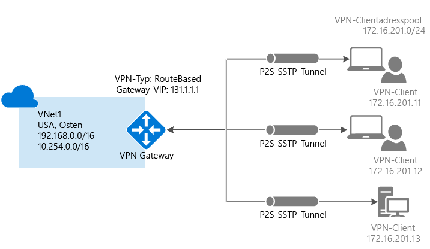

Point-to-Site-Verbindungen erfordern weder ein VPN-Gerät noch eine öffentliche IP-Adresse. P2S erstellt die VPN-Verbindung über SSTP (Secure Socket Tunneling Protocol). Auf Serverseite werden die SSTP-Versionen 1.0, 1.1 und 1.2 unterstützt. Der Client entscheidet, welche Version verwendet wird. Unter Windows 8.1 und höher wird standardmäßig SSTP 1.2 verwendet. Weitere Informationen zu Point-to-Site-Verbindungen finden Sie unter [Point-to-Site – Häufig gestellte Fragen](#faq) am Ende dieses Artikels.

P2S-Verbindungen erfordern Folgendes:

* Ein dynamisches VPN-Gateway.
* Den öffentlichen Schlüssel (CER-Datei) für ein Stammzertifikat, der in Azure hochgeladen wurde. Dies wird als vertrauenswürdiges Zertifikat betrachtet und für die Authentifizierung verwendet.
* Ein Clientzertifikat, das über das Stammzertifikat generiert und auf jedem Clientcomputer installiert wurde, der eine Verbindung herstellen wird. Dieses Zertifikat wird für die Clientauthentifizierung verwendet.
* Ein VPN-Clientkonfigurationspaket muss generiert und auf jedem Clientcomputer installiert werden, der eine Verbindung herstellen wird. Das Clientkonfigurationspaket konfiguriert den nativen VPN-Client, der sich bereits im Betriebssystem befindet, mit den notwendigen Informationen für die Herstellung einer Verbindung mit dem VNET.

### Beispieleinstellungen

Sie können die folgenden Werte zum Erstellen einer Testumgebung oder zum besseren Verständnis der Beispiele in diesem Artikel nutzen:

* **Name: VNet1**
* **Adressraum: 192.168.0.0/16** In diesem Beispiel verwenden wir nur einen einzelnen Adressraum. Sie können für Ihr VNet aber auch mehrere Adressräume verwenden.
* **Subnetzname: FrontEnd**
* **Subnetzadressbereich: 192.168.1.0/24**
* **Abonnement:** Falls Sie über mehrere Abonnements verfügen, vergewissern Sie sich, dass Sie das richtige Abonnement verwenden.
* **Ressourcengruppe: TestRG**
* **Standort: USA, Osten**
* **Verbindungstyp: Point-to-Site**
* **Clientadressraum: 172.16.201.0/24**. VPN-Clients, die über diese Point-to-Site-Verbindung eine Verbindung mit dem VNet herstellen, erhalten eine IP-Adresse aus dem angegebenen Pool.
* **GatewaySubnet: 192.168.200.0/24**. Das Gatewaysubnetz muss den Namen „GatewaySubnet“ haben.
* **Größe:** Wählen Sie die gewünschte Gateway-SKU aus.
* **Routingtyp: Dynamisch**

## Abschnitt 1: Erstellen eines virtuellen Netzwerks und eines VPN-Gateways

Stellen Sie zunächst sicher, dass Sie über ein Azure-Abonnement verfügen. Wenn Sie noch kein Azure-Abonnement besitzen, können Sie Ihre [MSDN-Abonnentenvorteile](https://azure.microsoft.com/pricing/member-offers/msdn-benefits-details) aktivieren oder sich für ein [kostenloses Konto](https://azure.microsoft.com/pricing/free-trial) registrieren.

### Teil 1: Erstellen eines virtuellen Netzwerks

Falls Sie noch nicht über ein virtuelles Netzwerk verfügen, erstellen Sie eines. Die Screenshots dienen lediglich zur Veranschaulichung. Achten Sie darauf, dass Sie die Werte durch Ihre eigenen Werte ersetzen. Gehen Sie wie folgt vor, um ein VNet über das Azure-Portal zu erstellen:

1. Navigieren Sie in einem Browser zum [Azure-Portal](http://portal.azure.com) , und melden Sie sich, falls erforderlich, mit Ihrem Azure-Konto an.
2. Klicken Sie auf **Neu**. Geben Sie im Feld **Marketplace durchsuchen** die Zeichenfolge „Virtual Network“ ein. Klicken Sie in der zurückgegebenen Liste auf **Virtual Network**, um das Blatt **Virtual Network** zu öffnen.

  
3. Wählen Sie im unteren Bereich des Blatts „Virtual Network“ in der Liste **Bereitstellungsmodell auswählen** die Option **Resource Manager** aus, und klicken Sie dann auf **Erstellen**.

  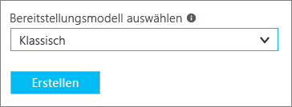
4. Konfigurieren Sie auf dem Blatt **Virtuelles Netzwerk erstellen** die VNet-Einstellungen. Auf diesem Blatt fügen Sie Ihren ersten Adressraum und einen Adressbereich des Subnetzes hinzu. Nachdem Sie die Erstellung des VNet abgeschlossen haben, können Sie zurückgehen und weitere Subnetze und Adressräume hinzufügen.

  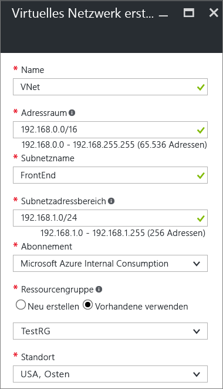
5. Überprüfen Sie, ob es sich um das richtige **Abonnement** handelt. Das Abonnement kann über die Dropdownliste geändert werden.
6. Klicken Sie auf **Ressourcengruppe** , und wählen Sie entweder eine vorhandene Ressourcengruppe aus, oder erstellen Sie eine neue, indem Sie einen Namen für die neue Ressourcengruppe eingeben. Falls Sie eine neue Ressourcengruppe erstellen, geben Sie ihr einen Namen, der zu den geplanten Konfigurationswerten passt. Weitere Informationen zu Ressourcengruppen finden Sie unter [Übersicht über Azure Resource Manager](../azure-resource-manager/resource-group-overview.md#resource-groups).
7. Wählen Sie als Nächstes für das VNet die Einstellungen für **Standort** aus. Der Standort gibt an, wo sich die in diesem VNet bereitgestellten Ressourcen befinden.
8. Wählen Sie **An Dashboard anheften** aus, wenn das VNET komfortabel auf dem Dashboard zur Verfügung stehen soll, und klicken Sie dann auf **Erstellen**.

  
9. Nach dem Klicken auf „Erstellen“ wird auf dem Dashboard eine Kachel mit dem Status des VNETs angezeigt. Die Kachel verändert sich, wenn das VNet erstellt wird.

  
10. Nach Erstellung des virtuellen Netzwerks wird im klassischen Azure-Portal auf der Seite mit den Netzwerken unter **Status** der Eintrag **Erstellt** angezeigt.
11. Fügen Sie einen DNS-Server hinzu (optional). Nach der Erstellung des virtuellen Netzwerks können Sie für die Namensauflösung die IP-Adresse eines DNS-Servers hinzufügen. Der von Ihnen angegebene DNS-Server sollte ein Server sein, der die Namen für die Ressourcen in Ihrem VNet auflösen kann. Öffnen Sie zum Hinzufügen eines DNS-Servers die Einstellungen für Ihr virtuelles Netzwerk, klicken Sie auf „DNS-Server“, und fügen Sie die IP-Adresse des gewünschten DNS-Servers hinzu. Das Clientkonfigurationspaket, das Sie in einem späteren Schritt erstellen, enthält die IP-Adressen der DNS-Server, die Sie in dieser Einstellung angeben. Falls Sie die Liste mit den DNS-Servern später aktualisieren müssen, können Sie neue Pakete für die VPN-Clientkonfiguration generieren, die die aktualisierte Liste widerspiegeln.

### Teil 2: Erstellen eines Gatewaysubnetzes und eines Gateways mit dynamischem Routing

In diesem Schritt erstellen Sie ein Gatewaysubnetz und ein Gateway mit dynamischem Routing. Im Azure-Portal für das klassische Bereitstellungsmodell können Gatewaysubnetz und Gateway über die gleichen Konfigurationsblätter erstellt werden.

1. Navigieren Sie im Portal zu dem virtuellen Netzwerk, für das Sie ein Gateway erstellen möchten.
2. Klicken Sie auf dem Blatt für Ihr virtuelles Netzwerk auf dem Blatt **Übersicht** im Abschnitt mit den VPN-Verbindungen auf **Gateway**.

  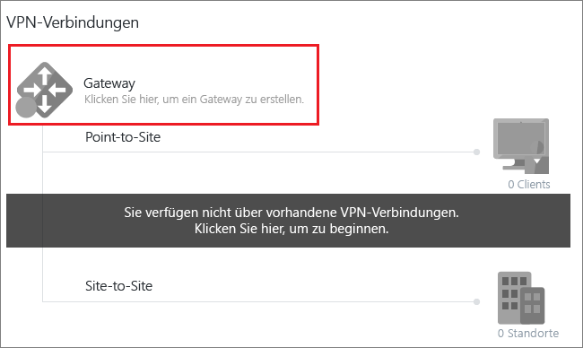
3. Wählen Sie auf dem Blatt **Neue VPN-Verbindung** die Option **Punkt-zu-Standort** aus.

  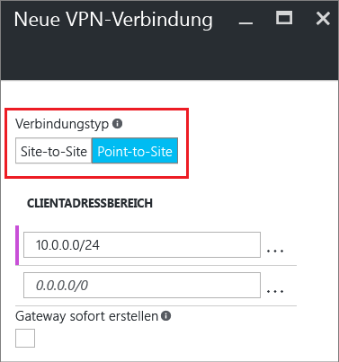
4. Fügen Sie unter **Clientadressraum** den IP-Adressbereich hinzu. Hierbei handelt es sich um den Bereich, aus dem die VPN-Clients bei der Verbindungsherstellung eine IP-Adresse erhalten. Verwenden Sie einen privaten IP-Adressbereich, der sich nicht mit dem lokalen Standort überschneidet, aus dem Sie Verbindungen herstellen möchten. Der Bereich darf sich auch nicht mit dem VNET überschneiden, mit dem Sie Verbindungen herstellen möchten. Sie können den automatisch ausgefüllten Bereich löschen und dann den privaten IP-Adressbereich hinzufügen, den Sie verwenden möchten.

  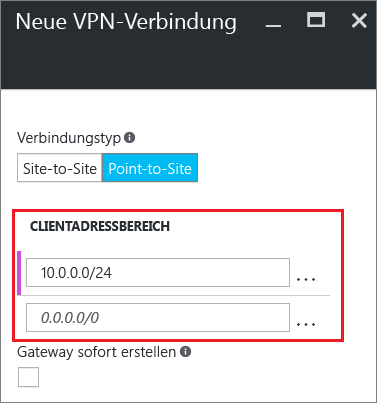
5. Aktivieren Sie das Kontrollkästchen **Gateway sofort erstellen**.

  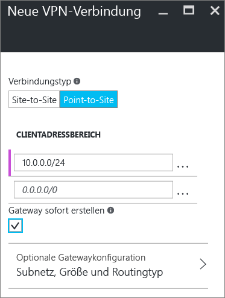
6. Klicken Sie auf **Optionale Gatewaykonfiguration**, um das Blatt **Gatewaykonfiguration** zu öffnen.

  
7. Klicken Sie auf **Subnetz > Erforderliche Einstellungen konfigurieren**, um das **Gatewaysubnetz** hinzuzufügen. Es ist zwar möglich, ein Gatewaysubnetz von /29 zu erstellen, es wird jedoch empfohlen, ein größeres Subnetz mit mehr Adressen zu erstellen und mindestens /28 oder /27 auszuwählen. Dadurch steht eine ausreichend hohe Anzahl von Adressen für mögliche zusätzliche Konfigurationen zur Verfügung, die Sie zukünftig vielleicht benötigen. Vermeiden Sie bei der Verwendung von Gatewaysubnetzen die Zuordnung einer Netzwerksicherheitsgruppe (NSG) zum Gatewaysubnetz. Das Zuordnen einer Netzwerksicherheitsgruppe zu diesem Subnetz kann dazu führen, dass das VPN-Gateway nicht mehr wie erwartet funktioniert.

  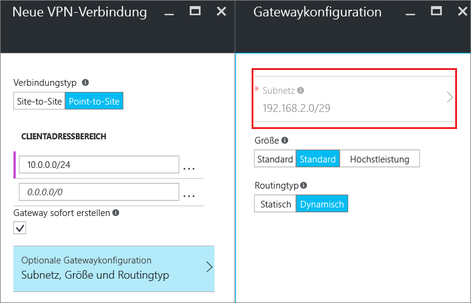
8. Wählen Sie die Gatewaygröße**** aus. Bei der Größe handelt es sich um die Gateway-SKU für Ihr virtuelles Netzwerkgateway. Im Portal ist standardmäßig die SKU **Basic** ausgewählt. Weitere Informationen zu Gateway-SKUs finden Sie unter [Informationen zu VPN Gateway-Einstellungen](vpn-gateway-about-vpn-gateway-settings.md#gwsku).

  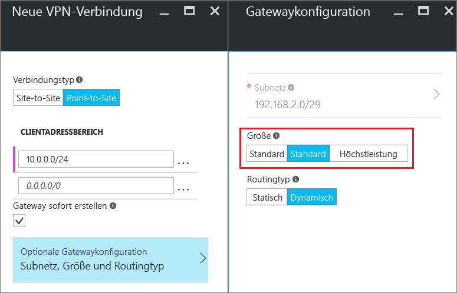
9. Wählen Sie den **Routingtyp** für Ihr Gateway aus. Für P2S-Konfigurationen wird der Routingtyp **Dynamisch** benötigt. Klicken Sie abschließend auf **OK**.

  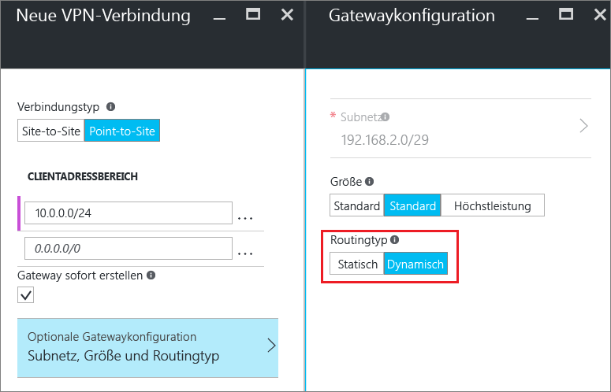
10. Klicken Sie am unteren Rand des Blatts **Neue VPN-Verbindung** auf **OK**, um mit der Erstellung Ihres virtuellen Netzwerkgateways zu beginnen. Je nach ausgewählter Gateway-SKU kann die Erstellung eines VPN-Gateways bis zu 45 Minuten dauern.

## Abschnitt 2: Erstellen von Zertifikaten

Zertifikate werden von Azure zur Authentifizierung von VPN-Clients für Point-to-Site-VPNs verwendet. Sie laden die Informationen des öffentlichen Schlüssels des Stammzertifikats in Azure hoch. Der öffentliche Schlüssel wird dann als „vertrauenswürdig“ betrachtet. Clientzertifikate müssen über das vertrauenswürdige Stammzertifikat erstellt und dann auf jedem Clientcomputer installiert werden, der sich im persönlichen Zertifikatspeicher des aktuellen Benutzers befindet. Mit diesem Zertifikat wird der Client authentifiziert, wenn er eine Verbindung mit dem VNET initiiert. Weitere Informationen zum Generieren und Installieren von Zertifikaten finden Sie unter [Zertifikate für Point-to-Site-Verbindungen](vpn-gateway-certificates-point-to-site.md).

### Teil 1: Beschaffen des öffentlichen Schlüssels (CER-Format) für das Stammzertifikat

[!INCLUDE [vpn-gateway-basic-vnet-rm-portal](../../includes/vpn-gateway-p2s-rootcert-include.md)]

### Teil 2: Generieren eines Clientzertifikats

[!INCLUDE [vpn-gateway-basic-vnet-rm-portal](../../includes/vpn-gateway-p2s-clientcert-include.md)]

## Abschnitt 3: Hochladen der CER-Datei des Stammzertifikats

Nachdem das Gateway erstellt wurde, laden Sie die CER-Datei (mit den Informationen zum öffentlichen Schlüssel) für ein vertrauenswürdiges Stammzertifikat in Azure hoch. Der private Schlüssel für das Stammzertifikat wird nicht in Azure hochgeladen. Nach dem Hochladen der CER-Datei kann Azure die Datei verwenden, um Clients zu authentifizieren, auf denen ein aus dem vertrauenswürdigen Stammzertifikat generiertes Clientzertifikat installiert ist. Sie können später bei Bedarf weitere vertrauenswürdige Stammzertifikate hochladen – bis zu 20 insgesamt.  

1. Klicken Sie auf dem Blatt für Ihr VNet im Abschnitt **VPN-Verbindungen** auf die**** Clientgrafik, um das Blatt **Punkt-zu-Standort-VPN-Verbindung** zu öffnen.

  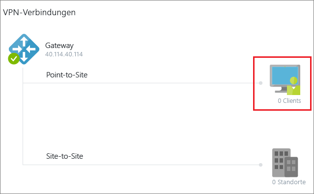
2. Klicken Sie auf dem Blatt **Punkt-zu-Standort-Verbindung** auf **Zertifikate verwalten**, um das Blatt **Zertifikate** zu öffnen. 

  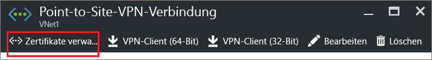  
3. Klicken Sie auf dem Blatt **Zertifikate** auf **Hochladen**, um das Blatt **Zertifikat hochladen** zu öffnen. 

    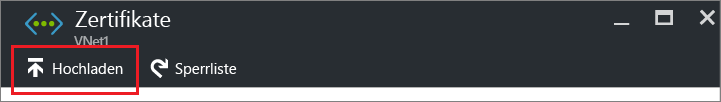 
4. Klicken Sie auf die Ordnergrafik, um zur CER-Datei zu navigieren. Wählen Sie die Datei aus, und klicken Sie anschließend auf **OK**. Aktualisieren Sie die Seite, damit das hochgeladene Zertifikat auf dem Blatt **Zertifikate** angezeigt wird.

  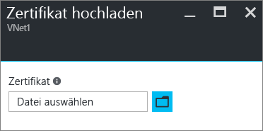 

## Abschnitt 4: Konfigurieren des Clients

Um über ein Point-to-Site-VPN eine Verbindung mit einem VNET herstellen zu können, muss auf jedem Client ein Paket zum Konfigurieren des nativen Windows VPN-Clients installiert werden. Mit dem Konfigurationspaket wird der native Windows-VPN-Client mit den Einstellungen konfiguriert, die zum Herstellen der Verbindung mit dem virtuellen Netzwerk benötigt werden. Wenn Sie einen DNS-Server für Ihr VNET angegeben haben, enthält er die IP-Adresse des DNS-Servers, die vom Client für die Namensauflösung verwendet wird. Wenn Sie den angegebenen DNS-Server später ändern, sollten Sie nach dem Generieren des Clientkonfigurationspakets sicherstellen, dass Sie ein neues Clientkonfigurationspaket für die Installation auf Ihren Clientcomputern generieren.

Sie können auf jedem Clientcomputer das gleiche VPN-Clientkonfigurationspaket verwenden – vorausgesetzt, es handelt sich dabei um die passende Version für die Architektur des jeweiligen Clients. Die Liste mit den unterstützten Clientbetriebssystemen finden Sie unter [Point-to-Site – Häufig gestellte Fragen](#faq) am Ende dieses Artikels.

### Teil 1: Generieren und Installieren des Konfigurationspakets für VPN-Clients

1. Klicken Sie im Azure-Portal auf dem Übersichtsblatt**** für Ihr VNet im Abschnitt **VPN-Verbindungen** auf die Clientgrafik, um das Blatt **Punkt-zu-Standort-VPN-Verbindung** zu öffnen.
2. Wählen Sie im oberen Bereich des Blatts **Punkt-zu-Standort-VPN-Verbindung** das Downloadpaket für das Clientbetriebssystem aus, unter dem es installiert wird:

  * Wählen Sie für 64-Bit-Clients das Paket **VPN-Client (64 Bit)** aus.
  * Wählen Sie für 32-Bit-Clients das Paket **VPN-Client (32 Bit)** aus.

  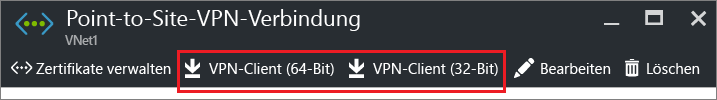 
3. Laden Sie das generierte Paket herunter, und installieren Sie es auf Ihrem Clientcomputer. Sollte ein SmartScreen-Popup erscheinen, klicken Sie auf **Weitere Informationen** und anschließend auf **Trotzdem ausführen**. Sie können das Paket auch speichern und auf anderen Clientcomputern installieren.

### Teil 2: Installieren des Clientzertifikats

Wenn Sie eine P2S-Verbindung mit einem anderen Clientcomputer als dem für die Generierung der Clientzertifikate verwendeten Computer herstellen möchten, müssen Sie ein Clientzertifikat installieren. Beim Installieren eines Clientzertifikats benötigen Sie das Kennwort, das beim Exportieren des Clientzertifikats erstellt wurde. Normalerweise müssen Sie hierfür nur auf das Zertifikat doppelklicken und dann die Installation durchführen. Weitere Informationen finden Sie unter [Installieren eines exportierten Clientzertifikats](vpn-gateway-certificates-point-to-site.md#install).

## Abschnitt 5: Herstellen der Verbindung mit Azure

### Herstellen der Verbindung mit Ihrem VNet

1. Um eine Verbindung mit Ihrem VNet herzustellen, navigieren Sie auf dem Clientcomputer zu „VPN-Verbindungen“ und suchen nach der VPN-Verbindung, die Sie erstellt haben. Sie hat den gleichen Namen wie das virtuelle Netzwerk. Klicken Sie auf **Verbinden**. Möglicherweise wird eine Popupmeldung angezeigt, die sich auf die Verwendung des Zertifikats bezieht. Klicken Sie in diesem Fall auf **Weiter** , um erhöhte Rechte zu verwenden.
2. Klicken Sie auf der Statusseite **Verbindung** auf **Verbinden**, um die Verbindung herzustellen. Wenn der Bildschirm **Zertifikat auswählen** angezeigt wird, vergewissern Sie sich, dass das angezeigte Clientzertifikat dem Zertifikat entspricht, die Sie zum Herstellen der Verbindung verwenden möchten. Wenn dies nicht der Fall ist, verwenden Sie den Dropdownpfeil, um das richtige Zertifikat auszuwählen, und klicken Sie dann auf **OK**.

  
3. Die Verbindung wurde hergestellt.

  

Überprüfen Sie die folgenden Punkte, falls bei der Verbindungsherstellung Probleme auftreten:

- Öffnen Sie **Benutzerzertifikate verwalten**, und navigieren Sie zu **Vertrauenswürdige Stammzertifizierungsstellen\Zertifikate**. Vergewissern Sie sich, dass das Stammzertifikat aufgeführt ist. Das Stammzertifikat muss vorhanden sein, damit die Authentifizierung funktioniert. Wenn Sie eine PFX-Clientzertifikatdatei mit der Standardeinstellung „Wenn möglich, alle Zertifikate im Zertifizierungspfad einbeziehen“ exportieren, werden auch die Informationen zum Stammzertifikat exportiert. Beim Installieren des Clientzertifikats wird dann auch das Stammzertifikat auf dem Clientcomputer installiert. 

- Wenn Sie bei Verwendung eines Zertifikats, das mit einer Lösung einer Unternehmenszertifizierungsstelle ausgestellt wurde, Probleme mit der Authentifizierung haben, ist es ratsam, die Authentifizierungsreihenfolge des Clientzertifikats zu überprüfen. Sie können die Reihenfolge der Authentifizierungsliste überprüfen, indem Sie auf das Clientzertifikat doppelklicken und zu **Details > Erweiterte Schlüsselverwendung** navigieren. Achten Sie darauf, dass in der Liste „Client Authentication“ als erster Eintrag aufgeführt ist. Wenn nicht, müssen Sie ein Clientzertifikat basierend auf der User-Vorlage ausstellen, die als ersten Eintrag in der Liste „Client Authentication“ enthält. 

### Überprüfen der VPN-Verbindung

1. Um sicherzustellen, dass die VPN-Verbindung aktiv ist, öffnen Sie eine Eingabeaufforderung mit Administratorrechten, und führen Sie *Ipconfig/all*aus.
2. Zeigen Sie die Ergebnisse an. Beachten Sie, dass die IP-Adresse, die Sie erhalten, eine Adresse aus dem Adressbereich der P2S-Verbindung ist, den Sie beim Erstellen des virtuellen Netzwerks angegeben haben. Das Ergebnis sollte etwa wie folgt aussehen:

Beispiel:

    PPP adapter VNet1:
        Connection-specific DNS Suffix .:
        Description.....................: VNet1
        Physical Address................:
        DHCP Enabled....................: No
        Autoconfiguration Enabled.......: Yes
        IPv4 Address....................: 192.168.130.2(Preferred)
        Subnet Mask.....................: 255.255.255.255
        Default Gateway.................:
        NetBIOS over Tcpip..............: Enabled

 
 Sollten beim Herstellen der P2S-Verbindung mit einem virtuellen Computer Probleme auftreten, können Sie mit „ipconfig“ die IPv4-Adresse überprüfen, die dem Ethernet-Adapter auf dem Computer zugewiesen ist, von dem aus Sie die Verbindung herstellen. Wenn sich die IP-Adresse im Adressbereich des VNETs befindet, mit dem Sie die Verbindung herstellen, oder im Adressbereich von „VPNClientAddressPool“ liegt, wird dies als sich überschneidender Adressraum bezeichnet. Falls sich Ihr Adressraum auf diese Weise überschneidet, kommt der Netzwerkdatenverkehr nicht bei Azure an, sondern verbleibt im lokalen Netzwerk. Falls sich Ihre Netzwerkadressräume nicht überschneiden und Sie trotzdem keine Verbindung mit Ihrem virtuellen Computer herstellen können, lesen Sie den Artikel [Behandeln von Problemen bei Remotedesktopverbindungen mit einem virtuellen Azure-Computer](../virtual-machines/windows/troubleshoot-rdp-connection.md).

## Herstellen einer Verbindung mit einem virtuellem Computer

[!INCLUDE [Connect to a VM](../../includes/vpn-gateway-connect-vm-p2s-classic-include.md)]

## Hinzufügen oder Entfernen vertrauenswürdiger Stammzertifikate

Sie können vertrauenswürdige Stammzertifikate hinzufügen und aus Azure entfernen. Wenn Sie ein Stammzertifikat entfernen, können Clients, für die über diesen Stamm ein Zertifikat generiert wurde, nicht authentifiziert werden und somit auch keine Verbindung herstellen. Wenn Sie für einen Client die Authentifizierung und Verbindungsherstellung durchführen möchten, müssen Sie ein neues Clientzertifikat installieren, das aus einem für Azure vertrauenswürdigen (hochgeladenen) Stammzertifikat generiert wurde.

### So fügen Sie ein vertrauenswürdiges Stammzertifikat hinzu

Sie können Azure bis zu 20 vertrauenswürdige CER-Stammzertifikatdateien hinzufügen. Eine entsprechende Anleitung finden Sie in [Abschnitt 3: Hochladen der CER-Datei des Stammzertifikats](#upload).

### Entfernen eines vertrauenswürdigen Stammzertifikats

1. Klicken Sie auf dem Blatt für Ihr VNet im Abschnitt **VPN-Verbindungen** auf die**** Clientgrafik, um das Blatt **Punkt-zu-Standort-VPN-Verbindung** zu öffnen.

  
2. Klicken Sie auf dem Blatt **Punkt-zu-Standort-Verbindung** auf **Zertifikate verwalten**, um das Blatt **Zertifikate** zu öffnen. 

    
3. Klicken Sie auf dem Blatt **Zertifikate** neben dem Zertifikat, das Sie entfernen möchten, auf die Auslassungspunkte, und klicken Sie anschließend auf **Löschen**.

   

## Sperren eines Clientzertifikats

Sie können Clientzertifikate sperren. Anhand der Zertifikatsperrliste können Sie basierend auf einzelnen Clientzertifikaten selektiv Punkt-zu-Standort-Verbindungen verweigern. Das ist nicht dasselbe wie das Entfernen eines vertrauenswürdigen Stammzertifikats. Wenn Sie ein vertrauenswürdiges Stammzertifikat (CER-Datei) aus Azure entfernen, wird der Zugriff für alle Clientzertifikate gesperrt, die mit dem gesperrten Stammzertifikat generiert oder signiert wurden. Wenn Sie anstelle des Stammzertifikats ein Clientzertifikat sperren, können die anderen Zertifikate, die auf der Grundlage des Stammzertifikats generiert wurden, weiterhin zur Authentifizierung für die P2S-Verbindung verwendet werden.

Üblicherweise wird das Stammzertifikat zum Verwalten des Zugriffs auf Team- oder Organisationsebene verwendet. Eine genauer abgestufte Steuerung des Zugriffs für einzelne Benutzer erfolgt hingegen mit gesperrten Clientzertifikaten.

### So sperren Sie ein Clientzertifikat

Sie können ein Clientzertifikat sperren, indem Sie den Fingerabdruck der Sperrliste hinzufügen.

1. Rufen Sie den Fingerabdruck des Clientzertifikats ab. Weitere Informationen finden Sie unter [Vorgehensweise: Abrufen des Fingerabdrucks eines Zertifikats](https://msdn.microsoft.com/library/ms734695.aspx).
2. Kopieren Sie ihn in einen Text-Editor, und entfernen Sie alle Leerzeichen, sodass eine fortlaufende Zeichenfolge entsteht.
3. Navigieren Sie zu **„Name des klassischen virtuellen Netzwerks“ > Punkt-zu-Standort-VPN-Verbindung > Zertifikate**, und klicken Sie anschließend auf **Sperrliste**, um das Blatt mit der Sperrliste zu öffnen. 
4. Klicken Sie auf dem Blatt **Sperrliste** auf **+Zertifikat hinzufügen**, um das Blatt **Zertifikat der Sperrliste hinzufügen** zu öffnen.
5. Fügen Sie auf dem Blatt **Zertifikat der Sperrliste hinzufügen** den Zertifikatfingerabdruck als durchgehende Textzeile (ohne Leerzeichen) ein. Klicken Sie unten auf dem Blatt auf **OK**.
6. Nach Abschluss der Aktualisierung kann das Zertifikat nicht mehr für die Verbindungsherstellung verwendet werden. Clients, die versuchen, unter Verwendung dieses Zertifikats eine Verbindung herzustellen, erhalten eine Meldung mit dem Hinweis, dass das Zertifikat nicht mehr gültig ist.

## Point-to-Site – Häufig gestellte Fragen

[!INCLUDE [Point-to-Site FAQ](../../includes/vpn-gateway-point-to-site-faq-include.md)]

## Nächste Schritte
Sobald die Verbindung hergestellt ist, können Sie Ihren virtuellen Netzwerken virtuelle Computer hinzufügen. Weitere Informationen finden Sie unter [Virtuelle Computer](https://docs.microsoft.com/azure/#pivot=services&panel=Compute) . Weitere Informationen zu Netzwerken und virtuellen Computern finden Sie unter [Azure- und Linux-VM-Netzwerke (Übersicht)](../virtual-machines/linux/azure-vm-network-overview.md).

