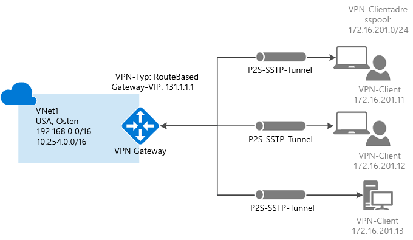
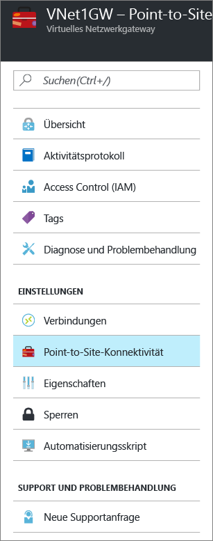
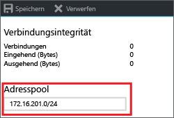
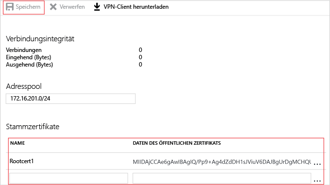

# Konfigurieren einer Point-to-Site-Verbindung mit einem VNet über das Azure-Portal

In diesem Artikel wird beschrieben, wie Sie ein VNET mit einer P2S-Verbindung im Resource Manager-Bereitstellungsmodell mithilfe des Azure-Portals erstellen. Sie können diese Konfiguration auch mit einem anderen Bereitstellungstool oder -modell erstellen. Wählen Sie hierzu in der folgenden Liste eine andere Option:

> [!div class="op_single_selector"]
> * [Azure-Portal](vpn-gateway-howto-point-to-site-resource-manager-portal.md)
> * [PowerShell](vpn-gateway-howto-point-to-site-rm-ps.md)
> * [Azure-Portal (klassisch)](vpn-gateway-howto-point-to-site-classic-azure-portal.md)
>
>

Mit einer P2S-Konfiguration (Point-to-Site) können Sie von einem einzelnen Clientcomputer eine sichere Verbindung mit einem virtuellen Netzwerk herstellen. Point-to-Site-Verbindungen sind nützlich, wenn Sie von einem Remotestandort, z.B. von zu Hause oder bei einer Konferenz, eine Verbindung mit Ihrem VNet herstellen möchten. Diese Methode eignet sich auch, wenn Sie nur wenige Clients besitzen, die mit einem virtuellen Netzwerk verbunden werden müssen. Die P2S-VPN-Verbindung wird über den nativen Windows-VPN-Client vom Clientcomputer aus initiiert. Die Clients, die Verbindungen herstellen, verwenden Zertifikate zur Authentifizierung. 

Point-to-Site-Verbindungen erfordern weder ein VPN-Gerät noch eine öffentliche IP-Adresse. P2S erstellt die VPN-Verbindung über SSTP (Secure Socket Tunneling Protocol). Auf Serverseite werden die SSTP-Versionen 1.0, 1.1 und 1.2 unterstützt. Der Client entscheidet, welche Version verwendet wird. Unter Windows 8.1 und höher wird standardmäßig SSTP 1.2 verwendet. Weitere Informationen zu Point-to-Site-Verbindungen finden Sie unter [Point-to-Site – Häufig gestellte Fragen](#faq) am Ende dieses Artikels.

P2S-Verbindungen erfordern Folgendes:

* Ein RouteBased-VPN-Gateway.
* Den öffentlichen Schlüssel (CER-Datei) für ein Stammzertifikat, der in Azure hochgeladen wurde. Dies wird als vertrauenswürdiges Zertifikat betrachtet und für die Authentifizierung verwendet.
* Ein Clientzertifikat, das über das Stammzertifikat generiert und auf jedem Clientcomputer installiert wurde, der eine Verbindung herstellen wird. Dieses Zertifikat wird für die Clientauthentifizierung verwendet.
* Ein VPN-Clientkonfigurationspaket muss generiert und auf jedem Clientcomputer installiert werden, der eine Verbindung herstellen wird. Das Clientkonfigurationspaket konfiguriert den nativen VPN-Client, der sich bereits im Betriebssystem befindet, mit den notwendigen Informationen für die Herstellung einer Verbindung mit dem VNET.

### Beispielwerte

Sie können die folgenden Werte zum Erstellen einer Testumgebung oder zum besseren Verständnis der Beispiele in diesem Artikel nutzen:

* **Name: VNet1**
* **Adressraum: 192.168.0.0/16** In diesem Beispiel verwenden wir nur einen einzelnen Adressraum. Sie können für Ihr VNet aber auch mehrere Adressräume verwenden.
* **Subnetzname: FrontEnd**
* **Subnetzadressbereich: 192.168.1.0/24**
* **Abonnement:** Falls Sie über mehrere Abonnements verfügen, vergewissern Sie sich, dass Sie das richtige Abonnement verwenden.
* **Ressourcengruppe: TestRG**
* **Standort: USA, Osten**
* **GatewaySubnet: 192.168.200.0/24**
* **Name des virtuellen Netzwerkgateways: VNet1GW**
* **Gatewaytyp: VPN**
* **VPN-Typ: Routenbasiert**
* **Öffentliche IP-Adresse: VNet1GWpip**
* **Verbindungstyp: Point-to-Site**
* **Clientadresspool: 172.16.201.0/24** VPN-Clients, die über diese Point-to-Site-Verbindung eine Verbindung mit dem VNet herstellen, erhalten eine IP-Adresse aus dem Clientadresspool.

## 1: Erstellen eines virtuelles Netzwerks

Stellen Sie zunächst sicher, dass Sie über ein Azure-Abonnement verfügen. Wenn Sie noch kein Azure-Abonnement besitzen, können Sie Ihre [MSDN-Abonnentenvorteile](https://azure.microsoft.com/pricing/member-offers/msdn-benefits-details) aktivieren oder sich für ein [kostenloses Konto](https://azure.microsoft.com/pricing/free-trial) registrieren. Falls Sie diese Konfiguration zu Übungszwecken erstellen, können Sie die [Beispielwerte](#example) verwenden.

[!INCLUDE [vpn-gateway-basic-vnet-rm-portal](../../includes/vpn-gateway-basic-vnet-rm-portal-include.md)]

## 2: Angeben von Adressräumen und Subnetzen

Sie können dem VNet nach dem Erstellen weitere Adressräume und Subnetze hinzufügen.

[!INCLUDE [vpn-gateway-additional-address-space](../../includes/vpn-gateway-additional-address-space-include.md)]

## 3: Hinzufügen eines Gatewaysubnetzes

Bevor Sie das virtuelle Netzwerk mit einem Gateway verbinden, müssen Sie das Gatewaysubnetz für das virtuelle Netzwerk erstellen, mit dem Sie eine Verbindung herstellen möchten. Für die Gatewaydienste werden die im Gatewaysubnetz angegebenen IP-Adressen verwendet. Erstellen Sie nach Möglichkeit ein Gatewaysubnetz mit einem CIDR-Block vom Typ „/28“ oder „/27“, damit genügend IP-Adressen für zukünftige zusätzliche Konfigurationsanforderungen zur Verfügung stehen.

Die Screenshots in diesem Abschnitt werden als Referenzbeispiel bereitgestellt. Verwenden Sie den GatewaySubnet-Adressbereich mit den Werten für Ihre Konfiguration.

### So erstellen Sie ein Gatewaysubnetz

[!INCLUDE [vpn-gateway-add-gwsubnet-rm-portal](../../includes/vpn-gateway-add-gwsubnet-rm-portal-include.md)]

## 4: Angeben eines DNS-Servers (optional)

Nach Erstellung des virtuellen Netzwerks können Sie für die Namensauflösung die IP-Adresse eines DNS-Servers hinzufügen. Der angegebene DNS-Server muss dazu in der Lage sein, die Namen für die Ressourcen aufzulösen, mit denen Sie eine Verbindung herstellen möchten. Das VPN-Clientkonfigurationspaket, das Sie in einem späteren Schritt erstellen, enthält die IP-Adressen der DNS-Server, die Sie in dieser Einstellung angeben. Falls Sie die Liste mit den DNS-Servern später aktualisieren müssen, können Sie neue Pakete für die VPN-Clientkonfiguration generieren, die die neue Liste widerspiegeln.

[!INCLUDE [vpn-gateway-add-dns-rm-portal](../../includes/vpn-gateway-add-dns-rm-portal-include.md)]

## 5: Erstellen eines Gateways für das virtuelle Netzwerk

Für Point-to-Site-Verbindungen werden folgende Einstellungen benötigt:

* Gatewaytyp: VPN
* VPN-Typ: Routenbasiert

### So erstellen Sie ein Gateway für das virtuelle Netzwerk

[!INCLUDE [create a vnet gateway](../../includes/vpn-gateway-add-gw-rm-portal-include.md)]

## 6: Generieren von Zertifikaten

Zertifikate werden von Azure zur Authentifizierung von VPN-Clients für Point-to-Site-VPNs verwendet. Sie laden die Informationen des öffentlichen Schlüssels des Stammzertifikats in Azure hoch. Der öffentliche Schlüssel wird dann als „vertrauenswürdig“ betrachtet. Clientzertifikate müssen über das vertrauenswürdige Stammzertifikat erstellt und dann auf jedem Clientcomputer installiert werden, der sich im persönlichen Zertifikatspeicher des aktuellen Benutzers befindet. Mit diesem Zertifikat wird der Client authentifiziert, wenn er eine Verbindung mit dem VNET initiiert. 

Wenn Sie selbstsignierte Zertifikate verwenden, müssen diese anhand bestimmter Parameter erstellt werden. Sie können ein selbstsigniertes Zertifikat anhand der Anweisungen für [PowerShell und Windows 10](vpn-gateway-certificates-point-to-site.md) oder [MakeCert](vpn-gateway-certificates-point-to-site-makecert.md) erstellen. Führen Sie unbedingt die Schritte in diesen Anweisungen aus, wenn Sie mit selbstsignierten Stammzertifikaten arbeiten und Clientzertifikate aus dem selbstsignierten Stammzertifikat erstellen. Andernfalls sind die von Ihnen erstellten Zertifikate nicht mit P2S-Verbindungen kompatibel, und Ihnen wird ein Verbindungsfehler angezeigt.

### Schritt 1: Beschaffen der CER-Datei für das Stammzertifikat

[!INCLUDE [obtain root certificate](../../includes/vpn-gateway-p2s-rootcert-include.md)]

### Schritt 2: Generieren eines Clientzertifikats

[!INCLUDE [generate client certificate](../../includes/vpn-gateway-p2s-clientcert-include.md)]

## 7: Hinzufügen des Clientadresspools

Der Clientadresspool ist ein Bereich privater IP-Adressen, die Sie angeben. Die Clients, die eine Verbindung über P2S herstellen, erhalten eine IP-Adresse aus diesem Bereich. Verwenden Sie einen privaten IP-Adressbereich, der sich nicht mit dem lokalen Standort überschneidet, aus dem Sie Verbindungen herstellen möchten. Der Bereich darf sich auch nicht mit dem VNET überschneiden, mit dem Sie Verbindungen herstellen möchten.

1. Navigieren Sie nach Erstellung des virtuellen Netzwerkgateways auf dem Blatt des virtuellen Netzwerkgateways zum Abschnitt **Einstellungen**. Klicken Sie im Abschnitt **Einstellungen** auf **Punkt-zu-Standort-Konfiguration**, um das Blatt **Konfiguration** zu öffnen.

  
2. Sie können den automatisch ausgefüllten Bereich löschen und dann den privaten IP-Adressbereich hinzufügen, den Sie verwenden möchten. Klicken Sie auf **Speichern**, um die Einstellung zu überprüfen und zu speichern.

  

## 8: Hochladen der CER-Datei des Stammzertifikats

Nachdem das Gateway erstellt wurde, laden Sie die CER-Datei (mit den Informationen zum öffentlichen Schlüssel) für ein vertrauenswürdiges Stammzertifikat in Azure hoch. Nach dem Hochladen der CER-Datei kann Azure die Datei verwenden, um Clients zu authentifizieren, auf denen ein aus dem vertrauenswürdigen Stammzertifikat generiertes Clientzertifikat installiert ist. Sie können später bei Bedarf weitere vertrauenswürdige Stammzertifikate hochladen – bis zu 20 insgesamt. 

1. Die Zertifikate werden auf dem Blatt **Point-to-Site-Konfiguration** im Abschnitt **Stammzertifikat** hinzugefügt.  
2. Vergewissern Sie sich, dass Sie das Stammzertifikat als X.509-CER-Datei mit Base-64-Codierung exportiert haben. Das Zertifikat muss in diesem Format exportiert werden, damit Sie es mit einem Text-Editor öffnen können.
3. Öffnen Sie das Zertifikat mit einem Text-Editor (beispielsweise mit dem Windows-Editor). Stellen Sie beim Kopieren der Zertifikatsdaten sicher, dass Sie den Text als fortlaufende Zeile ohne Wagenrückläufe oder Zeilenvorschübe kopieren. Es kann erforderlich sein, Ihre Ansicht im Text-Editor so zu ändern, dass die Symbole bzw. alle Zeichen angezeigt werden, damit die Wagenrückläufe bzw. Zeilenvorschübe sichtbar sind. Kopieren Sie nur den folgenden Abschnitt als fortlaufende Zeile:

  
4. Fügen Sie die Zertifikatdaten im Feld **Daten des öffentlichen Zertifikats** ein. Geben Sie dem Zertifikat einen **Namen**, und klicken Sie dann auf **Speichern**. Sie können bis zu 20 vertrauenswürdige Stammzertifikate hinzufügen.

  

## 9: Installieren des VPN-Clientkonfigurationspakets

Um über ein Point-to-Site-VPN eine Verbindung mit einem VNET herstellen zu können, muss auf jedem Client ein Paket zum Konfigurieren des nativen Windows VPN-Clients installiert werden. Mit dem Konfigurationspaket wird der native Windows-VPN-Client mit den Einstellungen konfiguriert, die zum Herstellen der Verbindung mit dem virtuellen Netzwerk benötigt werden. Wenn Sie einen DNS-Server für Ihr VNET angegeben haben, enthält er die IP-Adresse des DNS-Servers, die vom Client für die Namensauflösung verwendet wird. Wenn Sie den angegebenen DNS-Server später ändern, sollten Sie nach dem Generieren des Clientkonfigurationspakets sicherstellen, dass Sie ein neues Clientkonfigurationspaket für die Installation auf Ihren Clientcomputern generieren.

Sie können auf jedem Clientcomputer das gleiche VPN-Clientkonfigurationspaket verwenden – vorausgesetzt, es handelt sich dabei um die passende Version für die Architektur des jeweiligen Clients. Die Liste mit den unterstützten Clientbetriebssystemen finden Sie unter [Point-to-Site – Häufig gestellte Fragen](#faq) am Ende dieses Artikels.

### Schritt 1: Herunterladen des Clientkonfigurationspakets

1. Klicken Sie auf dem Blatt **Punkt-zu-Standort-Konfiguration** auf **Download VPN client** (VPN-Client herunterladen), um das Blatt **Download VPN client** (VPN-Client herunterladen) zu öffnen. Die Paketgenerierung kann etwas dauern.

  
2. Wählen Sie das passende Paket für Ihren Client aus, und klicken Sie auf **Herunterladen**. Speichern Sie die Konfigurationspaketdatei. Sie installieren das VPN-Clientkonfigurationspaket auf jedem Clientcomputer, der eine Verbindung mit dem virtuellen Netzwerk herstellt.

  

### Schritt 2: Installieren des Clientkonfigurationspakets

1. Kopieren Sie die Konfigurationsdatei lokal auf den Computer, für den Sie eine Verbindung mit dem virtuellen Netzwerk herstellen möchten. 
2. Doppelklicken Sie auf die EXE-Datei, um das Paket auf dem Clientcomputer zu installieren. Da Sie das Konfigurationspaket erstellt haben, ist es nicht signiert, und unter Umständen wird eine Warnung angezeigt. Klicken Sie im ggf. angezeigten Windows SmartScreen-Popup auf **Weitere Informationen** (links) und dann auf **Trotzdem ausführen**, um das Paket zu installieren.
3. Installieren Sie das Paket auf dem Clientcomputer. Klicken Sie im ggf. angezeigten Windows SmartScreen-Popup auf **Weitere Informationen** (links) und dann auf **Trotzdem ausführen**, um das Paket zu installieren.
4. Navigieren Sie auf dem Clientcomputer zu **Netzwerkeinstellungen**, und klicken Sie auf **VPN**. Die VPN-Verbindung zeigt den Namen des virtuellen Netzwerks an, mit dem eine Verbindung hergestellt wird.

## 10: Installieren des Clientzertifikats

Wenn Sie eine P2S-Verbindung mit einem anderen Clientcomputer als dem für die Generierung der Clientzertifikate verwendeten Computer herstellen möchten, müssen Sie ein Clientzertifikat installieren. Beim Installieren eines Clientzertifikats benötigen Sie das Kennwort, das beim Exportieren des Clientzertifikats erstellt wurde. Normalerweise müssen Sie hierfür nur auf das Zertifikat doppelklicken und dann die Installation durchführen. Weitere Informationen finden Sie unter [Installieren eines exportierten Clientzertifikats](vpn-gateway-certificates-point-to-site.md#install).

## 11: Herstellen einer Verbindung mit Azure

1. Um eine Verbindung mit Ihrem VNet herzustellen, navigieren Sie auf dem Clientcomputer zu „VPN-Verbindungen“ und suchen nach der VPN-Verbindung, die Sie erstellt haben. Sie hat den gleichen Namen wie das virtuelle Netzwerk. Klicken Sie auf **Verbinden**. Möglicherweise wird eine Popupmeldung angezeigt, die sich auf die Verwendung des Zertifikats bezieht. Klicken Sie auf **Weiter**, um erhöhte Rechte zu verwenden.

2. Klicken Sie auf der Statusseite **Verbindung** auf **Verbinden**, um die Verbindung herzustellen. Wenn der Bildschirm **Zertifikat auswählen** angezeigt wird, vergewissern Sie sich, dass das angezeigte Clientzertifikat dem Zertifikat entspricht, die Sie zum Herstellen der Verbindung verwenden möchten. Wenn dies nicht der Fall ist, verwenden Sie den Dropdownpfeil, um das richtige Zertifikat auszuwählen, und klicken Sie dann auf **OK**.

  
3. Die Verbindung wurde hergestellt.

  

Überprüfen Sie die folgenden Punkte, falls bei der Verbindungsherstellung Probleme auftreten:

- Öffnen Sie **Benutzerzertifikate verwalten**, und navigieren Sie zu **Vertrauenswürdige Stammzertifizierungsstellen\Zertifikate**. Vergewissern Sie sich, dass das Stammzertifikat aufgeführt ist. Das Stammzertifikat muss vorhanden sein, damit die Authentifizierung funktioniert. Wenn Sie eine PFX-Clientzertifikatdatei mit der Standardeinstellung „Wenn möglich, alle Zertifikate im Zertifizierungspfad einbeziehen“ exportieren, werden auch die Informationen zum Stammzertifikat exportiert. Beim Installieren des Clientzertifikats wird dann auch das Stammzertifikat auf dem Clientcomputer installiert. 

- Wenn Sie bei Verwendung eines Zertifikats, das mit einer Lösung einer Unternehmenszertifizierungsstelle ausgestellt wurde, Probleme mit der Authentifizierung haben, ist es ratsam, die Authentifizierungsreihenfolge des Clientzertifikats zu überprüfen. Sie können die Reihenfolge der Authentifizierungsliste überprüfen, indem Sie auf das Clientzertifikat doppelklicken und zu **Details > Erweiterte Schlüsselverwendung** navigieren. Achten Sie darauf, dass in der Liste „Client Authentication“ als erster Eintrag aufgeführt ist. Wenn nicht, müssen Sie ein Clientzertifikat basierend auf der User-Vorlage ausstellen, die als ersten Eintrag in der Liste „Client Authentication“ enthält.

## 12: Überprüfen der Verbindung

1. Um sicherzustellen, dass die VPN-Verbindung aktiv ist, öffnen Sie eine Eingabeaufforderung mit Administratorrechten, und führen Sie *Ipconfig/all*aus.
2. Zeigen Sie die Ergebnisse an. Beachten Sie, dass die erhaltene IP-Adresse eine der Adressen aus dem Clientadresspool des Punkt-zu-Standort-VPN ist, den Sie in Ihrer Konfiguration angegeben haben. Die Ergebnisse sehen in etwa wie in diesem Beispiel aus:
   
        PPP adapter VNet1:
            Connection-specific DNS Suffix .:
            Description.....................: VNet1
            Physical Address................:
            DHCP Enabled....................: No
            Autoconfiguration Enabled.......: Yes
            IPv4 Address....................: 172.16.201.3(Preferred)
            Subnet Mask.....................: 255.255.255.255
            Default Gateway.................:
            NetBIOS over Tcpip..............: Enabled

Wenn Sie Probleme beim Herstellen der Verbindung mit einem virtuellen Computer per P2S-Verfahren haben, können Sie mit „ipconfig“ die IPv4-Adresse überprüfen, die dem Ethernet-Adapter auf dem Computer zugewiesen ist, von dem aus Sie die Verbindung herstellen. Wenn sich die IP-Adresse im Adressbereich des VNETs befindet, mit dem Sie die Verbindung herstellen, oder im Adressbereich von „VPNClientAddressPool“ liegt, wird dies als sich überschneidender Adressraum bezeichnet. Falls sich Ihr Adressraum auf diese Weise überschneidet, kommt der Netzwerkdatenverkehr nicht bei Azure an, sondern verbleibt im lokalen Netzwerk. Falls sich Ihre Netzwerkadressräume nicht überschneiden und Sie trotzdem keine Verbindung mit Ihrem virtuellen Computer herstellen können, lesen Sie den Artikel [Behandeln von Problemen bei Remotedesktopverbindungen mit einem virtuellen Azure-Computer](../virtual-machines/windows/troubleshoot-rdp-connection.md).

## Herstellen einer Verbindung mit einem virtuellem Computer

[!INCLUDE [Connect to a VM](../../includes/vpn-gateway-connect-vm-p2s-include.md)]

## Hinzufügen oder Entfernen vertrauenswürdiger Stammzertifikate

Sie können vertrauenswürdige Stammzertifikate hinzufügen und aus Azure entfernen. Wenn Sie ein Stammzertifikat entfernen, können Clients, für die über diesen Stamm ein Zertifikat generiert wurde, nicht authentifiziert werden und somit auch keine Verbindung herstellen. Wenn Sie für einen Client die Authentifizierung und Verbindungsherstellung durchführen möchten, müssen Sie ein neues Clientzertifikat installieren, das aus einem für Azure vertrauenswürdigen (hochgeladenen) Stammzertifikat generiert wurde.

### So fügen Sie ein vertrauenswürdiges Stammzertifikat hinzu

Sie können Azure bis zu 20 vertrauenswürdige CER-Stammzertifikatdateien hinzufügen. Eine entsprechende Anleitung finden Sie in diesem Artikel im Abschnitt zum [Hochladen eines vertrauenswürdigen Stammzertifikats](#uploadfile).

### Entfernen eines vertrauenswürdigen Stammzertifikats

1. Navigieren Sie zum Entfernen eines vertrauenswürdigen Zertifikats zum Blatt **Punkt-zu-Standort-Konfiguration** für Ihr virtuelles Netzwerkgateway.
2. Suchen Sie auf dem Blatt im Abschnitt **Stammzertifikat** nach dem Zertifikat, das Sie entfernen möchten.
3. Klicken Sie neben dem Zertifikat auf die Auslassungspunkte und anschließend auf „Entfernen“.

## Sperren eines Clientzertifikats

Sie können Clientzertifikate sperren. Anhand der Zertifikatsperrliste können Sie basierend auf einzelnen Clientzertifikaten selektiv Punkt-zu-Standort-Verbindungen verweigern. Das ist nicht dasselbe wie das Entfernen eines vertrauenswürdigen Stammzertifikats. Wenn Sie ein vertrauenswürdiges Stammzertifikat (CER-Datei) aus Azure entfernen, wird der Zugriff für alle Clientzertifikate gesperrt, die mit dem gesperrten Stammzertifikat generiert oder signiert wurden. Wenn Sie anstelle des Stammzertifikats ein Clientzertifikat sperren, können die anderen Zertifikate, die auf der Grundlage des Stammzertifikats generiert wurden, weiterhin für die Authentifizierung verwendet werden.

Üblicherweise wird das Stammzertifikat zum Verwalten des Zugriffs auf Team- oder Organisationsebene verwendet. Eine genauer abgestufte Steuerung des Zugriffs für einzelne Benutzer erfolgt hingegen mit gesperrten Clientzertifikaten.

### So sperren Sie ein Clientzertifikat

Sie können ein Clientzertifikat sperren, indem Sie den Fingerabdruck der Sperrliste hinzufügen.

1. Rufen Sie den Fingerabdruck des Clientzertifikats ab. Weitere Informationen finden Sie unter [Vorgehensweise: Abrufen des Fingerabdrucks eines Zertifikats](https://msdn.microsoft.com/library/ms734695.aspx).
2. Kopieren Sie ihn in einen Text-Editor, und entfernen Sie alle Leerzeichen, sodass eine fortlaufende Zeichenfolge entsteht.
3. Navigieren Sie zum Blatt **Punkt-zu-Standort-Konfiguration** des virtuellen Netzwerkgateways. Dies ist das Blatt, das Sie zum [Hochladen eines vertrauenswürdigen Stammzertifikats](#uploadfile) verwendet haben.
4. Geben Sie im Abschnitt **Gesperrte Zertifikate** einen Anzeigenamen für das Zertifikat ein. (Dabei muss es sich nicht um den allgemeinen Namen des Zertifikats handeln.)
5. Kopieren Sie die Fingerabdruck-Zeichenfolge, und fügen Sie sie in das Feld **Fingerabdruck** ein.
6. Der Fingerabdruck wird überprüft und automatisch der Sperrliste hinzugefügt. Auf dem Bildschirm wird eine Meldung mit dem Hinweis angezeigt, dass die Liste aktualisiert wird. 
7. Nach Abschluss der Aktualisierung kann das Zertifikat nicht mehr für die Verbindungsherstellung verwendet werden. Clients, die versuchen, unter Verwendung dieses Zertifikats eine Verbindung herzustellen, erhalten eine Meldung mit dem Hinweis, dass das Zertifikat nicht mehr gültig ist.

## Point-to-Site – Häufig gestellte Fragen

[!INCLUDE [Point-to-Site FAQ](../../includes/vpn-gateway-point-to-site-faq-include.md)]

## Nächste Schritte
Sobald die Verbindung hergestellt ist, können Sie Ihren virtuellen Netzwerken virtuelle Computer hinzufügen. Weitere Informationen finden Sie unter [Virtuelle Computer](https://docs.microsoft.com/azure/#pivot=services&panel=Compute) . Weitere Informationen zu Netzwerken und virtuellen Computern finden Sie unter [Azure- und Linux-VM-Netzwerke (Übersicht)](../virtual-machines/linux/azure-vm-network-overview.md).

