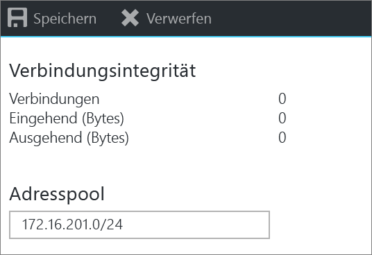
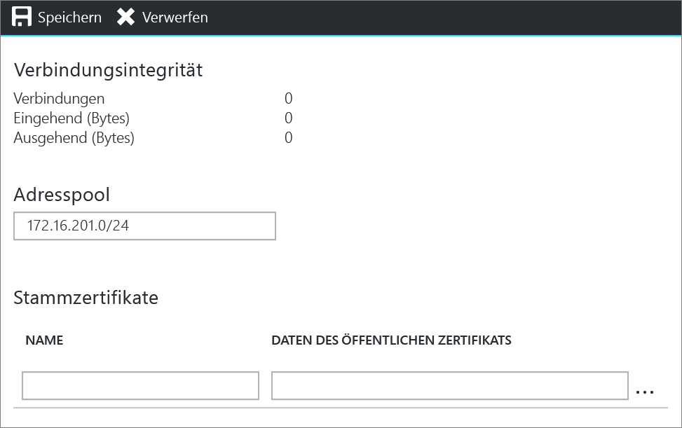
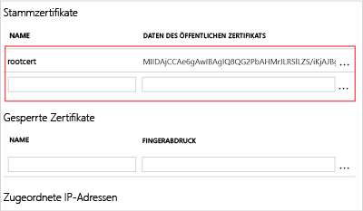
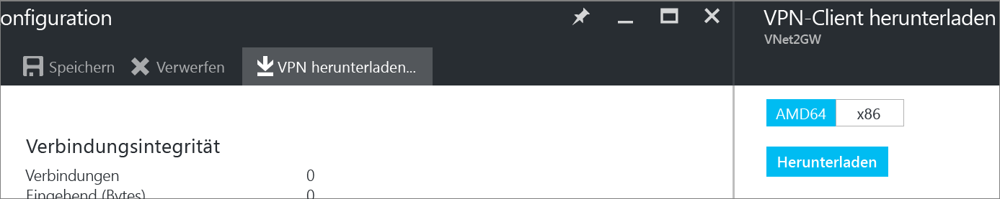

# Konfigurieren einer Point-to-Site-Verbindung mit einem VNet über das Azure-Portal
> [!div class="op_single_selector"]
> * [Resource Manager – Azure-Portal](vpn-gateway-howto-point-to-site-resource-manager-portal.md)
> * [Resource Manager – PowerShell](vpn-gateway-howto-point-to-site-rm-ps.md)
> * [Klassisch – Azure-Portal](vpn-gateway-howto-point-to-site-classic-azure-portal.md)
> 
> 

Mit einer P2S-Konfiguration (Point-to-Site) können Sie von einem einzelnen Clientcomputer eine sichere Verbindung mit einem virtuellen Netzwerk herstellen. Eine P2S-Verbindung ist nützlich, wenn Sie von einem Remotestandort, z.B. von zu Hause oder in einer Konferenz, eine Verbindung mit Ihrem VNet herstellen möchten. Diese Methode eignet sich auch, wenn Sie nur wenige Clients besitzen, die mit einem virtuellen Netzwerk verbunden werden müssen. 

Damit Punkt-zu-Standort-Verbindungen funktionieren, ist kein VPN-Gerät und keine öffentliche IP-Adresse erforderlich. Eine VPN-Verbindung wird hergestellt, indem Sie die Verbindung vom Clientcomputer aus starten. Weitere Informationen zu P2S-Verbindungen finden Sie unter [Häufig gestellte Fragen zum VPN Gateway](vpn-gateway-vpn-faq.md#point-to-site-connections) und [Planung und Entwurf](vpn-gateway-plan-design.md).

In diesem Artikel erfahren Sie Schritt für Schritt, wie Sie über das Azure-Portal im Rahmen des Resource Manager-Bereitstellungsmodells ein VNet mit einer P2S-Verbindung (Point-to-Site) erstellen.

### Bereitstellungsmodelle und -methoden für P2S-Verbindungen
[!INCLUDE [deployment models](../../includes/vpn-gateway-deployment-models-include.md)]

Die folgende Tabelle zeigt die beiden Bereitstellungsmodelle und die verfügbaren Bereitstellungsmethoden für P2S-Konfigurationen. Falls ein Artikel mit Konfigurationsschritten verfügbar ist, steht in der Tabelle ein direkter Link zur Verfügung.

[!INCLUDE [vpn-gateway-clasic-rm](../../includes/vpn-gateway-table-point-to-site-include.md)]

## Grundlegender Workflow

### Beispielwerte
* **Name: VNet1**
* **Adressraum: 192.168.0.0/16** In diesem Beispiel verwenden wir nur einen einzelnen Adressraum. Sie können für Ihr VNet aber auch mehrere Adressräume verwenden.
* **Subnetzname: FrontEnd**
* **Subnetzadressbereich: 192.168.1.0/24**
* **Abonnement:** Falls Sie über mehrere Abonnements verfügen, vergewissern Sie sich, dass Sie das richtige Abonnement verwenden.
* **Ressourcengruppe: TestRG**
* **Standort: USA, Osten**
* **GatewaySubnet: 192.168.200.0/24**
* **Name des virtuellen Netzwerkgateways: VNet1GW**
* **Gatewaytyp: VPN**
* **VPN-Typ: Routenbasiert**
* **Öffentliche IP-Adresse: VNet1GWpip**
* **Verbindungstyp: Point-to-Site**
* **Clientadresspool: 172.16.201.0/24** VPN-Clients, die über diese Point-to-Site-Verbindung eine Verbindung mit dem VNet herstellen, erhalten eine IP-Adresse aus dem Clientadresspool.

## Vorbereitungen
* Stellen Sie sicher, dass Sie über ein Azure-Abonnement verfügen. Wenn Sie noch kein Azure-Abonnement besitzen, können Sie Ihre [MSDN-Abonnentenvorteile](https://azure.microsoft.com/pricing/member-offers/msdn-benefits-details) aktivieren oder sich für ein [kostenloses Konto](https://azure.microsoft.com/pricing/free-trial) registrieren.

## Teil 1: Erstellen eines virtuellen Netzwerks
Falls Sie diese Konfiguration zu Übungszwecken erstellen, können Sie die [Beispielwerte](#example) verwenden.

[!INCLUDE [vpn-gateway-basic-vnet-rm-portal](../../includes/vpn-gateway-basic-vnet-rm-portal-include.md)]

### 2. Hinzufügen weiterer Adressräume und Subnetze
Sie können dem VNet nach dem Erstellen weitere Adressräume und Subnetze hinzufügen.

[!INCLUDE [vpn-gateway-additional-address-space](../../includes/vpn-gateway-additional-address-space-include.md)]

### 3. Erstellen eines Gatewaysubnetzes
Bevor Sie das virtuelle Netzwerk mit einem Gateway verbinden, müssen Sie das Gatewaysubnetz für das virtuelle Netzwerk erstellen, mit dem Sie eine Verbindung herstellen möchten. Erstellen Sie nach Möglichkeit ein Gatewaysubnetz mit einem CIDR-Block vom Typ „/28“ oder „/27“, damit genügend IP-Adressen für zukünftige zusätzliche Konfigurationsanforderungen zur Verfügung stehen.

Die Screenshots in diesem Abschnitt werden als Referenzbeispiel bereitgestellt. Verwenden Sie den GatewaySubnet-Adressbereich mit den Werten für Ihre Konfiguration.

**So erstellen Sie ein Gatewaysubnetz**

[!INCLUDE [vpn-gateway-add-gwsubnet-rm-portal](../../includes/vpn-gateway-add-gwsubnet-rm-portal-include.md)]

### 4. Angeben eines DNS-Servers (optional)
[!INCLUDE [vpn-gateway-add-dns-rm-portal](../../includes/vpn-gateway-add-dns-rm-portal-include.md)]

## Teil 2: Erstellen eines virtuellen Netzwerkgateways
Für Point-to-Site-Verbindungen werden folgende Einstellungen benötigt:

* Gatewaytyp: VPN
* VPN-Typ: Routenbasiert

### So erstellen Sie ein Gateway für das virtuelle Netzwerk
[!INCLUDE [vpn-gateway-add-gw-rm-portal](../../includes/vpn-gateway-add-gw-rm-portal-include.md)]

## Teil 3: Generieren von Zertifikaten
Zertifikate werden von Azure zur Authentifizierung von VPN-Clients für Point-to-Site-VPNs verwendet. Die Daten des öffentlichen Zertifikats (nicht der private Schlüssel) werden als x.509-CER-Datei mit Base-64-Codierung exportiert – entweder aus einem mit einer Unternehmenszertifikatlösung generierten Stammzertifikat oder aus einem selbstsignierten Stammzertifikat. Anschließend werden die Daten des öffentlichen Zertifikats aus dem Stammzertifikat in Azure importiert. Darüber hinaus müssen Sie auf der Grundlage des Stammzertifikats für Clients ein Clientzertifikat generieren. Auf jedem Client, der eine P2S-Verbindung mit dem virtuellen Netzwerk herstellen möchte, muss ein Clientzertifikat installiert sein, das auf der Grundlage des Stammzertifikats generiert wurde.

### 1. Beschaffen der CER-Datei für ein Stammzertifikat
Bei einer Unternehmenslösung können Sie Ihre vorhandene Zertifikatkette verwenden. Wenn Sie keine Lösung einer Unternehmenszertifizierungsstelle verwenden, können Sie ein selbstsigniertes Stammzertifikat erstellen. Makecert ist eine Methode zum Erstellen eines selbstsignierten Zertifikats.

* Wenn Sie ein Unternehmenszertifikatsystem verwenden, müssen Sie die CER-Datei für das Stammzertifikat beschaffen, das Sie verwenden möchten. 
* Wenn Sie keine Unternehmenszertifikatlösung verwenden, müssen Sie ein selbstsigniertes Stammzertifikat generieren. Schritte für Windows 10 finden Sie unter [Arbeiten mit selbstsignierten Stammzertifikaten für P2S-Konfigurationen](vpn-gateway-certificates-point-to-site.md).

1. Um eine CER-Datei auf der Grundlage eines Zertifikats zu generieren, öffnen Sie **certmgr.msc**, und suchen das Stammzertifikat. Klicken Sie mit der rechten Maustaste auf das selbstsignierte Stammzertifikat, klicken Sie auf **Alle Aufgaben** und dann auf **Exportieren**. Dadurch wird der **Zertifikatexport-Assistent**geöffnet.
2. Klicken Sie im Assistenten auf **Weiter**, wählen Sie **Nein, privaten Schlüssel nicht exportieren** aus, und klicken Sie dann auf **Weiter**.
3. Wählen Sie auf der Seite **Dateiformat für den Export** die Option **Base-64-codiert X.509 (.CER)** aus. Klicken Sie auf **Weiter**. 
4. Wählen Sie unter **Zu exportierende Datei** die Option **Durchsuchen** aus, um zu dem Speicherort zu wechseln, an den das Zertifikat exportiert werden soll. Geben Sie unter **Dateiname**einen Namen für die Zertifikatdatei ein. Klicken Sie auf **Weiter**.
5. Klicken Sie auf **Fertig stellen** , um das Zertifikat zu exportieren.

### 2. Generieren eines Clientzertifikats
Sie können entweder ein eindeutiges Zertifikat für jeden Client generieren, mit dem eine Verbindung hergestellt wird, oder Sie können dasselbe Zertifikat für mehrere Clients verwenden. Der Vorteil beim Generieren von eindeutigen Clientzertifikaten besteht darin, dass Sie bei Bedarf ein einzelnes Zertifikat widerrufen können. Falls überall das gleiche Clientzertifikat verwendet wird und Sie das Zertifikat für einen Client sperren müssen, müssen Sie sonst neue Zertifikate für alle Clients generieren und installieren, die das Zertifikat für die Authentifizierung verwenden.

* Generieren Sie bei Verwendung einer Unternehmenszertifikatlösung ein Clientzertifikat mit dem gängigen Name-Wert-Format 'name@yourdomain.com', (anstatt des Formats „Domänenname\Benutzername“). 
* Wenn Sie ein selbstsigniertes Zertifikat verwenden, helfen Ihnen die Informationen zum Generieren eines Clientzertifikats unter [Arbeiten mit selbstsignierten Stammzertifikaten für P2S-Konfigurationen](vpn-gateway-certificates-point-to-site.md) weiter.

### 3. Exportieren des Clientzertifikats
Ein Clientzertifikat wird für die Authentifizierung benötigt. Exportieren Sie das Clientzertifikat, nachdem Sie es generiert haben. Das von Ihnen exportierte Clientzertifikat wird später auf jedem Clientcomputer installiert.

1. Sie können *certmgr.msc*zum Exportieren eines Clientzertifikats verwenden. Klicken Sie mit der rechten Maustaste auf das Clientzertifikat, das Sie exportieren möchten, klicken Sie auf **Alle Aufgaben** und anschließend auf **Exportieren**.
2. Exportieren Sie das Clientzertifikat mit dem privaten Schlüssel. Dies ist eine *PFX* -Datei. Vergessen Sie nicht, sich das Kennwort (Schlüssel) zu notieren oder zu merken, das Sie für dieses Zertifikat festgelegt haben.

## Teil 4: Hinzufügen des Clientadresspools
1. Navigieren Sie nach Erstellung des virtuellen Netzwerkgateways auf dem Blatt des virtuellen Netzwerkgateways zum Abschnitt **Einstellungen**. Klicken Sie im Abschnitt **Einstellungen** auf **Punkt-zu-Standort-Konfiguration**, um das Blatt **Konfiguration** zu öffnen.
   
    
2. **Adresspool** ist der IP-Adresspool, aus dem Clients, die eine Verbindung herstellen, eine IP-Adresse erhalten. Fügen Sie den Adresspool hinzu, und klicken Sie auf **Speichern**.
   
    

## Teil 5: Hochladen der CER-Datei des Stammzertifikats
Nach Erstellung des Gateways können Sie die CER-Datei für ein vertrauenswürdiges Stammzertifikat in Azure hochladen. Sie können Dateien für bis zu 20 Stammzertifikate hochladen. Der private Schlüssel für das Stammzertifikat wird nicht in Azure hochgeladen. Die hochgeladene CER-Datei wird von Azure zur Authentifizierung von Clients verwendet, die eine Verbindung mit dem virtuellen Netzwerk herstellen.

1. Navigieren Sie zum Blatt **Punkt-zu-Standort-Konfiguration**. Die CER-Dateien werden im Abschnitt **Stammzertifikat** dieses Blatts hinzugefügt.
   
    
2. Vergewissern Sie sich, dass Sie das Stammzertifikat als X.509-CER-Datei mit Base-64-Codierung exportiert haben. Das Zertifikat muss in diesem Format exportiert werden, um es mit einem Text-Editor öffnen zu können.
3. Öffnen Sie das Zertifikat mit einem Text-Editor (beispielsweise mit dem Windows-Editor). Kopieren Sie nur den folgenden Abschnitt:
   
    
4. Fügen Sie die Zertifikatdaten im Portal in den Abschnitt **Daten des öffentlichen Zertifikats** ein. Geben Sie unter **Name** den Namen des Zertifikats an, und klicken Sie dann auf **Speichern**. Sie können bis zu 20 vertrauenswürdige Stammzertifikate hinzufügen.
   
    

## Teil 6: Herunterladen und Installieren des Konfigurationspakets für VPN-Clients
Clients, die mithilfe von P2S eine Verbindung mit Azure herstellen, benötigen ein Clientzertifikat sowie ein installiertes Konfigurationspaket für VPN-Clients. Konfigurationspakete für VPN-Clients stehen für Windows-Clients zur Verfügung. 

Das VPN-Clientpaket enthält Informationen zum Konfigurieren der in Windows integrierten VPN-Clientsoftware. Die Konfiguration ist VPN-spezifisch. Das Paket installiert keine zusätzlichen Software. Weitere Informationen finden Sie unter [Häufig gestellte Fragen zum VPN-Gateway](vpn-gateway-vpn-faq.md#point-to-site-connections) .

1. Klicken Sie auf dem Blatt **Punkt-zu-Standort-Konfiguration** auf **Download VPN client** (VPN-Client herunterladen), um das Blatt **Download VPN client** (VPN-Client herunterladen) zu öffnen.
   
    
2. Wählen Sie das passende Paket für Ihren Client aus, und klicken Sie auf **Herunterladen**. Wählen Sie für 64-Bit-Clients die Option **AMD64** aus. Wählen Sie für 32-Bit-Clients die Option **x86** aus.
3. Installieren Sie das Paket auf dem Clientcomputer. Klicken Sie bei Anzeige eines SmartScreen-Popups auf **Weitere Informationen** und dann auf **Trotzdem ausführen**, um das Paket zu installieren.
4. Navigieren Sie auf dem Clientcomputer zu **Netzwerkeinstellungen**, und klicken Sie auf **VPN**. Die Verbindung wird angezeigt. Sie zeigt den Namen des virtuellen Netzwerks an, mit dem eine Verbindung hergestellt wird. Dies sieht in etwa wie in diesem Beispiel aus: 
   
    

## Teil 7: Installieren des Clientzertifikats
Jeder Clientcomputer muss über ein Clientzertifikat verfügen, um sich zu authentifizieren. Beim Installieren des Clientzertifikats benötigen Sie das Kennwort, das beim Exportieren des Clientzertifikats erstellt wurde.

1. Kopieren Sie die PFX-Datei auf den Clientcomputer.
2. Doppelklicken Sie auf die PFX-Datei, um sie zu installieren. Ändern Sie den Speicherort der Installation nicht.

## Teil 8: Herstellen der Verbindung mit Azure
1. Um eine Verbindung mit Ihrem VNet herzustellen, navigieren Sie auf dem Clientcomputer zu „VPN-Verbindungen“ und suchen nach der VPN-Verbindung, die Sie erstellt haben. Sie hat den gleichen Namen wie das virtuelle Netzwerk. Klicken Sie auf **Verbinden**. Möglicherweise wird eine Popupmeldung angezeigt, die sich auf die Verwendung des Zertifikats bezieht. Klicken Sie in diesem Fall auf **Weiter** , um erhöhte Rechte zu verwenden. 
2. Klicken Sie auf der Statusseite **Verbindung** auf **Verbinden**, um die Verbindung herzustellen. Wenn der Bildschirm **Zertifikat auswählen** angezeigt wird, vergewissern Sie sich, dass das angezeigte Clientzertifikat dem Zertifikat entspricht, die Sie zum Herstellen der Verbindung verwenden möchten. Wenn dies nicht der Fall ist, verwenden Sie den Dropdownpfeil, um das richtige Zertifikat auszuwählen, und klicken Sie dann auf **OK**.
   
    
3. Die Verbindung sollte jetzt eingerichtet werden.
   
    

## Teil 9: Überprüfen der Verbindung
1. Um sicherzustellen, dass die VPN-Verbindung aktiv ist, öffnen Sie eine Eingabeaufforderung mit Administratorrechten, und führen Sie *Ipconfig/all*aus.
2. Zeigen Sie die Ergebnisse an. Beachten Sie, dass die erhaltene IP-Adresse eine der Adressen aus dem Clientadresspool des Punkt-zu-Standort-VPN ist, den Sie in Ihrer Konfiguration angegeben haben. Das Ergebnis sollte etwa wie folgt aussehen:
   
        PPP adapter VNet1:
            Connection-specific DNS Suffix .:
            Description.....................: VNet1
            Physical Address................:
            DHCP Enabled....................: No
            Autoconfiguration Enabled.......: Yes
            IPv4 Address....................: 172.16.201.3(Preferred)
            Subnet Mask.....................: 255.255.255.255
            Default Gateway.................:
            NetBIOS over Tcpip..............: Enabled

## So können Sie vertrauenswürdige Stammzertifikate hinzufügen oder entfernen
Sie können ein vertrauenswürdiges Stammzertifikat aus Azure entfernen. Wenn Sie ein vertrauenswürdiges Zertifikat entfernen, kann für die Clientzertifikate, die mit dem Stammzertifikat generiert wurden, per Punkt-zu-Standort-Verfahren keine Verbindung mehr mit Azure hergestellt werden. Wenn Sie Clients verbinden möchten, muss dafür jeweils ein neues Clientzertifikat installiert werden, das mit einem für Azure vertrauenswürdigen Zertifikat generiert wird.

Die Liste mit den gesperrten Clientzertifikaten kann auf dem Blatt **Punkt-zu-Standort-Konfiguration** verwaltet werden. Dieses Blatt haben Sie zum [Hochladen eines vertrauenswürdigen Stammzertifikats](#uploadfile) verwendet.

## So verwalten Sie die Liste mit den gesperrten Clientzertifikaten
Sie können Clientzertifikate sperren. Anhand der Zertifikatsperrliste können Sie basierend auf einzelnen Clientzertifikaten selektiv Punkt-zu-Standort-Verbindungen verweigern. Wenn Sie ein CER-Stammzertifikat aus Azure entfernen, wird der Zugriff für alle Clientzertifikate widerrufen, die mit dem widerrufenen Stammzertifikat generiert oder signiert wurden. Falls Sie nicht das Stammzertifikat widerrufen möchten, sondern ein bestimmtes Clientzertifikat, ist dies auch möglich. Die anderen Zertifikate, die mit dem Stammzertifikat generiert wurden, sind dann weiterhin gültig. 

Üblicherweise wird das Stammzertifikat zum Verwalten des Zugriffs auf Team- oder Organisationsebene verwendet. Eine genauer abgestufte Steuerung des Zugriffs für einzelne Benutzer erfolgt hingegen mit gesperrten Clientzertifikaten.

Die Liste mit den gesperrten Clientzertifikaten kann auf dem Blatt **Punkt-zu-Standort-Konfiguration** verwaltet werden. Dieses Blatt haben Sie zum [Hochladen eines vertrauenswürdigen Stammzertifikats](#uploadfile) verwendet.

## Nächste Schritte
Sobald die Verbindung hergestellt ist, können Sie Ihren virtuellen Netzwerken virtuelle Computer hinzufügen. Weitere Informationen finden Sie unter [Virtuelle Computer](https://docs.microsoft.com/azure/#pivot=services&panel=Compute) .

<!--HONumber=Nov16_HO3-->

