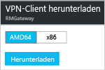

# Konfigurieren einer Point-to-Site-Verbindung mit einem VNet über das Azure-Portal
> [!div class="op_single_selector"]
> * [Resource Manager – Azure-Portal](vpn-gateway-howto-point-to-site-resource-manager-portal.md)
> * [Resource Manager – PowerShell](vpn-gateway-howto-point-to-site-rm-ps.md)
> * [Klassisch – Azure-Portal](vpn-gateway-howto-point-to-site-classic-azure-portal.md)
> 
> 

Mit einer P2S-Konfiguration (Point-to-Site) können Sie von einem einzelnen Clientcomputer eine sichere Verbindung mit einem virtuellen Netzwerk herstellen. Eine P2S-Verbindung ist nützlich, wenn Sie von einem Remotestandort, z.B. von zu Hause oder in einer Konferenz, eine Verbindung mit Ihrem VNet herstellen möchten. Diese Methode eignet sich auch, wenn Sie nur wenige Clients besitzen, die mit einem virtuellen Netzwerk verbunden werden müssen. 

Damit Punkt-zu-Standort-Verbindungen funktionieren, ist kein VPN-Gerät und keine öffentliche IP-Adresse erforderlich. Eine VPN-Verbindung wird hergestellt, indem Sie die Verbindung vom Clientcomputer aus starten. Weitere Informationen zu Point-to-Site-Verbindungen finden Sie unter [Point-to-Site – Häufig gestellte Fragen](#faq) am Ende dieses Artikels.

In diesem Artikel erfahren Sie Schritt für Schritt, wie Sie über das Azure-Portal ein VNet mit einer P2S-Verbindung (Point-to-Site) erstellen. Die Schritte gelten für das Resource Manager-Bereitstellungsmodell.

### Bereitstellungsmodelle und -methoden für P2S-Verbindungen
[!INCLUDE [deployment models](../../includes/vpn-gateway-deployment-models-include.md)]

Die folgende Tabelle zeigt die beiden Bereitstellungsmodelle und die verfügbaren Bereitstellungsmethoden für P2S-Konfigurationen. Falls ein Artikel mit Konfigurationsschritten verfügbar ist, steht in der Tabelle ein direkter Link zur Verfügung.

[!INCLUDE [vpn-gateway-clasic-rm](../../includes/vpn-gateway-table-point-to-site-include.md)]

## Grundlegender Workflow

### Beispielwerte
* **Name: VNet1**
* **Adressraum: 192.168.0.0/16** In diesem Beispiel verwenden wir nur einen einzelnen Adressraum. Sie können für Ihr VNet aber auch mehrere Adressräume verwenden.
* **Subnetzname: FrontEnd**
* **Subnetzadressbereich: 192.168.1.0/24**
* **Abonnement:** Falls Sie über mehrere Abonnements verfügen, vergewissern Sie sich, dass Sie das richtige Abonnement verwenden.
* **Ressourcengruppe: TestRG**
* **Standort: USA, Osten**
* **GatewaySubnet: 192.168.200.0/24**
* **Name des virtuellen Netzwerkgateways: VNet1GW**
* **Gatewaytyp: VPN**
* **VPN-Typ: Routenbasiert**
* **Öffentliche IP-Adresse: VNet1GWpip**
* **Verbindungstyp: Point-to-Site**
* **Clientadresspool: 172.16.201.0/24** VPN-Clients, die über diese Point-to-Site-Verbindung eine Verbindung mit dem VNet herstellen, erhalten eine IP-Adresse aus dem Clientadresspool.

## Vorbereitungen
* Stellen Sie sicher, dass Sie über ein Azure-Abonnement verfügen. Wenn Sie noch kein Azure-Abonnement besitzen, können Sie Ihre [MSDN-Abonnentenvorteile](https://azure.microsoft.com/pricing/member-offers/msdn-benefits-details) aktivieren oder sich für ein [kostenloses Konto](https://azure.microsoft.com/pricing/free-trial) registrieren.

## Teil 1: Erstellen eines virtuellen Netzwerks
Falls Sie diese Konfiguration zu Übungszwecken erstellen, können Sie die [Beispielwerte](#example) verwenden.

[!INCLUDE [vpn-gateway-basic-vnet-rm-portal](../../includes/vpn-gateway-basic-vnet-rm-portal-include.md)]

## Teil 2: Angeben von Adressräumen und Subnetzen
Sie können dem VNet nach dem Erstellen weitere Adressräume und Subnetze hinzufügen.

[!INCLUDE [vpn-gateway-additional-address-space](../../includes/vpn-gateway-additional-address-space-include.md)]

## Teil 3: Hinzufügen eines Gatewaysubnetzes

Bevor Sie das virtuelle Netzwerk mit einem Gateway verbinden, müssen Sie das Gatewaysubnetz für das virtuelle Netzwerk erstellen, mit dem Sie eine Verbindung herstellen möchten. Für die Gatewaydienste werden die im Gatewaysubnetz angegebenen IP-Adressen verwendet. Erstellen Sie nach Möglichkeit ein Gatewaysubnetz mit einem CIDR-Block vom Typ „/28“ oder „/27“, damit genügend IP-Adressen für zukünftige zusätzliche Konfigurationsanforderungen zur Verfügung stehen.

Die Screenshots in diesem Abschnitt werden als Referenzbeispiel bereitgestellt. Verwenden Sie den GatewaySubnet-Adressbereich mit den Werten für Ihre Konfiguration.

###So erstellen Sie ein Gatewaysubnetz

[!INCLUDE [vpn-gateway-add-gwsubnet-rm-portal](../../includes/vpn-gateway-add-gwsubnet-rm-portal-include.md)]

## Teil 4: Angeben eines DNS-Servers (optional)
[!INCLUDE [vpn-gateway-add-dns-rm-portal](../../includes/vpn-gateway-add-dns-rm-portal-include.md)]

## Teil 5: Erstellen eines Gateways für das virtuelle Netzwerk
Für Point-to-Site-Verbindungen werden folgende Einstellungen benötigt:

* Gatewaytyp: VPN
* VPN-Typ: Routenbasiert

### So erstellen Sie ein Gateway für das virtuelle Netzwerk
[!INCLUDE [vpn-gateway-add-gw-rm-portal](../../includes/vpn-gateway-add-gw-rm-portal-include.md)]

## Teil 6: Generieren von Zertifikaten
Zertifikate werden von Azure zur Authentifizierung von VPN-Clients für Punkt-zu-Standort-VPNs verwendet. Die Daten des öffentlichen Zertifikats (nicht der private Schlüssel) werden als x.509-CER-Datei mit Base-64-Codierung exportiert – entweder aus einem mit einer Unternehmenszertifikatlösung generierten Stammzertifikat oder aus einem selbstsignierten Stammzertifikat. Anschließend werden die Daten des öffentlichen Zertifikats aus dem Stammzertifikat in Azure importiert. Darüber hinaus müssen Sie auf der Grundlage des Stammzertifikats für Clients ein Clientzertifikat generieren. Auf jedem Client, der eine P2S-Verbindung mit dem virtuellen Netzwerk herstellen möchte, muss ein Clientzertifikat installiert sein, das auf der Grundlage des Stammzertifikats generiert wurde.

### Schritt 1: Beschaffen der CER-Datei für das Stammzertifikat

Bei einer Unternehmenslösung können Sie Ihre vorhandene Zertifikatkette verwenden. Rufen Sie die CER-Datei für das Stammzertifikat ab, das Sie verwenden möchten.

Wenn Sie keine Unternehmenszertifikatlösung verwenden, müssen Sie ein selbstsigniertes Stammzertifikat generieren. Verwenden Sie MakeCert, um ein selbstsigniertes Zertifikat zu erstellen, das die erforderlichen Felder für die P2S-Authentifizierung enthält. Die Schritte zum Erstellen eines selbstsignierten Stammzertifikats sind im Thema zum [Erstellen eines selbstsignierten Stammzertifikats für P2S-Verbindungen](vpn-gateway-certificates-point-to-site.md) beschrieben. Uns ist bekannt, dass MakeCert veraltet ist. Derzeit ist dies jedoch die unterstützte Lösung.

>[!NOTE]
>Sie können zwar auch PowerShell zum Erstellen von selbstsignierten Zertifikaten verwenden, aber das von PowerShell generierte Zertifikat enthält nicht die für P2S-Verbindungen (Point-to-Site) erforderlichen Felder.
>

#### So erhalten Sie die CER-Datei aus einem selbstsignierten Stammzertifikat

1. Um eine CER-Datei aus einem selbstsignierten Stammzertifikat zu generieren, öffnen Sie **certmgr.msc**, und suchen Sie das erstellte Stammzertifikat. Das Zertifikat befindet sich in der Regel unter „Certificates-Current User/Personal/Certificates“ und trägt den bei der Erstellung vergebenen Namen. Klicken Sie mit der rechten Maustaste auf das selbstsignierte Stammzertifikat, klicken Sie auf **Alle Aufgaben** und dann auf **Exportieren**. Dadurch wird der **Zertifikatexport-Assistent**geöffnet.
2. Klicken Sie im Assistenten auf **Weiter**, wählen Sie **Nein, privaten Schlüssel nicht exportieren** aus, und klicken Sie dann auf **Weiter**.
3. Wählen Sie auf der Seite **Dateiformat für den Export** die Option **Base-64-codiert X.509 (.CER)** aus. Klicken Sie auf **Weiter**.
4. Wählen Sie unter **Zu exportierende Datei** die Option **Durchsuchen** aus, um zu dem Speicherort zu wechseln, an den das Zertifikat exportiert werden soll. Geben Sie unter **Dateiname**einen Namen für die Zertifikatdatei ein. Klicken Sie auf **Weiter**.
5. Klicken Sie auf **Fertig stellen** , um das Zertifikat zu exportieren.

### Schritt 2: Generieren eines Clientzertifikats
Sie können entweder ein eindeutiges Zertifikat für jeden Client generieren, mit dem eine Verbindung mit dem virtuellen Netzwerk hergestellt wird, oder Sie können dasselbe Zertifikat für mehrere Clients verwenden. Der Vorteil beim Generieren von eindeutigen Clientzertifikaten besteht darin, dass Sie bei Bedarf ein einzelnes Zertifikat widerrufen können. Falls überall das gleiche Clientzertifikat verwendet wird und Sie das Zertifikat für einen Client sperren müssen, müssen Sie sonst neue Zertifikate für alle Clients generieren und installieren, die das Zertifikat für die Authentifizierung verwenden.

####Unternehmenszertifikat
- Generieren Sie bei Verwendung einer Unternehmenszertifikatlösung ein Clientzertifikat mit dem gängigen Name-Wert-Format „name@yourdomain.com“ (anstatt des Formats „Domänenname\Benutzername“).
- Stellen Sie sicher, dass das von Ihnen ausgestellte Clientzertifikat auf der Zertifikatvorlage „User“ basiert, das als ersten Eintrag in der Nutzungsliste „Client Authentication“ enthält, anstatt „Smart Card Logon“ usw. Sie können das Zertifikat überprüfen, indem Sie auf das Clientzertifikat doppelklicken und **Details > Erweiterte Schlüsselverwendung** anzeigen.

####Selbstsigniertes Zertifikat 
Wenn Sie ein selbstsigniertes Zertifikat verwenden, helfen Ihnen die Informationen zum Generieren eines Clientzertifikats unter [Arbeiten mit selbstsignierten Stammzertifikaten für P2S-Konfigurationen](vpn-gateway-certificates-point-to-site.md) weiter.

### Schritt 3: Exportieren des Clientzertifikats
Ein Clientzertifikat wird für die Authentifizierung benötigt. Exportieren Sie das Clientzertifikat, nachdem Sie es generiert haben. Das von Ihnen exportierte Clientzertifikat wird später auf jedem Clientcomputer installiert.

1. Sie können *certmgr.msc*zum Exportieren eines Clientzertifikats verwenden. Klicken Sie mit der rechten Maustaste auf das Clientzertifikat, das Sie exportieren möchten, klicken Sie auf **Alle Aufgaben** und anschließend auf **Exportieren**.
2. Exportieren Sie das Clientzertifikat mit dem privaten Schlüssel. Dies ist eine *PFX* -Datei. Vergessen Sie nicht, sich das Kennwort (Schlüssel) zu notieren oder zu merken, das Sie für dieses Zertifikat festgelegt haben.

## Teil 7: Hinzufügen des Clientadresspools
1. Navigieren Sie nach Erstellung des virtuellen Netzwerkgateways auf dem Blatt des virtuellen Netzwerkgateways zum Abschnitt **Einstellungen**. Klicken Sie im Abschnitt **Einstellungen** auf **Punkt-zu-Standort-Konfiguration**, um das Blatt **Konfiguration** zu öffnen.
   
    
2. **Adresspool** ist der IP-Adresspool, aus dem Clients, die eine Verbindung herstellen, eine IP-Adresse erhalten. Fügen Sie den Adresspool hinzu, und klicken Sie auf **Speichern**.
   
    

## Teil 8: Hochladen der CER-Datei des Stammzertifikats
Nach Erstellung des Gateways können Sie die CER-Datei für ein vertrauenswürdiges Stammzertifikat in Azure hochladen. Sie können Dateien für bis zu 20 Stammzertifikate hochladen. Der private Schlüssel für das Stammzertifikat wird nicht in Azure hochgeladen. Die hochgeladene CER-Datei wird von Azure zur Authentifizierung von Clients verwendet, die eine Verbindung mit dem virtuellen Netzwerk herstellen.

1. Die Zertifikate werden auf dem Blatt **Point-to-Site-Konfiguration** im Abschnitt **Stammzertifikat** hinzugefügt.  
2. Vergewissern Sie sich, dass Sie das Stammzertifikat als X.509-CER-Datei mit Base-64-Codierung exportiert haben. Das Zertifikat muss in diesem Format exportiert werden, um es mit einem Text-Editor öffnen zu können.
3. Öffnen Sie das Zertifikat mit einem Text-Editor (beispielsweise mit dem Windows-Editor). Kopieren Sie nur den folgenden Abschnitt als fortlaufende Zeile:
   
    

    > [!NOTE]
    > Stellen Sie beim Kopieren der Zertifikatsdaten sicher, dass Sie den Text als fortlaufende Zeile ohne Wagenrückläufe oder Zeilenvorschübe kopieren. Es kann erforderlich sein, Ihre Ansicht im Text-Editor so zu ändern, dass die Symbole bzw. alle Zeichen angezeigt werden, damit die Wagenrückläufe bzw. Zeilenvorschübe sichtbar sind.                                                                                                                                                                            
    >
    >

4. Fügen Sie die Zertifikatdaten im Feld **Daten des öffentlichen Zertifikats** ein. Geben Sie dem Zertifikat einen **Namen**, und klicken Sie dann auf **Speichern**. Sie können bis zu 20 vertrauenswürdige Stammzertifikate hinzufügen.
   
    

## Teil 9: Herunterladen und Installieren des Konfigurationspakets für VPN-Clients
Clients, die mithilfe von P2S eine Verbindung mit Azure herstellen, benötigen ein Clientzertifikat sowie ein installiertes Konfigurationspaket für VPN-Clients. Konfigurationspakete für VPN-Clients stehen für Windows-Clients zur Verfügung. 

Das VPN-Clientpaket enthält Informationen zum Konfigurieren der in Windows integrierten VPN-Clientsoftware. Die Konfiguration ist VPN-spezifisch. Das Paket installiert keine zusätzlichen Software.

Sie können auf jedem Clientcomputer das gleiche VPN-Clientkonfigurationspaket verwenden – vorausgesetzt, es handelt sich dabei um die passende Version für die Architektur des jeweiligen Clients.

### Schritt 1: Herunterladen des Clientkonfigurationspakets

1. Klicken Sie auf dem Blatt **Punkt-zu-Standort-Konfiguration** auf **Download VPN client** (VPN-Client herunterladen), um das Blatt **Download VPN client** (VPN-Client herunterladen) zu öffnen. Die Paketgenerierung kann etwas dauern.
   
    
2. Wählen Sie das passende Paket für Ihren Client aus, und klicken Sie auf **Herunterladen**. Speichern Sie die Konfigurationspaketdatei. Diese muss auf jedem Clientcomputer installiert werden, der eine Verbindung mit dem virtuellen Netzwerk herstellt.

    

   * Wählen Sie für 64-Bit-Clients die Option **AMD64** aus.
   * Wählen Sie für 32-Bit-Clients die Option **x86** aus.

### Schritt 2: Installieren des Clientkonfigurationspakets

1. Kopieren Sie die Konfigurationsdatei lokal auf den Computer, für den Sie eine Verbindung mit dem virtuellen Netzwerk herstellen möchten. 
2. Doppelklicken Sie auf die EXE-Datei, um das Paket auf dem Clientcomputer zu installieren. Da Sie das Konfigurationspaket erstellt haben, ist es nicht signiert. Daher wird unter Umständen eine Warnung angezeigt. Klicken Sie im ggf. angezeigten Windows SmartScreen-Popup auf **Weitere Informationen** (links) und dann auf **Trotzdem ausführen**, um das Paket zu installieren.
3. Navigieren Sie auf dem Clientcomputer zu **Netzwerkeinstellungen**, und klicken Sie auf **VPN**. Die Verbindung wird angezeigt. Sie zeigt den Namen des virtuellen Netzwerks an, mit dem eine Verbindung hergestellt wird. Das sieht dann in etwa so aus:
3. Installieren Sie das Paket auf dem Clientcomputer. Klicken Sie im ggf. angezeigten Windows SmartScreen-Popup auf **Weitere Informationen** (links) und dann auf **Trotzdem ausführen**, um das Paket zu installieren.
4. Navigieren Sie auf dem Clientcomputer zu **Netzwerkeinstellungen**, und klicken Sie auf **VPN**. Die Verbindung wird angezeigt. Sie zeigt den Namen des virtuellen Netzwerks an, mit dem eine Verbindung hergestellt wird. Dies sieht in etwa wie in diesem Beispiel aus: 
   
    

## Teil 10: Installieren des Clientzertifikats
Jeder Clientcomputer muss über ein Clientzertifikat verfügen, um sich zu authentifizieren. Beim Installieren des Clientzertifikats benötigen Sie das Kennwort, das beim Exportieren des Clientzertifikats erstellt wurde.

1. Kopieren Sie die PFX-Datei auf den Clientcomputer.
2. Doppelklicken Sie auf die PFX-Datei, um sie zu installieren. Ändern Sie den Speicherort der Installation nicht.

## Teil 11: Herstellen einer Verbindung mit Azure
1. Um eine Verbindung mit Ihrem VNet herzustellen, navigieren Sie auf dem Clientcomputer zu „VPN-Verbindungen“ und suchen nach der VPN-Verbindung, die Sie erstellt haben. Sie hat den gleichen Namen wie das virtuelle Netzwerk. Klicken Sie auf **Verbinden**. Möglicherweise wird eine Popupmeldung angezeigt, die sich auf die Verwendung des Zertifikats bezieht. Klicken Sie in diesem Fall auf **Weiter** , um erhöhte Rechte zu verwenden. 
2. Klicken Sie auf der Statusseite **Verbindung** auf **Verbinden**, um die Verbindung herzustellen. Wenn der Bildschirm **Zertifikat auswählen** angezeigt wird, vergewissern Sie sich, dass das angezeigte Clientzertifikat dem Zertifikat entspricht, die Sie zum Herstellen der Verbindung verwenden möchten. Wenn dies nicht der Fall ist, verwenden Sie den Dropdownpfeil, um das richtige Zertifikat auszuwählen, und klicken Sie dann auf **OK**.
   
    

    
3. Die Verbindung sollte jetzt eingerichtet werden.
   
    
                                                                                                                                                                           

> [!NOTE]
> Wenn Sie bei Verwendung eines Zertifikats, das mit einer Lösung einer Unternehmenszertifizierungsstelle ausgestellt wurde, Probleme mit der Authentifizierung haben, ist es ratsam, die Authentifizierungsreihenfolge des Clientzertifikats zu überprüfen. Sie können die Reihenfolge der Authentifizierungsliste überprüfen, indem Sie auf das Clientzertifikat doppelklicken und zu **Details > Erweiterte Schlüsselverwendung** navigieren. Achten Sie darauf, dass in der Liste „Client Authentication“ als erster Eintrag aufgeführt ist. Wenn nicht, müssen Sie ein Clientzertifikat basierend auf der User-Vorlage ausstellen, die als ersten Eintrag in der Liste „Client Authentication“ enthält. 
>
>

## Teil 12: Überprüfen der Verbindung
1. Um sicherzustellen, dass die VPN-Verbindung aktiv ist, öffnen Sie eine Eingabeaufforderung mit Administratorrechten, und führen Sie *Ipconfig/all*aus.
2. Zeigen Sie die Ergebnisse an. Beachten Sie, dass die erhaltene IP-Adresse eine der Adressen aus dem Clientadresspool des Punkt-zu-Standort-VPN ist, den Sie in Ihrer Konfiguration angegeben haben. Das Ergebnis sollte etwa wie folgt aussehen:
   
        PPP adapter VNet1:
            Connection-specific DNS Suffix .:
            Description.....................: VNet1
            Physical Address................:
            DHCP Enabled....................: No
            Autoconfiguration Enabled.......: Yes
            IPv4 Address....................: 172.16.201.3(Preferred)
            Subnet Mask.....................: 255.255.255.255
            Default Gateway.................:
            NetBIOS over Tcpip..............: Enabled

## Hinzufügen oder Entfernen vertrauenswürdiger Stammzertifikate
Sie können vertrauenswürdige Stammzertifikate hinzufügen und aus Azure entfernen. Wenn Sie ein vertrauenswürdiges Zertifikat entfernen, kann für die Clientzertifikate, die mit dem Stammzertifikat generiert wurden, per Punkt-zu-Standort-Verfahren keine Verbindung mehr mit Azure hergestellt werden. Wenn Sie Clients verbinden möchten, muss dafür jeweils ein neues Clientzertifikat installiert werden, das mit einem für Azure vertrauenswürdigen Zertifikat generiert wird.

### So fügen Sie ein vertrauenswürdiges Stammzertifikat hinzu

Sie können Azure bis zu 20 vertrauenswürdige CER-Stammzertifikatdateien hinzufügen. Eine entsprechende Anleitung finden Sie in diesem Artikel im Abschnitt zum [Hochladen eines vertrauenswürdigen Stammzertifikats](#uploadfile).

### Entfernen eines vertrauenswürdigen Stammzertifikats

1. Navigieren Sie zum Entfernen eines vertrauenswürdigen Zertifikats zum Blatt **Punkt-zu-Standort-Konfiguration** für Ihr virtuelles Netzwerkgateway.
2. Suchen Sie auf dem Blatt im Abschnitt **Stammzertifikat** nach dem Zertifikat, das Sie entfernen möchten.
3. Klicken Sie neben dem Zertifikat auf die Auslassungspunkte und anschließend auf „Entfernen“.

## Sperren eines Clientzertifikats
Sie können Clientzertifikate sperren. Anhand der Zertifikatsperrliste können Sie basierend auf einzelnen Clientzertifikaten selektiv Punkt-zu-Standort-Verbindungen verweigern. Das ist nicht dasselbe wie das Entfernen eines vertrauenswürdigen Stammzertifikats. Wenn Sie ein vertrauenswürdiges Stammzertifikat (CER-Datei) aus Azure entfernen, wird der Zugriff für alle Clientzertifikate gesperrt, die mit dem gesperrten Stammzertifikat generiert oder signiert wurden. Wenn Sie anstelle des Stammzertifikats ein Clientzertifikat sperren, können die anderen Zertifikate, die auf der Grundlage des Stammzertifikats generiert wurden, weiterhin zur Authentifizierung für die P2S-Verbindung verwendet werden.

Üblicherweise wird das Stammzertifikat zum Verwalten des Zugriffs auf Team- oder Organisationsebene verwendet. Eine genauer abgestufte Steuerung des Zugriffs für einzelne Benutzer erfolgt hingegen mit gesperrten Clientzertifikaten.

### So sperren Sie ein Clientzertifikat

Sie können ein Clientzertifikat sperren, indem Sie den Fingerabdruck der Sperrliste hinzufügen.

1. Rufen Sie den Fingerabdruck des Clientzertifikats ab. Weitere Informationen finden Sie unter [Vorgehensweise: Abrufen des Fingerabdrucks eines Zertifikats](https://msdn.microsoft.com/library/ms734695.aspx).
2. Kopieren Sie ihn in einen Text-Editor, und entfernen Sie alle Leerzeichen, sodass eine fortlaufende Zeichenfolge entsteht.
3. Navigieren Sie zum Blatt **Punkt-zu-Standort-Konfiguration** des virtuellen Netzwerkgateways. Dieses Blatt haben Sie zum [Hochladen eines vertrauenswürdigen Stammzertifikats](#uploadfile) verwendet.
4. Geben Sie im Abschnitt **Gesperrte Zertifikate** einen Anzeigenamen für das Zertifikat ein. (Dabei muss es sich nicht um den allgemeinen Namen des Zertifikats handeln.)
5. Kopieren Sie die Fingerabdruck-Zeichenfolge, und fügen Sie sie in das Feld **Fingerabdruck** ein.
6. Der Fingerabdruck wird überprüft und automatisch der Sperrliste hinzugefügt. Auf dem Bildschirm erscheint eine Meldung mit dem Hinweis, dass die Liste aktualisiert wird. 
7. Nach Abschluss der Aktualisierung kann das Zertifikat nicht mehr für die Verbindungsherstellung verwendet werden. Clients, die versuchen, unter Verwendung dieses Zertifikats eine Verbindung herzustellen, erhalten eine Meldung mit dem Hinweis, dass das Zertifikat nicht mehr gültig ist.

## Point-to-Site – Häufig gestellte Fragen

[!INCLUDE [Point-to-Site FAQ](../../includes/vpn-gateway-point-to-site-faq-include.md)]

## Nächste Schritte
Sobald die Verbindung hergestellt ist, können Sie Ihren virtuellen Netzwerken virtuelle Computer hinzufügen. Weitere Informationen finden Sie unter [Virtuelle Computer](https://docs.microsoft.com/azure/#pivot=services&panel=Compute) .

