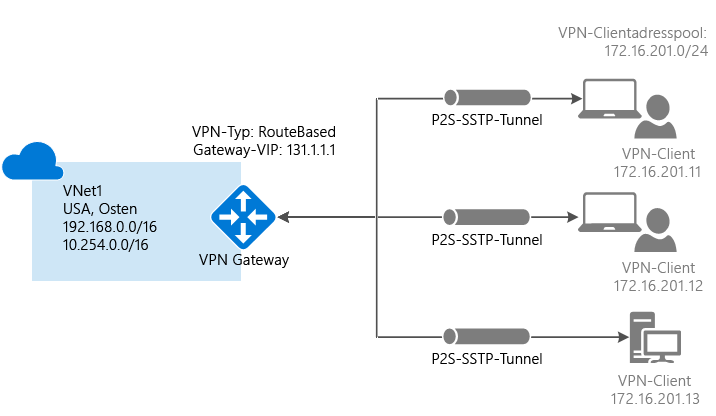

# <a name="configure-a-point-to-site-connection-to-a-vnet-using-powershell"></a>Konfigurieren einer Point-to-Site-VPN-Verbindung (P2S) mit einem VNet mithilfe von PowerShell
> [!div class="op_single_selector"]
> * [Resource Manager – Azure-Portal](vpn-gateway-howto-point-to-site-resource-manager-portal.md)
> * [Resource Manager – PowerShell](vpn-gateway-howto-point-to-site-rm-ps.md)
> * [Klassisch – Azure-Portal](vpn-gateway-howto-point-to-site-classic-azure-portal.md)
> 
> 

Mit einer P2S-Konfiguration (Point-to-Site) können Sie von einem einzelnen Clientcomputer eine sichere Verbindung mit einem virtuellen Netzwerk herstellen. P2S ist eine VPN-Verbindung über SSTP (Secure Socket Tunneling-Protokoll). Point-to-Site-Verbindungen sind nützlich, wenn Sie von einem Remotestandort, z.B. von zu Hause oder bei einer Konferenz, eine Verbindung mit Ihrem VNet herstellen möchten. Diese Methode eignet sich auch, wenn Sie nur wenige Clients besitzen, die mit einem virtuellen Netzwerk verbunden werden müssen. Für P2S-Verbindungen ist kein VPN-Gerät und auch keine öffentliche IP-Adresse erforderlich. Sie stellen die VPN-Verbindung über den Clientcomputer her.

Dieser Artikel führt Sie durch die Erstellung eines VNet mit einer P2S-Verbindung im Resource Manager-Bereitstellungsmodell mit PowerShell. Weitere Informationen zu Point-to-Site-Verbindungen finden Sie unter [Point-to-Site – Häufig gestellte Fragen](#faq) am Ende dieses Artikels.

### <a name="deployment-models-and-methods-for-p2s-connections"></a>Bereitstellungsmodelle und -methoden für P2S-Verbindungen
[!INCLUDE [deployment models](../../includes/vpn-gateway-deployment-models-include.md)]

Die folgende Tabelle zeigt die beiden Bereitstellungsmodelle und die verfügbaren Bereitstellungsmethoden für P2S-Konfigurationen. Falls ein Artikel mit Konfigurationsschritten verfügbar ist, steht in der Tabelle ein direkter Link zur Verfügung.

[!INCLUDE [vpn-gateway-clasic-rm](../../includes/vpn-gateway-table-point-to-site-include.md)]

## <a name="basic-workflow"></a>Grundlegender Workflow


In diesem Szenario erstellen Sie ein virtuelles Netzwerk mit einer P2S-Verbindung. Diese Anleitung hilft Ihnen auch beim Erstellen von Zertifikaten, die für diese Konfiguration erforderlich sind. Eine P2S-Verbindung besteht aus folgenden Elementen: einem VNet mit einem VPN-Gateway, einer CER-Stammzertifikatdatei (öffentlicher Schlüssel), einem Clientzertifikat und der VPN-Konfiguration auf dem Client. 

Für diese Konfiguration verwenden wir die folgenden Werte: Wir legen die Variablen im Abschnitt [1](#declare) des Artikels fest. Sie können diese Schritte entweder als exemplarische Vorgehensweise durchlaufen und die Werte nicht ändern, oder Sie können die Werte Ihrer Umgebung entsprechend ändern. 

### <a name="example"></a>Beispielwerte
* **Name: VNet1**
* **Adressraum: 192.168.0.0/16** und **10.254.0.0/16**<br>In diesem Beispiel verwenden wir mehrere Adressräume, um zu veranschaulichen, dass diese Konfiguration mit mehreren Adressräumen funktioniert. Für diese Konfiguration sind aber nicht mehrere Adressräume erforderlich.
* **Subnetzname: FrontEnd**
  * **Subnetzadressbereich: 192.168.1.0/24**
* **Subnetzname: BackEnd**
  * **Subnetzadressbereich: 10.254.1.0/24**
* **Subnetzname: GatewaySubnet**<br>Der Subnetzname *GatewaySubnet* ist erforderlich, damit das VPN-Gateway funktioniert.
  * **Adressbereich des Gatewaysubnetzes: 192.168.200.0/24** 
* **VPN-Clientadresspool: 172.16.201.0/24**<br>VPN-Clients, die sich über diese Punkt-zu-Standort-Verbindung mit dem VNet verbinden, erhalten eine IP-Adresse aus dem VPN-Clientadresspool.
* **Abonnement:** Falls Sie über mehrere Abonnements verfügen, sollten Sie sich vergewissern, dass Sie das richtige Abonnement verwenden.
* **Ressourcengruppe: TestRG**
* **Standort: USA, Osten**
* **DNS-Server:** IP-Adresse des DNS-Servers, der für die Namensauflösung verwendet werden soll.
* **GW-Name: Vnet1GW**
* **Name der öffentlichen IP: VNet1GWPIP**
* **VpnType: RouteBased**

## <a name="before-beginning"></a>Vorbereitungen
* Stellen Sie sicher, dass Sie über ein Azure-Abonnement verfügen. Wenn Sie noch kein Azure-Abonnement besitzen, können Sie Ihre [MSDN-Abonnentenvorteile](https://azure.microsoft.com/pricing/member-offers/msdn-benefits-details) aktivieren oder sich für ein [kostenloses Konto](https://azure.microsoft.com/pricing/free-trial) registrieren.
* Installieren Sie die aktuelle Version der PowerShell-Cmdlets für Azure Resource Manager. Weitere Informationen zum Installieren von PowerShell-Cmdlets finden Sie unter [Overview of Azure PowerShell](/powershell/azureps-cmdlets-docs) (Übersicht über Azure PowerShell). 

## <a name="declare"></a>Teil 1 – Anmelden und Festlegen von Variablen
In diesem Abschnitt melden Sie sich an und deklarieren die für diese Konfiguration verwendeten Werte. Die deklarierten Werte werden in den Beispielskripts verwendet. Ändern Sie die Werte Ihrer Umgebung entsprechend. Alternativ können Sie diese Schritte mit den deklarierten Werten als Übung durchlaufen.

1. Öffnen Sie die PowerShell-Konsole mit erhöhten Rechten, und melden Sie sich bei Ihrem Konto an. Das Cmdlet fordert Sie zur Eingabe der Anmeldeinformationen auf. Nach dem Anmelden werden Ihre Kontoeinstellungen heruntergeladen, damit sie Azure PowerShell zur Verfügung stehen.

  ```powershell
  Login-AzureRmAccount
  ```
2. Rufen Sie eine Liste Ihrer Azure-Abonnements ab.

  ```powershell  
  Get-AzureRmSubscription
  ```
3. Geben Sie das Abonnement an, das Sie verwenden möchten.

  ```powershell
  Select-AzureRmSubscription -SubscriptionName "Name of subscription"
  ```
4. Deklarieren Sie die gewünschten Variablen. Verwenden Sie das unten gezeigte Beispiel, und ersetzen Sie die Werte nach Bedarf durch Ihre eigenen.

  ```powershell
  $VNetName  = "VNet1"
  $FESubName = "FrontEnd"
  $BESubName = "Backend"
  $GWSubName = "GatewaySubnet"
  $VNetPrefix1 = "192.168.0.0/16"
  $VNetPrefix2 = "10.254.0.0/16"
  $FESubPrefix = "192.168.1.0/24"
  $BESubPrefix = "10.254.1.0/24"
  $GWSubPrefix = "192.168.200.0/26"
  $VPNClientAddressPool = "172.16.201.0/24"
  $RG = "TestRG"
  $Location = "East US"
  $DNS = "8.8.8.8"
  $GWName = "VNet1GW"
  $GWIPName = "VNet1GWPIP"
  $GWIPconfName = "gwipconf"
  ```

## <a name="ConfigureVNet"></a>Teil 2 – Konfigurieren eines VNET
1. Erstellen Sie eine Ressourcengruppe.

  ```powershell
  New-AzureRmResourceGroup -Name $RG -Location $Location
  ```
2. Erstellen Sie die Subnetzkonfigurationen für das virtuelle Netzwerk, und benennen Sie sie mit *FrontEnd*, *BackEnd* und *GatewaySubnet*. Diese Präfixe müssen im deklarierten VNet-Adressraum enthalten sein.

  ```powershell
  $fesub = New-AzureRmVirtualNetworkSubnetConfig -Name $FESubName -AddressPrefix $FESubPrefix
  $besub = New-AzureRmVirtualNetworkSubnetConfig -Name $BESubName -AddressPrefix $BESubPrefix
  $gwsub = New-AzureRmVirtualNetworkSubnetConfig -Name $GWSubName -AddressPrefix $GWSubPrefix
  ```
3. Erstellen des virtuellen Netzwerks Der angegebene DNS-Server muss dazu in der Lage sein, die Namen für die Ressourcen aufzulösen, mit denen Sie eine Verbindung herstellen möchten. In diesem Beispiel verwenden wir eine öffentliche IP-Adresse. Achten Sie darauf, dass Sie Ihre eigenen Werte verwenden.

  ```powershell
  New-AzureRmVirtualNetwork -Name $VNetName -ResourceGroupName $RG -Location $Location -AddressPrefix $VNetPrefix1,$VNetPrefix2 -Subnet $fesub, $besub, $gwsub -DnsServer $DNS
  ```
4. Geben Sie die Variablen für das virtuelle Netzwerk an, das Sie erstellt haben.

  ```powershell
  $vnet = Get-AzureRmVirtualNetwork -Name $VNetName -ResourceGroupName $RG
  $subnet = Get-AzureRmVirtualNetworkSubnetConfig -Name "GatewaySubnet" -VirtualNetwork $vnet
  ```
5. Fordern Sie eine dynamisch zugewiesene öffentliche IP-Adresse an. Diese IP-Adresse ist erforderlich, damit das Gateway ordnungsgemäß funktioniert. Später verbinden Sie das Gateway mit der Gateway-IP-Konfiguration.

  ```powershell
  $pip = New-AzureRmPublicIpAddress -Name $GWIPName -ResourceGroupName $RG -Location $Location -AllocationMethod Dynamic
  $ipconf = New-AzureRmVirtualNetworkGatewayIpConfig -Name $GWIPconfName -Subnet $subnet -PublicIpAddress $pip
  ```


## <a name="Certificates"></a>Teil 3 – Zertifikate

Zertifikate werden von Azure zur Authentifizierung von VPN-Clients für Point-to-Site-VPNs verwendet. Nach dem Erstellen des Stammzertifikats exportieren Sie die Daten des öffentlichen Zertifikats (nicht den privaten Schlüssel) als Base64-codierte X.509-CER-Datei. Anschließend laden Sie die Daten des öffentlichen Zertifikats aus dem Stammzertifikat nach Azure hoch.

Auf jedem Clientcomputer, der per Point-to-Site eine Verbindung mit einem VNet herstellt, muss ein Clientzertifikat installiert sein. Das Clientzertifikat wird über das Stammzertifikat generiert und auf jedem Clientcomputer installiert. Wenn kein gültiges Clientzertifikat installiert ist und der Client versucht, eine Verbindung mit dem VNet herzustellen, tritt bei der Authentifizierung ein Fehler auf.

### <a name="cer"></a>Schritt 1: Beschaffen der CER-Datei für das Stammzertifikat

#### <a name="enterprise-certificate"></a>Unternehmenszertifikat
 
Bei einer Unternehmenslösung können Sie Ihre vorhandene Zertifikatkette verwenden. Rufen Sie die CER-Datei für das Stammzertifikat ab, das Sie verwenden möchten.

#### <a name="self-signed-root-certificate"></a>Selbstsigniertes Stammzertifikat

Wenn Sie keine Unternehmenszertifikatlösung verwenden, müssen Sie ein selbstsigniertes Stammzertifikat generieren. Sie können PowerShell verwenden, um ein selbstsigniertes Stammzertifikat zu erstellen, das die erforderlichen Felder für die P2S-Authentifizierung enthält. Unter [Arbeiten mit selbstsignierten Stammzertifikaten für Punkt-zu-Standort-Verbindungen](vpn-gateway-certificates-point-to-site.md) werden die Schritte zum Erstellen eines selbstsignierten Stammzertifikats beschrieben.

> [!NOTE]
> Bisher war „makecert“ die empfohlene Methode, um selbstsignierte Zertifikate zu erstellen und Clientzertifikate für Point-to-Site-Verbindungen zu generieren. Jetzt können Sie diese Zertifikate mit PowerShell erstellen. Ein Vorteil bei der Verwendung von PowerShell ist, dass Sie SHA-2-Zertifikate erstellen können. Die erforderlichen Werte finden Sie unter [Arbeiten mit selbstsignierten Stammzertifikaten für Punkt-zu-Standort-Verbindungen](vpn-gateway-certificates-point-to-site.md).
>
>

#### <a name="to-export-the-public-key-for-a-self-signed-root-certificate"></a>So exportieren Sie den öffentlichen Schlüssel für ein selbstsigniertes Stammzertifikat

Für Point-to-Site-Verbindungen muss der öffentliche Schlüssel (CER-Format) nach Azure hochgeladen werden. Die folgenden Schritte dienen Ihnen als Hilfe beim Exportieren der CER-Datei für Ihr selbstsigniertes Stammzertifikat.

1. Öffnen Sie **Benutzerzertifikate verwalten**, um eine CER-Datei für das Zertifikat zu erhalten.
2. Suchen Sie unter „Zertifikate – Aktueller Benutzer\Eigene Zertifikate\Zertifikate“ nach dem selbstsignierten Stammzertifikat „P2SRootCert“, und klicken Sie mit der rechten Maustaste darauf. Klicken Sie auf **Alle Aufgaben** und dann auf **Exportieren**, um den **Zertifikatexport-Assistenten** zu öffnen.
3. Klicken Sie im Assistenten auf **Weiter**. Wählen Sie **Nein, privaten Schlüssel nicht exportieren** aus, und klicken Sie dann auf **Weiter**.
4. Wählen Sie auf der Seite **Dateiformat für den Export** die Option **Base-64-codiert X.509 (.CER)** aus, und klicken Sie dann auf **Weiter**. 
5. Navigieren Sie auf der Seite **Zu exportierende Datei** zu „C:“, erstellen Sie ein Unterverzeichnis mit dem Namen „cert“, und wählen Sie es aus. Geben Sie der Zertifikatdatei den Namen „P2SRootCert.cer“, und klicken Sie dann auf **Speichern**. 
6. Klicken Sie auf **Weiter** und dann auf **Fertig stellen**, um das Zertifikat zu exportieren. Die Meldung **Der Export war erfolgreich.** wird angezeigt. Klicken Sie auf **OK**, um den Assistenten zu schließen.

### <a name="generate"></a>Schritt 2: Generieren eines Clientzertifikats
Sie können entweder ein eindeutiges Zertifikat für jeden Client generieren, oder Sie können dasselbe Zertifikat für mehrere Clients verwenden. Der Vorteil beim Generieren von eindeutigen Clientzertifikaten besteht darin, dass Sie ein einzelnes Zertifikat widerrufen können. Falls alle das gleiche Clientzertifikat verwenden und Sie dieses Zertifikat widerrufen müssen, müssen Sie für alle Clients, die das Zertifikat zur Authentifizierung verwenden, neue Zertifikate generieren und installieren.

#### <a name="enterprise-certificate"></a>Unternehmenszertifikat
- Generieren Sie bei Verwendung einer Unternehmenszertifikatlösung ein Clientzertifikat mit dem gängigen Name-Wert-Format „name@yourdomain.com“ (anstatt des Formats „Domänenname\Benutzername“).
- Stellen Sie sicher, dass das Clientzertifikat auf der Zertifikatvorlage „Benutzer“ basiert, die in der Nutzungsliste als ersten Eintrag „Clientauthentifizierung“ enthält (anstatt „Smartcard-Anmeldung“ usw.). Sie können das Zertifikat überprüfen, indem Sie auf das Clientzertifikat doppelklicken und **Details > Erweiterte Schlüsselverwendung** anzeigen.

#### <a name="self-signed-root-certificate"></a>Selbstsigniertes Stammzertifikat 
Wenn Sie ein selbstsigniertes Stammzertifikat verwenden, helfen Ihnen die Schritte zum [Generieren eines Clientzertifikats mit PowerShell](vpn-gateway-certificates-point-to-site.md#clientcert) weiter. Hiermit können Sie ein Clientzertifikat generieren, das mit Point-to-Site-Verbindungen kompatibel ist.


### <a name="exportclientcert"></a>Schritt 3: Exportieren des Clientzertifikats

Wenn Sie ein Clientzertifikat über ein selbstsigniertes Stammzertifikat mithilfe der [PowerShell](vpn-gateway-certificates-point-to-site.md#clientcert)-Anleitung generieren, wird es automatisch auf dem Computer installiert, den Sie für die Generierung verwendet haben. Falls Sie ein Clientzertifikat auf einem anderen Clientcomputer installieren möchten, müssen Sie es exportieren.
 
1. Wählen Sie zum Exportieren eines Clientzertifikats die Option **Benutzerzertifikate verwalten** aus. Klicken Sie mit der rechten Maustaste auf das Clientzertifikat, das Sie exportieren möchten, und klicken Sie dann auf **Alle Aufgaben** und **Exportieren**, um den **Zertifikatexport-Assistenten** zu öffnen.
2. Klicken Sie im Assistenten auf **Weiter**, wählen Sie **Ja, privaten Schlüssel exportieren** aus, und klicken Sie dann auf **Weiter**.
3. Übernehmen Sie auf der Seite **Format der zu exportierenden Datei** die Standardwerte. Stellen Sie sicher, dass **Wenn möglich, alle Zertifikate im Zertifizierungspfad einbeziehen** aktiviert ist, um auch die erforderlichen Informationen zum Stammzertifikat zu exportieren. Klicken Sie auf **Weiter**.
4. Auf der Seite **Sicherheit** müssen Sie den privaten Schlüssel schützen. Wenn Sie ein Kennwort verwenden möchten, müssen Sie sich das für dieses Zertifikat festgelegte Kennwort unbedingt merken oder notieren. Klicken Sie auf **Weiter**.
5. Wählen Sie unter **Zu exportierende Datei** die Option **Durchsuchen** aus, um zu dem Speicherort zu wechseln, an den das Zertifikat exportiert werden soll. Geben Sie unter **Dateiname**einen Namen für die Zertifikatdatei ein. Klicken Sie auf **Weiter**.
6. Klicken Sie auf **Fertig stellen** , um das Zertifikat zu exportieren.

### <a name="upload"></a>Schritt 4: Hochladen der CER-Datei des Stammzertifikats

Nach Erstellung des Gateways können Sie die CER-Datei für ein vertrauenswürdiges Stammzertifikat in Azure hochladen. Sie können Dateien für bis zu 20 Stammzertifikate hochladen. Der private Schlüssel für das Stammzertifikat wird nicht in Azure hochgeladen. Die hochgeladene CER-Datei wird von Azure zur Authentifizierung von Clients verwendet, die eine Verbindung mit dem virtuellen Netzwerk herstellen.

1. Deklarieren Sie die Variable für Ihren Zertifikatnamen, und ersetzen Sie den Wert durch Ihren Wert:

  ```powershell
  $P2SRootCertName = "Mycertificatename.cer"
  ```
2. Ersetzen Sie den Dateipfad durch Ihren eigenen Pfad, und führen Sie dann die Cmdlets aus.

  ```powershell
  $filePathForCert = "C:\cert\Mycertificatename.cer"
  $cert = new-object System.Security.Cryptography.X509Certificates.X509Certificate2($filePathForCert)
  $CertBase64 = [system.convert]::ToBase64String($cert.RawData)
  $p2srootcert = New-AzureRmVpnClientRootCertificate -Name $P2SRootCertName -PublicCertData $CertBase64
  ```


## <a name="creategateway"></a>Teil 4 – Erstellen des VPN-Gateways
Konfigurieren und erstellen Sie das virtuelle Netzwerkgateway für Ihr VNet. *-GatewayType* muss **Vpn** sein, und *-VpnType* muss **RouteBased** lauten. Die Erstellung eines VPN-Gateways kann bis zu 45 Minuten dauern.

```powershell
New-AzureRmVirtualNetworkGateway -Name $GWName -ResourceGroupName $RG `
-Location $Location -IpConfigurations $ipconf -GatewayType Vpn `
-VpnType RouteBased -EnableBgp $false -GatewaySku Standard `
-VpnClientAddressPool $VPNClientAddressPool -VpnClientRootCertificates $p2srootcert
```


## <a name="clientconfig"></a>Teil 5 – Herunterladen des Konfigurationspakets für VPN-Clients
Um eine Point-to-Site-VPN-Verbindung mit einem VNET herstellen zu können, muss auf jedem Client ein VPN-Clientkonfigurationspaket installiert werden. Durch das Paket wird kein VPN-Client installiert. Es konfiguriert den nativen Windows-VPN-Client mit den Einstellungen, die zum Herstellen einer Verbindung mit dem virtuellen Netzwerk erforderlich sind. Die Liste mit den unterstützten Clientbetriebssystemen finden Sie unter [Point-to-Site – Häufig gestellte Fragen](#faq) am Ende dieses Artikels.

1. Nach Erstellung des Gateways können Sie das Clientkonfigurationspaket generieren und herunterladen. In diesem Beispiel wird das Paket für 64-Bit-Clients heruntergeladen. Wenn Sie den 32-Bit-Client herunterladen möchten, müssen Sie „Amd64“ durch „x86“ ersetzen. Sie können den VPN-Client auch mit dem Azure-Portal herunterladen.

  ```powershell
  Get-AzureRmVpnClientPackage -ResourceGroupName $RG `
  -VirtualNetworkGatewayName $GWName -ProcessorArchitecture Amd64
  ```
2. Kopieren Sie den zurückgegebenen Link, und fügen Sie ihn in einen Webbrowser ein, um das Paket herunterzuladen. (Entfernen Sie dabei die den Link umgebenden Anführungszeichen.) 
3. Laden Sie das Paket auf den Clientcomputer herunter, und installieren Sie es. Sollte ein SmartScreen-Popup erscheinen, klicken Sie auf **Weitere Informationen** und anschließend auf **Trotzdem ausführen**. Sie können das Paket auch speichern und auf anderen Clientcomputern installieren.
4. Navigieren Sie auf dem Clientcomputer zu **Netzwerkeinstellungen**, und klicken Sie auf **VPN**. Die VPN-Verbindung zeigt den Namen des virtuellen Netzwerks an, mit dem eine Verbindung hergestellt wird.


## <a name="clientcertificate"></a>Teil 6: Installieren eines exportierten Clientzertifikats

Wenn Sie eine P2S-Verbindung mit einem anderen Clientcomputer als dem für die Generierung der Clientzertifikate verwendeten Computer herstellen möchten, müssen Sie ein Clientzertifikat installieren. Beim Installieren eines Clientzertifikats benötigen Sie das Kennwort, das beim Exportieren des Clientzertifikats erstellt wurde.

1. Suchen Sie die *PFX* -Datei, und kopieren Sie sie auf den Clientcomputer. Doppelklicken Sie auf dem Clientcomputer auf die *PFX* -Datei, um sie zu installieren. Behalten Sie für **Speicherort** die Einstellung **Aktueller Benutzer** bei, und klicken Sie auf **Weiter**.
2. Nehmen Sie auf der Seite **Zu importierende Datei** keine Änderungen vor. Klicken Sie auf **Weiter**.
3. Geben Sie auf der Seite **Schutz für den privaten Schlüssel** das Kennwort für das Zertifikat ein, oder überprüfen Sie die Korrektheit des Sicherheitsprinzipals, und klicken Sie anschließend auf **Weiter**.
4. Behalten Sie auf der Seite **Zertifikatspeicher** den Standardspeicherort bei, und klicken Sie dann auf **Weiter**.
5. Klicken Sie auf **Fertig stellen**. Klicken Sie in der **Sicherheitswarnung** für die Zertifikatinstallation auf **Ja**. Sie können beruhigt auf „Ja“ klicken, da Sie das Zertifikat generiert haben. Das Zertifikat wird nun erfolgreich importiert.

## <a name="connect"></a>Teil 7: Herstellen einer Verbindung mit Azure
1. Um eine Verbindung mit Ihrem VNet herzustellen, navigieren Sie auf dem Clientcomputer zu „VPN-Verbindungen“ und suchen nach der VPN-Verbindung, die Sie erstellt haben. Sie hat den gleichen Namen wie das virtuelle Netzwerk. Klicken Sie auf **Verbinden**. Möglicherweise wird eine Popupmeldung angezeigt, die sich auf die Verwendung des Zertifikats bezieht. Klicken Sie auf **Weiter**, um erhöhte Rechte zu verwenden. 
2. Klicken Sie auf der Statusseite **Verbindung** auf **Verbinden**, um die Verbindung herzustellen. Wenn der Bildschirm **Zertifikat auswählen** angezeigt wird, vergewissern Sie sich, dass das angezeigte Clientzertifikat dem Zertifikat entspricht, die Sie zum Herstellen der Verbindung verwenden möchten. Wenn dies nicht der Fall ist, verwenden Sie den Dropdownpfeil, um das richtige Zertifikat auszuwählen, und klicken Sie dann auf **OK**.
   
    
3. Die Verbindung wurde hergestellt.
   
    

Überprüfen Sie die folgenden Punkte, falls bei der Verbindungsherstellung Probleme auftreten:

- Öffnen Sie **Benutzerzertifikate verwalten**, und navigieren Sie zu **Vertrauenswürdige Stammzertifizierungsstellen\Zertifikate**. Vergewissern Sie sich, dass das Stammzertifikat aufgeführt ist. Das Stammzertifikat muss vorhanden sein, damit die Authentifizierung funktioniert. Wenn Sie eine PFX-Clientzertifikatdatei mit der Standardeinstellung „Wenn möglich, alle Zertifikate im Zertifizierungspfad einbeziehen“ exportieren, werden auch die Informationen zum Stammzertifikat exportiert. Beim Installieren des Clientzertifikats wird dann auch das Stammzertifikat auf dem Clientcomputer installiert. 

- Wenn Sie bei Verwendung eines Zertifikats, das mit einer Lösung einer Unternehmenszertifizierungsstelle ausgestellt wurde, Probleme mit der Authentifizierung haben, ist es ratsam, die Authentifizierungsreihenfolge des Clientzertifikats zu überprüfen. Sie können die Reihenfolge der Authentifizierungsliste überprüfen, indem Sie auf das Clientzertifikat doppelklicken und zu **Details > Erweiterte Schlüsselverwendung** navigieren. Achten Sie darauf, dass in der Liste „Client Authentication“ als erster Eintrag aufgeführt ist. Wenn nicht, müssen Sie ein Clientzertifikat basierend auf der User-Vorlage ausstellen, die als ersten Eintrag in der Liste „Client Authentication“ enthält.  


## <a name="verify"></a>Teil 8: Überprüfen der Verbindung
1. Um sicherzustellen, dass die VPN-Verbindung aktiv ist, öffnen Sie eine Eingabeaufforderung mit Administratorrechten, und führen Sie *Ipconfig/all*aus.
2. Zeigen Sie die Ergebnisse an. Beachten Sie, dass die erhaltene IP-Adresse eine der Adressen aus dem Clientadresspool des Punkt-zu-Standort-VPN ist, den Sie in Ihrer Konfiguration angegeben haben. Die Ergebnisse sehen in etwa wie in diesem Beispiel aus:
   
        PPP adapter VNet1:
            Connection-specific DNS Suffix .:
            Description.....................: VNet1
            Physical Address................:
            DHCP Enabled....................: No
            Autoconfiguration Enabled.......: Yes
            IPv4 Address....................: 172.16.201.3(Preferred)
            Subnet Mask.....................: 255.255.255.255
            Default Gateway.................:
            NetBIOS over Tcpip..............: Enabled


## <a name="connectVM"></a>Herstellen einer Verbindung mit einem virtuellem Computer

1. Nachdem Sie eine Verbindung mit Ihrem VNET hergestellt haben, können Sie über Ihre P2S-Verbindung eine Verbindung mit einem virtuellen Computer herstellen. Für die Verbindungsherstellung mit dem virtuellen Computer benötigen Sie die private IP-Adresse des virtuellen Computers. Das folgende Beispiel veranschaulicht das Abrufen der privaten IP-Adresse mit [Get-AzureRmNetworkInterface](https://docs.microsoft.com/powershell/module/azurerm.network/get-azurermnetworkinterface?view=azurermps-3.7.0). In den Ergebnissen wird eine Liste mit virtuellen Computern und den jeweiligen privaten IP-Adressen in allen Ihren Ressourcengruppen zurückgegeben. 

  ```powershell   
  $vms = get-azurermvm
  $nics = get-azurermnetworkinterface | where VirtualMachine -NE $null #skip Nics with no VM
  
  foreach($nic in $nics)
  {
    $vm = $vms | where-object -Property Id -EQ $nic.VirtualMachine.id
    $prv =  $nic.IpConfigurations | select-object -ExpandProperty PrivateIpAddress
    $alloc =  $nic.IpConfigurations | select-object -ExpandProperty PrivateIpAllocationMethod
    Write-Output "$($vm.Name) : $prv , $alloc"
  }
  ```
2. Erstellen Sie mit dem folgenden Befehl eine Remotedesktopsitzung mit dem virtuellen Computer. Ersetzen Sie die IP-Adresse durch die private IP-Adresse des virtuellen Computers, mit dem Sie eine Verbindung herstellen möchten. Geben Sie nach Aufforderung die beim Erstellen des virtuellen Computers verwendeten Anmeldeinformationen ein. 

  ```powershell   
  mstsc /v:192.168.1.4
  ```

Sollten beim Herstellen der P2S-Verbindung mit einem virtuellen Computer Probleme auftreten, können Sie mit „ipconfig“ die IPv4-Adresse überprüfen, die dem Ethernet-Adapter auf dem Computer zugewiesen ist, von dem aus Sie die Verbindung herstellen. Wenn sich die IP-Adresse im Adressbereich des VNETs befindet, mit dem Sie die Verbindung herstellen, oder im Adressbereich von „VPNClientAddressPool“ liegt, wird dies als sich überschneidender Adressraum bezeichnet. Falls sich Ihr Adressraum auf diese Weise überschneidet, kommt der Netzwerkdatenverkehr nicht bei Azure an, sondern verbleibt im lokalen Netzwerk. Falls sich Ihre Netzwerkadressräume nicht überschneiden und Sie trotzdem keine Verbindung mit Ihrem virtuellen Computer herstellen können, lesen Sie den Artikel [Behandeln von Problemen bei Remotedesktopverbindungen mit einem virtuellen Azure-Computer](../virtual-machines/windows/troubleshoot-rdp-connection.md).

## <a name="addremovecert"></a>Hinzufügen oder Entfernen eines vertrauenswürdigen Stammzertifikats

Sie können vertrauenswürdige Stammzertifikate hinzufügen und aus Azure entfernen. Wenn Sie ein vertrauenswürdiges Zertifikat entfernen, kann für die Clientzertifikate, die mit dem Stammzertifikat generiert wurden, keine Point-to-Site-Verbindung mit Azure hergestellt werden. Falls Sie Clientverbindungen herstellen möchten, müssen Sie dazu jeweils ein neues Clientzertifikat installieren, das mit einem für Azure vertrauenswürdigen Zertifikat generiert wird.

### <a name="to-add-a-trusted-root-certificate"></a>So fügen Sie ein vertrauenswürdiges Stammzertifikat hinzu
Sie können Azure bis zu 20 vertrauenswürdige CER-Stammzertifikatdateien hinzufügen. Gehen Sie zum Hinzufügen eines Stammzertifikats wie folgt vor:

1. Erstellen Sie das neue Stammzertifikat, das Sie Azure hinzufügen möchten, und bereiten Sie es vor. Exportieren Sie den öffentlichen Schlüssel als Base64-codierte X.509-Datei (.CER), und öffnen Sie diese mit einem Text-Editor. Kopieren Sie die Werte wie im folgenden Beispiel gezeigt:
   
  

    > [!NOTE]
    > Stellen Sie beim Kopieren der Zertifikatsdaten sicher, dass Sie den Text als fortlaufende Zeile ohne Wagenrückläufe oder Zeilenvorschübe kopieren. Es kann erforderlich sein, Ihre Ansicht im Text-Editor so zu ändern, dass die Symbole bzw. alle Zeichen angezeigt werden, damit die Wagenrückläufe bzw. Zeilenvorschübe sichtbar sind.
  >
  >

2. Geben Sie den Zertifikatnamen und die Schlüsselinformationen als Variable an. Ersetzen Sie die Informationen durch Ihre eigenen Angaben, wie im folgenden Beispiel gezeigt:

  ```powershell
  $P2SRootCertName2 = "ARMP2SRootCert2.cer"
  $MyP2SCertPubKeyBase64_2 = "MIIC/zCCAeugAwIBAgIQKazxzFjMkp9JRiX+tkTfSzAJBgUrDgMCHQUAMBgxFjAUBgNVBAMTDU15UDJTUm9vdENlcnQwHhcNMTUxMjE5MDI1MTIxWhcNMzkxMjMxMjM1OTU5WjAYMRYwFAYDVQQDEw1NeVAyU1Jvb3RDZXJ0MIIBIjANBgkqhkiG9w0BAQEFAAOCAQ8AMIIBCgKCAQEAyjIXoWy8xE/GF1OSIvUaA0bxBjZ1PJfcXkMWsHPzvhWc2esOKrVQtgFgDz4ggAnOUFEkFaszjiHdnXv3mjzE2SpmAVIZPf2/yPWqkoHwkmrp6BpOvNVOpKxaGPOuK8+dql1xcL0eCkt69g4lxy0FGRFkBcSIgVTViS9wjuuS7LPo5+OXgyFkAY3pSDiMzQCkRGNFgw5WGMHRDAiruDQF1ciLNojAQCsDdLnI3pDYsvRW73HZEhmOqRRnJQe6VekvBYKLvnKaxUTKhFIYwuymHBB96nMFdRUKCZIiWRIy8Hc8+sQEsAML2EItAjQv4+fqgYiFdSWqnQCPf/7IZbotgQIDAQABo00wSzBJBgNVHQEEQjBAgBAkuVrWvFsCJAdK5pb/eoCNoRowGDEWMBQGA1UEAxMNTXlQMlNSb290Q2VydIIQKazxzFjMkp9JRiX+tkTfSzAJBgUrDgMCHQUAA4IBAQA223veAZEIar9N12ubNH2+HwZASNzDVNqspkPKD97TXfKHlPlIcS43TaYkTz38eVrwI6E0yDk4jAuPaKnPuPYFRj9w540SvY6PdOUwDoEqpIcAVp+b4VYwxPL6oyEQ8wnOYuoAK1hhh20lCbo8h9mMy9ofU+RP6HJ7lTqupLfXdID/XevI8tW6Dm+C/wCeV3EmIlO9KUoblD/e24zlo3YzOtbyXwTIh34T0fO/zQvUuBqZMcIPfM1cDvqcqiEFLWvWKoAnxbzckye2uk1gHO52d8AVL3mGiX8wBJkjc/pMdxrEvvCzJkltBmqxTM6XjDJALuVh16qFlqgTWCIcb7ju"
  ```
3. Fügen Sie das neue Stammzertifikat hinzu. Sie können immer nur jeweils ein Zertifikat hinzufügen.

  ```powershell
  Add-AzureRmVpnClientRootCertificate -VpnClientRootCertificateName $P2SRootCertName2 -VirtualNetworkGatewayname "VNet1GW" -ResourceGroupName "TestRG" -PublicCertData $MyP2SCertPubKeyBase64_2
  ```
4. Mit dem folgenden Beispiel können Sie überprüfen, ob das neue Zertifikat ordnungsgemäß hinzugefügt wurde:

  ```powershell
  Get-AzureRmVpnClientRootCertificate -ResourceGroupName "TestRG" `
  -VirtualNetworkGatewayName "VNet1GW"
  ```


### <a name="to-remove-a-trusted-root-certificate"></a>Entfernen eines vertrauenswürdigen Stammzertifikats


1. Deklarieren Sie die Variablen.

  ```powershell
  $GWName = "Name_of_virtual_network_gateway"
  $RG = "Name_of_resource_group"
  $P2SRootCertName2 = "ARMP2SRootCert2.cer"
  $MyP2SCertPubKeyBase64_2 = "MIIC/zCCAeugAwIBAgIQKazxzFjMkp9JRiX+tkTfSzAJBgUrDgMCHQUAMBgxFjAUBgNVBAMTDU15UDJTUm9vdENlcnQwHhcNMTUxMjE5MDI1MTIxWhcNMzkxMjMxMjM1OTU5WjAYMRYwFAYDVQQDEw1NeVAyU1Jvb3RDZXJ0MIIBIjANBgkqhkiG9w0BAQEFAAOCAQ8AMIIBCgKCAQEAyjIXoWy8xE/GF1OSIvUaA0bxBjZ1PJfcXkMWsHPzvhWc2esOKrVQtgFgDz4ggAnOUFEkFaszjiHdnXv3mjzE2SpmAVIZPf2/yPWqkoHwkmrp6BpOvNVOpKxaGPOuK8+dql1xcL0eCkt69g4lxy0FGRFkBcSIgVTViS9wjuuS7LPo5+OXgyFkAY3pSDiMzQCkRGNFgw5WGMHRDAiruDQF1ciLNojAQCsDdLnI3pDYsvRW73HZEhmOqRRnJQe6VekvBYKLvnKaxUTKhFIYwuymHBB96nMFdRUKCZIiWRIy8Hc8+sQEsAML2EItAjQv4+fqgYiFdSWqnQCPf/7IZbotgQIDAQABo00wSzBJBgNVHQEEQjBAgBAkuVrWvFsCJAdK5pb/eoCNoRowGDEWMBQGA1UEAxMNTXlQMlNSb290Q2VydIIQKazxzFjMkp9JRiX+tkTfSzAJBgUrDgMCHQUAA4IBAQA223veAZEIar9N12ubNH2+HwZASNzDVNqspkPKD97TXfKHlPlIcS43TaYkTz38eVrwI6E0yDk4jAuPaKnPuPYFRj9w540SvY6PdOUwDoEqpIcAVp+b4VYwxPL6oyEQ8wnOYuoAK1hhh20lCbo8h9mMy9ofU+RP6HJ7lTqupLfXdID/XevI8tW6Dm+C/wCeV3EmIlO9KUoblD/e24zlo3YzOtbyXwTIh34T0fO/zQvUuBqZMcIPfM1cDvqcqiEFLWvWKoAnxbzckye2uk1gHO52d8AVL3mGiX8wBJkjc/pMdxrEvvCzJkltBmqxTM6XjDJALuVh16qFlqgTWCIcb7ju"
  ```
2. Entfernen Sie das Zertifikat.

  ```powershell
  Remove-AzureRmVpnClientRootCertificate -VpnClientRootCertificateName $P2SRootCertName2 -VirtualNetworkGatewayName $GWName -ResourceGroupName $RG -PublicCertData $MyP2SCertPubKeyBase64_2
  ```
3. Überprüfen Sie mit dem folgenden Beispiel, ob das Zertifikat erfolgreich entfernt wurde.

  ```powershell
  Get-AzureRmVpnClientRootCertificate -ResourceGroupName "TestRG" `
  -VirtualNetworkGatewayName "VNet1GW"
  ```

## <a name="revoke"></a>Sperren eines Clientzertifikats
Sie können Clientzertifikate sperren. Anhand der Zertifikatsperrliste können Sie basierend auf einzelnen Clientzertifikaten selektiv Punkt-zu-Standort-Verbindungen verweigern. Das ist nicht dasselbe wie das Entfernen eines vertrauenswürdigen Stammzertifikats. Wenn Sie ein vertrauenswürdiges Stammzertifikat (CER-Datei) aus Azure entfernen, wird der Zugriff für alle Clientzertifikate gesperrt, die mit dem gesperrten Stammzertifikat generiert oder signiert wurden. Wenn Sie anstelle des Stammzertifikats ein Clientzertifikat sperren, können die anderen Zertifikate, die auf der Grundlage des Stammzertifikats generiert wurden, weiterhin für die Authentifizierung verwendet werden.

Üblicherweise wird das Stammzertifikat zum Verwalten des Zugriffs auf Team- oder Organisationsebene verwendet. Eine genauer abgestufte Steuerung des Zugriffs für einzelne Benutzer erfolgt hingegen mit gesperrten Clientzertifikaten.

### <a name="to-revoke-a-client-certificate"></a>So sperren Sie ein Clientzertifikat

1. Rufen Sie den Fingerabdruck des Clientzertifikats ab. Weitere Informationen finden Sie unter [Vorgehensweise: Abrufen des Fingerabdrucks eines Zertifikats](https://msdn.microsoft.com/library/ms734695.aspx).
2. Kopieren Sie ihn in einen Text-Editor, und entfernen Sie alle Leerzeichen, sodass eine fortlaufende Zeichenfolge entsteht. Diese wird im nächsten Schritt als Variable deklariert.
3. Deklarieren Sie die Variablen. Deklarieren Sie den Fingerabdruck, den Sie im vorherigen Schritt abgerufen haben.

  ```powershell
  $RevokedClientCert1 = "NameofCertificate"
  $RevokedThumbprint1 = "‎51ab1edd8da4cfed77e20061c5eb6d2ef2f778c7"
  $GWName = "Name_of_virtual_network_gateway"
  $RG = "Name_of_resource_group"
  ```
4. Fügen Sie den Fingerabdruck der Liste mit den gesperrten Zertifikaten hinzu. Nach dem Hinzufügen des Fingerabdrucks wird „Erfolgreich“ angezeigt.

  ```powershell
  Add-AzureRmVpnClientRevokedCertificate -VpnClientRevokedCertificateName $RevokedClientCert1 `
  -VirtualNetworkGatewayName $GWName -ResourceGroupName $RG `
  -Thumbprint $RevokedThumbprint1
  ```
5. Überprüfen Sie, ob der Fingerabdruck zur Zertifikatsperrliste hinzugefügt wurde.

  ```powershell
  Get-AzureRmVpnClientRevokedCertificate -VirtualNetworkGatewayName $GWName -ResourceGroupName $RG
  ```
6. Nachdem der Fingerabdruck hinzugefügt wurde, kann das Zertifikat nicht mehr zum Herstellen einer Verbindung verwendet werden. Clients, die versuchen, unter Verwendung dieses Zertifikats eine Verbindung herzustellen, erhalten eine Meldung mit dem Hinweis, dass das Zertifikat nicht mehr gültig ist.

### <a name="to-reinstate-a-client-certificate"></a>So reaktivieren Sie ein Clientzertifikat
Sie können ein Clientzertifikat reaktivieren, indem Sie den Fingerabdruck aus der Liste der gesperrten Clientzertifikate entfernen.

1. Deklarieren Sie die Variablen. Achten Sie darauf, dass Sie den richtigen Fingerabdruck für das Zertifikat deklarieren, das Sie reaktivieren möchten.

  ```powershell
  $RevokedClientCert1 = "NameofCertificate"
  $RevokedThumbprint1 = "‎51ab1edd8da4cfed77e20061c5eb6d2ef2f778c7"
  $GWName = "Name_of_virtual_network_gateway"
  $RG = "Name_of_resource_group"
  ```
2. Entfernen Sie den Zertifikatfingerabdruck aus der Sperrliste.

  ```powershell
  Remove-AzureRmVpnClientRevokedCertificate -VpnClientRevokedCertificateName $RevokedClientCert1 `
  -VirtualNetworkGatewayName $GWName -ResourceGroupName $RG -Thumbprint $RevokedThumbprint1
  ```
3. Überprüfen Sie, ob der Fingerabdruck aus der Sperrliste entfernt wurde.

  ```powershell
  Get-AzureRmVpnClientRevokedCertificate -VirtualNetworkGatewayName $GWName -ResourceGroupName $RG
  ```

## <a name="faq"></a>Point-to-Site – Häufig gestellte Fragen

[!INCLUDE [Point-to-Site FAQ](../../includes/vpn-gateway-point-to-site-faq-include.md)]

## <a name="next-steps"></a>Nächste Schritte
Sobald die Verbindung hergestellt ist, können Sie Ihren virtuellen Netzwerken virtuelle Computer hinzufügen. Weitere Informationen finden Sie unter [Virtuelle Computer](https://docs.microsoft.com/azure/#pivot=services&panel=Compute) . Weitere Informationen zu Netzwerken und virtuellen Computern finden Sie unter [Azure- und Linux-VM-Netzwerke (Übersicht)](../virtual-machines/linux/azure-vm-network-overview.md).
