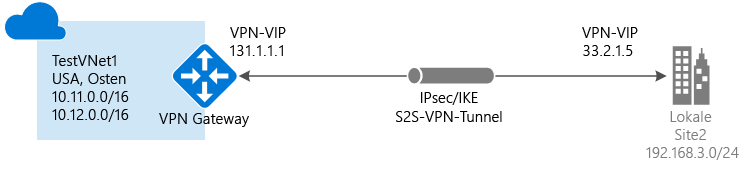

# Erstellen einer Site-to-Site-Verbindung im Azure-Portal

In diesem Artikel wird beschrieben, wie Sie das Azure-Portal zum Erstellen einer Site-to-Site-VPN-Gateway-Verbindung zwischen Ihrem lokalen Netzwerk und dem VNET verwenden. Die Schritte in diesem Artikel gelten für das Resource Manager-Bereitstellungsmodell. Sie können diese Konfiguration auch mit einem anderen Bereitstellungstool oder -modell erstellen. Wählen Sie hierzu in der folgenden Liste eine andere Option:

> [!div class="op_single_selector"]
> * [Resource Manager – Azure-Portal](vpn-gateway-howto-site-to-site-resource-manager-portal.md)
> * [Resource Manager – PowerShell](vpn-gateway-create-site-to-site-rm-powershell.md)
> * [Resource Manager – Befehlszeilenschnittstelle](vpn-gateway-howto-site-to-site-resource-manager-cli.md)
> * [Klassisch – Azure-Portal](vpn-gateway-howto-site-to-site-classic-portal.md)
> * [Klassisch – Klassisches Portal](vpn-gateway-site-to-site-create.md)
> 
>

Eine Site-to-Site-VPN-Gateway-Verbindung wird verwendet, um Ihr lokales Netzwerk über einen IPsec/IKE-VPN-Tunnel (IKEv1 oder IKEv2) mit einem virtuellen Azure-Netzwerk zu verbinden. Für diese Art von Verbindung wird ein lokales VPN-Gerät benötigt, dem eine extern zugängliche, öffentliche IP-Adresse zugewiesen ist. Weitere Informationen zu VPN-Gateways finden Sie unter [Informationen zu VPN Gateway](vpn-gateway-about-vpngateways.md).

## Voraussetzungen

Vergewissern Sie sich vor Beginn der Konfiguration, dass die folgenden Voraussetzungen erfüllt sind bzw. Folgendes vorhanden ist:

* Vergewissern Sie sich, dass Sie das Resource Manager-Bereitstellungsmodell verwenden möchten. [!INCLUDE [deployment models](../../includes/vpn-gateway-deployment-models-include.md)] 
* Ein kompatibles VPN-Gerät (und eine Person, die es konfigurieren kann). Weitere Informationen zu kompatiblen VPN-Geräten und zur Gerätekonfiguration finden Sie unter [Informationen zu VPN-Geräten](vpn-gateway-about-vpn-devices.md).
* Eine externe öffentliche IPv4-IP-Adresse für Ihr VPN-Gerät. Diese IP-Adresse darf sich nicht hinter einer NAT befinden.
* Falls Sie nicht mit den IP-Adressbereichen in Ihrer lokalen Netzwerkkonfiguration vertraut sind, wenden Sie sich an eine Person, die Ihnen diese Informationen zur Verfügung stellen kann. Beim Erstellen dieser Konfiguration müssen Sie die Präfixe für die IP-Adressbereiche angeben, die Azure an Ihren lokalen Standort weiterleitet. Kein Subnetz Ihres lokalen Netzwerks darf sich mit den Subnetzen des virtuellen Netzwerks überschneiden, mit dem Sie eine Verbindung herstellen möchten. 

### Beispielwerte
Sie können die folgenden Beispielwerte nutzen, wenn Sie diese Schritte als Übung verwenden:

* **VNET-Name:** TestVNet1
* **Adressraum:** 
    * 10.11.0.0/16
    * 10.12.0.0/16 (für diese Übung optional)
* **Subnetze:**
  * FrontEnd: 10.11.0.0/24
  * BackEnd: 10.12.0.0/24 (für diese Übung optional)
  * GatewaySubnet: 10.11.255.0/27
* **Ressourcengruppe:** TestRG1
* **Standort:** USA, Osten
* **DNS-Server:** IP-Adresse Ihres DNS-Servers
* **Name des Gateways für virtuelle Netzwerke:** VNet1GW
* **Öffentliche IP-Adresse:** VNet1GWIP
* **VPN-Typ:** Routenbasiert
* **Verbindungstyp:** Site-to-Site (IPsec)
* **Gatewaytyp:** VPN
* **Name des Gateways für das lokale Netzwerk:** Site2
* **Verbindungsname:** VNet1toSite2

## 1. Erstellen eines virtuellen Netzwerks

[!INCLUDE [vpn-gateway-basic-vnet-rm-portal](../../includes/vpn-gateway-basic-vnet-s2s-rm-portal-include.md)]

## 2. Angeben eines DNS-Servers
DNS ist für Site-to-Site-Verbindungen nicht erforderlich. Wenn Sie für Ressourcen, die in Ihren virtuellen Netzwerken bereitgestellt werden, die Namensauflösung verwenden möchten, müssen Sie aber einen DNS-Server angeben. Diese Einstellung bietet die Möglichkeit, den DNS-Server anzugeben, den Sie zur Namensauflösung für dieses virtuelle Netzwerk verwenden möchten. Mit dieser Einstellung wird kein DNS-Server erstellt.

[!INCLUDE [vpn-gateway-add-dns-rm-portal](../../includes/vpn-gateway-add-dns-rm-portal-include.md)]

## 3. Erstellen des Gatewaysubnetzes

Für das virtuelle Netzwerkgateway wird ein Gatewaysubnetz verwendet, das die von den VPN-Gatewaydiensten genutzten IP-Adressen enthält. Wenn Sie ein Gatewaysubnetz erstellen, muss es den Namen „GatewaySubnet“ erhalten. Wenn Sie einen anderen Namen wählen, schlägt die Verbindungskonfiguration fehl.

Die Größe des von Ihnen angegebenen Gatewaysubnetzes richtet sich nach der VPN-Gatewaykonfiguration, die Sie erstellen möchten. Es ist zwar möglich, ein Gatewaysubnetz mit einer Größe von nur /29 zu erstellen, es wird jedoch empfohlen, /27 oder /28 auszuwählen, um ein größeres Subnetz mit mehr Adressen zu erstellen. Die Verwendung eines größeren Gatewaysubnetzes ermöglicht die Vergabe einer ausreichenden Zahl von IP-Adressen für potenzielle zukünftige Konfigurationen.

[!INCLUDE [vpn-gateway-add-gwsubnet-rm-portal](../../includes/vpn-gateway-add-gwsubnet-s2s-rm-portal-include.md)]

## 4. Erstellen des VPN-Gateways

[!INCLUDE [vpn-gateway-add-gw-s2s-rm-portal](../../includes/vpn-gateway-add-gw-s2s-rm-portal-include.md)]

## 5. Erstellen des Gateways des lokalen Netzwerks

Mit dem Gateway des lokalen Netzwerks ist normalerweise Ihr lokaler Standort gemeint. Sie geben dem Standort einen Namen, über den Azure darauf verweisen kann, und geben dann die IP-Adresse des lokalen VPN-Geräts an, mit dem Sie eine Verbindung herstellen. Außerdem geben Sie die IP-Adresspräfixe an, die über das VPN-Gateway an das VPN-Gerät weitergeleitet werden. Die von Ihnen angegebenen Adresspräfixe befinden sich in Ihrem lokalen Netzwerk. Sie können diese Präfixe leicht aktualisieren, wenn sich Ihr lokales Netzwerk ändert.

[!INCLUDE [vpn-gateway-add-lng-s2s-rm-portal](../../includes/vpn-gateway-add-lng-s2s-rm-portal-include.md)]

## 6. Konfigurieren des VPN-Geräts
[!INCLUDE [vpn-gateway-configure-vpn-device-rm](../../includes/vpn-gateway-configure-vpn-device-rm-include.md)]

Sie können die öffentliche IP-Adresse des VPN-Gateways mit dem Azure-Portal ermitteln, indem Sie zu **Gateways für virtuelle Netzwerke** navigieren und auf den Namen Ihres Gateways klicken.

## 7. Erstellen der VPN-Verbindung

Erstellen Sie die Site-to-Site-VPN-Verbindung zwischen dem Gateway Ihres virtuellen Netzwerks und Ihrem lokalen VPN-Gerät.

[!INCLUDE [vpn-gateway-add-site-to-site-connection-rm-portal](../../includes/vpn-gateway-add-site-to-site-connection-s2s-rm-portal-include.md)]

## 8. Überprüfen der VPN-Verbindung

[!INCLUDE [Azure portal](../../includes/vpn-gateway-verify-connection-portal-rm-include.md)]

## Nächste Schritte

*  Informationen zu BGP finden Sie in der [Übersicht über BGP](vpn-gateway-bgp-overview.md) und unter [Konfigurieren von BGP](vpn-gateway-bgp-resource-manager-ps.md).
*  Weitere Informationen zur Tunnelerzwingung finden Sie unter [Informationen zur Tunnelerzwingung](vpn-gateway-forced-tunneling-rm.md).
*  Informationen zu hochverfügbaren Aktiv/Aktiv-Verbindungen finden Sie unter [Standortübergreifende Verbindungen und VNET-zu-VNET-Verbindungen mit hoher Verfügbarkeit](vpn-gateway-highlyavailable.md).
