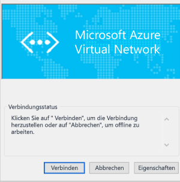

<properties
   pageTitle="Konfigurieren einer Point-to-Site-VPN-Gatewayverbindung mit einem Azure Virtual Network mit dem klassischen Portal | Microsoft Azure"
   description="Stellen Sie eine sichere Verbindung mit Ihrem Azure Virtual Network her, indem Sie eine P2S-VPN-Gatewayverbindung herstellen."
   services="vpn-gateway"
   documentationCenter="na"
   authors="cherylmc"
   manager="carmonm"
   editor=""
   tags="azure-service-management"/>

<tags
   ms.service="vpn-gateway"
   ms.devlang="na"
   ms.topic="hero-article"
   ms.tgt_pltfrm="na"
   ms.workload="infrastructure-services"
   ms.date="09/27/2016"
   ms.author="cherylmc"/>

# Konfigurieren einer Point-to-Site-Verbindung mit einem VNet über das klassische Portal

> [AZURE.SELECTOR]
- [Resource Manager – PowerShell](vpn-gateway-howto-point-to-site-rm-ps.md)
- [Klassisch – Klassisches Portal](vpn-gateway-point-to-site-create.md)

Mit einer P2S-Konfiguration (Point-to-Site) können Sie von einem einzelnen Clientcomputer eine sichere Verbindung mit einem virtuellen Netzwerk herstellen. Eine P2S-Verbindung ist nützlich, wenn Sie von einem Remotestandort, z.B. von zu Hause oder in einer Konferenz, eine Verbindung mit Ihrem VNet herstellen möchten. Diese Methode eignet sich auch, wenn Sie nur wenige Clients besitzen, die mit einem virtuellen Netzwerk verbunden werden müssen.

In diesem Artikel erfahren Sie Schritt für Schritt, wie Sie im Rahmen des **klassischen Bereitstellungsmodells** ein VNet mit einer Point-to-Site-Verbindung über das **klassische Portal** erstellen.

Damit Punkt-zu-Standort-Verbindungen funktionieren, ist kein VPN-Gerät und keine öffentliche IP-Adresse erforderlich. Eine VPN-Verbindung wird hergestellt, indem Sie die Verbindung vom Clientcomputer aus starten. Weitere Informationen zu P2S-Verbindungen finden Sie unter [Häufig gestellte Fragen zum VPN Gateway](vpn-gateway-vpn-faq.md#point-to-site-connections) und [Planung und Entwurf](vpn-gateway-plan-design.md).

### Bereitstellungsmodelle und -methoden für P2S-Verbindungen

[AZURE.INCLUDE [vpn-gateway-table-point-to-site](../../includes/vpn-gateway-table-point-to-site-include.md)]

**Informationen zu Azure-Bereitstellungsmodellen**

[AZURE.INCLUDE [vpn-gateway-clasic-rm](../../includes/vpn-gateway-classic-rm-include.md)]

## Informationen zum Erstellen einer Punkt-zu-Standort-Verbindung
 
Im Folgenden werden die Schritte zum Erstellen einer sicheren P2S-Verbindung mit einem virtuellen Netzwerk beschrieben.

Die Konfiguration einer P2S-Verbindung ist in vier Abschnitte unterteilt. Dabei ist die Reihenfolge wichtig, in der Sie die einzelnen Abschnitte konfigurieren. Überspringen Sie keine Schritte, und halten Sie die Reihenfolge ein.

- **Abschnitt 1**: Erstellen eines virtuellen Netzwerks und eines VPN-Gateways
- **Abschnitt 2**: Erstellen und Hochladen der Zertifikate für die Authentifizierung
- **Abschnitt 3**: Exportieren und Installieren der Clientzertifikate
- **Abschnitt 4**: Konfigurieren des VPN-Clients

## Abschnitt 1: Erstellen eines virtuellen Netzwerks und eines VPN-Gateways

### Teil 1: Erstellen eines virtuellen Netzwerks

1. Melden Sie sich beim [klassischen Azure-Portal](https://manage.windowsazure.com/) an. Bei diesen Schritten wird das klassische Portal und nicht das Azure-Portal verwendet. Derzeit ist es nicht möglich, eine P2S-Verbindung mit dem Azure-Portal zu erstellen.

2. Klicken Sie unten links auf dem Bildschirm auf **Neu**. Klicken Sie im Navigationsbereich auf **Netzwerkdienste** und dann auf **Virtuelles Netzwerk**. Klicken Sie auf **Custom Create**, um den Konfigurationsassistenten zu starten.

3. Geben Sie auf dem Bildschirm **Details des virtuellen Netzwerks** die folgenden Informationen ein, und klicken Sie dann auf den Vorwärtspfeil unten rechts.
	- **Name**: Name des virtuellen Netzwerks. Beispiel: „VNet1“. Dies ist der Name, den Sie beim Bereitstellen von VMs für dieses VNet angeben.
	- **Speicherort**: Der Speicherort steht in direkter Beziehung zu dem physischen Standort (Region), an dem sich Ihre Ressourcen (VMs) befinden soll. Wenn Sie z. B. möchten, dass sich die virtuellen Computer, die Sie für Ihr virtuelles Netzwerk bereitstellen, physisch in "USA West" befinden, wählen Sie diesen Speicherort aus. Sie können die Ihrem virtuellen Netzwerk zugeordnete Region nach dem Erstellen nicht mehr ändern.

4. Geben Sie auf der Seite **DNS Server und VPN-Konnektivität** die folgenden Informationen ein, und klicken Sie dann in der unteren rechten Ecke auf den Weiter-Pfeil.
	- **DNS-Server**: Geben Sie den Namen und die IP-Adresse des DNS-Servers ein, oder wählen Sie einen zuvor registrierten DNS-Server im Kontextmenü aus. Mit dieser Einstellung wird kein DNS-Server erstellt. Sie bietet die Möglichkeit, den DNS-Server anzugeben, den Sie zur Namensauflösung für dieses virtuelle Netzwerk verwenden möchten. Wenn Sie den Standarddienst für die Namensauflösung in Azure verwenden möchten, lassen Sie diesen Abschnitt leer.
	- **Standort-zu-Standort-VPNs konfigurieren**: Aktivieren Sie dieses Kontrollkästchen.

5. Geben Sie auf der Seite **Point-to-Site-Konnektivität** den IP-Adressbereich an, aus dem die VPN-Clients eine IP-Adresse erhalten, wenn eine Verbindung besteht. Es gibt einige Regeln bezüglich der Adressbereiche, die Sie angeben können. Sie müssen unbedingt sicherstellen, dass der angegebene Bereich keine anderen Bereiche überlappt, die sich in Ihrem lokalen Netzwerk befinden.

6. Geben Sie die folgenden Informationen ein, und klicken Sie dann auf den Pfeil "Weiter".
 - **Adressraum**: Umfasst Start-IP und CIDR (Adressenanzahl).
 - **Adressraum hinzufügen**: Fügen Sie einen Adressraum nur hinzu, wenn es für den Netzwerkentwurf erforderlich ist.

7. Geben Sie auf der Seite **Adressräume des virtuellen Netzwerks** die Adressräume an, die für das virtuelle Netzwerk verwendet werden sollen. Dies sind die dynamischen IP-Adressen (DIPS), die den virtuellen Computern und anderen Rolleninstanzen zugewiesen werden, die Sie für dieses virtuelle Netzwerk bereitstellen.  Es ist besonders wichtig, einen Bereich auszuwählen, der sich nicht mit den anderen Bereichen für Ihr lokales Netzwerk überschneidet. Sie müssen sich mit Ihrem Netzwerkadministrator abstimmen, der ggf. einen Bereich von IP-Adressen aus dem Adressraum Ihres lokalen Netzwerks reservieren muss, den Sie für Ihr virtuelles Netzwerk verwenden können.

8. Geben Sie die folgenden Informationen ein, und klicken Sie dann auf das Häkchen, um das virtuelle Netzwerk zu erstellen.
 - **Adressraum**: Fügen Sie den internen IP-Adressbereich hinzu, den Sie für dieses virtuelle Netzwerk verwenden möchten, einschließlich Start-IP und Anzahl. Es ist wichtig, einen Bereich auszuwählen, der sich nicht mit den anderen Bereichen überschneidet, die für Ihr lokales Netzwerk verwendet werden.
 - **Subnetz hinzufügen**: Zusätzliche Subnetze sind nicht erforderlich, aber Sie können ein getrenntes Subnetz für virtuelle Computer erstellen, die über statische DIPs verfügen sollen. Vielleicht möchten Sie jedoch auch Ihre virtuellen Computer in einem Subnetz zusammenfassen, das von anderen Rolleninstanzen getrennt ist.
 - **Gatewaysubnetz hinzufügen**: Das Gatewaysubnetz ist für ein P2S-VPN erforderlich. Klicken Sie auf diese Option, um das Gatewaysubnetz hinzuzufügen. Das Gatewaysubnetz wird nur für das Gateway des virtuellen Netzwerks verwendet.

9. Nachdem das virtuelle Netzwerk erstellt wurde, wird im klassischen Azure-Portal auf der Seite mit den Netzwerken unter **Status** der Eintrag **Erstellt** angezeigt. Nachdem Ihr virtuelles Netzwerk erstellt wurde, können Sie das Gateway mit dynamischem Routing erstellen.

### Teil 2: Erstellen eines Gateways mit dynamischem Routing

Der Gatewaytyp muss als dynamisch konfiguriert werden. Gateways mit statischem Routing sind mit diesem Feature nicht einsetzbar.

1. Klicken Sie im klassischen Azure-Portal auf der Seite **Netzwerke** auf das virtuelle Netzwerk, das Sie erstellt haben, und navigieren Sie zur Seite **Dashboard**.

2. Klicken Sie unten auf der Seite **Dashboard** auf **Gateway erstellen**. Es wird eine Meldung mit der folgenden Frage angezeigt: **Möchten Sie ein Gateway für das virtuelle Netzwerk „VNet1“ erstellen?**. Klicken Sie auf **Ja**, um mit der Erstellung des Gateways zu beginnen. Es kann bis zu 15 Minuten dauern, bis das Gateway erstellt worden ist.

## Abschnitt 2: Generieren und Hochladen von Zertifikaten

Zertifikate werden zur Authentifizierung von VPN-Clients für Punkt-zu-Standort-VPNs verwendet. Sie können ein Stammzertifikat verwenden, das mit einer Unternehmenszertifikatlösung generiert wurde, oder Sie können ein selbstsigniertes Zertifikat verwenden. Sie können bis zu 20 Stammzertifikate in Azure hochladen. Nach dem Hochladen der CER-Datei kann Azure die darin enthaltenen Informationen verwenden, um Clients zu authentifizieren, für die ein Clientzertifikat installiert ist. Das Clientzertifikat muss mit demselben Zertifikat generiert werden, für das die CER-Datei steht.

In diesem Abschnitt führen Sie Folgendes aus:

- Beschaffen der CER-Datei für ein Stammzertifikat: Dies kann entweder ein selbstsigniertes Zertifikat sein, oder Sie können Ihr Unternehmenszertifikatsystem verwenden.
- Hochladen der CER-Datei nach Azure
- Generieren von Clientzertifikaten

### Teil 1: Beschaffen der CER-Datei für ein Stammzertifikat

Wenn Sie ein Unternehmenszertifikatsystem verwenden, müssen Sie die CER-Datei für das Stammzertifikat beschaffen, das Sie verwenden möchten. In [Teil 3](#createclientcert) generieren Sie die Clientzertifikate aus dem Stammzertifikat.

Wenn Sie keine Unternehmenszertifikatlösung verwenden, müssen Sie ein selbstsigniertes Stammzertifikat generieren. Schritte für Windows 10 finden Sie unter [Arbeiten mit selbstsignierten Stammzertifikaten für P2S-Konfigurationen](vpn-gateway-certificates-point-to-site.md). Im Artikel werden die Schritte zur Verwendung von makecert zum Generieren eines selbstsignierten Zertifikats und anschließenden Exportieren der CER-Datei beschrieben.

### Teil 2: Hochladen der CER-Stammzertifikatdatei in das klassische Azure-Portal

Fügen Sie Azure ein vertrauenswürdiges Zertifikat hinzu. Wenn Sie Azure eine Base64-codierte x.509-Datei (CER-Datei) hinzufügen, weisen Sie Azure dadurch an, dem Stammzertifikat zu vertrauen, das die Datei darstellt.

1. Klicken Sie im klassischen Azure-Portal auf der Seite **Zertifikate** für Ihr virtuelles Netzwerk auf **Ein Stammzertifikat hochladen**.

2. Suchen Sie auf der Seite **Zertifikat hochladen** nach der CER-Datei für das Stammzertifikat, und klicken Sie dann auf das Häkchen.

### Teil 3: Generieren eines Clientzertifikats

Generieren Sie als Nächstes die Clientzertifikate. Sie können entweder ein eindeutiges Zertifikat für jeden Client generieren, mit dem eine Verbindung hergestellt wird, oder Sie können dasselbe Zertifikat für mehrere Clients verwenden. Der Vorteil beim Generieren von eindeutigen Clientzertifikaten besteht darin, dass Sie bei Bedarf ein einzelnes Zertifikat widerrufen können. Falls überall dasselbe Clientzertifikat verwendet wird und Sie das Zertifikat für einen Client widerrufen müssen, müssen Sie sonst neue Zertifikate für alle Clients generieren und installieren, die das Zertifikat für die Authentifizierung verwenden.

- Generieren Sie bei Verwendung einer Unternehmenszertifikatlösung ein Clientzertifikat mit dem gängigen Namenswertformat „name@ihredomäne.com“, und verwenden Sie nicht das NetBIOS-Format „DOMÄNE\\Benutzername“.

- Wenn Sie ein selbstsigniertes Zertifikat verwenden, helfen Ihnen die Informationen zum Generieren eines Clientzertifikats unter [Arbeiten mit selbstsignierten Stammzertifikaten für P2S-Konfigurationen](vpn-gateway-certificates-point-to-site.md) weiter.

## Abschnitt 3: Exportieren und Installieren des Clientzertifikats

Installieren Sie auf jedem Computer, den Sie mit dem virtuellen Netzwerk verbinden möchten, ein Clientzertifikat. Ein Clientzertifikat wird für die Authentifizierung benötigt. Sie können die Installation des Clientzertifikats automatisieren oder manuell durchführen. In den folgenden Schritten wird das manuelle Exportieren und Installieren des Clientzertifikats beschrieben.

1. Sie können *certmgr.msc* zum Exportieren eines Clientzertifikats verwenden. Klicken Sie mit der rechten Maustaste auf das Clientzertifikat, das Sie exportieren möchten, klicken Sie auf **Alle Aufgaben** und anschließend auf **Exportieren**.
2. Exportieren Sie das Clientzertifikat mit dem privaten Schlüssel. Dies ist eine *PFX*-Datei. Vergessen Sie nicht, sich das Kennwort (Schlüssel) zu notieren oder zu merken, das Sie für dieses Zertifikat festgelegt haben.
3. Kopieren Sie die *PFX*-Datei auf den Clientcomputer. Doppelklicken Sie auf dem Clientcomputer auf die *PFX*-Datei, um sie zu installieren. Geben Sie das Kennwort ein, wenn Sie dazu aufgefordert werden. Ändern Sie den Speicherort der Installation nicht.

## Abschnitt 4: Konfigurieren Ihres VPN-Clients

Zum Herstellen einer Verbindung mit dem virtuellen Netzwerk müssen Sie auch einen VPN-Client konfigurieren. Der Client benötigt sowohl ein Clientzertifikat als auch die richtige VPN-Clientkonfiguration, um eine Verbindung herstellen zu können. Führen Sie die folgenden Schritte in der richtigen Reihenfolge aus, um einen VPN-Client zu konfigurieren.

### Teil 1: Erstellen des VPN-Clientkonfigurationspakets

1. Navigieren Sie im klassischen Azure-Portal auf der Seite **Dashboard** für Ihr virtuelles Netzwerk zum Menü „Auf einen Blick“ in der rechten Ecke. Die Liste mit den unterstützten Clientbetriebssystemen finden Sie im Abschnitt [Point-to-Site-Verbindungen](vpn-gateway-vpn-faq.md#point-to-site-connections) der häufig gestellten Fragen zu VPN Gateway. Das VPN-Clientpaket enthält Konfigurationsinformationen zum Konfigurieren der VPN-Client-Software, die in Windows integriert. Das Paket installiert keine zusätzlichen Software. Die Einstellungen gelten speziell für das virtuelle Netzwerk, mit dem Sie eine Verbindung herstellen möchten.  Wählen Sie das Downloadpaket für das Clientbetriebssystem aus, unter dem es installiert wird:
 - Wählen Sie für 32-Bit-Clients **32-Bit-Client-VPN-Paket herunterladen** aus.
 - Wählen Sie für 64-Bit-Clients **64-Bit-Client-VPN-Paket herunterladen** aus.

2. Die Erstellung des Clientpakets kann einige Minuten in Anspruch nehmen. Sobald das Paket fertiggestellt wurde, können Sie die Datei herunterladen. Die heruntergeladene *EXE*-Datei kann sicher auf dem lokalen Computer gespeichert werden.

3. Nachdem Sie das VPN-Clientpaket generiert und aus dem klassischen Azure-Portal heruntergeladen haben, können Sie das Clientpaket auf dem Clientcomputer installieren, von dem Sie eine Verbindung mit dem virtuellen Netzwerk herstellen möchten. Wenn Sie das VPN-Clientpaket auf mehreren Clientcomputern installieren möchten, stellen Sie sicher, dass auf diesen auch ein Clientzertifikat installiert worden ist.

### Teil 2: Installieren des VPN-Konfigurationspakets auf dem Client

1. Kopieren Sie die Konfigurationsdatei lokal auf den Computer, den Sie mit dem virtuellen Netzwerk verbinden möchten, und doppelklicken Sie auf die EXE-Datei.

2. Sobald das Paket installiert worden ist, können Sie die VPN-Verbindung starten. Das Konfigurationspaket ist nicht von Microsoft signiert. Sie können das Paket mithilfe des Signaturdiensts Ihres Unternehmens oder mit [SignTool](http://go.microsoft.com/fwlink/p/?LinkId=699327) selbst signieren. Sie können das Paket auch ohne Signatur verwenden. Wenn das Paket nicht signiert ist, wird bei der Installation des Pakets aber eine Warnung angezeigt.

3. Navigieren Sie auf dem Clientcomputer zu **Netzwerkeinstellungen**, und klicken Sie auf **VPN**. Die Verbindung wird angezeigt. Sie zeigt den Namen des virtuellen Netzwerks an, mit dem eine Verbindung hergestellt wird. Dies sieht etwa so aus:

	

### Teil 3: Verbinden mit Azure

1. Um eine Verbindung mit Ihrem VNet herzustellen, navigieren Sie auf dem Clientcomputer zu „VPN-Verbindungen“ und suchen nach der VPN-Verbindung, die Sie erstellt haben. Sie hat den gleichen Namen wie das virtuelle Netzwerk. Klicken Sie auf **Verbinden**. Möglicherweise wird eine Popupmeldung angezeigt, die sich auf die Verwendung des Zertifikats bezieht. Klicken Sie in diesem Fall auf **Weiter**, um erhöhte Rechte zu verwenden.

2. Klicken Sie auf der Statusseite **Verbindung** auf **Verbinden**, um die Verbindung herzustellen. Wenn der Bildschirm **Zertifikat auswählen** angezeigt wird, vergewissern Sie sich, dass das angezeigte Clientzertifikat dem Zertifikat entspricht, die Sie zum Herstellen der Verbindung verwenden möchten. Wenn dies nicht der Fall ist, verwenden Sie den Dropdownpfeil, um das richtige Zertifikat auszuwählen, und klicken Sie dann auf **OK**.

	

3. Die Verbindung sollte jetzt eingerichtet werden.

	

### Teil 4: Überprüfen der VPN-Verbindung

1. Um sicherzustellen, dass die VPN-Verbindung aktiv ist, öffnen Sie eine Eingabeaufforderung mit Administratorrechten, und führen Sie *Ipconfig/all* aus.
2. Zeigen Sie die Ergebnisse an. Beachten Sie, dass die IP-Adresse, die Sie erhalten, eine Adresse aus dem Adressbereich der Punkt-zu-Standort-Verbindung ist, den Sie beim Erstellen des virtuellen Netzwerks angegeben haben. Das Ergebnis sollte etwa wie folgt aussehen:

Beispiel:

    PPP adapter VNet1:
		Connection-specific DNS Suffix .:
		Description.....................: VNet1
		Physical Address................:
		DHCP Enabled....................: No
		Autoconfiguration Enabled.......: Yes
		IPv4 Address....................: 192.168.130.2(Preferred)
		Subnet Mask.....................: 255.255.255.255
		Default Gateway.................:
		NetBIOS over Tcpip..............: Enabled

## Nächste Schritte

Sie können dem virtuellen Netzwerk virtuelle Computer hinzufügen. Weitere Informationen finden Sie unter [Erstellen eines benutzerdefinierten virtuellen Computers](../virtual-machines/virtual-machines-windows-classic-createportal.md).

Weitere Informationen über virtuelle Netzwerke erhalten Sie unter [Dokumentation zu virtuellen Netzwerken](https://azure.microsoft.com/documentation/services/virtual-network/).

<!---HONumber=AcomDC_0928_2016-->